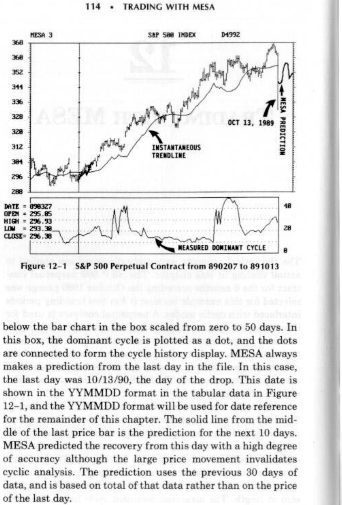
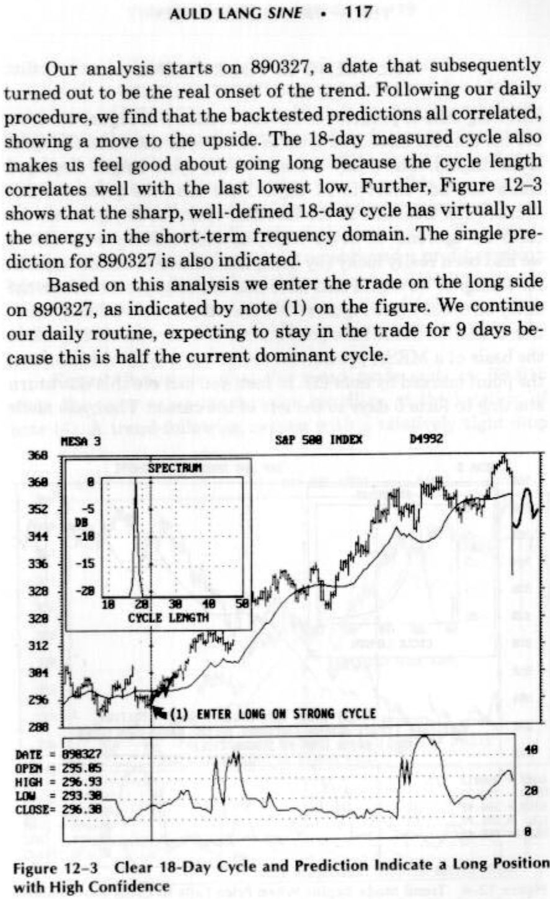
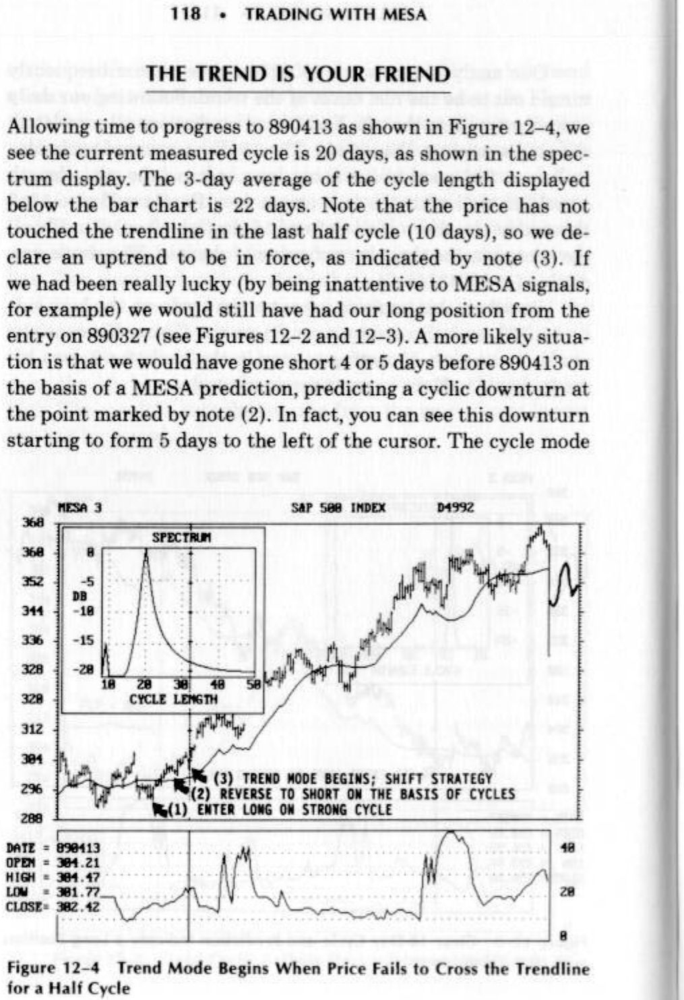
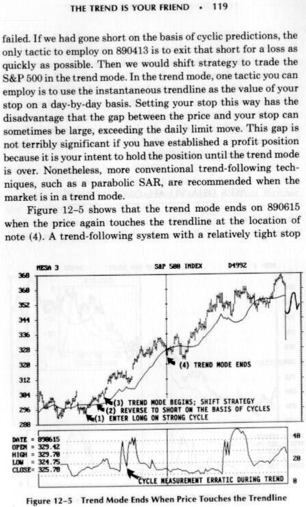
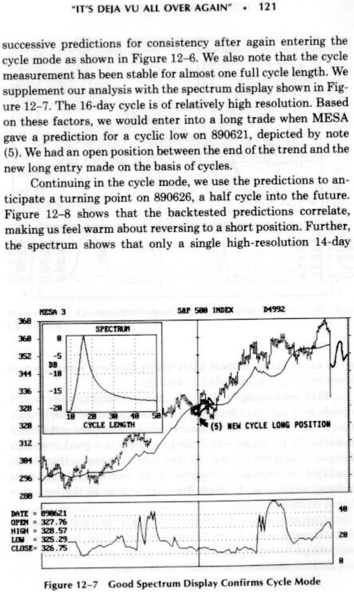
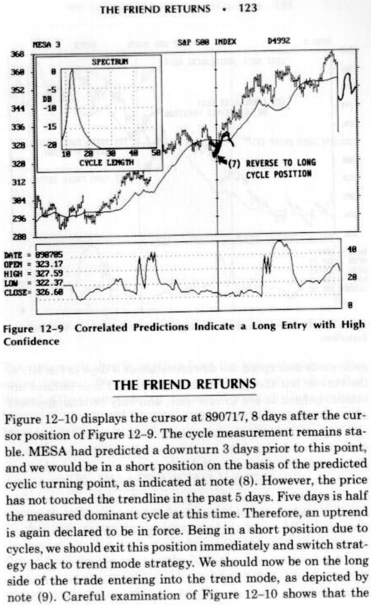
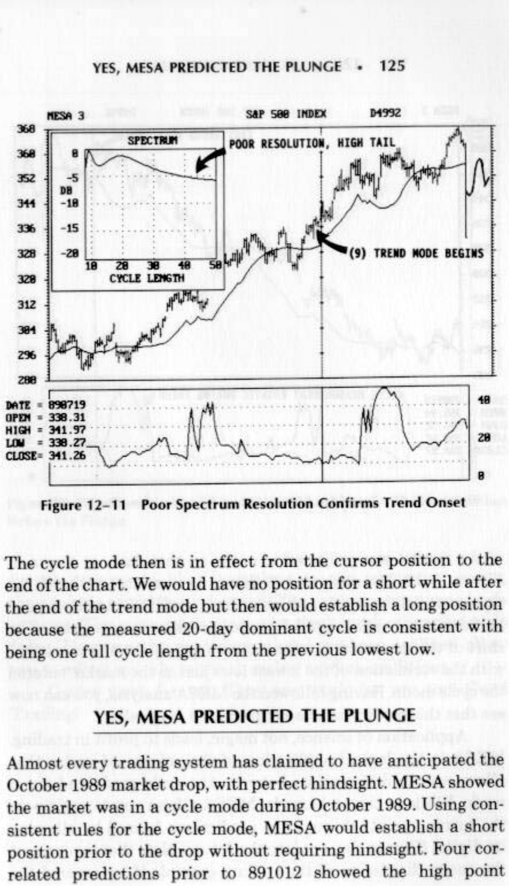
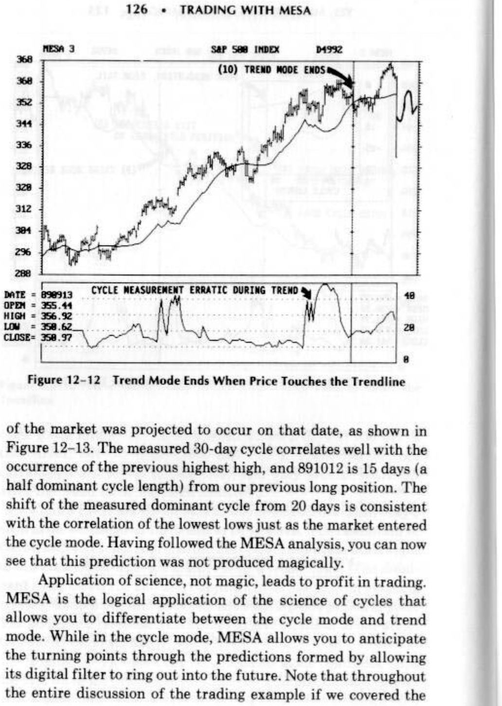
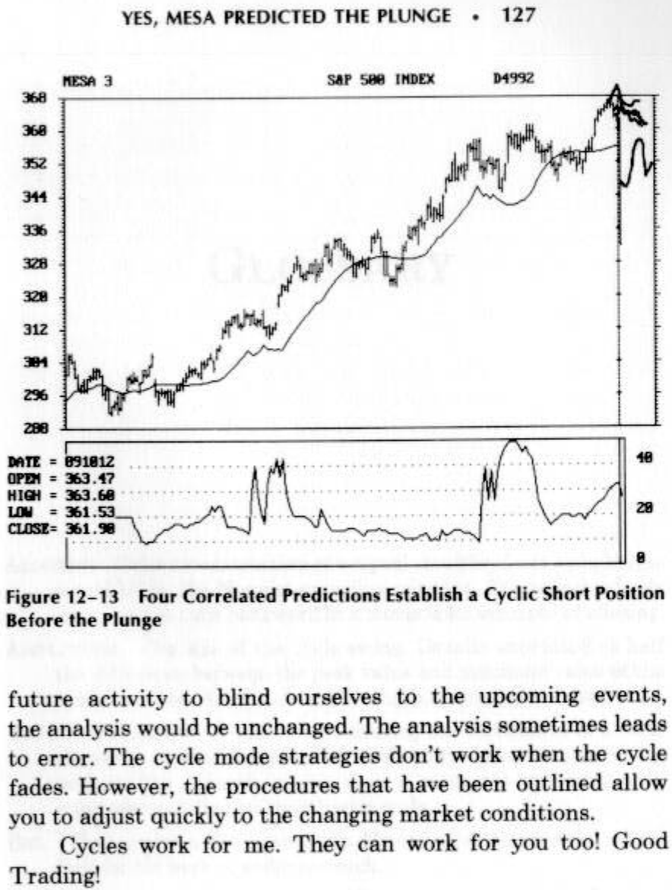

# TRADING WITH MESA

*Figure 12-1 is representative of a typical MESA display.*

12

TRADING WITH MESA

The theoretical concepts previously discussed are applied to
actual trading in this chapter. The S&P 500 perpetual con-
tract for the 6 months preceding the October 1989 plunge was
selected for this example because it has two trending periods
interlaced with cyclic modes. A perpetual contract is used for
illustration to obtain a single contiguous example with repre-
sentative daily ranges over the entire time span. Actual con-
tracts are often thinly traded early in their existence, and the
chosen span would have necessarily included such cases if an
actual contract were used. The MESA picture for this period is
shown in Figure 12-1.

The daily price bars are plotted in the conventional manner, run-
ning from the low of the day to the high of the day. A tick on the
left of the bar denotes the opening price and the tick on the right
of the bar indicates the closing price for that day. The instanta-
neous trendline is overlaid on the price history so you can relate
the price action to this trendline. We will discuss this relation-
ship at length. The measured dominant cycle length is shown

*Figure 12-1 S&P 500 Perpetual Contract from 890207 to 891013*

MESA 3 S&P See INDEX b4g32

Sag Re ERR EE REE

below the bar chart in the box scaled from zero to 50 days. In
this box, the dominant cycle is plotted as a dot, and the dots
are connected to form the cycle history display. MESA always
makes a prediction from the last day in the file. In this case,
the last day was 10/13/90, the day of the drop. This date is
shown in the YYMMDD format in the tabular data in Figure
12-1, and the YYMMDD format will be used for date reference
for the remainder of this chapter. The solid line from the mid-
dle of the last price bar is the prediction for the next 10 days.
MESA predicted the recovery from this day with a high degree
of accuracy although the large price movement invalidates
cyclic analysis. The prediction uses the previous 30 days of
data, and is based on total of that data rather than on the price
of the last day.

CHAPTER 11 ISN’T ALWAYS BAD

‘he procedures of the previous chapter are used every day. The
ollowing is the daily routine in trading with MESA.

1. Measure the cyclic content. The dominant cycle and in-
stantaneous trendline are automatically displayed.

2. Determine if the market is in the trend mode or the cycle
mode by counting the daily bars backward from the cur-
rent day, using half the number of the current measured
dominant cycle. If the price has not touched the instanta-
neous trendline over this half-cycle period the market is in
a trend mode. Otherwise, the market is in a cycle mode.

3. If the market is in a trend mode, ignore the predictions and
the spectrum display. Use a trend-following strategy such
as a double moving average or parabolic SAR (Stop And
Reverse) to establish your trades and exits. Ignore cyclic
analysis until the market again enters into the cycle mode.

4. If the market is in a cycle mode, first note if the cycle has
been stable over the most recent half-cycle period. Be wary
of any predictions if this stability does not exist. If the
cycle has been stable, examine the prediction for an up-
coming turning point so you can get prepared for your
trade. Backtest the prediction for the previous 3 to 5 days
to improve the validity of the prediction. Finally, examine
the spectrum to ensure that a high-resolution cycle exists
and to watch for the “tail” lifting off the baseline, fore-
telling the onset of a trend.

AULD LANG SINE

The trading example starts with the S&P 500 in the cycle mode.
Each of the charts describing the analysis are captured from
MESA screen displays. When the cursor is positioned to a point

*Figure 12-2 Good Cyclic Activity During February and March*

on the bar chart, the date and price display in the lower left-hand
corner reflect the data for the position of the cursor. In Figure
12-2 the cursor is moved to 890327. Note that Figure 12-2 is
basically the same as Figure 12-1 with different notation. For
example, the predicted recovery on 891013 has not changed. Fig-
ure 12-2 shows that there was good cyclic activity in February
and March (to the left of the cursor position) because the price
was alternating back and forth across the instantaneous trend-
line. The measured cycle was as low as 10 days during this pe-
riod. You can see these cycles in the price action. Starting at the
leftmost edge of the screen, three successive highest highs and
the two interstitial lowest lows are about 10 days apart. How-
ever, the 10-day cycle fails to continue after the third highest
high. The result is that the spacing from the most recent lowest
low had increased.

RESREREE

*Figure 12-3 Clear 18-Day Cycle and Prediction Indicate a Long Position*

Our analysis starts on 890327, a date that subsequently
turned out to be the real onset of the trend. Following our daily
procedure, we find that the backtested predictions all correlated,
showing a move to the upside. The 18-day measured cycle also
makes us feel good about going long because the cycle length
correlates well with the last lowest low. Further, Figure 12-3
shows that the sharp, well-defined 18-day cycle has virtually all
the energy in the short-term frequency domain. The single pre-
diction for 890327 is also indicated.

Based on this analysis we enter the trade on the long side
on 890327, as indicated by note (1) on the figure. We continue
our daily routine, expecting to stay in the trade for 9 days be-
cause this is half the current dominant cycle.

8

368

32

4

336

328

328

wz

wat

236

788
DATE = 696327 48
OPEN = 295.65
HIGH = 296.53
Low = 233. 28
CLOSE= 296.38

with High Confidence

*Figure 12-4 Trend Mode Begins When Price Fails to Cross the Trendline*

THE TREND IS YOUR FRIEND

Allowing time to progress to 890413 as shown in Figure 12-4, we
see the current measured cycle is 20 days, as shown in the spec-
trum display. The 3-day average of the cycle length displayed
below the bar chart is 22 days. Note that the price has not
touched the trendline in the last half cycle (10 days), so we de-
clare an uptrend to be in force, as indicated by note (3). If
we had been really lucky (by being inattentive to MESA signals,
for example) we would still have had our long position from the
entry on 890327 (see Figures 12-2 and 12-3). A more likely situa-
tion is that we would have gone short 4 or 5 days before 890413 on
the basis of a MESA prediction, predicting a cyclic downturn at
the point marked by note (2). In fact, you can see this downturn
starting to form 5 days to the left of the cursor. The cycle mode

BESRER EK

IFT STRATEGY
BASIS OF CYCLES

for a Half Cycle

*Figure 12-5 shows that the trend mode ends on 890615*

failed. If we had gone short on the basis of cyclic predictions, the
only tactic to employ on 890413 is to exit that short for a loss as
quickly as possible. Then we would shift strategy to trade the
S&P 500 in the trend mode. In the trend mode, one tactic you can
employ is to use the instantaneous trendline as the value of your
stop on a day-by-day basis. Setting your stop this way has the
disadvantage that the gap between the price and your stop can
sometimes be large, exceeding the daily limit move. This gap is
not terribly significant if you have established a profit position
because it is your intent to hold the position until the trend mode
is over. Nonetheless, more conventional trend-following tech-
niques, such as a parabolic SAR, are recommended when the
market is in a trend mode.

when the price again touches the trendline at the location of
note (4). A trend-following system with a relatively tight stop

INS; SHIFT STRATEGY
OM THE BASIS OF CYCLES
CYCLE

Pease p Re EERE HER

*Figure 12-6 Predictions Are Consistent in New Cycle Mode*

probably would have had us exit the long trade before MESA
declares the trend to be at an end. Note that the dominant cycle
measurement has spikes, indicative of an erratic measurement,
while the trend mode is in force. This erratic cyclic behavior
when the market is in the trend mode is the reason we ignore
all cyclic outputs, such as the prediction. The dominant cycle
measurements calm down and again become consistent near the
end of the trend mode. Since the dominant cycle measurement
has more stability near the end of the trend mode, we can have
greater confidence in the MESA predictions.

“IT’S DEJA VU ALL OVER AGAIN”!
Mal Edie te ia erent eae el

We arrived at the cycle mode again, and so we initiate our daily
procedures again. Following the daily procedure, we tested

MESA 3 SaP S86 INDEX pes92

PR ER KERR EK

is

*Figure 12-6 shows that the backtested predictions correlate,*

“IT’S DEJA VU ALL OVER AGAIN” + 121

successive predictions for consistency after again entering the
cycle mode as shown in Figure 12-6. We also note that the cycle
measurement has been stable for almost one full cycle length. We
supplement our analysis with the spectrum display shown in Fig-
ure 12-7. The 16-day cycle is of relatively high resolution. Based
on these factors, we would enter into a long trade when MESA
gave a prediction for a cyclic low on 890621, depicted by note
(5). We had an open position between the end of the trend and the
new long entry made on the basis of cycles.

Continuing in the cycle mode, we use the predictions to an-
ticipate a turning point on 890626, a half cycle into the future.
making us feel warm about reversing to a short position. Further,
the spectrum shows that only a single high-resolution 14-day

(5) MEW CYCLE LOWG POSITION

pease gpk ER ER ERES

*Figure 12-8 Cycle Mode Continues*

PRRSRC SSR REE

DATE = 698626 8
OPEN = 334.33
HIGH = 334.94
Low = 332.69.
CLOSE= 333.31

cycle exists at the current time. Using all these signals, we go
short on 890626 as indicated by note (6).

Still continuing in the cycle mode, a turning point to the
upside is anticipated for 890705 on the basis of MESA predic-
tions. Figure 12-9 shows the backtested predictions correlate to
improve the probability that the prediction is a good one, with
the entry depicted at note (7). The spectrum shows that meas-
ured cycle still has high resolution and the cycle length has been
reduced slightly to 12 days. We now reverse to the long side
based on this analysis.

Also note that the predictions in Figure 12-9 indicate a
cyclic turning point about 6 days into the future. At this point
we anticipate staying in the long position for about 6 days, half
the current, measured dominant cycle length.

*Figure 12-9 Correlated Predictions Indicate a Long Entry with High*

*a(7) REVERSE TO LONG
CYCLE POSITION

one

tte oe ee

Confidence

THE FRIEND RETURNS

sor position of Figure 12-9. The cycle measurement remains sta-
ble. MESA had predicted a downturn 3 days prior to this point,
and we would be in a short position on the basis of the predicted
cyclic turning point, as indicated at note (8). However, the price
has not touched the trendline in the past 5 days. Five days is half
the measured dominant cycle at this time. Therefore, an uptrend
is again declared to be in force. Being in a short position due to
cycles, we should exit this position immediately and switch strat-
egy back to trend mode strategy. We should now be on the long
side of the trade entering into the trend mode, as depicted by
note (9). Careful examination of Figure 12-10 shows that the

*Figure 12-10 New Trend Mode Begins When Price Fails to Cross the*

124 +» TRADING WITH MESA

NESA 3 SaP S88 INDEX pess2
368
368
382
44 (8) FORECASTED ExIT
OW LONG CYCLE POSITION
336
28 y (9) TRENO MODE BEGINS;
SHIFT STRATEGY
328
312 (7) LOMG CYCLE ENTRY
34
2%
288
DATE =
OPEN =
HIGH =
Low =
CLOSE=

Trendline

cycle mode attempted the downturn about 3 days to the left of
the cursor, but the cycle mode had failed. These failures are
extremely hard to see in real time, and only become apparent
after the trend mode has been identified.

days after we declared the trend to be in force. The resolution of
the measured cycles is dreadful. This poor resolution adds vigor
to our conviction that the market is in a trend mode. The domi-
nant cycle below the bar chart appears to be stable even entering
into the trend mode, but the resolution during this period is poor.
The poor cycle resolution continues to give strength to our selec-
tion of the trend strategy.

890913, when the price again touches the trendline. Measurement
of the dominant cycle is erratic during this trend mode period.

*Figure 12-11 Poor Spectrum Resolution Confirms Trend Onset*

YES, MESA PREDICTED THE PLUNGE + 125

Perse pp HER NEE RES

The cycle mode then is in effect from the cursor position to the
end of the chart. We would have no position for a short while after
the end of the trend mode but then would establish a long position
because the measured 20-day dominant cycle is consistent with
being one full cycle length from the previous lowest low.

YES, MESA PREDICTED THE PLUNGE

Almost every trading system has claimed to have anticipated the
October 1989 market drop, with perfect hindsight. MESA showed
the market was in a cycle mode during October 1989. Using con-
sistent rules for the cycle mode, MESA would establish a short
position prior to the drop without requiring hindsight. Four cor-
related predictions prior to 891012 showed the high point

*Figure 12-12 Trend Mode Ends When Price Touches the Trendline*

126 * TRADING WITH MESA

MESA 3 ‘SaP SOB INDEX bassz

BRRSRESRR ERE E

CYCLE WEASUREMENT ERRATIC DURING TREND

5g
enn
:

et,
IksSt

of the market was projected to occur on that date, as shown in
occurrence of the previous highest high, and 891012 is 15 days (a
half dominant cycle length) from our previous long position. The
shift of the measured dominant cycle from 20 days is consistent
with the correlation of the lowest lows just as the market entered
the cycle mode. Having followed the MESA analysis, you can now
see that this prediction was not produced magically.

Application of science, not magic, leads to profit in trading.
MESA is the logical application of the science of cycles that
allows you to differentiate between the cycle mode and trend
mode. While in the cycle mode, MESA allows you to anticipate
the turning points through the predictions formed by allowing
its digital filter to ring out into the future. Note that throughout
the entire discussion of the trading example if we covered the

*Figure 12-13 Four Correlated Predictions Establish a Cyclic Short Position*

YES, MESA PREDICTED THE PLUNGE + 127

ESA 3 SaP S88 INDEX passz

fsa pape e ee RE RES

Before the Plunge

future activity to blind ourselves to the upcoming events,
the analysis would be unchanged. The analysis sometimes leads
to error. The cycle mode strategies don’t work when the cycle
fades. However, the procedures that have been outlined allow
you to adjust quickly to the changing market conditions.

Cycles work for me. They can work for you too! Good
Trading!
