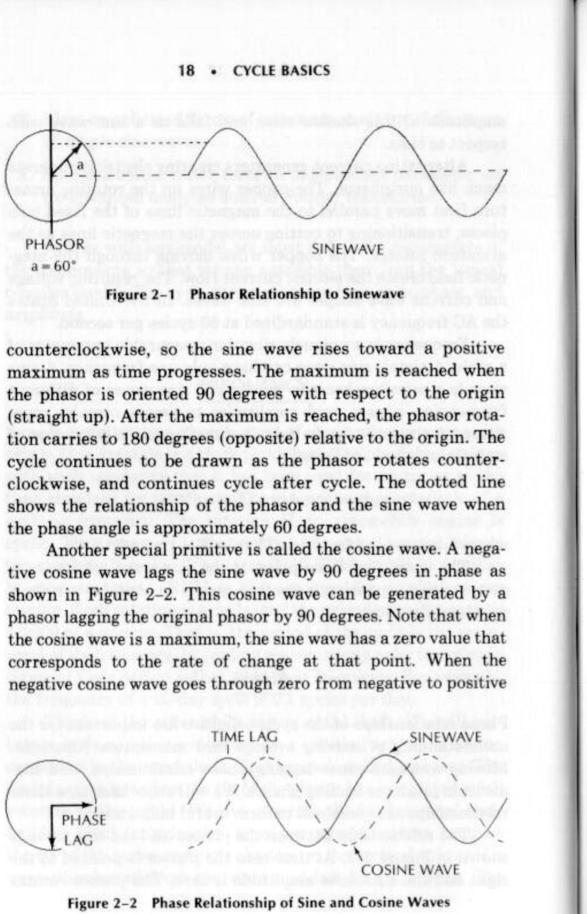

# CYCLE BASICS

suggests there are times the market prices can be described by
the diffusion equation and other times when the market prices
can be described by the telegrapher’s equation.

The challenge for technical traders is to recognize when the
short-term cycles are present and to trade them in a logical and
consistent manner so these cycles can contribute profitably to
the bottom line.

In the chapters that follow I will define the basics of cycles
and how to manipulate them to tune the momentum and moving
average functions—components of every technical trading indi-
cator. Cycle primitives will even be related to traditional chart-
ing patterns, perhaps giving these patterns a whole new meaning
to you. Perhaps most importantly, I will discuss when to use
cycles for trading and when to avoid their use.

2

CYCLE BASICS

The one thing on which market technicians agree is that the
market varies. Precisely how it varies is the matter of the con-
tinuous debate. Each of the technical trading techniques, from
classical chart patterns to Elliott’s wave, construct a simplified
model of the market. Each technique describes the market in
terms of the model parameters. The parameters are then ad-
justed to describe the current market conditions and further
used to extrapolate and predict future market activity. Cycle
analysis is no different.

Cycles are a simplified technical model of the market. The
model is at least as complex as most other models because sev-
eral cycles can coexist; cycles are often mixed with noise, and
all the cycles ebb and flow with time. The primitive component
of complex cycles is the sine wave. The sine wave is the natural
cycle primitive for several reasons:

1. The sine wave is the mathematically smoothest waveform
describing a cycle and harmonic motion.

2. More complicated forms of waves are made up of the sums
of simple sine waves.

3. Sine and cosine waves form an independent parameter set
for advanced analyses such as Fourier transforms.

Just as with any model, we must define the parameters of
the components so that we can assemble them into the logical
complex model. The cycle parameters are frequency, phase, and
amplitude.

FREQUENCY

A cycle is any process where a point of observation returns to its
origin. One example is a clock pendulum. The pendulum swings
with such regularity that it has been used for centuries as the
time standard for the clock. Thus, a prime characteristic of a
cycle is frequency. The rotation of an automobile engine is
cyclic. The frequency is the number of revolutions per minute
the crankshaft makes. The term 2000 RPM should be familiar
to most motorists. RPM is the acronym for revolutions per
minute. Each rotation is a cycle, and the period of such a cycle is
1/2000 of a minute. That is, the period of the cycle is the recip-
rocal of its frequency. In trading we commonly refer to cycles in
terms of their period rather than their frequency. For example,
the frequency of a 10-day cycle is 0.1 cycles per day.

Think of the automobile engine crankshaft. We will pic-
ture a cycle as being generated by a rotating arrow, or vector,
connected to the crankshaft. This arrow is called a phasor. The
cycle is complete when the tip of the phasor has completed a full
rotation to the origin. We can generate the fundamental cycle
building block, or primitive, from our rotating arrow. Imagine
the tip of the arrow casting a shadow on the vertical axis as if it
were illuminated from the right and left by flashlights. The

amplitude of this shadow rises and falls as a sine wave with
respect to time.

Alternating current generators creating electricity operate
much like our phasor. The copper wires on the rotating arma-
ture first move parallel to the magnetic lines of the fixed pole
pieces, transitioning to cutting across the magnetic lines as the
armature rotates. The copper wires moving through the mag-
netic field create the electric current flow. The resulting voltage
and current wave shapes are sine waves. In the United States
the AC frequency is standardized at 60 cycles per second.

Frequency is a uniquely singular measurable parameter of
acycle. A simple sine wave can have only one frequency. A sine
wave is a primitive because we can add sine waves of different
frequencies, phases, and amplitudes to create complex wave
shapes. A sine wave can be described mathematically in terms of
an infinite power series as

$$sin(x) =x —x°/3!+x°/5!-\frac{x7}{7}!+ ...$$

where ! denotes the factorial. That is, 5!=1*2*3*4*5.
The simplified description of the sine wave relative to a

power series expansion is another reason to consider it to be a
primitive function.

PHASE

Phase relationships of the cycle primitive are important for the
understanding of moving average and momentum functions.
Moving averages cause lagging phase relationships, and mo-
mentum produces leading phases. We will show later how these
relationships are combined to form useful indicators.

The relationship between the phasor and the sine wave is
shown in Figure 2-1. At time zero the phasor is pointed to the
right and the sine wave amplitude is zero. The phasor rotates

*Figure 2-1 Phasor Relationship to Sinewave*

PHASOR
a= 60°

SINEWAVE

counterclockwise, so the sine wave rises toward a positive
maximum as time progresses. The maximum is reached when
the phasor is oriented 90 degrees with respect to the origin
(straight up). After the maximum is reached, the phasor rota-
tion carries to 180 degrees (opposite) relative to the origin. The
cycle continues to be drawn as the phasor rotates counter-
clockwise, and continues cycle after cycle. The dotted line
shows the relationship of the phasor and the sine wave when
the phase angle is approximately 60 degrees.

Another special primitive is called the cosine wave. A nega-
tive cosine wave lags the sine wave by 90 degrees in phase as
shown in Figure 2-2. This cosine wave can be generated by a
phasor lagging the original phasor by 90 degrees. Note that when
the cosine wave is a maximum, the sine wave has a zero value that
corresponds to the rate of change at that point. When the
negative cosine wave goes through zero from negative to positive

UME iN SINEWAVE

PHASE
LAG

\
COSINE WAVE

values, it has the maximum rate of change and this is just where
the sine wave has its maximum amplitude. The sine wave has its
largest negative value just when the negative cosine wave
crosses through zero from positive to negative and its negative
rate change is maximum. Thus, Figure 2-2 qualitatively shows
that the rate change of a negative cosine wave is a sine wave and
the rate change of a sine wave is just a cosine wave.

AMPLITUDE

Amplitude is the strength or “power” of the cycle. Power is inde-
pendent of frequency and phase. The size of a light bulb in your
house is, perhaps, 60 watts. This is the rating for the power it
consumes to generate light. The power has no phase angle and is
independent of the 60 cycle frequency of the voltage on your lines.
In fact the power is proportional to the square of the voltage due
to a physical law called Ohm’s law. Squaring the voltage phasor
means multiplying it by itself in the same direction, regardless of
the phase angle. Thus, the phase angle has no meaning in the
definition of power.

It is important to note that the power of a cycle is propor-
tional to the square of its wave amplitude. If one wave is 1.414
(square root of 2) times larger than another, this wave will have
twice the power.

Power can vary over a wide range, and we often want to
look at the low-amplitude signals at the same time that we look
at the high-amplitude signals. One way to do this is to look at
the power of the signals on a logarithmic scale to achieve the
amplitude compression. If we take a given power as a reference,
then a signal having twice the power has a logarithmic ratio of
0.3. A signal power four times larger has a logarithmic ratio
of 0.6, twice the value of the previous ratio, When the signal
power is 10 times larger, the logarithmic ratio is 1.0. The num-
bers repeat for each tenfold increase in power. For example, the
logarithm of 20 is 1.3.

Power is often expressed in terms of deciBels. The Bel is
named after Alexander Graham Bell for the research he per-
formed on audio power to help the deaf. A Bel is just the
logarithm of a power ratio. Deci- is a prefix meaning one tenth.
Therefore, a deciBel is one tenth of the logarithm of a power
ratio. The power ratios can be both larger and smaller than
unity. If the power ratio is less than one, the sign of the loga-
rithm is negative. For example, a power ratio of 0.5 is equiva-
lent to —3 dB and a power ratio of 0.01 is equivalent to —20 dB.
Recalling that the square of the wave amplitude is proportional
to power, we can calculate that —-6 dB means that the wave
amplitude is half the amplitude of the reference wave.

It is common practice in spectrum analysis to compare all
the cycle amplitudes with the amplitude of the strongest signal.
Therefore, the strongest signal has a power of zero dB because it
is being compared with itself (the logarithm of 1 is zero), and all
other signals have powers measured in negative deciBels.

3

PRINCIPLES OF CYCLES

Traditional charting is an analytical technique that is difficult
to master because of the large number of rules associated with
the chart patterns. The charts are laboriously prepared and
often look as if they were works of art. The beauty of cycle
analysis is that it cuts through all these rules by describing the
market action in terms of primitives. Once you understand the
cyclic activity, the result of combinations of the primitives will
become clear to you.

All market chart formations can be described in terms of
only three principles of cycles:

1. Principle of proportionality.
2. Principle of superposition.

3. Principle of resonance.

PRINCIPLE OF PROPORTIONALITY

The principle of proportionality is simply that the cycle ampli-
tudes are in proportion to the selected time scale. Figures 3-1
