# Chapter  3: Principles Of Cycles

Traditional charting is an analytical technique that is difficult to master because of the large number of rules associated with the chart patterns. The charts are laboriously prepared and often look as if they were works of art. The beauty of cycle analysis is that it cuts through all these rules by describing the market action in terms of primitives. Once you understand the cyclic activity, the result of combinations of the primitives will become clear to you.

All market chart formations can be described in terms of only three principles of cycles:

1. Principle of proportionality.
2. Principle of superposition.
3. Principle of resonance.

## PRINCIPLE OF PROPORTIONALITY

The principle of proportionality is simply that the cycle ampli-
tudes are in proportion to the selected time scale. Figures 3-1
and 3-2 represent the bar charts for the same commodity with
the time and price scales removed. Which is the weekly chart
and which is the daily chart? You simply can’t tell by casual
observation because of the principle of proportionality. This
principle has also become an important factor in the more re-
cent fractal mathematics.

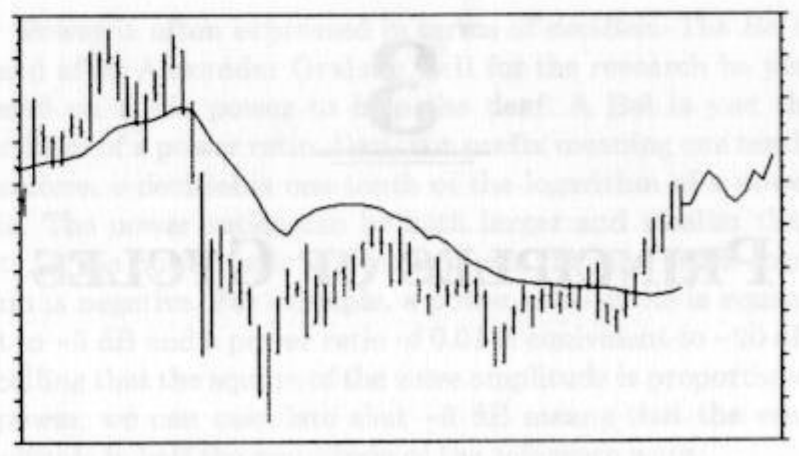

**Figure 3-1** *Weekly or Daily Chart?*

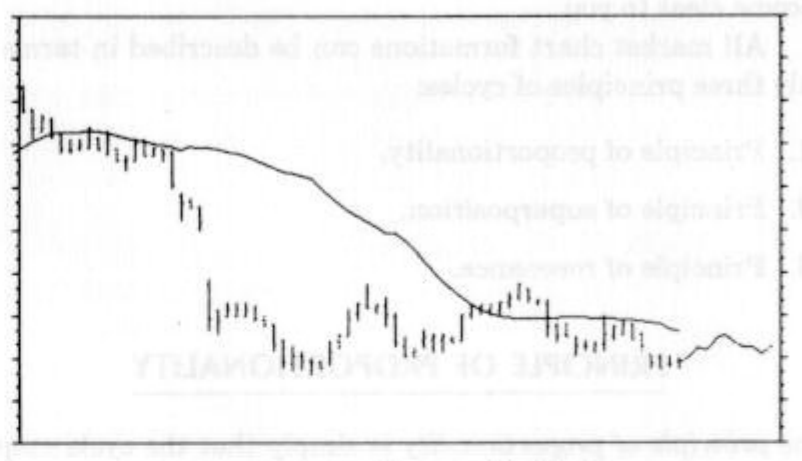

**Figure 3-2** *Weekly or Daily Chart?*

Another way to convince yourself that the principle of proportionality holds is to assume that it doesn’t, and then test the result. Suppose we had wild hourly swings that far exceeded the day-to-day variations. If that were true, the daily charts would have a virtually horizontal average and the daily ranges would fill the chart. This clearly is not the case, and so the failure of the assumption validates the principle of proportionality.

## PRINCIPLE OF SUPERPOSITION

The principle of superposition asserts that we can build complex shapes from the primitive building blocks. If you have ever watched waves on the water, you have seen the total wave action is the summation of waves from several sources. For example, the wake of a boat combines with wind-driven waves to lap at the dock.

We can use the cycle primitives to synthesize more complex wave shapes. Suppose we start with a sine wave whose angular frequency is w and subtract from it another sine wave at twice the frequency at half amplitude. Then we add another sine wave at three times the frequency with one third the amplitude. The three primitive sine wave components are shown in Figure 3-3, and the resulting composite waveform is shown in Figure 3~4.

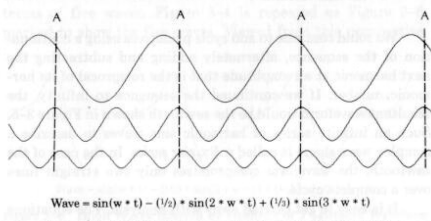

**Figure 3-3** *Individual Components of a Sawtooth Waveform*

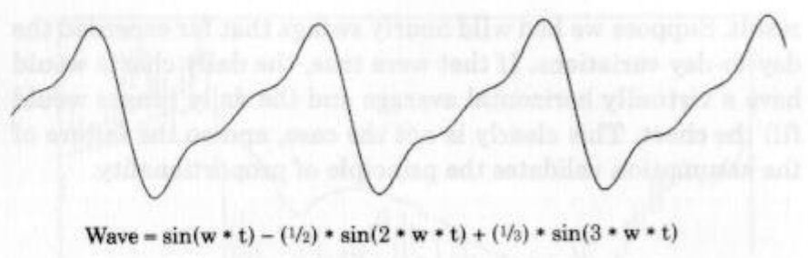

**Figure 3-4** *Sawtooth Waveform Synthesized from First Three Sinewave*

The waves are nearly in phase at the points marked A, while they add and subtract differently at other parts of the cycle. The composite waveform repeats with the period of the fundamental frequency because all the components are harmonically related (their frequency is an integer multiple of the fundamental frequency). The composite repeats itself cycle after cycle.

The mathematical expression for the Figure 3-4 composite waveform is

$$Wave = \sin(\omega t) — \frac{1}{2}\sin(2 \omega t) + \frac{1}{2}\sin(3 \omega t)$$

where $\omega$ = the angular frequency of the fundamental, t =the time variable.

We could continue to add cycle primitives using a continuation of the sequence, alternately adding and subtracting the next harmonic at an amplitude that is the reciprocal of its harmonic number. If we continued the sequence to infinity, the resultant waveform would be the sawtooth shown in Figure 3-5. Such an infinite series of harmonic sine waves to describe a complex wave shape is called a Fourier series. In the case of the sawtooth, the waveform compromises only two straight lines over a complete cycle.

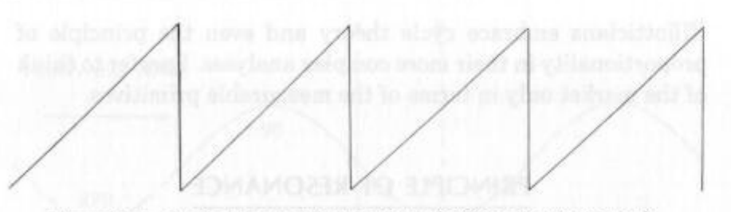

**Figure 3-5** *Perfect Sawtooth Waveform (Infinite Fourier Series)*

It is easy to get carried away with analysis. The equations for the straight lines in a sawtooth are simple. Describing the sawtooth in terms of cycles, we have an infinite Fourier series. In turn, each sine wave can be described as an infinite power series, making analysis untenable. The point is that we must always use the right tool for the job. If we want to approximately describe a waveform in terms of its measurable cycle primitives, then cycles are the right tool to use.

The cycle primitives do not have to be harmonically related. For example, the common biorhythms are just the superposition of 28-, 30-, and 32-day sine waves. Mystical powers are often attributed to this superposition of nonharmonic sine waves. The patterns appear to be unique because true repetition occurs only about every 10 years, the product of the lowest common factors of their cycle periods.

In another example of complex waves closer to trading, followers of the Elliott wave theory describe the market in terms of five waves. Figure 3-4 is repeated as Figure 3-6, marked to show the five waves. Viewed from this perspective, Elliotticians embrace cycle theory and even the principle of proportionality in their more complex analyses. I prefer to think of the market only in terms of the measurable primitives.

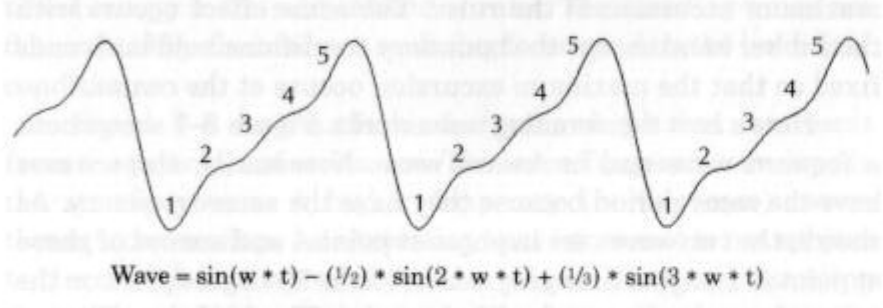

**Figure 3-6** *Elliott Waves Inferred by  Synthesis of a Sawtooth Waveform from  the First Three Terms of the Fourier Series*

## PRINCIPLE OF RESONANCE

Have you ever strummed a stretched rubber band and watched it oscillate? Have you ever held a ruler over the edge of a desk, pulled down on the loose end, and released it to watch the ruler vibrate? These are two examples of resonance. The items oscillate at a frequency determined by the restoring forces and the boundary conditions. The maximum excursions of the oscillations can be described as a standing wave.

When you throw a pebble into a pond of still water, the waves travel outward until they strike an object like a wall, whereupon they are reflected. Much the same thing happens with resonance. When you deflect the ruler you put energy into it. The wave travels down the ruler when you release it, but there is no place for the energy to go when the wave reaches the desk, and so the wave is reflected back. The wave now travels toward the free end, causing it to move. But when the wave reaches the free end there is no place for the energy to go, and so it is reflected back again. The process continues with waves traveling in both directions on the ruler. The forward and back waves combine to form the standing wave that you see as the maximum excursion of the ruler. The same effect occurs with the rubber band except the boundary conditions hold both ends fixed so that the maximum excursion occurs at the center.

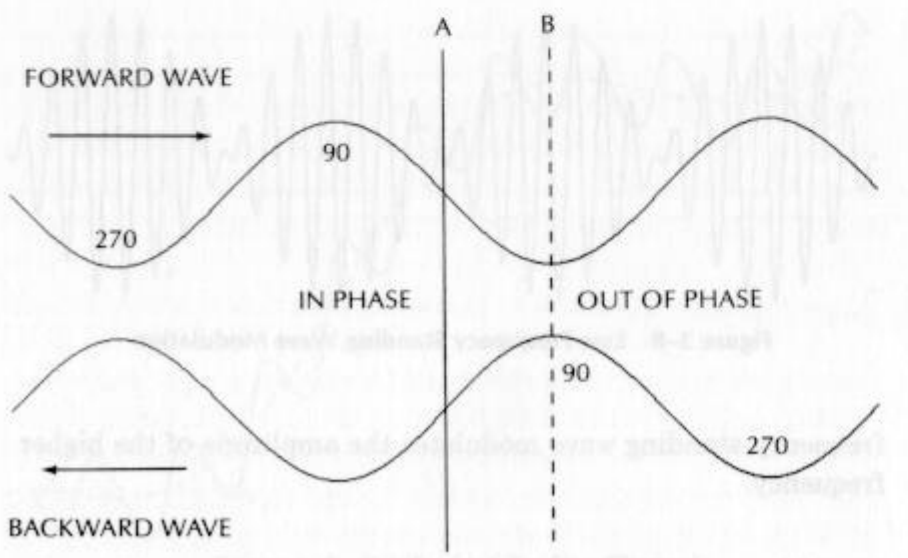

**Figure 3-7** *Traveling Waves*

Here’s how the standing wave works. Figure 3-7 shows both a forward wave and backward wave. Necessarily, these waves have the same period because they have the same frequency. As shown, the two waves are in phase at point A and are out of phase at point B. Imagine time progressing so the 90-degree point on the forward wave arrives at the fixed point A. The 90-degree point of the backward wave arrives at the fixed point A simultaneously with that of the forward wave so that the effects of the two waves at point A are additive. Because both waves arrive at point A in phase throughout the cycle, the additive action is independent of time. In exactly the same way, the forward wave and backward wave are always out of phase at point B, and the two waves cancel each other independently of time.

The only reason that the standing waves diminish with time is because energy is lost to audio energy or to molecular frictional energy in the rubber band or ruler. The standing waves are determined by the inherent restoring forces and by the boundary conditions.

Figure 3-8 depicts the kind of wave shape that can result from the principle of resonance. The lower frequency envelope is the standing wave. A higher frequency (in this case) moves through the envelope as a traveling wave because it is not subject to the same boundary conditions as a lower frequency standing wave. That is, its energy is transferred into the future or absorbed rather than being reflected. In this way, the lower frequency standing wave modulates the amplitude of the higher frequency.

**Figure 3-8** *Low Frequency Standing Wave Modulation*

## SYNTHESIZED CHART PATTERNS

We can synthesize a wide variety of chart patterns using only the three principles of proportionality, superposition, and resonance. Analysis is the inverse operation of synthesis, so that if we understand synthesis we have a greater insight into analysis techniques and procedures. While synthesis is relatively easy, analysis is very difficult because of the wide range of parameter combinations that must be accommodated. We often perform analysis by making simplifying assumptions and then testing these assumptions.

### Trading Channels

Trading channels are synthesized using the principles of proportionality and superposition. We use the following three primitives:

1. Trend (a piece of a large amplitude long cycle).
2. Medium-length cycle of medium amplitude.
3. Short-term cycle of small amplitude.

When we add these three components, the resultant is the waveform shown in Figure 3-9. The trading channels are simply the maximum and minimum excursions of the short-term cycle when it is combined with the other two cycle components. In this case the “channel” is bent with the medium-length cycle rather than being constructed from straight lines.

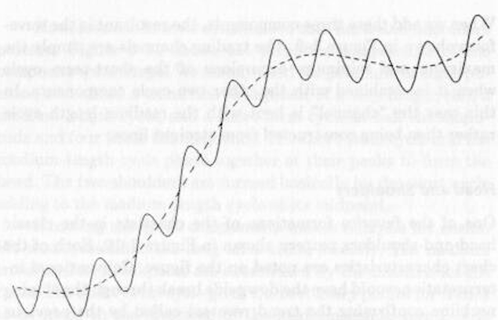

**Figure 3-9** *Synthesized Trading Channel*

### Head and Shoulders

One of the favorite formations of the chartists is the classic head-and-shoulders pattern shown in Figure 3-10. Each of the chart characteristics are noted on the figure. Conventional interpretation would have the downside break through the sloping neckline confirming the trend reversal called by the previous breakthrough of the uptrend line. Even the return move followed by further downside activity is indicated.

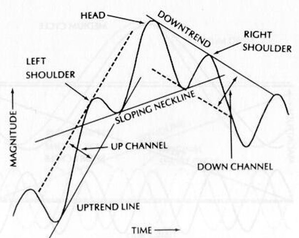

**Figure 3-10** *Head-and-Shoulders Pattern*

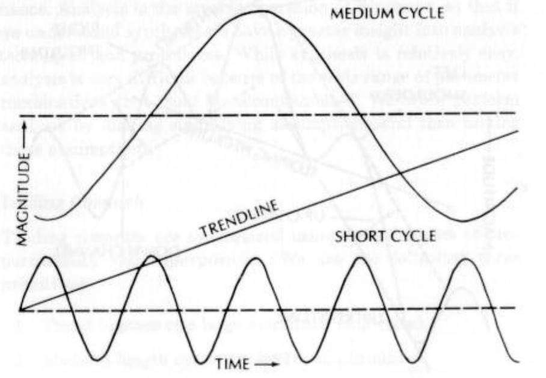

**Figure 3-11** *Cyclic Components of Head-and-Shoulders Pattern*

Now, let’s see how we synthesized that head-and-shoulders pattern. Figure 3-11 shows the primitive components of the composite wave shape. We simply used the principle of superposition and added a trend line (a segment of a very long cycle), a medium-length cycle, and a short-term cycle at half the amplitude and four times the frequency. The short-term cycle and the medium-length cycle phase together at their peaks to form the head. The two shoulders are formed basically by the short cycle adding to the medium-length cycle at its midpoint.

Knowing the cyclic components makes analysis far easier. We would establish the long-term trend directly. The medium trend and its breakpoint are established by the medium-length cycle. The short-term cycle gives the best entry points for trades to be made in the direction of the medium-length trend. It is clear that the probability of a profitable trade is best if you enter using the short-term cycle with the trade in the direction of the medium cycle. Trades where the two cycles conflict in direction should be avoided. That’s about all there is to it, using the primitives. No complicated rules to learn, just trade the cycles you measure.

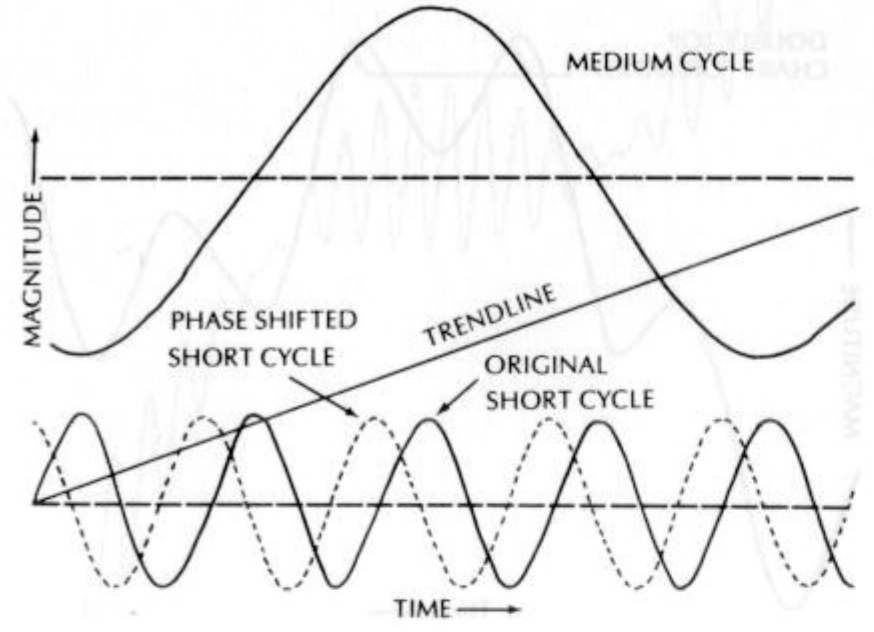

**Figure 3-12** *Relative Phase of Shifted Short Cycle*

### Double Top

What happens to the chart pattern of Figure 3-10 if we simply leftshift the phase of the short cycle by 120 degrees? This case is shown in Figure 3-12, where the original phase of the short cycle is shown as the solid line and the shifted phase as the dotted line. Now when we invoke the principle of superposition, the peaks of the short cycle add to the medium cycle on either side of its peak. The result is the double top pattern of Figure 3-13.

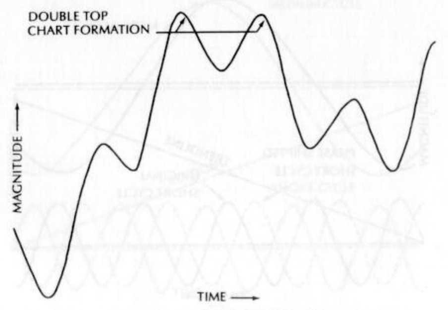

**Figure 3-13** *Double Top Formation*

Using cyclic analysis and knowing the primitive components, there is no change in our trading strategy. We still enter on the turning points of the short term cycle in the direction of the medium length cycle. There are no new rules to learn, and we treat a double top formation exactly the same way we treat a head-and-shoulders formation.

### Flags and Pennants

All these chart patterns are characterized by the top and bottom envelopes of the price action not being parallel, as opposed to the parallel boundaries of a trading channel. The schematic of a typical pennant is shown in Figure 3-14. Conventional wisdom has the price continuing in the same direction after the flag as it was before the flag occurred. This may or may not be true, and we can quickly isolate when it will be true using cycles.

**Figure 3-14** *Continuation Pennant*

Figure 3-8 shows a nonparallel envelope due to the principle of resonance. If we now invoke the principle of superposition and the principle of proportionality, we can generate the pennant by adding a trend, a medium-length cycle traveling wave, and a short term cycle modulated by the medium-length cycle standing wave. Using these components depicted in Figure 3-15, the conventional wisdom prevails and the price rise continues after the pennant.

However, if we double the length of the medium-length cycle and double its amplitude (principle of proportionality) and eliminate the trendline, the primitive components of the pennant are shown in Figure 3-16. In this case, the price reverses after the pennant because the trend is replaced with the stronger cycle. The schematic of the total price is shown in Figure 3-17. We still have virtually the same pennant we had in Figure 3-14, but reading the pennant as a continuation signal is dead wrong. Had we known the cycle primitives, the price direction at the end of the flag could have easily been predicted.

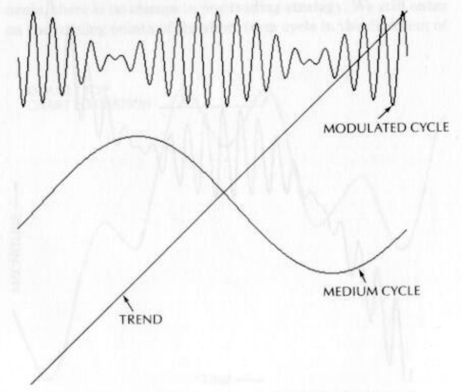

**Figure 3-15** *Primitive Components of a Continuation Pennant*

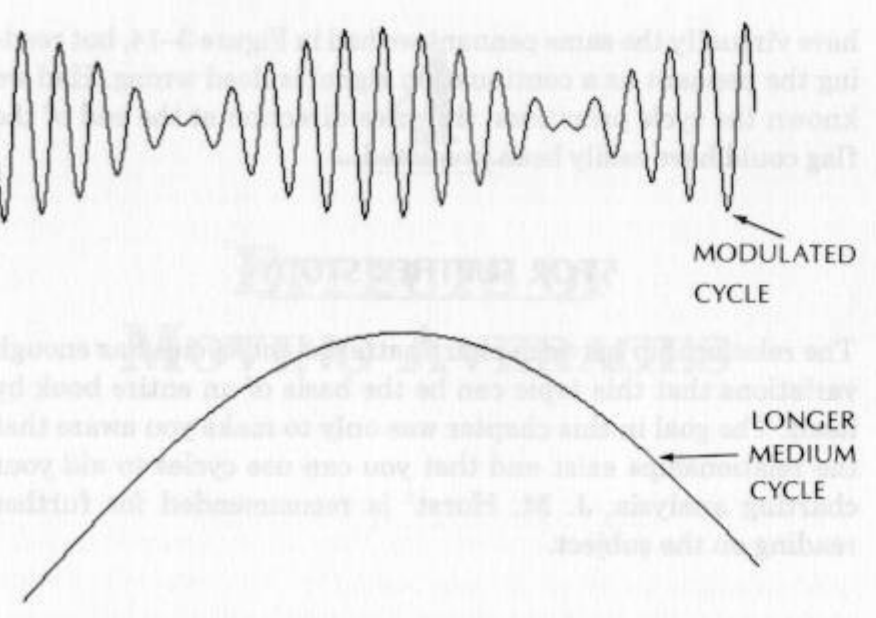

**Figure 3-16** *Primitive Components of a Reversal Pennant*

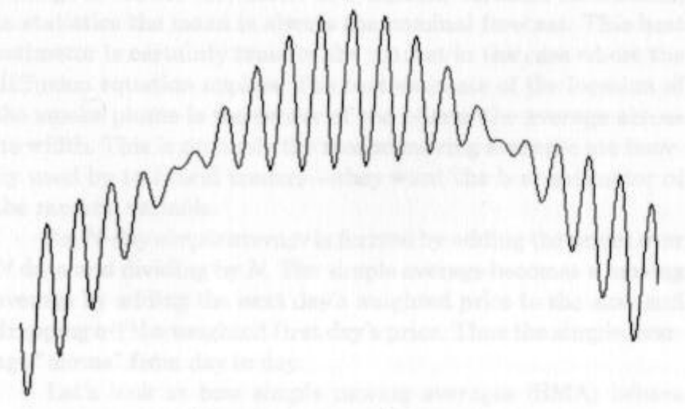

**Figure 3-17** *Reversal Pennant*

## FOR FURTHER STUDY

The relationship between chart patterns and cycles has enough variations that this topic can be the basis of an entire book by itself. The goal in this chapter was only to make you aware that the relationships exist and that you can use cycles to aid your charting analysis. J. M. Hurst$^1$ is recommended for further reading on the subject.
