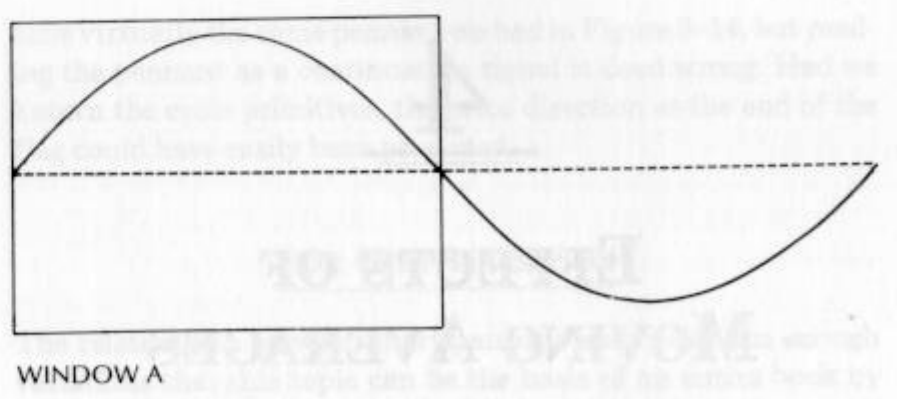
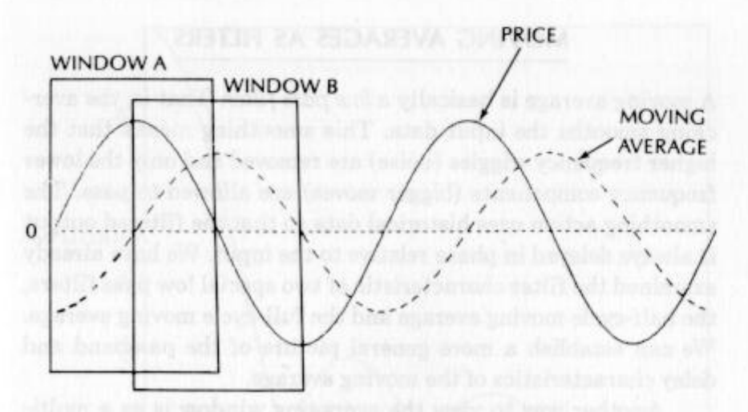
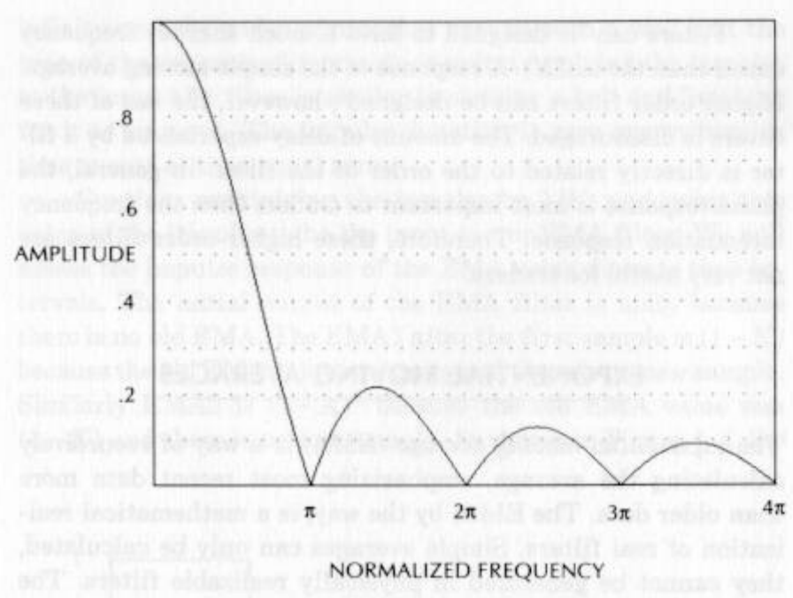
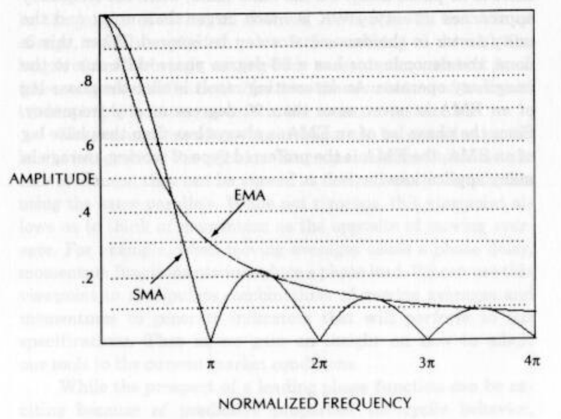

# Chapter 4: Effects Of Moving Averages

## SIMPLE MOVING AVERAGES

Several hundred years ago Karl Friedrich Gauss proved that the average is the best estimator of a random variable. As a result, in statistics the mean is always the nominal forecast. This best estimator is certainly true for the market in the case where the diffusion equation applies. The best estimate of the location of the smoke plume is the center of the plume, the average across its width. This is probably the reason moving averages are heavily used by technical traders—they want the best estimator of the random variable.

An N-day simple average is formed by adding the prices over N days and dividing by N. The simple average becomes a moving average by adding the next day’s weighted price to the sum and dropping off the weighted first day’s price. Thus the simple average “moves” from day to day.

**Figure 4-1** *Half Cycle Average Window*

Let’s look at how simple moving averages (SMA) behave with cycles. With reference to Figure 4-1, we will take an average of all the sampled points of the sine wave in window A. Window A covers half a cycle. If the window were wider, it would include some negative values of the sine wave and the peak value of the moving average would be reduced. On the other hand, if the window were narrower, all values in the positive alternation would not be included in the window. Therefore, a simple moving aver- age of half the cycle length has special significance.

Referencing the moving average to the right-hand side of the window, the moving average is maximum at point A in Figure 4-2. As we move the window to the right in our mind’s eye, we start to include some negative values of the sine wave in the moving average. Therefore, the moving average amplitude declines. When the right-hand edge of the window reaches position B, there are just as many negative values inside the window as positive values. The result is that the moving average has a zero value at position B. We can continue to move the window, creating the moving average shown as the dashed line.

**Figure 4-2** *Half Cycle Moving Average*

We can make some observations about a half-cycle moving average of a sine wave. First, the shape of the moving average is a negative cosine wave. From the phasor discussion in Chapter 2, you recognize that the half-cycle moving average lags the sine wave by exactly 90 degrees. The trendline for the sine wave is zero, so we can observe that the sine wave price function reaches its maximum just as the half-cycle moving average crosses the trendline from bottom to top. Similarly, the price function just reaches its valley as the half-cycle moving average crosses the trendline from top to bottom.

Another special simple moving average is one taken over the full period of the cycle. In this case there are just as many positive values in the window as negative values. The result is that this moving average is always zero, regardless of the phase angle position of the window. If the price consists of a trendline plus the sine wave, the full-cycle moving average removes the cycle part and retains the trendline.

The action of the half-cycle and full-cycle moving averages suggests a trading system. You would sell when the half-cycle moving average crosses the full-cycle moving average from bottom to top because this is where the sine wave has its peak value. You would buy when the half-cycle moving average crosses the full-cycle moving average from top to bottom because this is where the sine wave has its lowest value. Note that these trading tules are exactly the opposite of the rules for short and long moving averages in trend-following systems.

## MOVING AVERAGES AS FILTERS

A moving average is basically a low pass filter. That is, the averaging smooths the input data. This smoothing means that the higher frequency wiggles (noise) are removed and only the lower frequency components (bigger moves) are allowed to pass. The smoothing action uses historical data so that the filtered output is always delayed in phase relative to the input. We have already examined the filter characteristic of two special low pass filters, the half-cycle moving average and the full-cycle moving average. We can establish a more general picture of the passband and delay characteristics of the moving average.

Another way to view the averaging window is as a multiplier in the time domain. The sampled data are multiplied by one for all values inside the window and are multiplied by zero for all values outside the window. In the case of continuous time, the multiplier is a rectangular pulse of unit amplitude in the time domain. The Fourier transform of a rectangular function like the multiplier is sin(X)/X, where X is a generalized frequency variable. The frequency response is the Fourier transform of the time function, so the frequency response of the moving average is just sin(X)/X. This sin(X)/X function first goes to zero when X = Pi (Pi = 3.14159). We also know the filter response is zero when the window length is a full cycle. Equating these two conditions, we find that

$$X = \pi \frac{cycle\ period}{window\ length}$$

The filter has a zero response each time the cycle period is a multiple of the window length because there are as many positive values as negative values of the sine wave within the window. The amplitude response of the simple moving average low pass filter is shown in Figure 4~3.

**Figure 4-3** *SMA Frequency Response*

The value of sin(X)/X approaches unity as X approaches zero because sin(X) is approximately equal to X for small values of X. Therefore, very low-frequency components such as trendlines are passed through the filter virtually unattenuated. In the special case of the half-cycle moving average, the numerator of the moving average filter is unity because $\pi/2$ radians is equal to 90 degrees. The denominator is just Pi/2, and since this value is in the denominator, the filter response is its reciprocal, 2/Pi = .637. That is, the filtered amplitude of a sine wave signal whose period is half the window length will be .637 times the amplitude of the sine wave. The sin(X)/X functions allow us to calculate the filtered amplitude of any signal as a function of the ratio of its period to the averaging window length.

The phase response of a simple average is linear. We know that a half-cycle moving average is delayed by 90 degrees. From the linearity condition, we know that a quarter-cycle moving average is delayed by 45 degrees and so forth. The shorter the moving average relative to the cycle period the less lag will be induced. Of course, you also get less filtering but that’s how filters and Mother Nature work.

Filters can be designed to have a much sharper frequency cutoff than the sin(X)/X response of the simple moving average. Higher order filters can be designed’; however, the use of these filters is discouraged. The amount of delay experienced by a filter is directly related to the order of the filter. In general, the phase response is more important to traders than the frequency attenuation response. Therefore, these higher order filters are  not very useful for traders.

## EXPONENTIAL MOVING AVERAGES

The exponential moving average (EMA) is a way of recursively calculating the average, emphasizing most recent data more than older data. The EMA, by the way, is a mathematical realization of real filters. Simple averages can only be calculated, they cannot be generated in physically realizable filters. The equation for the EMA is

$$NEW EMA = (1-K) (OLD\ EMA) + K (NEW\ SAMPLE)$$

where K is a constant < 1.

In words, this equation says that today’s EMA is formed by taking a fraction of today’s data and adding it to the compliment of the fraction multiplying yesterday’s EMA. The equation is convergent when K is less than one because if the data input becomes constant, the value of the EMA approaches that constant. Consider the case where all the new samples are unity. The EMA starts with a zero value, and gradually builds up to almost unity. When this occurs the equation for the NEW EMA is approximately

$$NEW\ EMA = (1-K) + K = 1$$

Since the EMA is a kind of moving average, it is also a low pass filter. A common way to characterize filters is by their impulse response. An impulse is a mathematical function that is infinitely high and has zero width. The height approaches infinity and the width approaches zero in such a way that the area of the conceptual rectangle is unity. Applying the impulse to the input of a filter is similar to striking a bell and listening for it to ring out. The impulse function is zero everywhere in time except at time equal zero.

**Figure 4-4** *EMA Filter Impulse Response*

Consider multiplying the impulse by 1/K, and using this value of the impulse to be the input to our EMA filter. We will assess the impulse response of the EMA using discrete time intervals. The initial output of the EMA filter is unity because there is no old EMA. The EMA1 after the first sample is (1 — K) because the old EMA value was unity and there is no new sample. Similarly EMA2 is (1-—K)* because the old EMA value was (1-K) and there is no new sample. As shown in Figure 4-4, the decay of the response to the impulse falls as the exponent of the trial. That is, the EMA has an exponential decay. Now it’s easy to see how the exponential moving average got its name. The rate of the decay depends on the K factor.

We can derive the equivalence between an EMA and a SMA using a specific value of K. To do this, we first equate the finite impulse response to an exponential for the Nth sample as

$$(1 - K)^N = \exp(-\alpha N)$$

where $\alpha$ is a constant to be found.

Taking the natural logarithm of both sides of this equation, we have

$$N \ln(1-K) = -\alpha N$$
$$\ln(1- K) = -\alpha$$

Expanding the natural logarithm to an infinite series we have

$$\ln(1 — K) = -K - \frac{K^2}{2} - \frac{K^3}{3} - \frac{K^4}{4} ...$$

When K is small, we can ignore all but the first term, and equating $\ln(1 — K)$ in the preceding two equations, we have the result that

$$K = \alpha$$

Since N is proportional to time, the impulse response of the EMA filter is just ,(—Kt). The Fourier transform (the frequency response) of an exponential function, normalized for unity transfer response at zero frequency, is

$$H(W) = \frac{K}{K +jW}$$

where $W = 2\pi frequency$, j = imaginary operator, a 90-degree shift

$$H(W) =1/(1+\frac{jW}{K}).$$

We note that the X in the sin(X)/X SMA function is $\pi$ times the frequency times the SMA period. In the EMA frequency response the variable is $2\pi$ times the frequency normalized to K. Equating the frequency variables, we have

$$\pi \cdot F \cdot Window = 2 \pi \frac{F}{K}$$

Performing the algebra, we obtain the result that

$$K = \frac{2}{Window}$$

**Figure 4-5** *EMA/SMA Frequency Response Comparison*

The amplitude response of the EMA as a function of frequency is compared with the amplitude response of the SMA in Figure 4-5. Equivalence between SMA and EMA is subject to definition. For example, if we force the amplitude response of the two filters to be the same when half the cycle period is equal to the window length, then the relationship for the EMA K factor is approximately

$$K =\frac{2.5}{Window}$$

Hutson$^1$ derived the relationship between the EMA K factor and the SMA window length as

$$K = \frac{2}{Window + 1}$$

This definition is based on the average age of each. Note that this definition is substantially the same as the first definition derived except for the shortest window lengths.

Examination of the H(jW) frequency response gives insight into the phase delay of an EMA. When the frequency is near zero, j}W/K is much smaller than unity and can be ignored. In this case the output is almost the same as the input, and there is no phase delay. On the other hand, when the frequency approaches infinity, ;W/K is much larger than unity and the unity factor in the denominator can be ignored. When this is done, the denominator has a 90-degree phase shift due to the imaginary operator. An interesting result is that the phase lag of an EMA is never more than 90 degrees at any frequency. Since the phase lag of an EMA is always less than the phase lag of an SMA, the EMA is the preferred type of moving average in many applications.
