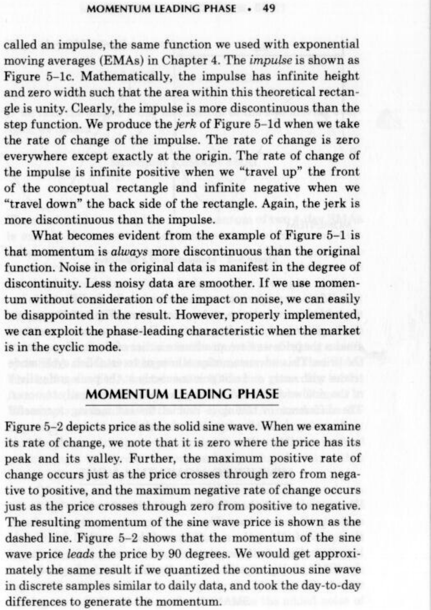
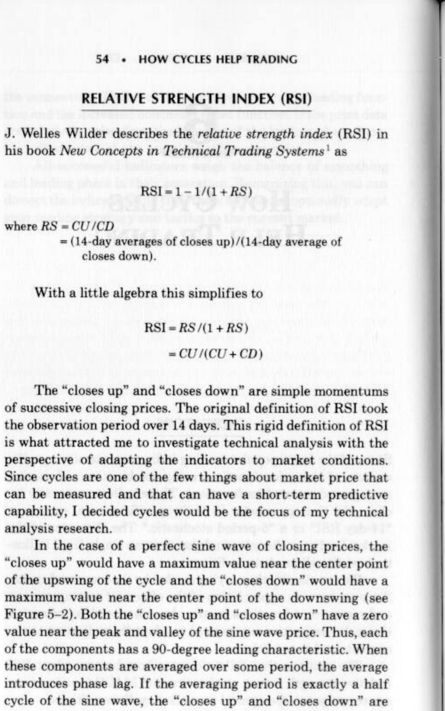

# MESA IN ACTION

to the window length, then the relationship for the EMA K
factor is approximately

$$K =2.\frac{5}{Window}$$

Hutson? derived the relationship between the EMA K fac-
tor and the SMA window length as

$$K = 2/(Window + 1)$$

This definition is based on the average age of each. Note that
this definition is substantially the same as the first definition
derived except for the shortest window lengths.

Examination of the H(jW) frequency response gives in-
sight into the phase delay of an EMA. When the frequency is
near zero, j}W/K is much smaller than unity and can be ignored.
In this case the output is almost the same as the input, and
there is no phase delay. On the other hand, when the frequency
approaches infinity, ;W/K is much larger than unity and the
unity factor in the denominator can be ignored. When this is
done, the denominator has a 90-degree phase shift due to the
imaginary operator. An interesting result is that the phase lag
of an EMA is never more than 90 degrees at any frequency.
Since the phase lag of an EMA is always less than the phase lag
of an SMA, the EMA is the preferred type of moving average in
many applications.

5S

EFFECTS OF MOMENTUM

MOMENTUM DEFINED

In the jargon of technical analysis, momentum is the rate of
change, usually applied to price. It has nothing to do with the
length of time to bring a moving body to rest under constant force
(the mechanical definition). Nor does the momentum of technical
traders imply impetus, as used in the common vernacular.

The summations of moving averages can be viewed as paral-
lels to integrals in the calculus. Since momentum functions are
rate of change, they can be viewed as derivatives in the calculus
using the same parallels. While not rigorous, this viewpoint al-
lows us to think of momentum as the opposite of moving aver-
ages. For example, when moving averages cause a phase delay,
momentum functions can introduce a phase lead. We can use this
viewpoint to manipulate combinations of moving averages and
momentums to generate indicators that will perform to our
specifications. That is, we gain an insight on how to adapt
our tools to the current market conditions.

While the prospect of a leading phase function can be ex-
citing because of predictive properties for cyclic behavior,

*Figure 5-1 Successive Momentum Functions*

48 «+ EFFECTS OF MOMENTUM

Mother Nature strikes again and does not allow us this luxury
without some difficulty. The price data that technical analysts
use are noisy. Momentum amplifies this noise, often so much
that useful indications are completely obscured. Figure 5-1,
showing successive rates of change, demonstrates why the noise
is amplified.

The initial curve is a ramp and is shown in Figure 5-la.
The “origin” is at the center, so the ramp has a zero slope to the
left of the origin and a finite constant slope to the right of
the origin. When we take the rate of change of the ramp, we
obtain the step function, Figure 5-1b. The rate change of the
ramp is zero to the left of the origin and instantly jumps to a
constant value to the right of the origin, producing the step.
Notice that the step appears to be more discontinuous than the
ramp. When we take the rate of the step, it has a zero rate of
change both to the right and left of the origin. There is only a
change exactly at the origin, and this change is infinite because
it occurs over a zero horizontal span. This infinite change is

ORIGIN

c. IMPULSE wegeliinis Sentilles n-ctsieiitaneeittabe

d. JERK —_—_—}—__—_.

a. RAMP

*Figure 5-1 depicts price as the solid sine wave. When we examine*

called an impulse, the same function we used with exponential
moving averages (EMAs) in Chapter 4. The impulse is shown as
and zero width such that the area within this theoretical rectan-
gle is unity. Clearly, the impulse is more discontinuous than the
step function. We produce the jerk of Figure 5-1d when we take
the rate of change of the impulse. The rate of change is zero
everywhere except exactly at the origin. The rate of change of
the impulse is infinite positive when we “travel up” the front
of the conceptual rectangle and infinite negative when we
“travel down” the back side of the rectangle. Again, the jerk is
more discontinuous than the impulse.

What becomes evident from the example of Figure 5-1 is
that momentum is always more discontinuous than the original
function. Noise in the original data is manifest in the degree of
discontinuity. Less noisy data are smoother. If we use momen-
tum without consideration of the impact on noise, we can easily
be disappointed in the result. However, properly implemented,
we can exploit the phase-leading characteristic when the market
is in the cyclic mode.

MOMENTUM LEADING PHASE

its rate of change, we note that it is zero where the price has its
peak and its valley. Further, the maximum positive rate of
change occurs just as the price crosses through zero from nega-
tive to positive, and the maximum negative rate of change occurs
just as the price crosses through zero from positive to negative.
The resulting momentum of the sine wave price is shown as the
dashed line. Figure 5-2 shows that the momentum of the sine
wave price leads the price by 90 degrees. We would get approxi-
mately the same result if we quantized the continuous sine wave
in discrete samples similar to daily data, and took the day-to-day
differences to generate the momentum.

*Figure 5-2 Momentum of a Sinewave*

ZERO RATE

MOMENTUM

MAX RATE

When we properly account for the amplitude differences be-
tween the sine wave price and its momentum, Figure 5-2 suggests
the beginning of a trading system. Each time the momentum
crosses the price we have an advance notice of the turning point of
the price. This advance notice allows us to establish cycle mode
trades with entry and exit points exactly at the peak and valleys
of the sine wave without waiting for the crests actually to occur.
The difference in timing is crucial toward making successful
trades using short-term cycles in the market.

MINIMIZING MOMENTUM NOISE

We can minimize the effects of noise by averaging before we
evaluate the momentum. The averaging smooths the price func-
tion, so that taking the momentum of the smoothed function is
less discontinuous. As an example, a 4-day simple moving aver-
age (SMA) using letters to designate the individual prices is

$$SMA1=(a+b+ce+d)/4$$

The 4-day SMA for the next day is

$$SMA2=(b+c+d+e)/4$$

If we take the simple 1-day momentum of the two moving aver-
ages, we obtain

$$Momentum = SMA2 -SMA1$$

$$=(e-a)/4$$

The result is that a simple 1-day momentum of two 4-day SMAs
is exactly the same as a 4-day momentum within a constant
value of the averaging period. We can extend the logic to the
general case that an N-day momentum is exactly the same as
the simple momentum of two N-day moving averages.

In the case of the sine wave it is natural to question what
happens if we take a half-cycle momentum because this length
has the maximum separation between the peak and valley of the
sine wave. Such a momentum is the equivalent of taking a half-
cycle SMA and then taking the simple momentum of that SMA.
The half-cycle SMA introduces a 90-degree phase lag in the
form of a negative cosine wave, as we described in Chapter 4.
The simple momentum of the half-cycle SMA introduces a 90-
degree phase lead, with the result that the final curve is exactly
back in phase with the original price function. All the work of
performing a half-cycle momentum has produced a curve that
has no advantage toward making a trade.

Of course, we can use different N-day momentums to obtain
a leading function for the sine wave. For example, a quarter-cycle
momentum is equivalent to the simple momentum of a quarter-
cycle SMA. The quarter-cycle SMA has only a 45-degree phase
lag; the simple momentum has a 90-degree phase lead; the result
is a 45-degree phase-leading function. The penalty for this lead-
ing function is that the smoothing accomplished by the shorter
moving average is not adequate to overcome the added noise of

the momentum. We therefore have a trade-off of the leading func-
tion and the increased noisiness of that function. If the price data
are relatively noise-free, the benefits of the leading-phase func-
tion often outweigh the negatives of increase noise.

All successful indicators weigh the balance of smoothing
and leading phase in their generation. Recognizing this, you can
dissect the indicators and tune them so you can optimally adapt
your trading strategy and tactics to the current market.

G

How CYCLES
HELP TRADING

INDICATORS

Some of the more popular trading indicators examine specific
aspects of the price function, using combinations of moving
average and momentum functions. These indicators usually in-
clude the time parameter in their specific names, such as a
“14-day RSI” or a “5-period stochastic.” The character of the
market is always changing and therefore no single fixed indica-
tor best fits all market conditions.

We can classify the varying market by the measured cycles.
Since we have an appreciation of the effects of moving average
and momentum functions on the phase lead and lag of cycles,
the cycle perspective can be used to adapt the indicators to the
current market conditions.

The sections that follow discuss how best to adapt RSI
(relative strength index), stochastics, and MACD (moving aver-
age convergence-divergence) to market cyclic conditions.
