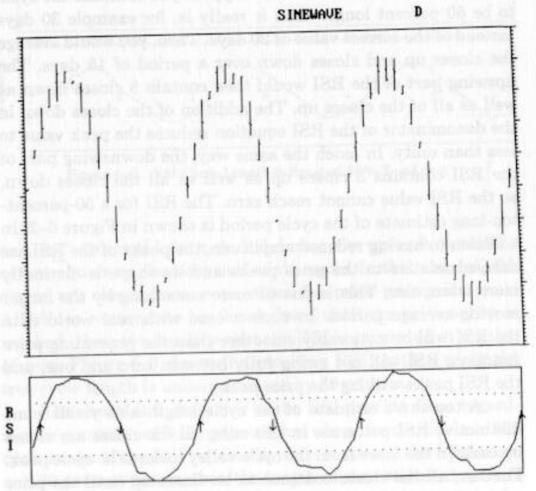
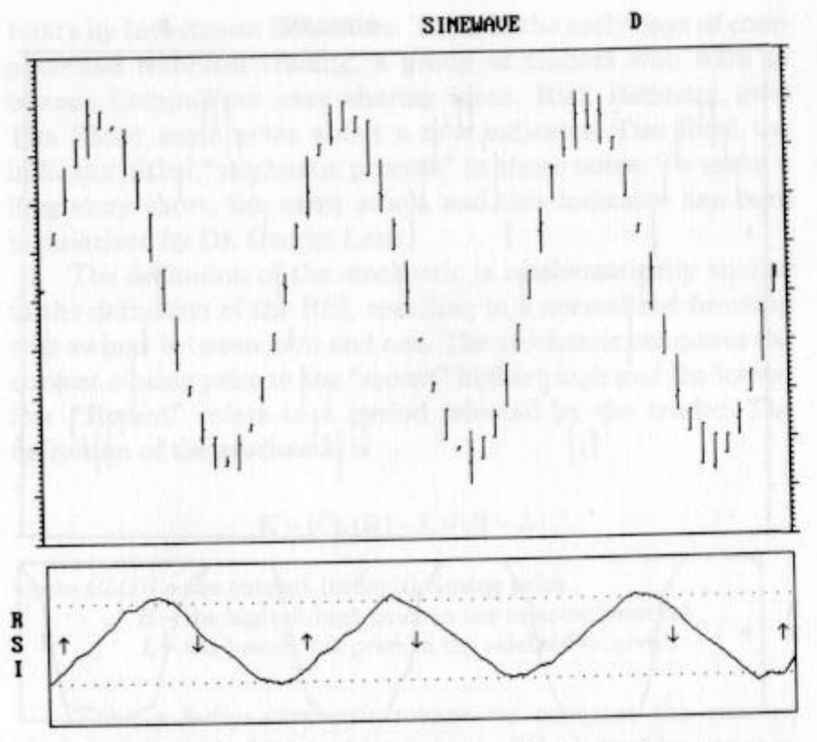
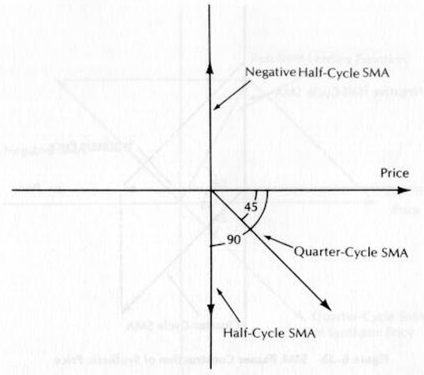
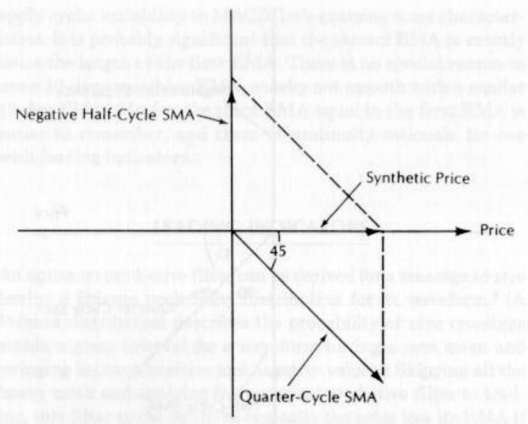
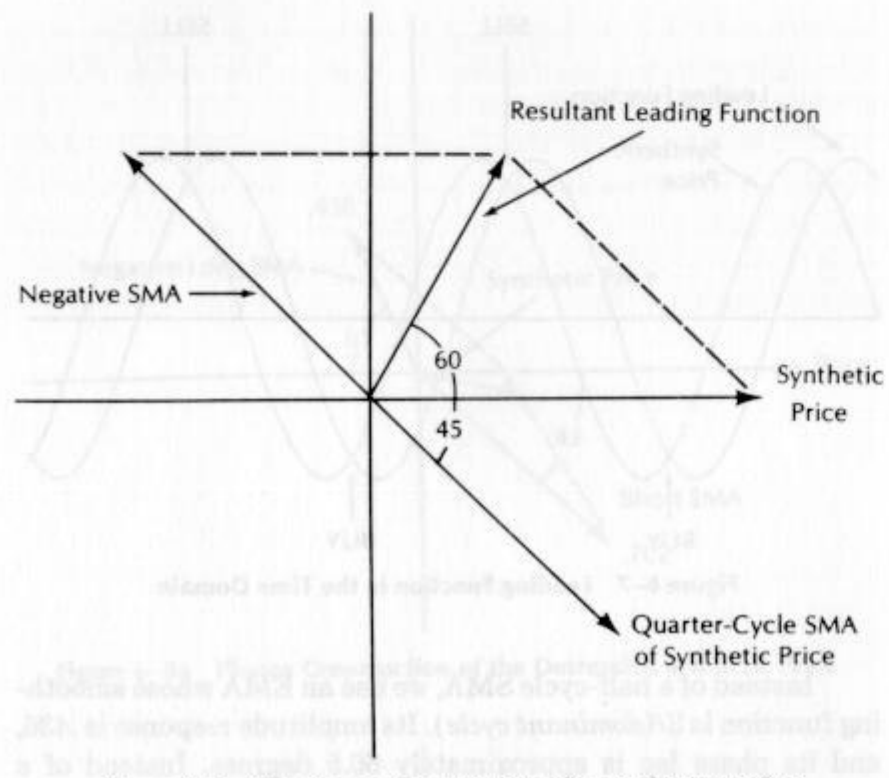
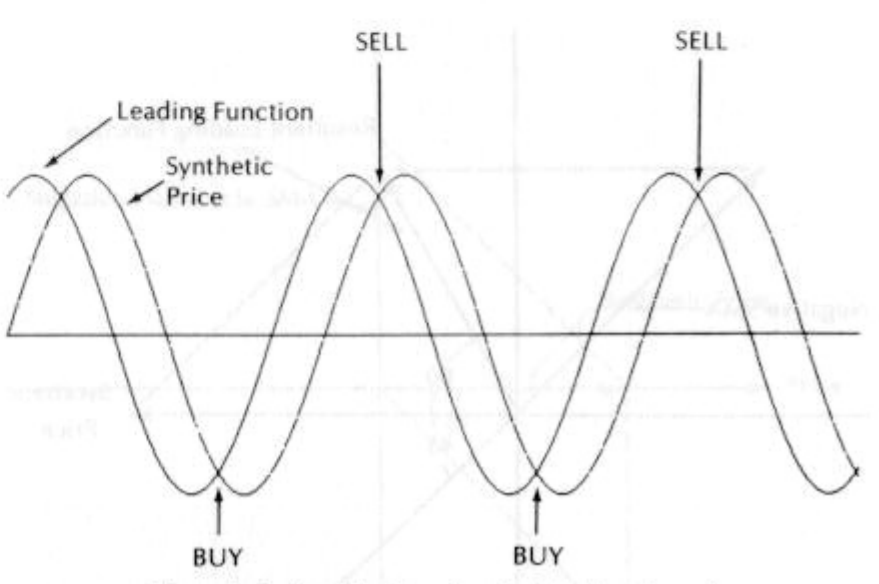
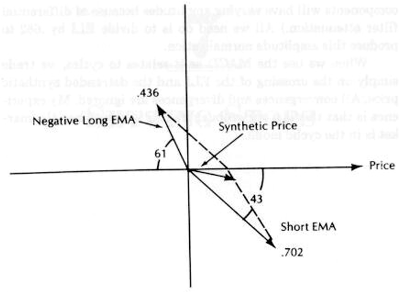
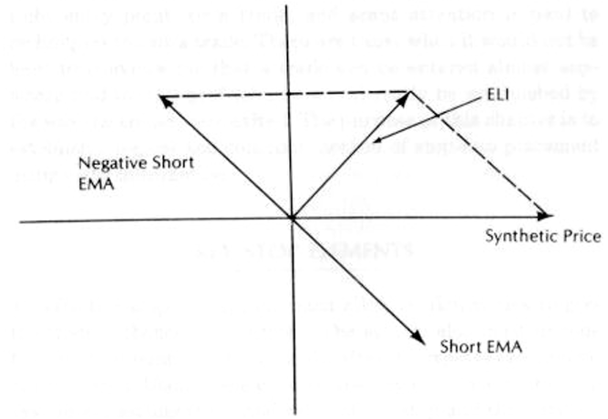

# Chapter 6: How Cycles Help Trading

## INDICATORS

Some of the more popular trading indicators examine specific aspects of the price function, using combinations of moving average and momentum functions. These indicators usually include the time parameter in their specific names, such as a “14-day RSI” or a “5-period stochastic.” The character of the market is always changing and therefore no single fixed indicator best fits all market conditions.

We can classify the varying market by the measured cycles. Since we have an appreciation of the effects of moving average and momentum functions on the phase lead and lag of cycles, the cycle perspective can be used to adapt the indicators to the current market conditions.

The sections that follow discuss how best to adapt RSI (relative strength index), stochastics, and MACD (moving average convergence-divergence) to market cyclic conditions.

## RELATIVE STRENGTH INDEX (RSI)

J. Welles Wilder describes the relative strength index (RSI) in his book New Concepts in Technical Trading Systems$^1$ as

$$RSI =1-\frac{1}{1+RS}$$

where RS = CU/CD = (14-day averages of closes up)/(14-day average of closes down).

With a little algebra this simplifies to

$$RSI = \frac{RS}{1+ RS} = \frac{CU}{CU+CD}$$

The “closes up” and “closes down” are simple momentums of successive closing prices. The original definition of RSI took the observation period over 14 days. This rigid definition of RSI is what attracted me to investigate technical analysis with the perspective of adapting the indicators to market conditions. Since cycles are one of the few things about market price that can be measured and that can have a short-term predictive capability, | decided cycles would be the focus of my technical analysis research.

In the case of a perfect sine wave of closing prices, the “closes up” would have a maximum value near the center point of the upswing of the cycle and the “closes down” would have a maximum value near the center point of the downswing (see value near the peak and valley of the sine wave price. Thus, each of the components has a 90-degree leading characteristic. When these components are averaged over some period, the average introduces phase lag. If the averaging period is exactly a half cycle of the sine wave, the “closes up” and “closes down” are both exactly in phase with the sine wave price. Since all compo- nents of the RSI are in phase with price when the averaging period is a half cycle, the RSI is also exactly in phase with the price under this condition. The RSI swings between zero and one as a perfect sine wave, as shown in Figure 6-1. We can see the logic of this because at the end of the half-cycle upswing there are no closes down, and the value of the RSI is one. At the end of the half-cycle downswing there are no closes up, and the value of the RSI is zero.

**Figure 6-1** *RSI for a 20 Day Sinewave Price*

The most simple BUY indication from the RSI is when the RSI swings below 30 percent and crosses back up through the 30 percent level. Conversely, the SELL indication occurs when the RSI swings above the 70 percent level and then crosses back through it. This is not a particularly good strategy for short cycles. For example, on a 10-day cycle it takes two days from the minimum value to identify a crossing of the 30 percent level. You enter the long position trade on the third day. But the entire move occurs in only 5 days, the half cycle of the 10-day cycle, Since you would also exit the trade late, about the best you could hope for is to break even. This is not true when the RSI is used on longer cycles. When used with longer cycles, the lag between the cycle peak and crossing the 70 percent mark can be viewed as insurance against being whipsawed.

The RSI has some distinctive characteristics when the estimated cycle length used in the calculation is different from the real cycle length. The perfect 20-day cycle data are used to illustrate these characteristics. Suppose you estimate the cycle to be 50 percent longer than it really is, for example 30 days instead of the correct value of 20 days. Then, you would average the closes up and closes down over a period of 15 days. The upswing part of the RSI would then contain 5 closes down as well as all of the closes up. The addition of the closes down in the denominator of the RSI equation reduces the peak value to less than unity. In much the same way, the downswing part of the RSI contains 5 closes up as well as all the closes down, so the RSI value cannot reach zero. The RSI for a 50-percent-too-long estimate of the cycle period is shown in Figure 6-2. In addition to having reduced amplitude, the peaks of the RSI are delayed relative to the price peaks and its shape is distinctly more triangular. This is due to more smoothing by the longer moving-average period. In such a case with real world data the RSI will be noticeably smoother than the generating price function, RSI will not swing fully between zero and one, and the RSI peaks will lag the price peaks.

**Figure 6-2** *RSI Cycle Length Estimated 50% Too Long*

A too-short estimate of the cycle length also yields some distinctive RSI patterns. In this case, all the closes are closes up early in the move from the cycle valley toward the cycle peak. Further, all the closes continue to be closes up until the price peak is reached. The result is that the RSI is stuck at a value of one, or “saturated,” for a period during the upmove. A similar action occurs on the next half of the cycle. In this case, all the closes are closes down soon after the price passes its peak. All closes continue to be closes down until the price valley is reached. Now, the result is that the RSI is saturated at a value of zero. Figure 6-3 shows the resulting RSI pattern when the true cycle length is underestimated by 50 percent.

**Figure 6-3** *RSI Cycle Length Estimated 50% Too Short*

The shape and character of the RSI provide clues regarding the goodness of RSI optimization when the market is in the cycle mode. If the RSI repeatedly fails to exceed the 30 percent and 70 percent points, then the length of the estimated cycle is too long. If the RSI is saturated near one and zero, then the estimated cycle length is too short. In general, it is better to make your estimate of the dominant cycle too long rather than too short. The reason for this is that the longer period tends to smooth the RSI function so that whipsawing is avoided and the entry signals are more reliable.

## STOCHASTIC

A stochastic variable is a random variable that is a function of time. This definition has absolutely nothing to do with a technical trading indicator. The indicator was first developed in the 1960's by Investment Educators. Then, in the early days of computerized technical trading, a group of traders who were to become CompuTrac were sharing ideas. Rick Redmont gave Tim Slater some notes about a new indicator. Tim liked the indicator titled “stochastic process” in those notes. To make a long story short, the name stuck, and this indicator has been popularized by Dr. George Lane.

The definition of the stochastic is mathematically similar to the definition of the RSI, resulting in a normalized function that swings between zero and one. The stochastic compares the current closing price to the “recent” highest high and the lowest low. “Recent” refers to a period selected by the trader. The definition of the stochastic is

$$K=\frac{CL(D)-L}{H-L}$$

where CL(D) =the current (today’s) closing price, H =the highest high price in the selected interval, L = the lowest low price in the selected interval.

Thus a 5-day stochastic means we compare the current closing price to the highest high price and the lowest low price in the past 5 days.

The stochastic can theoretically swing between zero and one. If the current closing price is equal to the highest high, K =1. It cannot be any larger because the numerator of the definition is equal to the denominator. At the other extreme, if the current closing price is equal to the lowest low, the numerator is zero and therefore the stochastic is zero.

Williams’s %R is virtually identical to the stochastic, swinging between one and zero as the stochastic swings between zero and one. Williams’s %R is found by subtracting the stochastic from one as

$$\%R = 1 - K = \frac{H - CL(D)}{H - L}$$

The close similarity between the definition of %R and the stochastic means that when we optimize one for the dominant cycle, the other is also simultaneously optimized. It is not necessary to distinguish between the two.

In the case of pure sine wave, we always find the highest high and the lowest low within a half cycle of the total wavelength at the time the price is at a turning point. A longer observation period only adds redundant information. However, if the observation period is shorter than a half wavelength we have the chance of either underestimating the highest high when the last close is at a price valley or overestimating the lowest low the last close is at a price peak because we don’t reach the true extremes. These situations correspond to those seen in the RSI examples.

With reference to Figure 6-4, the stochastic observation period is a quarter cycle long. At point A, the starting point of the sine function, the current “close” corresponds to the highest high within the observation period, causing the stochastic to have a value of one. The stochastic continues to have a value of (almost) one as time progresses until point B, the peak of the sine wave, is reached. Immediately after point B, the current close is less than the highest high in the observation window, and the stochastic decreases in value. The stochastic (almost) reaches zero when time reaches point C because the current value is also the lowest low during the observation period. The zero value persists until time reaches point D, the price valley. Thereafter, between point D and the next point A, the stochastic rises to its maximum value again, and the cycle repeats. The plot of the stochastic below the sine wave price shows that a too-short estimate results in a saturated stochastic similar to a saturated RSI.

**Figure 6-4** *Quarter Cycle Stochastic*

From the cycle perspective, there is no problem in choosing a too-long observation period for the stochastic because the extra data is purely redundant. Therefore, the stochastic is insensitive to an overestimation of cycle length in a sideways market. A trending market can consist of the superposition of the cycle on the trendline. In this case, a too-long estimate of the cycle period can distort the highest high or the lowest low so that they are no longer related to the cycle. In these cases when the effects of the trend swamp the cyclic effects, the current close can never swing down to the lowest low in uptrends nor can the current close swing up to the highest high in down-trends. Thus, the result of choosing a too-long stochastic observation period in trending markets is that it is biased near unity in uptrends and biased near zero in downtrends. The short deviations from the bias can result in many false entry signals.

## USING RSI AND STOCHASTIC TO READ THE MARKET

You can use a comparison of the RSI and the stochastic to assess the market condition and to optimize your indicator parameters. Both swing as normalized sine waves in phase with a sine wave generating function. Both become saturated when a too-short estimate of the dominant cycle is made. However, the difference between their characteristics when the estimated cycle length is too long can be exploited.

If the estimated cycle length is too long and the market is in a sideways move, the overestimation will have no effect on the stochastic because the extra data beyond a half wavelength are redundant. On the other hand, a length estimate longer than a half wavelength decreases the peak-to-peak swings of the RSI because the extra information makes the RSI less likely to have all the closes up or all the closes down within the observation period. In trending markets the stochastic tends to be stuck near one limit or the other while the RSI tends to be desensitized and doesn’t vary too far from its central value.

Using these clues, the methodology to read the market is to observe RSI and stochastic concurrently, varying the observation period. When the period is less than a half cycle, both will look similar as saturated square waves. Near the half-cycle length both will look sinusoidal. However, as the observation length continues to be increased, the RSI is desensitized and changes its appearance relative to the stochastic. When this occurs, you know too much smoothing is being used and your indicator signals are bound to be too slow.

## MOVING AVERAGE CONVERGENCE/DIVERGENCE (MACD)

MACD was invented by Gerry Appel’ for the stock market because he noted significant market cycles of 12 to 13 weeks and 24 to 28 weeks. Although developed for weekly markets, MACD has been used with the constants unchanged for daily commodity markets! This must be a truly robust indicator since there is no guarantee that there are 13- or 26-day cycles in commodities.

A divergence occurs when the line drawn between successive significant highs of the indicator have a slope opposite thatof the line drawn between significant highs of the price. Divergence can also occur between the lines drawn between the significant lows of the indicator and the price. Convergence occurs when these lines have the same slope, allowing the indicator to reinforce the direction of the price move. | must confess a personal trading weakness. I cannot see convergences and divergences as they develop in real time. When concentrating on trading and trying to estimate what the future will bring, I cannot define to my own satisfaction what constitutes a significant high (or low). Of course, the definition of a significant high is very clear and the convergence or divergence is easy to see in retrospect. Because of this personal weakness, I completely ignore all convergences and divergences in arriving at my trading strategies. I even ignore them in MACD, where they are part of the name.

I was originally attracted to MACD in much the same way I was attracted to RSI. The time constants were rigidly defined, with no apparent adaptation to current market conditions. Cycle theory can also be applied to MACD to improve its efficacy and, in fact, to provide leading signals for cyclic turns.

The traditional MACD starts with a 13-day exponential moving average (EMA), whose smoothing constant is */s=.15 (see Chapter 4 for the significance of this conversion rule). A 26-day EMA is calculated next using a smoothing constant of .075 (2/8 =.075 approximately). The MACD signal is obtained by subtracting the 26-day EMA from the 13-day EMA. The MACD signal is then smoothed by a 10-day EMA (smoothing constant is 2/40 =.2). Ignoring the convergence/divergence interpretations, trading signals are obtained when the MACD signal crosses its function, delayed by EMA smoothing. Before we apply cyclic variability to MACD, let’s examine some characteristics. It is probably significant that the second EMA is exactly twice the length of the first EMA. There is no special reason to use a 10-day smoothing EMA, so why not smooth with a similar 13-day EMA? Having the third EMA equal to the first EMA is easier to remember, and there is continuity rationale for use with leading indicators.

## LEADING INDICATORS

An optimum predictive filter can be derived for a message source having a Poisson probability distribution for its waveform.® (A Poisson distribution describes the probability of zero crossings within a given interval for a waveform having a zero mean and swinging between positive and negative values.) Skipping all the heavy math and applying the optimum predictive filter to trading, this filter turns out to be basically the price less its EMA if the price function is modified to have a zero mean. It’s surprising that such a simple relationship can have predictive capabilities, but this relationship is fruitful when applied to MACD because MACD comprises a combination of EMAs.

Dealing with the nonlinear phase lag of EMAs can be a little complicated, so the idea of creating leading indicators using simple moving averages (SMA) can perhaps be more easily understood. This is because SMAs have a linear phase relationship as a function of the averaging period. From Chapter 4 you recall that the amplitude transfer response of an SMA is sin(X)/X. When the period is a half cycle, X is $\pi/2$. The result is that the half-cycle SMA lags the sine wave price by $\pi/2$, or 90 degrees in phase, and is $2/\pi$=.637 of its amplitude. Because X =Pi/4 for the quarter-cycle SMA, its phase delay is 45 degrees and its amplitude is .900. The phasors for the original sine wave price at the dominant cycle and the half-cycle and quarter-cycle SMAs are shown in Figure 6—5a. We perform the vector subtraction of the half-cycle SMA from the quarter-cycle SMA by reversing its direction and then doing a vector addition. The results of the vector subtraction of the two SMAs are shown in Figure 6-5b.

**Figure 6-5a** *Phasor Diagram for the Quarter-Cycle and Half-Cycle SMAs*

**Figure 6-5b** *SMA Phasor Construction of Synthetic Price*

The amazing conclusion is that the difference of the quarter-cycle SMA and the half-cycle SMA at the dominant cycle is another sine wave almost exactly in phase with the original sine wave price function! Of course, this result does not occur at all frequencies. When the frequency is very low, both SMAs have very little attenuation and phase shift. Therefore, the difference between the two SMAs is almost zero. The result is that the price is detrended by the SMA difference because the trend can be viewed as a very low-frequency cycle component. At higher frequencies, the SMAs are larger fractions of the wavelength and both moving average components are attenuated. (We actually prefer EMAs because at these higher frequencies the phase shift cannot exceed 90 degrees so the two components can never add vectorially. Further, the amplitude functions are smooth so that there is always an amplitude difference.) Since the low-frequency trend is removed, since the in-phase dominant cycle exists, and since the high-frequency components are attenuated by the moving average filters, I like to think of the difference of the two moving averages as a detrended synthetic price.

**Figure 6-6** *SMA Phasor Construction of a Leading Function*

The detrended synthetic price result is even more surprising when we reflect that the in-phase difference is generated from two functions that both lagged the original sine wave price. Recognizing this, and recalling the structure of the optimum predictive filter, if we take a quarter-cycle SMA of the detrended synthetic price and subtract this SMA from the synthetic price as in the phasor diagram of Figure 6-6, we see that the resulting function leads the synthetic price (and hence the original price) by approximately 60 degrees. The relationship of the synthetic price and the leading function in the time domain is shown in Figure 6-7.

Figure 6-7 suggests a trading methodology using the leading indicator. When the indicator crosses the synthetic price from the top, sell on the next period because that period will occur very near the cycle peak. Conversely, buy when the indicator crosses the synthetic price from the bottom. I have immodestly dubbed this indicator the ELI, as an acronym for the Ehlers Leading Indicator. ELI is clearly a specialized formulation of the MACD momentum based on the optimum predictive filter. But being related to both MACD and the optimum predictive filter, ELI is best formulated using EMAs rather than SMAs.

**Figure 6-7** *Leading Function in the Time Domain*

Instead of a half-cycle SMA, we use an EMA whose smoothing function is 3/(dominant cycle). Its amplitude response is .436, and its phase lag is approximately 60.5 degrees. Instead of a quarter-cycle SMA we use an EMA whose smoothing function is twice the value of the first EMA. The amplitude response of this second EMA is .702 and its phase lag is approximately 43 degrees. obtain the detrended synthetic price. It turns out that the phase of the detrended synthetic price lags the dominant cycle price function by approximately 17 degrees. We could be closer to the desired zero phase lag, but the EMA smoothing constants would be harder to remember, and any improvement would be negligible (1 day of a 10-day cycle corresponds to 36 degrees). Figure 6—8b shows the phasor differencing of the synthetic price and its EMA using the value of the second smoothing function. In this case, ELI leads the synthetic price by about 44.5 degrees. The ELI amplitude is .682 times the amplitude of the synthetic price. It is desirable to have the ELI and synthetic price have the same amplitude for data being at the dominant cycle. (Other frequency components will have varying amplitudes because of differential filter attenuation.) All we need do is to divide ELI by .682 to produce this amplitude normalization.

When we use the MACD as it relates to cycles, we trade simply on the crossing of the ELI and the detrended synthetic price. All convergences and divergences are ignored. My experience is that this is a very robust trading system when the market is in the cyclic mode.

**Figure 6-8a** *Phasor Construction of the Detrended Synthetic Price*

**Figure 6-8b** *EMA Phasor Construction of Synthetic Price and ELI*
