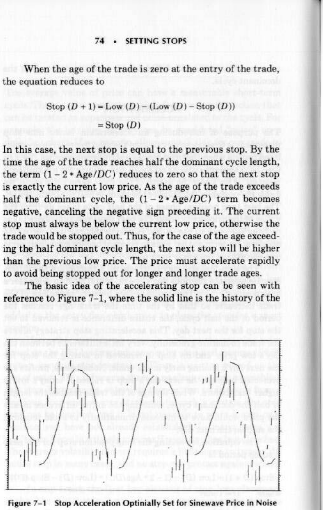
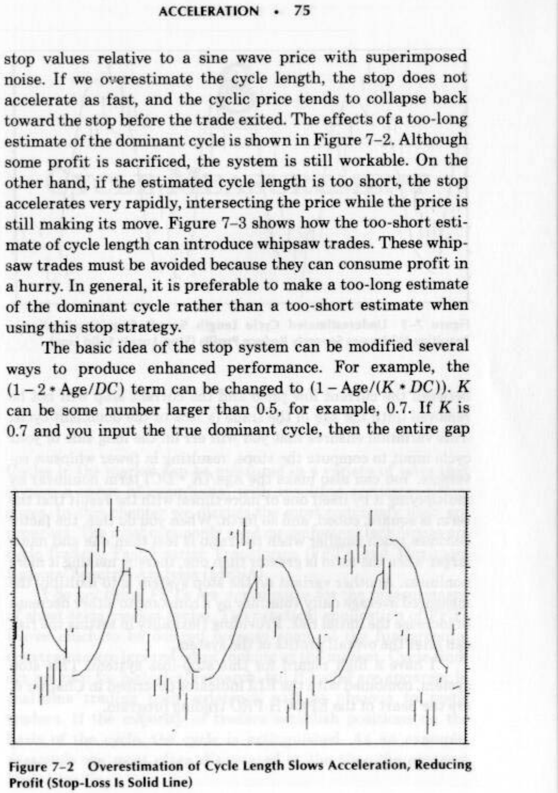

# RELATIONSHIPS

components will have varying amplitudes because of differential
filter attenuation.) All we need do is to divide ELI by .682 to
produce this amplitude normalization.

When we use the MACD as it relates to cycles, we trade
simply on the crossing of the ELI and the detrended synthetic
price. All convergences and divergences are ignored. My experi-
ence is that this is a very robust trading system when the mar-
ket is in the cyclic mode.

=

SETTING STOPS

Technical trading seems to put extreme emphasis on finding the
right entry point for a trade, and scant attention is paid to
techniques to exit a trade. There are times when it would not be
hard to convince me that a trade can be entered almost any-
where and overall profitability would really be established by
the way the trades were exited. The purpose of this chapter is to
establish a logical and coherent method of stop-loss placement
using cycle information.

KEY STOP ELEMENTS

An effective stop-loss system must allow sufficient risk to give
the trade a chance to “breathe.” The system also must include
features that minimize loss of profit after the expected movement
has occurred. Using these criteria, the key elements of the stop
system are setting the initial value of the stop and then using a
method to accelerate, or tighten, the stop as time progresses.

THE INITIAL STOP-LOSS PLACEMENT

The average value of price can have a measurable short-term
cycle, These cycles can have a high-frequency price action that
can be treated as superimposed noise unrelated to the cycle. For
example, the intraday activity can be considered “noise” on a
daily bar chart. If we want to allow enough risk for our trade to
breathe and accommodate the noise variations, we must set the
stop-loss so the noise will not erroneously take us out of a
desirable trade. The obvious solution is to use the average daily
trading range, or volatility, as a key to setting the stop on a
daily basis.

Using daily volatility is a logical method of setting the initial
stop-loss so the stop-loss adapts to the current market condi-
tions. Daily volatility is just the difference between the high and
low price for the day. Averaging the daily volatility over the last
half cycle of prices provides a reasonable measure of the current
noise level. This average volatility is subtracted from the low
price of the day of entry (for a long position) to establish the stop
for the next day’s trading. Of course, the average volatility is
added to the entry day’s high price to place the stop for a short
position.

Using this system, an entry is made at the opening price
based on the ELI leading indicator or by stop-and-reverse (SAR)
from a previous stop-loss value. There is no stop placed on the
day of entry. This is because there is no clear-cut way to establish
this stop. For example, entry into the position could occur from a
previous stop-and-reverse strategy. In such a system the stop
may not be touched, and it is not possible to place a stop on a
position you have not already established. In many cases you
don’t even know in a timely manner if your stop has been touched.
The average volatility almost requires a limit move to trigger the
initial stop in many cases, and no stop can protect against a limit
move.

In any event, the first key element of stop-loss placement
is that the initial stop is placed a distance equal to the average
daily trading range below the low (or above the high) of the day

of entry. The average is taken over a period equal to half the
dominant cycle.

ACCELERATION

The purpose of introducing an acceleration factor into stop
placement is to successively tighten the stop to preserve accumu-
lated profits when the price makes a significant reversal. We can
use the dominant cycle to establish the criteria for a significant
reversal. If we know the length of the short-term price cycle, we
know the optimum duration of the trade is half the cycle period.
The best long position phase of the half cycle takes us from the
valley of the price to its peak. The best short position phase takes
us from the peak to the valley. Knowing this, we will derive the
acceleration term so that a trade reversal occurs every half cycle
of a theoretical pure sine wave price.

The stop-loss strategy is to remove a fraction of the differ-
ence between the previous day’s low price and its stop value (for a
long position). This fraction increases linearly as the age of the
trade increases so that by the time the trade age reaches the
period of the half cycle, the entire difference is removed to set
the stop for the next day. This accelerating stop strategy allows
the trade to mature gracefully. Very little difference between the
day’s low price and its stop is removed in setting the stop for
the next day’s trading early in the trade. Nonetheless, profits are
protected because the next day’s stop is raised if today’s low is
higher than before. When the age of the trade reaches the length
of half the dominant cycle, removing the entire difference means
the price would have to increase dramatically to avoid touching
the stop on the next day.

The equation for setting the long position stop for the next
trading period is

Stop (D + 1) = Low (D) - (1 - 2 * Age/DC) * (Low (D) — Stop (D))

where D = Today
DC = Dominant cycle length (in days).

*Figure 7-1 Stop Acceleration Optinially Set for Sinewave Price in Noise*

When the age of the trade is zero at the entry of the trade,
the equation reduces to

Stop (D + 1) = Low (D) - (Low (D) = Stop (D))

$$= Stop (D)$$

In this case, the next stop is equal to the previous stop. By the
time the age of the trade reaches half the dominant cycle length,
the term (1 — 2* Age/DC) reduces to zero so that the next stop
is exactly the current low price. As the age of the trade exceeds
half the dominant cycle, the (1-2+*Age/DC) term becomes
negative, canceling the negative sign preceding it. The current
stop must always be below the current low price, otherwise the
trade would be stopped out. Thus, for the case of the age exceed-
ing the half dominant cycle length, the next stop will be higher
than the previous low price. The price must accelerate rapidly
to avoid being stopped out for longer and longer trade ages.
The basic idea of the accelerating stop can be seen with
reference to Figure 7-1, where the solid line is the history of the

*Figure 7-2 Overestimation of Cycle Length Slows Acceleration, Reducing*

stop values relative to a sine wave price with superimposed
noise. If we overestimate the cycle length, the stop does not
accelerate as fast, and the cyclic price tends to collapse back
toward the stop before the trade exited. The effects of a too-long
estimate of the dominant cycle is shown in Figure 7-2, Although
some profit is sacrificed, the system is still workable. On the
other hand, if the estimated cycle length is too short, the stop
accelerates very rapidly, intersecting the price while the price is
still making its move. Figure 7-3 shows how the too-short esti-
mate of cycle length can introduce whipsaw trades. These whip-
saw trades must be avoided because they can consume profit in
a hurry. In general, it is preferable to make a too-long estimate
of the dominant cycle rather than a too-short estimate when
using this stop strategy.

The basic idea of the stop system can be modified several
ways to produce enhanced performance. For example, the
(1-2* Age/DC) term can be changed to (1 — Age/(K * DC)). K
can be some number larger than 0.5, for example, 0.7. If K is
0.7 and you input the true dominant cycle, then the entire gap

Profit (Stop-Loss Is Solid Line)

*Figure 7-3 Underestimated Cycle Length Speeds Stop Acceleration—*

Resulting Whipsaws Severely Reduce Profits (Stop-Loss Is Solid Line)

between the current low price and the current stop will not be
removed until the age of the trade is 70% of the dominant cycle.
This variation ensures that you will err on the long side of your
cycle input to compute the stops, resulting in fewer whipsaw re-
versals. You can also make the Age/(K + DC) term nonlinear by
multiplying it by itself one or more times, with the result that the
term is square, cubed, and so forth. When you do this, the factor
becomes much smaller when the ratio is less than one and much
larger when the ratio is greater than one, thereby making it more
nonlinear. Another variant on the stop system is to multiply the
measured average daily volatility by a constant to either decrease
or increase the initial risk. Providing flexibility in setting the risk
can alter the overall profits of the system.

I have a high regard for this stop-loss system. This stop
system, combined with the ELI indicator described in Chapter 6,
are the heart of the EPOCH PRO trading program.

8

CYCLE MEASUREMENT

Cycles in the market can be measured in a variety of ways that
involve a range of complexity, with resulting accuracy differ-
ences. In this chapter we discuss the most commonly used ap-
proaches. The most commonly used measurement techniques are
cycle finders, Fast Fourier Transforms (FFT), and Maximum
Entropy Spectral Analysis (MESA).

I do not think FFTs are appropriate for the measurement
of short-term market cycles. The practical application of FFTs
leaves much to be desired because some of the fundamental
constraints are ignored when looking at the market. Cycle find-
ers are nice for historical research, but if cycles are apparent in
real-time trading their existence will be obvious to many
traders. If the majority of traders establish positions on the
basis of the cycle, the cycle is extinguished. As an example,
seasonals are most often discounted at the time the contract
begins trading.
