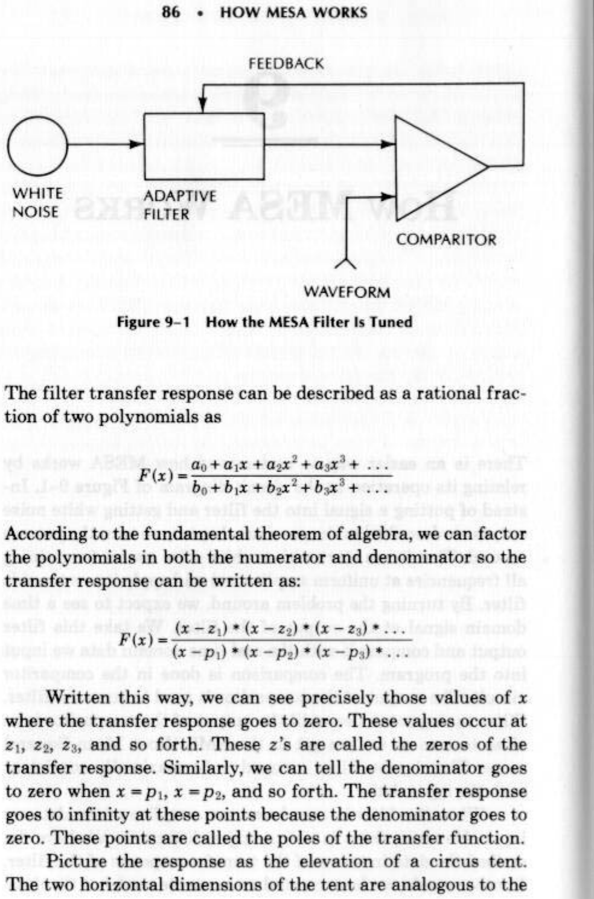

# UNDERSTANDING SYSTEM RESULTS

How MESA WorRKS
There is an easier way to understand how MESA works by
relating its operation to the circuit diagram of Figure 9-1. In-
stead of putting a signal into the filter and getting white noise
out, as we described in the previous chapter, we turn the process
around, That is, we start with a white noise source (containing
all frequencies at uniform amplitudes) and apply it to a tunable
filter. By turning the problem around, we expect to see a time
domain signal at the output of the filter. We take this filter
output and compare it with the real time domain data we input
into the program. The comparison is done in the comparitor
circuit. The output of the comparitor is used to tune the filter.
Filter tuning continues until the output of the comparitor is as
close to zero as we can get in the RMS (Root Mean Square)
sense. That is, the filter is tuned to be maximally consistent
with the input data.

When the filter is tuned we have a replica of the data we
input. However, there is now a major difference. We have de-
scribed the data in terms of the transfer response of the filter.
In other words, we have created an accurate model of the data.

*Figure 9-1 How the MESA Filter Is Tuned*

86 +» HOW MESA WORKS

FEEDBACK

ADAPTIVE
NOISE FILTER

COMPARITOR

WAVEFORM

The filter transfer response can be described as a rational frac-
tion of two polynomials as

F( ) tot are +aox* +agx*+...
i bo + byx + box? + byx® +...

According to the fundamental theorem of algebra, we can factor
the polynomials in both the numerator and denominator so the
transfer response can be written as:

F(x)= (x —2,) * (x — 22) * (x —2y) *...
(x =p.) * (x — pz) * (x —ps) *...

Written this way, we can see precisely those values of x
where the transfer response goes to zero. These values occur at
21, 22, 23, and so forth. These z’s are called the zeros of the
transfer response. Similarly, we can tell the denominator goes
to zero when x =p, x =p», and so forth. The transfer response
goes to infinity at these points because the denominator goes to
zero. These points are called the poles of the transfer function.

Picture the response as the elevation of a circus tent.
The two horizontal dimensions of the tent are analogous to the

HOW MESA WORKS «+ 87

“complex” plane of the frequency response. The complex plane
consists of the “real” and “imaginary” dimensions. There are
points on the tent where the tent is staked to the ground. These
are the zeros. There are other points where the poles are in-
serted to produce the high peaks. The use of poles to describe
the zero denominator positions is obvious. The frequency re-
sponse of the filter is similar to the path a marble would take if
we released it to roll on the surface of the tent. The marble is
constrained to roll only in a straight line along the real fre-
quency. For reasons of conservation of energy, poles cannot
occur at real frequencies. Otherwise, we would get more energy
out of the filter than we put in.

The generalized filter can have several forms. We could use
the numerator only, the denominator only, or both the numerator
and denominator in the model.

If the filter uses only the numerator, the model is called a
moving average (MA) model. We can create an MA model by
fitting a polynomial to the price data.’ Because this procedure is
curve fitting in the purest sense, MA models are not recom-
mended. There is no validity for projections made outside the
bounds defining the curve because there is no principle, like
cycles, to assert that the curve should continue.

Van Den Bos?’ has shown that the MESA filter is equiva-
lent to the least-squares fitting of the discrete-time all-pole
model to the data. In other words, MESA only uses the denomi-
nator as its filter. MESA is an autoregressive (AR) model. The
replica signal at the output of the filter is curve fitted to the real
price data. However, this replica is only used as a means to tune
the filter so the spectral content can be estimated. The filter is
the cyclic model of the market, and the telegrapher’s equation
tells us we can expect coherent behavior when the market is in
the cycle mode. That is, the MESA model has a short-term
predictive capability.

ARIMA is both a moving average (MA) and autoregressive
(AR) model, using the numerator and denominator of the filter
model transfer response. While more theoretically general, it is

not preferred to MESA because of its tendency to produce spu-
rious filter responses. These spurious responses occur when the
filter is overspecified in terms of the order of the polynomials.
When overspecified, the filter attempts to reduce to the order of
the filter by providing a zero to cancel a pole. If the cancellation
is not exact, the misalignment of the stake and the pole in the
tent surface can cause the marble to roll much differently than
if neither existed. Since there is no real way to determine the
correct order of the filter, ARIMA models have a tendency to-
ward spurious responses when the order of the filter is kept high
to obtain the desired frequency resolution.

Of the three kinds of models that can be formed from the
rational filter transfer response, MESA is preferred because it
has the least tendency toward spurious responses and because it
has a short-term predictive capability. Scientific research is
continuing to improve the spectral estimate in the presence
of noise.

DATA LENGTH

The most critical decision to be made using MESA is the length
of data to be used for the analysis. One of the major applications
of a filter is to eliminate the noise in order to clarify the action of
the cyclic signal. Early versions of MESA maximized the output
signal-to-noise ratio to establish the “correct” length of data to be
used for analysis. On a given day the analysis was repeated using
different data lengths, and the data length that produced the
highest signal-to-noise ratio was finally used as the output.

The cycle measurement made using this criteria was basi-
cally a “snapshot” for the given day. The cycle measurement
made on the next day was a completely independent snapshot.
While fine in theory, this approach led to difficulties in interpre-
tation. Basically, the trader tried to string the snapshots together
to make a “movie” under the assumption that the cycle activity
does not change dramatically from day to day. Unfortunately, the

independent measurements produced a “movie” that was so jerky
that interpretation of cycle activity was difficult.

Interpretation of the market cyclic activity was improved
by changing the criterion for the length of data to use for analy-
sis. The new criterion emphasizes continuity. Knowing that
MESA requires only about one cycle’s worth of data to make a
measurement, the data length used for “today’s” measurement
is “yesterday’s” cycle length. This algorithm tends to preclude
the preference for a longer cycle when MESA has already fo-
cused on a shorter cycle. For example, assume a 10-day cycle is
currently in force as the dominant cycle and a 40-day cycle
is also present. Using a longer data sample, MESA would prob-
ably jump to the 40-day cycle length on the basis of having the
maximum signal-to-noise ratio. MESA would select the longer
cycle length because the 10-day cycle would have to be present
for the entire 40-day span to compete with the 40-day cycle.
The 10-day cycle would also confront the principle of propor-
tionality—the 40-day cycle amplitude is probably larger. By
using a shorter data length when a shorter cycle has previously
been measured, the bias to the longer cycle lengths is removed
and MESA has greater inertia, avoiding jerky day-to-day meas-
urements. The continuity resulting from using the previous
dominant cycle period as the new data length allows the meas-
urements to move smoothly between short dominant cycles and
longer dominant cycles and back as these cycles ebb and flow.
Sometimes, when tradable cycles are not present, the cycle
length measurement is erratic.

Jerkiness in the cyclic measurement can, in fact, aid inter-
pretation of market activity. Cyclic measurements are most er-
ratic when the market is in a trend mode and there is little
useful cyclic activity. Therefore, when the MESA cycle meas-
urements are erratic, you should avoid trading on the basis of
cycles. One of the key uses of MESA is to detect when the
market is in the cycle mode and when it is in the trend mode. By
identification of these modes you know when to shift your trad-
ing strategy to fit the current market conditions.

90 +» HOW MESA WORKS

PREDICTIONS

The MESA filter outputs data in the time domain that is a true
replica of the real data. The big difference between the real data
and the filter is that the filter is a model of the price function
and has the ability to produce predictions. The predictions are
based on the assumption that the cycles measured in the recent
past will continue into the future.

One simple example of a predictor is a crystal goblet an
opera singer tries to break with her voice. The opera singer
adjusts the pitch of her voice to the resonant frequency of the
goblet and the goblet starts to ring. If the singer suddenly stops,
the goblet continues to ring and is a predictor of the note the
singer would have made. In this simple example the goblet is a
single pole filter with only one resonant frequency. Moreover,
the singer had to adjust to the filter rather than the filter ad-
justing to the singer. But the point is that when a filter pole is
excited, it continues to ring for a short while just as if the input
energy were still present. This ringing is still true even when
the filter is complex and has a larger number of poles.

The MESA digital filter has been tuned to all the cycles
between 8 and 50 days. By allowing the digital clock to run into
the future, a prediction is formed by combining all the measured
cycles in their measured amplitudes and phases. The prediction
is made by projecting the ringing one day into the future. Then
this day is taken to be “real” data so that another prediction can
be made one more day forward. The prediction is therefore sub-
ject to cumulative error buildup the further the prediction is
carried into the future. The prediction is therefore limited to 10
periods to avoid accumulation of large errors.

MESA makes cycle measurements throughout the entire
contract. The “fearless forecast” made by the prediction is easy
to backtest. Greater confidence can be placed in the timing of
the predicted turning points by backtesting the prediction for
several days and seeing if the predicted turning point remains
stationary. There is no definitive way to measure the accuracy

of the prediction because it spans a 10-day period. The defini-
tion of accuracy can vary over that period. Here are some exam-
ples for which accuracy is sought: How well does MESA call the
direction of the next day’s trading? How accurately does MESA
call the timing of the turning point? How accurately does
MESA call the level at which a turn is made?

My answers to these questions are qualitative and are based
on using the program over the years. First, MESA works best
when the market is in the cycle mode. The cycle mode generally
occurs when the market is otherwise described as in a trading
range or in a sideways movement. MESA predictions can be used
simply to call the direction of the next day’s move.’ MESA pre-
dictions can be used as a timing device to anticipate turning
points but are just awful in predicting the level at which the
turns will be made. These are simply observations, and I have no
rationale to justify them. Cycles certainly exist when the market
is in the trend mode, but it is generally unwise to take a position
against the trend because the slope of the trend can cancel the
contraslope of the cycle. On the other hand, the predicted cycle
turning point can be used to pick an advantageous entry point
for trades in the direction of the trend.

MESA predictions are most valid when the measured cycle
has been stable in recent history, a period on the order of a half-
cycle length. The longer the stability the better, but short-term
cycles seldom remain stable for several cycle lengths. If the recent
cycle measurement shows a changing from one cycle length to
another, the historical data record contains old cycle information
that distorts the prediction from representing the current domi-
nant cycle. Greater confidence can be placed on the prediction of
a turning point if that turning point prediction remains consist-
ent over several successive predictions.
