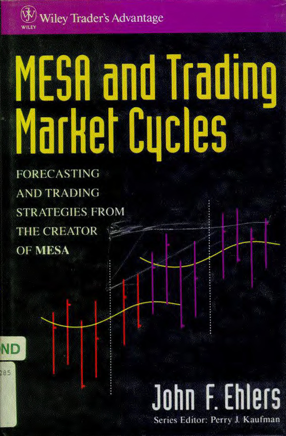

# MESA and Trading Market Cycles: Forecasting and Trading Strategies from the Creator of MESA



**Author:** John F. Ehlers

**Year:** 1992

```bibtex
@Book{ehlers1992mesa,
  author    = {Ehlers, John F.},
  title     = {MESA and Trading Market Cycles: Forecasting and Trading Strategies from the Creator of MESA},
  publisher = {Wiley},
  year      = {1992},
  series    = {Wiley Finance},
  isbn      = {9780471535089},
}
```

## Chapters

1. [Why Cycles Exist in the Market](ch1.md)
2. [Cycle Basics](ch2.md)
3. [Principles of Cycles](ch3.md)
4. [Effects of Moving Averages](ch4.md)
5. [Effects of Momentum](ch5.md)
6. [How Cycles Help Trading](ch6.md)
7. [Setting Stops](ch7.md)
8. [Cycle Measurement](ch8.md)
9. [How MESA Works](ch9.md)
10. [Using the Spectrum to Identify Cycles and Trends](ch10.md)
11. [Putting It All Together](ch11.md)
12. [Trading with MESA](ch12.md)
