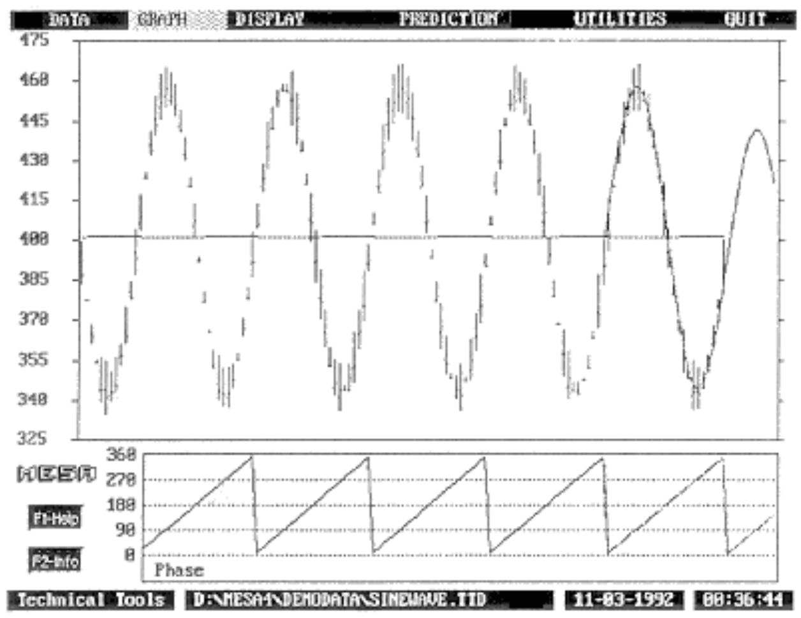
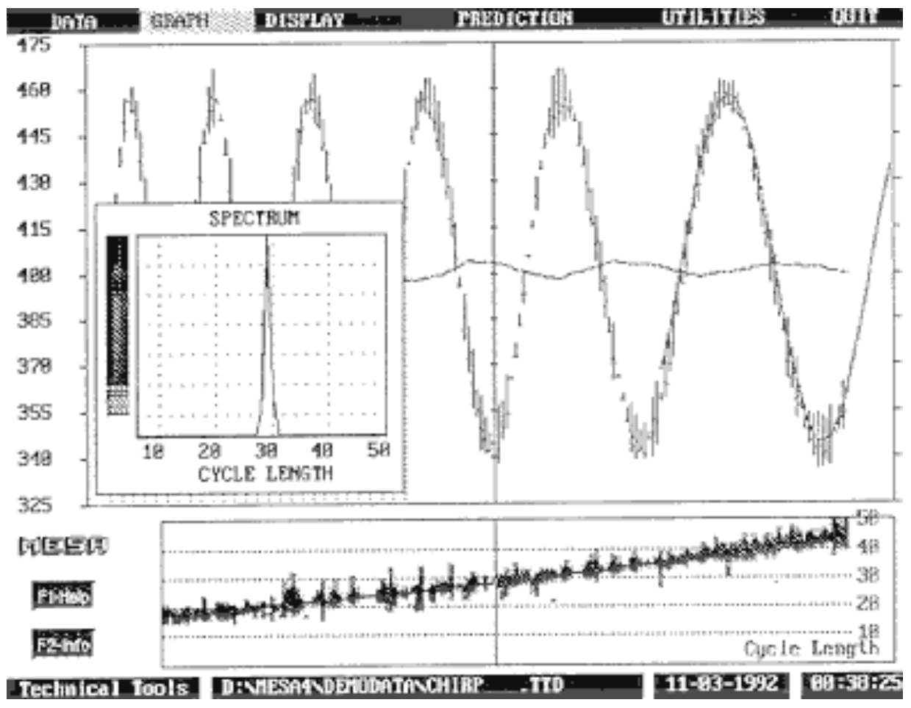
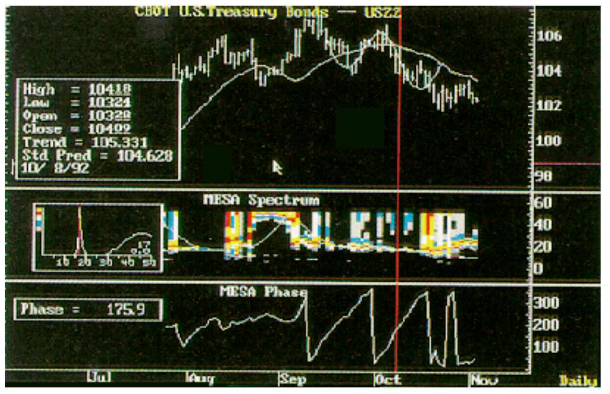
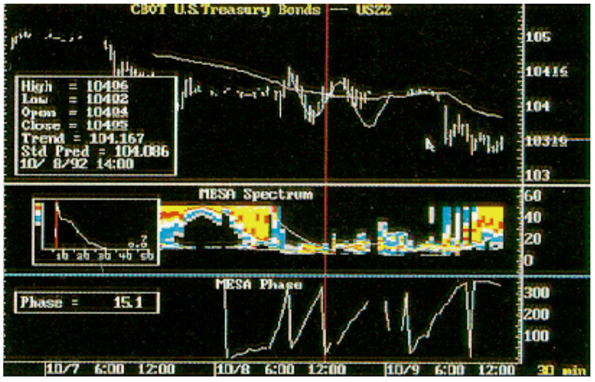
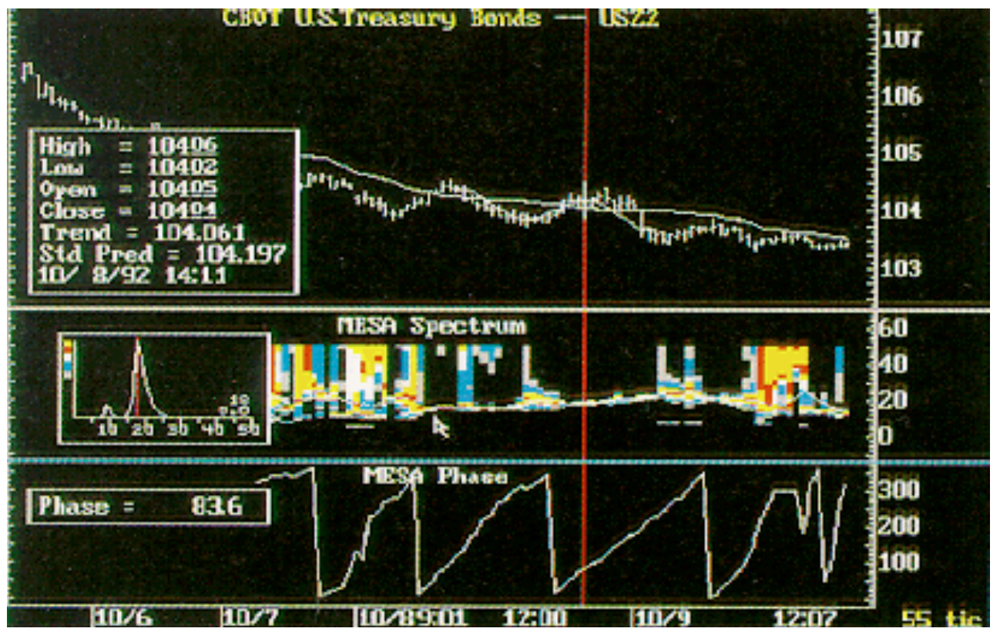
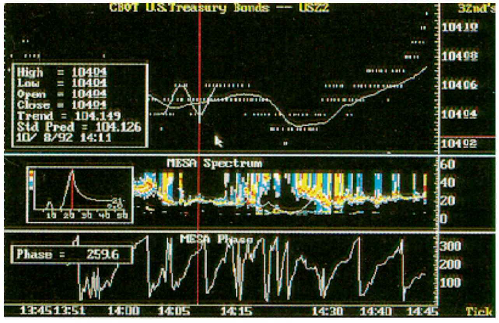
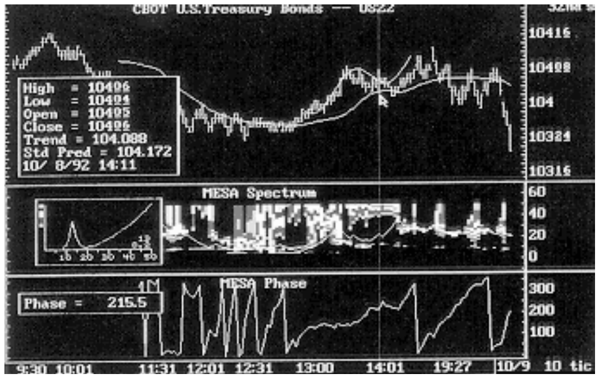
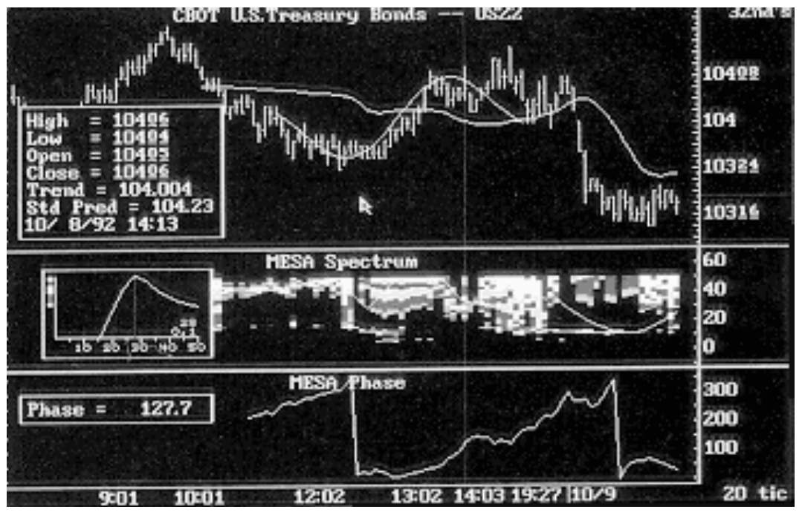
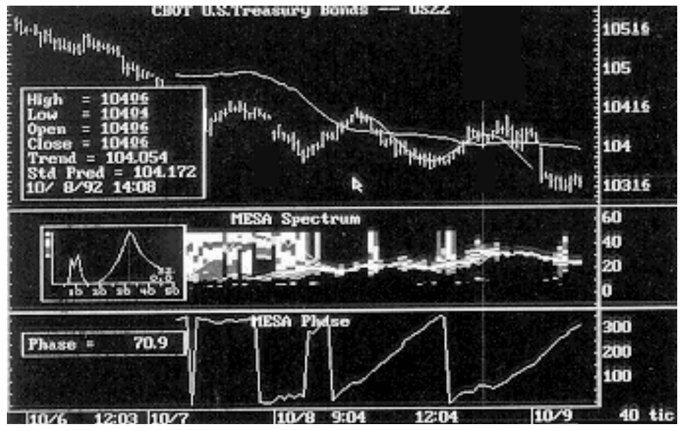
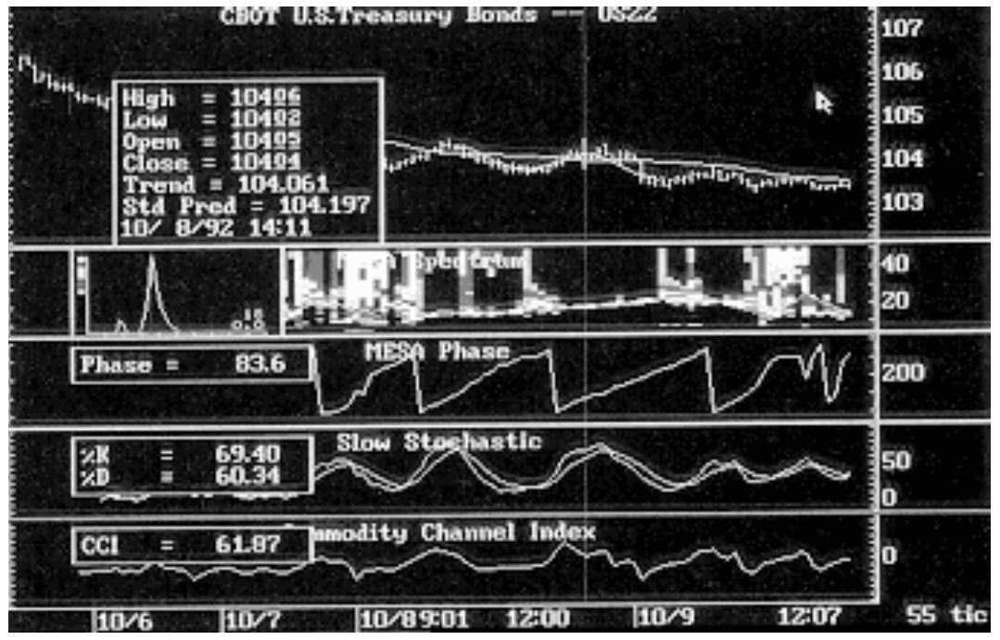

# Cycle Analysis And Intraday Trading

- **Author:** John F. Ehlers
- **Publication:** Technical Analysis of STOCKS & COMMODITIES, Volume 11, February 1993, pp. 84--88
- **Article URL:** [Article PDF](https://technical.traders.com/archive/article.asp?file=\V11\C02\CYCLEAN.pdf)

---

*Veteran STOCKS & COMMODITIES contributor John Ehlers explains how to make use of cycles analysis in intraday trading, heretofore a rarity.*

Intraday traders have long had most of the technical analysis tools available to end of day traders — with one major exception: cycle analysis. Previously, cycle analysis has been difficult to incorporate into intraday trading because manipulating data files distracted from the business of trading. Now that situation has changed, and finally, cycle analysis can effectively be incorporated into intraday trading.

A unique aspect of intraday data is the ability to see each trade on a tick-by-tick basis. A new perspective of market activity is obtained when a number of these ticks are grouped together. The result is a bar chart where the horizontal axis is a tick volume axis rather than a time axis. Tick volume is different from true volume because any given tick can represent various numbers of futures contracts or stock shares. Nonetheless, the horizontal scale of the bar chart is significantly different from the conventional time scale.

By selecting different groupings of ticks represented in each bar on the bar chart, a trader effectively changes the compression factor of the horizontal tick volume scale. An interesting aspect of changing the horizontal bar chart scale is that data not cyclic in one scale is cyclic in another scale because the random variations are assimilated into a single price bar. Using cycle analysis software is not unlike bringing the mountain to Mohammed. When the market is in a cycle mode, future market prices can be forecasted on the assumption that the measured cycle will continue into the future. Establishing the proper compression often allows the market to be analyzed as being in the cycle mode.

## Cycles In The Time Domain

There is no magic in cycle analysis; there is only hard-nosed number crunching with attention to the details of the constraints imposed by the analysis. The major constraint is that the data must be stationary over the observation period, with the measured dominant cycle having a consistent amplitude and phase. Maximum entropy spectrum analysis (MESA) uses an observation period of 30 bars, a compromise between the majority of the longest reported cycle (50 bars) and the response time to the shortest reported cycle (six bars). Fourier transforms are inappropriate for the analysis of short-term market cycles because of the stationarity constraint. To get reasonable resolution of short-term cycles, a Fast Fourier Transform (FFT) of at least 256 bars must be used. But the stationarity constraint dictates that, for example, 16 consistent cycles of a 16-bar cycle are necessary to make a valid measurement — a year's worth of daily data. But such a cycle would be obvious by observation and the most casual traders would jump in to trade it, thus destroying it. Therefore, the only valid methods to determine short-term cycles are to use MESA or to observe the formation of a sinewave pattern.

A sinewave is the fundamental wave shape of a scientific cycle, a primitive function used for analysis. More complicated shapes of waves can be synthesized by combinations of sinewaves with different amplitudes, phases and frequencies. A pure cycle is absolutely repetitive. To conceptually view a cycle, imagine an arrow bolted to the end of an engine crankshaft. A cycle is completed each time the arrow passes by its starting point. The direction of the arrow at any instant is the phase of the cycle. When the arrow is pointed up, it is pointing 90 degrees from a horizontal reference point. This 90-degree phase point is the maximum amplitude of the sinewave. A half cycle later, the arrow is pointing directly down. Now the arrow is at the three-quarter point through the cycle, or 270 degrees. At the 270-degree phase point, the sinewave has its minimum value.

The phase angle, then, increases progressively through the cycle. If we plotted phase angle as a function of time, the result would be a straight line, and then, if the phase were reset to zero at the beginning of each new cycle, the phase display would be a sawtooth waveform (Figure 1).


**FIGURE 1: SINEWAVE.** The phase angle increases progressively through the cycle, beginning at zero degrees and ending at 360 degrees.

Using the phase display for trading has several benefits. First, the smoothness of the rate of change is a sensitive measure of whether the market is in a cycle mode. Experience has shown that a disruption of the phase response means that a failure of the cycle mode is imminent. Second, by watching the rate at which phase is changing, a trader can anticipate the cyclic turning points at 90- and 270-degree phases.

One major reason for performing cycle analysis is to find the spectrum, a display of cycle amplitude versus cycle length; that is, data are dissected to find the component cycles, just as a prism splits white light into its colored components. The spectrum display for market data when the market is in a cycle mode is similar to the spectrum inset in Figure 2. The display is a simple spike, indicating that only one cycle is present, but a conventional spectrum display is just a snapshot for a selected position along the time axis. Because trading data tend not to be static but dynamic, traders need a display more analogous to a movie than to a snapshot. One way of generating such a display is to use color as an amplitude code and in so doing, we can plot the successive spectra below the bar chart in sync with it. This cycle contour plot not only shows the continuous shift of the cycle but can show multiple simultaneous cycles, harmonic switching and just plain failure of the cycles when the market is trending.


**FIGURE 2: CONTINUOUSLY VARYING SINEWAVE.** The data are dissected to find the component cycles. The spectrum, which is a display of cycle amplitude versus cycle length, can be found. The inset is the spectrum display of this sinewave, a snapshot indicating that only one cycle is present in the selected data.

## Intraday Cycle Analysis

As Richard Arms has remarked, "If the market had a wristwatch, it would be divided into shares rather than hours." Using units of equal volume is a concept that can be applied to many situations. Intraday traders have a unique advantage in that they can observe trades happening on a tick-by-tick basis. By grouping ticks appropriately, the data can be preprocessed to embed the random variations within each bar, enabling the bars to be analyzed for cyclic content.

Conventional equal volume charts distort a box size to display constant volume on a linear horizontal volume axis. By contrast, grouping a constant number of ticks within a uniform-sized price bar also has the effect of making the horizontal axis of the chart nonlinear with respect to time but linear in units of tick volume. This type of preprocessing enables MESA cycle analysis along the tick volume axis. Doing this, price turns can be predicted in terms of tick volume on the assumption that the measured cycle will continue. An additional benefit of preprocessing the tick data is that such oscillators as the slow stochastic and commodity channel index (CCI) can also be optimized along the tick volume axis because they work best when the market is in the cycle mode.

## A Trading Example

These concepts are perhaps best demonstrated by an example. Figure 3 shows 1992 December Treasury bonds on a daily basis over a period of several months. The screen is split into three sections, with the bar chart at the top, the spectrum and cycle contour in the middle and the phase display at the bottom. The cursor line is located at a point designated as October 8, 1992, about halfway between the peak to valley swing, as indicated by the measured cycle and prediction overlaid on the price bars. The measured cycle length is 17 days, as indicated by the spike in the spectrum window. Moreover, the relatively narrow and nearly horizontal contour in the cycle contour display shows that the cycle is relatively stationary.


**FIGURE 3: DAILY CHART FOR DECEMBER T-BONDS.** The measured cycle length is 17 days, as indicated by the spike in the spectrum window.

This is a very tradable cycle, having a peak to peak excursion in excess of two points ($2,000 per contract). But this is open to interpretation: what is one trader's cycle is an intraday trader's trend. In this case, the trend is down on an intraday basis, so this contract can be traded intraday.

Figure 4, a 30-minute bar chart, could confuse the trader about what action to take. At 2 p.m. (or 14:00 on a 24-hour clock), a short cycle burst appears, but the direction of that short cycle is opposite to the trend on a daily basis.


**FIGURE 4: 30-MINUTE BAR CHART DECEMBER T-BONDS.** The direction of this short cycle (as indicated by the sinewave overlaid on the price chart) is up, which would be against the trend.

The situation clarifies itself if we use the tick volume chart (Figure 5). In Figure 5, we have grouped 55 ticks into each price bar so that the horizontal scale is roughly equivalent to that of the 30-minute bar chart. The difference is readily apparent. The cycle contour plot of Figure 5 shows the 18-bar cycle to be stationary, and the rate change of phase is also uniform. Further, the price prediction to the right of the cursor shows that 14:10 is the time to sell short. This trade meets our expectations because it is in the trend direction and because the intraday cyclic swing approaches a full point. Thus, the 55-tick volume chart gives a clearer indication of the necessary trading tactics than can be obtained from a chart with a pure time axis.


**FIGURE 5: 55-TICK CHART DECEMBER T-BONDS.** Price bars are now grouped by 55 ticks instead of time. The rate of change of phase (lower chart) is fairly uniform.

Now examine the background of our trading tactic. Figure 6 shows the trades on a tick-by-tick basis. The phase and cycle contour plots are erratic, and essentially, no cyclic information is contained in this chart. Compressing the data so each price bar is made up of 10 ticks creates the chart in Figure 7. Figure 7 adds very little to our understanding because both the phase display and cycle contour are erratic. When we further compress the data so the price bars contain 20 ticks each, as in Figure 8, some tradable cycles start to form. The problem here is that the cycles are just too long to fit our MESA analysis. Further compression is necessary to shorten the observed cycle length.


**FIGURE 6: TICK CHART DECEMBER T-BONDS.** Looking at the price data on a tick-by-tick basis indicates no cyclical information.


**FIGURE 7: 10-TICK COMPRESSION TICK VOLUME CHART.** Using a 10-tick bar charts reveals no cycles.


**FIGURE 8: 20-TICK COMPRESSION TICK VOLUME CHART.** Increasing the bar charts to 20 ticks per bar begins to produce identifiable cycles.

Doubling the compression factor by putting 40 ticks in each price bar, as in Figure 9, a consistent and stationary cycle display is formed. Figure 9 has essentially the same information as the 55-tick compression in Figure 5, indicating that 2 p.m. is the best time to sell short. The 18-bar cycle length in Figure 5 is not exactly the ratio of the two compression factors 40 and 55 ticks per hour of the 32-bar cycle in Figure 9 because the 30-bar MESA observation window is fixed and so looks at a different span of data in the two cases.


**FIGURE 9: 40-TICK COMPRESSION TICK VOLUME CHARTS.** Doubling the tick volume to 40 ticks per bar produces a consistent cycle display.

The screen is further split in Figure 10 to show the nine-bar stochastic and 18-bar commodity channel index (CCI). These technical indicators confirm our sell decision at 2 p.m. The CCI gives a leading indicator as it returns from the +100% of the upper edge of the channel. The stochastic gives a lagging and confirming indication when the slow stochastic crosses its three-bar average.


**FIGURE 10: 55-TICK COMPRESSION TICK VOLUME CHART.** Incorporating the commodity channel index and the stochastics indicator can assist and confirm trading signals.

## Conclusions

MESA cycle analysis can be used for intraday trading when the algorithms are built in and therefore have direct access to intraday data. This makes cycle trading available on an intraday basis feasible. The cycle analysis is enhanced by compressing tick data to bars (tick volume). The compression factor can be altered to best configure the data for intraday cycle analysis. The predictions that result from the cycle analyses are often startling — and profitable.

---

*John Ehlers, Box 1801, Goleta, CA 93116, 805-969-6478, is an electrical engineer working in electronic research and development and has been a private trader since 1978. He is a pioneer in introducing maximum entropy spectrum analysis to technical trading through his MESA computer program.*

## References

- Arms, Richard W. [1983]. *Volume Cycles in the Stock Market: Market Timing Through Equivolume Charting*, Arms Equivolume Corp., Albuquerque, NM.
- Ehlers, John F. [1992]. "1991 cycles," Technical Analysis of STOCKS & COMMODITIES, Volume 10: April.
- Warren, Anthony W. [1984]. "An introduction to maximum entropy method (MEM) technical analysis," Technical Analysis of STOCKS & COMMODITIES, Volume 2: Chapter 1.
- Warren, Anthony W. [1984]. "Optimizing the maximum entropy method," Technical Analysis of STOCKS & COMMODITIES, Volume 2: Chapter 2.
- Warren, Anthony W., and Jack K. Hutson [1984]. "Maximum entropy optimization," Technical Analysis of STOCKS & COMMODITIES, Volume 2: Chapter 4.
- Warren, Anthony W., and Jack K. Hutson [1984]. "Forecasting with maximum entropy," Technical Analysis of STOCKS & COMMODITIES, Volume 2: Chapter 6.

---

## BibTeX

```bibtex
@article{ehlers1993intraday,
  author  = {Ehlers, John F.},
  title   = {Cycle Analysis And Intraday Trading},
  journal = {Technical Analysis of STOCKS \& COMMODITIES},
  year    = {1993},
  volume  = {11},
  number  = {2},
  pages   = {84--88},
  url     = {https://technical.traders.com/archive/article.asp?file=\V11\C02\CYCLEAN.pdf}
}
```
