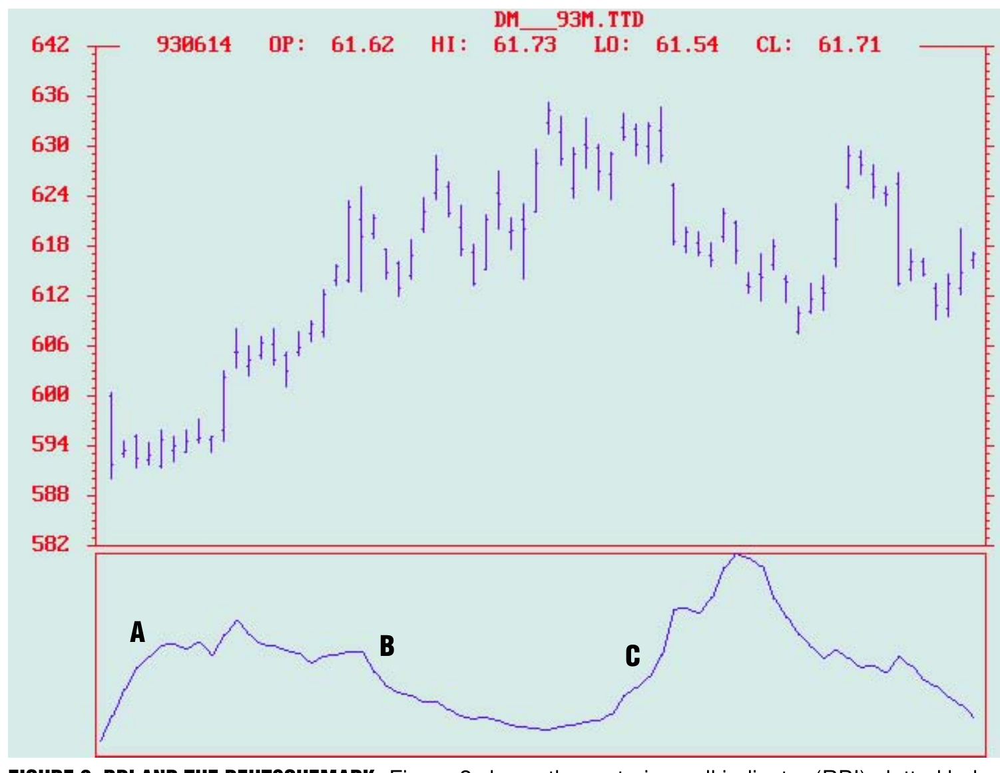
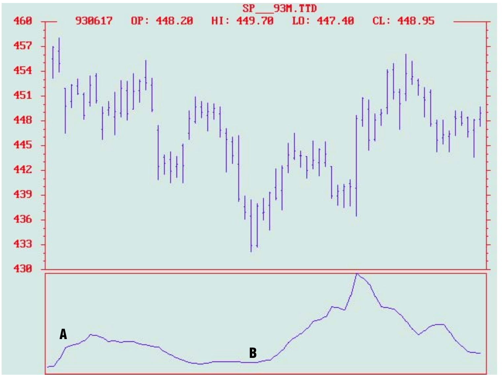
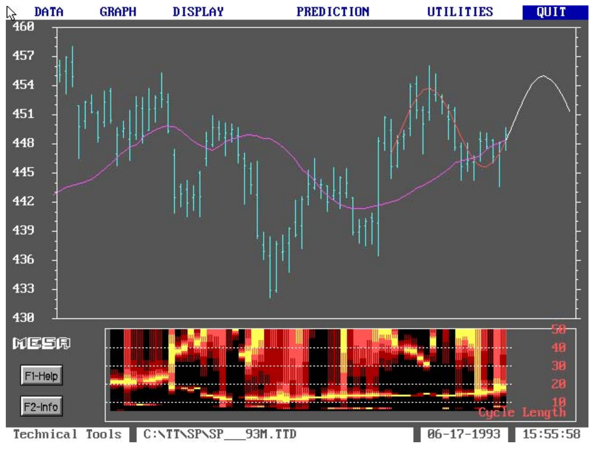
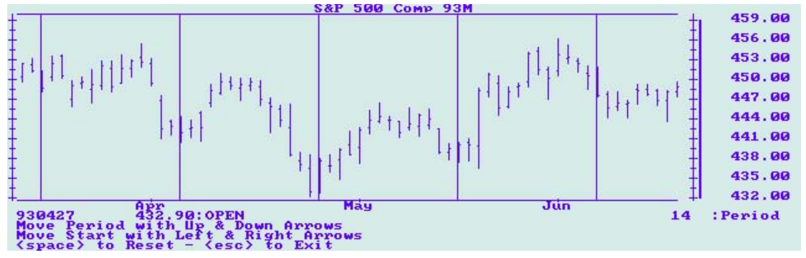
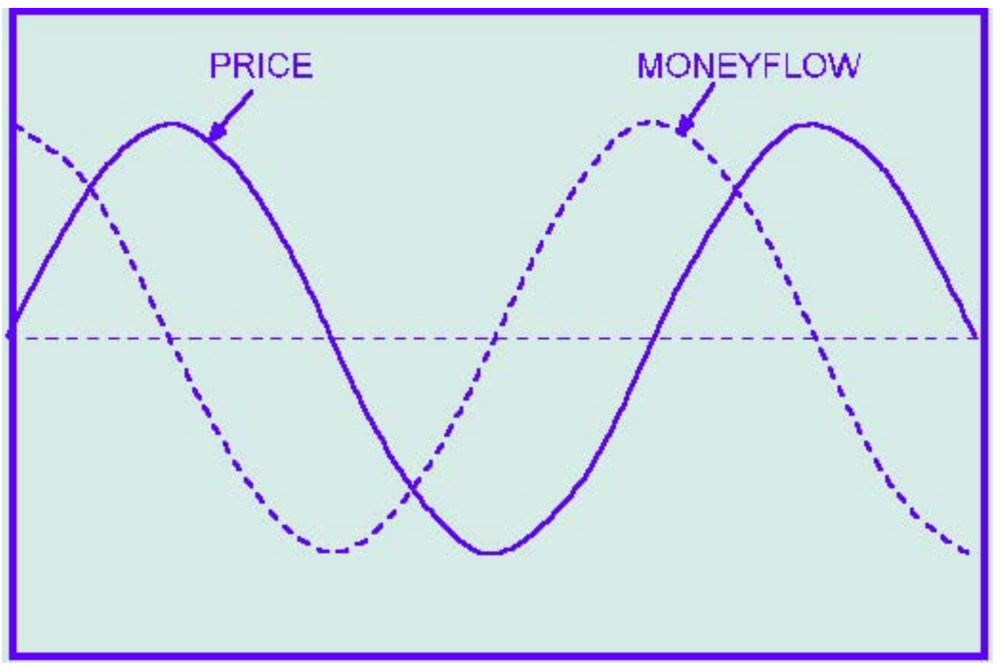
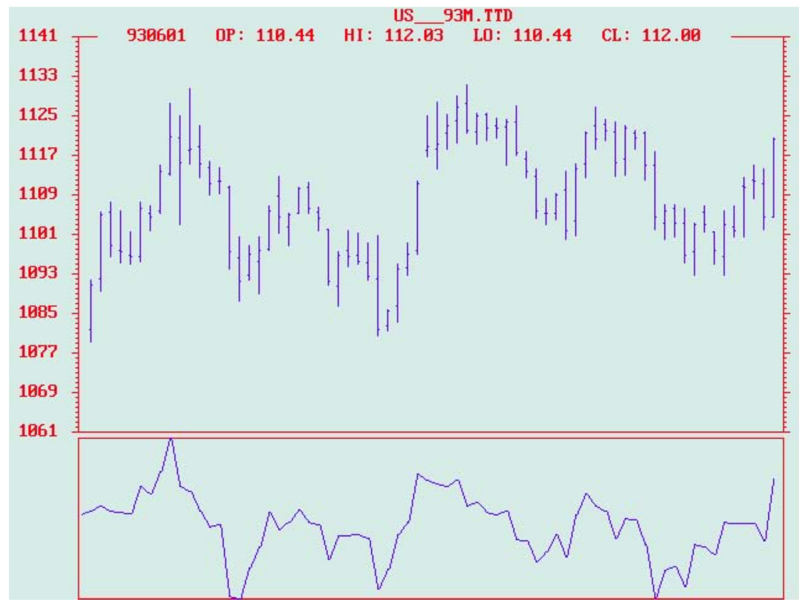
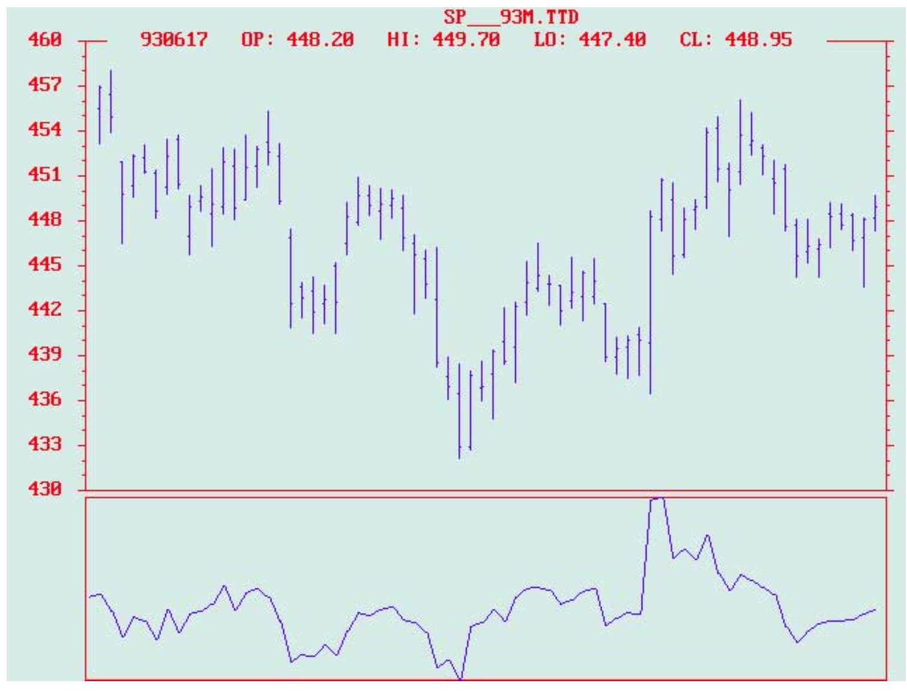

# Creating Indicators With Physics

- **Author:** John F. Ehlers
- **Publication:** Technical Analysis of STOCKS & COMMODITIES, Volume 11, October 1993, pp. 395--400
- **Article URL:** [Article PDF](https://technical.traders.com/archive/article.asp?file=\V11\C10\CREATIN.pdf)

---

*Do we limit words or do words limit us? As STOCKS & COMMODITIES contributor John Ehlers opines, we can't really describe market activity with terms now used in the technical trading field. He suggests a new approach to looking at the market, using as analogy the physical world — and as a result, a way to develop sophisticated new indicators.*

Every discipline has its jargon. Technical trading is no different. If you doubt that we use jargon, look up the standard definition of "stochastic" or "momentum" in a dictionary. These definitions have no relevance to our usage in technical trading. An expanded list of jargon can be found in the glossary section of this magazine every month. As an engineer, I find the use of the term "oscillator" applied to things that don't oscillate to be particularly inane.

Am I being pedantic? Absolutely not! Words mean things. Many concepts defy direct translation from one language to another simply because the precise words, the most accurate definition, don't exist in the latter language.

The words we use affect the way we think and even affect our very survival. I can illustrate with a couple of examples. First, Eskimos have more than 25 words for "snow," while just the one word works for me. That's because my survival in Southern California does not depend on a nuance of the word. Second, imagine that I'm from another planet and that I see and hear well and I have an excellent grasp of your language. The problem is, I have no sense of smell. It's your job to describe to me how an onion smells. You can't do it! Why? You know how it smells. You simply don't have the words to describe the smell without involving an understanding of the sense of smell compared with other things that have a scent.

## Words Fail Us

Technical trading suffers from the same problems. We simply don't have the right kinds of words to fully describe market activity. The current trading vernacular evolved from a time when an adding machine was an example of high technology.

Therefore, the time is right to introduce more "technical" into technical trading. I suggest a new approach to the way we view the market. Although conceptually simple, this new approach opens the way for new indicators that have never even been dreamed of. Let me illustrate several such indicators. Perhaps you can use the concept and generate a new indicator of your own.

As I've written, bar charts remind me of aerial photographs of a meandering river. I can't write generalized equations describing price variations, but I can relate the river path to solutions of the "drunkard's walk" problem. The meandering river can be shown to have a short-term coherency in the river bends. The analogy between the price patterns and the meandering river provides my rationale for the existence of short-term cycles in the market.

Mankind routinely applies logic by analogy, and my approach to technical trading is no different. The approach is a generalization of my observation about price action being similar to physical phenomena. We can relate the market words to physical phenomena with the analogies shown in Figure 1.

**FIGURE 1: MARKET AND PHYSICS ANALOGY**

| Market parameter | Physical equivalent |
|---|---|
| Price change | Distance |
| Time | Time |
| Volume | Mass |

The analogy is not perfect. Distance, for example, is three dimensional in the real world, but price has only one dimension; the only way price can move is up and down. And frankly, relating trading volume and mass by analogy is a stretch. However, the relationships in Figure 1 can serve as a place at which to start discussions.

The advantage of the relationship is that physical phenomena have been extensively studied. All we have to do to generate new indicators is to pick up a basic physics book and look at the solutions for physical problems. When these solutions are related to technical trading terms, the result is a method to develop sophisticated new indicators, the validity of which has been suggested by parallels in the physical world.

## A Really New Indicator

First, let us begin to build our new indicator with Newton's second law:

$$F = ma$$

This law states that force is equal to mass times acceleration. For example, your weight is the force you exert on a scale. Your weight is the result of your mass and the acceleration due to gravity. You weigh less on the moon although your mass remains the same because the acceleration due to gravity on the moon is less.

We will also use the force of the pull of a spring as our second physical phenomenon. This force can be expressed as:

$$F = -kx$$

This formula states that the force of the pull of the spring is directly related to the spring stiffness ($k$) and the distance over which the spring is stretched. The negative sign is used to show that the spring is a pulling force.

We also need to explore the meaning of acceleration, and we can build up to it. Velocity is just the rate at which distance is changed with respect to time. We measure velocity in terms of things like miles per hour or feet per second. In calculus notation, this is just:

$$V = \frac{dx}{dt}$$

where $x$ is distance and $d$ is short for change. Thus, $dx$ can be read as "change in distance" and $dt$ can be read as "change in time." Acceleration is the rate at which velocity is changed. We experience acceleration each time we pull away from a stoplight. Acceleration is expressed in calculus notation as:

$$a = \frac{dV}{dt}$$

Since velocity is the simple rate change of distance, then acceleration is the second rate change of distance with respect to time. In calculus notation, we can write acceleration as:

$$a = \frac{d^2x}{dt^2}$$

We will formulate our physical problem by hanging a mass on the end of a spring. We stretch the spring by pulling on the mass and then releasing the mass. We want to write the solution for the position of the mass as a function of time. Obviously, we know the mass will oscillate up and down until the energy of the initial disturbance has been dissipated. We start our solution by equating the two opposing forces as:

$$F = F$$
$$ma = -kx$$
$$m \frac{d^2x}{dt^2} = -kx$$

**(Equation 1):**
$$\frac{d^2x}{dt^2} = -\frac{k}{m} x$$

This is a second-order differential equation. If you don't understand calculus for the solution of this equation, please accept my explanation of the solution. Without being worried about the mechanics of calculus, the solution is really pretty simple. We just guess at the solution of the differential equation and then test to see if our guess was correct. Our guess for the solution of the position of mass with respect to time is:

**(Equation 2):**
$$x = \cos(\omega t)$$

where $\omega$ is the angular frequency of oscillation. Angular frequency is $2\pi$ times the frequency of a cycle.

The first rate change of distance is:

$$\frac{dx}{dt} = -\omega \sin(\omega t)$$

Then, the second rate change of distance is:

**(Equation 3):**
$$\frac{d^2x}{dt^2} = -\omega^2 \cos(\omega t)$$

**(Equation 4):**
$$\frac{d^2x}{dt^2} = -\omega^2 x$$

since $x = \cos(\omega t)$.

Therefore, our guess was correct because the second rate change of position is equal to the position itself within the value of the constant. In fact, the form of Equation 4 is identical to the form of Equation 1, so we can relate the constants as:

$$\omega^2 = \frac{k}{m}$$

This equation states that the square of the angular frequency is equal to the ratio of the spring constant to the mass. You may recall seeing some clocks that have a mass oscillating at the end of a spring to regulate its speed. That's how accurate the phenomenon described by this equation for frequency can be.

Now, we will relate this equation to market terms to arrive at our new indicator. Just by definition, angular frequency is $2\pi$ times the frequency of a cycle. In addition, frequency is the reciprocal of the cycle period. Finally, recalling that mass is the analog of trading volume, we can recast the last equation in trading terms as:

$$(2\pi / \text{Period})^2 = k / \text{Volume}$$

**(Equation 5):**
$$k = \text{Volume} \cdot (2\pi / \text{Period})^2$$

What this equation suggests is an indicator for the restoring pull on prices as an analog to the spring stiffness constant. This restoring pull is not constant if the trading volume and cycle period are not constant, which they never are. Still, this restoring pull could be a trading indicator because the pull causes price reversals.

How well does this indicator work? Since our goal here is to alter the fundamental way we approach technical analysis, I have not put a great deal of effort in perfecting this particular indicator. However, I have looked at a few cases that tend to lend some credibility to it.

To generate this indicator, my approach is to use the measured dominant cycle period output of my Maximum Entropy Spectral Analysis (MESA) cycle-measuring program. In your work, you would use whatever cycle you have determined is dominant and currently active.


**FIGURE 2: RPI AND THE DEUTSCHEMARK.** Figure 2 shows the restoring pull indicator (RPI) plotted below the bar chart for the June 1993 Deutschemark. The pull is increasing at the left of the chart (A), and the prices rise thereafter. As the price rises, the pull is diminished (B). Then just to the right of center of the chart, the pull starts to increase again (C), and the trend direction reverses.


**FIGURE 3: STANDARD & POOR'S 500.** Here, the pull increases at the left edge of the chart (A) and is followed by prices trending downward. The pull is diminished as the prices fall (B) but starts to increase a little past the center of the chart. The increasing pull is followed by a trend reversal to the upside. The indicator in these two figures has been smoothed by a six-bar exponential moving average (EMA).

I prefer to use MESA to measure the short-term cycle length not only because it is very accurate, but also because it continually tracks the varying cycle lengths day by day. Figure 4 is a MESA display for the S&P 500 contract over approximately the same period as in Figure 3. The cycle contour below the bar chart shows that the measured dominant cycle length was about 14 days across most of the chart and that the cycle length started to get longer nearer to the right-hand side of the chart.


**FIGURE 4: STANDARD & POOR'S 500.** Figure 4 is a MESA display for the S&P 500 contract over approximately the same period as in Figure 3. The cycle contour below the bar chart shows that the measured dominant cycle length was about 14 days across most of the chart and that the cycle length started to get longer nearer to the right-hand side of the chart.

MESA is not the only way to make a cycle measurement. Most toolbox computer programs include a cycle finder that lets you identify cycle lengths by measuring spans between successive lows or successive highs. These cycle finders usually allow you to expand or contract the spacing between vertical lines like an accordion, using the up and down arrow keys on your computer. The whole group of lines is moved together with the right and left arrow keys. The vertical lines can be correlated with the successive highs or successive lows in price by using the four arrow keys.


**FIGURE 5: S&P 500 AND COMPUTRAC CYCLE FINDER.** Here is a CompuTrac cycle finder for the S&P 500 contract, with the lines overlaid on successive lows near the center of the chart. The cycle finder confirms the MESA measurement of 14 days. The cycle finder does not fit so well near the right side of the chart, indicating that the cycle period is lengthening.

## True Momentum Is Momentous

The term momentum as technical traders use it is pure jargon. The definition of momentum is really mass times velocity. Because velocity is the rate change of distance with respect to time, we can write momentum ($M$) as:

**(Equation 6):**
$$M = m \frac{dx}{dt}$$

Using the relationships in Figure 1, trading volume is analogous to mass and price change is analogous to distance. Now, in terms of the market, true momentum is volume times the change of price. This is interesting because trading volume times the change of price can be viewed as money flow into (for positive changes of price) or out of (negative changes) the market. What's more, money flow has a theoretical predictive characteristic when the market is in a cycle mode.

The theoretical predictive characteristic of money flow can be illustrated by assuming the price is varying as a pure sine wave. That is:

$$\text{Price} = \sin(\omega t)$$

Then, applying Equation 6, the expression for money flow ($M$) is:

$$M = \omega \cdot \text{Volume} \cdot \cos(\omega t)$$


**FIGURE 6: MONEY FLOW WHEN PRICE IS VARYING.** Figure 6 shows the predictive characteristic of money flow when price is varying as a pure cycle. The amplitudes of price and money flow have been equalized here to dramatize the predictive quality.

Figure 6 shows the predictive characteristic of money flow when price is varying as a pure cycle. The amplitudes of price and money flow have been equalized in this figure to dramatize the predictive quality.

## From Theory To Reality

Figure 7 shows how the money flow indicator accurately predicts the price turns. This figure depicts the prices for June 1993 Treasury bonds along with the money flow indicator (MFI). Recalling that:

$$\text{MFI} = \text{Volume} \cdot (\text{Close}_{\text{today}} - \text{Close}_{\text{yesterday}})$$

then the indicator is smoothed with a six-period exponential moving average.


**FIGURE 7: PREDICTING PRICE TURNS WITH MFI.** Figure 7 shows how the money flow indicator accurately predicts the price turns. This figure depicts the prices for June 1993 Treasury bonds along with the money flow indicator (MFI).

In every case across the figure, each major price reversal is preceded by a reversal of the money flow indicator. Returning to the June 1993 S&P 500 contract, and applying the money flow indicator to it, we see the result in Figure 8. Again, every major price reversal is preceded by a reversal in the indicator. Figures 7 and 8 indicate that a theoretically predictive indicator does perform in the real world. Truth and science triumph once more!


**FIGURE 8: APPLYING MFI TO THE JUNE S&P.** Returning to the June 1993 S&P 500 contract and applying the money flow indicator to it, we see the result here. Again, every major price reversal is preceded by a reversal in the indicator. Figures 7 and 8 indicate that a theoretically predictive indicator does perform in the real world.

## Myriad Indicators Await

Now that we know what true momentum is (money flow), maybe we can apply the principle of the conservation of momentum. If the price bounces off a low and I know the coefficient of elasticity, then I can predict how high the bounce will be. Perhaps it would be better if I thought of prices as bubbling up to the surface and cast the problem in terms of buoyancy. Now while I generate another indicator or two, perhaps you'd like to dust off your old physics book and create a couple of new indicators on your own.

---

*John Ehlers, Box 1801, Goleta, CA 93116, 805 969-6478, is an electrical engineer working in electronic research and development and has been a private trader since 1978. He is a pioneer in introducing maximum entropy spectrum analysis to technical trading through his MESA computer program.*

## Sidebar: The RPI

The Restoring Pull Indicator is computed as:

$$\text{RPI} = \text{Volume} \cdot \left(\frac{2\pi}{\text{Period}}\right)^2$$

The indicator is smoothed with a six-bar exponential moving average.

## Additional Reading

- Duarte, Joe [1992]. "Combining sentiment indicators for timing mutual funds," Technical Analysis of STOCKS & COMMODITIES, Volume 10: January.
- Ehlers, John F. [1993]. "Cycle analysis and intraday trading," STOCKS & COMMODITIES, February.
- Goldstein, Steven B., and Michael N. Kahn [1988]. "Money flow analysis," Technical Analysis of STOCKS & COMMODITIES, Volume 6: February.
- Hartle, Thom [1993]. "The critical eye of Laszlo Birinyi," STOCKS & COMMODITIES, February.
- Poulos, E. Michael [1991]. "Of trends and random walks," Technical Analysis of STOCKS & COMMODITIES, Volume 9: February.
- Raff, Gilbert [1993]. "Time and indicator design," STOCKS & COMMODITIES, February.

---

## BibTeX

```bibtex
@article{ehlers1993physics,
  author  = {Ehlers, John F.},
  title   = {Creating Indicators With Physics},
  journal = {Technical Analysis of STOCKS \& COMMODITIES},
  year    = {1993},
  volume  = {11},
  number  = {10},
  pages   = {395--400},
  url     = {https://technical.traders.com/archive/article.asp?file=\V11\C10\CREATIN.pdf}
}
```
