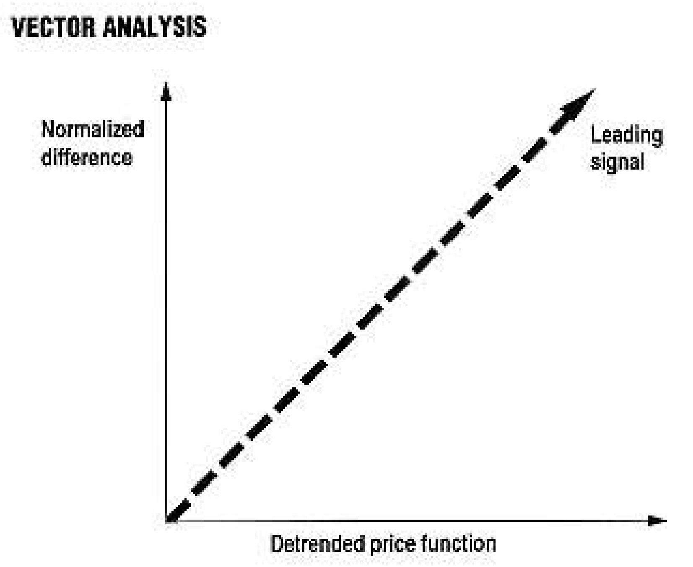
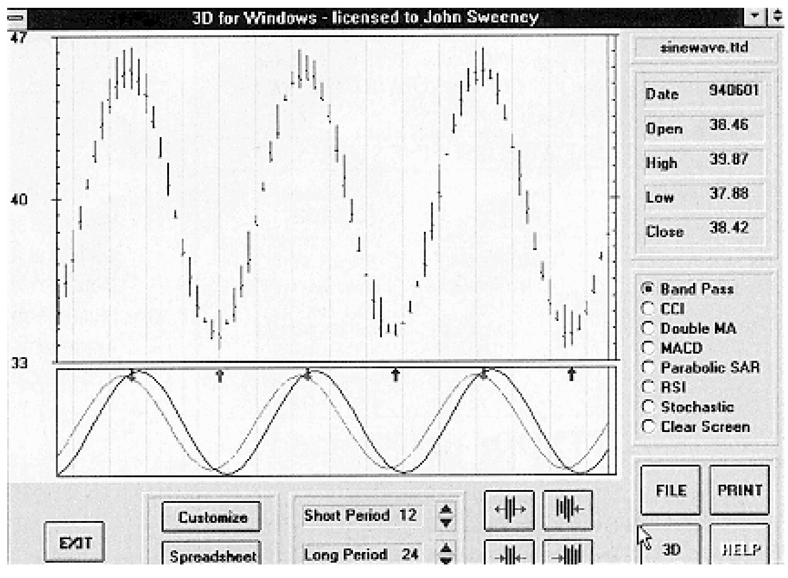
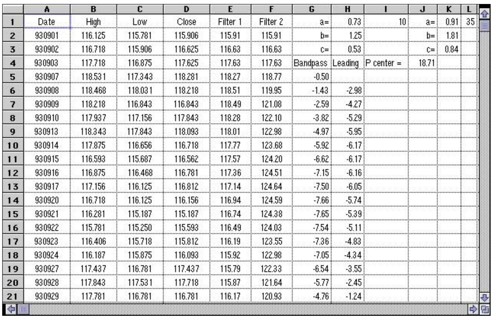
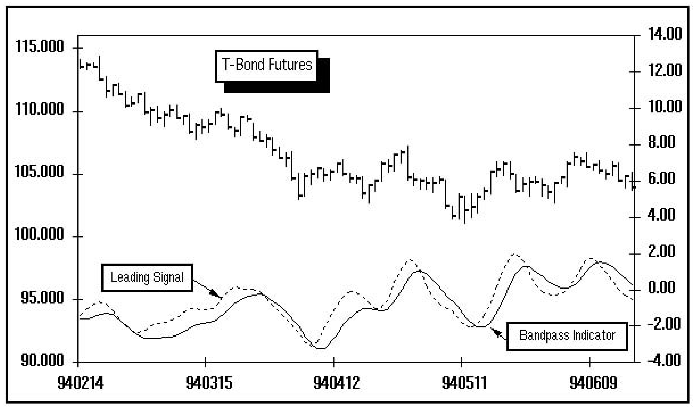

# The Bandpass Indicator

- **Author:** John F. Ehlers
- **Publication:** Technical Analysis of STOCKS & COMMODITIES, Volume 12, September 1994, pp. 370--375
- **Article URL:** [Article PDF](https://technical.traders.com/archive/article.asp?file=\V12\C09\BANDPAS.PDF)

---

*Here's an indicator that can be adjusted to be a leading indicator of market reversals based on the cycles in the price data, presented by a longtime S&C contributor.*

The bandpass indicator is an oscillator-type indicator. It makes full use of the digital computational power of your computer and therefore is superior to conventional oscillators such as the relative strength index (RSI) or the stochastic indicator when the market is in a cycle mode. If you were to stop and think about what an oscillator does, you would conclude that it performs two functions: it detrends the price, and it does some smoothing.

Now, these functional characteristics are true regardless of how the oscillator is constructed in the time domain. Thinking of the functions in terms of frequency: The oscillator removes the unwanted low-frequency components (detrends) and removes the unwanted high-frequency components (smoothes). Because the undesired frequencies are rejected, oscillators pass a band of desired frequencies in their transfer response. If oscillators pass a desired band of frequencies, why not attack the analysis problem head-on in the frequency domain?

That's exactly what the bandpass indicator does. The bandpass indicator rejects the undesired frequency components and allows only the desired frequency components to pass. The indicator differs from conventional oscillator filters in that, by working solely in the frequency domain, the bandpass indicator's sophisticated digital filters can be used to sharpen the boundary between the desired and undesired frequency components. As a result, superior detrending and smoothing is produced with no penalty in increased lag.

Continuing the thought process in the frequency domain, a leading signal is derived by using analogies from calculus and vector arithmetic. While the method may sound imposing for many traders, the signal is easy to calculate. In addition, this leading signal can be used with any oscillator to enter a trade virtually at the turning point of the cycle rather than waiting for a lagging confirmation. Its application is not restricted to the bandpass indicator.

The bandpass indicator can be used in any of three modes. Mode 1 is a universal setting, analogous to using a fixed 14-day RSI or a fixed five-day stochastic, regardless of market conditions. Mode 1 is not recommended, because the universal setting usually introduces lag into the indicator in an effort to capture all conditions. Mode 2 sets the upper and lower bandpass edges independently by examining profitability over recent history. Mode 3 sets the center frequency of the bandpass filter based on the observed period of the cycle in the price action, and the upper and lower edges of the filter passband are set as a separation from the center frequency, calculated as a fraction of the center frequency itself.

## Bandpass Indicator

The whole idea of the bandpass indicator is to perform all the calculations in the frequency domain because we can use sophisticated digital filters with this definition of the problem. I described the use of higher-order digital filters some time ago. These filters are called lowpass filters because they allow all the long-period components to pass with minimal attenuation and produce smoothing by reducing the amplitude of the shorter-period components in the input price signal. At that time, I concluded that perhaps a moving average was an overall better filter because a moving average introduces less lag than the more sophisticated filters for a selected cutoff point between the desired and undesired frequencies. On the other hand, the more sophisticated filters produce superior smoothing if one is acutely aware of the induced lag. The lag of a Butterworth-type lowpass filter can be calculated as:

$$\text{Lag} = \frac{NP}{\pi \cdot 2}$$

where:
- $N$ is the number of poles of the filter
- $P$ is the cutoff period of the filter
- $\pi = 3.14159$

These filters are calculated iteratively, like exponential moving averages (EMA). The output of the filter today depends on the previous outputs of the filter as well as the input price function. A one-pole filter (such as an EMA) only uses one previous output in its calculation. A two-pole filter uses two previous outputs in its calculation; a three-pole filter uses three previous outputs, and so on.

I use a three-pole filter as a practical compromise between the improved smoothing that can be obtained versus the amount of lag that can be tolerated. The equation to compute the output from a three-pole Butterworth filter is:

$$a = e^{(-\pi/P)}$$
$$b = 2a \cos(1.732 \cdot \pi / P)$$
$$c = a^2$$

$$g_z = (b + c) g_{z-1} - (c + bc) g_{z-2} + c^2 g_{z-3} + \frac{(1 - b + c)}{8} (f_z + 3f_{z-1} + 3f_{z-2} + f_{z-3})$$

where:
- $P$ is the cutoff period of the filter
- angles are measured in radians
- $z$ is the time counter, i.e., $(z-1)$ = yesterday
- $g_z$ is the filter output
- $f_z$ is the price input into the filter
- $e = 2.718$

Knowing the amount of induced lag, you can use this filter expression instead of a moving average to obtain superior smoothing.

The first step in calculating the bandpass indicator is to establish the amount of smoothing desired. For example, by setting $P=6$, all frequency components with a period of less than 6 will be attenuated. A three-pole filter output is calculated using this cutoff period. The next step is to calculate another three-pole filter response using a somewhat longer period to establish cutoff, for example, $P=30$. The final step is to subtract the second filter output from the output of the first.

Here's what happens when the procedure is followed. The first filter removes the undesired high-frequency (short-period) components. The second filter attenuates the high-frequency components even more. Both filters pass the undesired low-frequency (long-period) components with approximately equal amplitude. Therefore, when the difference between the two filter outputs is taken, the low-frequency components cancel. Both the undesired high-frequency components and the undesired low-frequency components are removed as a result. Only those frequency components that are higher than the cutoff of the first filter and where the lower-frequency components don't cancel are passed. A passband of desired frequencies that get through the combined filter is the result.

The interesting feature of the bandpass indicator is that the lag is zero at the center of the passband due to taking the difference of two lagging functions. The period of the center of the passband is approximately:

$$P_{\text{center}} = \sqrt{P_l \cdot P_u}$$

where:
- $P_l$ is the lower cutoff period
- $P_u$ is the upper cutoff period

Signal components whose periods are longer than at the filter's center actually have a leading phase. Signal components whose periods are shorter than at the center have a lagging phase. The three-pole filter was selected to avoid having the phase slope vary too steeply across the passband while still providing superior amplitude rejection of the undesired frequency components.

That's it. The bandpass indicator is just the difference of the output of two three-pole filters with different cutoff periods. The output of the bandpass indicator is a detrended and smoothed replica of the price function. The cyclic component of the filter output will be in phase with the cyclic component of the original price function. The trick in using the indicator is to know where to set the two cutoff periods. We'll discuss that aspect after we develop the leading signal for entry and exit of a cycle mode position.

## Leading Signal

Taking the simple bar-to-bar difference of price (traders call this momentum) is analogous to taking the calculus derivative. Since we are thinking in terms of the frequency domain, we can explore the impact of using a price difference. The derivative of a sine function is:

$$\frac{d \sin(\omega t)}{dt} = \omega \cos(\omega t)$$

where $\omega$ = angular frequency = $2\pi \cdot$ frequency

Why this is true is not important, so if you never studied calculus, take our word for it. We can make two observations about this equation. First, the derivative leads the original function by 90 degrees (a quarter cycle) because a cosine wave leads a sinewave by 90 degrees. Second, the derivative is different in amplitude from the original sinewave because the cosine wave is multiplied by the angular frequency.

If we take the simple difference of successive prices of a cyclic function, we can cause that difference to have the same amplitude as the price if we normalize the difference. Normalization is performed by multiplying the difference by $(1/\omega)$. In the bandpass indicator, the angular frequency is $2\pi$ divided by the period (the inverse of the frequency) at the center of the passband. Therefore, the amplitude normalization factor is:

$$\text{Normalizer} = \frac{P_{\text{center}}}{2\pi}$$

Using the normalizer, the difference function of the bandpass indicator output now has the same amplitude as the output and leads it by 90 degrees in phase (a quarter cycle). This is too much lead to be a good, reliable signal. We need to reduce the amount of phase lead, and we can do this with a little vector arithmetic.


**FIGURE 1: VECTOR ANALYSIS.** If you add the normalized difference to the detrended price function, you create a leading signal.

Figure 1 shows what happens when we add the normalized difference to the bandpass indicator output. The vector addition results in a vector that leads the output by only 45 degrees. Since this vector forms the hypotenuse of a right triangle, it is also larger than the output by a factor of 1.414. We simply divide the sum by 1.414 to achieve the correct amplitude for our leading signal.

In summary, we create a leading signal line by taking the difference of successive samples of a detrended and smoothed indicator; multiply that difference by $P_{\text{center}} / (2\pi)$; add that product to the indicator; and divide the sum by 1.414. If we call the bandpass indicator $BI$ for the difference between two Butterworth filters with different cutoff periods, then the formula for the leading signal ($LS$) is:

$$LS_z = \frac{(BI_z - BI_{z-1}) \cdot P_{\text{center}} / (2\pi) + BI_z}{1.414}$$

For an example of calculating the bandpass indicator and the leading signal, please see sidebar, "Calculating the bandpass indicator."

## Proof Of The Pudding

The power of the bandpass indicator and leading signal can be made clear in a single example. Figure 2 shows a theoretical 24-bar sinewave. The bandpass indicator and leading signal are shown in time synchronization below the bar chart. The long and short trade entry points are flagged by the crossings of the indicator and the signal. As you can see, these entry points are flawless in the case of a theoretical cycle. The indicator also performs well on real-world data when the cycle mode is identified. You would use the bandpass indicator any time you would use any other oscillator.


**FIGURE 2: 24-PERIOD SINEWAVE.** Using 12 and 24 cutoff periods, you can see that the generated signals are very timely.

## Setting The Band Edges

The band edges of the bandpass indicator can be set in one of three ways. First, a single universal setting can be used; second, the settings based on a study of profitability in recent history can be optimized; and third, the period of the center of the passband can be set to be the half period of an observed cycle. In this case, an octave bandwidth is suggested; the cutoff period of the second filter is twice the cutoff period of the first.

Suggested values for a universal setting of the bandpass indicator are 6 and 30 for daily data, which means the period at the center of the passband is 13.4. We no more recommend the universal setting than we would using a fixed 14-bar RSI or a fixed five-day stochastic. Our own optimization research shows the bandpass indicator typically outperforms the RSI and stochastic indicator by two to one for cycle mode conditions using this approach.

Determining the center of the passband using the observed cycle period is relatively easy. The cycle can be determined by counting the number of bars between successive highs, counting the bars between successive lows or counting the bars between a significant low and a significant high and multiplying by two. An octave bandwidth bandpass is suggested, centered at half the observed cycle period. Initial results from research, in which the bandpass indicator is tuned day by day by the maximum entropy spectral analysis (MESA)-measured cycle, suggest that this is a killer indicator for the cycle mode.

## Conclusion

An oscillator-type indicator was described where the line of logic was shifted to the frequency domain. By thinking in terms of frequency, more sophisticated digital filters can be used to sharpen the boundaries between keeping the desired frequency components and discarding the undesired frequency components. A leading signal was derived by continuing the train of thought in the frequency domain. Reliable cycle mode trade entry points are easily established by the crossing of the bandpass indicator and the leading signal. Settings for the bandpass indicator can be established using direct observation or through the use of more advanced analysis software.

---

*John Ehlers, Box 1801, Goleta, CA 93116, 805 969-6478, is an electrical engineer working in electronic research and development and has been a private trader since 1978. He is a pioneer in introducing maximum entropy spectrum analysis to technical trading through his MESA computer program.*

## Sidebar: Calculating The Bandpass Indicator

In calculating the bandpass indicator, the first step is the calculation of the two Butterworth filters using two different cutoff periods ($P$). Sidebar Figure 1 has the cutoff period 10 for filter 1 placed in cell I1, and for filter 2, the cutoff period is 35 and is placed in cell L1. You can use any cutoff period your analysis warrants. Each filter has three variables — $a$, $b$ and $c$ — calculated next.

For filter 1 (cutoff period = 10):
```
a = EXP(-PI()/I1)
b = 2*H1*COS(1.732*PI()/I1)
c = EXP(-2*PI()/I1)
```

For filter 2 (cutoff period = 35):
```
a = EXP(-PI()/L1)
b = 2*K1*COS(1.732*PI()/L1)
c = EXP(-2*PI()/L1)
```

At this point, each filter has its variables calculated based on cutoff periods. The date, high, low and closing prices for September Treasury bond futures are presented in columns A, B, C and D. Filters 1 and 2 are calculated in columns E and F, respectively. Each filter is a three-pole filter, which means the filter uses three previous outputs of the filter for today's calculation. To initialize the filter, use the closing price for each day for the past three cells.

Filter 1 formula (cell E5, copy down):
```
=(H2+H3)*E4-(H3+(H2*H3))*E3+((H3)^2)*E2+((1-H2+H3)*(1-H3)/8)*(D5+(3*D4)+(3*D3)+D2)
```

Filter 2 formula (cell F5, copy down):
```
=(K2+K3)*F4-(K3+(K2*K3))*F3+((K3)^2)*F2+((1-K2+K3)*(1-K3)/8)*(D5+(3*D4)+(3*D3)+D2)
```

The bandpass indicator is simply the difference between filter 1 and filter 2 (cell G5):
```
=E5-F5
```

The leading signal line needs the calculation of $P_{\text{center}}$ (cell J4):
```
=SQRT(I1*L1)
```

The leading signal line (cell H6, copy down):
```
=(((G6-G5)*$J$4/(2*PI()))+G6)/1.414
```


**SIDEBAR FIGURE 1: EXCEL SPREADSHEET.** The bandpass indicator and the leading signal start in cells G5 and H6, respectively.


**SIDEBAR FIGURE 2: SEPTEMBER T-BONDS.** The trading signals are the crossover of the bandpass indicator and the leading signal line.

In Sidebar Figure 2, the September T-bonds are plotted along with the bandpass indicator and the leading signal. The trading signals are late because the cycle periods are shortening. Using cutoff periods of 10 and 20 to put the average 14-day cycle (found by counting successive peaks and bottoms) in the center of the passband would improve the timing.

— Thom Hartle, Editor

## Additional Reading/Resources

- Ehlers, John [1989]. "Moving averages and smoothing filters," Technical Analysis of STOCKS & COMMODITIES, Volume 7: March.

---

## BibTeX

```bibtex
@article{ehlers1994bandpass,
  author  = {Ehlers, John F.},
  title   = {The Bandpass Indicator},
  journal = {Technical Analysis of STOCKS \& COMMODITIES},
  year    = {1994},
  volume  = {12},
  number  = {9},
  pages   = {370--375},
  url     = {https://technical.traders.com/archive/article.asp?file=\V12\C09\BANDPAS.PDF}
}
```
