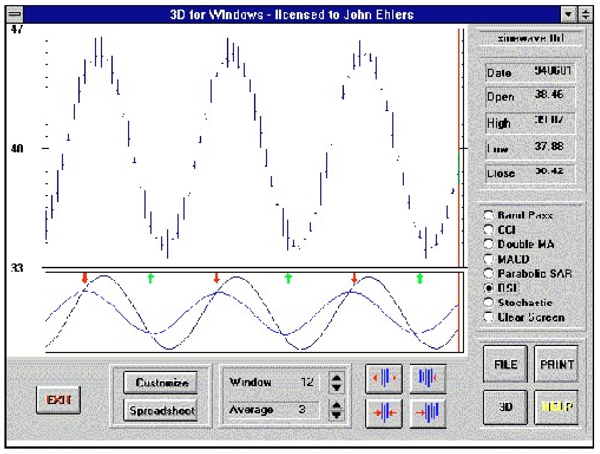
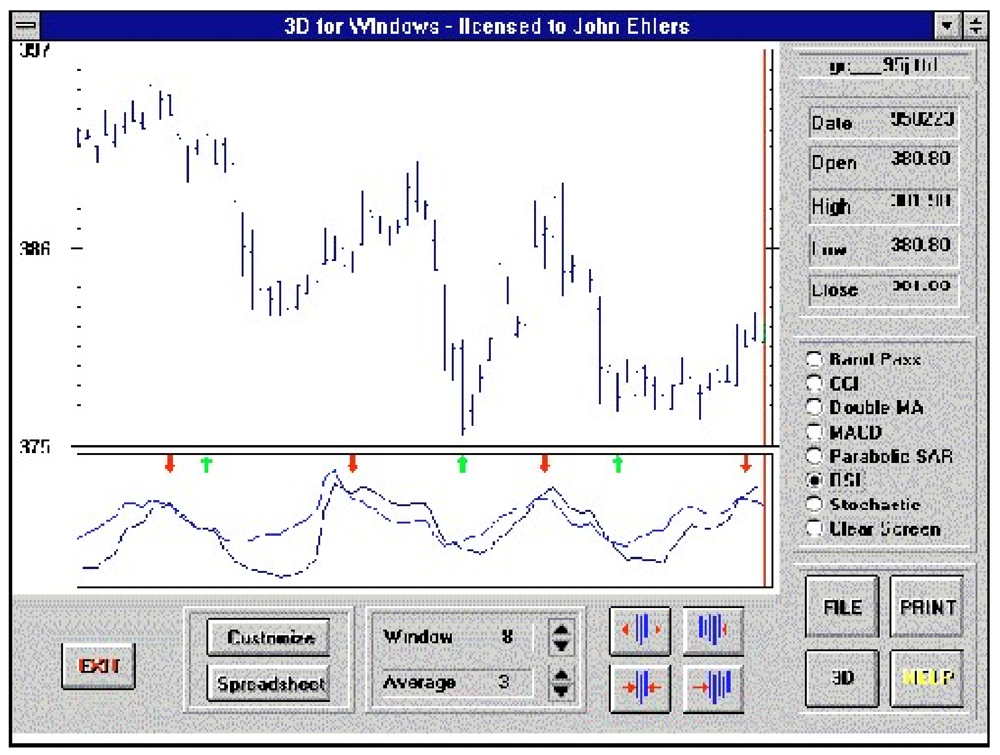

# Optimum Predictive Filters

- **Author:** John F. Ehlers
- **Publication:** Technical Analysis of STOCKS & COMMODITIES, Volume 13, June 1995, pp. 247--251
- **Article URL:** [Article PDF](https://technical.traders.com/archive/article.asp?file=\V13\C06\OPTIMUM.pdf)

---

*The optimum predictive filter is the difference between a technical indicator, such as the relative strength indicator or stochastics, and its exponential moving average. Here, we describe it, how to generate it, and how it can be used. It cannot be used in all market conditions — but carefully observing when it can be used can make it a valuable weapon in your technical arsenal.*

Technical analysis is reactive to market activity. The indicators we develop are largely generated to note the expected price direction. The predictive nature of these indicators is based on our experience, so the expectation is that if a particular action occurred previously, it will occur again. However, none of the indicators are truly predictive in the scientific sense.

Here, we will examine a predictive filter, how to generate it, and most important, the conditions under which the filter can be most effectively used. Like all technical indicators, the optimum predictive filter cannot be used universally in all market conditions. Observing those conditions where it can be used, however, can make the filter a valuable tool in your technical toolbox.

## What It Is

An optimum predictive filter is simply the difference between the original indicator and its exponential moving average. It really is that simple! While the implementation is simple, however, the derivation is considerably more complex.

Having defined an optimum predictive filter, we must specify the conditions for that filter to be valid. First, the amplitude swings of the original indicator must be limited, and second, the probability of the indicator passing through its zero value must satisfy a Poisson probability distribution. Both conditions are easy to satisfy.

A Poisson probability distribution means that if there is an average number of zero crossings, then the number of crossings we can expect will not be too far removed from that average. The probability distribution may be approximated using market data if the prices have been detrended. It is crucial that detrending be properly accomplished because the buy/sell signals are obtained by the crossing of the detrended price and the predictive filter lines. If the price has not been properly detrended to meet the probability constraint, then the lines will not cross correctly.

It is also simple to satisfy the amplitude swing requirement using conventional technical indicators such as stochastics or the relative strength indicator (RSI). J. Welles Wilder, who developed the RSI, defined it as:

$$\text{RSI} = 100 - \frac{100}{1 + RS}$$

where:
- $RS = CU / CD$ (Relative Strength)
- $CU$ = sum of closes up over the observation period
- $CD$ = sum of closes down over the observation period

CU is the sum of the day-to-day differential closing prices over an observed period. If the closing price differential is down for a given day, then its contribution to CU is zero. In a similar manner, CD indicates the sum of the day-to-day differential closing prices over the observation period. Only declining prices are considered, and these are summed as positive numbers. Using algebra and neglecting the scale factor of 100, the RSI is the ratio of the value of closes up over the observation period to the sum of all closing price differentials as:

$$\text{RSI} = \frac{CU}{CU + CD}$$

Using this formulation, it becomes easy to see that the RSI has a maximum value of 1 when there are no closes down and it has a minimum value of zero when there are no closes up. Therefore, the RSI satisfies the condition of having limited amplitude swings from minimum to maximum. The RSI can be centered on zero (when properly detrended) by subtracting 0.5 from the computed RSI.

The stochastic indicator is defined by the equation:

$$K = \frac{CL(d) - LO}{HI - LO}$$

where:
- $CL(d)$ = the current closing price
- $LO$ = the lowest low over the observation period
- $HI$ = the highest high over the observation period

The stochastic indicator is also amplitude limited between zero and 1. It has a value of 1 when the current closing price is equal to the highest high over the observed period and zero value when the current closing price is equal to the lowest low over the observation period.

"Proper" detrending of the RSI and stochastic can be accomplished by altering their observation periods. Proper detrending might best be understood by examining the extremes of improper detrending. If we used a one-year observation period of daily data to create the RSI, the RSI would stay very near 0.5 because the sum of the closes up would statistically be near half the total of all differential closes. On the other hand, the RSI would erratically bounce from zero to 1 if we had a one-day observation period.

As we increase the observation period, the indicator takes on more of the characteristics of a rectangular wave between the zero and 1 limits as we plot it. When we further increase the period, the RSI ideally assumes the shape of a sine wave where the peaks and valleys of the wave barely touched the maximum and minimum values. When this condition is reached, the RSI has been detrended.

If you look at the market from a cyclical perspective, proper detrending occurs when the observation period is between a half cycle and a full cycle length. (A full cycle length is the period between successive maxima or minima.) The shorter length is more appropriate if the resulting RSI is near a maximum or minimum value. If you prefer, the same proper detrending will result if you sequentially shorten the observed interval, starting from a long period. In this case, the RSI swings increase until the extremes just touch the zero and 1 limits.

A stochastic indicator is more likely to be properly detrended when the observation period is approximately one full cycle period. It is often difficult to properly detrend the stochastic because it persistently remains near a maximum or minimum value. This indicates that the price is in a trend mode, and the probability distribution constraint cannot be met. In such cases, the only thing to do is to switch to a trend-following technical approach.

## What It's Not

An optimum predictive filter is not a component of a trend-following system. Since we are working with detrending indicators, the intended use of the optimum predictive filter is to anticipate short-term market turning points. If the conditions of use cannot be met, don't try to force this indicator. It will just end up costing you money.

## Limitations

An exponential moving average (EMA) produces two functional results: First, the averaged output is delayed relative to the original function, and second, the output amplitude is reduced by the smoothing action of the average. The relationship between delay and the EMA constant is described in the sidebar, "Averaging lag and EMA constant," for a pure trend mode condition. Delay for the sine wave-like detrended function is more complicated because of nonlinearities.

We can get some insight into how the optimum predictor works if we momentarily ignore the reduced amplitude of the EMA. If we describe the angle generating a cosine wave as $\phi$ and the phase angle lag of the EMA as the angle $\theta$, then the simplified equation for the optimum predictive filter is:

$$\cos(\phi) - \cos(\phi - \theta) = 2 \cos(\phi + 90 - \theta) \sin(\theta / 2)$$

This equation basically tells us that the phase lead of the predictor will be the complement of the EMA lag angle, and therefore, we have some control over the amount of prediction we can expect. Further, a very short EMA lag produces near the maximum amount of prediction lead. The short EMA lag is not useful because the amplitude of the predictor is small due to the $\sin(\theta/2)$ term.

A number of nonlinearities enter the real-world picture here. For example, the EMA lag can never exceed a quarter cycle. The only practical way to assess the performance of the optimum predictive filter is by tabulating the results, as we have done in Figure 1. The entry point is the fraction of a full cycle period you expect to induce through the use of the EMA. Knowing the length of the full cycle, you can easily calculate the EMA constant from the final equation in the sidebar. Figure 1 shows that the lag angle is very nearly the same as the induced lag when the angle is small, but the lag angle never gets to 90 degrees (that is, a quarter cycle). Figure 1 shows that as the induced lag is increased, the amplitude of the predictor rises and the amplitude of the EMA decreases. An oversimplified but easy to remember rule is that the best-induced lag is one-eighth of a cycle (45 degrees), resulting in both the EMA and predictor having equal amplitudes of 0.7 times the amplitude of the RSI or stochastic.

**FIGURE 1: EMA AND PREDICTOR RESPONSES.**

| Delay (fraction of a cycle) | EMA lag angle (degrees) | EMA amplitude | Predictor lead angle (degrees) | Predictor amplitude |
|---|---|---|---|---|
| 0.06 | 17 | 0.96 | 76 | 0.26 |
| 0.10 | 28 | 0.91 | 67 | 0.52 |
| 0.15 | 43 | 0.87 | 48 | 0.67 |
| 0.20 | 56 | 0.70 | 37 | 0.75 |
| 0.25 | 65 | 0.63 | 32 | 0.83 |
| 0.30 | 61 | 0.56 | 26 | 0.87 |
| 0.35 | 64 | 0.50 | 23 | 0.89 |
| 0.40 | 69 | 0.50 | 13 | 0.91 |

An even easier rule to remember is to use an EMA constant of 0.25. This corresponds to an induced lag of three days. You can expect reasonable performance from the optimum predictive filter for cycle periods over the range from 12 to 24 days. These cycle periods corresponding to EMA lag range from a quarter cycle to one-eighth of a cycle.

## Step By Step

The following procedure assumes the use of an RSI as the starting point indicator. You can use a stochastic or other amplitude-limiting indicator equally well.

1. Optimally detrend the indicator by gradually decreasing the observation period so that the peak values almost reach the minimum and maximum indicator limits. The resulting waveform should look like a sine wave, with relatively consistent crossings of the median value. If you can't get a proper waveform, it's probably best to abandon the predictor at this point.

2. Subtract 0.5 from the indicator so the median value is zero. (Subtract 50 if you use a range described in terms of percentage.) For the sake of simplicity, we will call this the RSI.

3. Take an EMA of the RSI. The most commonly used value of EMA constant is 0.25.

4. Subtract the EMA of step 3 from the RSI. This is the optimum predictive line. Plot the optimum predictor as an overlay to the RSI.

5. The buy and sell signals are generated when the optimum predictor crosses the RSI.

If the signals are too noisy, you may wish to smooth the EMA in step 2 with a moving average before you take the lagging EMA in step 3. Other smoothing techniques can also be used.

## Examples

I always test my theories on theoretical waveforms before trying to use them in real trading situations. The theoretical waveforms allow the testing to be done under controlled conditions. This, in turn, lets me examine the limits of the technique's usefulness.

Figure 2 is a theoretical 24-day sine wave; the RSI is plotted below the bar chart. The optimum detrending occurs when the observation period of the RSI is a half-cycle, or 12 days. The optimum predictive filter is calculated using one-eighth of a cycle-induced lag, or three days; that is, the EMA constant is 0.25. Figure 2 shows the reduced amplitude of the predictive filter line and how it leads the action of the RSI itself. Most important, the buy/sell indications are provided in time to take advantage of the full cycle swing as a trading position.


**FIGURE 2: OPTIMIZED PREDICTIVE FILTER FOR A 24-BAR SINE WAVE.** Shown here is a theoretical 24-day sine wave; the RSI is plotted below the bar chart. The optimum detrending occurs when the observation period of the RSI is a half-cycle. The optimum predictive filter is calculated using one-eighth of a cycle-induced lag. The reduced amplitude of the predictive filter line and how it leads the action of the RSI itself can be seen here.

Knowing that the optimum predictive filter works in controlled conditions, we can turn our attention to real-world situations. In Figure 3, we have optimally detrended the April 1995 gold futures contract using an eight-day period of observation for the RSI because the contract had a 16-day cycle over most of the screen. We retain the three-day induced lag for the EMA. The resulting buy/sell signals, indicated by the up and down arrows where the optimum predictor crosses the RSI, are outstanding where the contract was properly detrended! Detrending was not properly performed in the left third of the chart, however, and poor signals resulted. The indicator works because all the conditions have been met and the RSI has been "properly" detrended. As a result, the crossings of the median values have an approximate Poisson probability distribution — that is, these crossings occur regularly. We are rewarded in our search with these outstanding trading signals.


**FIGURE 3: OPTIMIZED PREDICTIVE FILTER FOR APRIL 1995 GOLD.** We have optimally detrended the April 1995 gold contract using an eight-day period of observation for the RSI because the contract had a 16-day cycle over most of the screen. Detrending was not properly performed in the left third of the chart, and poor signals resulted. The indicator works because all the conditions have been met and the RSI has been "properly" detrended.

## One Man's Poisson

Other optimum predictive filters are possible. For example, an optimum predictive filter was described as part of the band pass indicator, described in my article in the September 1994 STOCKS & COMMODITIES. This kind of predictive filter is described as a "pure predictor" because it does not consider the impact of noise. Since the pure predictor is not constrained by noise considerations, the amplitude of the originating function need not be limited; nor are there any probability restrictions on its use. The pure predictor is generated by carefully scaling the momentum of a smooth function. If the function is noisy, the pure predictor is so erratic that it is almost useless. However, the pure predictor is appropriate for use with the band pass indicator because the higher-order filters used in the calculation provide a high degree of smoothing. The band pass indicator can be found in my MESA for Windows and 3D for Windows programs, as well as on several computer bulletin boards around the country.

Still other kinds of predictive filters are possible. Students of theory may be interested to know that the response of an optimum system is described by a solution of the Wiener-Hopf equation, which arises from the analysis of random walk theory. There is more than one solution to this general equation, the various solutions being determined by the characteristics of the waveforms being filtered.

## Conclusions

An optimized predictive filter can be generated as a minor extension of conventional indicators such as the RSI or stochastics. The predictive filter can be programmed into most toolbox programs, improving the indicator's functionality.

While the optimized predictive filter can be valuable, the conditions for its use must be carefully observed. These conditions are that the RSI or stochastic must be properly detrended and the resulting crossings of the median value must be relatively consistent. The typical prediction is approximately one-eighth of a cycle. For a cycle as short as eight days, this is a one-day advance warning — just enough to make an entry at the proper time. When the cycles are longer, you may want to wait a day or two before making an entry because the prediction is a little early. In any event, the optimum predictive filter is a major tool to overcome the reactive nature — the lag — of technical indicators.

---

*John Ehlers is an electrical engineer working in electronic research and development and has been a private trader since 1978. He is a pioneer in introducing maximum entropy spectrum analysis to technical trading through his MESA computer program.*

## Sidebar: Averaging Lag And The EMA Constant

The equation to compute an exponential moving average (EMA) is:

$$\text{EMA}_i = \alpha \cdot F + (1 - \alpha) \cdot \text{EMA}_{i-1}$$

where:
- $\alpha$ = EMA constant
- $F$ = Function being averaged
- $\text{EMA}_{i-1}$ = Yesterday's EMA value

Picture a function that increases by 1 for each new day. Then, on the generalized $i$th day the function will have a value of $i$. Assume the EMA lag is $K$. Then the EMA will have a value of $(i - K)$ on the $i$th day and will have a value of $(i - K - 1)$ on the previous day. Inserting these values in the EMA equation, we have:

$$i - K = \alpha \cdot i + (1 - \alpha)(i - K - 1)$$
$$= \alpha i + i - K - 1 - \alpha i + \alpha K + \alpha$$
$$0 = -1 + \alpha K + \alpha$$
$$\alpha = \frac{1}{K + 1}$$

Thus, the EMA constant is computed as the reciprocal of one plus the expected delay. This method of determining the EMA constant is far more functional than relating the EMA constant to a simple moving average period.

## References, Resources And Reading

- Ehlers, John F. [1994]. "The bandpass indicator," Technical Analysis of STOCKS & COMMODITIES, Volume 12: September.
- Lee, Y.W. [1966]. *Statistical Theory of Communication*, John Wiley & Sons.
- Wilder, J. Welles [1978]. *New Concepts in Technical Trading Systems*, Trend Research.

---

## BibTeX

```bibtex
@article{ehlers1995optimum,
  author  = {Ehlers, John F.},
  title   = {Optimum Predictive Filters},
  journal = {Technical Analysis of STOCKS \& COMMODITIES},
  year    = {1995},
  volume  = {13},
  number  = {6},
  pages   = {247--251},
  url     = {https://technical.traders.com/archive/article.asp?file=\V13\C06\OPTIMUM.pdf}
}
```
