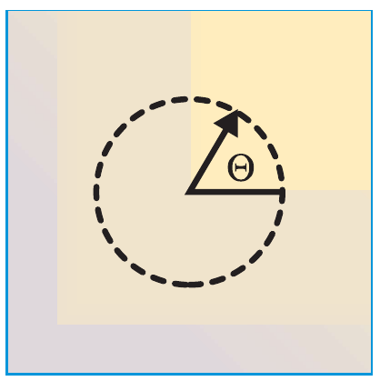
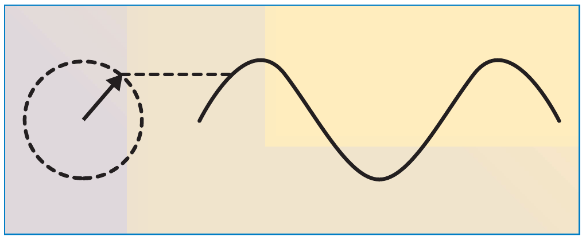
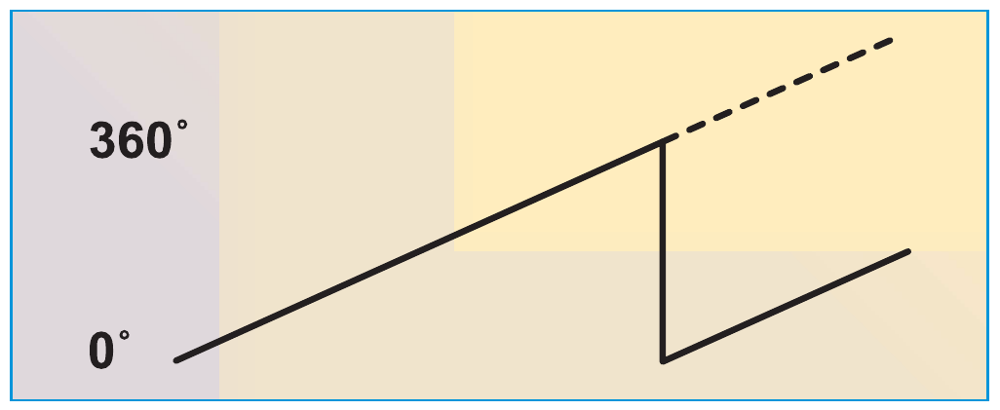
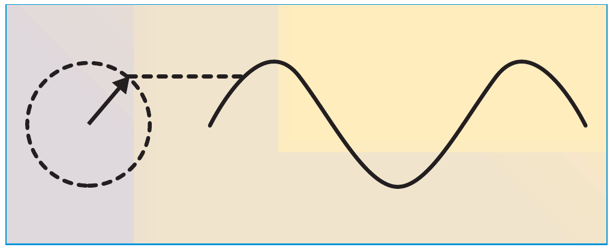
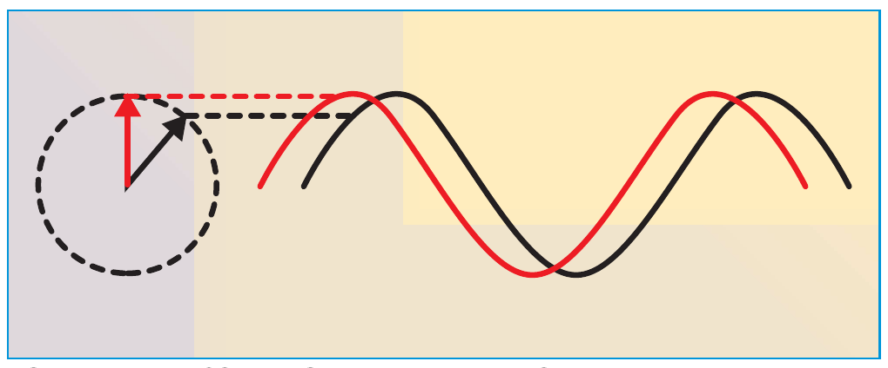
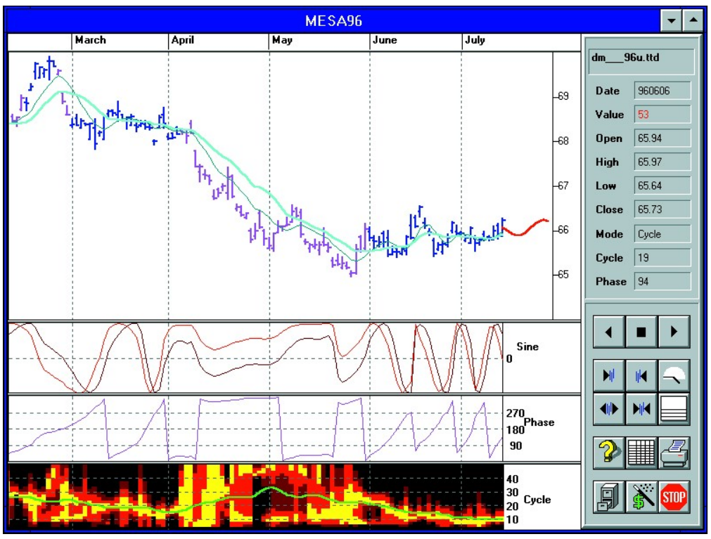
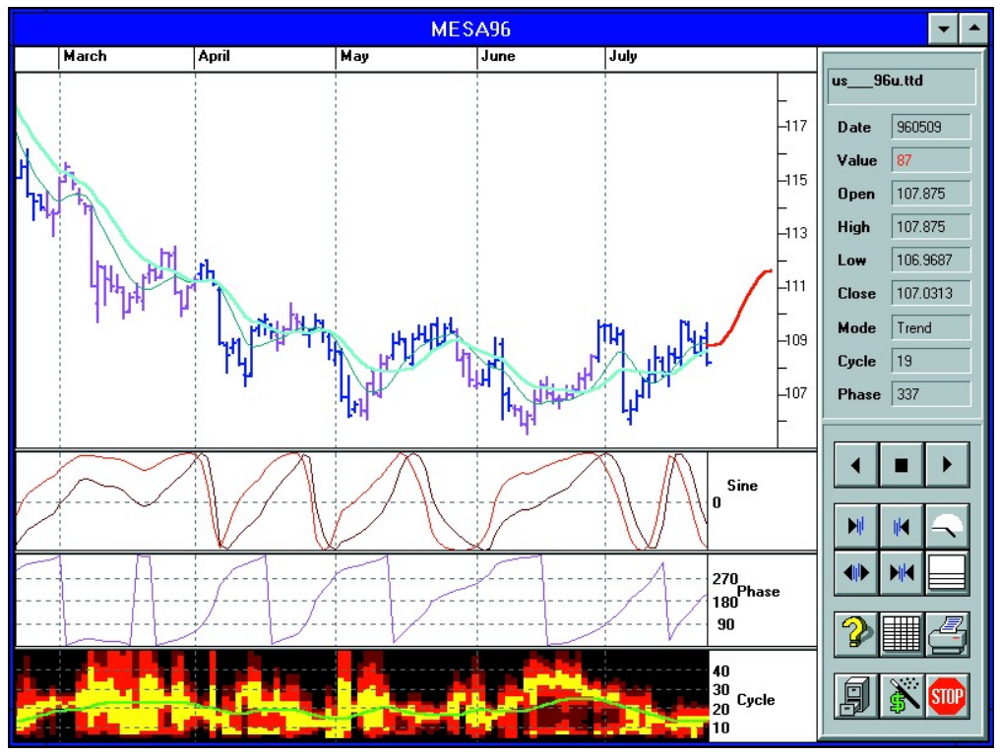

# Stay In Phase

- **Author:** John F. Ehlers
- **Publication:** Technical Analysis of STOCKS & COMMODITIES, Volume 14, November 1996, pp. 483--487
- **Article URL:** [Article PDF](https://technical.traders.com/archive/article.asp?file=\V14\C11\STAYINP.pdf)

---

*This cycles software specialist discusses an indicator based on cyclical analysis.*

A cycle is one market characteristic that can be scientifically measured. Although they can be measured, they are still maddening because they are in essence ephemeral; they come and they go. Our recent research, however, indicates there is a fundamental cycle parameter that leads us to the correct trading strategy for any current market mode. To find out more, we must start by defining two possible market modes, the trend mode and the cycle mode. In the trend mode, the correct strategy is to buy (or sell, for downtrends) and hold. In the cycle mode, the correct strategy is to buy and sell on the cyclic valleys and peaks.

The parameter we use is the phase of the cycle. The measured phase tells us with great sensitivity when we are in the trend mode, enabling the capture of a large fraction of the trend movement. Typically, this capture range is far larger than can be obtained with a crossing moving average or other usual trend identification techniques. In the cycle mode, the measured phase pinpoints the cyclic turns in advance, with the further advantage that the false whipsaw signals of typical oscillator signals are avoided.

## The Nature Of Phase

To use phase, we must first understand what it is. Simply, it is a description of where we are in the cycle. Are we at the beginning, middle or end of the cycle? Phase is a quantitative description of that location. Each cycle passes through 360 degrees to complete the cycle. One basic definition of a cycle is that it consists of an action having a uniform rate change of phase. For example, a 10-day cycle passes through 360 degrees every 10 days. Therefore, a perfect cycle must change phase at the rate of 36 degrees per day each day throughout the cycle.

How does this help us see a trend mode? By reverse logic. In a trend mode, there is no cycle, or at most a very weak one, and therefore, there is no rate change of phase. If we compare the rate change of measured phase to the theoretical rate change of phase of the weak dominant cycle in the trend mode, we get a correlation failure. This failure to correlate the two cases of the rate change of phase enables us to define the presence of a trend. By knowing we have a trend, it is easy to set our strategy to a simple buy-and-hold method until the trend disappears.

## Picture This

One easy way to picture a cycle is as an indicator arrow bolted to a rotating shaft, as can be seen in the phasor diagram of Figure 1. Each time the arrowhead sweeps through one complete rotation, a cycle is completed. The phase increases uniformly throughout the cycle, as shown in Figure 2. The phase continues for the next cycle but is usually drawn as reset to zero to start the next cycle.


**FIGURE 1: PHASE.** Consider a cycle to be one trip around a circle, or a 360-degree movement. Phase describes the location within a cycle in degrees.

If we also place a pen on the arrowhead and draw on a sheet of paper below the arrowhead at a uniform rate, much in the way like a seismograph, the pen draws a theoretical sinewave. The relationship between the phasor diagram and the theoretical sinewave is shown in Figure 3. The sinewave is the typical cycle waveform we recognize in the time domain on our charts. The phase angle of the arrow uniquely describes where we are in the time domain waveform.


**FIGURE 2: ADDING TIME.** A sinewave in the time domain can be generated by placing a pen on the arrowhead and drawing the paper along at a uniform rate, just like a seismograph.


**FIGURE 3: CYCLE BEGINNING.** Phase varies uniformly throughout the cycle, and is drawn as reset to show the beginning of a new cycle.

## But First, Some Trig

The position of the tip of the arrow in Figure 1 can be described in terms of the length of the arrow, $L$, and the phase angle, $\theta$. If we let the arrow be the hypotenuse of a right triangle, we can convert the description of the arrow from length and angle to two orthogonal components — the other two legs of the right triangle. The vertical component is $L \sin(\theta)$ and the horizontal component is $L \cos(\theta)$. The ratio of these two components is the tangent of the phase angle. So if we know the two components, all we have to do to find the phase angle is to take the arctangent of their ratio. This is something that may not be easy for you to do by hand, but it's a breeze for your computer.

We measure the phase of the dominant cycle by establishing the average lengths of the two orthogonal components. This is done by correlating the data over one full cycle period against the sine and cosine functions. Once the two orthogonal components are measured, the phase angle is established by taking the tangent of their ratio.

A simple test is to assume the price function is a perfect sinewave, or $\sin(\theta)$. The vertical component would be $\sin(\theta) = 0.5(1 - \cos(2\theta))$ taken over the full cycle. The $\cos(2\theta)$ term averages to zero, with the result that the correlation has an amplitude of $\frac{1}{2}$. The horizontal component is $\sin(\theta) \cos(\theta) = 0.5 \sin(2\theta)$. This term averages to zero over the full cycle, with the result that there is no horizontal component. The ratio of the two components goes to infinity because we are dividing by zero, and the arctangent is therefore 90 degrees. This means the arrow is pointing straight up, right at the peak of the sinewave.

One additional step in our calculations is required to clear the ambiguity of the tangent function. In the first quadrant, both the sine and cosine have positive polarity. In the second quadrant, the sine is positive and the cosine is negative. In the third quadrant, both are negative. Finally, in the fourth quadrant, the sine is negative and the cosine is positive. The phase angle is obtained regardless of the amplitude of the cycle. For more information on the calculation, see sidebars, "BASIC code for phase calculation" and "TradeStation code for phase calculation."

## Putting The Phase To Work

We can make an outstanding cyclic indicator simply by plotting the sine of the measured phase angle. When we are in a cycle mode, this indicator looks very much like a sinewave, but when we are in a trend mode, the sine of the measured phase angle tends to wander slowly because there is only an incidental rate change of phase. A clear, unequivocal indicator can be generated by plotting the sine of the measured phase angle advanced by 45 degrees.

Such a case is depicted for the phasor diagram and the time domain in Figure 4B. The two lines cross shortly before the peaks and valleys of the cyclic turning points, enabling the user to make his trading decision in time to profit from the entire amplitude swing of the cycle. A significant advantage is that the two indicator lines don't cross except at cyclic turning points, avoiding the false whipsaw signals of most oscillators when the market is in a trend mode. The two lines don't cross because the phase rate of change is nearly zero in a trend mode. Since the phase does not change, the two lines separated by 45 degrees in phase never get the opportunity to cross.


**FIGURE 4A: PLOTTING THE SINE OF THE MEASURED PHASE ANGLE.** When in a trend mode, the sine of the measured phase angle tends to wander around slowly because there is only an incidental rate change of phase.


**FIGURE 4B: PHASOR DIAGRAM AND TIME DOMAIN.** Sinewave indicator is created by advancing the measured phase by 45 degrees.

If the rate of change of the measured phase does not correlate with the theoretical phase rate change of the dominant cycle, then a trend must be in force. A workable definition is that a trend exists when the measured phase rate of change is less than 67% of the theoretical phase rate of the dominant cycle. This is a very sensitive detector for the trend mode, enabling you to capture high percentages of the trend movement.

## Real World Examples


**FIGURE 5: SEPTEMBER 1996 DEUTSCHEMARK.** Here's the cycle and phase response of the September 1996 Deutschemark.

Figure 5 is a display for the September 1996 Deutschemark contract. The price bars are displayed in the top segment with two adaptive moving average overlays. The second segment is the sinewave indicator, plots of the sine of the measured phase angle and the phase angle advanced by 45 degrees. The measured phase is displayed below the sinewave indicator, and the measured dominant cycle and spectrum are displayed in the bottom segment.

From the way the phase varied uniformly in March, it is clear that Deutschemark was in the cycle mode during that month. As a result, the sinewave indicator looks like a sinewave and gives two buy signals and one sell signal where the sinewave indicator lines cross.

The phase stopped changing at a uniform rate in April and May because two cycles identified by the spectrum display were present simultaneously. Since the phase hardly changed from day to day, the Deutschemark went into a trend mode during these two months. The trend mode is identified, in TradeStation lingo, by "PaintBars," where the price bars are violet.

The correct trading strategy during April and May was to hold a short position (a move worth more than $2,500 per contract) because the faster adaptive moving average was below the slower one. Another way to identify the downtrend is that the phase remained near zero degrees (or near 360 degrees) during these two months. Note that the sinewave indicator does not give false whipsaw signals during April and May. Whipsaws in the trend mode are common for oscillator indicators such as the stochastic and the relative strength indicator (RSI).

The phase resumed its uniform rate of change during June and into July because the dominant cycle settled down to a relatively stationary value. As a result, the cycle mode appeared, the sinewave indicator again looks like a sinewave, and four excellent sell signals and three excellent buy signals resulted.


**FIGURE 6: CYCLE AND PHASE RESPONSE OF SEPTEMBER 1996 TREASURY BONDS.** Bonds were in a decline in February and March. The phase hovered near zero degrees, clearly identifying the downtrend. The correct trading strategy in this period was to hold a short position until the first cyclic buy signal given by the sinewave indicator early in April.

Figure 6, showing the cycle and phase response of the September contract of US Treasury bonds, is another example of how phase can be used to sharpen your trading skills. In February and March, bonds were in a decline. The phase hovered near zero degrees, clearly identifying the downtrend. The correct trading strategy during this period was to hold a short position until the first cyclic buy signal given by the sinewave indicator early in April.

From that first cyclic buy signal, there were three more cyclic buy signals and three cyclic sell signals in the ensuing three months. Bonds didn't stay exclusively in the cycle mode during that time because the cycle length tended to wander around. However, the cycle wandering only introduced distortions in the shape of the sinewave indicator. The crossover signals it produced were unequivocal and would have produced substantial profits in every case.

## Conclusion

Phase is an exciting new parameter to help technicians analyze the market, and it can help in several regards. First, it enables you to establish your trading strategy to fit the trend mode or the cycle mode. If you aren't comfortable trading the cycle mode, you can always stand aside for a while until a new trend mode is established. If you want to trade the cycle mode, the sinewave indicator, which is created by plotting the sine of the phase angle and the sine of the phase angle advanced by 45 degrees, gives clear buy and sell signals in advance of each cyclic turn. Getting the signal in advance enables you to make your entry and exit right at the cyclic turning point without giving up a piece of the market movement.

---

*John Ehlers is an engineer and developer of the MESA96 trading software program.*

## BASIC Code For Phase Calculation

This BASIC code finds the real part of the phasor (the horizontal component) and the imaginary part of the phasor (the vertical component) by summing the product of the price and the two sinusoids over one full cycle of the dominant cycle. The arctangent function locates the phase to be in the first or fourth quadrant. The quadrant ambiguity is removed by adding $\pi$ to the phase angle if the real part is negative. A value of $\pi/2$ is arbitrarily added to the computed phase so the start of the cycle is referenced to a sinewave. The computed phase angle is then tested to fall within the range from zero to $2\pi$. The phase is then converted to degrees from radian measure.

An interesting observation is that if the price is a linear slope, summing the product of the price and a sine over a cycle is the discrete equivalent of the integral $\int x \sin(x) \, dx$. Correspondingly, the real part is the equivalent of the integral $\int x \cos(x) \, dx$. Working through these theoretical examples, we find that the phase is 180 degrees for a trending upslope and zero degrees for a trending downslope. Thus, phase can be a sensitive way to detect a trend.

The dominant cycle is a required parameter in the code. This can be a constant, obtained by measuring the number of bars between significant lows or significant highs. As with the TradeStation code, you can use a default value of 15 for the dominant cycle. In MESA96, the dominant cycle is measured for every bar and can change from bar to bar.

```basic
Pi = 3.1415926
TwoPi = 2 * Pi
For I = FirstRecord to LastRecord
    RealPart = 0
    ImagPart = 0
    For J = 0 To DominantCycle(I) - 1
        If I > DominantCycle(I) Then Weight = Close(I - J)
        RealPart = RealPart + Cos(TwoPi * J / DominantCycle(I)) * Weight
        ImagPart = ImagPart + Sin(TwoPi * J / DominantCycle(I)) * Weight
    Next
    If Abs(RealPart) > .001 Then
        Phase(I) = Atn(ImagPart / RealPart)
    Else
        Phase(I) = Pi / 2 * Sgn(ImagPart)
    End If
    If RealPart < 0 Then Phase(I) = Phase(I) + Pi
    Phase(I) = Phase(I) + Pi / 2
    If Phase(I) < 0 Then Phase(I) = Phase(I) + TwoPi
    If Phase(I) > TwoPi Then Phase(I) = Phase(I) - TwoPi
    Phase(I) = 180 * Phase(I) / Pi
Next
```

## TradeStation Code For Phase Calculation

The following code is written in EasyLanguage for use with TradeStation. The major differences from the BASIC code are that the angles are computed in degrees rather than radians and the input to the routine is the dominant cycle. We have let the default dominant cycle be 15 bars.

```easylanguage
inputs: DomCycle(15);
vars: RealPart(0), ImagPart(0), Weight(0), Phase(0), J(0);

for J = 0 to DomCycle - 1 Begin
    weight = close[J];
    If DomCycle <> 0 then Begin
        RealPart = RealPart + Cosine(360 * J / DomCycle) * Weight;
        ImagPart = ImagPart + Sine(360 * J / DomCycle) * Weight;
    end;
end;

If AbsValue(RealPart) > .001 Then Begin
    Phase = ArcTangent(ImagPart / RealPart);
end
else Begin
    Phase = 90 * Sign(ImagPart);
end;

If RealPart < 0 then Phase = Phase + 180;
Phase = Phase + 90;

If Phase < 0 then Phase = Phase + 360;
If Phase > 360 then Phase = Phase - 360;

plot1(Phase, "Phase");
```

---

## BibTeX

```bibtex
@article{ehlers1996phase,
  author  = {Ehlers, John F.},
  title   = {Stay In Phase},
  journal = {Technical Analysis of STOCKS \& COMMODITIES},
  year    = {1996},
  volume  = {14},
  number  = {11},
  pages   = {483--487},
  url     = {https://technical.traders.com/archive/article.asp?file=\V14\C11\STAYINP.pdf}
}
```
