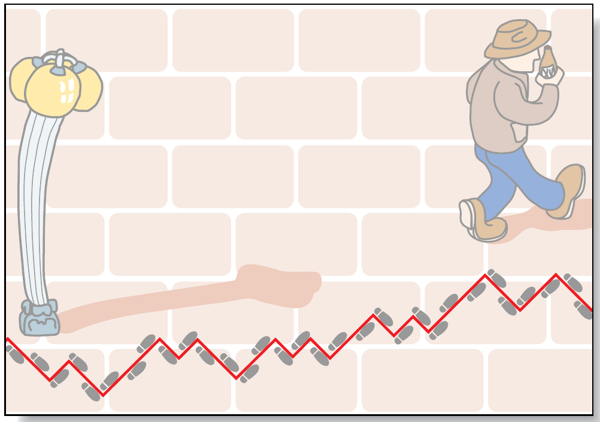
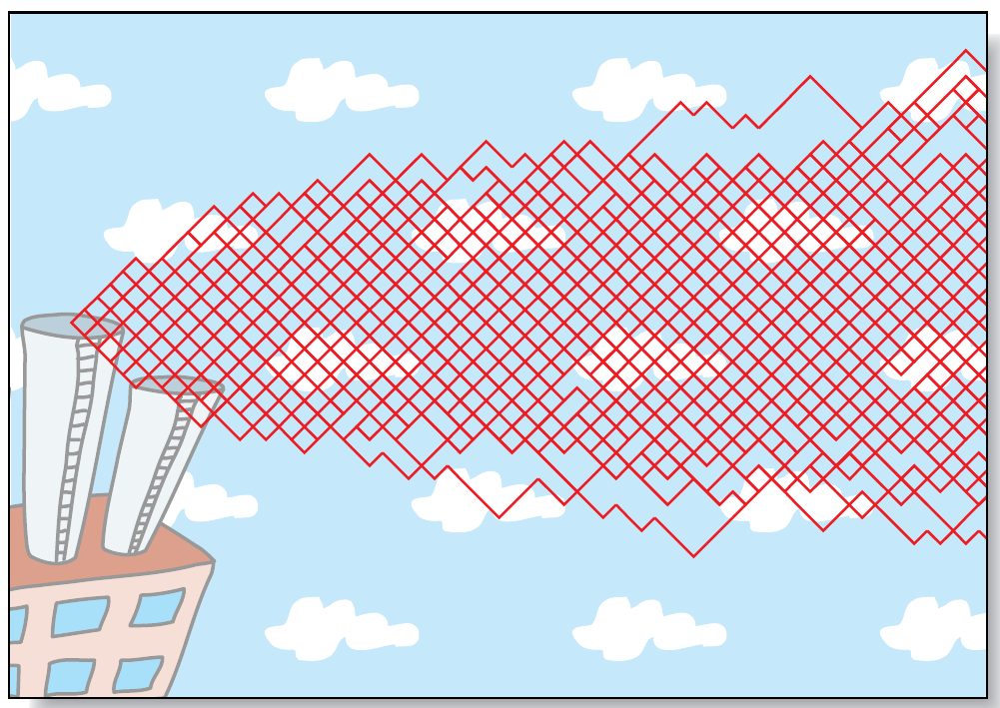
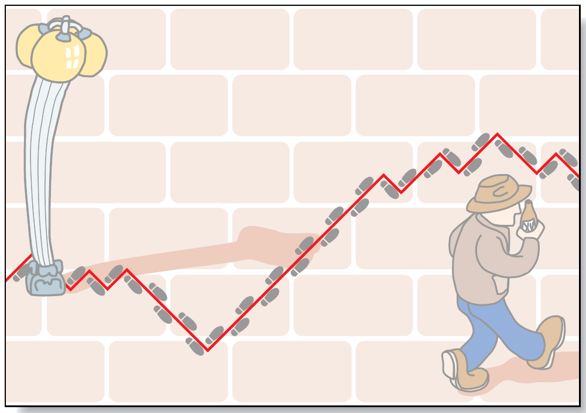
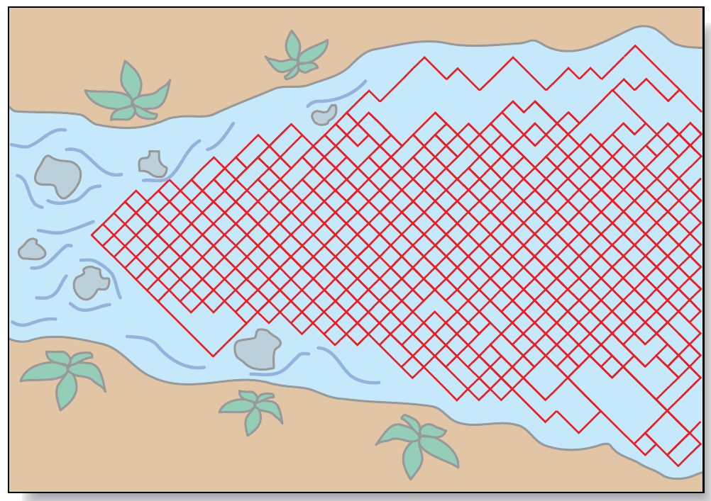

# Do Cycles Exist In The Market?

- **Author:** John F. Ehlers
- **Publication:** Technical Analysis of STOCKS & COMMODITIES, Volume 15, September 1997, pp. 415--419
- **Article URL:** [Article PDF](https://technical.traders.com/archive/article.asp?file=\V15\C09\DOCYCL.pdf)

---

*This longtime S&C contributor explains the basis of the existence of cycles in market data.*

The markets are not always efficient; this is why trading decisions based on technical analysis work. Chart patterns that are discernible, technical events such as double bottoms and Elliott waves, allow technically based traders to make intelligent decisions. Another key discernible event that technical traders may make use of comes in the form of cycles. As a rule, it is not a task of much difficulty to identify cycles; a simple approach, such as measuring the distance between successive lows, can be used to measure them, or a more sophisticated approach using computer algorithms such as maximum entropy spectral analysis (MESA) can be used.

However, the observation that cycles exist is not to imply that they exist at all times. Markets can be caught off-guard by events that can and have on occasion dominated and obscured present cycles. Research indicates that cycles useful for trading are present only about 15% to 30% of the time, corresponding with technician J.M. Hurst's comment that "23% of all price motion is oscillatory in nature and semi-predictable." The situation is comparable and indeed parallel to the problem that the trend-follower faces when he or she finds that the markets trend only a small percentage of the time.

## With Perspective

We have observed cyclic, recurring processes in natural phenomena since the earliest times. Calendars and time measures were designed by the ancients using their observations in the length of the day, the length of the year, the changes in the seasons, the phases of the moon and the movements of the planets and the stars. Theoreticians and thinkers throughout the history of civilization have described and explained various physical phenomena using cycles. In the sixth century before the Christian era, mathematician Pythagoras explained the relationship between the periodicity of musical notes produced by a fixed tension string and a number that represented the length of the string. To the early mathematician, the essence of harmony could be found in the numbers; he then extended the relationship, referring to the harmonic motion of heavenly bodies as the "music of the spheres."

In the 17th century, Isaac Newton provided the mathematical basis for modern spectral analysis when he discovered that sunlight expanded into a multicolored band after passing through a glass prism. Newton was able to determine that each color represented a particular wavelength of light. He correctly concluded that the white light of the sun contained all wavelengths. The term spectrum was invented by Newton to describe the band of light colors.

In 1738, Daniel Bernoulli developed the solution to the wave equation for the vibrating musical string. Then in 1822, French engineer Jean Baptiste Joseph Fourier, using the wave equation results, asserted that any function could be represented as an infinite summation of sine and cosine terms. The mathematics of such representation has become known as harmonic analysis. Fourier transforms, the frequency description of time domain events (and vice versa), were named for him.

More than a century later, in 1930, mathematician Norbert Wiener provided the major turning point for the theory of spectral analysis when he published his classic paper, "Generalized Harmonic Analysis." Precise statistical definitions of autocorrelation and power spectral density for stationary random processes were among his contributions. The use of Fourier transforms, rather than the Fourier series of traditional harmonic analysis, enabled Wiener to define spectra in terms of a continuum of frequencies rather than as discrete harmonic frequencies.

In more current times, John Tukey has been reckoned as the pioneer of modern empirical spectral analysis. He provided the foundation for spectral estimation in 1949, using correlation estimates that were produced from finite time sequences. Many of the terms of modern spectral estimation (such as aliasing, windowing, prewhitening, tapering, smoothing and decimation) can be attributed to Tukey. Tukey collaborated with Jim Cooley in 1965 to describe an efficient algorithm for digital computation of the Fourier transform, which became known as fast Fourier transform (FFT). Unfortunately, FFT has not proved suitable for the analysis of market data.

Geophysics scientist John Burg and his work was the prime impetus for the current interest in high-resolution spectral estimation from limited time sequences. He described his high-resolution spectral estimate in terms of maximum entropy in his 1975 doctoral thesis, and since then he has been instrumental in developing modeling approaches to spectral estimation. Initially, his approach was applied to the exploration for oil and gas through the analysis of seismic waves. The approach is applicable for technical market analysis because it produces high-resolution spectral estimates with the use of minimal data; this is important because the short-term market cycles are always shifting.

The approach has another benefit in that it is responsive to selected data length and is not subject to distortions at the ends of the data sample. The trading program I developed, MESA, is an acronym for maximum entropy spectral analysis.

## Defining A Cycle

A cycle is defined as "an interval of time in which one round of events or phenomena that recur regularly and in the same sequence is completed." In the market, a cycle is considered to be a classic form when the price starts low, rises smoothly to a high, and then falls smoothly back to the original price over the same length of time. The time required to complete the cycle is called the period of the cycle or the cycle length.

Cycles exist in the market. In many ways, their existence is confirmed, if only on fundamental considerations. Surely one of the clearest indications of their existence are the seasonal changes that occur every year for agricultural prices (lowest at harvest) and the decline of real estate prices in the winter. Further, television analysts constantly refer to the rate of inflation being "seasonally adjusted" by the government. But seasonal changes are a specific case of the cycle, as they always occur in a 12-month period. Other examples of fundamentals-related cycles can originate from the 18-month cattle-breeding cycle or the monthly cold-storage report on pork bellies.

Business cycles, while they certainly exist, cannot be as neatly defined. Business cycles vary with the vagaries of interest rates. The government sets objectives for economic growth based on its ability to hold inflation to levels it considers reasonable. This growth is adjusted by the addition or withdrawal of funds from the economy and by adjusting the rate at which the government lends money to banks. Easing rates encourages business; tightening rates inhibits it.

This process alternates, resulting in what we see as a business cycle. Although this cycle may repeat in the same number of years, the exact repetition of the period is not necessary for the cycle to be considered as one. The business cycle is limited on the upside by the amount of growth the government will allow (usually 3%) and on the downside by moderate negative growth (about -1%), denoting a recession. The range of the cycle from +3% to -1% is referred to as amplitude.

## Market Components

There are four important characteristics of price movement, according to the cumulated work of statisticians and economists, and all price forecasts and analyses deal with these elements:

1. A tendency to move in one direction for a specified period
2. A seasonal factor; a pattern related to the calendar
3. A cycle (other than seasonal) that may exist due to government action, the lag in starting up and winding down of business, or crop estimate announcements
4. Other unaccountable price movement, often referred to as noise.

Since points 2 and 3 both refer to cycles, clearly, cycles are a significant and accepted part of all price movement.

In using cycles for trading purposes, one key question is the desired time span of the trade. At one extreme, a trader could consider using the 54-year Kondratieff economic cycle, while a cattle rancher might prefer the 18-month breeding cycle. A grain farmer probably hedges using as a basis his annual harvest. Speculators often work over a short (sometimes very short) time span. Behavioral cycles in prices have been most popular in Elliott wave theory and in the works of W.D. Gann, but these methods have a large element of interpretation and subjectivity.

In retrospect, a casual glance at almost any bar chart shows that short-term cycles ebb and flow. The ability to isolate and use market phenomena such as cycles is related to the awareness of the existence of cycles and the tools available. Many forecasting methods were not practical until the personal computer became commonplace. The philosophical foundation for these short-term cycles is derived from random walk theory and developed so you will feel more comfortable in dealing with cycles.

## On The Random Walk

As a rule, random behavior in the market results from a large number of traders in the market; it is made complex by differing perspectives of time. Thus, market movement can be analyzed in terms of random variables.

One such analysis is the random walk. Imagine, if you will, an oxygen atom in a plastic box containing nothing but air. The path of this atom would be erratic as it bounces from one molecule to another. The path of the way that the atom moves is described as a three-dimensional random walk. In following such a walk, that atom is just as likely to be at any location in that box as any other.

Another form of the random walk is more appropriate for describing the market motion. It is a two-dimensional random walk called the drunkard's walk. This structure is appropriate to describe market activity because the prices can only go up or down in one dimension, while the other dimension, time, can only move forward. This is similar to the way a drunkard's walk is described.

## Drunkard's Walk And The Diffusion Equation

The drunkard's walk is formulated by allowing the theoretical inebriated person to step to either the right or left on a random basis with each step he or she takes forward. The decision to step right or left is made on the outcome of a coin toss from a balanced coin. If the coin turns up heads, the drunk steps to the right. If the coin turns up tails, the drunk steps to the left. When viewed from above, the random path that the drunk has followed becomes clear.


**FIGURE 1: THE DRUNKARD'S WALK PATH.** The drunkard's walk is formulated by allowing the theoretical inebriated person to step to either the right or left on a random basis with each step he or she takes forward. The decision to step right or left is made on the outcome of a coin toss from a balanced coin. Figure 1 shows a computer-generated path using the rules of the drunkard's walk.

Figure 1 shows a computer-generated path using the rules of the drunkard's walk. We can write a differential equation for this path because the rate change of time is related to the rate change of position in two dimensions. The result is a differential equation called the diffusion equation that describes many physical phenomena such as heat traveling up a silver spoon when it is placed in a cup of hot coffee or the shape of the plume of smoke as it leaves a smokestack.

Picture this plume of smoke in a gentle breeze. The plume is roughly conical, widening the farther it goes away from the smokestack. The plume is bent in the direction of the breeze. The widening of the plume is, more or less, the description of the probability of the location of a single particle of smoke. Clearly, no cycles are involved. Figure 2 shows the overlay of 100 computer-generated random paths, and it is not much of a stretch to visualize the smoke plume.


**FIGURE 2: 100 OVERLAID DRUNKARD'S WALK PATHS.** Picture a single drunkard's walk as a plume of smoke in a gentle breeze. The plume is roughly conical, widening the farther it goes away from the smokestack. The widening of the plume is, more or less, the description of the probability of the location of a single particle of smoke. Clearly, no cycles are involved. Figure 2 shows the overlay of 100 computer-generated random paths, and it is not much of a stretch to visualize the smoke plume.

## Telegraphers' Equation

If we reformulate the drunkard's walk problem so that the outcome of the coin flip determines whether the drunk should change his direction, the random variable becomes one of momentum rather than position. In this case, the solution to the random walk problem is another differential equation called the telegrapher's equation. In addition to describing waves on a telegraph wire, the equation also describes the course of a river. The significance is that short-term coherence often exists in the drunkard's path.


**FIGURE 3: MOMENTUM VARIABLE DRUNKARD'S WALK PATH.** If we reformulate the drunkard's walk problem so that the outcome of the coin flip determines whether the drunk should change his direction, the random variable becomes one of momentum rather than position. In this case, the solution to the random walk problem is another differential equation called the telegrapher's equation. Figure 3 is a computer simulation of a single path using the reformulated drunkard's walk problem.

Figure 3 is a computer simulation of a single path using the reformulated drunkard's walk problem. The random nature of the problem can be seen in Figure 4, where 100 of the computer-generated paths are overlaid for the reformulated problem.

This makes sense. We can predict to a fair degree how the river is going to meander if we are situated in the meandering itself. On the other hand, if we were to overlay all the meanders of a given river as in a multiple-exposure photograph, they would all be different. As a result, Figure 4 is indistinguishable from Figure 2.


**FIGURE 4: 100 MOMENTUM VARIABLE DRUNKARD'S WALK PATHS.** The random nature of the problem can be seen in Figure 4, where 100 of the computer-generated paths are overlaid for the reformulated problem. We can predict to a fair degree how the river is going to meander if we are situated in the meandering itself. On the other hand, if we were to overlay all the meanders of a given river as in a multiple-exposure photograph, they would all be different. As a result, Figure 4 is indistinguishable from Figure 2.

Just as the river has a short-term coherency but is random over the longer span, the market has short-term cycles but is generally efficient over the longer period. By measuring the short-term market cycles, we can use their predictive nature to our advantage — as long as we recognize the fact that the cycles come and go in the longer term.

## General Conclusions

Arguments that cycles exist in the market arise not only from fundamental considerations or direct measurement but also on philosophical grounds related to physical phenomena. The natural response to any physical disturbance is harmonic motion. If you pluck a guitar string, the string will vibrate with cycles you can hear. By analogy, we have every right to expect that the market will respond to disturbances with cyclic motion. This expectation is reinforced with the random walk theory, which suggests there are times when market prices can be described by the diffusion equation and other times when market prices can be described by the telegrapher's equation.

The challenge for technical traders is to recognize when short-term cycles are present and to trade them in a logical and consistent manner so they can contribute in a positive fashion to the bottom line.

---

*John Ehlers, Box 1801, Goleta, CA, is an electrical engineer working in electronic research and development and has been a private trader since 1978. He is a pioneer in introducing maximum entropy spectrum analysis to technical trading through his MESA computer program. He is the developer of the Summit and Sierra Hotel Adaptive Trading Systems and the coauthor of R-MESA Intraday Trading System.*

## References and Related Reading

- Ehlers, John F. [1992]. *Mesa and Trading Market Cycles*, John Wiley & Sons.
- Gann, W.D. [1942]. *How to Make Profits in Commodities*, Lambert-Gann Publishing Co., Pomeroy, WA.
- Hurst, J.M. [1970]. *Profit Magic of Stock Transaction Timing*, Prentice-Hall.

---

## BibTeX

```bibtex
@article{ehlers1997cycles,
  author  = {Ehlers, John F.},
  title   = {Do Cycles Exist In The Market?},
  journal = {Technical Analysis of STOCKS \& COMMODITIES},
  year    = {1997},
  volume  = {15},
  number  = {9},
  pages   = {415--419},
  url     = {https://technical.traders.com/archive/article.asp?file=\V15\C09\DOCYCL.pdf}
}
```
