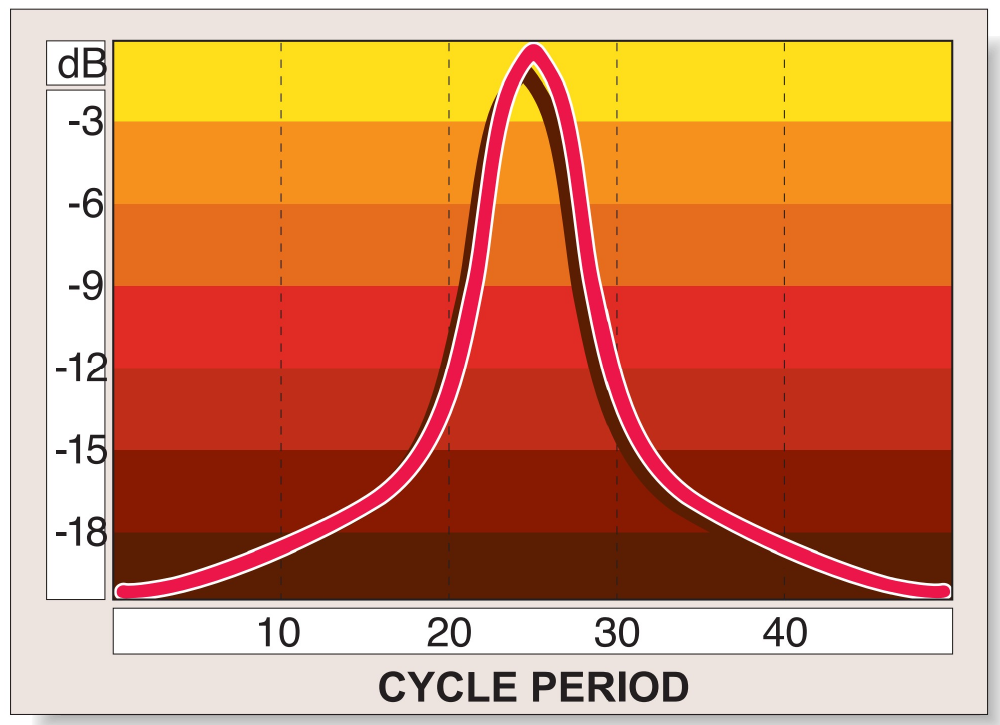
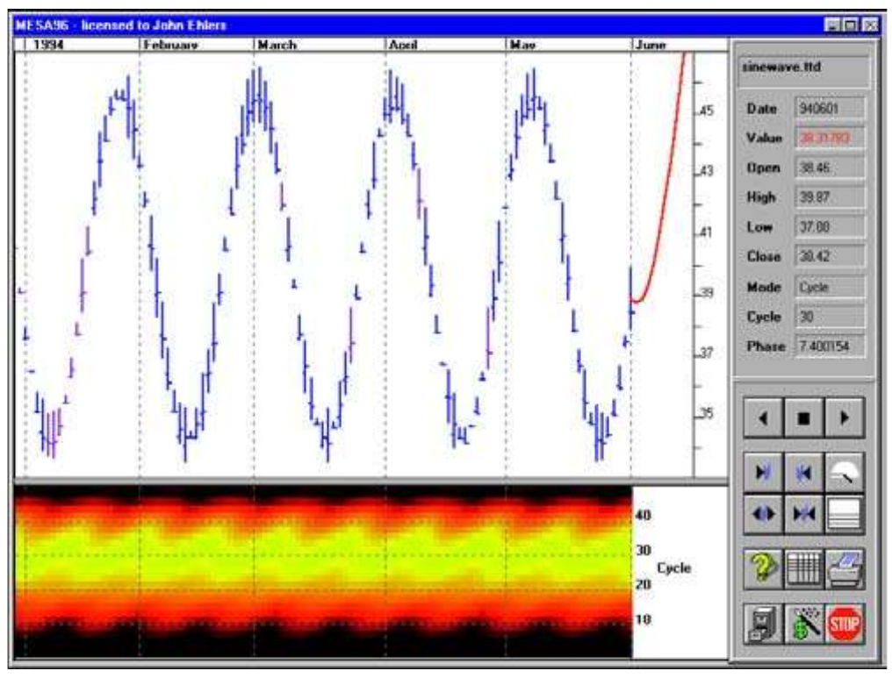
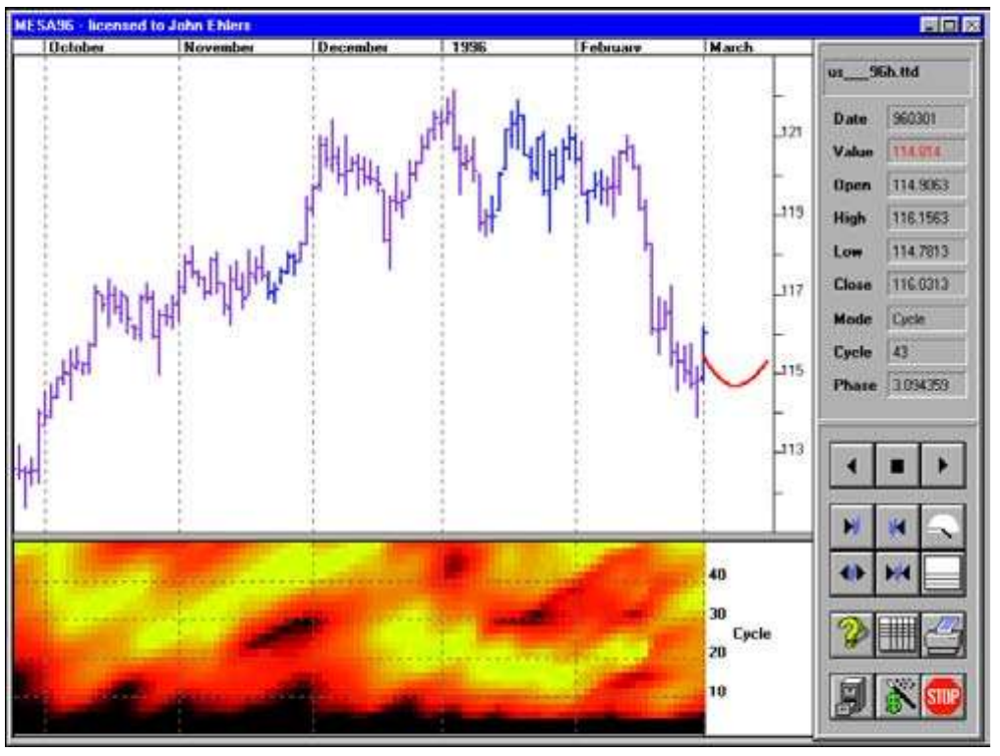
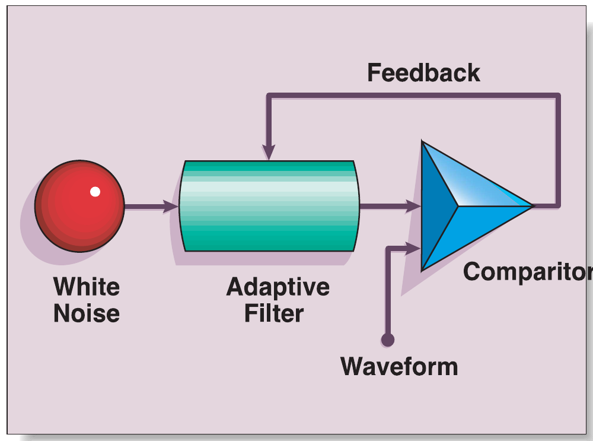
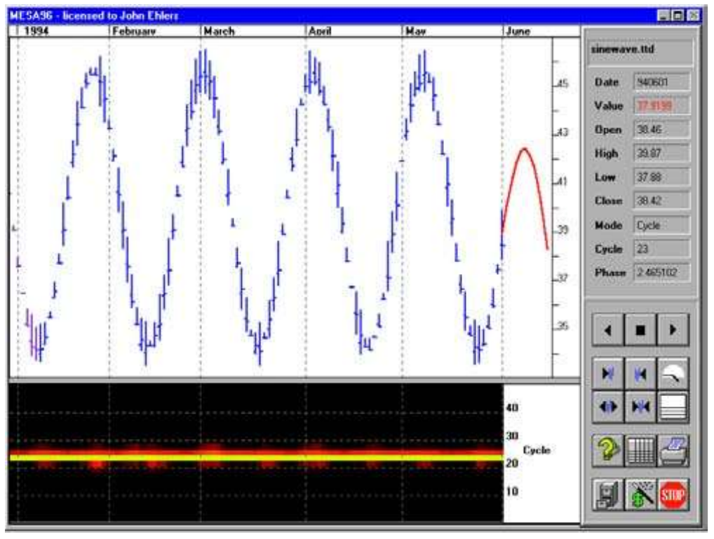
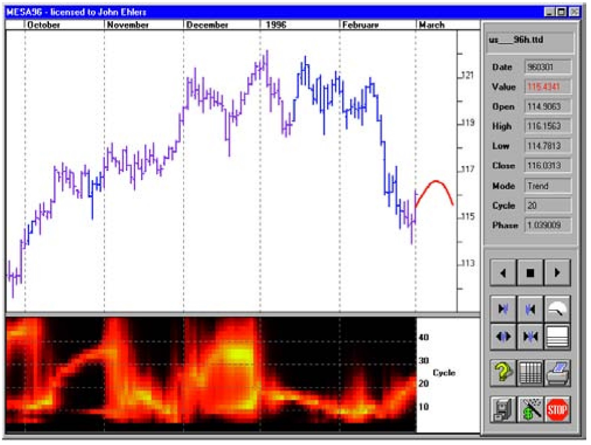
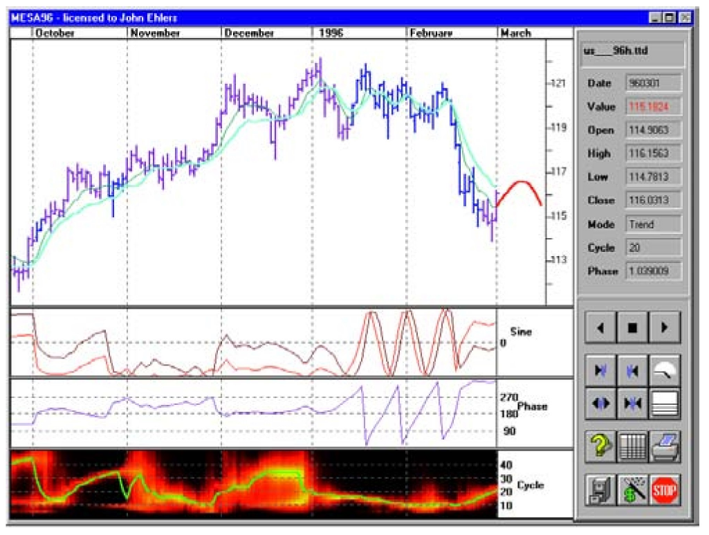

# Cycle Measurements

- **Author:** John F. Ehlers
- **Publication:** Technical Analysis of STOCKS & COMMODITIES, Volume 15, November 1997, pp. 505--509
- **Article URL:** [Article PDF](https://technical.traders.com/archive/article.asp?file=\V15\C11\CYCLEME.pdf)

---

*The author of Mesa and Trading Cycles and developer of the MESA software series presents why you should dynamically adjust your indicators due to the change in market cycles.*

There's no doubt about it: Market cycles can be difficult to identify. But if they can be measured, the payoff can be substantial. By measuring cycles, we have an independent parameter that frees us from using static indicators such as stochastics, the relative strength indicator (RSI), moving average convergence/divergence (MACD) or even moving averages with fixed settings. Measuring cycles enable us to dynamically adjust these indicators to current market conditions.

Currently, there are three popular methods to identify market cycles, and these are cycle finders, Fourier transforms, and maximum entropy spectral analysis (MESA). Cycle finders, which are included in virtually all indicator toolbox software programs, basically measure the spacing between successive lowest lows (or other identifiable places in the cycle) and in general depend on finding an average value across a number of cycles.

Fourier transforms have long been a tool for scientific analysis but suffer from resolution problems in an attempt to satisfy stationarity constraints. Market cycles aren't long enough to make a good Fourier transform measurement. We'll go into more detail in a moment on this issue. We have adapted the MESA approach for market analysis from seismic exploration for oil, when obtaining information from a short burst of data is mandatory.

## Fourier Transforms

Fourier transforms enable scientists and engineers to work interchangeably in time and frequency domains; the shape of a waveform also describes the frequency components that make up the waveshape. Fourier transforms are not just limited to time and frequency. For example, the relationship between the illumination of a beacon, as in a lighthouse, and the light beam that is formed can also be construed as a Fourier transform.

Being able to use time and frequency interchangeably frees the way we view the market. For example, J.M. Hurst in *Profit Magic of Stock Transaction Timing* has shown that the only difference between a head-and-shoulders pattern and a double top pattern is the phasing of the cyclic components. In this sense, it is often easier to think in terms of the cyclic components rather than memorizing a wide library of chart patterns.

The Fourier transform method of measuring cycles is subject to several constraints. First, when the data sample is taken it is viewed as a window in a long data string. The assumption is that this window is a sample of the entire data string that can be recreated by laying the window head-to-tail both into the infinite past and the infinite future. That assumption is clearly violated when market data is windowed, but it is still necessary that the data be stationary (that is, the cycles be consistent in frequency, amplitude and phase) within that window.

There is another constraint; only an integer number of cycles within the window can be analyzed. If we have a 64-day data window, the longest cycle we can analyze is a 64-day cycle. Following the integer number of cycles rule, the next longest analysis cycle is a 64/2=32-day cycle. The other cycles we can identify are 64/3=21.3 days, 64/4=16 days and so forth. Our problem is that we have a lack of resolution. There is more than a five-day gap in the periods we can identify precisely in the range where we would prefer to work. We don't know if a cycle period is 16, 18 or 20 days long.

The only solution to this dilemma is to increase the size of the window. If we increase the window to 256 days (about a year's worth of daily data), we can obtain a one-day resolution in the vicinity of a 16-day cycle. But such a long window would require that the 16-day cycle be present and consistent for more than a year. That clearly will not happen because traders could see such a cycle by casual observation, and by trading it, cause it to cease.


**FIGURE 1: SPECTRUM AMPLITUDE VS. CYCLE PERIOD.** A spectrum display often consists of a plot of the amplitude of the cyclic components versus the frequency or cycle period. This display shows amplitude on a logarithmic decibel scale to capture as wide a range as possible.

A spectrum display often consists of a plot of the amplitude of the cyclic components versus the frequency or cycle period. Such a display is shown in Figure 1. This display shows amplitude on a logarithmic decibel scale to capture as wide a range as possible. Each three-decibel (dB) decrease in amplitude reduces the power by half. The 20 dB range of the graph indicates that amplitude is depicted over a 100:1 range. On the right-hand side of the chart, each 3 dB increment is identified by a color. Think of the colors going from white-hot to ice-cold. We can use the colors to show the spectral estimate below a bar chart as a colorized contour plot, thus picturing the spectral estimate in sync with the price action.

Doing this, we see both a theoretical 24-bar cycle and its Fourier transform in Figure 2. Since the maximum cyclic energy is splattered across a broad range of cycle periods, we cannot identify even the theoretical cycle from its Fourier transform. The lack of resolution is also evident in Figure 3, a Fourier transform of real-world data.


**FIGURE 2: FOURIER TRANSFORM RESOLUTION OF A 24-BAR CYCLE.** The colors can be used to demonstrate the spectral estimate below a bar chart as a colorized contour plot, thus picturing the spectral estimate in sync with the price action. Doing this, both a theoretical 24-bar cycle and its Fourier transform can be seen.


**FIGURE 3: FOURIER TRANSFORM RESOLUTION FOR MARCH 1996 TREASURY BONDS.** Since the maximum cyclic energy is splattered across a broad range of cycle periods, we cannot identify even the theoretical cycle from its Fourier transform. The lack of resolution is also evident here, in a Fourier transform of real-world data.

## Maximum Entropy Spectral Analysis

Entropy is a measure of disorder. With some poetic license, the MESA technique extracts cyclic information from a dataset, leaving the residual with a maximized noise, or disorder. There are no constraints regarding windowing or the length of cycles that can be analyzed. The operation of MESA is described with reference to Figure 4. The windowed data is fed into one input of a comparitor (in this case, an electronic circuit that compares two inputs) as a serial datastream.


**FIGURE 4: HOW MESA WORKS.** Entropy is a measure of disorder. The MESA technique extracts cyclic information from a dataset, leaving the residual with a maximized noise, or disorder. There are no constraints regarding windowing or the length of cycles that can be analyzed.

The other input of the comparitor is the output of a tunable filter. The comparitor output is fed back to tune the filter in such a way that the filter output replicates the real data in the window as best it can. The filter is fed from a white-noise source (white noise encompasses all frequencies). The filter extracts the frequencies it needs and adjusts phase and amplitudes to generate the time waveform replica. When the filter tuning process is complete, a sweep generator can be applied to the filter to measure the filter's transfer response. This transfer response is exactly a measure of the frequency content of the time waveform.

MESA cycles have an advantage in that a high-resolution measurement can be made with very little data. We dynamically adjust the data length to be only one cycle. Since the dominant cycles usually shift slowly, the previous day's measurement serves to set the length of the current day's data window. The resulting measurement resolution of the theoretical 24-bar cycle is shown in Figure 5. The impact of improved resolution can be made by comparing Figure 5 with Figure 2 and Figure 6 with Figure 3.


**FIGURE 5: MESA SPECTRAL RESOLUTION OF A 24-BAR CYCLE.** The resulting measurement resolution of the theoretical 24-bar cycle is shown here. The impact of improved resolution can be made by comparing Figure 5 with Figure 2.


**FIGURE 6: MESA SPECTRAL RESOLUTION FOR MARCH 1996 TREASURY BONDS.** The MESA-measured cycles clearly identify the ebb and flow of the cycle periods. It is precisely this ebb and flow that indicates that market cycles must be treated dynamically. Averaging periods across a number of cycles is certainly bound to produce inaccurate results at the right-hand side of the chart where all trading is done. The impact of improved resolution can be made by comparing Figure 6 with Figure 3.

The MESA-measured cycles in Figure 6 clearly identify the ebb and flow of the cycle periods. It is precisely this ebb and flow that indicates that market cycles must be treated dynamically. Averaging periods across a number of cycles is certainly bound to produce inaccurate results at the right-hand side of the chart where all trading is done. Since the cycle lengths are variable, adjusting to these lengths must be done in a dynamic manner. Because of this, setting oscillator parameters based on a cycle measurement averaged across a large data span is bound to be inaccurate, even when a maximum entropy measurement is used.

## Measured Cycles in Trading

It is not enough to just accurately measure market cycles. Cycles must be put to work to implement trading tactics based on an overall strategy. It is not sound strategy to solely trade the cycles, because tradable cycles are present only about 15% of the time. Thus, a sound trading strategy must incorporate trend mode techniques. The problem is to identify when the market is in a cycle mode and when it is in a trend mode. Cycle measurement can help there as well.

One fundamental definition of a cycle is a phenomenon with a constant rate-change of phase. There are 360 degrees of phase in a complete cycle, so a 10-day market cycle varies at a constant rate of 36 degrees per day. We can measure phase. When the market is in the cycle mode, the rate-change of phase is consistent with the measured cycle period. However, when the market is in a trend, the phase almost stops changing. The failure of correlation of the rate-change of phase and the measured cycle period is a powerful and consistent early indicator of the onset of a trend. In addition, correlation is an early indicator that the trend is over. The lack of correlation cannot tell you whether the trend is up, down or sideways, but it can save you from being whipsawed too early or too late. You would need a trend-following tactic such as moving averages to implement trend mode trades.

Oscillators should be employed when the market is in a cycle mode because this type of indicator has some minor lag. Our favorite oscillator is the sinewave indicator, formed simply by plotting the sine of the measured phase. (See "Stay in phase," in the November 1995 issue.) Crossover entry signals can be created in anticipation of the cyclic turning points by adding 45 degrees to the measured phase and taking the sine of this leading argument. Advancing the phase produces a leading indicator without increasing its noise content, as is the case with momentum functions. An additional advantage of the sine and leadsine curves is that they seldom cross when the market is in the trend mode because the phase is not varying during the trend mode and so indicator lines remain separated by their phase difference.


**FIGURE 7: USING CYCLE MEASUREMENTS TO DYNAMICALLY ADJUST INDICATORS.** Figure 7 is a revisit of the measurements of Figure 6 with the indicators added. During October, November and December, the trend mode is identified by the black price bars. Highly profitable trading resulted during this period by following the adaptive moving averages. In January and February, the rate-change of phase is consistent with the measured dominant cycle. The cycle mode is identified by the gray price bars during this period. During this cycle mode, not only are whipsaw losses avoided, but profitable trades are made by trading the crossovers of the sinewave indicator.

## Conclusions

A high-resolution spectral estimate is necessary to dynamically adjust to market conditions. The required resolution is not available from Fourier transforms, and cycle finders rely on longer-term correlation of several cycles and therefore do not have the agility required for dynamic adaptation. Maximum entropy measurement has both the required resolution and dynamic response necessary to support today's computerized trading. High-quality cycle measurement has the ability to both establish trading strategy and implement it with dynamic tactics.

---

*John Ehlers, Box 1801, Goleta, CA 93116, is an electrical engineer working in electronic research and development and has been a private trader since 1978. He is a pioneer in introducing maximum entropy spectrum analysis to technical trading through his MESA computer program.*

## Related Reading

- Ehlers, John F. [1995]. "Stay in phase," Technical Analysis of STOCKS & COMMODITIES, Volume 13: November.
- Ehlers, John F. [1992]. *Mesa and Trading Market Cycles*, John Wiley & Sons.
- Hurst, J.M. [1970]. *Profit Magic of Stock Transaction Timing*, Prentice-Hall.

---

## BibTeX

```bibtex
@article{ehlers1997cycle,
  author  = {Ehlers, John F.},
  title   = {Cycle Measurements},
  journal = {Technical Analysis of STOCKS \& COMMODITIES},
  year    = {1997},
  volume  = {15},
  number  = {11},
  pages   = {505--509},
  url     = {https://technical.traders.com/archive/article.asp?file=\V15\C11\CYCLEME.pdf}
}
```
