# Hilbert Indicators Tell You When To Trade

- **Author:** John Ehlers
- **Publication:** Technical Analysis of STOCKS & COMMODITIES, Volume 18, March 2000, pp. 16--27
- **Article URL:** [Article PDF](https://technical.traders.com/archive/article.asp?file=\V18\C03\019HIL.pdf)
- **Traders' Tips URL:** [Traders' Tips, March 2000](https://www.traders.com/Documentation/FEEDbk_docs/2000/03/TradersTips/TradersTips.html)

---

*On Lag, Signal Processing, And The Hilbert Transform*

Here's one way to control moving average lag, using a little math and a little-known algorithm called the Hilbert transform to come up with indicators telling you when to trade.

---

Two characteristics of moving averages are that they smooth the input data and they lag the input data. Their use and application is almost always a tradeoff between these two characteristics. The smoothing function removes the higher-frequency components (that is, the rapid up and down movements) of the input prices, so moving averages are also referred to as low-pass filters by engineers. This means moving averages display or allow to pass through only the low-frequency components (that is, the slow up and down movements) while removing the high-frequency components. Essentially, what you'll see instead of raw prices jumping around is a smoothly moving line slowly oscillating up and down.

Moving average lag is perhaps the most important characteristic for traders to understand quantitatively. Figure 1 shows how a simple moving average is formed. Data within the observation window is averaged to produce a single point. The observation window (the dotted box) is moved forward in time from bar to bar to form a continuous moving average. If the weighting of the data values within the observation window is uniform, the average value of the data is centered in the horizontal dimension of the window and is also centered in the vertical dimension of the window.

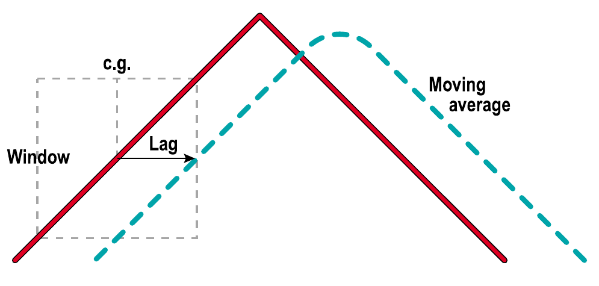
**FIGURE 1: OBSERVATION WINDOW.** An average formed over the width of an observation window is plotted at the right-hand side of the window to produce lag. The observation window is moved along the dataset to produce a moving average.

Since the simple moving average is usually plotted at the right-hand side of the observation window, the lag must be half the width of the window. When more complex weighting functions, such as a linearly weighted moving average, are applied to the data, the lag will be the center of the weighting function. For example, a linearly weighted moving average will have a lag equal to a third of the width of the observation window.

Since the exponential moving average (EMA) is commonly used in technical analysis, you should know how to compute the averaging constant $\alpha$ (alpha) in terms of the lag that the EMA produces. The mathematical expression for an EMA is:

$$f(z) = \alpha \cdot g(z) + (1 - \alpha) \cdot f(z - 1)$$

Here, $z$ is the counter for the sampled prices (day 1, day 2, and so forth), $f$ is the EMA (the filtered output), $\alpha$ (alpha) is a fraction between zero and 1, and $g(z)$ is the input price for period $z$. In terms of daily price bars, this equation says that the EMA today, $f(z)$, is equal to the $\alpha$ fraction times today's price plus the complement, $(1 - \alpha)$, of the $\alpha$ fraction multiplied by yesterday's EMA.

Now look at Figure 2. Assume the input price is a continuous trend advancing one per period and is $I$ for the current bar. Just like climbing a hill, the amount of rise is the product of the horizontal distance times the slope. Therefore, given the slope $S$ and the horizontal lag displacement $L$, since slope is "rise over run," the rise is $S \cdot L$.

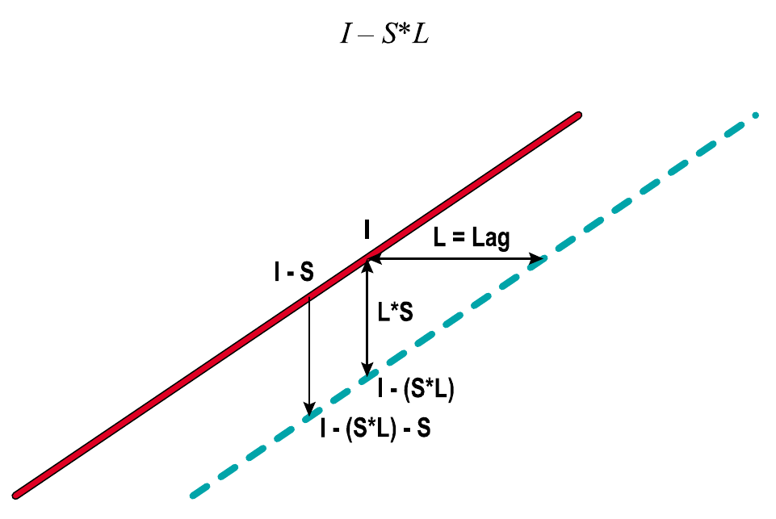
**FIGURE 2: CALCULATING THE ALPHA OF AN EXPONENTIAL MOVING AVERAGE.** Assume the input price is a continuous trend advancing one per period. If the trend has a slope and the exponential moving average has a lag, then the rise is slope multiplied by lag.

Now, back to the EMA formula. The EMA's value is going to be, from Figure 2:

$$I - S \cdot L$$

$g(z)$ is going to be today's price $I$; and, again from Figure 2, yesterday's EMA was today's EMA less $S$ (since $S$ = rise/run and the run is always 1), then I can write the EMA as:

$$I - S \cdot L = \alpha \cdot I + (1 - \alpha) \cdot (I - S \cdot L - S \cdot 1)$$

$$I - S \cdot L = \alpha \cdot I + (I - S \cdot L) - S - \alpha \cdot I + \alpha \cdot S \cdot (L + 1)$$

Canceling like terms on both sides of the equation and subtracting like terms, we obtain:

$$0 = -S + \alpha \cdot S \cdot (L + 1)$$

Moving $-S$ to the left side of the equation, this becomes:

$$1 = \alpha \cdot (L + 1)$$

Dividing both sides of the equation by $(L + 1)$ and rearranging, the solution for alpha is:

$$\alpha = \frac{1}{L + 1}$$

This is an important equation. Once you know the lag you can tolerate, you can calculate the EMA's alpha directly. For example, if you can stand a three-bar lag in an EMA, you would use $\alpha = 0.25$.

Another popular formulation is Jack Hutson's. In a 1984 STOCKS & COMMODITIES article, he related the EMA alpha to the period $P$ of a simple moving average as:

$$\alpha = \frac{2}{P + 1}$$

This is approximately the same formulation, because the lag of the simple moving average is half its period.

## Simple Zero-Lag Moving Average

All that's fine, but what people want is a moving average that doesn't lag, or at least not very much. There are several ways to obtain a zero-lag moving average. One method basically takes an average from left to right across the screen, simply accepting the lag. Next, a moving average of that average is taken from right to left across the screen. This way, smoothing is doubled and lag is canceled. The only problem with this approach? A peek into the future is required to make this zero-lag moving average work at the right-hand edge of the screen.

Figure 3 shows a simple way to produce a zero-lag moving average, using two moving averages. The first moving average has a lag $L$, while the second moving average has a lag $2L$. This means the lateral separation from the price to the first moving average is exactly the same as the lateral separation between the two moving averages.

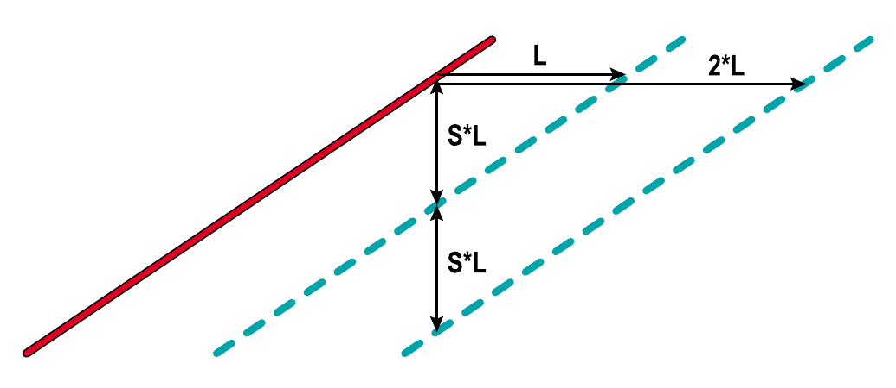
**FIGURE 3: CONSTRUCTING A SIMPLE ZERO-LAG MOVING AVERAGE.** Here's a simple way to produce a zero-lag moving average, using two moving averages. The first one has a lag $L$, while the second one has a lag $2L$. This means that the lateral separation from the price to the first moving average is exactly the same as the lateral separation between the two moving averages.

In the case of the linear trend, I can think in terms of moving the curves vertically to effect a lateral displacement. If you took the vertical difference between the two moving averages and added this difference to the first moving average, you'd have reconstructed the original price trend. Therefore, you would have, in effect, a zero-lag moving average.

Since smoothing is related to lag $L$, you must be judicious in your selection of lag. If you select a lag of four bars, you must recognize that cycle periods shorter than about four bars won't show up in the average.

Figure 4 shows the zero-lag average (shown in red) computed from EMAs as having a four-bar lag and an eight-bar lag ($\alpha = 0.2$ and $\alpha = 0.111$). Compare this zero-lag output to the shorter four-bar EMA in green. It's clear the zero-lag computation tracks prices noticeably closer.

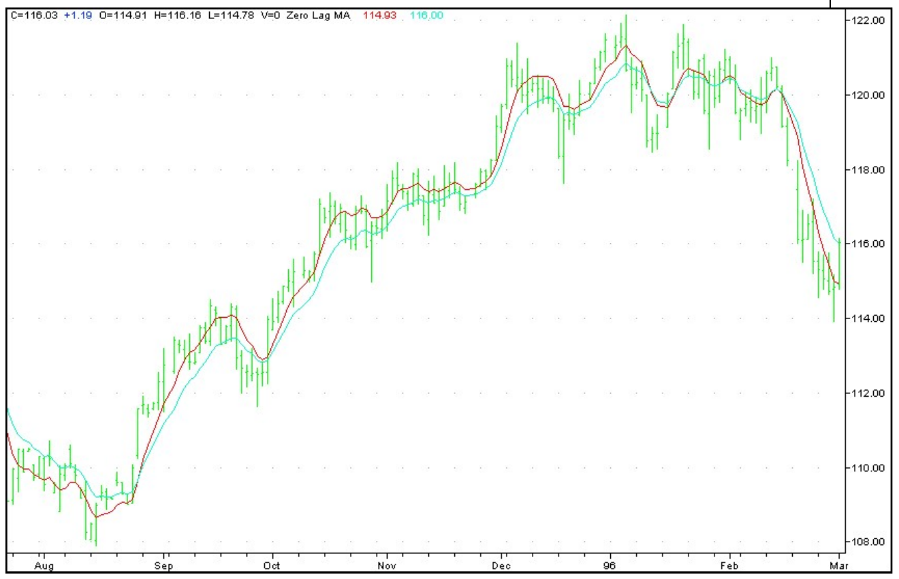
**FIGURE 4: TRACKING.** A simple zero-lag moving average (seen in red) tracks noticeably better than a typical exponential moving average, shown in green.

## Phasor Notation

It is convenient for engineers to think of signals for analysis in terms of phasors, which are used to describe the frequency, amplitude, and phase of all the frequency components of the signal, because this concept enables the mathematical formulation and solution of many problems. Here, I will only consider the alternating current (AC) component of a signal, and so the signal (or in our case, prices) must first be detrended before the analysis is performed.

A phasor is described in Figure 5. Picture the phasor as a bicycle crank rotating counterclockwise. If I put a ballpoint pen at the end of the arrow and pull a sheet of paper under the crank, the way that seismographs are created, the rotating phasor will plot out a sine wave over time.

Signal frequency is the rate at which the phasor rotates. Amplitude is the length of the phasor. Phase is the angle at which the phasor is pointing at any instant. This leads through the mathematics of complex variables to the notions of "in-phase" and "quadrature" components of the data, which I will discuss later. From these, I can calculate frequency and thus the trading cycle. Although these are present in, say, radar or other analog signals, traders don't have the luxury of these components in our price data. All we have is a stream of real sampled data.

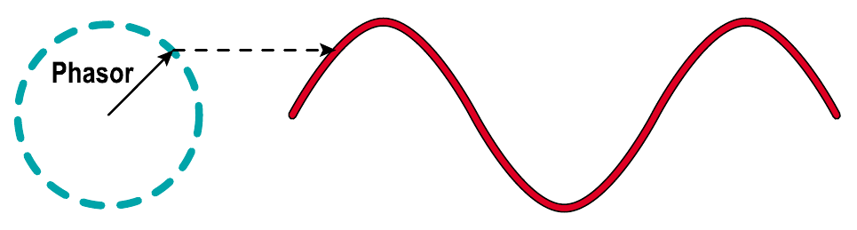
**FIGURE 5: GENERATION OF A SINE WAVE FROM A PHASOR.** A phasor is described here. Picture the phasor as a bicycle crank rotating counterclockwise. If I put a ballpoint pen at the end of the arrow and pull a sheet of paper under the crank in the same way seismographs are created, the rotating phasor will plot out a sine wave over time. Therefore, the phasor can be used to describe the frequency, amplitude, and phase of all the frequency components of the signal.

But we should be thankful that in-phase and quadrature components can be generated from a real datastream by an all-pass filter called a *Hilbert transform*. (How a Hilbert transform works is well beyond my scope here, but interested readers can find a description by Charles Rader in the technical literature.)

The theoretical Hilbert transform must be slightly modified for market data. With due respect to Charles Rader, the equations for the Hilbert transform outputs should be as indicated in the EasyLanguage code in sidebar "The Hilbert Transform," reducing the theory to something you can easily code in your software.

$$\text{InPhase} = 1.25 \cdot (\text{Detrend}[4] - 0.635 \cdot \text{Detrend}[2]) + 0.635 \cdot \text{InPhase}[3]$$

$$\text{Quadrature} = \text{Detrend}[2] - 0.338 \cdot \text{Detrend} + 0.338 \cdot \text{Quadrature}[2]$$

Where: Detrend is the detrended price data input. Delay is denoted inside the square brackets.

The best way to demonstrate the relative action of the in-phase and quadrature components over a range of cycle periods is to let the bicycle wheel run continuously, but at an ever-decreasing rate. This creates a chirped sine wave (descriptive of how the visual period would sound if it were an audio wave). The plot of the in-phase and quadrature components in response to a chirped sine wave are shown in Figure 6.

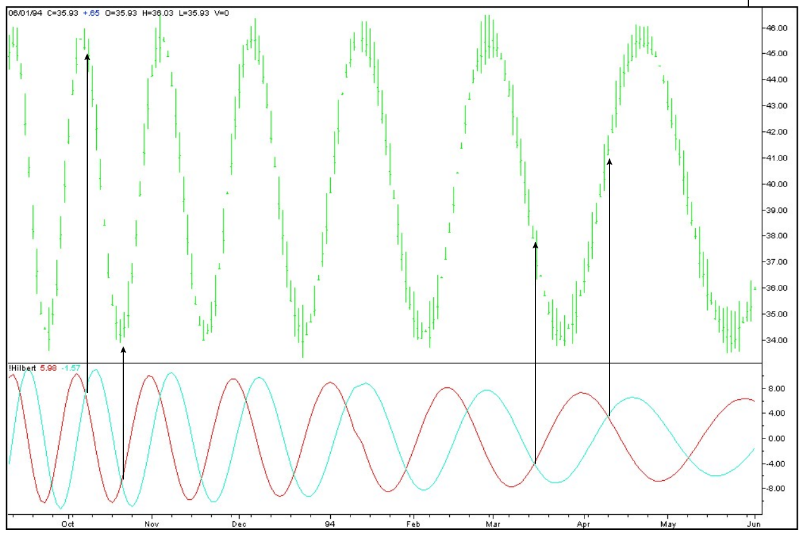
**FIGURE 6: TRANSFORMS.** Hilbert transforms of a theoretical signal show excellent entry and exit points at their crossing at high frequencies, less accurate at low frequencies to the right. (See the code in sidebar "The Hilbert transform.") However, the lag built into the indicator makes this code unsuitable for shorter cycles.

It appears that the crossing of the quadrature and negative of the in-phase component makes an ideal signal, highlighting the cycle's turning point before it occurs. However, this is not something that should be attempted in the market, because the Hilbert transform has a lag of approximately four bars due to its construction. While this delay is of little consequence for longer cycles, this four-bar lag is a half-cycle of an eight-bar cycle, which *could* make it of some consequence! In these shorter cycles, you would be getting exactly the wrong trading signal. In a later article, I will revisit this indicator so that it produces excellent cycle mode signals.

## Signal-To-Noise Ratio

Now, let's put the in-phase and quadrature components to serious use. The signal amplitude is just the length of our phasor (the arrow in Figure 5). With reference to Figure 7, and recalling the Pythagorean theorem, the length of the phasor $R$ is the square root of the sum of the squares of the in-phase and quadrature components. This gives you the signal amplitude on a bar-by-bar basis. I smooth this with an EMA to avoid a choppy result.

$$R^2 = X^2 + Y^2$$

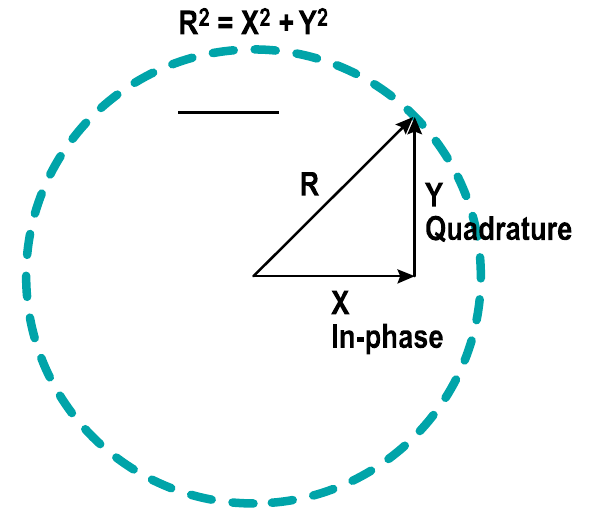
**FIGURE 7: PUTTING IN-PHASE AND QUADRATURE TO USE.** The signal amplitude is just the length of the phasor (the arrow in Figure 5). Recalling the Pythagorean theorem, the length of the phasor $R$ is the square root of the sum of the squares of the in-phase and quadrature components. This gives the signal amplitude on a bar-by-bar basis. Smoothing this with an EMA avoids a choppy result. The signal amplitude is not much use by itself. However, if the signal amplitude relative to the market noise can be estimated, then we have a tool that estimates the quality of our technical analysis.

The signal amplitude is not much use by itself. However, if I can estimate the signal amplitude relative to the market noise, then I have a tool that assesses the quality of our technical analysis. With the kind of data we have available, let us develop a unique definition of noise.

A high signal to noise ratio signal is shown in Figure 8A as a sine wave with a small amount of noise. Market data is never this pure, and the sampled data always has a high and low for each bar. This is the uncertainty of each of our sample points. I can make good trades as long as our signal amplitude is much larger than the average daily range of the bars, as it is in Figure 8A. That's because the signal amplitude will be greater than the noise surrounding it.

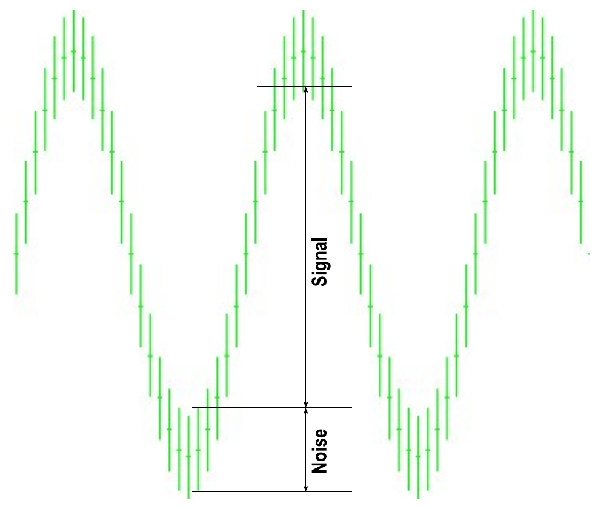
**FIGURE 8A: SAMPLED DATA FROM A PURE SINE WAVE.** Market data is never this pure, but this data has one virtue: the noise level is so low that signals can be reliably picked out.

However, when half the average daily range becomes equal to the signal amplitude, making money on a trade becomes an iffy proposition. Under these conditions, as seen in Figure 8B, I could make an entry at the low of the bar containing the signal high and make an exit at the high of the bar containing the signal low for zero profit. The signal is so buried in noise that entry and exit could occur at the same price.

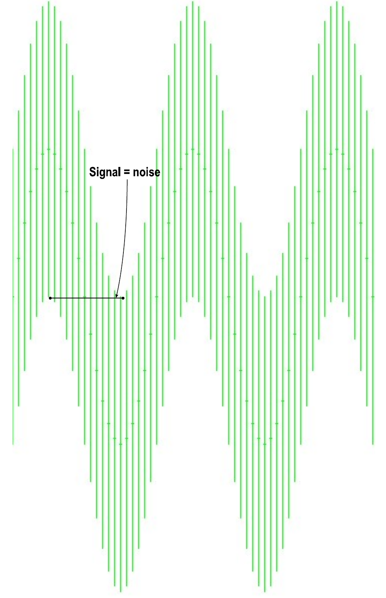
**FIGURE 8B: ZERO dB SIGNAL-TO-NOISE RATIO DATA.** In this data, the noise is so great the signal cannot be reliably discerned.

The signal to noise ratio is commonly measured in decibels, which is a logarithmic ratio. The case where the signal is equal to noise yields a unity ratio. The logarithm of one is zero, so that zero decibel is where the signal level is equal to the noise level. I want the signal amplitude to be at least twice the noise amplitude (which is a 6 dB signal-to-noise ratio) to have a reasonable chance to profit from our analysis. (Signal analysts will recognize 6 dB as the level at which valid determination of signals becomes possible with a low false alarm rate.)

The EasyLanguage code to calculate and plot the signal-to-noise ratio is shown in sidebar "For SNR Indicator."

## Instantaneous Cycle Period Measurement

One basic definition of a cycle is that the phase (the angle at which the phasor is pointing) has a constant rate of change. For example, a 10-bar cycle changes phase at the rate of 36 degrees per day so that 360 degrees of phase, one full cycle, is completed every 10 bars.

In the case of our in-phase and quadrature components, the phase angle for each bar is the arctangent of the ratio of the quadrature component to the in-phase component. All I have to do to determine frequency is compute the difference in phase from bar to bar and sum these differences backward until the sum is equal to or greater than 360 degrees. It's that easy.

While the instantaneous measurement of frequency is a result of using the Hilbert transform and is vastly superior to fast Fourier transform (FFT) measurements, truly accurate cycle measurements can only be made by further reducing the effective noise bandwidth in a high-resolution technique such as maximum entropy spectrum analysis (MESA). MESA uses the frequency measurement to establish the length of data to be used for the MESA cycle measurement.

The EasyLanguage code to compute and plot the instantaneous phase is shown in sidebar "Measuring Cycle Period." To demonstrate that this code accurately measures phase, its calculation for the cycle period is plotted below the theoretical waveform in Figure 9. You can check the measurement by counting the number of bars between successive highs (or lows) in the waveform.

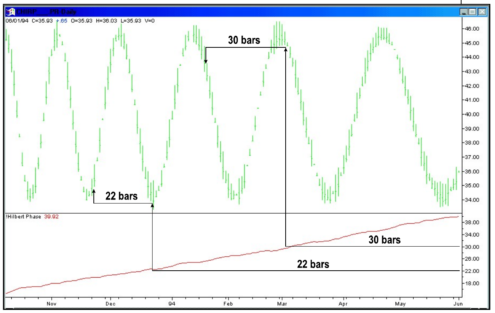
**FIGURE 9: INSTANTANEOUS FREQUENCY.** The code in sidebar "Measuring cycle period" measures the phase of the exemplary data accurately as it changes continuously from left to right. We can compute from this the instantaneous frequency.

## Putting It All Together

The code I have described is used in two EasyLanguage indicators, the Hilbert SNR and the Hilbert period. An example of their application to real-world data can be seen in Figure 10. I want to trade only when the signal-to-noise ratio is greater than 6 dB. Then I know my cycle measurements probably have validity and I can use cyclical indicators to trade.

Because I know the instantaneous frequency and location of the last significant low (or high) from the Hilbert period, I know the best time to make a market entry. For example: the high in early January. Looking downward to the Hilbert period, the current cycle frequency is 16, so I would expect another high in about 16 days. Another example: looking at the long-cycle low in August, you see the Hilbert period gradually lengthening to a peak of 34 as the algorithm interprets the length from the cycle low. Such lengthening indicates the onset of trending because there is a departure from a major high or low.

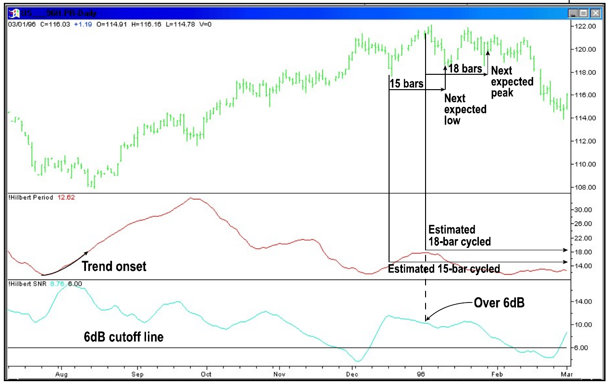
**FIGURE 10: HILBERT INFO.** Here, the two indicators tell you when the signal-to-noise ratio is above the 6 dB cutoff and also what the estimated cycle frequency is on each day.

The ideas here are also in a Standard & Poor's daytrading system you can download for no charge. The fully disclosed code for TradeStation, which can be found at my Website, performs favorably compared to commercially available systems.

## The Hilbert Transform, In EasyLanguage

Here's the EasyLanguage code for the Hilbert transform.

```easylanguage
Inputs:     Price((H+L)/2);

Vars:       Imult(.635),
            Qmult(.338),
            InPhase(0),
            Quadrature(0);

If CurrentBar > 5 then begin

    {Detrend Price}
    Value1 = Price - Price[7];

    {Compute Hilbert Transform}
    Inphase = 1.25*(Value1[4] - Imult*Value1[2]) +
        Imult*InPhase[3];
    Quadrature = Value1[2] - Qmult*Value1 +
        Qmult*Quadrature[2];

    {Plot the results}
    Plot1(Inphase, "I");
    Plot2(Quadrature, "Q");

end;
```

## For SNR Indicator, In EasyLanguage

Here's the EasyLanguage code for the signal-to-noise ratio indicator.

```easylanguage
Inputs:     Price((H+L)/2);

Vars:       Imult (.635),
            Qmult (.338),
            InPhase(0),
            Quadrature(0),
            Amplitude(0),
            Range(0);

If CurrentBar > 8 then begin

    {Detrend Price}
    Value1 = Price - Price[7];

    {Compute "Noise" as the average range}
    Range = .2*(H - L) + .8*Range[1];

    {Compute Hilbert Transform outputs}
    Inphase = 1.25*(Value1[4] - Imult*Value1[2]) +
        Imult*InPhase[3];
    Quadrature = Value1[2] - Qmult*Value1 +
        Qmult*Quadrature[2];

    {Compute smoothed signal amplitude}
    Value2 = .2*(InPhase*InPhase +
        Quadrature*Quadrature) + .8*Value2[1];

    {Compute smoothed SNR in Decibels, guarding against
    a divide by zero error, and compensating for filter loss}
    If Value2 < .001 then Value2 = .001;
    If Range > 0 then Amplitude = .25*(10*Log(Value2/
        (Range*Range))/Log(10) + 1.9) + .75*Amplitude[1];

    {Plot Results}
    Plot1(Amplitude, "Amp");
    Plot2(6, "Ref");

end;
```

## Measuring Cycle Period, In EasyLanguage

Here's the EasyLanguage code to compute and plot the instantaneous phase.

```easylanguage
Inputs:     Price((H+L)/2);

Vars:       Imult (.635),
            Qmult (.338),
            InPhase(0),
            Quadrature(0),
            Phase(0),
            DeltaPhase(0),
            count(0),
            InstPeriod(0),
            Period(0);

If CurrentBar > 5 then begin

    {Detrend Price}
    Value3 = Price - Price[7];

    {Compute InPhase and Quadrature components}
    Inphase = 1.25*(Value3[4] - Imult*Value3[2]) +
        Imult*InPhase[3];
    Quadrature = Value3[2] - Qmult*Value3 +
        Qmult*Quadrature[2];

    {Use ArcTangent to compute the current phase}
    If AbsValue(InPhase + InPhase[1]) > 0 then Phase =
        ArcTangent(AbsValue((Quadrature + Quadrature[1]) /
        (InPhase + InPhase[1])));

    {Resolve the ArcTangent ambiguity}
    If InPhase < 0 and Quadrature > 0 then Phase = 180 - Phase;
    If InPhase < 0 and Quadrature < 0 then Phase = 180 + Phase;
    If InPhase > 0 and Quadrature < 0 then Phase = 360 - Phase;

    {Compute a differential phase, resolve phase wrap-
    around, and limit delta phase errors}
    DeltaPhase = Phase[1] - Phase;
    If Phase[1] < 90 and Phase > 270 then DeltaPhase =
        360 + Phase[1] - Phase;
    If DeltaPhase < 1 then DeltaPhase = 1;
    If DeltaPhase > 60 then DeltaPhase = 60;

    {Sum DeltaPhases to reach 360 degrees. The sum is
    the instantaneous period.}
    InstPeriod = 0;
    Value4 = 0;
    For count = 0 to 50 begin
        Value4 = Value4 + DeltaPhase[count];
        If Value4 > 360 and InstPeriod = 0 then begin
            InstPeriod = count;
        end;
    end;

    {Resolve Instantaneous Period errors and smooth}
    If InstPeriod = 0 then InstPeriod = InstPeriod[1];
    Period = .25*(InstPeriod) + .75*Period[1];

    Plot1(Period, "DC");

end;
```

## About The Author

John Ehlers is an electrical engineer working in electronic research and development and has been a private trader since 1978. He is a pioneer in introducing maximum entropy spectrum analysis to technical trading through his MESA software. He may be reached at his website at http://www.mesa-systems.com/.

## Suggested Reading

- Hutson, Jack [1984]. "Filtered Price Data: Moving Averages Vs. Exponential Moving Averages," *Technical Analysis of STOCKS & COMMODITIES*, Volume 2.
- Rader, Charles M. [1984]. "A Simple Method For Sampling In-Phase And Quadrature Components," *IEEE Transactions on Aerospace and Electronic Systems*, Vol. AES-20, No. 6: November.

---

## BibTeX

```bibtex
@article{ehlers_hilbert_indicators_2000,
  author    = {John Ehlers},
  title     = {Hilbert Indicators Tell You When To Trade},
  journal   = {Technical Analysis of STOCKS \& COMMODITIES},
  volume    = {18},
  number    = {3},
  pages     = {16--27},
  year      = {2000},
  month     = mar,
  publisher = {Technical Analysis, Inc.},
  url       = {https://technical.traders.com/archive/article.asp?file=\V18\C03\019HIL.pdf}
}

@misc{traders_tips_2000_03,
  author       = {{Technical Analysis of STOCKS \& COMMODITIES}},
  title        = {Traders' Tips: Hilbert Indicators Tell You When To Trade},
  howpublished = {online},
  year         = {2000},
  month        = mar,
  url          = {https://www.traders.com/Documentation/FEEDbk_docs/2000/03/TradersTips/TradersTips.html}
}
```
