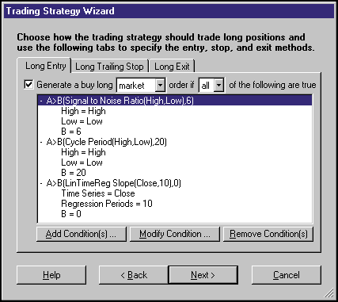
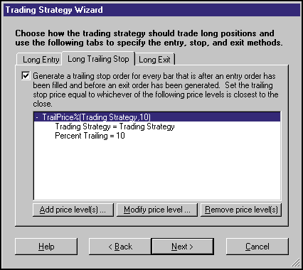
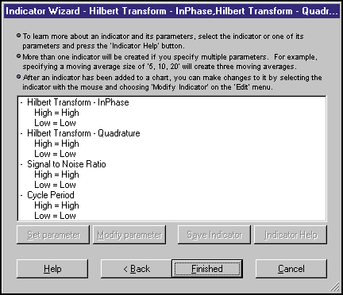

# Traders' Tips: March 2000

- **Article:** Hilbert Indicators Tell You When To Trade by John Ehlers
- **Traders' Tips URL:** [Traders' Tips, March 2000](https://www.traders.com/Documentation/FEEDbk_docs/2000/03/TradersTips/TradersTips.html)

---

## Omega Research EasyLanguage: March 2000

*-- Gaston Sanchez, Omega Research Inc.*

In this month's EasyLanguage tip, I'll focus on the article "Pivot Points" by Jayanthi Gopalakrishan, which was published in the February 2000 STOCKS & COMMODITIES. Here, I'll present an EasyLanguage function and two EasyLanguage indicators to calculate and plot the variations of the pivot point values.

The name of the user function is PivotPoint. This user function will calculate the pivot point values. It will also allow the user to easily specify the method that will be used to calculate the pivot points. The "method" input is used to determine how the pivot points will be calculated (1= traditional; 2 = variation 1; 3 = variation 2).

```easylanguage
Name: PivotPoint
Type: Function

Input: Method(NumericSimple);

If Method <= 1 Then
        PivotPoint = (High[1] + Low[1] + Close[1]) / 3;

If Method = 2 Then
        PivotPoint = (High[1] + Low[1] + Close[1] + Open) / 4;

If Method >= 3 Then
        PivotPoint = (High[1] + Low[1] + Open) / 3;
```

The first EasyLanguage indicator, Pivot Point Levels, plots the related support and resistance levels:

```easylanguage
Name: Pivot Point Levels
Type: Indicator

Input: Method(1);
Variables: Pivot(0), FirstSupp(0), SecondSupp(0), FirstRes(0), SecondRes(0);

Pivot = PivotPoint(Method);

FirstSupp = (2 * Pivot) - High;
FirstRes = (2 * Pivot) - Low;
SecondSupp = Pivot - Range;
SecondRes = Pivot + Range;

Plot1(FirstSupp, "Supp1");
Plot2(FirstRes, "Res1");
Plot3(SecondSupp, "Supp2");
Plot4(SecondRes, "Res2");
```

The second indicator, Pivot Point Average, plots the pivot point value, as well as a moving average of the pivot point value:

```easylanguage
Name: Pivot Point Average
Type: Indicator

Input: Method(1), Smooth(3);
Variables: Pivot(0), PivotAvg(0), Length(0);

Pivot = PivotPoint(Method);
Length = MaxList(1, Smooth);
PivotAvg = Average(Pivot, Length);

Plot1(Pivot, "Pivot");

If CurrentBar >= Length Then
        Plot2(PivotAvg, "SmoothPivot");
```

This EasyLanguage code for the pivot point function and indicators is also available from Omega Research's Website. The name of the posted file is "PivPoint.ELS."

---

## NeuroShell Trader: March 2000

*-- Marge Sherald, Ward Systems Group, Inc.*

The indicators that John Ehlers describes in "On Lag, Signal Processing, And The Hilbert Transform" in this issue are quite complex and could be built within the NeuroShell Trader; however, with NeuroShell Trader's ability to call external code, we decided to build custom indicators and provide them to users to simplify the process. Users of NeuroShell Trader can go to the STOCKS & COMMODITIES section of the NeuroShell Trader free technical support Website to download the Analyzing Averages indicators.


**FIGURE 1: NEUROSHELL TRADER.** After downloading the custom indicators, insert them into your chart, prediction, or NeuroShell trading strategy using the Indicator Wizard and selecting the "custom indicators" category.

After downloading the custom indicators, you can insert them into your chart, prediction, or NeuroShell trading strategy using the Indicator Wizard and selecting the "custom indicators" category (Figure 1).

Ehlers did not go into detail on how to use these indicators in a trading system; however, we will suggest one way in which you could use the indicators in a trading strategy within NeuroShell Trader.

Select "New Trading Strategy" from the Insert menu and enter the following entry/exit conditions:

```text
Long Entry (Figure 2)
Generate a buy long MARKET order if ALL of the following are true:
A>B(Signal to Noise Ratio(High, Low),6)
A>B(Cycle Period(High,Low),20)
A>B(LinTimeReg Slope(Close,10),0)

Long Trailing Stop (Figure 3)
        TrailPrice%(Trading Strategy, 10)
```


**FIGURE 2: NEUROSHELL TRADER.** Long entry setup.


**FIGURE 3: NEUROSHELL TRADER.** Long trailing stop setup.

This Trading Strategy is designed to enter a trade when it recognizes:

- *High cycle period*, which represents a trending cycle.
- *High signal to noise ratio*, which verifies that the cycle length indicator is performing with reasonably high reliability.
- *Linear regression slope* is positive, which represents that the issue is moving in an upward direction.

The trailing stop is implemented to protect the trading strategy from losing money and protecting profits (if the trade is profitable).

You could use this same type of analysis to short an issue. You may find that your results will improve by varying the parameter values. If you own NeuroShell Trader Professional, you can use the Genetic Optimizer to help determine the best parameters to use.

---

## TechniFilter Plus: March 2000

*-- Clay Burch, RTR Software*

Below are the TechniFilter Plus formulas based on John Ehlers's article in this issue, "On Lag, Signal Processing, And The Hilbert Transform." The three formulas correspond to the three sidebars in the article. In the third TechniFilter Plus formula, note that the 10th line only handles periods up to length 21. You can extend this maximum value by adding additional code, continuing the pattern that appears there.

```text
Hilbert Transform Formula
NAME: HilBTrns
SWITCHES: multiline   recursive
PARAMETERS: .635, .338
INITIAL VALUE: (H+L)/2
FORMULA: [1]: (H+L)/2
        [2]: C-CY4      {value1}
        [3]: 1.25*([2]Y4-&1*[2]Y2) + &1 * TY3 {r} {InPhase}
        [4]: [2]Y2 - &2*[2] + &2 * TY2 {r}      {Quadrature}

SNR Formula
NAME: HilSNR
SWITCHES: multiline   recursive
PARAMETERS: .635, .338
INITIAL VALUE: (H+L)/2
FORMULA: [1]: (H+L)/2
        [2]: C-CY4      {value1}
        [3]: 1.25*([2]Y4-&1*[2]Y2) + &1 * TY3 {r} {InPhase}
        [4]: [2]Y2 - &2*[2] + &2 * TY2 {r}      {Quadrature}
        [5]: (H-L)X9    {Range}
        [6]: ([4]*[4] + [3]*[3])X9 % .001       {Value2}
        [7]: 10*([6]/([5]*[5]))U9/10U9
        [8]: .25*( [7] +1.9) + .75 * TY1 {r}    {SNR}

Formula for Cycle Period Measure
NAME: HilPeriod
SWITCHES: multiline   recursive
PARAMETERS: .635, .338
INITIAL VALUE: (H+L)/2
FORMULA: [1]: (H+L)/2
        [2]: C-CY4      {value1}
        [3]: 1.25*([2]Y4-&1*[2]Y2) + &1 * TY3 {r} {InPhase}
        [4]: [2]Y2 - &2*[2] + &2 * TY2 {r}      {Quadrature}
        [5]: ( ([4]+[4]Y1)/([3]+[3]Y1) )U0U17 * 180/3.1415
        [6]:  ([3]<0)*([4]>0)*(180-[5]) +
               ([3]<0)*([4]<0)*(180+[5]) +
               ([3]>0)*([4]<0)*(360-[5]) + (T=0) * [5] {phase}
        [7]: [6]Y1-[6] {deltaPhase}
        [8]: ([6]Y1<90)*([6]>270)*(360+[7]) +(T=0)*[7]
        [9]: ([8]%1)#60
        [10]: ([9]F2>360)*2 + (T=0)*([9]F3>360)*3
               + (T=0)*([9]F4>360)*4 + (T=0)*([9]F5>360)*5
               + (T=0)*([9]F6>360)*6 + (T=0)*([9]F7>360)*7
               + (T=0)*([9]F8>360)*8 + (T=0)*([9]F9>360)*9
               + (T=0)*([9]F10>360)*10 + (T=0)*([9]F11>360)*11
               + (T=0)*([9]F12>360)*12 + (T=0)*([9]F13>360)*13
               + (T=0)*([9]F14>360)*14 + (T=0)*([9]F15>360)*15
               + (T=0)*([9]F16>360)*16 + (T=0)*([9]F17>360)*17
               + (T=0)*([9]F18>360)*18 + (T=0)*([9]F19>360)*19
               + (T=0)*([9]F20>360)*20 + (T=0)*([9]F11>360)*21
        [11]: .25*[10]+.75*TY1 {r}
```

These formulas and program updates can be downloaded from RTR's Website. Release 8.3 of TechniFilter Plus is now available.

---

## BibTeX

```bibtex
@misc{traders_tips_2000_03,
  author       = {{Technical Analysis of STOCKS \& COMMODITIES}},
  title        = {Traders' Tips: Hilbert Indicators Tell You When To Trade},
  howpublished = {online},
  year         = {2000},
  month        = mar,
  url          = {https://www.traders.com/Documentation/FEEDbk_docs/2000/03/TradersTips/TradersTips.html}
}
```
