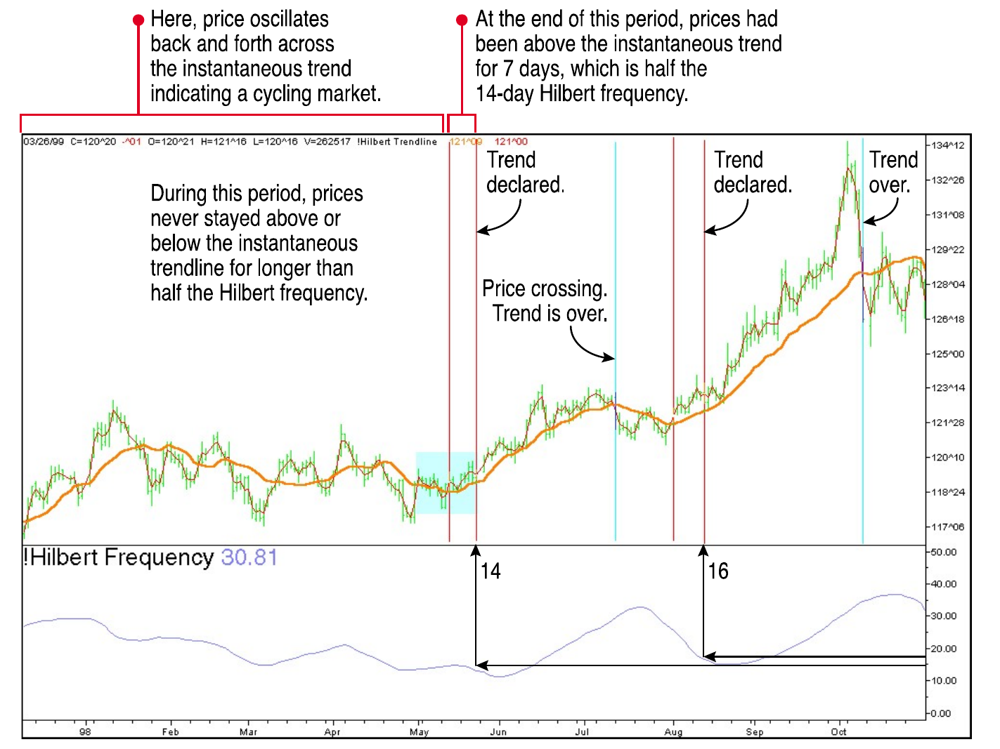
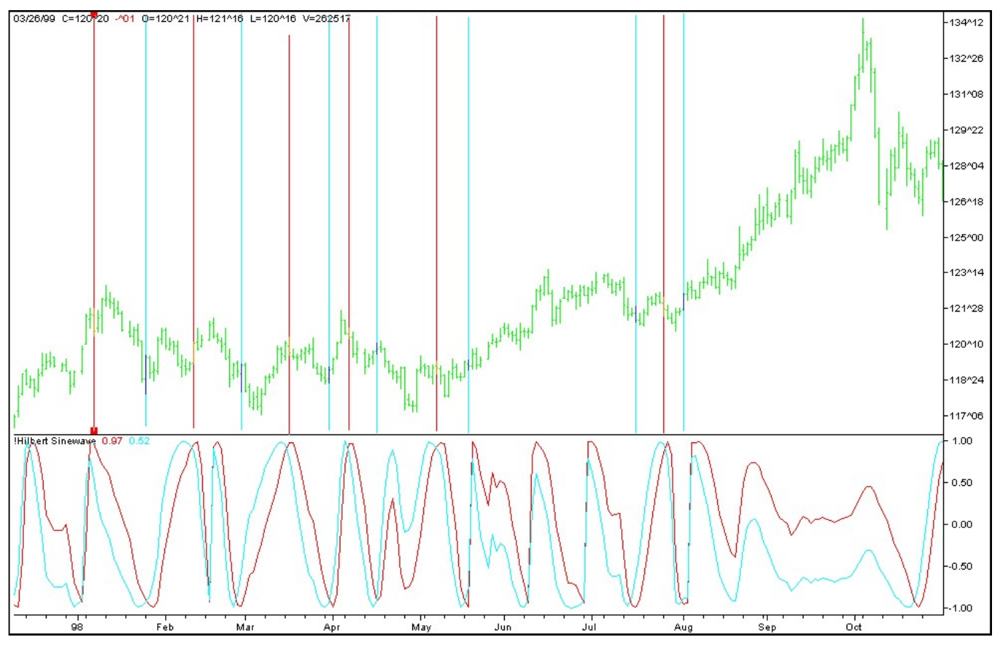
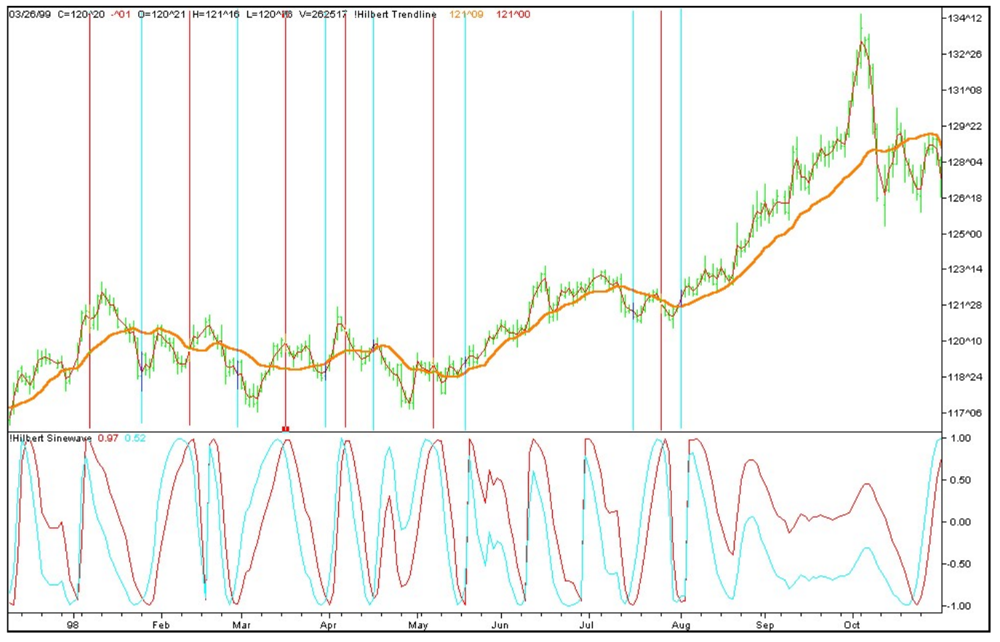
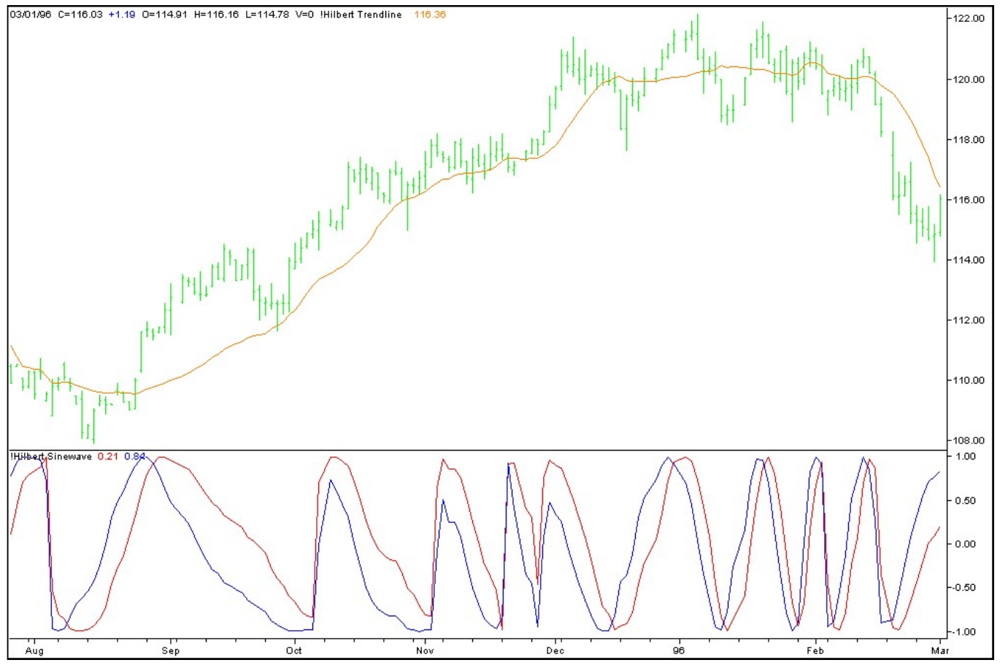
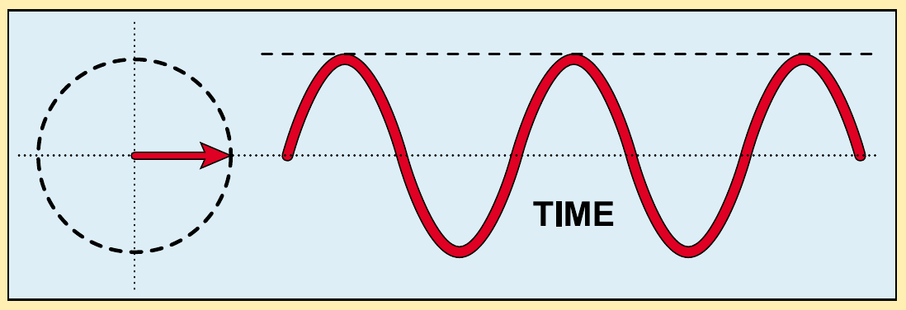
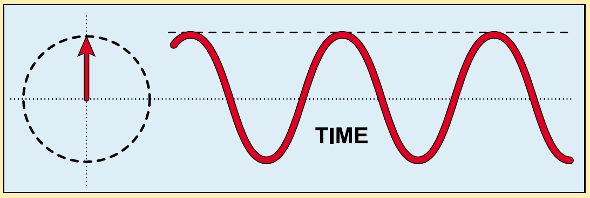

# Adaptive Trends And Oscillators

**John F. Ehlers**

*Stocks & Commodities V. 18:5 (18-27)*

- Article URL: https://technical.traders.com/archive/article.asp?file=\V18\C05\039ADP.pdf
- Traders' Tips URL: https://www.traders.com/Documentation/FEEDbk_docs/2000/05/TradersTips/TradersTips.html

---

*Can the market be modeled as a combination of a trend mode and a cycle mode? This longtime S&C contributor says yes. Here, he explores two indicators to trade each mode; one is the new, adaptive version of an indicator originally introduced in 1996, and it does well in trading ranges but steps aside in trends. With this new version, you can address both modes of the market without interfering with the other — and that's something that traders have been waiting for.*

---

Do you remember? As you were learning about trading, you probably realized somewhere along the way that oscillators don't work in trending markets, that trends and oscillators don't mix. You might have even come to that conclusion after long and hard analysis. But if you thought that was the end of the story, you would be wrong. *Can* the market be modeled as a combination of a trend mode and a cycle mode? Yes! Further, it would be helpful if the equations applying to these modes point directly to those technical analysis indicators that can exploit these modes. Here, then, are two indicators you can use to identify and trade each mode, including code that you can program yourself.

But wait! There's more. By removing the cycle from the trendline and only looking at the cycle in the sinewave indicator, you can address *both* modes of the market without interfering with the other mode. You can do this with the new and improved version of the sinewave indicator, one that is adaptive and works to identify turning points in the cycle. This way, you can indeed combine trends and cycles.

First, let's look at trends and modes individually, and find out what they're all about. Then we'll examine how they can be combined.

## Trend Mode Trading: The Instantaneous Trendline

Traditionally, moving averages have been used to study trend mode because the moving average forms a visual trend of the data. By using a technical market model of a trend plus a dominant cycle, I created something I call an *instantaneous trendline* by removing the dominant cycle from the price information. I can do this because I measured the period of the dominant cycle using the technique I described in the March 2000 issue (see sidebar, "Using the Hilbert transform").

If you remove the dominant cycle component, what's left — the average across the cycle — is the residual. This filtered residual is the instantaneous trendline. This adaptive trendline looks like a simple moving average, but in this case, the period of the dominant cycle changes as we move across the chart, so the period of the simple average must change accordingly. The code given accomplishes this by examining each day of the last 40 days of data.

By itself, the instantaneous trendline doesn't beat lag; the trendline lag will always be half the period of the measured dominant cycle. The EasyLanguage code to compute the instantaneous trendline can be found in the sidebar, "Instantaneous trendline."

In contrast to the trend mode, in a cycle mode, the price will alternate across the instantaneous trendline every half-cycle. In a trend mode, however, the price will be on one side of the instantaneous trendline for an extended period. Don't trade the trend until the price has crossed the trendline for longer than half the dominant cycle (as you have measured) in history. Stop trading the trend when the price again crosses the instantaneous trendline.

Figure 1 illustrates trend trading. The subgraph shows the measured cycle period, while the yellow instantaneous trendline is overlaid on the bar chart. The red line is a plot of the daily average prices and is included to clearly define the beginning and end of the trends. In the left half of the chart, the prices are crossing the instantaneous trendline, back and forth, within half the measured cycle period. However, in mid-May, the prices crossed the instantaneous trendline and stayed above it for seven bars (half the measured cycle), so that an uptrend was identified in the third week of May. The two red lines mark these events.

This uptrend stayed in force until the prices crossed under the instantaneous trendline in early July, as indicated by the vertical blue line. Another uptrend was identified early in August (denoted again by two red lines), and continued until early October, as shown by the blue line. The upshot? Trading the trend mode only when the cycle fails to criss-cross the instantaneous trendline can result in handsome returns.



**FIGURE 1: TREND TRADING.** By using the instantaneous trendline (seen in yellow), it's straightforward to take a position if prices stay on one side of the line more than half the number of days in the instantaneous (Hilbert) frequency. Red bars show periods when that occurred, while blue bars are exit points.

## Cycle Mode Trading: The New And Improved Sinewave Indicator

As I have noted, moving averages are used to study trend mode because they form a visual trend of the data. But all moving averages, including the instantaneous trendline, lag price action, and so we cannot use them to effectively study the cycle mode. The usual approach to examine cycle mode trading is to use an oscillator such as the relative strength index (RSI) or stochastic in such trading conditions. If we know the period of the dominant cycle, there is a better approach — the *sinewave indicator*. I first described the original sinewave indicator in the November 1996 STOCKS & COMMODITIES.

Now, by using the Hilbert frequency, we have the means to dynamically adjust it to the measured dominant cycle, thus effectively combining trends and modes. The sinewave indicator can be obtained by taking the sine of the measured phase of the dominant cycle. (See sidebar, "Orthogonal components.")

When the market is in a cycle mode, the sine of the measured phase looks very much like a sinewave. When the market is in a trend mode, on the other hand, there is only an incidental rate change of phase of the phasor. Therefore, a clear, unequivocal cycle mode indicator can be generated by plotting the sine of the measured phase angle, advanced by a conveniently selected phase angle, as well as plotting the sine of the measured phase angle. I call this variation of the sinewave indicator the *LeadSine*.

For this indicator, I use 45 degrees, an eighth of a dominant cycle, as the phase advance. The LeadSine crosses the sine an eighth of a cycle in front of the peaks and valleys of the cyclic turning points, allowing me to make a trading decision in time to profit from the entire amplitude swing of the cycle. The significant advantage is that the sine and LeadSine don't cross except at cyclic turning points, avoiding the false whipsaw signals of most oscillators when the market is in a trend mode. The two lines don't cross because the phase is not advancing when the market is in a trend mode. Because the phase is not changing, the two lines, separated by 45 degrees in phase, never get the opportunity to cross. The sinewave indicator is the two lines taken together.

The sinewave indicator is shown in the subgraph of Figure 2. Recall from Figure 1 that Treasury bonds are in a cycle mode for the left half of the chart. The vertical lines in the bar chart indicate each crossing of the LeadSine and the sine functions. The red lines denote a buy signal and the blue lines denote a sell signal. Generally, the signals are a little early and, while not 100%, the trading signals are pretty effective. There are even two sell and one buy signals between the two trend mode periods. In addition, the sinewave indicator lines also do not cross when the market is in a trend mode, and thus, false whipsaw signals are avoided.

The EasyLanguage code for the adaptive, dynamically adjusted sinewave indicator can be seen in the sidebar "Orthogonal components."



**FIGURE 2: HILBERT SINEWAVE.** By plotting the sine, the measured phase angle of the average price and plotting it against sine advanced by an eighth of a cycle, you get lines that don't cross except at cyclic turning points. Here, the red lines are entry points and the blue lines are exit points. Buy each time the LeadSine crosses above the sine and sell when LeadSine crosses under sine.

## Real-World Examples

Now, this is where things get interesting. I trade both the trend mode and the cycle mode of the market. Figure 3 shows the instantaneous trendline and the sinewave indicator together. Having such a display makes it easy to alter trading strategy between the two modes.



**FIGURE 3: COMBINING INSTANTANEOUS TREND AND LEADSINE.** Here, both indicators are on the same chart, and you can note their agreement on cycle/trend modes. Note that the sinewave doesn't cross over during trending but does give signals during nontrending areas.

Trying it on another price series, I plotted the instantaneous trendline over the price bars and the sinewave indicator in subgraph 2 in Figure 4. The price — actually, the average price for each day — stays above the instantaneous trendline from the latter part of August until mid-December. The market is clearly in a trend mode during this period, and the correct strategy would be to buy and hold. Then, in mid-December, the market switched to a cycle mode and stayed there almost to the end of the chart. During this cyclic period, the best strategy would be to use a cycle mode technique — the revised, now adaptive sinewave indicator. The sinewave indicator correctly anticipated every turning point.

The LeadSine indicator did not cross the sinewave signal during the trend mode period, although the two lines were wandering around. There were no distracting cycle mode signals from this oscillator when the market was in the trend mode. While no indicator, including these, is infallible, this has proved to be a tremendous improvement over traditional oscillators.

I could point out the features of these indicators from now until infinity, but it is better for you to program these indicators and test them for yourself. This way, you will build confidence that they can work for you.



**FIGURE 4: OTHER DATA.** Trying the combination of instantaneous trend and a Hilbert sinewave on an unidentified series shows success similar to Figure 3. Trade the instantaneous trendline from mid-August to mid-December, and the sinewave indicator for almost the rest of the chart. You can use the code in the sidebars to test the ideas on your tradables.

---

## Sidebar: Using the Hilbert Transform

In my March 2000 article, I showed how the Hilbert transform technique could be used for measuring the cyclic content in prices at any given bar on your chart. I used this, in turn, to create an indicator showing you what the cyclic content was and, inferentially, whether you were in a cycle or trending pricing mode. I also included a signal-to-noise ratio computation so you could estimate whether there was enough of a signal in the pricing activity to justify trading on the cycle content.

Since the article's publication, I've come up with a simpler expression for achieving the same result and with slightly less delay. The revised TradeStation code, which is available to S&C subscribers on the S&C Website, is:

```easylanguage
Inputs: Price((H+L)/2);

Vars: InPhase(0),
      Quadrature(0);

If CurrentBar > 5 then begin

    Value1 = Price - Price[6];
    Value2 = Value1[3];
    Value3 = .75*(Value1 - Value1[6]) + .25*(Value1[2] - Value1[4]);

    InPhase = .33*Value2 + .67*InPhase[1];
    Quadrature = .2*Value3 + .8*Quadrature[1];

    Plot1(Inphase, "I");
    Plot2(Quadrature, "Q");

end;
```

—J.F.E.

---

## Sidebar: Instantaneous Trendline

I use a two-mode market model: trending or cycling. By removing the dominant cycle from the price data, the remaining information is mostly about trend. Here is the EasyLanguage code to plot the instantaneous trendline:

```easylanguage
Inputs: Price((H+L)/2);

Vars: InPhase(0),
      Quadrature(0),
      Phase(0),
      DeltaPhase(0),
      count(0),
      InstPeriod(0),
      Period(0),
      Trendline(0);

If CurrentBar > 5 then begin

{Compute InPhase and Quadrature components}
Value1 = Price - Price[6];
Value2 = Value1[3];
Value3 = .75*(Value1 - Value1[6]) + .25*(Value1[2] - Value1[4]);
InPhase = .33*Value2 + .67*InPhase[1];
Quadrature = .2*Value3 + .8*Quadrature[1];

{Use ArcTangent to compute the current phase}
If AbsValue(InPhase + InPhase[1]) > 0 then Phase =
    ArcTangent(AbsValue((Quadrature + Quadrature[1]) /
    (InPhase + InPhase[1])));

{Resolve the ArcTangent ambiguity}
If InPhase < 0 and Quadrature > 0 then Phase = 180 - Phase;
If InPhase < 0 and Quadrature < 0 then Phase = 180 + Phase;
If InPhase > 0 and Quadrature < 0 then Phase = 360 - Phase;

{Compute a differential phase, resolve phase wraparound,
and limit delta phase errors}
DeltaPhase = Phase[1] - Phase;
If Phase[1] < 90 and Phase > 270 then DeltaPhase = 360 + Phase[1] - Phase;
If DeltaPhase < 1 then DeltaPhase = 1;
If DeltaPhase > 60 then Deltaphase = 60;

{Sum DeltaPhases to reach 360 degrees. The sum is the
instantaneous period.}
InstPeriod = 0;
Value4 = 0;
For count = 0 to 40 begin
    Value4 = Value4 + DeltaPhase[count];
    If Value4 > 360 and InstPeriod = 0 then begin
        InstPeriod = count;
    end;
end;

{Resolve Instantaneous Period errors and smooth}
If InstPeriod = 0 then InstPeriod = InstPeriod[1];
Value5 = .25*(InstPeriod) + .75*Value5[1];

{Compute Trendline as simple average over the measured
dominant cycle period}
Period = IntPortion(Value5);
Trendline = 0;
For count = 0 to Period + 1 begin
    Trendline = Trendline + Price[count];
end;
If Period > 0 then Trendline = Trendline / (Period + 2);

Value11 = .33*(Price + .5*(Price - Price[3])) + .67*Value11[1];

if CurrentBar < 26 then begin
    Trendline = Price;
    Value11 = Price;
end;

Plot1(Trendline, "TR");
Plot2(Value11, "ZL");

end;
```

—J.F.E.

---

## Sidebar: Orthogonal Components

I measure the phase of the dominant cycle by establishing the average lengths of the two orthogonal components, the sine and cosine components. I do this by correlating the price data over one full cycle period against a pure sine and a pure cosine using the dominant cycle period. Once I measure the two orthogonal components, I establish phase by taking the arctangent of their ratio.

In general, *orthogonal* means "right angled," but a slightly more abstract mathematical concept of orthogonality basically means "uncorrelated." The consistency of these definitions can be seen in the use of Fourier transforms. One necessary requirement to determine the amplitude of the coefficients of the harmonic components is for all values of *m* and *n* — that is, the sine and cosine components are completely uncorrelated, regardless of the harmonic number.

Sines and cosines can be seen to be at right angles, with reference to sidebar Figures 1 and 2. In sidebar Figure 1, the value of the sinewave at the right-hand side of its box is represented by the tip of the phasor arrow being reflected to that right-hand edge of the box. Similarly, in sidebar Figure 2, where the tip of its phasor is reflected to the right-hand side of the waveform box, the cosine wave is the result. The phasors in sidebar Figures 1 and 2 are at 90 degrees — that is, they are orthogonal.



**SIDEBAR FIGURE 1: SINEWAVE.** A sinewave is generated by the position of the phasor tip being reflected to the left edge of the waveform box.



**SIDEBAR FIGURE 2: COSINE WAVE.** A cosine wave is generated by the position of the phasor tip being reflected to the left edge of the waveform box. The cosine is therefore orthogonal to the sine.

If we know the period of a cycle, we can find that amplitude of a function correlated to the cosine of that cycle from the expression:

$$a = \frac{1}{\pi} \int_{d}^{d+2\pi} f(t) \cos(t) \, dt$$

Similarly, the amplitude of the component correlated to the sine of that cycle is:

$$b = \frac{1}{\pi} \int_{d}^{d+2\pi} f(t) \sin(t) \, dt$$

Just like the phasor, *a* and *b* are orthogonal. By taking the arctangent of their ratio, I have a measure of the average phase angle, averaged over the entire period of the cycle.

Since I know the period of the dominant cycle, I can measure the average phase of the dominant cycle component, just as *a* and *b* were determined above. In this case, I am using sampled data rather than continuous functions and are using summations instead of integrals.

One additional step in my calculations is required to clear the quadrant ambiguity of the tangent function. In the first quadrant, where the phase of the price function is between zero and 90 degrees, both the sine and cosine are positive. In the second quadrant, where the phase of the price function is between 90 and 180 degrees, the sine is positive and the cosine is negative. In the third quadrant, where the phase of the price function is between 180 and 270 degrees, both are negative. Finally, in the fourth quadrant, where the phase of the price function is between 270 and 360 degrees, the sine is negative and the cosine is positive. The phase angle is obtained regardless of the amplitude of the cycle. Given that we know the dominant cycle, the EasyLanguage program seen here shows how we can compute the phase angle and the resulting sinewave indicator.

EasyLanguage code to compute the sinewave indicator:

```easylanguage
Inputs: Price((H+L)/2);

Vars: InPhase(0),
      Quadrature(0),
      Phase(0),
      DeltaPhase(0),
      count(0),
      InstPeriod(0),
      Period(0),
      DCPhase(0),
      RealPart(0),
      ImagPart(0);

If CurrentBar > 5 then begin

{Compute InPhase and Quadrature components}
Value1 = Price - Price[6];
Value2 = Value1[3];
Value3 = .75*(Value1 - Value1[6]) + .25*(Value1[2] - Value1[4]);
InPhase = .33*Value2 + .67*InPhase[1];
Quadrature = .2*Value3 + .8*Quadrature[1];

{Use ArcTangent to compute the current phase}
If AbsValue(InPhase + InPhase[1]) > 0 then Phase =
    ArcTangent(AbsValue((Quadrature + Quadrature[1]) /
    (InPhase + InPhase[1])));

{Resolve the ArcTangent ambiguity}
If InPhase < 0 and Quadrature > 0 then Phase = 180 - Phase;
If InPhase < 0 and Quadrature < 0 then Phase = 180 + Phase;
If InPhase > 0 and Quadrature < 0 then Phase = 360 - Phase;

{Compute a differential phase, resolve phase wraparound,
and limit delta phase errors}
DeltaPhase = Phase[1] - Phase;
If Phase[1] < 90 and Phase > 270 then DeltaPhase = 360 + Phase[1] - Phase;
If DeltaPhase < 1 then DeltaPhase = 1;
If DeltaPhase > 60 then Deltaphase = 60;

{Sum DeltaPhases to reach 360 degrees. The sum is the
instantaneous period.}
InstPeriod = 0;
Value4 = 0;
For count = 0 to 40 begin
    Value4 = Value4 + DeltaPhase[count];
    If Value4 > 360 and InstPeriod = 0 then begin
        InstPeriod = count;
    end;
end;

{Resolve Instantaneous Period errors and smooth}
If InstPeriod = 0 then InstPeriod = InstPeriod[1];
Value5 = .25*InstPeriod + .75*Value5[1];

{Compute Dominant Cycle Phase, Sine of the Phase Angle, and Leadsine}
Period = IntPortion(Value5);
RealPart = 0;
ImagPart = 0;
For count = 0 To Period - 1 begin
    RealPart = RealPart + Sine(360 * count / Period) * (Price[count]);
    ImagPart = ImagPart + Cosine(360 * count / Period) * (Price[count]);
end;

If AbsValue(ImagPart) > 0.001 then DCPhase = Arctangent(RealPart / ImagPart);
If AbsValue(ImagPart) <= 0.001 then DCPhase = 90 * Sign(RealPart);

DCPhase = DCPhase + 90;
If ImagPart < 0 then DCPhase = DCPhase + 180;
If DCPhase > 315 then DCPhase = DCPhase - 360;

Plot1(Sine(DCPhase), "Sine");
Plot2(Sine(DCPhase + 45), "LeadSine");

end;
```

This code is available to STOCKS & COMMODITIES subscribers on the S&C Website.

—J.F.E.

---

*John F. Ehlers is an electrical engineer working in electronic research and development and has been a private trader since 1978. He is a pioneer in introducing maximum entropy spectrum analysis to technical traders through his MESA software.*

## Related Reading and References

- Ehlers, John F. [2000]. "On Lag, Signal Processing, And The Hilbert Transform: Hilbert Indicators Tell You When To Trade," *Technical Analysis of Stocks & Commodities*, Volume 18: March.
- Ehlers, John F. [1996]. "Stay In Phase," *Technical Analysis of Stocks & Commodities*, Volume 14: November.
- Weiss, George H. [1983]. "Random Walks and Their Applications," *American Scientist*, January/February.

---

## BibTeX

```bibtex
@article{ehlers2000adaptive,
  author  = {John F. Ehlers},
  title   = {Adaptive Trends And Oscillators},
  journal = {Technical Analysis of Stocks \& Commodities},
  volume  = {18},
  number  = {5},
  pages   = {18--27},
  year    = {2000},
  month   = may,
  url     = {https://technical.traders.com/archive/article.asp?file=\V18\C05\039ADP.pdf}
}

@misc{traderstips2000may,
  title        = {Traders' Tips: May 2000},
  howpublished = {Technical Analysis of Stocks \& Commodities},
  year         = {2000},
  month        = may,
  url          = {https://www.traders.com/Documentation/FEEDbk_docs/2000/05/TradersTips/TradersTips.html}
}
```
