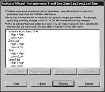
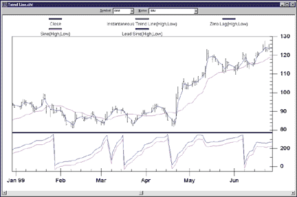
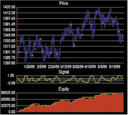
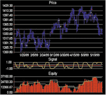

# Traders' Tips — May 2000

**Adaptive Trends And Oscillators — John Ehlers**

Traders' Tips URL: https://www.traders.com/Documentation/FEEDbk_docs/2000/05/TradersTips/TradersTips.html

---

*Here is this month's selection of Traders' Tips, contributed by various developers of technical analysis software to help readers more easily implement some of the strategies presented in this issue.*

---

## MetaStock

Here is the code for use in MetaStock 6.52 or higher for the instantaneous trendline and sinewave indicator as described by John Ehlers in "Adaptive Trends And Oscillators" in this issue. To implement them, the following formulas must be created in MetaStock's Indicator Builder. Each formula must be created separately and must be named exactly as it appears below. Only the last two formulas are plotted, so you may wish to prevent the others from being displayed in the Indicator QuickList by unchecking the "Display In QuickList" option when creating the formula. These formulas can also be downloaded from https://www.equis.com/customer/support/formulas/.

```metastock
{Name: H cycle count 1a}
value:= Fml("Hilbert cycle period - 1a");
If(Sum(value,6)>=360 AND Sum(value,5)<360 ,6,0) +
If(Sum(value,7)>=360 AND Sum(value,6)<360 ,7,0) +
If(Sum(value,8)>=360 AND Sum(value,7)<360 ,8,0) +
If(Sum(value,9)>=360 AND Sum(value,8)<360 ,9,0) +
If(Sum(value,10)>=360 AND Sum(value,9)<360 ,10,0) +
If(Sum(value,11)>=360 AND Sum(value,10)<360 ,11,0) +
If(Sum(value,12)>=360 AND Sum(value,11)<360 ,12,0) +
If(Sum(value,13)>=360 AND Sum(value,12)<360 ,13,0) +
If(Sum(value,14)>=360 AND Sum(value,13)<360 ,14,0) +
If(Sum(value,15)>=360 AND Sum(value,14)<360 ,15,0)
```

```metastock
{Name: H cycle count 2a}
value:= Fml("Hilbert cycle period - 1a");
If(Sum(value,16)>=360 AND Sum(value,15)<360 ,16,0) +
If(Sum(value,17)>=360 AND Sum(value,16)<360 ,17,0) +
If(Sum(value,18)>=360 AND Sum(value,17)<360 ,18,0) +
If(Sum(value,19)>=360 AND Sum(value,18)<360 ,19,0) +
If(Sum(value,20)>=360 AND Sum(value,19)<360 ,20,0) +
If(Sum(value,21)>=360 AND Sum(value,20)<360 ,21,0) +
If(Sum(value,22)>=360 AND Sum(value,21)<360 ,22,0) +
If(Sum(value,23)>=360 AND Sum(value,22)<360 ,23,0) +
If(Sum(value,24)>=360 AND Sum(value,23)<360 ,24,0) +
If(Sum(value,25)>=360 AND Sum(value,24)<360 ,25,0)
```

```metastock
{Name: H cycle count 3a}
value:= Fml("Hilbert cycle period - 1a");
If(Sum(value,26)>=360 AND Sum(value,25)<360 ,26,0) +
If(Sum(value,27)>=360 AND Sum(value,26)<360 ,27,0) +
If(Sum(value,28)>=360 AND Sum(value,27)<360 ,28,0) +
If(Sum(value,29)>=360 AND Sum(value,28)<360 ,29,0) +
If(Sum(value,30)>=360 AND Sum(value,29)<360 ,30,0) +
If(Sum(value,31)>=360 AND Sum(value,30)<360 ,31,0) +
If(Sum(value,32)>=360 AND Sum(value,31)<360 ,32,0) +
If(Sum(value,33)>=360 AND Sum(value,32)<360 ,33,0) +
If(Sum(value,34)>=360 AND Sum(value,33)<360 ,34,0) +
If(Sum(value,35)>=360 AND Sum(value,34)<360 ,35,0)
```

```metastock
{Name: H ip sum 1}
pd:=Int(Fml("Hilbert cycle period - final-a"));
pr:=(H+L)/2;
(Cos(0)*pr)+
(Cos(360*(1/pd))*Ref(pr,-1))+
(Cos(360*(2/pd))*Ref(pr,-2))+
(Cos(360*(3/pd))*Ref(pr,-3))+
(Cos(360*(4/pd))*Ref(pr,-4))+
(Cos(360*(5/pd))*Ref(pr,-5))+
If(pd>6, Cos(360*(6/pd))*Ref(pr,-6), 0)+
If(pd>7, Cos(360*(7/pd))*Ref(pr,-7), 0)+
If(pd>8, Cos(360*(8/pd))*Ref(pr,-8), 0)+
If(pd>9, Cos(360*(9/pd))*Ref(pr,-9), 0)+
If(pd>10, Cos(360*(10/pd))*Ref(pr,-10), 0)+
If(pd>11, Cos(360*(11/pd))*Ref(pr,-11), 0)+
If(pd>12, Cos(360*(12/pd))*Ref(pr,-12), 0)+
If(pd>13, Cos(360*(13/pd))*Ref(pr,-13), 0)+
If(pd>14, Cos(360*(14/pd))*Ref(pr,-14), 0)
```

```metastock
{Name: H ip sum 2}
pd:=Int(Fml("Hilbert cycle period - final-a"));
pr:=(H+L)/2;
If(pd>15, Cos(360*(15/pd))*Ref(pr,-15), 0)+
If(pd>16, Cos(360*(16/pd))*Ref(pr,-16), 0)+
If(pd>17, Cos(360*(17/pd))*Ref(pr,-17), 0)+
If(pd>18, Cos(360*(18/pd))*Ref(pr,-18), 0)+
If(pd>19, Cos(360*(19/pd))*Ref(pr,-19), 0)+
If(pd>20, Cos(360*(20/pd))*Ref(pr,-20), 0)+
If(pd>21, Cos(360*(21/pd))*Ref(pr,-21), 0)+
If(pd>22, Cos(360*(22/pd))*Ref(pr,-22), 0)+
If(pd>23, Cos(360*(23/pd))*Ref(pr,-23), 0)+
If(pd>24, Cos(360*(24/pd))*Ref(pr,-24), 0)
```

```metastock
{Name: H ip sum 3}
pd:=Int(Fml("Hilbert cycle period - final-a"));
pr:=(H+L)/2;
If(pd>25, Cos(360*(25/pd))*Ref(pr,-25), 0)+
If(pd>26, Cos(360*(26/pd))*Ref(pr,-26), 0)+
If(pd>27, Cos(360*(27/pd))*Ref(pr,-27), 0)+
If(pd>28, Cos(360*(28/pd))*Ref(pr,-28), 0)+
If(pd>29, Cos(360*(29/pd))*Ref(pr,-29), 0)+
If(pd>30, Cos(360*(30/pd))*Ref(pr,-30), 0)+
If(pd>31, Cos(360*(31/pd))*Ref(pr,-31), 0)+
If(pd>32, Cos(360*(32/pd))*Ref(pr,-32), 0)+
If(pd>33, Cos(360*(33/pd))*Ref(pr,-33), 0)+
If(pd>34, Cos(360*(34/pd))*Ref(pr,-34), 0)
```

```metastock
{Name: H rp sum 1}
pd:=Int(Fml("Hilbert cycle period - final-a"));
pr:=(H+L)/2;
(Sin(0)*pr)+
(Sin(360*(1/pd))*Ref(pr,-1))+
(Sin(360*(2/pd))*Ref(pr,-2))+
(Sin(360*(3/pd))*Ref(pr,-3))+
(Sin(360*(4/pd))*Ref(pr,-4))+
(Sin(360*(5/pd))*Ref(pr,-5))+
If(pd>6, Sin(360*(6/pd))*Ref(pr,-6), 0)+
If(pd>7, Sin(360*(7/pd))*Ref(pr,-7), 0)+
If(pd>8, Sin(360*(8/pd))*Ref(pr,-8), 0)+
If(pd>9, Sin(360*(9/pd))*Ref(pr,-9), 0)+
If(pd>10, Sin(360*(10/pd))*Ref(pr,-10), 0)+
If(pd>11, Sin(360*(11/pd))*Ref(pr,-11), 0)+
If(pd>12, Sin(360*(12/pd))*Ref(pr,-12), 0)+
If(pd>13, Sin(360*(13/pd))*Ref(pr,-13), 0)+
If(pd>14, Sin(360*(14/pd))*Ref(pr,-14), 0)
```

```metastock
{Name: H rp sum 2}
pd:=Int(Fml("Hilbert cycle period - final-a"));
pr:=(H+L)/2;
If(pd>15, Sin(360*(15/pd))*Ref(pr,-15), 0)+
If(pd>16, Sin(360*(16/pd))*Ref(pr,-16), 0)+
If(pd>17, Sin(360*(17/pd))*Ref(pr,-17), 0)+
If(pd>18, Sin(360*(18/pd))*Ref(pr,-18), 0)+
If(pd>19, Sin(360*(19/pd))*Ref(pr,-19), 0)+
If(pd>20, Sin(360*(20/pd))*Ref(pr,-20), 0)+
If(pd>21, Sin(360*(21/pd))*Ref(pr,-21), 0)+
If(pd>22, Sin(360*(22/pd))*Ref(pr,-22), 0)+
If(pd>23, Sin(360*(23/pd))*Ref(pr,-23), 0)+
If(pd>24, Sin(360*(24/pd))*Ref(pr,-24), 0)
```

```metastock
{Name: H rp sum 3}
pd:=Int(Fml("Hilbert cycle period - final-a"));
pr:=(H+L)/2;
If(pd>25, Sin(360*(25/pd))*Ref(pr,-25), 0)+
If(pd>26, Sin(360*(26/pd))*Ref(pr,-26), 0)+
If(pd>27, Sin(360*(27/pd))*Ref(pr,-27), 0)+
If(pd>28, Sin(360*(28/pd))*Ref(pr,-28), 0)+
If(pd>29, Sin(360*(29/pd))*Ref(pr,-29), 0)+
If(pd>30, Sin(360*(30/pd))*Ref(pr,-30), 0)+
If(pd>31, Sin(360*(31/pd))*Ref(pr,-31), 0)+
If(pd>32, Sin(360*(32/pd))*Ref(pr,-32), 0)+
If(pd>33, Sin(360*(33/pd))*Ref(pr,-33), 0)+
If(pd>34, Sin(360*(34/pd))*Ref(pr,-34), 0)
```

```metastock
{Name: H TL sum 1}
value:=Int(Fml("Hilbert cycle period - final-a"));
If(value=6, Mov((H+L)/2,8,S),0) +
If(value=7, Mov((H+L)/2,9,S),0) +
If(value=8, Mov((H+L)/2,10,S),0) +
If(value=9, Mov((H+L)/2,11,S),0) +
If(value=10, Mov((H+L)/2,12,S),0) +
If(value=11, Mov((H+L)/2,13,S),0) +
If(value=12, Mov((H+L)/2,14,S),0) +
If(value=13, Mov((H+L)/2,15,S),0) +
If(value=14, Mov((H+L)/2,16,S),0) +
If(value=15, Mov((H+L)/2,17,S),0)
```

```metastock
{Name: H TL sum 2}
value:=Int(Fml("Hilbert cycle period - final-a"));
If(value=16, Mov((H+L)/2,18,S),0) +
If(value=17, Mov((H+L)/2,19,S),0) +
If(value=18, Mov((H+L)/2,20,S),0) +
If(value=19, Mov((H+L)/2,21,S),0) +
If(value=20, Mov((H+L)/2,22,S),0) +
If(value=21, Mov((H+L)/2,23,S),0) +
If(value=22, Mov((H+L)/2,24,S),0) +
If(value=23, Mov((H+L)/2,25,S),0) +
If(value=24, Mov((H+L)/2,26,S),0) +
If(value=25, Mov((H+L)/2,27,S),0)
```

```metastock
{Name: H TL sum 3}
value:=Int(Fml("Hilbert cycle period - final-a"));
If(value=26, Mov((H+L)/2,28,S),0) +
If(value=27, Mov((H+L)/2,29,S),0) +
If(value=28, Mov((H+L)/2,30,S),0) +
If(value=29, Mov((H+L)/2,31,S),0) +
If(value=30, Mov((H+L)/2,32,S),0) +
If(value=31, Mov((H+L)/2,33,S),0) +
If(value=32, Mov((H+L)/2,34,S),0) +
If(value=33, Mov((H+L)/2,35,S),0) +
If(value=34, Mov((H+L)/2,36,S),0) +
If(value=35, Mov((H+L)/2,37,S),0)
```

```metastock
{Name: Hilbert cycle period - 1a}
value1:=((H+L)/2) - Ref(((H+L)/2),-6);
value2:= Ref(value1,-3);
value3:=0.75*(value1-Ref(value1,-6)) + 0.25*(Ref(value1,-2)-Ref(value1,-4));

inphase:= 0.33 * value2 + (0.67 * PREV);
quad:= 0.2 * value3 + ( 0.8 * PREV);

p1:=Atan(Abs(quad+Ref(quad,-1)),Abs(inphase+Ref(inphase,-1)));

phase:=If(inphase<0 AND quad>0, 180-p1,
       If(inphase<0 AND quad<0, 180+p1,
       If(inphase>0 AND quad<0, 360-p1,p1)));

dp:=If(Ref(phase,-1)<90 AND phase>270, 360+Ref(phase,-1)-phase,Ref(phase,-1)-phase);
dp2:=If(dp < 1, 1,
  If(dp > 60, 60, dp));

dp2
```

```metastock
{Name: Hilbert cycle period - final-a}
c1:= Fml( "H cycle count 1a") + Fml( "H cycle count 2a") + Fml( "H cycle count 3a") ;
c2:=If(c1=0,PREV,c1);

(0.25*c2) + (0.75*PREV)
```

```metastock
{Name: Instantaneous Trend Line}
pr:=(H+L)/2;

(Fml("H TL sum 1") + Fml("H TL sum 2") + Fml("H TL sum 3"));
0.33*(pr + (0.5*(pr-Ref(pr,-3)))) + (0.67*PREV)
```

```metastock
{Name: Sinewave Indicator}
pd:=Int(Fml("Hilbert cycle period - final-a"));
cp:=Fml("Hilbert cycle period - final-a");
ip:=Fml( "H ip sum 1") + Fml( "H ip sum 2") +
Fml( "H ip sum 3");
rp:=Fml( "H rp sum 1") + Fml( "H rp sum 2") +
Fml( "H rp sum 3");

dc1:=If(Abs(ip)>0.001, Atan(rp/ip,1), 90*If(rp>=0,1,-1));
dc2:=If(pd<30 AND cp>0,dc1+((6.818/cp - 0.227)*360),dc1);
dc3:=If(ip<0, dc2+270, dc2+90);
dcp:=If(dc3>315, dc3-360, dc3);

Sin(dcp);
Sin(dcp+45)
```

*— Cheryl Elton, Equis International, https://www.equis.com*

---

## NeuroShell Trader

The indicators that John Ehlers describes in "Adaptive Trends And Oscillators" are quite complex and could be built within NeuroShell Trader. However, with NeuroShell Trader's ability to call external code, we decided to build custom indicators and provide them to users to simplify the process. Users of NeuroShell Trader can go to the Stocks & Commodities section of the NeuroShell Trader free technical support Website to download the "trend-friendly oscillator" indicators.



**FIGURE 1: NEUROSHELL TRADER.** Using the NeuroShell Trader Indicator Wizard, insert the trend-friendly oscillators based on Ehlers's work into a NeuroShell Trader chart.

After downloading the custom indicators, you can insert them into your chart (Figure 1), prediction, or trading strategy using the NeuroShell Indicator Wizard and selecting the custom indicators category (Figure 2).



**FIGURE 2: NEUROSHELL TRADER.** In the NeuroShell Trader Indicator Wizard, select the custom indicator category.

You may want to use these indicators, as Ehlers suggests, in a trading strategy. NeuroShell Trader will allow you to switch between a trending trading system to a cyclical trading system using rules that you can create in the Trading Strategy Wizard.

In addition, you may find the indicators interesting when using the Prediction Wizard to predict future price movements, highs, or lows, as well as in additional trading strategies that you may combine with different indicators to create your own unique system.

We have created additional indicators based on Ehlers' March 2000 Stocks & Commodities article, "On Lag, Signal Processing, And The Hilbert Transform: Hilbert Indicators Tell You When To Trade." Those indicators also can be downloaded from our free technical support Website. These indicators will help you determine the cycles that Ehlers discusses in his article.

Ehlers' company, Mesa Software, sells additional indicators that are specifically designed for use with NeuroShell Trader. For more information, please contact Mesa Software at https://www.MesaSoftware.com.

For more information on NeuroShell Trader, please visit https://www.NeuroShell.com.

*— Marge Sherald, Ward Systems Group, Inc., 301 662-7950, sales@wardsystems.com, https://www.neuroshell.com*

---

## BioComp Systems

For those of you who have explored a forecasting method to trade any security, then you have surely encountered the problem of which fitness metric to use to gauge the performance of the resulting model. If one were to optimize a simple trading system in Omega Research's TradeStation, for example, one could use net profit, or profit factor, or even the percent of profitable trades as the fitness metric. When employing the typical linear regression model, we would likely use r-squared, a measure of correlation of the output of the model with the dependent variable, or rather, the target variable such as the next day's closing price.

Just as with the linear regression model, a fitness metric such as r-squared is often used as the nonlinear model's fitness metric. However, this fitness metric is usually not the best measure of a neural network's profitability. Often, the model will not perform well on data the model was not trained on, aptly named the out-of-sample dataset, despite the fact that the correlation-based fitness metric yields a high score in the same dataset.

We ran two models through a neural network using the same inputs, target, and dates. Then we compared the out-of-sample performance between one model that was trained to r-squared with another model that was trained to net profit multiplied by the average trade profit divided by the standard deviation of the trades' profits. Essentially, the resulting fitness metric in the latter model is the ratio of the net profit to a measure of risk.

After three generations of models had been built, the difference between the equity curves was already apparent. Figures 3 and 4 depict the price of the S&P 500 futures contract from 1/2/1999 to 6/1/1999, with the red dots indicating the price where the model took a short trade, and the blue dots indicating the price where the models took a long trade. The center plot on the graph is the output of the neural network — when it crosses zero, a trade is entered or exited. The bottom plot is a graph of open equity, whereas the thin line indicates the closed equity. For simplicity's sake, no money management was used in either model, and only one contract was bought or sold for each trade.

| | |
|---|---|
|  |  |
| **FIGURE 3: BIOCOMP PROFIT.** Both Figures 3 and 4 depict models of the S&P 500 futures contract, daily bars of data, out-of-sample trading from 1/2/1999 to 6/1/1999. However, the chart in Figure 3 optimizes the model to correlation, while the chart in Figure 4 optimizes the model to a function of net profit. | **FIGURE 4: BIOCOMP PROFIT.** This chart portrays the most profitable model of the 10 best models found after three generations optimized to the "best net profit" fitness metric. Note the far smoother equity curve in Figure 4 than that of Figure 3. This model yielded $98,925 profit by the end of the six-month out-of-sample (paper trading) period. |

The difference between the two equity curves is clearly in favor of the model optimized to profit (Figure 4) instead of the more typical metrics, such as an attempt to maximize r-squared or minimize mean squared error. When constructing a model of market behavior, whether it be a simple system such as MACD or something far more sophisticated such as a neural network, it pays to optimize to profit.

*— Rick Heymann, BioComp Systems, Inc., 425-869-6770, 425-869-6850 fax, www.biocompsystems.com*

---

*All rights reserved. Copyright 2000, Technical Analysis, Inc.*

## BibTeX

```bibtex
@misc{traderstips200005,
  title     = {Traders' Tips: Adaptive Trends And Oscillators},
  journal   = {Technical Analysis of Stocks \& Commodities},
  volume    = {18},
  number    = {5},
  year      = {2000},
  month     = may,
  url       = {https://www.traders.com/Documentation/FEEDbk_docs/2000/05/TradersTips/TradersTips.html}
}
```
