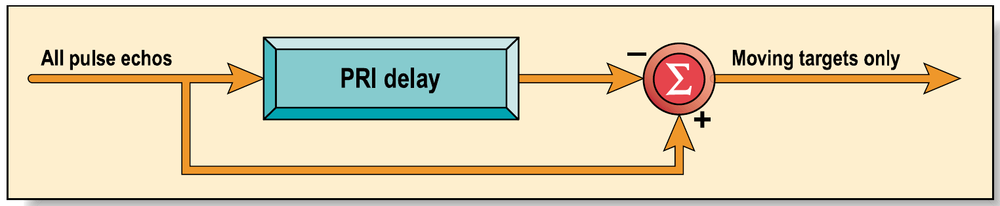
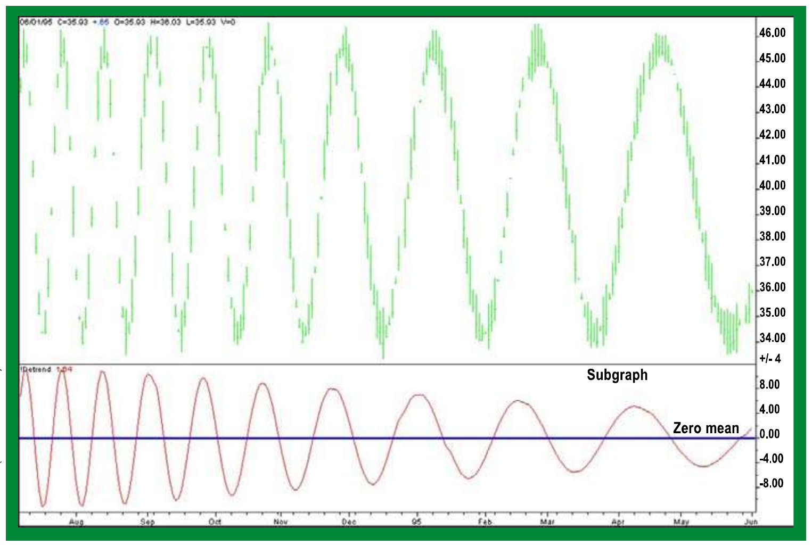
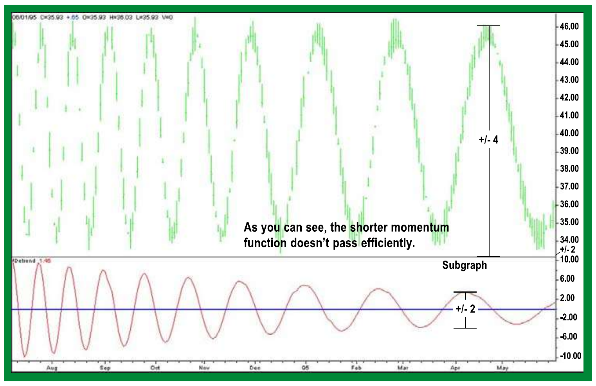
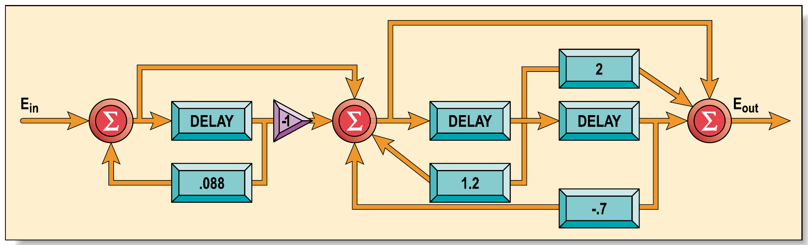
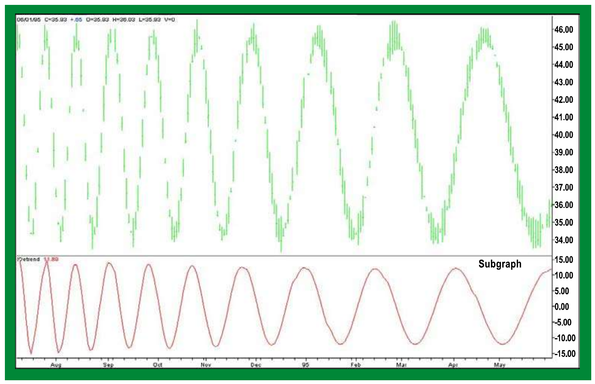
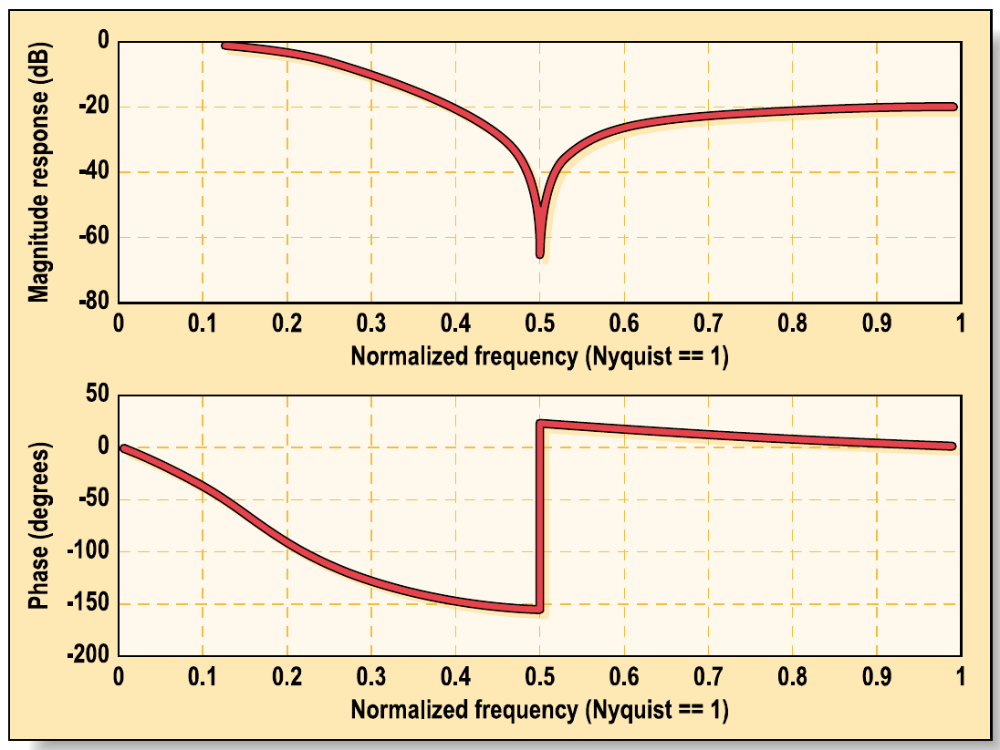
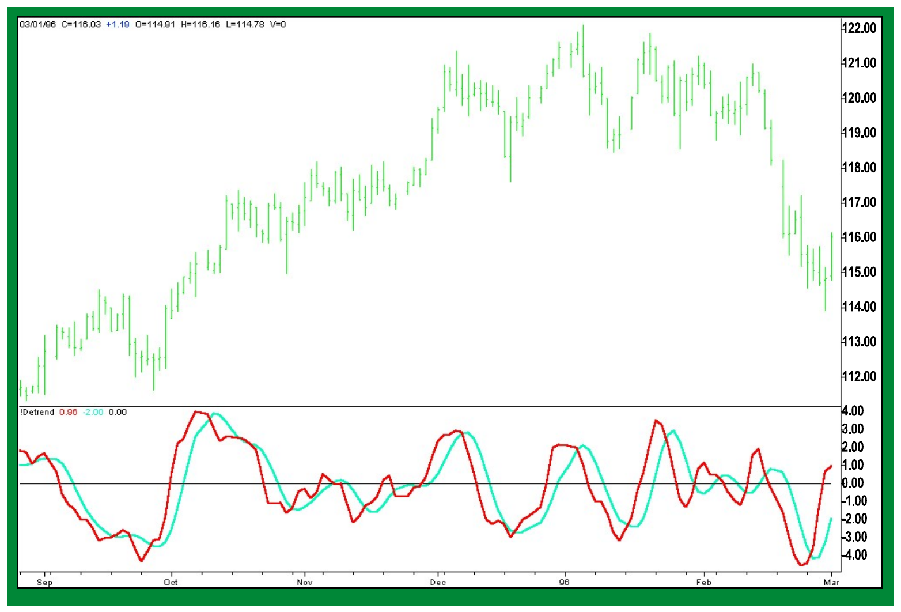

# Optimal Detrending

**John F. Ehlers**

*Stocks & Commodities V. 18:7 (20-29)*

- Article URL: https://technical.traders.com/archive/article.asp?file=\V18\C07\060OPT.pdf

---

*Did you know that a detrended signal, combined with an optimum smoothing filter, can produce an extremely responsive oscillator-type indicator that catches every cyclic turn as it happens? It's true! Here are the details.*

---

There must be a jillion ways to detrend price data, and a good chunk of them have already been explored in print. Given that, I had to have a new and significant approach to the subject -- and here it is. I discovered that a detrended signal, combined with an optimum smoothing filter, can produce an extremely responsive oscillator-type indicator.

I borrowed the concept of this new detrending approach for the markets from radar circuit designs, so to understand how it works, let's first take a look at how radar works.

To refresh your memory, radar (which is an acronym, sort of, for *radio detecting and ranging*) works by transmitting a high-powered radio-frequency (RF) pulse and listening for the return echoes from various targets. RF energy travels at the speed of light, and so the round-trip time for an echo comes out to 12.4 microseconds per mile. The distance of the target from the transmitter is determined by measuring the time it takes for the echo to return. After sufficient time has elapsed so no more echoes are expected, the radar transmits another pulse. The process is repeated, and the time between pulses is referred to as the *pulse repetition interval* (PRI).

Many radar systems, such as those used in air traffic control, are only used in relation to *moving* targets; these radars use a circuit called a *moving target indicator* (MTI). There are several ways to implement MTI, but the simplest way is to use the previous echo from a fixed target to cancel out the current echo from that same target. Figure 1 is a block diagram that shows how this cancellation is accomplished. The *delay line* delays the echo from the previous pulse by exactly one pulse repetition interval. Thus, pulses from fixed targets appear at exactly the same time and are canceled out, whereas pulses from moving targets do not occur at exactly the same time from pulse to pulse, and therefore are not.



**FIGURE 1: PULSE CANCELLER ELIMINATES FIXED TARGETS.** Many radar systems, such as those used in air traffic control, are only used in relation to moving targets. These radars use a circuit called moving target indicator (MTI). There are several ways to implement MTI, but the simplest way is to use the echo from a fixed target due to the previous pulse to cancel the echo from that same target from the current pulse.

## Pulse, Price, and Interval

So how does this relate to detrending? Simple. Like the pulses of radar, if we subtract the price *N* bars ago from the current price, the constant components of the prices cancel each other out. This *N*-bar momentum function -- which is the subtraction of price *N* bars ago -- takes out the trend because the trends are the *nearly* constant cycle components of price (they change, so they cannot be *exactly* constant). And like the pulses of radar, trends are eliminated by removing -- canceling out -- the previous price from the current one by using the *N*-day momentum function. So the question becomes: how are the cycle components, the variable parts of the simple model, affected by the momentum function?

## Simple Momentum

To explain how this works, consider as an example a six-bar momentum function, where the price as of six bars ago is subtracted from the current price, just like radar theory. (I'm using six bars here because that ties in with the Hilbert transform manipulations I wrote about in an earlier article.) I think of trends as being composed of pieces of long cycles. The trends -- that is, cycle components much longer than six bars -- are partially removed by the momentum function, while the shorter cycle components are passed through with less filtering. As a result, a six-bar momentum function is erratic in removing cycle components whose periods are shorter than six bars. Multiples of six-bar cycles (three-bar cycles, 1.5-bar cycles, and so forth) will also cancel each other out, causing erratic results.

That's the problem with the simple filter. The six-bar filter tries to detrend, but it doesn't do it well enough; the shorter the momentum length, the less effective it is at retaining the desired shorter cycle components. The Figure 2 subgraph shows how a six-bar momentum function removes the constant term, leaving the subgraph's detrended signal with a zero mean. Longer cycle components are partially removed, causing the waveform -- the amplitude (that is, the height of the wave) -- of the subgraph signal to be erratic.



**FIGURE 2: SIX-BAR MOMENTUM PASSES SHORTER CYCLES MORE EFFICIENTLY.** The subgraph shows how a six-bar momentum function removes the constant term and gets better at passing the shorter cycle periods; in contrast, in the simple filter function, the range of cycle periods is not uniform.

Why not use a shorter momentum function, such as a four-bar momentum, to pass more of the shorter cycle components into the filter? The answer can be seen in Figure 3; in such a situation, the longer cycle periods are passed less effectively. Here, the wave size of the longer signals is only +/-2, whereas the wave size of the same signals are approximately +/-4. Remember, the shorter the momentum length, the less effective it is in removing the trend, because there's not enough trend being perceived in those lengths to do so. The range of the longer cycles undergoes greater filtering, allowing for closer analysis, and eventual removal, of the trend.



**FIGURE 3: FOUR-BAR MOMENTUM IS LESS EFFICIENT AT PASSING LONGER CYCLES.** Here, the longer cycle periods are passed less effectively because the shorter the momentum length, the less effective it is in removing the trend. The range of the longer cycles undergoes greater attenuation, allowing for closer analysis, and eventual removal, of the trend.

## Optimal Detrending

Radars solve the problem of passing a range of different velocities through the moving target indicator (MTI) circuits by using more complex filters. The same is true in the financial markets. Instead of a simple filter, we can make use of a *triple* filter as shown in Figure 4, constructed as a *triple delay-line canceller*, much like the delay line used in radar theory mentioned at the beginning, but tripled for maximum effectiveness.



**FIGURE 4: TRIPLE DELAY-LINE MTI CANCELLER BLOCK DIAGRAM.** Instead of a simple filter, we can make use of a triple filter as shown here, constructed as a triple delay-line canceller, much like the delay line used in radar theory, but tripled for maximum effectiveness.

Using the values from Figure 4, the EasyLanguage code to implement the triple delay-line canceller as a detrender is:

```easylanguage
Inputs: Price((H+L)/2);

Vars: Detrend(0);

Value1 = Price + .088*Value1[6];

Value2 = Value1 - Value1[6] + 1.2*Value2[6] - .7*Value2[12];

Detrend = Value2[12] - 2*Value2[6] + Value2;

Plot1(Detrend, "Detrend");
```

Or, algebraically:

> Detrend = Value2(t-12) - 2*Value2(t-6) + Value2

Where:

> Value2 = Value1 - Value1(t-6) + 1.2*Value2(t-6) - 0.7*Value2(t-12)

> Value1 = ((High + Low) / 2) + 0.088*Value1(t-6)

The advantage of the triple delay-line filter for detrending the financial markets becomes apparent after a look at Figure 5. The detrended waveform of all cycle components is almost the same; the previous price and the current price cancel each other out. The triple delay-line filter gives a truer picture of what was in the original dataset because of the improved uniformity of the wave size. The difference between the previous price and the current price is now constant; there is no longer the problem of variable results.



**FIGURE 5: TRIPLE DELAY CANCELLER PASSES ALL CYCLE COMPONENTS OF INTEREST.** The advantage of the triple delay-line filter for detrending the financial markets becomes apparent. The detrended amplitude of all cycle components is almost the same; the previous price and the current price cancel each other out. The triple delay-line filter gives a truer picture of what was in the original dataset because of the improved amplitude fidelity.

## Optimum Smoothing

When I decided to design a new method by which to detrend price data -- that is, an optimum smoothing filter -- I set one criterion to be that the smoother could have no more than a one-bar lag. An *elliptic* filter provides the maximum amount of smoothing under the constraint of a given lag. So, with the use of Matlab and using values from that software, I designed an elliptic filter whose performance characteristics can be seen in Figure 6.

For this filter, I set the out-of-band attenuation to -20 decibels (dB) and adjusted the in-band ripple to position the notch in the response to be exactly at 0.5 cycles per day -- a two-bar period. The phase delay for a frequency of 0.125 cycles per day -- an eight-bar cycle -- is approximately 50 degrees. For a 360-degree full cycle, 45 degrees is one-eighth, so the delay computes to be one-eighth of an eight-bar period. This shows the delay will be slightly longer than the desired one-bar delay.



**FIGURE 6: RESPONSE CHARACTERISTICS OF AN ELLIPTIC FILTER WITH A ONE-BAR LAG.** An elliptic filter provides the maximum amount of smoothing under the constraint of a given lag. Matlab was used to design an elliptic filter whose performance characteristics can be seen here.

The EasyLanguage code to compute the optimum elliptic filter is:

```easylanguage
Smooth = 0.13785*Price + 0.0007*Price[1] + 0.13785*Price[2] +
         1.2103*Smooth[1] - 0.4867*Smooth[2]
```

Or, algebraically:

> Smooth = 0.13785*Price + 0.0007*Price(t-1) + 0.13785*Price(t-2) + 1.2103*Smooth(t-1) - 0.4867*Smooth(t-2)

Where:

> Price = (High + Low) / 2

These values are taken as examples from Merrill Skolnik's *Radar Handbook*. I know I can reduce the effects of lag by computing the prediction of a one-bar momentum for each trading position I hold. In this case, I simply added the one-day momentum of the price to the price value for that bar. Doing this, the modified optimum elliptic filter becomes:

```easylanguage
Smooth = 0.13785*(2*Price - Price[1]) + 0.0007*(2*Price[1] - Price[2]) +
         0.13785*(2*Price[2] - Price[3]) + 1.2103*Smooth[1] - 0.4867*Smooth[2]
```

Or, algebraically:

> Smooth = 0.13785*(2*Price - Price(t-1)) + 0.0007*(2*Price(t-1) - Price(t-2)) + 0.13785*(2*Price(t-2) - Price(t-3)) + 1.2103*Smooth(t-1) - 0.4867*Smooth(t-2)

The detrender and the smoothing filter can be used independently in a variety of applications. When they are used together, however, the result is an extremely responsive oscillator. They are used together by substituting "detrend" for "price" in the equation. The detrender provides maximum uniformity in the detrended waveform with regard to both phase and wave size, while the smoother offers minimum delay so that the crossing of the indicator lines is extremely responsive to changing price directions. A typical example of this oscillator can be seen in Figure 7; as you can see, it catches every cyclic turn as it happens.

The detrend line, seen here in red, has been improved by smoothing with the modified optimum elliptic filter, with minimal lag. The smoothed detrended signal is smoothed again with the modified optimum elliptic filter, and can be seen in blue. Take a look -- the crossings of the two indicator lines catch every major cyclic move, just what every trader and technician can use.



**FIGURE 7: THE OSCILLATOR CATCHES EVERY CYCLIC TURN AS IT HAPPENS.** The detrend line, seen here in red, has been improved by smoothing with the modified optimum elliptic filter, with minimal lag. The smoothed detrended signal is smoothed again with the modified optimum elliptic filter, and can be seen in blue. The crossings of the two indicator lines catch every major cyclic move.

## Conclusion

This oscillator is promising in the way that it promptly catches every major cyclic move. But as with all oscillators, with the exception of the sinewave indicator, care must be taken in using the signals when the market is in a trend mode. While a superior oscillator can be generated using the triple delay-line detrender, the real benefit for traders is that the detrender can be used as the first step in more sophisticated analyses. Such analyses include Hilbert transforms, and they also include polynomial predictive filters, which will be discussed in an upcoming article.

---

*John F. Ehlers, Box 1901, Goleta, CA 93116, is an electrical engineer working in electronic research and development and has been a private trader since 1978. He is a pioneer in introducing maximum entropy spectrum analysis to technical traders through his MESA software.*

## Suggested Reading and References

- Ehlers, John F. [2000]. "Adaptive Trends And Oscillators," *Technical Analysis of Stocks & Commodities*, Volume 18: May.
- Ehlers, John F. [2000]. "On Lag, Signal Processing, And The Hilbert Transform: Hilbert Indicators Tell You When To Trade," *Technical Analysis of Stocks & Commodities*, Volume 18: March.
- Skolnik, Merrill [1990]. *Radar Handbook*, second edition, McGraw-Hill.

---

## BibTeX

```bibtex
@article{ehlers2000optimal,
  author  = {John F. Ehlers},
  title   = {Optimal Detrending},
  journal = {Technical Analysis of Stocks \& Commodities},
  volume  = {18},
  number  = {7},
  pages   = {20--29},
  year    = {2000},
  month   = jul,
  url     = {https://technical.traders.com/archive/article.asp?file=\V18\C07\060OPT.pdf}
}
```
