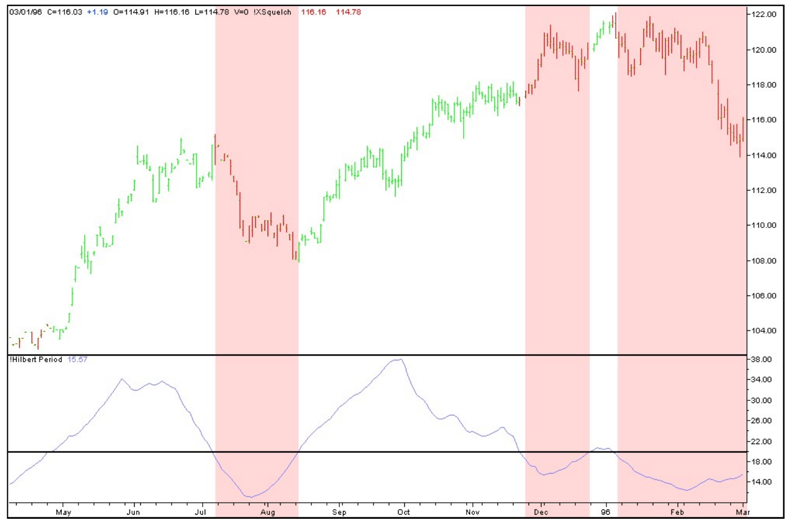
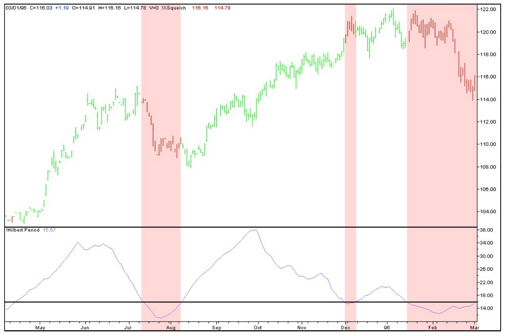

# Squelch Those Whipsaws

**Use a technique from the world of radios to eliminate market noise**

*by John F. Ehlers*

Technical Analysis of Stocks & Commodities, Volume 18, September 2000, pp. 42--46

- Article URL: https://technical.traders.com/archive/article.asp?file=\V18\C09\082SQU.pdf
- Traders' Tips URL: https://www.traders.com/Documentation/FEEDbk_docs/2000/09/TradersTips/TradersTips.html

---

What's real price movement and what's just noise? Figuring out the difference is vital, and here's an objective measure to help you out.

Hey, good buddy! Ever operate a citizens' band (CB) radio? If you haven't, most CBs are relatively simple devices, usually with three controls: a channel selector, a volume control, and a squelch control. Squelch control is important to the operation of the radio because without it, there would be no way for the radio to distinguish between static noise and a real signal from a transmitter.

Such a distinction can also be important to your trading. If you could avoid periods when the market had no clear trend, you'd avoid whipsaws and get cleaner trades. If you could identify periods that were filled with noise and no clear data, you could also switch trading tactics to suit the situation. At the very least, you'd know what situation you faced.

## Squelch

If you turned the squelch control on a CB radio to maximum, all you'd get is noise. If you turned it all the way down, the noise would go away and would be, in effect, "squelched." At that point, when a voice came on the radio, you would hear a short burst of noise just when the voice you hear stops; that's because there's a momentary delay until the squelch control cuts in again.

The principle here is that the radio receives a range of frequencies in each channel, and the frequencies involving voice waves are located at the lower portion of the frequency spectrum. Noise, on the other hand, is spread across the entire frequency spectrum. By filtering to receive just the low frequencies, the signals in the lower part of the spectrum can be compared with the signals in the higher part of the spectrum. If only noise is present, the power in the two parts of the spectrum --- the lower frequencies and the higher frequencies --- will be roughly equal. But when voice waves are present, the lower spectrum will be larger.

A squelch control is used to compare the two parts of the spectrum and distinguish which part contains relevant voice waves. If the higher-frequency part of the spectrum is about equal to the lower part, then the squelch control can eliminate the signals that constitute simple noise. If a voice --- a real, transmitted signal --- comes over the channel, the squelch allows the signals to pass through to the speakers. This keeps you, the radio listener, from being bothered by static --- noise --- during the time that no voice waves are being received.

## Traders vs. Noise

If you are a trend trader, you are likely to have problems discerning noise from relevant data during a consolidation phase (or cycle mode) of the market, as opposed to when the market is trending. The difference between a market's cycle mode and trend mode is the length of the cyclic period. A trend can be viewed as a part of a long cycle. A long cycle period means the cycle frequency is low --- that is, the waveforms are less pronounced; therefore, for a given period, the number of up/down movements would also be low.

Cycle mode signals, on the other hand, tend to have shorter cycle periods; therefore, for a given period, the number of up/down movements and the number of complete cycles will be high --- the waveforms are more pronounced. This occurs because the frequency is higher; remember, a piece of a long cycle would be equivalent to lower frequency. Keeping this distinction between market modes in mind, I designed an indicator to flag trend modes in the same way that a squelch control on a radio sends through a voice signal to the speakers.

## Nuts and Bolts

To develop something resembling squelch control to analyze the stock market, I needed to design a filter that would focus on the low frequencies found in trends. But I discovered that designing precision low-frequency filters in conventional trading software was a challenge because the rounding errors in the calculations caused the filters to be unstable. I discovered that it was impractical to design a squelch circuit in exactly the same way it is done in a CB radio by comparing filter outputs.

However, in the March 2000 Stocks & Commodities, I described a way to measure the dominant cycle in a price chart. I realized I could use that as a guideline of sorts to create a squelch control for the market. I figured that if the dominant cycle period was long, it would be safe to assume that most of the activity would be in the low-frequency part of the spectrum. If the dominant cycle period was shorter, it would be safe to assume that most of the activity would be in the higher-frequency part of the spectrum.

So to create a squelch circuit for trading, I had to compare the measured dominant cycle to some fixed threshold at which the squelch control is set. I determined that if the measured dominant cycle period is longer than the threshold value, the market is in a trend mode. If the measured dominant cycle period is shorter than the threshold value, the market is in a cycle mode. The threshold value can be almost anything, but a good starting point is 20 bars, roughly corresponding to a one-month cycle using daily data.

The EasyLanguage code I've devised to implement the squelch indicator can be seen in the Traders' Tips section elsewhere in this issue. This code is identical to the Hilbert period code from the March article, but with the addition of the squelch threshold and the display being implemented as a colored bar on the chart, depending on the squelch's value.

In Figure 1, when the measured dominant cycle (shown in the subgraph) is shorter than the 20-bar squelch threshold, the market is in a cycle mode and the bars are red. Otherwise, the measured dominant cycle is longer than the squelch threshold and the trend mode can be identified by the green price bars.



**FIGURE 1: SQUELCH INDICATOR.** With the squelch control set to 20, you can avoid whipsaws by exiting when the dominant cycle falls below 20, here indicated by red bars. Adjust the squelch indicator to be more or less sensitive to whipsaw areas with high-frequency cyclic components.

The trend mode can be identified sooner and extend longer when the squelch threshold is turned down to 15 bars, as shown in Figure 2. Lowering the squelch threshold even more can result in identifying virtually all the bars as being in the trend mode. But why would you? This is the equivalent of setting the squelch on the radio to hear static noise all the time.



**FIGURE 2: ADJUSTING SQUELCH.** A trader turns the squelch control down from 20 to 15 and avoids far more whipsaws while still capturing trend. Traders can not only avoid whipsaw but shift trading tactics as well when high-frequency cycles pop up in pricing.

## Summary

So there you have it, good buddy --- a simple squelch control that can keep you out of the market during those times that whipsaws are most likely. Over and out!

## Suggested Reading

- Ehlers, John F. [2000]. "Adaptive Trends And Oscillators: The Twain Meets Here," *Technical Analysis of Stocks & Commodities*, Volume 18: May.
- --- [2000]. "On Lag, Signal Processing, And The Hilbert Transform: Hilbert Indicators Tell You When To Trade," *Technical Analysis of Stocks & Commodities*, Volume 18: March.
- --- [1996]. "Stay In Phase," *Technical Analysis of Stocks & Commodities*, Volume 14: November.

---

*John F. Ehlers is an electrical engineer working in electronic research and development and has been a private trader since 1978. He is a pioneer in introducing maximum entropy spectrum analysis to technical traders through his MESA software.*

---

## BibTeX

```bibtex
@article{ehlers2000squelch,
  author  = {Ehlers, John F.},
  title   = {Squelch Those Whipsaws},
  journal = {Technical Analysis of Stocks \& Commodities},
  volume  = {18},
  number  = {9},
  pages   = {42--46},
  year    = {2000},
  month   = sep,
  url     = {https://technical.traders.com/archive/article.asp?file=\V18\C09\082SQU.pdf}
}

@misc{ehlers2000squelch_tips,
  author  = {{Technical Analysis of Stocks \& Commodities}},
  title   = {Traders' Tips: Squelch Those Whipsaws},
  year    = {2000},
  month   = sep,
  url     = {https://www.traders.com/Documentation/FEEDbk_docs/2000/09/TradersTips/TradersTips.html}
}
```
