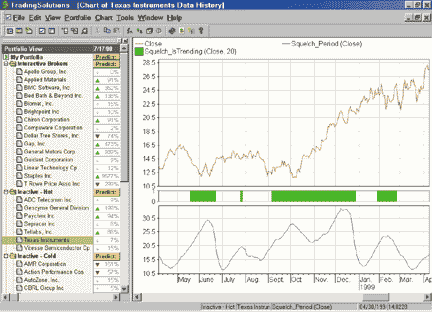
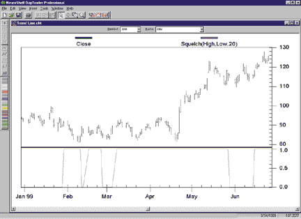
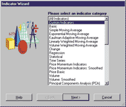
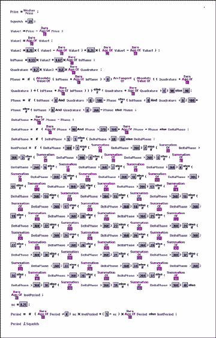
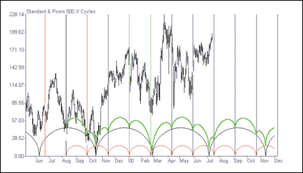

# Traders' Tips -- September 2000

## Squelch Those Whipsaws

- Traders' Tips URL: https://www.traders.com/Documentation/FEEDbk_docs/2000/09/TradersTips/TradersTips.html

---

*Here is this month's selection of Traders' Tips, contributed by various developers of technical analysis software to help readers more easily implement some of the strategies presented in this issue.*

---

## Omega Research EasyLanguage

Here's the EasyLanguage code I've devised to implement the squelch indicator, which you can read about elsewhere in this issue. This code is identical to the Hilbert period code from my March 2000 article, with the addition of the squelch threshold and the display being implemented as a paintbar -- that is, a bar on the chart being colored, depending on the squelch's value.

Here's EasyLanguage code to implement the squelch control as a paintbar:

```easylanguage
Inputs: Price((H+L)/2),
               Squelch(20);
                
Vars:   InPhase(0),
               Quadrature(0),
               Phase(0),
               DeltaPhase(0),
               count(0),
               InstPeriod(0),
               Period(0);

If CurrentBar > 5 then begin

       {Compute InPhase and Quadrature components}
       Value1 = Price - Price[6];
       Value2 =Value1[3];
       Value3 = 0.75*(Value1 - Value1[6]) + 0.25*(Value1[2] - Value1[4]);
       InPhase = 0.33*Value2 + 0.67*InPhase[1];
       Quadrature = 0.2*Value3 + 0.8*Quadrature[1];

       {Use ArcTangent to compute the current phase}
       If AbsValue(InPhase +InPhase[1]) > 0 then Phase = ArcTangent(AbsValue((Quadrature+Quadrature[1]) / (InPhase+InPhase[1])));

       {Resolve the ArcTangent ambiguity}
       If InPhase < 0 and Quadrature > 0 then Phase = 180 - Phase;
       If InPhase < 0 and Quadrature < 0 then Phase = 180 + Phase;
       If InPhase > 0 and Quadrature < 0 then Phase = 360 - Phase;

       {Compute a differential phase, resolve phase wraparound, and limit delta phase errors}
       DeltaPhase = Phase[1] - Phase;
       If Phase[1] < 90 and Phase > 270 then DeltaPhase = 360 + Phase[1] - Phase;
       If DeltaPhase < 1 then DeltaPhase = 1;
       If DeltaPhase > 60 then Deltaphase = 60;

       {Sum DeltaPhases to reach 360 degrees. The sum is the instantaneous period.}
       InstPeriod = 0;
       Value4 = 0;
       For count = 0 to 40 begin
               Value4 = Value4 + DeltaPhase[count];
               If Value4 > 360 and InstPeriod = 0 then begin
                       InstPeriod = count;
               end;
       end;

       {Resolve Instantaneous Period errors and smooth}
       If InstPeriod = 0 then InstPeriod = InstPeriod[1];
       Period = 0.25*InstPeriod + 0.75*Period[1];

       If Period < Squelch then begin 
               Plot1(High,"High");
               Plot2(Low,"Low");
       end;

end;
```

-- John F. Ehlers

---

## MetaStock

In his article "Squelch Those Whipsaws," John Ehlers introduces the squelch control indicator as a paintbar. To create this in MetaStock 6.52 or higher, select Indicator Builder from the Tools menu and enter the following new formulas. Each formula must be created separately and must be named exactly as it appears below.

```metastock
Name:  Hilbert cycle period - 1a
value1:=((H+L)/2) - Ref(((H+L)/2),-6);
value2:= Ref(value1,-3);
value3:=0.75*(value1-Ref(value1,-6)) + 0.25*(Ref(value1,-2)-Ref(value1,-4));

inphase:= 0.33 * value2 + (0.67 * PREV);
quad:= 0.2 * value3 + ( 0.8 * PREV);

p1:=Atan(Abs(quad+Ref(quad,-1)),Abs(inphase+Ref(inphase,-1)));

phase:=If(inphase<0 AND quad>0, 180-p1, 
  If(inphase<0 AND quad<0, 180+p1,
  If(inphase>0 AND quad<0, 360-p1,p1)));

dp:=If(Ref(phase,-1)<90 AND phase>270, 360+Ref(phase,-1)-phase,Ref(phase,-1)-phase);
dp2:=If(dp < 1, 1,
  If(dp > 60, 60, dp));

dp2

Name: H cycle count 1a
value:= Fml("Hilbert cycle period - 1a");
If(Sum(value,6)>=360 AND Sum(value,5)<360 ,6,0) +
If(Sum(value,7)>=360 AND Sum(value,6)<360 ,7,0) +
If(Sum(value,8)>=360 AND Sum(value,7)<360 ,8,0) +
If(Sum(value,9)>=360 AND Sum(value,8)<360 ,9,0) +
If(Sum(value,10)>=360 AND Sum(value,9)<360 ,10,0) +
If(Sum(value,11)>=360 AND Sum(value,10)<360 ,11,0) +
If(Sum(value,12)>=360 AND Sum(value,11)<360 ,12,0) +
If(Sum(value,13)>=360 AND Sum(value,12)<360 ,13,0) +
If(Sum(value,14)>=360 AND Sum(value,13)<360 ,14,0) +
If(Sum(value,15)>=360 AND Sum(value,14)<360 ,15,0)

Name:  H cycle count 2a
value:= Fml("Hilbert cycle period - 1a");
If(Sum(value,16)>=360 AND Sum(value,15)<360 ,16,0) +
If(Sum(value,17)>=360 AND Sum(value,16)<360 ,17,0) +
If(Sum(value,18)>=360 AND Sum(value,17)<360 ,18,0) +
If(Sum(value,19)>=360 AND Sum(value,18)<360 ,19,0) +
If(Sum(value,20)>=360 AND Sum(value,19)<360 ,20,0) +
If(Sum(value,21)>=360 AND Sum(value,20)<360 ,21,0) +
If(Sum(value,22)>=360 AND Sum(value,21)<360 ,22,0) +
If(Sum(value,23)>=360 AND Sum(value,22)<360 ,23,0) +
If(Sum(value,24)>=360 AND Sum(value,23)<360 ,24,0) +
If(Sum(value,25)>=360 AND Sum(value,24)<360 ,25,0)

Name:  H cycle count 3a
value:= Fml("Hilbert cycle period - 1a");
If(Sum(value,26)>=360 AND Sum(value,25)<360 ,26,0) +
If(Sum(value,27)>=360 AND Sum(value,26)<360 ,27,0) +
If(Sum(value,28)>=360 AND Sum(value,27)<360 ,28,0) +
If(Sum(value,29)>=360 AND Sum(value,28)<360 ,29,0) +
If(Sum(value,30)>=360 AND Sum(value,29)<360 ,30,0) +
If(Sum(value,31)>=360 AND Sum(value,30)<360 ,31,0) +
If(Sum(value,32)>=360 AND Sum(value,31)<360 ,32,0) +
If(Sum(value,33)>=360 AND Sum(value,32)<360 ,33,0) +
If(Sum(value,34)>=360 AND Sum(value,33)<360 ,34,0) +
If(Sum(value,35)>=360 AND Sum(value,34)<360 ,35,0)

Name:  Hilbert cycle period - final-a
c1:= Fml( "H cycle count 1a") + Fml( "H cycle count 2a") + Fml( "H cycle count 3a") ;
c2:=If(c1=0,PREV,c1);

(0.25*c2) + (0.75*PREV)
```

To create the indicator as a highlight, select Expert Advisor from the Tools menu. Click New, enter "Squelch Indicator" for the name, and select the Highlights page. Click New and enter the following formula:

```metastock
Name: Squelch Threshold
Squelch:=20;
Fml("Hilbert cycle period - final-a")<Squelch
```

To apply the Indicator, open the Expert Advisor, select the Squelch Indicator expert, then click the Attach button.

The formulas can also be downloaded from https://www.equis.com/customer/support/formulas/.

-- Cheryl C. Abram, Equis International, Inc.

https://www.equis.com

---

## TradingSolutions

The EasyLanguage code for displaying the squelch control as a paintbar for John Ehlers's article, "Squelch Those Whipsaws," can be reproduced in TradingSolutions by breaking the steps into separate functions. For example, functions can be written to calculate the "InPhase" and "Quadrature" variables, which can then be used in the calculation of the "Phase," "DeltaPhase," and "InstPeriod."

Although paintbars are not a feature of TradingSolutions, a similar effect can be displayed in a chart by writing a function to determine whether the period is less than 20. This function can then be displayed in a subchart to highlight whether the price is in a trend mode or a cycle mode. The squelch period should also prove useful as an input for neural network predictions in TradingSolutions.

Since the squelch control is a fairly complex formula, these functions are available as a function file that can be downloaded from our Website in the Solution Library section. To import this file into TradingSolutions, select "Import Functions..." from the File menu. To apply the squelch control to a stock or group of stocks, select "Add New Field..." from the context menu for the stock or group, select "Calculate a value..." then select "Squelch_IsTrending" from the "Traders Tips" group (Figure 1).



**FIGURE 1: TRADINGSOLUTIONS.** Here's the squelch control as reproduced in TradingSolutions. It highlights whether the price is in a trend or cycle mode.

The notes for these functions include the details for converting the various EasyLanguage elements into TradingSolutions formulas.

-- Gary Geniesse, TradingSolutions Project Lead

NeuroDimension, Inc.
800 634-3327, 352 377-5144
https://www.tradingsolutions.net

---

## NeuroShell Trader

The indicator that John Ehlers describes is quite complex and could be built within NeuroShell Trader; however, with NeuroShell Trader's ability to call external code, we decided to build a custom indicator and provide it to users to simplify the process. Users of NeuroShell Trader can go to the Stocks & Commodities section of the NeuroShell Trader free technical support Website to download the squelch indicator.



**FIGURE 2: NEUROSHELL TRADER.** Here's the squelch control as interpreted for NeuroShell Trader.

After downloading the custom indicator, you can insert it into your chart (Figure 2), Prediction, or Trading Strategy by using the Indicator Wizard and selecting the Custom Indicators Category (Figure 3).



**FIGURE 3: NEUROSHELL TRADER.** Here's the Indicator Wizard in NeuroShell Trader, where you can select a custom indicator and insert it into your chart display.

We have modified this indicator slightly so that it returns a value of "1" if the period is less than the squelch and a value of zero otherwise. This will provide you with the ability to use it as a continuous stream that can be placed on the chart, in a prediction, or in a trading strategy.

Ehlers's company, Mesa Software, sells additional indicators that are specifically designed for use with NeuroShell Trader. For more information on these indicators, please contact Mesa Software.

For more information on the NeuroShell Trader, visit www.neuroshell.com.

-- Marge Sherald, Ward Systems Group, Inc.

301 662-7950, sales@wardsystems.com
https://www.neuroshell.com

---

## Byte Into The Market

Here is the Byte Into The Market graphical editor code for showing the status of the squelch control in John Ehlers's "Squelch Those Whipsaws" (Figure 4). In Byte Into The Market software's "Boolean (True/False) Condition" editor, this code can be used to chart bars where the squelch control indicates the market is in cycle mode due to presence of high-frequency components in one color (code is false) and show bars where the market is in trend mode in another color (code is true). The true-false condition called "TrendMode" is available for download from our Website in a downloadable zip file at https://www.tarnsoft.com/squelch.zip. Also provided is a chart template with the true-false colored bars charted together with the value of the period formula and squelch control threshold from the code.



**FIGURE 4: BYTE INTO THE MARKET.** Here's BITM's graphical editor code for showing the status of the squelch control.

-- Tom Kohl, Tarn Software

303 794-4184
bitm@tarnsoft.com
https://www.tarnsoft.com

---

## TechniFilter Plus

Below is the formula from John Ehlers's article, "Squelch Those Whipsaws," as translated for TechniFilter Plus.

Line 12 of the formula returns a 1 if the period is less than the cutoff, 20. You can use this formula as a colorbar formula in TechniFilter Plus to color the bars that meet this cutoff requirement.

```technifilter
Formula for Cycle Period Measure with Cutoff value
NAME: HilPeriod
SWITCHES: multiline   recursive
PARAMETERS: .635, .338
INITIAL VALUE: (H+L)/2
FORMULA: [1]: (H+L)/2
         [2]: C-CY4                               {value1}
         [3]: 1.25*([2]Y4-&1*[2]Y2) + &1 * TY3 {r} {InPhase}
         [4]: [2]Y2 - &2*[2] + &2 * TY2 {r}     {Quadrature}
         [5]: ( ([4]+[4]Y1)/([3]+[3]Y1) )U0U17 * 180/3.1415
         [6]:  ([3]<0)*([4]>0)*(180-[5]) + 
              ([3]<0)*([4]<0)*(180+[5]) + 
              ([3]>0)*([4]<0)*(360-[5]) + (T=0) * [5] {phase}
         [7]: [6]Y1-[6] {deltaPhase}
         [8]: ([6]Y1<90)*([6]>270)*(360+[7]) +(T=0)*[7]
         [9]: ([8]%1)#60
        [10]: ([9]F2>360)*2 + (T=0)*([9]F3>360)*3
             + (T=0)*([9]F4>360)*4 + (T=0)*([9]F5>360)*5
             + (T=0)*([9]F6>360)*6 + (T=0)*([9]F7>360)*7
             + (T=0)*([9]F8>360)*8 + (T=0)*([9]F9>360)*9
             + (T=0)*([9]F10>360)*10 + (T=0)*([9]F11>360)*11
             + (T=0)*([9]F12>360)*12 + (T=0)*([9]F13>360)*13
             + (T=0)*([9]F14>360)*14 + (T=0)*([9]F15>360)*15
             + (T=0)*([9]F16>360)*16 + (T=0)*([9]F17>360)*17
             + (T=0)*([9]F18>360)*18 + (T=0)*([9]F19>360)*19
             + (T=0)*([9]F20>360)*20 + (T=0)*([9]F21>360)*21
             + (T=0)*([9]F22>360)*22 + (T=0)*([9]F23>360)*23
             + (T=0)*([9]F24>360)*24 + (T=0)*([9]F25>360)*25
             + (T=0)*([9]F26>360)*26 + (T=0)*([9]F27>360)*27
             + (T=0)*([9]F28>360)*28 + (T=0)*([9]F29>360)*29
             + (T=0)*([9]F30>360)*30 + (T=0)*([9]F31>360)*31
             + (T=0)*([9]F32>360)*32 + (T=0)*([9]F32>360)*33
             + (T=0)*([9]F34>360)*34 + (T=0)*([9]F35>360)*35
             + (T=0)*([9]F36>360)*36 + (T=0)*([9]F37>360)*37
             + (T=0)*([9]F38>360)*38 + (T=0)*([9]F39>360)*39
        [11]: .25*[10]+.75*TY1 {r}
        [12]: [11] < 20
```

Visit RTR's Website at https://www.rtrsoftware.com to download these formulas as well as program updates. Release 8.3 is now available for download.

-- Clay Burch, RTR Software

919 510-0608, E-mail: rtrsoft@aol.com
https://www.rtrsoftware.com

---

## Wave Wi$e Market Spreadsheet

The following Wave Wi$e formulas show how to compute and chart fixed-length cycles. Using the cycles tool, two interesting cycles (34 days and 91 days) are identified for the Standard & Poor's 500. These cycles are computed using the @CYCLE function and added to a chart (Figure 5). These cycles can also be added together (green line in cycles chart) to see how they react with each other. Finally, the chart can be extended into the future to determine where future bottoms may occur.

```wavewise
WAVE WI$E spreadsheet formulas
A: DATE @TC2000(C:\TC2000V3\Data,SP-500,Standard & Poors 500,DB)
B: HIGH 
C: LOW   
D: CLOSE         
E: OPEN 
F: VOL   
G:       
H: Cycle1       @CYCLE(A, "01-28-1999", 91)
I: Cycle2       @CYCLE(A, "08-10-1999", 34)
J: CycSum       CYCLE1+CYCLE2
=========End Formulas
```



**FIGURE 5: WAVEWI$E MARKET SPREADSHEET.** Here's a chart of the Standard & Poor's 500 cycles chart.

-- Peter Di Girolamo, Jerome Technology

908 369-7503, E-mail: jtiware@aol.com
https://members.aol.com/jtiware

---

*All rights reserved. Copyright 2000, Technical Analysis, Inc.*

---

## BibTeX

```bibtex
@misc{tasc2000sep_tips_squelch,
  author  = {{Technical Analysis of Stocks \& Commodities}},
  title   = {Traders' Tips: Squelch Those Whipsaws},
  year    = {2000},
  month   = sep,
  url     = {https://www.traders.com/Documentation/FEEDbk_docs/2000/09/TradersTips/TradersTips.html}
}
```
