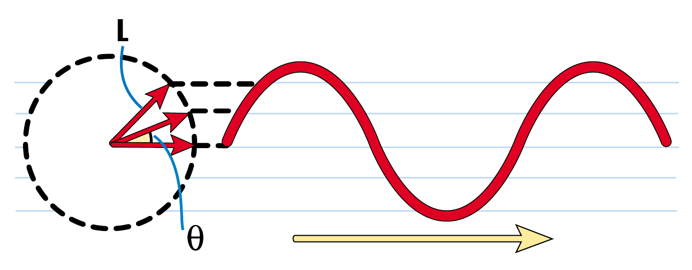
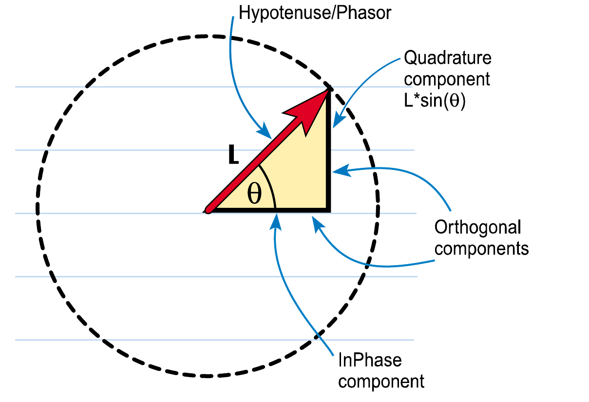
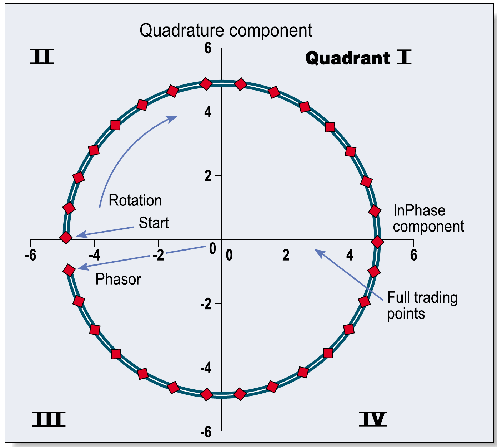
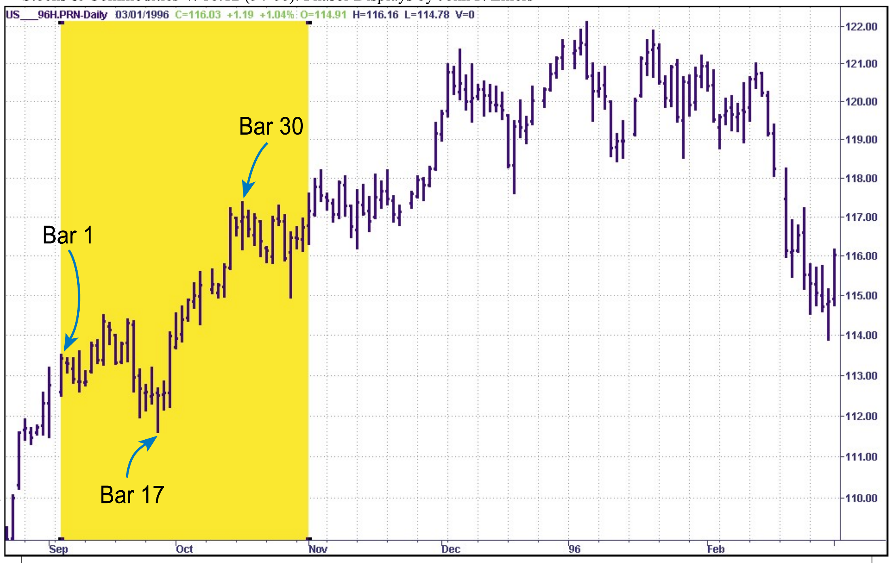
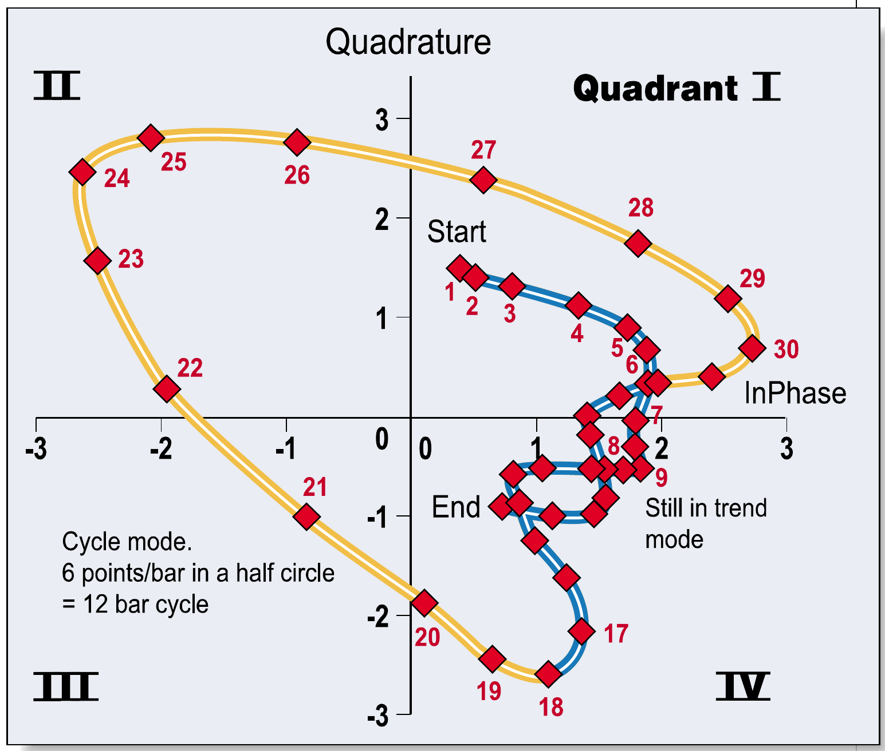
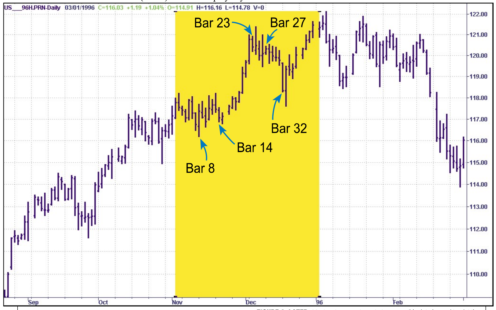
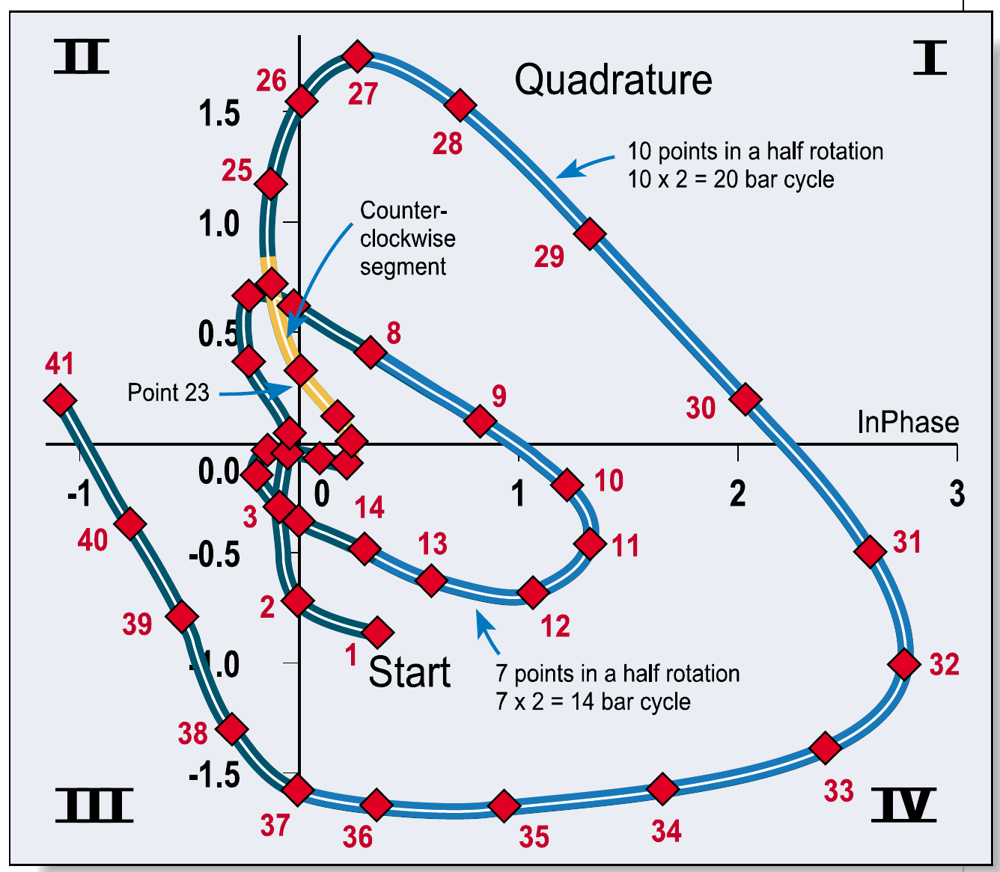
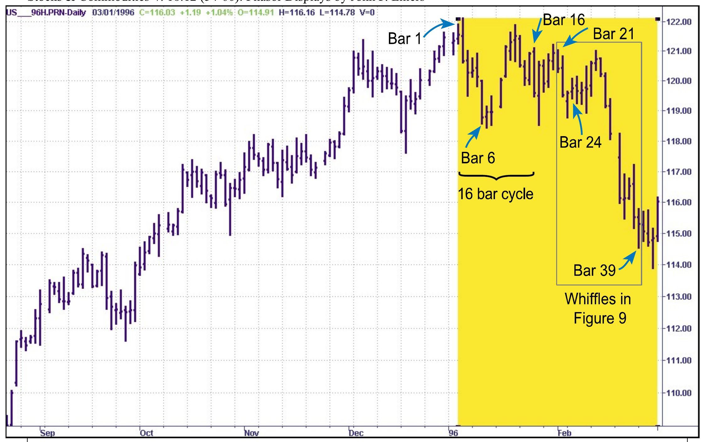
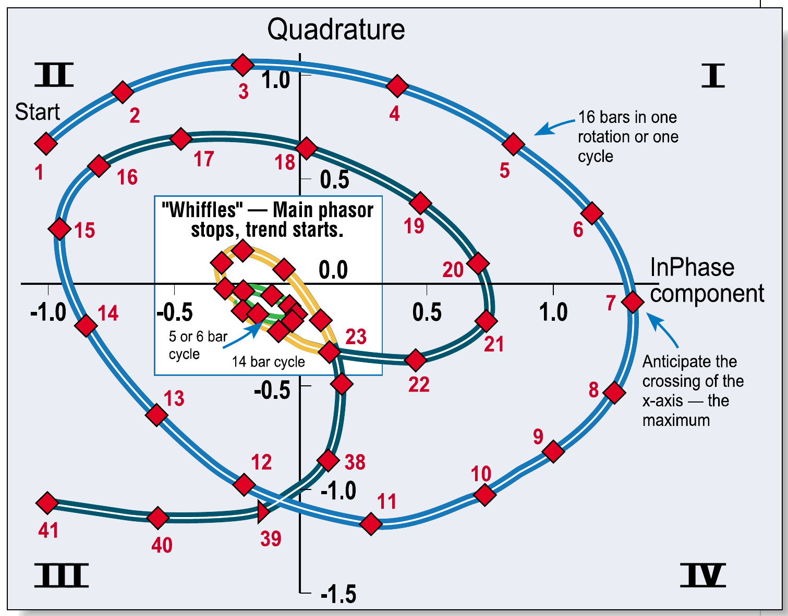
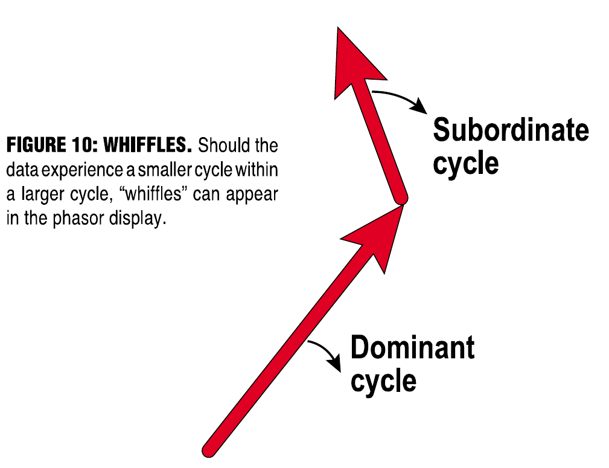

# Phasor Displays

- **Author:** John F. Ehlers
- **Publication:** Technical Analysis of STOCKS & COMMODITIES, Volume 18, December 2000, pp. 54--66
- **Article URL:** [Article PDF](https://technical.traders.com/archive/article.asp?file=\V18\C12\116PHA.pdf)
- **Traders' Tips URL:** [Traders' Tips, December 2000](https://www.traders.com/Documentation/FEEDbk_docs/2000/12/TradersTips/TradersTips.html)

---

*A high-tech display pinpoints anomalies and trading opportunities in price behavior.*

Remember that famous glass of water? The one that optimists see as half full and pessimists see as half empty? An engineer, however, sees the glass as having been designed with too much capacity. So what we see is really a matter of perception.

Market technicians have designed a variety of techniques to visualize what has happened and to predict what the future holds. Candlestick charts and point and figure charts are two examples of charting price data. When it comes to indicators, there is a plethora of wiggles, squiggles, zigzags, and channels that require volumes to describe.

I would now like to add to this din of displays a new and novel one so sensitive that it dramatically pinpoints variations and anomalies that cannot be removed with mathematical filters — at least within the lag constraints imposed by trading considerations.

## Phasors

One easy way to picture a cycle is as a phasor (Figure 1). The phasor is fixed at the tail of the arrow and rotates. Each time the arrowhead sweeps through one complete rotation, a cycle is completed. If we place a pen on the arrowhead and draw a sheet of paper below the arrowhead at a uniform rate as is done for seismographs, the pen draws a theoretical sinewave as shown at the right of the phasor. The relationship between the phasor diagram and the theoretical sinewave yields the typical cycle waveform we recognize on our charts. The phase angle of the arrow (its rotation angle from zero degrees) uniquely describes where we are in the waveform.

The position of the tip of the arrow in Figure 1 can be described in terms of the length of the arrow, $L$, and the phase angle, $\theta$. If we let the arrow be the hypotenuse of a right triangle, we can convert the description of the arrow from length and angle to two orthogonal (at right angles) components: the other two legs of the right triangle.

If you recall your trigonometry, the vertical component is $L \sin(\theta)$ and the horizontal component is $L \cos(\theta)$. The horizontal component is called the *inphase* component and the vertical component is called the *quadrature* component. The trick in creating a phasor display is generating the inphase and quadrature components. That is what a Hilbert transform does; it creates the inphase and quadrature components from the analytic waveform (Figure 2).


**FIGURE 1: THE PHASOR.** A phasor is the arrow from the center of the circle to the circle itself. That arrow rotates clockwise around the circle. The tip is tracked by marking on a steadily moving piece of paper underneath as it goes around the circle. The result is the wave seen to the right of the circle. Pictorially, this is the classic formulation of a sinewave, the model for cyclical waves in prices.


**FIGURE 2: PERFECT CYCLE.** A perfect sinewave or a series of prices with a perfect cycle in it would produce a phasor display like this one. Each point is a bar on the price chart. The phasor track rotates clockwise. The cycle period can be estimated by counting the points in any quadrant and multiplying by 4. Any deviations in the spacing between points (the rotation speed of the phasor) alert you to changes in the cycle frequency. Amplitude changes (the distance from the center) usually indicate the presence of a second cycle.

In the sidebar "Hilbert transform displays," I've supplied the most recent TradeStation code for the Hilbert transform, code that will export a file that Excel can use to display the phasor. (Code for other software was published in the November 2000 S&C.) Figure 3 shows a phasor display for a perfect sinewave (of, say, prices) like that in Figure 1. Of course, prices aren't always perfect sinewaves, though they sometimes come close.


**FIGURE 3: QUADRATURE COMPONENT.** The trick in creating a phasor display is generating the inphase and quadrature components, which is what a Hilbert transform does; it creates the inphase and quadrature components from the analytic waveform.

Figure 4 shows the March bonds. Note the bonds sag, then pop upward. Figure 5 has the phasor display over 120 trading days of the June 1996 Treasury bonds contract (Figure 6). I like to use this old data because it transitions from a trend mode to a cycle mode, and back to a trend mode. Since there are no intermediate modes, this data makes explanation easier.


**FIGURE 4: MARCH BONDS.** Bonds sag, then pop upward in the highlighted section. The phasor display for this period is in Figure 5.

Prices start in a trend mode at the left edge of the yellow shading in Figure 6. The starting point of the phasor display is located in the first quadrant of Figure 5. Since the market is in a trend mode, the phase hardly advances at all for about the first 17 bars. Then, due to the price dip and recovery, an apparent 12-bar cycle began. I arrived at this cycle period by counting the points in the left half plane (points 21 through 26) and doubling. But after a few more points, this cycle failed and the trend mode was reestablished for data to the end of the yellow box. The data ends in the trend mode in the fourth quadrant.


**FIGURE 5: PHASOR DISPLAY.** It's not until 17 bars into the data period that cyclic content becomes defined, but it ends just as the strong upthrust in Figure 4 ends.

The trend mode continues in Figure 7, starting in the fourth quadrant. There is no definitive cycle movement in the first 23 bars, except for about a half cycle of a 14-bar cycle. I estimated the period of this half cycle by counting the number of points in the right half of the plot (points 8 through 14) at this time.

After this brief cyclic burst, the phasor wanders nearly aimlessly for another 13 bars. In fact, the path of the phasor even turns counterclockwise during this period. A counterclockwise rotation theoretically means that time is running backward; this is impossible. Therefore, the only rational explanation for the path of the phasor is that the market is in a trend mode, where the advancing of phase has no meaning.

> One advantage of the phasor plot is that you now have a tool to precisely estimate the cyclic turning points.


**FIGURE 6: LATER.** Moving the analytical window over, this data is used to plot the phasor in Figure 7.


**FIGURE 7: WHAT CYCLE?** The data highlighted in Figure 6 shows little cyclical content at first but develops some in bars 27 and later.

A new cycle is established at the top of Figure 8 at point 27 and continues for 14 bars to the end of the dataset. The cycle period is about 20 bars, estimated by counting the points in the right half plane. The cycle shape is certainly distorted due to large amplitude fluctuations, but it is rotating around the origin at a relatively constant rate.

Near-textbook cycles continue in Figure 9 for about 1.5 cycles (to point 21) from the beginning of the data period shown in Figure 8. Just by counting the points over one full rotation, we can estimate the cycle period to be about 16 bars. However, about 21 bars from the beginning of the dataset, an anomaly appears — two very fast "whiffles" appear in the data. The shorter of these appears to be about a five-bar cycle (count five dots in the smallest circle) superimposed on a 14-bar cycle (count 14 dots in the two full circles); and both of these appear to be superimposed on the preexisting 16-bar cycle.


**FIGURE 8: BREAKOUT.** Bonds establish a range, then break lower. The phasor for this period is in Figure 9.


**FIGURE 9: TEXTBOOK.** Points one through 16 form a complete circle, defining a 16-bar cycle. Subcycles appear in the two circles in the middle. At the same time, the trend mode starts as the phasor for the dominant cycle virtually stops rotating. The diagram can also be used to estimate cycle length. Take the numbered points in two quadrants and multiply by two. Here, parts 4–11 supply eight bars/dots in quadrants I and IV (8 × 2 = 16-bar cycle).


**FIGURE 10: WHIFFLES.** Should the data experience a smaller cycle within a larger cycle, "whiffles" can appear in the phasor display.

Using a phasor diagram schematic, Figure 10 shows us there is an explanation for these whiffles. A shorter subordinate cycle is displayed as a phasor that rotates at the tip of the dominant cycle phasor, rotating at a rate faster than that of the dominant cycle. The dominant cycle phasor is rotating at its own rate. Thus, a five-day cycle produces a signature like the smaller whiffle in Figure 9. In fact, the shorter whiffle is superimposed on the longer 14-bar whiffle.

Practically speaking, the two whiffles mean that the phase of the dominant cycle stopped advancing, signaling a trend mode had started. With this identification, we see the trend mode started about 17 bars before the end of the data around point 24. Having identified the trend onset well before the major price movement, we are well equipped to maximize the profit of the trend movement.

The subordinate cycles do not necessarily have to be a complete cycle. Fractional subordinate cycles can account for erratic paths in the phasor plot, such as that near the origin of Figure 7. In addition, the plot shows the cycles that would be impossible to filter out mathematically.

Subordinate cycles whose periods are longer than the period of the dominant cycle are more difficult to visualize. Their effect is to throw the trajectory of the dominant cycle off-center. Whether the subordinate cycle is shorter or longer than the dominant cycle, the phasor plot immediately identifies the impact of subordinate cycles without performing any additional filtering. Additional filtering certainly would introduce lag, which would make further analysis even more difficult.

One advantage of the phasor plot is that you now have a tool to precisely estimate the cyclic turning points. You want to sell when the inphase component is at its maximum and buy when the inphase component is at its minimum. The inphase component will be at its maximum when it crosses the X-axis from quadrant I to quadrant IV. Its minimum will be when the phasor crosses from quadrant III to quadrant II.

## One Problem

These buy and sell rules are subject to the lag of the computation of the inphase component. In EasyLanguage, there is a one-bar lag due to the four-bar weighted moving average, a three-bar lag due to detrending (the center of the filter), and a three-bar lag for the final computation of inphase I1.

The buying and selling opportunity must account for this seven-bar lag in the computation of the inphase component. If you have, for example, a 14-bar dominant cycle, the seven-bar lag constitutes a 180-degree shift of the phasor location (that is, a half cycle). On the other hand, the detrending operation in the computation introduced a 90-degree phase lead. Thus, you must compensate only for a net 90-degree lag (a quarter cycle, or one-fourth of the full cycle) for a 14-bar cycle.

In other words, you must anticipate the maximum inphase component (the crossing of the X-axis) by 3.5 bars (14/4 bars) for a selling opportunity and anticipate the minimum inphase component by 3.5 bars for a buying opportunity. This precision technique is superior to the half-cycle offsets that have been described in the literature.

Since the compensation calculation is so important, here's another example. Suppose the dominant cycle is 21 days. The seven-bar lag would be one-third of a cycle, or 120 degrees. On removing the 90-degree lead due to the detrending, the resultant lag of the inphase component is only 120 − 90 = 30 degrees; 30 degrees is 1/12 of a cycle (30/360 = 1/12), so 21 × 1/12 = 1.75 days of a 21-bar cycle. In this case, you would have to anticipate the inphase maxima and minima by only about two days. That shouldn't be hard if you're watching the phasor diagram move along. At the very least, as the phasor turns toward the X-axis, you're alerted to potential changes of direction.

## Conclusions

Plotting the Hilbert transform outputs as a XY (scatter) plot in Excel lets you visualize the phasor trajectory and, thereby, the behavior of the cycles, if any, in your data. Since the phasor assumes only one dominant cycle is present, its trajectory lets you actually see the impact of frequency components in the data, components that are nearly impossible to filter for practical applications to trading. More important, knowing the dominant cycle, you can estimate the precise point for long and short entry points by seeing when the inphase component of the Hilbert transform reaches its maximum and minimum values, respectively.

## Hilbert Transform Displays, In EasyLanguage

The EasyLanguage code for the Hilbert transform can be seen here. This code was originally described in detail in the November 2000 STOCKS & COMMODITIES and is repeated here for convenience's sake. The original basic concept of the Hilbert transform now includes frequency-dependent amplitude compensation. The unfiltered inphase and quadrature components I1 and Q1 are used to plot the displays.

```easylanguage
{***************************************************************
Description : Hilbert Transform
Copyright (c) 2000 MESA Software
***************************************************************}

Inputs: Price((H+L)/2);

Vars: Smooth(0),
      Detrender(0),
      I1(0),
      Q1(0),
      I2(0),
      Q2(0),
      I3(0),
      Q3(0),
      jI(0),
      jQ(0),
      X1(0),
      Y1(0),
      X2(0),
      Y2(0),
      Re(0),
      Im(0),
      Period(0);

If CurrentBar > 5 then begin

Smooth = (4*Price + 3*Price[1] + 2*Price[2] + Price[3]) / 10;

Detrender = (.25*Smooth + .75*Smooth[2] -
  .75*Smooth[4] - .25*Smooth[6])*(.046*Period[1] + .332);

{Compute InPhase and Quadrature components}

Q1 = (.25*Detrender + .75*Detrender[2] - .75*Detrender[4]
  - .25*Detrender[6])*(.046*Period[1] + .332);
I1 = Detrender[3];

{advance the phase of I1 and Q1 by 90 degrees}
jI = .25*I1 + .75*I1[2] - .75*I1[4] - .25*I1[6];
jQ = .25*Q1 + .75*Q1[2] - .75*Q1[4] - .25*Q1[6];

{Phasor addition to equalize amplitude due to quadrature
calculations (and 3 bar averaging)}

I2 = I1 - jQ;
Q2 = Q1 + jI;

{Smooth the I and Q components before applying the
discriminator}

I2 = .15*I2 + .85*I2[1];
Q2 = .15*Q2 + .85*Q2[1];

{Homodyne Discriminator}

X1 = I2*I2[1];
X2 = I2*Q2[1];
Y1 = Q2*Q2[1];
Y2 = Q2*I2[1];
Re = X1 + Y1;
Im = X2 - Y2;

Re = .2*Re + .8*Re[1];
Im = .2*Im + .8*Im[1];

If Im <> 0 and Re <> 0 then Period = 360/ArcTangent(Im/Re);

If Period > 1.5*Period[1] then Period = 1.5*Period[1];
If Period < .67*Period[1] then Period = .67*Period[1];
If Period < 6 then Period = 6;
If Period > 50 then Period = 50;

Period = .2*Period + .8*Period[1];

Plot1(I1, "InPhase");
Plot2(Q1, "Quadrature");

If Date > Date[1] then Print(File("c:\hilbert\IQ.csv"), date,
  ",", I1, ",", Q1);

end;
```

You should create a `C:\HILBERT` directory using Windows Explorer before you run this program in TradeStation. The final line of code creates a file in the HILBERT directory on your C: drive. The file is IQ.CSV, a comma-delimited ASCII file. You import this file into Excel to generate the Hilbert transform display.

To read the file into Excel is straightforward. Just click FILE → OPEN and position `C:\HILBERT` in the "Look In" dialog box. Change the "Files of Type" dialog box to text files. The file IQ should then appear in the main dialog box. Highlight this file and click OPEN and the three columns of the file will be displayed.

The Hilbert display is created by highlighting about 30 rows of the two right-hand columns — not the dates — and clicking on the Chart Wizard in the Excel toolbar. In the first step of the wizard, select the XY (scatter) plot and then choose the option to show the datapoints connected by smooth lines. Then click NEXT. Accept the defaults of the wizard step 2 by clicking NEXT. In wizard step 3, select the Gridlines tab and then unselect the option to show major gridlines. Skip the wizard step 4 by clicking FINISH. Click on the "Series 1" legend and press the delete key to remove it. Finally, click on the chart and drag it so the gray graphical area is approximately square.

## About The Author

John F. Ehlers, Box 1801 is an electrical engineer working in electronic research and development and has been a private trader since 1978. He is a pioneer in introducing maximum entropy spectrum analysis to technical traders through his MESA software.

## Suggested Reading

- Ehlers, John F. [2000]. "Adaptive Trends And Oscillators," *Technical Analysis of STOCKS & COMMODITIES*, Volume 18: May.
- ——— [2000]. "Squelch Those Whipsaws," *Technical Analysis of STOCKS & COMMODITIES*, Volume 18: September.
- ——— [2000]. "Traders' Tips," *Technical Analysis of STOCKS & COMMODITIES*, Volume 18: November.

---

See our Traders' Tips section beginning on page 78 for program code implemented in a number of different technical analysis programs and trading platforms.

---

## BibTeX

```bibtex
@article{ehlers_phasor_displays_2000,
  author    = {Ehlers, John F.},
  title     = {Phasor Displays},
  journal   = {Technical Analysis of STOCKS \& COMMODITIES},
  volume    = {18},
  number    = {12},
  pages     = {54--66},
  year      = {2000},
  month     = dec,
  publisher = {Technical Analysis, Inc.},
  howpublished = {online},
  url       = {https://technical.traders.com/archive/article.asp?file=\V18\C12\116PHA.pdf}
}

@misc{traders_tips_2000_12,
  author       = {{Technical Analysis of STOCKS \& COMMODITIES}},
  title        = {Traders' Tips: Phasor Displays by John F. Ehlers},
  year         = {2000},
  month        = dec,
  howpublished = {online},
  url          = {https://www.traders.com/Documentation/FEEDbk_docs/2000/12/TradersTips/TradersTips.html}
}
```
