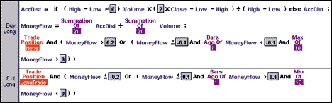
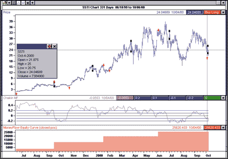
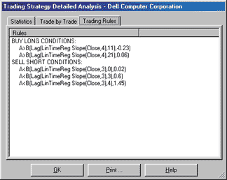
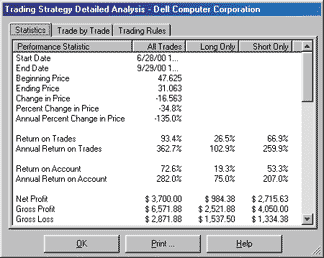
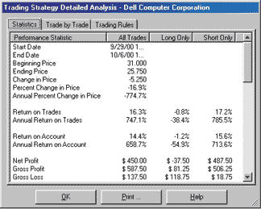
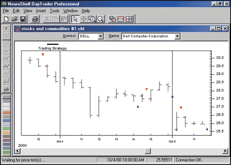

# Traders' Tips: December 2000

- **Article:** Phasor Displays by John F. Ehlers
- **Traders' Tips URL:** [Traders' Tips, December 2000](https://www.traders.com/Documentation/FEEDbk_docs/2000/12/TradersTips/TradersTips.html)

---

## MetaStock: December 2000

The function, system, and indicator introduced in the article "Optimizing With Hilbert Indicators" by Roger Darley and the Traders' Tip "Refining The Hilbert Indicator" by John Ehlers, both of which appeared in the November 2000 STOCKS & COMMODITIES, can be created in MetaStock 7.0 or higher with the use of the new MetaStock External Function (MSX) DLL interface. The C++ code and MetaStock formula code is shown below.

### MSX DLL C++ Code

```cpp
// Main Calculation loop (begins after the fifth valid bar)
for( l_iCurrentBar = a_iFirstValid + 5; l_iCurrentBar <= a_iLastValid; l_iCurrentBar++ )
{
        // Set Previous Bar counter
l_iPreviousBar = l_iCurrentBar - 1;

        // Calculate Smoother and Detrender values
l_pdSmoother[l_iCurrentBar] = (4 * a_pfPrice[l_iCurrentBar] + 3 * a_pfPrice[l_iPreviousBar] + 2 *
    a_pfPrice[l_iCurrentBar - 2] + a_pfPrice[l_iCurrentBar - 3])/10;
l_pdDetrender[l_iCurrentBar] = (.25 * l_pdSmoother[l_iCurrentBar] + .75 * l_pdSmoother[l_iCurrentBar -
    2] - .75 * l_pdSmoother[l_iCurrentBar - 4] - .25 * l_pdSmoother[l_iCurrentBar - 6]) *
    double(.046f * a_pfPeriod[l_iPreviousBar] + .332f);

        // Calculate InPhase and Quadrature components
l_pd_Q1[l_iCurrentBar] = (.25 * l_pdDetrender[l_iCurrentBar] + .75 * l_pdDetrender[l_iCurrentBar - 2] -
    .75 * l_pdDetrender[l_iCurrentBar - 4] - .25 * l_pdDetrender[l_iCurrentBar - 6]) * double(.046f *
    a_pfPeriod[l_iPreviousBar] + .332f);
l_pd_I1[l_iCurrentBar] = l_pdDetrender[l_iCurrentBar - 3];

        // Advance the phase of l_pd_I1 and l_pd_Q1 by 90 degrees
l_pd_jI[l_iCurrentBar] = .25 * l_pd_I1[l_iCurrentBar] + .75 * l_pd_I1[l_iCurrentBar - 2] - .75 *
l_pd_I1[l_iCurrentBar - 4] - .25 * l_pd_I1[l_iCurrentBar - 6];
l_pd_jQ[l_iCurrentBar] = .25 * l_pd_Q1[l_iCurrentBar] + .75 * l_pd_Q1[l_iCurrentBar - 2] - .75 *
    l_pd_Q1[l_iCurrentBar - 4] -.25 * l_pd_Q1[l_iCurrentBar - 6];

        // Phasor addition to equalize amplitude due to quadrature 
        // calculations (and 3 bar averaging)
l_pd_I2[l_iCurrentBar] = l_pd_I1[l_iCurrentBar] - l_pd_jQ[l_iCurrentBar];
l_pd_Q2[l_iCurrentBar] = l_pd_Q1[l_iCurrentBar] + l_pd_jI[l_iCurrentBar];

        // Smooth I and Q components before applying the discriminator
l_pd_I2[l_iCurrentBar] = ForceFloatRange (.15 * l_pd_I2[l_iCurrentBar] + .85 * l_pd_I2[l_iPreviousBar]);
l_pd_Q2[l_iCurrentBar] = ForceFloatRange (.15 * l_pd_Q2[l_iCurrentBar] + .85 * l_pd_Q2[l_iPreviousBar]);

        // Homodyne Discriminator; Complex Conjugate Multiply
l_pd_X1[l_iCurrentBar] = l_pd_I2[l_iCurrentBar] * l_pd_I2[l_iPreviousBar];
l_pd_X2[l_iCurrentBar] = l_pd_I2[l_iCurrentBar] * l_pd_Q2[l_iPreviousBar];
l_pd_Y1[l_iCurrentBar] = l_pd_Q2[l_iCurrentBar] * l_pd_Q2[l_iPreviousBar];
l_pd_Y2[l_iCurrentBar] = l_pd_Q2[l_iCurrentBar] * l_pd_I2[l_iPreviousBar];
l_pd_Re[l_iCurrentBar] = l_pd_X1[l_iCurrentBar] + l_pd_Y1[l_iCurrentBar];
l_pd_Im[l_iCurrentBar] = l_pd_X2[l_iCurrentBar] - l_pd_Y2[l_iCurrentBar];

        // Smooth to remove any undesired cross products
l_pd_Re[l_iCurrentBar] = ForceFloatRange (.2 * l_pd_Re[l_iCurrentBar] + .8 * l_pd_Re[l_iPreviousBar]);
l_pd_Im[l_iCurrentBar] = ForceFloatRange (.2 * l_pd_Im[l_iCurrentBar] + .8 * l_pd_Im[l_iPreviousBar]);
                        
        // Compute Cycle Period
        if (l_pd_Im[l_iCurrentBar] != 0 && l_pd_Re[l_iCurrentBar] != 0)
a_pfPeriod[l_iCurrentBar] = float (ForceFloatRange (360 / (atan(l_pd_Im[l_iCurrentBar] /
    l_pd_Re[l_iCurrentBar] ) * (180.0 / PI))));
        if (a_pfPeriod[l_iCurrentBar] > 1.5f *a_pfPeriod[l_iPreviousBar])
a_pfPeriod[l_iCurrentBar] = 1.5f * a_pfPeriod[l_iPreviousBar];
        if (a_pfPeriod[l_iCurrentBar] < .67f *a_pfPeriod[l_iPreviousBar])
a_pfPeriod[l_iCurrentBar] = .67f * a_pfPeriod[l_iPreviousBar];
        if (a_pfPeriod[l_iCurrentBar] < 6 )
                a_pfPeriod[l_iCurrentBar] = 6;
        if ( a_pfPeriod[l_iCurrentBar] > 50 )
                a_pfPeriod[l_iCurrentBar] = 50;
a_pfPeriod[l_iCurrentBar] = .2f * a_pfPeriod[l_iCurrentBar] + .8f * a_pfPeriod[l_iPreviousBar];
}
```

### Hilbert Channel Breakout Indicator

```metastock
entryk:=Input("Entry K", 0, 1, 0);
entryval:=Input("Entry val", 0, 100, 0);
exitk:= Input("Exit K", 0, 4.5, 0);
exitval:=Input("Entry val", 0, 100, 0);

ExtFml( "EnhancedHilbert.ChannelHigh", (HIGH+LOW)/2, entryk, entryval);
ExtFml( "EnhancedHilbert.ChannelLow", (HIGH+LOW)/2, exitk, exitval)
```

### Hilbert Channel Breakout Signal

```metastock
Enter Long:
H > ExtFml( "EnhancedHilbert.ChannelHigh",(HIGH+LOW)/2, 0, 15)

Enter Short:
L < ExtFml( "EnhancedHilbert.ChannelLow",(HIGH+LOW)/2, 0, 15)
```

## Byte Into The Market: December 2000

This month, we'll present a system based on ideas given in the article "Chaikin's Money Flow," which appeared in the August 2000 STOCKS & COMMODITIES.


**FIGURE 1: BYTE INTO THE MARKET, CODE FOR MONEY FLOW CHARTS.**

This version of the system is very simple (Figure 1). The system transacts end of day (close or next open). Buy signals are generated whenever no trade position exists and either:

1. Money flow exceeds 0.2, or
2. Money flow crosses above a level of -0.1 after falling below this level, and either having been above zero within the prior nine bars or exceeding zero this bar (maximum of the most recent 10 bars is above zero).

Exit signals are generated when a long position exists and either:

1. Money flow crosses below -0.2, or
2. Money flow crosses below a level of 0.1 after rising above this level, and either having been below zero within the prior nine bars or falling below zero this bar (minimum of the most recent 100 bars is below zero).

One possible avenue for investigation on how to improve the system would be to consider variation from bar to bar on the basic 0.1 and 0.2 magnitude levels used in the entry and exit rules. Another possibility would be the incorporation of some detection of price versus money flow divergence in the system, as was suggested in the August article.


**FIGURE 2: BYTE INTO THE MARKET, CHARTS GENERATED FROM TEMPLATE.** Charts generated from the template include charted system signals, money flow with the levels triggering signals, and a charted equity curve.

The system, as well as a chart template for analysis of the system signals, is available in a downloadable file from https://www.tarnsoft.com/moneyflow.zip.

--Tom Kohl, Tarn Software, 303 794-4184, bitm@tarnsoft.com, https://www.tarnsoft.com

## NeuroShell DayTrader Professional: December 2000

This month, we'll explore how to simulate human pattern-recognition with the use of neural networks.

Many expert technical traders make position decisions based upon trendlines placed through recent segments of the price curve. For many experienced traders, these trendlines don't even need to be drawn. The human brain is capable of superimposing imaginary trendlines through price curves and then subconsciously comparing these trendlines to trendlines from previous situations.

Those of us who are not expert technical traders lack the years of experience watching price movements. Our brains are not capable of placing these trendlines in the proper positions of the price curve, and have a limited database of previous trendline patterns with which to compare. However, some simple regression indicators combined with a powerful genetic algorithm optimizer can do the job for us.

NeuroShell DayTrader Professional contains several types of linear regression indicators. One type is capable of placing imaginary line segments through various parts of a price curve and then reporting the slopes (angles) of these lines. A particular set of angles forms a pattern that can then be compared to future patterns to make trading decisions.

But where should trendlines be placed and how long should they be? Genetic algorithms are great for figuring that out because of their ability to simultaneously optimize many variables. In our pattern recognition task, we'd like to find the optimal:

1. Number of trendlines to place on recent data,
2. Lengths of the trendlines in bars,
3. Time, in bars, prior to the current bar at which each trendline begins, and
4. The angles of the trendlines

all based on maximizing profit or any one of a number of other objective functions.

In NeuroShell DayTrader, we loaded a chart of Dell using 30-minute bars. We then inserted a trading strategy with a number of long entry rules, which, in plain English, were, "Buy long when the slope of a line of length *x*, placed *y* bars back, exceeds angle *z*."

The genetic algorithm was instructed to find the proper number of these rules that should be true before a long order is placed, as well as the optimal settings for *x*, *y*, and *z* of each rule. Note it is possible and even desirable for trendlines to overlap.

The genetic algorithm was also given a set of short entry rules, which were optimized with the long entry rules to create a total "reversal" trading strategy optimal for an issue over a given period. The short rules looked for slopes below a particular angle.

Appropriately, NeuroShell DayTrader is set up to optimize over an earlier in-sample period and then backtest over a later out-of-sample period. We compared both the in-sample optimization period results and the out-of-sample backtest period results with the results from a buy-and-hold strategy.


**FIGURE 3: OPTIMAL TRADING RULES.**


**FIGURE 4: NEUROSHELL IN-SAMPLE PERIOD RESULTS.**


**FIGURE 5: NEUROSHELL OUT-OF-SAMPLE RESULTS.**

Interestingly, the pattern recognition strategy correctly anticipated the sudden earnings-related drop in Dell between October 4 and 5 and went short on October 4 (Figure 6).


**FIGURE 6: NEUROSHELL, PATTERN RECOGNITION STRATEGY.**

In this trading strategy, we utilized only traditional indicator threshold rules. We did *not* use a neural network, although we often do feed similar optimized regression slopes into neural networks in NeuroShell DayTrader in order to make trading strategies from neural predictions. We always make use of NeuroShell DayTrader's ability to do "walk forward" out-of-sample testing, giving us a reasonable indication that the model can generalize into the future.

--Marge Sherald, Ward Systems Group, Inc., 301 662-7950, sales@wardsystems.com, https://www.neuroshell.com

---

## BibTeX

```bibtex
@misc{traders_tips_2000_12,
  author       = {{Technical Analysis of STOCKS \& COMMODITIES}},
  title        = {Traders' Tips: Phasor Displays by John F. Ehlers},
  year         = {2000},
  month        = dec,
  howpublished = {online},
  url          = {https://www.traders.com/Documentation/FEEDbk_docs/2000/12/TradersTips/TradersTips.html}
}
```
