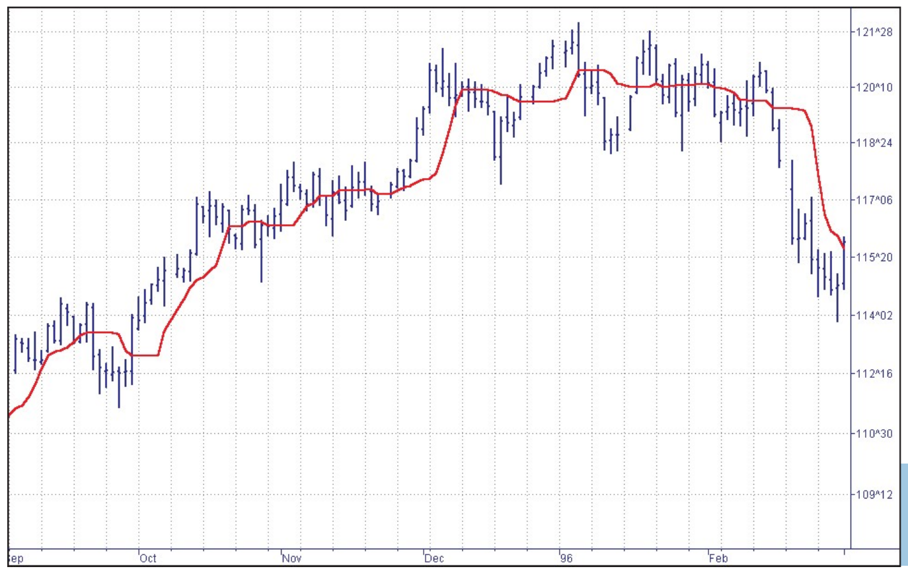
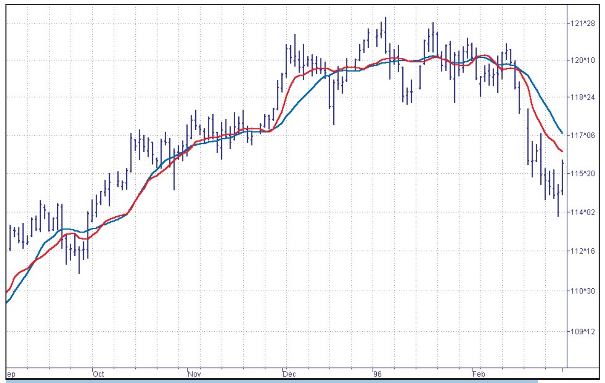
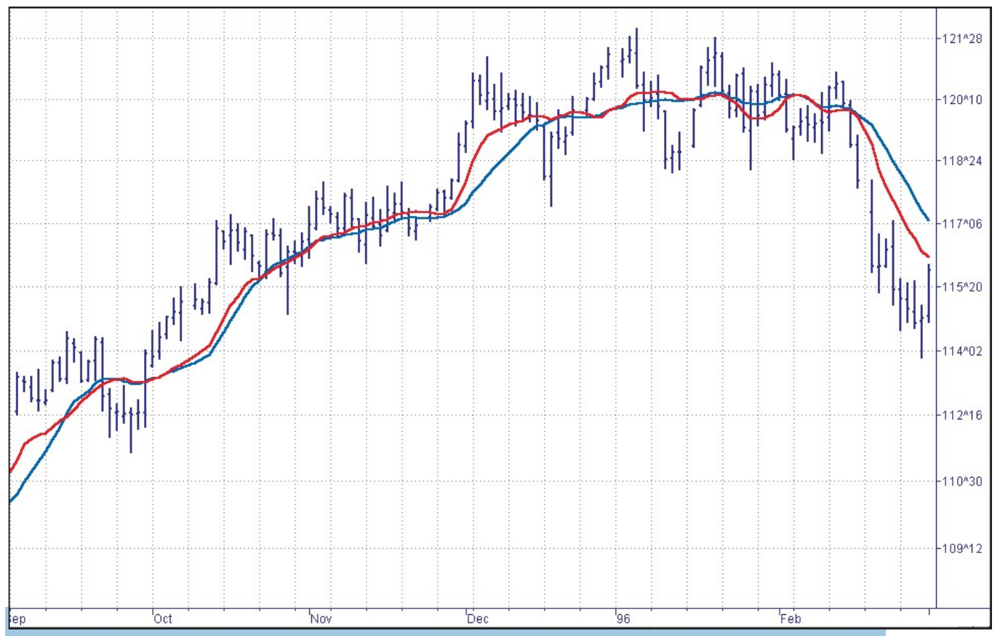
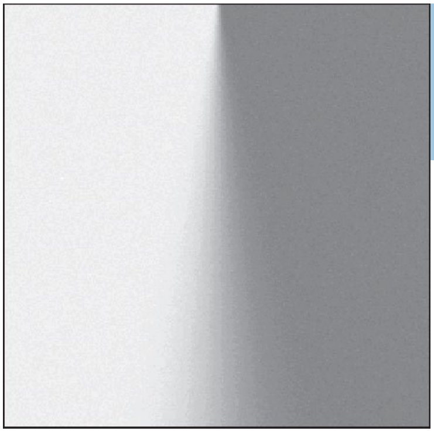
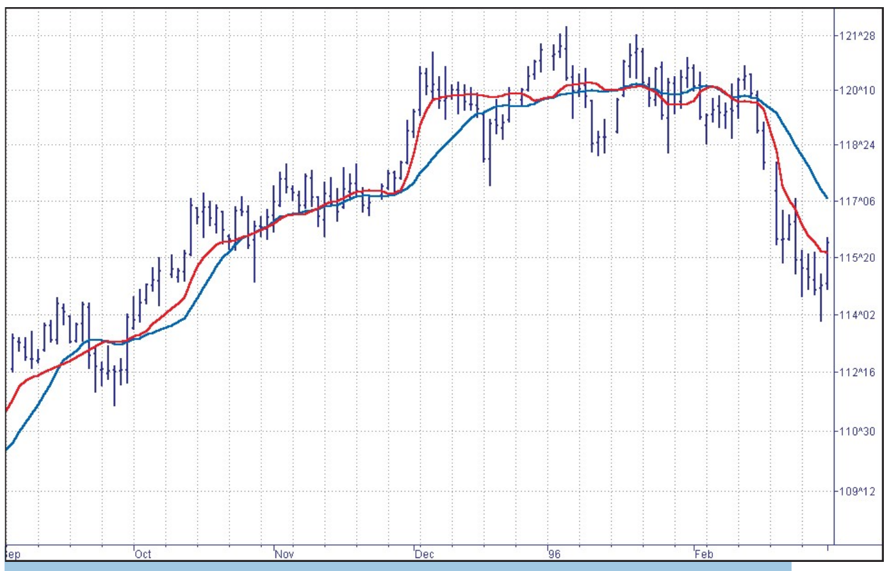

# Nonlinear Ehlers Filters

- **Author:** John F. Ehlers
- **Publication:** Technical Analysis of STOCKS & COMMODITIES, Volume 19, April 2001, pp. 25--34
- **Article URL:** [Article PDF](https://technical.traders.com/archive/article.asp?file=\V19\C09\099MESA.pdf)
- **Traders' Tips URL:** [Traders' Tips, April 2001](https://www.traders.com/Documentation/FEEDbk_docs/2001/04/TradersTips/TradersTips.html)

---

*Linear filters like moving averages are great for slow, "stationary" data. Unfortunately, prices aren't slow or stationary.*

The most common filters that traders use are moving averages — either simple moving averages (SMA) or exponential moving averages (EMA). These are linear filters. Linear filters are best for smoothing stationary, slowly varying signals that are corrupted with high-frequency noise. In this instance, "stationary" means that the rules that dictate the underlying process do not change and remain stable; the underlying process that generates prices doesn't change. Unfortunately, price data is not stationary most of the time.

An example of a statistically stationary process is the classic coin-flip experiment; the nature of the coin flip never changes. However, if weighted coins were randomly introduced into the experiment, the statistics of the experiment would then depend on which coin is used, and therefore the results would become nonstationary.

The signals you deal with every day often can be described statistically. For example, human speech has noise-like statistics. The speech process is nonstationary because it changes from moment to moment. Even though speech has noise-like characteristics, it obviously carries information. Price data resembles speech in statistical characteristics; it is both noise-like and nonstationary.

One of the main problems you encounter in trading when using technical analysis is that you must attempt to restore signals that often are nonstationary and also corrupted by noise. When dealing with nonstationary signals with sharp transitions or when dealing with impulsive noise, linear filtering techniques give poor results.

## Nonlinear Filters

The filters I have devised are nonlinear finite impulse response (FIR) filters. (See sidebar "Two types of filters.") These filters provide extraordinary smoothing in sideways markets and aggressively follow major price movements with minimal lag.

The development of my filters started with a general class of FIR filters called order statistic (OS) filters. In contrast to linear filters, where sensitivity to time is necessary, OS filters are based on the ranking of the samples within the filter window. The OS filter ranking is based on summary statistics, such as mean or variance, rather than by position in time.

Among OS filters, the *median* filter is the best known. Median filters are used in video circuits to sharpen the edges of images and to remove impulsive noise. In a median filter, the output is the median value of all the values within the observation window. As opposed to an averaging filter, which stores all the data in its "output" or average, the median filter discards all data except the median value. In this way, the median filter eliminates impulsive noise spikes and extreme price data rather than include either in the average.

Time-sensitive characteristics of the median filter are lost because the median value can fall at any time. For example, if the data inputs to a five-bar FIR filter are, sequentially,

$$[3\ 4\ 3\ 3\ 9]$$

the median value is 4. This median is neither the average value (which is 4.4) nor the value at the center of the filter (which is 3). In this case, the big data spike value of 9 is ignored. As another example, if the data inputs were

$$[3\ 3\ 8\ 9\ 9]$$

the median value would be 8, as opposed to the average value of 6.4.

A nonlinear, median filter tends to smooth out short-term variations that lead to whipsaw trades using linear filters. On the other hand, the lag of a median filter in response to a sharp and sustained price movement can be substantial; it is by necessity about half the filter window width. The response of a median filter with a 10-bar window width can be seen in Figure 1. Note that the filter did not respond to small price movements in October/November, nor in January/February. That eliminated several potential whipsaw trades that would have been produced by linear filters.


**FIGURE 1: RESPONSE TIME.** A median filter does well in ranges but is slow to react to dramatic price changes.

## Computation

Finding the median value is a simple sorting problem. You only need to list the data samples within the filter width in order of their sizes and pick the value that has an equal number of values above and below it. If there is no center value, you can compute the average of the two middle values. Median filters typically have high-frequency jiggles that can be smoothed by taking a subsequent exponential moving average of the median filter data.

My filter has a formulation similar to that of a finite impulse response (FIR) filter. If $y$ is the filter's output or result and $x_i$ is the $i^{th}$ input across a filter window width $n$, then the equation is:

$$y = c_1 x_1 + c_2 x_2 + c_3 x_3 + c_4 x_4 + \ldots + c_n x_n$$

The $c$ is the coefficient that contains the statistic in which you are interested — momentum, relative strength index (RSI), stochastic, you name it. As an example, a classic front-weighted moving average might use:

$$Y = (4 \times Price_{today} + 3 \times Price_{yesterday} + 2 \times Price_{two\ days\ ago} + 1 \times Price_{three\ days\ ago}) / 10$$

This weighted moving average has each coefficient normalized to the sum of the coefficients — that is, $4 + 3 + 2 + 1 = 10$ and $10/10 = 1$. This normalization keeps the average's scale the same as the price on your charts. But how would you normalize a momentum? If you were interested in a five-bar momentum, each coefficient, $c$, would be:

$$Price_{this\ bar} - Price_{5\ bars\ back}$$

The answer is to normalize all of the coefficients to their sum, just as you did for the weighted moving average.

Therefore, the complete formal description of the nonlinear filter is the summation of the product of the filter coefficient and the price at each sample divided by the summation of the coefficients as:

$$y = \frac{\sum_{i=1}^{n} c_i x_i}{\sum_{i=1}^{n} c_i}$$

The statistic used in the nonlinear filters should be detrended for maximum effectiveness. If you do not detrend the statistic, each of the coefficients may have a large common term relative to any differences between them. For example, if a five-bar filter has a statistic with values such as

$$[-1\ -2\ 0\ 2\ 1]$$

the statistic has no common term, and there is a large percentage change between positions within the filter. However, if the statistic has values such as

$$[99\ 98\ 100\ 102\ 101]$$

the coefficients have a common term of 100, although the difference between coefficients is the same as in the first example. In this latter case, there is only a small percentage difference between the coefficients and the filter would have performance virtually indistinguishable from a simple moving average.

The EasyLanguage code and an Excel model for the nonlinear filter are given in Traders' Tips in this issue for the particular example of a five-bar momentum.

Figure 2 illustrates the fact that the momentum-derived nonlinear filter — the red line — responds quickly to rapid price movements while rejecting minor price movements to a greater degree. (The blue line is a comparable moving average.) This kind of filter can be used to respond quickly to changes in trend direction without producing the whipsaws that are so prevalent when linear filters are employed. This nonlinear, momentum-based filter can be made to be very aggressive by squaring each coefficient.


**FIGURE 2: PERFORMANCE.** A momentum plopped into a nonlinear filter responds well to sharp movements without a great deal of dithering in ranges.

## Other Ideas

The flexibility of my nonlinear filters — you can insert just about any analytic construct into one — opens up new avenues of technical analysis research. For example, the statistic can be some tangible parameter of market activity such as money flow or volume. On the other hand, more arcane parameters such as signal-to-noise ratio can be used as the statistic. The coefficients where the signal-to-noise ratio is the greatest would have the largest weight, discounting the price data values where the signal-to-noise ratio is less. In addition, my nonlinear filters can be adaptive. The length of the five-bar momentum filter in our example could be made adaptive to the length of the measured cycle period. Such a filter would be both adaptive and nonlinear.

For example, in Figure 3, the statistic used is the difference between the current price and the previously calculated value of the filter. This has some aspects not of a finite impulse response filter, but an infinite one.


**FIGURE 3: INCORPORATING A DIFFERENCE.** This version of the nonlinear filter uses the difference between the current price and the previous value of the filter.

## Thinking About the FIR Filter

Why derive the finite impulse response filter type at all? By so doing, you may discover an optimum solution for the coefficient calculation. We know market data is most often nonstationary. We also know that you want to follow the sharp and sustained movements of price as closely as possible. Just this desire led video engineers to devise the median filter as an edge detector, to clarify video images. But not all edges are the same.

You can visualize the sharpness of edges by imagining Figure 4 as a piece of paper draped over the edge of a table. The edge at the top of Figure 4 is very sharp, as if the paper were creased. As you continue to look down at Figure 4, the light diffusion becomes more dispersed, giving the illusion that the edge becomes more rounded.


**FIGURE 4: VIDEO.** Just as traders must discern the difference between noise and trend inception, video engineers must discern the difference between gray and white in video images.

If you consider the gray shading levels in Figure 5 as distances from the centerline, you can compute filter coefficients in terms of edge sharpness. White is the maximum distance in one direction from the median and black is the maximum distance in the other direction. Thus, distance is a measure of departure from the edge, taking into account the edge sharpness.

Now, thinking of price charts, imagine the difference in prices as a distance, but in two dimensions. The "length" for any data sample is the square root of the sum of the squares of the price difference between that price and each of the prices back for the length of the filter window. The sum of the distances squared at each data point are the coefficients of the nonlinear filter. (I use the sum of the squares rather than the square root of the sum of the squares to heighten the filter response.)

Suppose the last 10 data values were

$$[1\ 1\ 1\ 1\ 1\ 1\ 2\ 3\ 4\ 5]$$

The coefficients of a nonlinear filter, at the end of the last period, would then be calculated as:

$$C_1 = (5-4)^2 + (5-3)^2 + (5-2)^2 + (5-1)^2 + (5-1)^2 = 1+4+9+16+16 = 46$$

$$C_2 = (4-3)^2 + (4-2)^2 + (4-2)^2 + (4-1)^2 + (4-1)^2 = 1+4+4+9+9 = 32$$  [sic: should be 1+4+9+9+9=32 — see note]

$$C_3 = (3-2)^2 + (3-1)^2 + (3-1)^2 + (3-1)^2 + (3-1)^2 = 1+4+4+4+4 = 17$$

$$C_4 = (2-1)^2 + (2-1)^2 + (2-1)^2 + (2-1)^2 + (2-1)^2 = 1+1+1+1+1 = 5$$

$$C_5 = (1-1)^2 + (1-1)^2 + (1-1)^2 + (1-1)^2 + (1-1)^2 = 0+0+0+0+0 = 0$$

The calculation of the distance-like coefficients is shown in the EasyLanguage code and Excel model for the filter in Traders' Tips' "EasyLanguage code for the distance coefficient of a nonlinear filter." If the difference of prices across the filter observation window are the same, then the coefficients of the filter are all the same and you have the equivalent of a simple moving average (SMA). On the other hand, if the prices shift rapidly, the distances from the increased price points increase, and higher weights are given to these filter coefficients. The performance of the distance coefficient nonlinear filter can be seen in Figure 5.


**FIGURE 5: HIGHLY RESPONSIVE.** Coefficients are computed as the sum of the squares of price differences across the filter span.

The filter coefficients can be made to be even more nonlinear. For example, the distance can be cubed or raised to the fourth power (by squaring the squared distance). A reciprocal Gaussian response is an even more nonlinear function of distance than you can use to calculate the filter coefficients. These more nonlinear responses follow the edges in price movement more aggressively. However, the fact that they are so nonlinear removes much of the gray area in the response.

The most nonlinear calculations produce results that are not discernible from median filters. The coefficients become black and white, so there is very little middle-ground gray area.

Like order statistic (OS) filters, nonlinear filters are robust. Moreover, they also exploit both the rank-order and the time-sensitive characteristics of the data. The generalized nonlinear filter can be oriented to any statistic you choose, making the coefficients easy to calculate. The most obvious statistic to use is price momentum, because this data enables the nonlinear filter to rapidly follow price changes.

The choice of statistic used is virtually limitless. For example, the filter could be nonlinear with respect to acceleration (the rate change of momentum), signal-to-noise ratio, volume, money flow (delta price times volume), and so on. Even other indicators such as stochastic or RSI can be used as a statistic.

## Two Types of Filters

There are two basic kinds of filters: finite impulse response (FIR) filters and infinite impulse response (IIR) filters. An FIR is referred to as finite because it only responds to prices within the period (the "window") of the filter (usually, an average of some kind). An IIR, such as an exponential moving average, retains data through its averaging process from all periods of its calculation. Theoretically, at least, that could be an infinite amount of data.

For example, say you have 9 sequential values: 1, 2, 3, . . . 9. On the last period, the seven-period simple average will be $(3+4+5+6+7+8+9)/7 = 6$. The only values that went into the calculation were those in the filter's window: the last seven numbers in the sequence.

An exponential moving average (EMA) of equivalent length would be formulated as:

$$EMA_{today} = alpha \times price_{today} + (1 - alpha) \times EMA_{previous}$$

Every time you calculate the EMA, you use its previous value, thus, in effect, retaining some portion of the previous prices. Here's what would happen:

| Value | EMA | Computation |
|-------|------|-------------|
| 1 | — | Period 1 |
| 2 | 1.250 | (0.25 × 2) + (0.75 × 1) |
| 3 | 1.687 | (0.25 × 3) + (0.75 × 1.250) |
| 4 | 2.266 | (0.25 × 4) + (0.75 × 1.687) |
| 5 | 2.949 | (0.25 × 5) + (0.75 × 2.266) |
| 6 | 3.712 | (0.25 × 6) + (0.75 × 2.949) |
| 7 | 4.534 | (0.25 × 7) + (0.75 × 3.712) |
| 8 | 5.400 | (0.25 × 8) + (0.75 × 4.534) |
| 9 | 6.300 | (0.25 × 9) + (0.75 × 5.400) |

When a price is applied to an IIR filter such as an exponential moving average, a portion of the first output is fed back to the input and added to the next data input sample. Because this calculation is iterative, the effects of the impulse are theoretically present in the output indefinitely — hence the name "infinite impulse response."

When the impulse is applied to the input of an FIR filter — an SMA, for example — the effects of the impulse will be present in the filter output only over the length of the filter, and the output will be zero otherwise — hence the name "finite impulse response."

Perry Kaufman, Tushar Chande, as well as others (see sidebar "Adaptive averages") have designed nonlinear IIR filters to better smooth market data. Their basic approach is to craft a volatility-adjusted value for the alpha parameter in an EMA. These are certainly workable approaches, but their effectiveness is constrained by the opposing requirements of providing adequate smoothing while vigorously attacking major price movements.

## Adaptive Averages

### Kaufman's Adaptive Moving Average (KAMA)

Perry J. Kaufman's adaptive moving average (KAMA) is based on the concept that a noisy market requires a slower trend than one with less noise. The basic principle is that the trendline must lag further behind the price in a relatively noisy market to avoid being penetrated by the price. The moving average can speed up when the prices move consistently in one direction.

According to Kaufman, who invented the system, KAMA is intended to use the fastest trend possible, based on the smallest calculation period for the existing market conditions. It does so by changing the alpha of the exponential moving average with each new sample. The equation for KAMA is:

$$KAMA = S \times Price + (1 - S) \times KAMA[1]$$

Where $S$ = Smoothing factor. This is the same equation that is used for the EMA, except the variable $S$ replaces the alpha constant of the EMA.

The equation for the smoothing factor involves two boundaries and an efficiency ratio:

$$S = (E \times (fastest - slowest) + slowest)^2$$

"Fastest" means the alpha of the shortest period used. "Slowest" means the alpha of the longest period used. The suggested period boundaries are two and 30 bars. In this case, the two alphas are:

$$Fastest = 2/(2+1) = 0.6667$$

$$Slowest = 2/(30+1) = 0.0645$$

Simplifying the equation for the smoothing factor, we get:

$$S = (0.6022 \times E + 0.0645)^2$$

The efficiency ratio ($E$) is the absolute value of the difference of price across the calculation span divided by the sum of the absolute value of the individual price differences across the calculation span. The equation for $E$ is:

$$E = \frac{\sum |Price - Price[N]|}{N \sum_{i=0} |Price[i] - Price[i+1]|}$$

The default value for $N$ is 10. However, testing to find the best length is advisable.

### Chande's Variable Index Dynamic Average (VIDYA)

Tushar Chande's variable index dynamic average (VIDYA) uses a fixed pivotal smoothing constant. The suggested value of this constant is 0.2, corresponding to the alpha of a nine-day EMA. The equation for VIDYA is:

$$VIDYA = 0.2 \times k \times Close + (1 - 0.2 \times k) \times VIDYA[1]$$

Again, this is the same equation as for an EMA, except the relative volatility term, $k$, has been included to introduce the nonlinearity. The volatility term is the ratio of the standard deviation of closes over the last $n$ days to the standard deviation of closes over the last $m$ days, where $m$ is greater than $n$. Suggested values are $n = 9$ and $m = 30$.

## About the Author

John Ehlers is president of MESA Software and a frequent contributor to STOCKS & COMMODITIES. This article was adapted from *Rocket Science For Traders*, published by John Wiley & Sons in 2001.

## Related Reading

- Chande, Tushar [1997]. *Beyond Technical Analysis: How To Develop And Implement A Winning Trading System*, John Wiley & Sons.
- Chande, Tushar, and Stanley Kroll [1994]. *The New Technical Trader*, John Wiley & Sons.
- Ehlers, John F. [2001]. *Rocket Science For Traders*, John Wiley & Sons.
- Ehlers, John F. [2000]. "Adaptive Trends And Oscillators," Technical Analysis of STOCKS & COMMODITIES, Volume 18: May.
- Ehlers, John F. [2000]. "Phasor Displays," Technical Analysis of STOCKS & COMMODITIES, Volume 18: December.
- Ehlers, John F. [2000]. "Squelch Those Whipsaws," Technical Analysis of STOCKS & COMMODITIES, Volume 18: September.
- Kaufman, Perry J. [1998]. *The New Commodity Trading Systems and Methods*, 3d edition, John Wiley & Sons.

---

## BibTeX

```bibtex
@article{ehlers_nonlinear_filters_2001,
  author    = {Ehlers, John F.},
  title     = {Nonlinear Ehlers Filters},
  journal   = {Technical Analysis of STOCKS \& COMMODITIES},
  volume    = {19},
  number    = {4},
  pages     = {25--34},
  year      = {2001},
  month     = apr,
  howpublished = {online},
  url       = {https://technical.traders.com/archive/article.asp?file=\V19\C09\099MESA.pdf}
}

@misc{traders_tips_2001_04,
  author       = {{Technical Analysis of STOCKS \& COMMODITIES}},
  title        = {Traders' Tips: Nonlinear Ehlers Filters},
  year         = {2001},
  month        = apr,
  howpublished = {online},
  url          = {https://www.traders.com/Documentation/FEEDbk_docs/2001/04/TradersTips/TradersTips.html}
}
```
