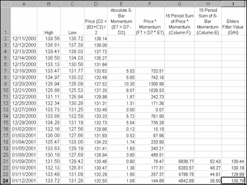
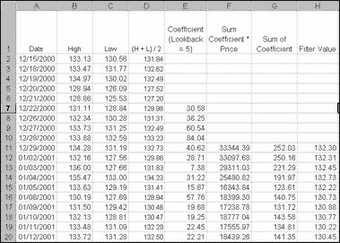
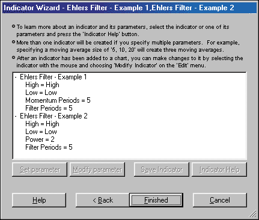
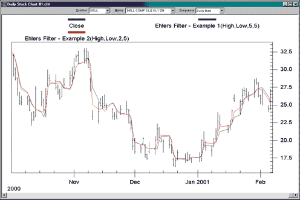
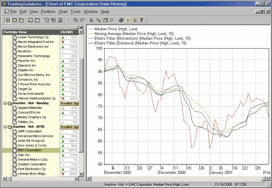
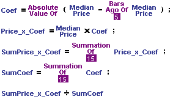
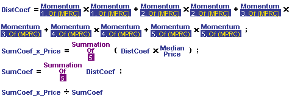
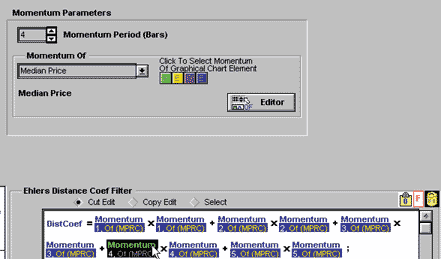

# Traders' Tips: April 2001

- **Article:** Nonlinear Ehlers Filters by John F. Ehlers
- **Traders' Tips URL:** [Traders' Tips, April 2001](https://www.traders.com/Documentation/FEEDbk_docs/2001/04/TradersTips/TradersTips.html)

---

## TradeStation EasyLanguage: Momentum Coefficient

In the first calculation, you find each coefficient in the filter as the five-bar momentum. The next computation is to sum the numerator as the product of each coefficient and the price (the median price in this case). The filter output is the sum of the numerator divided by the sum of the coefficients.

```easylanguage
Inputs: Price((H+L)/2), Length(15);
Vars: count(0), SumCoef(0), Num(0), Filt(0);
Array: Coef[25](0);

{Coefficients can be computed using any statistic of choice ----
 ---- a five-bar momentum is used as an example}

For count = 0 to Length - 1 begin
        Coef[count] = AbsValue(Price[count] - Price[Count + 5]);
 {The line above is all that needs to be changed to use other statistics.
  For example:  Coef[count]=AbsValue(Price[count]-Filt[count+1]);}
end;

{Sum across the numerator and denominator}
Num = 0;
SumCoef = 0;
For count = 0 to Length - 1 begin
        Num = Num + Coef[count]*Price[count];
        SumCoef = SumCoef + Coef[count];
end;
If SumCoef <> 0 then Filt = Num / SumCoef;
Plot1(Filt,"Ehlers");
```

External file: [NEF_momentum.els](NEF_momentum.els)

## TradeStation EasyLanguage: Distance Coefficient

To derive the distance coefficient Ehlers filter, which is also described in Ehlers's article, the Coef input value in the following EasyLanguage can be replaced with `DistanceSqrd( MedianPrice, 15 )`.

```easylanguage
Inputs: Price((H+L)/2),
        Length(15);

Vars:   count(0),
        LookBack(0),
        SumCoef(0),
        Num(0),
        Filt(0);

Array:  Coef[25](0),
        Distance2[25](0);

For count = 0 to Length - 1 begin
    Distance2[count] = 0;
    For LookBack = 1 to Length begin
        Distance2[count] = Distance2[count] + (Price[count] - Price[count
         + LookBack])*(Price[count] - Price[count + LookBack]);
    end;
    Coef[count] = Distance2[count];
end;
Num = 0;
SumCoef = 0;
For count = 0 to Length - 1 begin
    Num = Num + Coef[count]*Price[count];
    SumCoef = SumCoef + Coef[count];
end;
If SumCoef <> 0 then Filt = Num / SumCoef;
Plot1(Filt, "Ehlers");
```

External file: [NEF_distance.els](NEF_distance.els)

### Excel Formulas

```
E7 = (D7-D6)^2+(D7-D5)^2+(D7-D4)^2+(D7-D3)^2+(D7-D2)^2
F11 =D7*E7+D8*E8+D9*E9+D10*E10+D11*E11
G11 =SUM(E7:E11)
H11 =F11/G11
```

## TradeStation EasyLanguage: Indicator

In the following EasyLanguage indicator code, the Coef input is set to `AbsValue( MedianPrice - MedianPrice[5] )`, and the price input is set to MedianPrice.

```easylanguage
nputs:
        Coef( AbsValue( MedianPrice - MedianPrice[5] ) ), 
        Price( MedianPrice ), 
        Length( 15 ) ;

variables:
        Num( 0 ), 
        SumCoef( 0 ), 
        Count( 0 ), 
        Filt( 0 ) ;

Num = 0 ;
SumCoef = 0 ;

for Count = 0 to Length - 1
        begin
        Num = Num + Coef[Count] * Price[Count] ;
        SumCoef = SumCoef + Coef[Count] ;
        end ;

if SumCoef <> 0 then 
        Filt = Num / SumCoef ;

Plot1( Filt, "Ehlers" ) ;
```

External file: [NEF_indicator.els](NEF_indicator.els)

### Distance Squared Function

```easylanguage
inputs:
        Price( numericseries ), 
        Length( numericsimple ) ;

variables:
        DSqrd( 0 ), 
        LookBack( 0 ) ;

DSqrd = 0 ;
for LookBack = 1 to Length
        begin
        DSqrd = DSqrd + Square( Price - Price[LookBack] ) ;
        end ;
DistanceSqrd = DSqrd ;
```

External file: [NEF_distance_func.els](NEF_distance_func.els)


**FIGURE 1: TRADESTATION.** Momentum coefficient nonlinear Ehlers filter.


**FIGURE 2: TRADESTATION.** Distance coefficient nonlinear Ehlers filter.

## MetaStock for Windows

```metastock
Name: Ehlers Filters
Formula:
ti:= 15;
pr:= MP();
coef:= Abs(pr - Ref(pr,-5));

Sum(coef*pr,ti)/Sum(coef,ti)

Name: Distant Coefficient Ehlers Filter
Formula:
ti:= 15;
pr:= MP();
coef:=Sum(Power(Ref(LastValue(pr+PREV-PREV)-pr,-1),2),ti);

Sum(coef*pr,ti)/Sum(coef,ti)
```

External file: [NEF.mss](NEF.mss)

## NeuroShell Trader

However, we wanted to show you how easy it is to implement the Ehlers filter in NeuroShell Trader. To do so, select "New Indicator..." from the Insert menu and follow these steps:

1. Select the volume-weighted moving average from the Volume Weighted Moving Average category.
2. Fill in the parameters as follows:

```
VolWgtMovAvg(X, Y, 5)

where:
X = The time series you wish to filter
     [Ehlers uses (High+Low)/2 or the Average2(High, Low)]
Y = The coefficients you wish to use (as Ehlers points out,
     coefficients can be computed using any statistic of choice).
```

For the momentum coefficient:

```
X = Average2(High, Low)
Y = Absolute Value(Momentum(Average2(High,Low), 5)
```


**FIGURE 3: NEUROSHELL TRADER.** Momentum coefficient.


**FIGURE 4: NEUROSHELL TRADER.** Distance coefficient.


**FIGURE 5: NEUROSHELL TRADER.** Dialog for the filter setup.

## TradingSolutions

```
Ehlers Filter (General)
Short Name: Ehlers
Inputs: Price, Coefficient, Length
Div ( Sum ( Mult ( Coefficient , Price ) , Length ) , Sum ( Coefficient , Length ) )

Ehlers Filter (Momentum)
Short Name: EhlersMom
Inputs: Price, Length
Ehlers ( Price , Abs ( Change ( Price , 5 ) ) , Length )

Ehlers Filter (Distance)
Short Name : EhlersDist
Inputs: Price, Length
Ehlers (Price, Sum(Pow(Sub(Current: Ident(Price), Lag(Price, 1)), 2), Length), Length)
```

Implementing the distance coefficient is slightly more complex, since it subtracts multiple previous prices from the current price. This can be accomplished in TradingSolutions with the following formulas.

To apply one of these imported functions to a stock or group of stocks, select "Add New Field..." from the context menu for the stock or group, select "Calculate a value...," then select the desired function.

External file: [NEF.trs](NEF.trs)

## Byte Into The Market


**FIGURE 6: BYTE INTO THE MARKET.** The Byte Into The Market formula to compute the nonlinear Ehlers filter using a momentum coefficient.


**FIGURE 7: BYTE INTO THE MARKET.** Here's the formula to calculate the distance coefficient.


**FIGURE 8: BYTE INTO THE MARKET.** Clicking a momentum icon in the formula editor displays the momentum coefficient formula.

These filter formulas are also available in a downloadable zip file from Tarn Software's website at https://www.tarnsoft.com/filter.zip.

## Wealth-Lab.com

We've programmed this as a Wealth-Lab.com ChartScript that you can try out against any stock that you wish. Just point your browser to www.wealth-lab.com and click the "Public ChartScripts" link.

```pascal
{ Create a Price Series to hold Absolute 5 day momentum }
AbsMom5 := CreateSeries();

{ Populate the Price Series }
for Bar := 6 to BarCount() - 1 do
        SetSeriesValue( Bar, AbsMom5, Abs( PriceAverage( Bar ) - PriceAverage(
Bar - 5 ) ) );

{ Obtain 5 day Abs Momentum multipled by Average Price }
PriceTimesMomentum5 := MultiplySeries( PriceAverage(), AbsMom5 );

{ Create Price Series to hold Ehlers Filter }
EhlersFilter := CreateSeries();

{ Populate Ehlers Filter Price Series }
for Bar := 25 to BarCount() - 1 do
begin
        xSumPM := Sum( Bar, PriceTimesMomentum5, 15 );
        xSumM := Sum( Bar, AbsMom5, 15 );
        SetSeriesValue( Bar, EhlersFilter, xSumPM / xSumM );
end;

{ Plot it }
PlotSeries( EhlersFilter, 0, #Teal, 2 );
DrawText( 'Ehlers Filter', 0, 4, 34, #Teal, 8 );
```

External file: [NEF.wls](NEF.wls)

## TechniFilter Plus

```
Formula for Ehlers' filter
NAME: Ehlers_Filter
SWITCHES: multiline   
PARAMETERS: 15
FORMULA: 
[1]: (H+L)/2    { Price }
[2]: ([1]-[1]Y5)U0      { Coefficient }
[3]: [2]F&1     { SumCoef }
[4]: ([1] * [2])F&1     { Num }
[5]: [4] / [3]  { Filt }

Formula for Ehlers Filter using distance coefficients
NAME: Ehlers_Filter_Dist_Coef
SWITCHES: multiline   
FORMULA: 
[1]: (H+L)/2    { Price }
[2]: 5*[1]*[1] - 2*[1]*[1]Y1F5 + ([1]Y1*[1]Y1)F5
[3]: [2]F5      { SumCoef }
[4]: ([1] * [2])F5      { Num }
[5]: [4] / [3]  { Filt }
```

External file: [NEF.tfi](NEF.tfi)

---

## BibTeX

```bibtex
@misc{traders_tips_2001_04,
  author       = {{Technical Analysis of STOCKS \& COMMODITIES}},
  title        = {Traders' Tips: Nonlinear Ehlers Filters},
  year         = {2001},
  month        = apr,
  howpublished = {online},
  url          = {https://www.traders.com/Documentation/FEEDbk_docs/2001/04/TradersTips/TradersTips.html}
}
```
