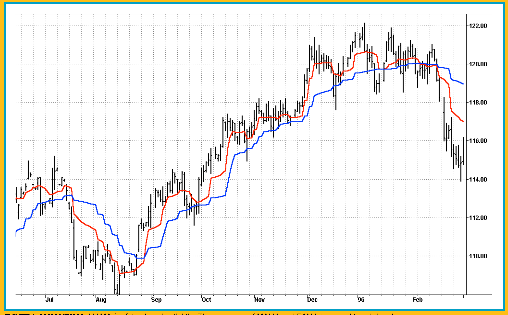
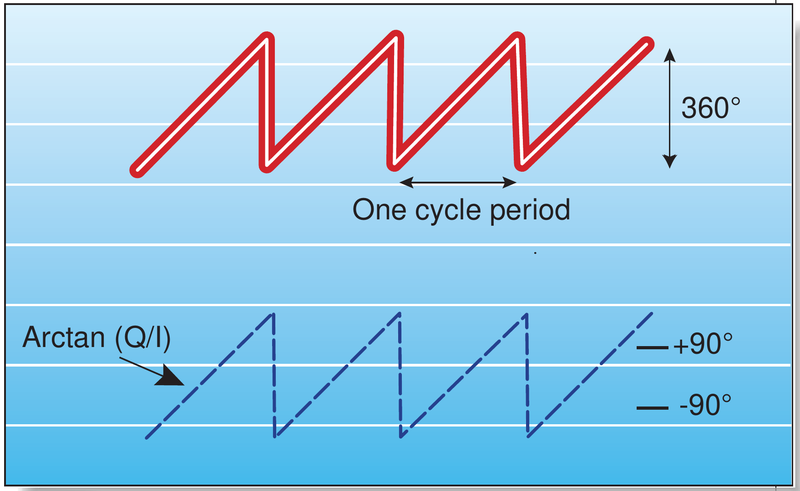

# MESA Adaptive Moving Averages

- **Author:** John F. Ehlers
- **Publication:** Technical Analysis of STOCKS & COMMODITIES, Volume 19:9, September 2001, pp. 30-35
- **Article URL:** [Article PDF](https://technical.traders.com/archive/article.asp?file=\V19\C09\099MESA.pdf)
- **Traders' Tips URL:** [Traders' Tips, September 2001](https://www.traders.com/Documentation/FEEDbk_docs/2001/09/TradersTips/TradersTips.html)

---

## *Phasors Set On "New"*

What if you combined the power of maximum entropy spectral analysis with the Hilbert transform's ability to discern phase change?

The MESA adaptive moving average (MAMA) adapts to price movement in a new and unique way. The adaptation is based on the rate change of phase as measured by the Hilbert transform discriminator I described in my December 2000 article. In that article I derived the Hilbert transform, which generates the real and imaginary components from the analytical price waveform. The arctangent of the ratio of the imaginary component to the real one is the phase angle at a given point in time. Since the summation of the delta phases from bar to bar reaches 360 degrees, completing a cycle, the Hilbert discriminator computes the dominant cycle on the basis of the average phase differential.

The advantage of this method of adaptation is that it features a fast attack average and a slow decay average so that the composite average rapidly ratchets behind price changes and holds the average value until the next ratchet occurs. *Ratcheting* refers to the short time constant upon command that allows the adaptive moving average to approach price value; thereafter, the moving average moves slowly with price until the next command it receives to apply the faster moving average. The ratcheting gives the adaptive moving average a stairstep appearance. The combination of *fast attack* and *slow decay* is like an electronic sample and hold circuit — that is, the adaptive moving average rapidly moves toward the current price upon command and essentially holds that value, or slowly follows price, until the next update command arrives.



**FIGURE 1: MAMA/FAMA.** MAMA (red) tracks price tightly. The crossover of MAMA and FAMA is a good trend signal.

The action of MAMA is shown in Figure 1. Since the average fallback is slow, I can build trading systems that are virtually free of whipsaw trades.

The starting point for MAMA is a conventional exponential moving average (EMA). The equation for an EMA is written as:

$$
\text{EMA} = \alpha \times \text{Price} + (1 - \alpha) \times \text{EMA}[1]
$$

where $\alpha$ is less than 1.

In plain English, the EMA is created by taking a fraction of the current price and adding one minus that fraction times the previous value of the EMA. The larger the value of $\alpha$ (alpha), the more responsive the EMA becomes to the current price. Conversely, if $\alpha$ becomes smaller, the EMA is more dependent on previous values of the average rather than the current price. Therefore, one way to make an EMA adaptive is to vary the value of $\alpha$ according to some independent parameter. The Kaufman adaptive moving average (KAMA) and the variable index dynamic average (VIDYA) introduced by Tushar Chande both use the variation in prices, or volatility, as the basis of their adaptations.

## PRESENTING MAMA

The concept of MAMA is to relate the phase rate of change — the degree to which the phase of the market cycle changes from bar to bar — to the EMA's $\alpha$, thus making the EMA adaptive. As shown in Figure 2, the cycle phase goes from zero through 360 degrees in each cycle. The phase is continuous, but it is usually drawn with a snapback (also known as a phase wrap boundary) at the beginning of each cycle.

Cycle phase increases with time and therefore could be drawn as increasing forever. However, the usual convention is to unwrap phase from one cycle to the next. When the phase angle reaches 360 degrees, then a new cycle starts at zero degrees phase. If we were to plot the phase progression of a perfect cycle, the phase would increase linearly throughout the cycle until it reached 360 degrees. At that point, the phase display would snap back to zero degrees for the start of the next cycle. The resultant waveform would resemble a sawtooth waveform.

Thus, the phase rate of change is 360 degrees per cycle. The shorter the cycle is, the faster the phase rate of change: For example, a 36-bar cycle has a phase rate of change of 10 degrees per bar, while a 10-bar cycle has a rate of change of 36 degrees per bar. The cycle periods tend to be longer when the market is in a trend mode.

The cycle phase is computed from the arctangent of the ratio of the quadrature component to the InPhase component. This means I obtain the phase rate of change values by taking the difference of successive phase measurements. The arctangent function only measures phase over a half cycle, from -90 degrees to +90 degrees. Since the phase measurement snaps back every half cycle, a huge negative rate change of phase every half cycle results from the computation of the rate change of phase.

Measured negative rate changes of phase can also occur when the market is in a trend mode. When the market is in a cycle mode, the phase increases from bar to bar. For a 10-bar cycle, this phase progression would be zero degrees, 36, 72, 108, 144, and so on. However, in a trend mode, there is no measurable cycle, and so the measured phase (due to noise, and so forth) may actually progress backward. This is clearly an impossibility because, like time, phase can only march in one direction. Any negative rate change of phase is theoretically impossible because phase must advance as time increases. Therefore, I limit all rate change of phase to be no less than 1.

## THE ALPHA IN MAMA

The alpha in MAMA ranges between a maximum and minimum value, these values having been established as inputs. The suggested maximum value is FastLimit = 0.5 and the suggested minimum is SlowLimit = 0.05. The FastLimit is 0.5, which is the same as a four-bar EMA. These limits are simple boundaries to keep a computer program from hanging up or crashing.

Next, I compute the variable $\alpha$ as the FastLimit divided by the phase rate of change. Any time there is a negative phase rate of change, I set the value of $\alpha$ to the FastLimit, because the phase rate of change cannot be less than 1. If the phase rate of change is large, I limit the $\alpha$ to the SlowLimit. This prevents MAMA from reacting to the shorter market cycles.



**FIGURE 2: PHASE INCREASES 360 DEGREES PER CYCLE.** The arctangent (Q/I) snaps back every half cycle.

The arctangent function produces a phase response between -90 degrees and +90 degrees, with a phase wrap back to -90 degrees. There is a huge negative rate change of phase across this *phase wrap boundary* (also known as a *snapback*). By limiting this negative rate change of phase to +1, the alpha used in the EMA is set to the FastLimit. The phase wrap boundary occurs at zero degrees and 180 degrees of a theoretical sinewave due to the 90-degree lag of the Hilbert transform.

The variable $\alpha$ is guaranteed to be set to the FastLimit every half cycle due to the measured phase snapback. This relatively large value of $\alpha$ causes MAMA to rapidly approach the price. After the phase snaps back, the $\alpha$ returns to a typically small value. The small value of $\alpha$ causes MAMA to hold nearly the value it achieved when $\alpha$ was at the FastLimit. This switching between the relatively large and relatively small values of $\alpha$ produces the ratcheting action you see. The ratcheting occurs less often when the market is in trend mode because the cycle period is longer in these cases.

## TradeStation Code for MAMA and FAMA

This code is nearly the same as the one that computes the Hilbert transform homodyne discriminator cycle measurement, with the additional code to compute phase rate of change, the nonlinear alpha, and the MAMA and FAMA lines. Your superheterodyne radios and TVs are tuned by multiplying the incoming radio frequency signal with a variable frequency local oscillator to produce a fixed-frequency intermediate frequency (IF). Homodyne means we multiply the signal by itself (delayed by one bar) to produce a zero-frequency beat note. The phase information is carried in the value of the beat note. The code here performs the complex multiplication and filtering to produce the measured phase angle.

```easylanguage
Inputs:   Price((H+L)/2),
          FastLimit(.5),
          SlowLimit(.05);

Vars: Smooth(0),
      Detrender(0),
      I1(0),
      Q1(0),
      jI(0),
      jQ(0),
      I2(0),
      Q2(0),
      Re(0),
      Im(0),
      Period(0),
      SmoothPeriod(0),
      Phase(0),
      DeltaPhase(0),
      alpha(0),
      MAMA(0),
      FAMA(0);

If CurrentBar > 5 then begin
    Smooth = (4*Price + 3*Price[1] + 2*Price[2] + Price[3]) / 10;
    Detrender = (.0962*Smooth + .5769*Smooth[2] -
.5769*Smooth[4] - .0962*Smooth[6])*(.075*Period[1] + .54);

   {Compute InPhase and Quadrature components}
   Q1 = (.0962*Detrender + .5769*Detrender[2] -
.5769*Detrender[4] - .0962*Detrender[6])*(.075*Period[1] + .54);
    I1 = Detrender[3];

   {Advance the phase of I1 and Q1 by 90 degrees}
   jI = (.0962*I1 + .5769*I1[2] - .5769*I1[4] -
.0962*I1[6])*(.075*Period[1] + .54);
   jQ = (.0962*Q1 + .5769*Q1[2] - .5769*Q1[4] -
.0962*Q1[6])*(.075*Period[1] + .54);

    {Phasor addition for 3-bar averaging)}
    I2 = I1 - jQ;
    Q2 = Q1 + jI;

    {Smooth the I and Q components before applying the discriminator}
    I2 = .2*I2 + .8*I2[1];
    Q2 = .2*Q2 + .8*Q2[1];

    {Homodyne Discriminator}
    Re = I2*I2[1] + Q2*Q2[1];
    Im = I2*Q2[1] - Q2*I2[1];
    Re = .2*Re + .8*Re[1];
    Im = .2*Im + .8*Im[1];
    If Im <> 0 and Re <> 0 then Period = 360/ArcTangent(Im/Re);
    If Period > 1.5*Period[1] then Period = 1.5*Period[1];
    If Period < .67*Period[1] then Period = .67*Period[1];
    If Period < 6 then Period = 6;
    If Period > 50 then Period = 50;
    Period = .2*Period + .8*Period[1];
    SmoothPeriod = .33*Period + .67*SmoothPeriod[1];

    If I1 <> 0 then Phase = (ArcTangent(Q1 / I1));
    DeltaPhase = Phase[1] - Phase;
    If DeltaPhase < 1 then DeltaPhase = 1;
    alpha = FastLimit / DeltaPhase;
    If alpha < SlowLimit then alpha = SlowLimit;
    If alpha > FastLimit then alpha = FastLimit;
    MAMA = alpha*Price + (1 - alpha)*MAMA[1];
    FAMA = .5*alpha*MAMA + (1 - .5*alpha)*FAMA[1];

    Plot1(MAMA, "MAMA");
    Plot2(FAMA, "FAMA");

End;
```

This code creates two plots. Be sure to assign the same scaling as the prices and plot them in subplot 1.

## INDICATORS

An interesting set of indicators results if MAMA is applied to a first MAMA line to produce a following adaptive moving average (FAMA). By using an $\alpha$ in FAMA that is half the value of the $\alpha$ in MAMA, the FAMA is synchronized with MAMA, but the vertical movement is not as great. As a result, MAMA and FAMA do not cross unless there has been a major change in market direction. This suggests an adaptive moving average crossover system that is virtually free of whipsaw trades. The MAMA code is shown in sidebar "TradeStation code for MAMA and FAMA." Solutions for other programs can be found in Traders' Tips.

The unique character of MAMA can be seen in Figure 1. The red MAMA line ratchets closely behind the price. The blue FAMA line steps in sequence with MAMA, but the movement is not as dramatic because its $\alpha$ is at half value. From Figure 1, it is clear the two adaptive moving average lines only cross at major market reversals. Their action enables the creation of a trading system that is practically whipsaw-free.

As an example, I tested the MAMA crossover system on 100 stocks from January 2, 1998, to January 2, 2001, taking long side trades only and trading one share per stock. This period makes up a good system test because it encompasses both the 1999 bull market and the 2000 bear market. The gross profit of this test was $6,403 on 1,317 trades; 37.5% of all the trades were profitable, with the average profit per trade being $4.86 per share. Typical transaction cost is about $0.30 per share, showing that the system turns in a substantial net profit on the average. MAMA trades about 4.4 times a year per stock, trading only on the long side. The relatively large number of trades in this test demonstrates that the MAMA system was not curve-fitted to the sample data.

I hope your MAMA will do as well for you in your trading.

---

## About The Author

John Ehlers is president of MESA Software and a frequent contributor to STOCKS & COMMODITIES. He pioneered the MESA algorithm for measuring market cycles. This article was adapted from *Rocket Science For Traders* from John Wiley & Sons. Ehlers may be reached via his website at www.mesasoftware.com.

---

## REFERENCES

- Chande, Tushar S., and Stanley Kroll [1994]. *The New Technical Trader*, John Wiley & Sons.
- Ehlers, John F. [2001]. *Rocket Science For Traders*, John Wiley & Sons.
- _____ [2000]. "Phasor Displays," *Technical Analysis of STOCKS & COMMODITIES*, Volume 18: December.
- Kaufman, Perry J. [1998]. *Trading Systems And Methods*, 3d edition, John Wiley & Sons.

---

*This article was originally published in Technical Analysis of STOCKS & COMMODITIES magazine. All code presented here is reproduced as it was published. For other software implementations, see the Traders' Tips section.*

---

## BibTeX

```bibtex
@article{ehlers2001mama,
  author = {Ehlers, John F.},
  title = {{MESA} Adaptive Moving Averages},
  journal = {Technical Analysis of STOCKS \& COMMODITIES},
  volume = {19},
  number = {9},
  pages = {30--35},
  month = sep,
  year = {2001},
  url = {https://technical.traders.com/archive/article.asp?file=\V19\C09\099MESA.pdf}
}

@misc{traders_tips_2001_09,
  author = {{Technical Analysis of STOCKS \& COMMODITIES}},
  title = {Traders' Tips: {MESA} Adaptive Moving Averages},
  howpublished = {online},
  month = sep,
  year = {2001},
  url = {https://www.traders.com/Documentation/FEEDbk_docs/2001/09/TradersTips/TradersTips.html}
}
```
