# Traders' Tips: September 2001

- **Article:** MESA Adaptive Moving Averages by John F. Ehlers
- **Traders' Tips URL:** [Traders' Tips, September 2001](https://www.traders.com/Documentation/FEEDbk_docs/2001/09/TradersTips/TradersTips.html)

---

*Here is this month's selection of Traders' Tips, contributed by various developers of technical analysis software to help readers more easily implement some of the strategies presented in this issue.*

This month's tips include formulas and programs for CandleCode trading systems and MESA Adaptive Moving Averages (MAMA).

---

## NeuroShell Trader: CandleCode

Viktor Likhovidov's CandleCode trading systems, described in "Light Up Your Trading System With CandleCode Trading" elsewhere in this issue, can easily be implemented in the NeuroShell Trader Trading Strategy Wizard by inserting Likhovidov's rules into the correct places.

Using the indicators we created for the March 2001 issue of STOCKS & COMMODITIES (which can be found at the NeuroShell Trader free technical support website in the STOCKS & COMMODITIES section), we can recreate the two systems that Likhovidov describes in his article with the following steps.

### Detecting Turning Points (Figure 1)

To insert the strategy:

1. Select Insert - New Trading Strategy
2. On the Long Entry Tab - insert the condition - CrossOver Above(X, Y)
3. On the Short Entry Tab - insert the condition - CrossOver Below(X, Z)

where:

```
X = Avg(Avg(CandleCode(Open, High, Low, Close), 21), 3)
Y = 50
Z = 70
```

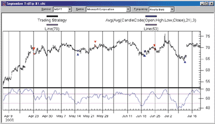

**FIGURE 1: NEUROSHELL TRADER, TURNING POINTS CANDLECODE SYSTEM.** Here is Viktor Likhovidov's CandleCode trading system to detect turning points, as implemented in NeuroShell Trader.

The numbers above are just examples for the parameters. You can use different values if you desire.

### Moving Averages and Bollinger Bands (Figure 2)

To insert the strategy:

1. Select Insert -New Trading Strategy
2. On the Long Entry Tab - insert the condition - CrossOver Above (X, Y)
3. On the Short Entry Tab - insert the condition - CrossOver Below(X, Z)

where:

```
X = Avg(Avg(CandleCode(Open, High, Low, Close), 21), 3)
Y = BBLow(Avg(Avg(CandleCode(Open, High, Low, Close), 21), 3),20,2)
Z = BBHigh(Avg(Avg(CandleCode(Open, High, Low, Close), 21), 3),20,2)
```

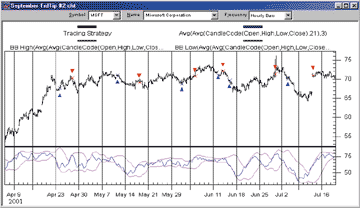

**FIGURE 2: NEUROSHELL TRADER, MOVING AVERAGES AND BOLLINGER BANDS CANDLECODE SYSTEM.** Here is Viktor Likhovidov's CandleCode system based on moving averages and Bollinger Bands, as implemented in NeuroShell Trader.

Again, the numbers above are just examples for the parameters. You can use different values if you desire.

If you have NeuroShell Trader Professional or NeuroShell DayTrader Professional, you can use our genetic algorithm optimizer to determine the best values for any or all of the parameters (as suggested by Likhovidov).

We've created both of the CandleCode trading systems for you. They can be downloaded from the NeuroShell Trader free technical support website. In addition, if you place the provided charts in your template directory, you can apply this system to any new chart that you create.

Users of NeuroShell Trader can go to the STOCKS & COMMODITIES section of the NeuroShell Trader free technical support website to download a copy of current and past Traders' Tips.

*-- Marge Sherald, Ward Systems Group, Inc.*  
301 662-7950, sales@wardsystems.com  
https://www.neuroshell.com

---

## NeuroShell Trader: MAMA

John Ehlers's MESA adaptive moving average (MAMA), presented in his article in this issue, can be easily implemented in NeuroShell Trader (Figure 3) by using NeuroShell Trader's ability to call external Dynamic Linked Libraries.

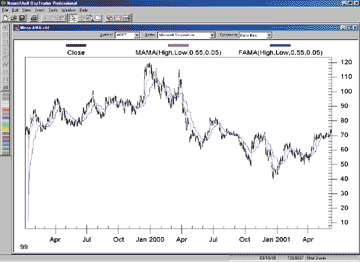

**FIGURE 3: NEUROSHELL TRADER, MAMA.** This NeuroShell Trader chart displays the MESA adaptive moving average (MAMA) and the following adaptive moving average (FAMA).

Dynamic Linked Libraries can be written in C, C++, Power Basic (also Visual Basic using one of our add-on packages), or Delphi. For your convenience, we've recreated the MESA adaptive moving average that you can download from NeuroShell Trader's free technical support website. We've also provided the code at our website in case you wish to make your own modifications to it.

After downloading the custom indicator, you can easily insert it or combine it with any of our 800+ built-in indicators into a chart, prediction, or trading strategy.

Users of NeuroShell Trader can go to the STOCKS & COMMODITIES section of NeuroShell Trader's free technical support website to download this or any past Traders' Tip.

*-- Marge Sherald, Ward Systems Group, Inc.*  
301 662-7950, sales@wardsystems.com  
https://www.neuroshell.com

---

## Investor/RT: CandleCode

Investor/RT has added a built-in technical indicator called Candle Code. The Investor/RT implementation of Viktor Likhovidov's CandleCode, described in "Light Up Your Trading System With CandleCode Trading" elsewhere in this issue, allows the user to supply weighting factors for each of the following candle components: body color, body size, upper shadow, lower shadow, and gap. The preferences for the Candle Code indicator can be seen in Figure 4.

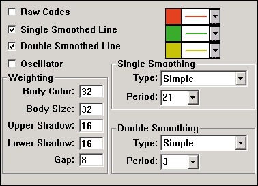

**FIGURE 4: Investor/RT Candle Code indicator.** This window shows the preference settings for the Investor/RT Candle Code indicator.

The weighting works as follows. In our example, let's assume the weights were assigned as seen in the preferences shown in Figure 4: body color(32), body size(32), upper and lower shadows(16), and gap(8). These weights can be assigned any integer value. If the body color is white (up candle), then a positive 32 will be added. If the body color is black (down candle), then 32 will be subtracted from the code. If the close and open are equal (unchanged candle), then the body color weight will have no effect on the code. The body size component can be anywhere between -32 (for a large down candle body) to +32 (for a large up candle body). A value of 8 would represent a relatively small up candle. The upper shadow component only adds positive, or bullish value. If no upper shadow exists, it will have no effect on the code. The upper shadow component may be anywhere from 0 to 16 in our example, depending on the size of the shadow. Similarly, the lower shadow only adds negative, or bearish value. The lower shadow component may be anywhere from 0 to -16, depending on size of the shadow. The gap component represents a value given to the difference between the open and the previous close. The gap component can range from -8 to 8 in our example, depending on the magnitude and direction of the gap.

The Candle Code can be charted as raw data, smoothed, double-smoothed, and/or drawn as an oscillator representing the difference between the single- and double-smoothed lines. In the chart in Figure 5, the top pane depicts three-minute candles of Csco. The second pane shows the raw Candle Code data. The third pane shows the smoothed and double-smoothed lines using the preferences from Figure 4. The fourth pane shows an oscillator representing the difference between the single- and double-smoothed lines. All lines, bars, and histograms can be dragged and dropped between panes, and overlaid using single or multiple scaling.

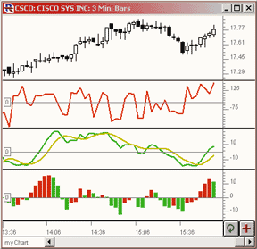

**FIGURE 5: Investor/RT Candle Code indicator.** This Investor/RT candlestick chart plots the Investor/RT Candle Code indicator three different ways.

From testing a small sample of three-minute data, the double-smoothed line appears to give strong leading signals when changing slope in extreme positive or negative territory, or when the oscillator crosses the zero reference line.

The Candle Code oscillator can be referenced in the Rtl language as "CCOSC." The scan syntax for a Candle Code buy signal would be as follows:

```
CCOSC >= 0 AND CCOSC.1 < 0
```

The scan syntax for a Candle Code sell signal would be as follows:

```
CCOSC <= 0 AND CCOSC.1 > 0
```

The Ccosc token can be used in creating automated scans, custom indicators, or trading signals for backtesting.

*-- Chad Payne, Linn Software, Inc.*  
800 546-6842, info@linnsoft.com  
https://www.linnsoft.com

---

## Investor/RT: MAMA

In "MESA Adaptive Moving Averages" in this issue, John Ehlers combines maximum entropy spectral analysis with the Hilbert transform to form a moving average that adapts to price movement. This MESA adaptive moving average, or MAMA, has now been added to Investor/RT as a built-in technical indicator.

MAMA can be drawn as either a histogram oscillator depicting the difference between the MAMA and FAMA lines, or as individual MAMA and FAMA lines. Figure 6 shows the preferences available for MAMA.

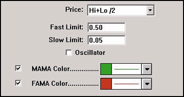

**FIGURE 6: INVESTOR/RT, MAMA.** MAMA can be drawn in Investor/RT as either a histogram oscillator depicting the difference between the MAMA and FAMA lines or as individual MAMA and FAMA lines. The preferences available for MAMA are shown here.

When the oscillator checkbox is unchecked, you have the option of showing either the MAMA line or the FAMA line, or both. Figure 7 illustrates the use of both the oscillator and the individual lines. The upper pane shows the MAMA and FAMA lines overlaying the daily bars of Rnwk. The MAMA line is drawn in green while the FAMA line is drawn in red. The lower pane depicts the oscillator, drawn as a histogram. The histogram bars represent the difference between the MAMA line and the FAMA line. The histogram color represents whether the bar was an up bar (green) or a down bar (red).

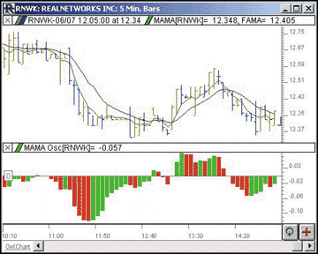

**FIGURE 7: INVESTOR/RT, MAMA.** The upper pane shows the MAMA and FAMA lines overlaying the daily bars of RNWK. The MAMA line is drawn in green while the FAMA line is drawn in red. The lower pane depicts the oscillator, drawn as a histogram. The histogram bars represent the difference between the MAMA line and the FAMA line. The histogram color represents whether the bar was an up bar (green) or a down bar (red).

This MESA adaptive moving average has also been added to the Investor/RT RTL Language and has been assigned the token name MAMA. RTL can be used to compose scans, custom indicators, backtest trading signals, annotations, and e-mail alerts.

*-- Chad Payne, Linn Software, Inc.*  
800 546-6842, sales@linnsoft.com  
https://www.linnsoft.com

---

## Wealth-Lab: CandleCode

In "Light Up Your Trading System With CandleCode Trading" in this issue, Viktor Likhovidov presents the latest installment in his series of STOCKS & COMMODITIES articles on coding candlesticks. Likhovidov presents a trading system based on double-smoothed CandleCode penetrating upper and lower Bollinger Bands.

We've implemented Likhovidov's system in Wealth-Lab and posted it (with some small modifications) at the Wealth-Lab.com website. Here, we'll share some of the system-testing results. The first modification we made was to eliminate the short positions, as these consistently reduced the system's performance on stocks in our backtesting. We also increased the Bollinger Band standard deviations to 2.0. This decreases the system's exposure but the gives the trades that are generated a higher probability of profit.

We then created a WatchList of 12 randomly selected Nasdaq 100 stocks and ran a three-year simulation using Wealth-Lab's $imulator tool. We established a starting account equity of $50,000 and a base position size of $5,000.

The full $imulation results are reported in Figure 8. The bottom line: The system did well, returning 100.1% net profit over the historical period (Figure 9). This didn't beat the buy-and-hold return of 145.75%, but the system was able to achieve its profit with far less market exposure -- only 32.8%.

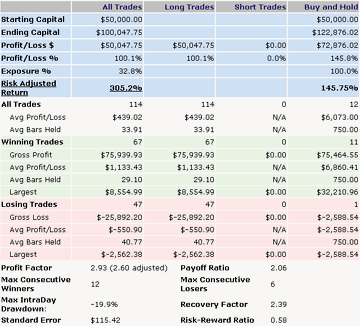

**FIGURE 8: WEALTH-LAB, CANDLECODE SYSTEM RESULTS.** Here are the results from running a three-year simulation of Likhovidov's CandleCode system against 12 randomly selected Nasdaq 100 stocks using Wealth-Lab's $imulator tool. The equity plot is shown in Figure 9.

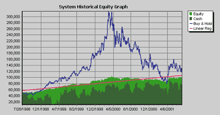

**FIGURE 9: WEALTH-LAB, CANDLECODE SYSTEM.** Likhovidov's CandleCode system did well, returning 100.1% net profit over the historical period.

To locate the CandleCode II ChartScript on the Wealth-Lab website, click the ChartScripts main menu heading, then the "Search" link. Search for ChartScripts with "CandleCode" in their title.

*-- Dion Kurczek, Wealth-Lab, Inc.*  
773 883-9047, dionkk@ix.netcom.com  
https://www.wealth-lab.com

---

## TechniFilter Plus: CandleCode

Here is a TechniFilter Plus formula that computes Viktor Likhovidov's CandleCode indicator described in "Light Up Your Trading System With CandleCode Trading" in this issue.

### Formula for CandleCode

```text
NAME: CandleCode
SWITCHES: multiline
FORMULA: [1]: (C-O)U0 {body}
[2]: H - (C%O) {UpperShadow}
[3]: (C#O) - L {LowerShadow}
[4]: [1]X55 - .5*[1]|55 {ThBot_Body}
[5]: [1]X55 + .5*[1]|55 {ThTop_Body}
[6]: [2]X55 - .5*[2]|55 {ThBot_LS}
[7]: [2]X55 + .5*[2]|55 {ThTop_LS}
[8]: [3]X55 - .5*[3]|55 {ThBot_US}
[9]: [3]X55 + .5*[3]|55 {ThTop_US}
[10]: (C>=O) * 64 {ColorCode}
[11]: (C>=0) * (([1]<[4])*16 + (T=0) * ([1]<[7])*32 + (T=0) * 48) {BodyCodePos}
[12]: (C<0) * (([1]=0)*48 + (T=0) * ([1]<[4])*32 + (T=0) * ([1]<[5])*16) {BodyCodeNeg}
[13]: [11] + [12] {BodyCode}
[14]: ([2]<>0) * ( ([2]<[8]) * 4 + (T=0) * ([2]<[9])*8 + (T=0) *12 )  {USCode}
[15]: ([3]=0) * 3 + (T=0) * ([3]<[6]) * 2 + (T=0) * ([3]<[7])*1 {LSCode}
[16]: [10] + [13] + [14] + [15] {CandleCode}
```

The next set of code illustrates a TechniFilter Plus strategy that implements Likhovidov's trading system that uses a moving average of this CandleCode calculation (MaCC) as the basis for signals. The strategy reverses from short to long when the MaCC breaks up across the lower Bollinger Band, where the band calculation is on MaCC instead of the normal close. The strategy reverses from long to short on a down cross of the top band.

### TechniFilter Plus Strategy that trades on the cross of the MaCC and Bollinger Bands on the MaCC

```text
FORMULAS-----------------
 [1] Date
 [2] CandleCode
  CandleCode()
 [3] MaCC(45)
  [2]X&1X3
 [4] CrossLong(13,1.2)
  ([3] - ([3]X&1 - &2 * [3]|&1))U2-TY1
 [5] CrossShort(13, 1.5)
  ([3] - ([3]X&1 + &2 * [3]|&1))U2-TY1
RULES-----------------
 r1: EnterLong
  reverse short to long 1 on Close
  at signal: EnterLong     [4]=1
 r2: EnterShort
  reverse long to short 1 on Close
  at signal: EnterShort     [5]=-1
```

Visit RTR's website to download this formula as well as program updates.

*-- Clay Burch, Rtr Software*  
919 856-9600, rtrsoft@aol.com  
https://www.rtrsoftware.com

---

## TradingSolutions: CandleCode

The trading systems described in Viktor Likhovidov's article, "Light Up Your Trading System With CandleCode Trading," as well as the functions from his March 2001 S&C article, "Coding Candlesticks (II)," can be reproduced in TradingSolutions fairly easily. The MetaStock Indicator Builder language used in the articles' examples is very similar to that of TradingSolutions.

Here are the underlying functions from the original article as coded for TradingSolutions:

**CandleCode Value: Body**
```
CandleBody ( Open , Close )
 Abs ( Sub ( Open , Close ) )
```

**CandleCode Value: Lower Shadow**
```
CandleLower ( Low , Open , Close )
 Sub ( Min ( Open , Close ) , Low )
```

**CandleCode Value: Upper Shadow**
```
CandleUpper ( High , Open , Close )
 Sub ( High , Max ( Open , Close ) )
```

The threshold functions from Likhovidov's March 2001 article can be simplified into two functions:

**CandleCode Threshold: Bottom**
```
CThreshBot ( Data )
 BBandBottom ( Data , 55 , 0.5 )
```

**CandleCode Threshold: Top**
```
CThreshTop ( Data )
 BBandTop ( Data , 55 , 0.5 )
```

Here are the CandleCode functions from Likhovidov's March 2001 article:

**CandleCode Step: Body**
```
CCodeBody ( High , Low , Open , Close )
If ( EQ ( Close , Open ) , If ( GE ( CandleUpper ( High , Open , Close ) , CandleLower ( Low , Open , Close ) ) , 64 , 48 ) , If ( GT ( Close , Open ) , If ( LE ( CandleBody ( Open , Close ) , CThreshBot ( CandleBody ( Open , Close ) ) ) , 80 , If ( LE ( CandleBody ( Open , Close ) , CThreshTop ( CandleBody ( Open , Close ) ) ) , 96 , 112 ) ) , If ( LE ( CandleBody  ( Open , Close ) , CThreshBot ( CandleBody ( Open , Close ) ) ) , 32 , If ( LE ( CandleBody  ( Open , Close ) , CThreshTop ( CandleBody ( Open , Close ) ) ) , 16 ,0 ) ) ) )
```

**CandleCode Step: Lower Shadow**
```
CCodeLower ( Low , Open , Close )
If ( LE ( CandleLower ( Low , Open , Close ) , 0 ) , 3 , If ( LE ( CandleLower ( Low , Open , Close ) , CThreshBot ( CandleLower ( Low , Open , Close ) ) ) , 2 ,If ( LE ( CandleLower ( Low , Open , Close ) , CThreshTop ( CandleLower ( Low , Open , Close ) ) ) , 1 , 0 ) ) )
```

**CandleCode Step: Upper Shadow**
```
CCodeUpper ( High , Open , Close )
If ( LE ( CandleUpper ( High , Open , Close ) , 0 ) , 0 , If ( LE ( CandleUpper ( High , Open , Close ) , CThreshBot ( CandleUpper ( High , Open , Close ) ) ) , 4 , If ( LE ( CandleUpper ( High , Open , Close ) , CThreshTop ( CandleUpper ( High , Open , Close ) ) ) , 8 , 12 ) ) )
```

**CandleCode**
```
CCode ( High , Low , Open , Close )
Add3 ( CCodeBody ( High , Low , Open , Close ) , CCodeLower ( Low , Open , Close ) , CCodeUpper ( High , Open , Close ) )
```

Meanwhile, Likhovidov's article in this issue introduces two entry/exit systems based on the CandleCode function -- one based on crossing thresholds and one based on Bollinger Bands (Figure 10).

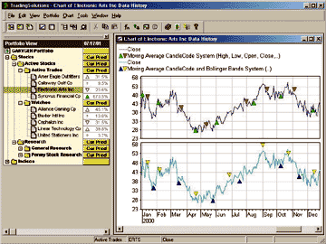

**FIGURE 10: TradingSolutions, CandleCode.** Here's a chart of Likhovidov's two CandleCode systems as implemented in TradingSolutions.

Both systems rely on the following smoothed version of the CandleCode:

**Moving Average CandleCode**
```
MaCC ( High , Low , Open , Close , Period )
 EMA (EMA (CCode ( High , Low , Open , Close ) , Period ) ,3 )
```

**Moving Average CandleCode System**
```
Inputs: High, Low, Open, Close, MA Period, Upper Level, Lower Level
Enter Long:
CrossAbove ( MaCC ( High, Low, Open, Close, MA Period ) , Lower Level )
Enter Short:
CrossBelow ( MaCC ( High, Low, Open, Close, MA Period ) , Upper Level )
```

**Moving Average CandleCode and Bollinger Bands**
```
Inputs: High, Low, Open, Close, MA Period, Band Period, Top Deviations, Bottom Deviations

Enter Long:
CrossAbove ( MaCC ( High, Low, Open, Close, MA Period ) , BBandBottom (MaCC ( High, Low, Open, Close, MA Period ) , Band Period , Bottom Deviations ) )

Enter Short:
CrossBelow ( MaCC ( High, Low, Open, Close, MA Period ) , BBandTop (MaCC ( High, Low, Open, Close, MA Period ) , Band Period , Top Deviations ) )
```

All these TradingSolutions functions and systems are available in a function file that can be downloaded from the Solution Library section of our website. They can then be imported into TradingSolutions using "Import Functions..." from the File menu.

To apply one of these imported systems to a stock or group of stocks, select "Add New Field..." from the context menu for the stock or group, select "Apply an entry/exit system to generate an entry/exit signal," then select the desired entry/exit system from the "Traders Tips Systems" group.

*-- Gary Geniesse, NeuroDimension, Inc.*  
800 634-3327, 352 377-5144  
info@tradingsolutions.com, www.tradingsolutions.com

---

## Byte Into The Market: MAMA

The Byte Into The Market formula for computing the MESA adaptive moving average (MAMA) from John Ehlers's article in this issue is shown in Figure 11. To chart the following adaptive moving average (FAMA), simply replace MAMA on the last line of the formula with FAMA.

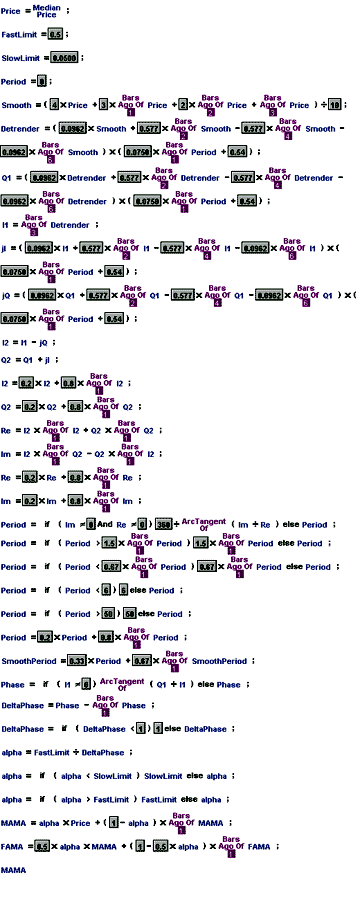

**FIGURE 11: BYTE INTO THE MARKET, MAMA.** Here is the Byte Into The Market formula for computing John Ehlers's MESA adaptive moving average (MAMA). To chart the FAMA, simply replace MAMA on the last line of the formula with FAMA.

This formula is also available in a downloadable zip file from our website at https://www.tarnsoft.com/mama.zip.

*-- Tom Kohl, Tarn Software*  
https://www.tarnsoft.com  
303 794-4184, bitm@tarnsoft.com

---

## BibTeX

```bibtex
@misc{traders_tips_2001_09,
  author = {{Technical Analysis of STOCKS \& COMMODITIES}},
  title = {Traders' Tips: {MESA} Adaptive Moving Averages},
  howpublished = {online},
  month = sep,
  year = {2001},
  url = {https://www.traders.com/Documentation/FEEDbk_docs/2001/09/TradersTips/TradersTips.html}
}
```
