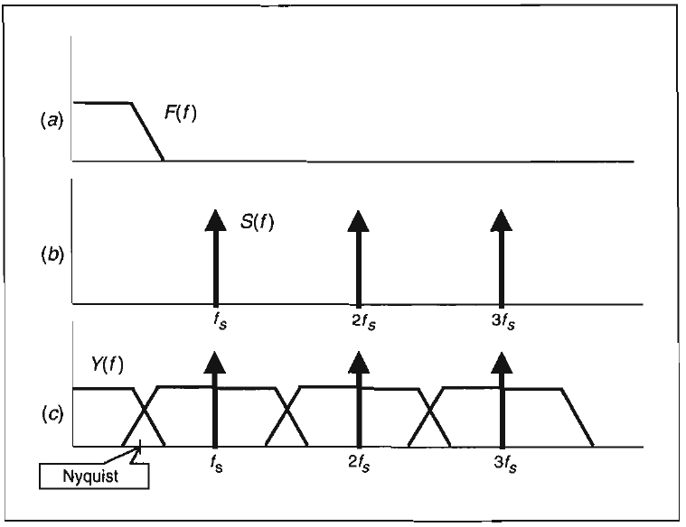
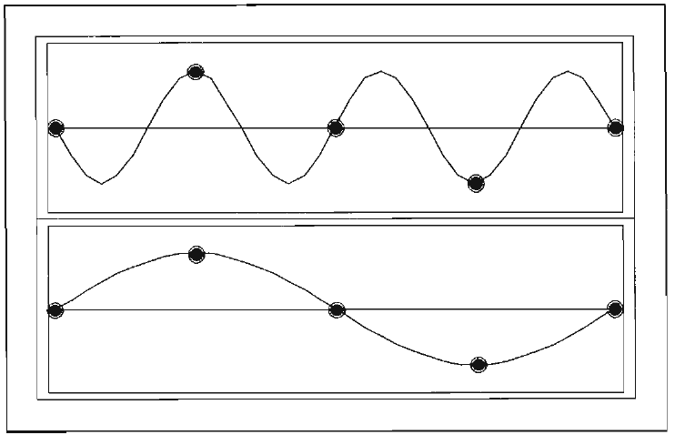

# Chapter 1: Introduction To The Science Of Digital Signal Analysis

> Computers are worthless.
> They can only give you answers.
> -- Pablo Picasso

Make no mistake about it. This is a book for traders about digital signal processing. It is not a book for engineers about trading. At first glance, the reverse may seem to be true for many traders because the subject matter is on the cutting edge of technology and the mathematics behind this technology can be more advanced than that encountered in school. Recognizing that many traders want to simply use the technology rather than become schooled in it, the information in this book is aimed at several levels. We provide the rationale, derive the equations, and provide the computer code to implement the techniques. With this approach, our results can be used in applications ranging from a cookie-cutter indicator operating within Tradestation or SuperCharts to the applications that are springboards for still more advanced technology.

It is common for technical analysis indicators to be described in terms of a fixed period of time. For example, the standard length used for a Relative Strength Indicator (RSI) is the last 14 price bars. One often hears about a five-day Stochastic or a 10/30 day moving average system. Since the market is continuously changing, there is absolutely no reason to use static periods in your indicators. Choosing the correct time period is essential to using traditional indicators to their maximum potential. While deriving the tools with which to make indicators adaptive, you will see novel indicators that surpass the traditional ones in accuracy and performance.

Digital signal processing is an exciting new field for technically oriented traders. Many of the indicators that have been used previously can now be generalized, and the computations can now be accomplished more precisely using digital methods. It is interesting to note that many of the digital signal processing techniques I describe have been known for many years and used in the physical sciences. My objective is to expose you to these  techniques to make your trading more profitable and more pleasurable.

Many physical systems involve the use of analog signals that are represented as continuous time functions. There is an amplitude associated with the signal at each instant in time. There is an infinite number of amplitude values that the signal may assume. However, if the signal is frequency bandlimited, there is no significant energy above the cutoff frequency. Since energy is required in any physical system to change amplitude, this implies that the signal cannot change amplitude instantaneously. Therefore, points closely spaced in time will have relatively similar amplitudes. There are several ways in which a signal can be represented other than as a continuous analog signal. One method is to quantize the amplitude and hold that value until the next quantization is performed. There are a finite number of amplitudes, but the function is continuous in time. This is in contrast to a discrete time signal, which has continuous amplitude values but is only defined at discrete instants in time. As with analog signals, there is an infinite number of levels, but there are only a finite number of points in time. If a signal is quantized in both amplitude and time, it is called a digital signal. The data we deal with in trading are digital signals from sampling that is done in uniform periods of time (once per day, once per hour, etc.).

A discrete time signal can be obtained from an analog signal by multiplying it by a periodic impulse train. The sampling signal can be expressed in the time domain as

$$s(t)= \sum^{\infin}_{k  = -\infin}\delta(t- kT)$$

where $\delta = $ the impulse function, $T = $ period between impulses

Using Fourier theory, multiplication in the frequency domain is synonymous with convolution in the time domain. In other words, multiplying signals in the time domain is the same as heterodyning, or mixing, the signals in the frequency domain. The impulse train has an infinite number of harmonics at frequencies that are the reciprocal of the period between pulses.

The effects of sampling in the frequency domain are illustrated in Figure 1.1. The continuous bandlimited signal $F(f)$ is shown in the top segment [a] as having a frequency rolloff at some point. In the middle segment [b], the sampling impulse waveform $S(f)$ has a monochromatic spectral line at the sampling frequency $f_s$ and all its harmonics. When the sampling is performed on the bandlimited signal, the convolved waveform is shown in the bottom segment (c). Not only is the original bandlimited continuous signal present but this same signal also appears as the upper and lower sidebands of each sampling frequency harmonic. Since the lower sideband of the sampling frequency can extend into the original baseband, the bandlimiting must occur below half the sampling frequency. Half the sampling frequency is called the Nyquist frequency because the  Nyquist Sampling Theorem states that there must be at least two samples per cycle of the signal to avoid aliasing.

**Figure 1.1** *Sampled data in the frequency domain.*

Aliasing is a form of distortion. It results from sampling a continuous signal less than twice per cycle. This distortion can be seen in the two waveforms depicted in Figure 1.2. Both the upper trace and the lower trace have identical sampling points, denoted by the dots. The samples in the top trace appear to be valid. However, these same samples plot out the sine wave of the lower trace, where there are four samples per cycle. The difference is explained by aliasing in the top trace. The samples are taken at three-quarters of a cycle apart, or two samples every one-and-a-half cycles. This does not meet the Nyquist criterion of at least two samples per cycle.

In trading, we can scale all time frames to each bar. Each bar is a sample. Therefore, to meet the Nyquist criterion, the absolute shortest cycle we can consider is a 2-bar cycle. As a practical matter, 5- and 6-bar cycles should be considered the shortest useful cycles.

If the input signal is insufficiently bandlimited, the aliased frequency components are folded back into the sampled baseband as false signals and noise. For this reason, data should always be smoothed before any other operation is performed. Otherwise, the undesired signal components will have an adverse effect on your computations. Smoothing removes the high-frequency components, precluding these components from being folded back into the analysis bandwidth.

**Figure 1.2** *Signals must be sampled at least twice per cycle.*

The complex waveshapes that describe traders' charts can be considered as synthesized from more primitive waveshapes, adding or subtracting from each other depending on their relative phases. These kinds of waves are called coherent, meaning the amplitude at any given position can be determined by a vector addition of the amplitudes. The waveshapes are analogous to voltage in electric circuits. When we measure the strength of the signals, we prefer not to use the amplitude of the wave as a measure because it is dependent on the location, or phase, within the wave. Rather, power is the preferred measure of strength. Power is proportional to waveform amplitude squared, just as the power a 100-W lightbulb consumes from a 115-V circuit is proportional to the voltage squared. In digital signal analysis, we are mostly concerned with relative power, or power ratios. It is convenient to express these power ratios in terms of decibels.

As an historical aside, one decibel was the power lost in a telephone signal over one mile of wire (the name was derived from Alexander Graham Bell). A decibel is one-tenth of a bel. The bel is the logarithm base 10 of the power ratio. Thus, a decibel is $10*Log10(P2/P1)$, and is abbreviated as dB. Working with decibels simplifies understanding signal levels both because large power ratios are compressed into a smaller range of numbers due to the logarithm and because adding decibels (i.e., adding logarithms) is easier than carrying out multiplication in your head. For example, 2*2 = 4 can also be performed with logarithms: $Log(2) = 0.3$, so that $Log(2)+Log(2)=0.6$, which is $Log(4)$. Memorizing some key ratios makes the identification of relative power instantly recognizable. A power ratio of 2 translates to +3 dB. If that ratio is ½ rather than 2, then it translates to -3 dB. That is, the reciprocal of the power ratio is the same absolute value of decibels, but the sign is reversed. A ratio smaller than 1 (but necessarily greater than 0) is always expressed in negative decibels. If we double the power, that is 3 dB. If we double it again so that the power is 4 times the original, that is 6 dB. Doubling still again to get 8 times the original power, we add another 3 dB to reach a level of 9 dB. Since we have a logarithm base 10, a power ratio of 10 is 10 dB, and a power ratio of 100 is 20 dB, and so on. Consider this to further illustrate the use of decibel: If a filter has half the power coming out of it as was entered, the output power is -3 dB. The filter is said to have a 3-dB loss. If a similar filter is placed at the output of the first, the net output power from the composite circuit would be -6 dB.

The measurement -3 dB is usually a critical point for a filter. This half-power point in the filter response occurs when the wave amplitude is 0.7 relative to its maximum value. This is true because 0.7*0.7 = 0.5, the half-power ratio. The critical point in the filter is often called the cutoff frequency because frequency components beyond the cutoff frequency are attenuated to a greater degree and frequency components within the cutoff frequency are attenuated very little. To simplify, think of the filter as having a stone-wall response. In this analogy, frequencies below the cutoff frequency are not attenuated and frequencies above the cutoff frequency are not allowed to pass through the filter.

EasyLanguage is currently the most popular computer language for traders. Thus, I use this system to generate computer codes. EasyLanguage is a dialect of Pascal, containing specialized keywords unique to trading. Because it reads almost like English, EasyLanguage is almost effortless to understand. It is also easy to translate to other computer languages. When translating, the reference convention must be understood. The EasyLanguage assumption is that all computations are done with reference to the current bar. For example, Close means the closing price of the current bar. If there is a reference associated with that parameter, it is displayed in square brackets and means the number of bars back to which it refers. For example, Close[3] refers to the closing price 3 bars ago. Zero can be used as a reference, and has the same meaning as the current bar without any reference (there is no reference into the future). As a further example, a two-day momentum is written as $Momentum = Close - Close[2];$. Each complete line of code must terminate in a semicolon. For clarity, I always write out the generic description of an action rather than relying on a more esoteric TradeStation function call. As a result, the computer code presented should be easily translated to BASIC, C+, or even an Excel spreadsheet.

## Key Points to Remember

- This book can be read at several levels, ranging from a broad perspective overview to detailed computer coding.
- Novel and unique indicators are made possible by the mathematical techniques to be introduced.
- Even conventional indicator performance can be enhanced by making them adaptive to current market conditions.
- Time scales of financial data can be dealt with on a per-bar basis. The absolute time scale of the data is irrelevant for computational purposes.
- Working with sampled data is distinctly different from working with continuous information. Sampled data should always be smoothed to avoid erratic signals.
