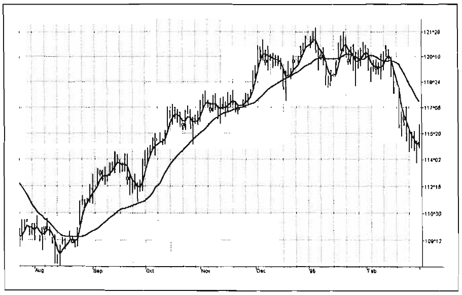

# Chapter 10: Instantaneous Trendline

> Never mistake motion for action.
> -Ernest Hemingway

Perhaps the term Instantaneous Trendline is a bit presumptuous to apply to the concepts we discuss in this chapter. Nonetheless, the term is somewhat appropriate in that our technology enables us to compute a continuous trendline from which we can rapidly assess market action. As derived from the Drunkard's Walk problem in Chapter 1, our model says the market consists of a Trend Mode and a Cycle Mode. It is more accurate to describe the general market as a combination of these two modes. Furthermore, in Chapter 3 we prove that we can completely eliminate the dominant cycle component by taking a Simple Moving Average (SMA) over the period of the cycle. If we take a simple average over the period of the dominant cycle on a bar-by-bar basis because we have been able to identify a continuously varying dominant cycle-we basically have a variable-length moving average. This moving average is important because the dominant cycle component is always notched out. It follows that if the composite analytic waveform consists of only a trend component and a cycle component, and if we remove the cycle component, the residual must be the trend. Of course, this is not precisely true, because there will always be components other than the dominant cycle present. However, this is a workable solution for trading purposes because the secondary cycles usually have a small amplitude.

We employ a 4-bar Weighted Moving Average (WMA) in conjunction with the Instantaneous Trendline to give an indication of when the price crosses the Instantaneous Trendline. Having only a 1-bar lag, the 4-bar WMA is useful for this purpose. One way to recognize the onset of a trend is to count backward from the current bar to the first crossing of the WMA and the Instantaneous Trendline. If the count is greater than a half-dominant cycle, you know that the market is in a Trend Mode. The reason for this is that if the market were in a Cycle Mode, we would expect the price to cross the Instantaneous Trendline every half cycle. Failure to do this is a clear indication of a Trend Mode. In fact, an amended rule might say that the onset of a Trend Mode is declared if the price has crossed more than a quarter cycle ago and does not appear to even try to head back across the Instantaneous Trendline. This amended rule will get you into a Trend Mode trade much earlier. However, as with all anticipatory signals, you will get caught in an error once in a while. A Trend Mode is over when the Smoothed Price crosses the Instantaneous Trendline.

Because we are taking an SMA over the entire period of the dominant cycle, the lag of an Instantaneous Trendline is onehalf the dominant cycle. This lag is unavoidable. It is also possible to take an SMA over half the period of the dominant cycle. The half-period average has a quarter-cycle lag. The result is that the quarter-cycle average will cross the Instantaneous Trendline just as the Sinewave Indicator reaches a peak or valley. The half-period average crossing the Instantaneous Trendline can be used as a confirmation signal, which is another way of identifying when the price has reached a cyclic turning point.

The EasyLanguage code to compute the Instantaneous Trendline is given in Figure 10.1. As in computations in previous chapters, the code starts with the Hilbert Transform and measures the dominant cycle using the Homodyne Discriminator algorithm. The Instantaneous Trendline is computed by averaging the price over the integer number of bars of the smoothed dominant cycle. This average is smoothed in a 4-bar WMA to make the Instantaneous Trendline a little smoother. The price itself is also smoothed in a 4-bar WMA to provide the second line of this indicator.

```easylanguage
Inputs:
    Price( \(H+L)/2);
Vars:
    Smooth(0),
    Detrender(0),
    I1(0),
    Q1(0),
    jI(0),
    jQ(0),
    I2(0),
    Q2(0),
    Re(0),
    Im(0),
    Period(0),
    SmoothPeriod(0),
    SmoothPrice(0),
    DCPeriod(0),
    RealPart(0),
    ImagPart(0),
    count(0),
    ITrend(0),
    Trendline(0);

If CurrentBar > 5 then begin
    Smooth = (4*Price + 3*Price[1] + 2*Price[2] + Price[3])/10;
    Detrender = (.0962*Smooth + .5769*Smooth[2] - .5769*Smooth[4] - .0962*Smooth[6])*(.075*Period[1] + .54);

    {Compute Inphase and Quadrature components}
    Q1 = (.0 962*Detrender + .5769*Detrender[2] - .5769*Detrender[4] - .0962*Detrender[6])*(.075* Period [1]+ .54);
    I1 = Detrender[3];

    {Advance the phase of I1 and Q1 by 90 degrees}
    jI = (.0962*I1 + .5769*I1[2] - .5769*I1[4] - .0962*I1[6])*(.075*Period[1] + .54);
    jQ = (.0962*Q1 + .5769*Q1[2] - .5769*Q1[4] - .0962*Q1[6])*(.075*Period[1] + .54);

    {Phasor addition for 3 bar averaging)}
    I2 = I1 - jQ;
    Q2 = Q1 + jI;

    {Smooth the I and Q components before applying the discriminator}
    I2 = .2*I2 + .8*I2[1];
    Q2 = .2*Q2 + .8*Q2[1];

    {Homodyne Discriminator}
    Re = I2*I2[1] + Q2*Q2[1];
    Im = I2*Q2[1] - Q2*I2[1];
    Re = .2*Re + .8*Re[1];
    Im = .2*Im + .8*Im[1];

    If Im <> 0 and Re <> 0 then Period = 360/ArcTangent(Im/Re);
    If Period > 1.5*Period[1] then Period = 1.S*Period[1];
    If Period < .67*Period[1] then Period = .67*Period[1];
    If Period c 6 then Period = 6;
    If Period > 50 then Period = 50;

    Period = .2*Period + .8*Period[1];
    SmoothPeriod = .33*Period + .67*SmoothPeriod[1];

    {Compute Trendline as simple average over the measured dominant cycle period}
    DCPeriod = IntPortion(SmoothPeriod + .S);
    ITrend = 0;

    For count = 0 to DCPeriod - 1 begin
        ITrend = ITrend + Price[count];
    End;

    If DCPeriod > 0 then ITrend = ITrend / DCPeriod;
    Trendline = (4*ITrend + 3*ITrend[1] + 2*ITrend[2] + ITrend[3]) / 10;
    If CurrentBar < 12 then Trendline = Price;
    SmoothPrice = (4*Price + 3*Price[1] + 2*Price[2] + Price[3]) / 10;

    Plot1(Trendline, "Trendline");
    Plot2(SmoothPrice, "SP");
End;
```

**Figure 10.1** *EasyLanguage code to compute the Instantaneous Trendline.*

The actions of the Instantaneous Trendline and the Smoothed Price curves are shown in Figure 10.2. The Smoothed Price crosses the Instantaneous Trendline during the third week in August. The measured dominant cycle period during this time was about 22 bars (see Figure 7.7). Since the price does not even try to come back to the Instantaneous Trendline, we declare the trend in force about five days after the crossing, around the first of September. According to this indicator, the trend stays in force until the Smoothed Price crosses the Instantaneous Trendline again, in mid-January. Other indications from the Sinewave Indicator would have declared the trend over near the first of December, however. With reference to Figure 9.5, the Sinewave Indicator line crossing early in December signals a Cycle Mode buy signal.



**Figure 10.2** *The Instantaneous Trendline clearly shows how to trade the trend. Chart created with TradeStation 2000i by Omega Research, Inc.*

## Key Points to Remember

- The Instantaneous Trendline is generated by removing the dominant cycle component of the composite waveform. This is done taking a simple average over the period of the dominant cycle.
- A trend is declared in force if the SmoothPrice has not crossed the Instantaneous Trendline within the previous half-dominant cycle.
- As a faster indication of the trend onset, a trend is declared if the SmoothedPrice has not crossed the Instantaneous Trendline within the previous quarter-dominant cycle and does not appear to start in the crossing direction.
- A trend is over when the SmoothPrice crosses the Instantaneous Trendline.
