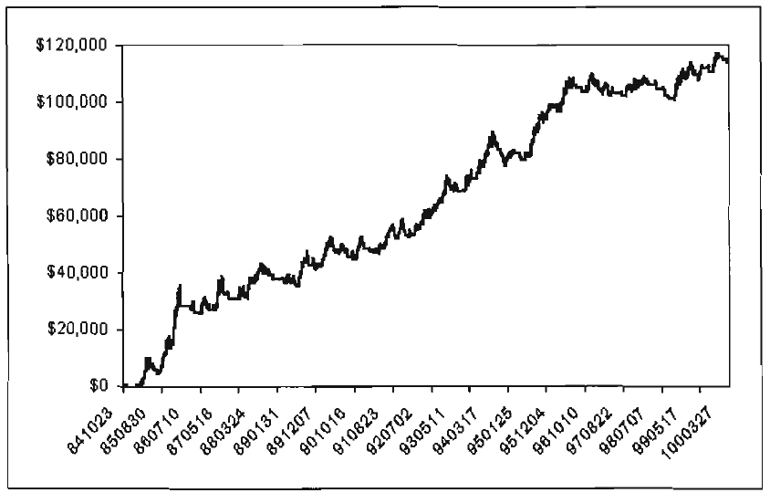

# Chapter 12: Designing a Profitable Trading System

> With and science triumph again over ignorance
> and superstition.
> -John Ehlers

In this chapter we develop a completely automatic trading system called the SineTrend Automatic System based on the rules that we develop in the previous chapters. Our fundamental approach is to trade using the Trend Mode rules when the market is in a Trend Mode and trade using the Cycle Mode rules when the market is in a Cycle Mode. The code shown in Figure 12.1 is a complete trading system using these rules strictly from a theoretical perspective. There is absolutely no accommodation for real trading situations or specific personalities of the commodity or stock being traded.

```easylanguage
Inputs:
    Price((H+L)/2);

Vars:
    Smooth(0),
    Detrender(0),
    I1(0),
    Q1(0),
    jI(0),
    jQ(0),
    I2(0),
    Q2(0),
    Re(0),
    Im(0),
    Period(0),
    SmoothPeriod(0),
    SmoothPrice(0),
    DCPeriod(0),
    RealPart(0),
    ImagPart(0),
    count(0),
    DCPhase(0),
    DCSine(0),
    LeadSine(0),
    Itrend(0),
    Trendline(0),
    Trend(0),
    DaysInTrend(0);

If CurrentBar > 5 then begin
    Smooth = (4*Price + 3*Price[1] + 2*Price[2] + Pricer[3]) / 10;
    Detrender = (.0962*Smooth + .5769*Smooth[2] - .5769*Smooth[4] - .0962*Smooth[6])*(.075*Period[1] + .54);

    {Compute Inphase and Quadrature components}
    Q1 = (.0962*Detrender + .5769*Detrender[2] - .5769*Detrender[4] - .0962*Detrender[6])*(.075*Period[1] + .S4);
    I1 = Detrender[3];

    {Advance the phase oIf1 and Q1 by9 0 degrees}
    jI = (.0962*I1 + .5769*I1[2] - .5769*I1[4] - .0962*I1[6])*(.075*Period[1] + .54);
    jQ = (.0962*Q1 + .5769*Q1[2] - .5769*Q1[4] - .0962*Q1[6])*(.075*Period[1] + .54);

    {Phasor addition fo3r bar averaging)}
    I2 = I1 - jQ;
    Q2 = Q1 + jI;

    {Smooth theI and Q components before applying the discriminator}
    I2 = .2*I2 + .8*I2[1];
    Q2 = .2*Q2 + .8*Q2[1];

    {Homodyne Discriminator}
    Re = I2*I2[1] + Q2*Q2[1];
    Im = I2*Q2[1] - Q2*I2[1];
    Re = .2*Re + .8*Re[1];
    Im = .2*Im + .8*Im[1];

    If Im <> 0 and Re <> 0 then Period = 360/ArcTangent(Im/Re);
    If Period > 1.5*Period[1] then Period = 1.5*Period[1];
    If Period < .67*Period[1] then Period = .67*Period[1];
    If Period < 6 then Period = 6;
    If Period > 50 then Period = 50;

    Period = .2*Period + .8*Period[1];
    SmoothPeriod = .33*Period + .67*SmoothPeriod[1];

    {Compute Dominant Cycle Phase}
    SmoothPrice = (4*Price + 3*Price [1]+ 2*Price[2] + Price[3]) / 10;
    DCPeriod = IntPortion(SmoothPeriod + .5);
    RealPart = 0;
    ImagPart = 0;
    For count = 0 To DCPeriod - 1 begin
        RealPart = RealPart + Cosine(360*count/DCPeriod) * (SmoothPrice[count]);
        ImagPart = ImagPart + Sine(360*count/DCPeriod) * (SmoothPrice[count]);
    End;

    If AbsValue(Rea1Part) > 0 then DCPhase = Arctangent(ImagPart/Realpart);
    If AbsValue(Rea1Part) <= 0.001 then DCPhase = 90 * Sign(1magPart);
    DCPhase = DCPhase + 90;

    {Compensate for one bar lag of the Weighted Moving Average}
    DCPhase = DCPhase + 360 / SmoothPeriod;

    If ImagPart < 0 then DCPhase = DCPhase + 180;
    If DCPhase > 315 then DCPhase = DCPhase - 360;

    {Compute the Sine and LeadSine Indicators}
    DCSine = Sine(DCPhase);
    LeadSine = Sine(DCPhase + 45);

    {Compute Trendline as simple average over the measured dominant cycle period}
    ITrend = 0;
    For count = 0 to DCPeriod 1 begin
        ITrend = ITrend + Price[count];
    End;

    If DCPeriod > 0 then ITrend = ITrend / DCPeriod;
    Trendline = (4*ITrend + 3*ITrend[1] + 2*ITrend[2] + ITrend[3]) / 10;
    If CurrentBar < 12 then Trendline = Price;

    {Assume Trend Mode}
    Trend = 1;

    {Measure days in trend from last crossing of the Sinewave Indicator lines}
    If Sine(DCPhase) Crosses Over Sine(DCPhase + 45)
        or Sine(DCPhase) Crosses Under Sine(DCPhase + 45) Then begin
        DaysInTrend = 0;
        Trend = 0;
    End;

    DaysInTrend = DaysInTrend + 1;
    If DaysInTrend < .5*SmoothPeriod then Trend = 0;

    {Cycle Mode if delta phase is +/- 50% of dominant cycle change of phase}
    If SmoothPeriod <> 0 and (DCPhase - DCPhase[1] > .67*360/SmoothPeriod and DCPhase - DCPhase[1] < 1.5*360/SmoothPeriod) then Trend = 0;

    {Declare a Trend Mode if the SmoothPrice is more than 1.5% from the Trendline}
    If AbsValue((SmoothPrice - Trendline)/Trendline) >= .015 then Trend = 1;

    If Trend = 1 then begin
        If Trend[1] = 0 then begin
            If MarketPosition = -1 and SmoothPrice >= Trendline then buy;
            If MarketPosition = 1 and SmoothPrice < Trendline then sell;
        End;
        If SmoothPrice Crosses Over Trendline then buy;
        If SmoothPrice Crosses Under Trendline then sell;
    End;

    If Trend = 0 then begin
        If LeadSine Crosses Over DCSine then buy;
        If LeadSine Crosses Under DCSine then sell;
    End;
End;
```

**Figure 12.1** *EasyLanguage code for an Automatic SineTrend Trading System.*

This code was first applied to the Treasury Bonds futures contract because the system trades both long and short with equal facility. The Treasury Bond data were a back-adjusted continuous contract covering the period from 9 July 1984 to 16 June 2000, a period of 15.54 years. (A back-adjusted continuous contract is created by stringing real contracts together and adjusting all prices in the previous contract by the price difference between contracts at the rollover date. The process is repeated for each new previous contract). Adding a \$1,000  moneymanagement stop, the results right out of the box are shown in Figure 12.2. Phenomenal! The $398 average profit per trade with a 40 percent success rate on only $12,500 maximum drawdown is competitive with any commercially available Treasury Bond trading system. About 80 percent of the profits were made on long side trades.

I was curious as to how much of the action was contributed by the Trend Mode and how much was contributed by the Cycle Mode. I therefore simply deleted the four lines of code that made the Cycle Mode trades and ran the system again on the same Treasury Bond data. The results of the Trend Mode-only trading are given in Figure 12.3.

| Metric | Value | Metric | Value |
| --- | --- | --- | --- |
| Total Net Profit | $92,875.00 | | |
| Gross Profit | $201,031.25 | Gross Loss | ($108,156.25) |
| Total # of trades | 233 | Percent profitable | 40.77% |
| Number winning trades | 95 | Number losing trades | 138 |
| Largest winning trade | $15,468.75 | Largest losing trade | ($1,156.25) |
| Average winning trade | $2,116.12 | Average losing trade | ($783.74) |
| Ratio avg win/avg loss | 2.70 | Avg trade (win & loss) | $398.61 |
| Max consec. winners | 5 | Max consec. losers | 11 |
| Avg # bars in winners | 20 | Avg # bars in losers | 5 |
| Max intraday drawdown | ($12,500.00) | | |
| Profit Factor | 1.86 | Max # contracts held | 1 |

**Figure 12.2** *Original SineTrend performance summary on Treasury Bonds - 9 July 1984 to 16 June 2000.*

| Metric | Value | Metric | Value |
| --- | --- | --- | --- |
| Total Net Profit | $19,968.75 | | |
| Gross Profit | $39,093.75 | Gross Loss | ($59,062.50) |
| Total # of trades | 81 | Percent profitable | 18.52% |
| Number winning trades | 15 | Number losing trades | 66 |
| Largest winning trade | $8,218.75 | Largest losing trade | ($1,000.00) |
| Average winning trade | $2,606.25 | Average losing trade | ($894.89) |
| Ratio avg win/avg loss | 2.91 | Avg trade (win & loss) | $246.53 |
| Max consec. winners | 2 | Max consec. losers | 12 |
| Avg # bars in winners | 38 | Avg # bars in losers | 8 |
| Max intraday drawdown | ($23,343.75) | | |
| Profit Factor | 0.66 | Max # contracts held | 1 |

**Figure 12.3** *SineTrend trend only performance summary on Treasury Bonds -- 9 July 1984 to 16 June 2000.*

These results are simply awful! The average profit per trade dropped to negative territory before any rational allowance for slippage and commission! The first thing these results indicate is that the system is being carried by Cycle Mode trades. At this point, it seems prudent to make a concession to real-world realities and try to modify the Trend Mode rules. One of the easiest things to do is change the computation of the Instantaneous Trendline. By increasing or decreasing the Instantaneous Trendline SMA length, the resulting Instantaneous Trendline will be either more reactive or will react slower. If we change the code by using a CycPart multiplier, the SMA length is still related to the period of the measured dominant cycle. The code fragment for the Trendline calculation was changed as indicated in Figure 12.4. After changing the code, optimizing on a CycPart of 1.15, and increasing the money-management stop to $1,100, the results indicated in Figure 12.5 were obtained. These changes and optimizations are not "curve fitting'' because the testing covered a 16-year span and the results carry a substantial tradeto-parameter ratio.

```easylanguage
{Compute Trendline as simple average over the measured dominant cycle period}
ITrend = 0;
IntPeriod = IntPortion (CycPart*SmoothPeriod + .5);

For count = 0 to IntPeriod 1 begin
    ITrend = ITrend + Price [count];
End;
If DCPeriod > 0 then ITrend = ITrend / IntPeriod;

Trendline = (4"ITrend + 3*ITrend[1] + 2*ITrend[2] + ITrend[3]) / 10;
If CurrentBar < 12 then Trendline = Price;
```

**Figure 12.4** *Code fragment for optimizable Instantaneous Trendline calculation.*

| Metric | Value | Metric | Value |
| --- | --- | --- | --- |
| Total Net Profit | $113,525.00 | | |
| Gross Profit | $205,000.00 | Gross Loss | ($91,475.00) |
| Total # of trades | 191 | Percent profitable | 44.5% |
| Number winning trades | 85 | Number losing trades | 106 |
| Largest winning trade | $16,062.50 | Largest losing trade | ($1,125.00) |
| Average winning trade | $2,411.76 | Average losing trade | ($862.97) |
| Ratio avg win/avg loss | 2.79 | Avg trade (win & loss) | $594.37 |
| Max consec. winners | 5 | Max consec. losers | 8 |
| Avg # bars in winners | 24 | Avg # bars in losers | 6 |
| Max intraday drawdown | ($8,137.50) | | |
| Profit Factor | 2.24 | Max # contracts held | 1 |

**Figure 12.5** *SineTrend performance summary on Treasury Bonds, modified CycPart = 1.15, money-management stop = $1,100-9 July 1984 to 16 June 2000.*

These results are outstanding! The net profit has been increased by 22 percent over the original system. The increased net profit and reduced number of trades have produced nearly a 50 percent increase in the average profit per trade. Further, the maximum drawdown over the 15-year period was reduced by 35 percent. Incidentally, going back and checking on the Trend Modeonly performance after the Instantaneous Trendline was optimized, got the results shown in Figure 12.6. Now the Trend Mode has been enhanced to carry its share of the load. The optimization resulted from a minor increase in the period to calculate the Instantaneous Trendline.

| Metric | Value | Metric | Value |
| --- | --- | --- | --- |
| Total Net Profit | $43,062.50 | | |
| Gross Profit | $98,906.00 | Gross Loss | ($55,843.75) |
| Total # of trades | 67 | Percent profitable | 35.82% |
| Number winning trades | 24 | Number losing trades | 43 |
| Largest winning trade | $16,062.50 | Largest losing trade | ($1,781.25) |
| Average winning trade | $4,121.09 | Average losing trade | ($1,298.69) |
| Ratio avg win/avg loss | 3.17 | Avg trade (win & loss) | $642.72 |
| Max consec. winners | 4 | Max consec. losers | 6 |
| Avg # bars in winners | 52 | Avg # bars in losers | 13 |
| Max intraday drawdown | ($10,956.25) | | |
| Profit Factor | 1.77 | Max # contracts held | 1 |

**Figure 12.6** *SineTrend performance summary on Treasury Bonds (Trend Mode-only), modified CycPart = 1.15, money-management stop = $1,500-9 July 1984 to 16 June 2000.*

The continuous and sustained equity growth of this SineTrend Automatic System over the 15-year period indicates just how robust this system is. A major contribution to its robustness is the fact that the underlying principles of the system were based purely on theoretical considerations. Equity growth is shown in Figure 12.7.

The obvious question to ask now is whether the SineTrend Automatic System works with contracts other than Treasury Bonds. Since the system is based purely on theory, the answer is that it should be universal. There are bound to be some issues for which it trades better than others, however. To test the premise that it can be applied to other securities, I applied the modified SineTrend to the back-adjusted Swiss Franc futures contract over the period from 13 February 1975 to 1 June 2000. When the CycPart input was optimized for 1.10 and the money-management stop was set at $2,200, I obtained the results shown in Figure 12.8.



**Figure 12.7** *Equity Curve.*

| Metric | Value | Metric | Value |
| --- | --- | --- | --- |
| Total Net Profit | $139,212.50 | | |
| Gross Profit | $366,575.00 | Gross Loss | ($227,362.50) |
| Total # of trades | 460 | Percent profitable | 50.87% |
| Number winning trades | 234 | Number losing trades | 226 |
| Largest winning trade | $12,712.50 | Largest losing trade | ($3,200.00) |
| Average winning trade | $1,566.56 | Average losing trade | ($1,006.03) |
| Ratio avg win/avg loss | 1.56 | Avg trade (win & loss) | $302.64 |
| Max consec. winners | 9 | Max consec. losers | 8 |
| Avg # bars in winners | 16 | Avg # bars in losers | 7 |
| Max intraday drawdown | ($18,187.50) | | |
| Profit Factor | 1.61 | Max # contracts held | 1 |

**Figure 12.8** *SineTrend performance summary on Deutschemark, modified Cyc-Part = 1.10, money-management stop = $2,200-13 February 1975 to 1 June 2000.*

The results of the SineTrend Automatic Trading System are more than respectable-they are on par with the results obtained by most commercially available trading systems. The average profit per trade is $302. The probability of success is over 50 percent. The ratio of average win to average loss is 1.56:1. Joe Krutsinger calls this the "daddy-goes-to-town number," meaning that every time daddy goes to town he brings home $1.50 when he is a winner as opposed to giving up $1 when he is a loser.

The SineTrend system, as presented, is just a core from which much more sophisticated and profitable systems can be spawned. The trading rules I have provided are extremely simple. There is an infinite number of ways these rules can be enhanced. For example, we know the Sinewave Indicator crosses one-eighth of a cycle before the turning point. For longer cycle periods, we could be entering and exiting the Cycle Mode trades too early. It would not be terribly difficult to add a lag factor relating to the measured period before entering Cycle Mode trades. There may even be better or more reactive ways to switch between the Trend Mode and the Cycle Mode. A correct mode determination is bound to have a profound effect on the trading system because deciding the mode is the primary decision to be made before the rules are applied. It is my desire to turn you loose on making the system better. I look forward to hearing of your successes.

## Key Points to Remember

- The SineTrend Automatic Trading System switches trading rules depending on the mode of the market.
- In the Trend Mode, trades are made on the basis of the SmoothPrice crossing the Instantaneous Trendline.
- In the Cycle Mode, trades are made on the basis of the crossing of the Sinewave Indicator lines.
- The automatic trading system based on theoretical principles performs on par with commercially available systems right out of the box.
