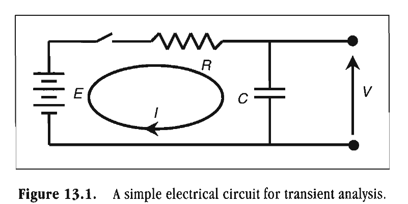

# Z TRANSFORMS

The real danger is not that computers will begin to
think like men, but that men will
begin to think like computers.
-SYDNEY J. HARRIS
The purpose for invoking transform arithmetic is to apply a tool
toward solving a differential equation problem by using simple
algebra. Without this tool, many of the problems we encounter would be intractable. There are many kinds of transforms.
For example, Mellin and Legendre Transforms exist for working in
cylindrical and spherical coordinates. Hankel and Meijer Transforms exist for working with Bessel Functions. The list goes on
and on.
The data with which we deal in trading are sampled data. We
sample the data once per bar regardless of the time frame.
Many price charts are displayed as daily data. The
sampling basis is equally valid for other sampling periods, such
as weekly, hourly, or even one-minute bars. All information
scales to the sampling period. The correct transform tool to use
for this data is the Z Transform. We describe the Z Transform in
this chapter so that we can later assess the transfer characteristics of more complicated filters. It is instructive to review
several other transforms so that we can relate our problem solutions to real-world situations, achieving greater insight into
both the problem and its solution. Because most traders have
had no previous exposure to this powerful tool, I explain transform arithmetic in the simplest possible manner and only in
terms of how it applies to trading.

Laplace Transform
The Laplace Transform is used, among other purposes, to solve
for the transient conditions in electrical circuits. As an illustration, a simple electrical circuit is shown in Figure 13.1. A transient occurs after the switch is closed. We will show the solution
for how the voltage V changes as a function of time after the
switch is closed. From physics we know that the current flowing
through a capacitor is proportional to the size of the capacitor
and the rate change of voltage across it. The equation for current
flow is
dV

$$I=C-$$

dt
After the switch is closed, current flows through the resistor,
through the capacitor, and is returned to the battery that has a
voltage E. From Ohm's Law, the voltage V is the battery voltage
less the current multiplied by the Resistance R. That is,
dV

$$V=E-IR=E-RC-$$

dt
We now have a differential equation to solve for V as a function
of time. Differential equations are pretty scary stuff, so let us

*Figure 13.1. A simple electrical circuit for transient analysis*

invoke the Laplace Transform by substituting the Laplace Operator S for the calculus operator (d/dt). Our equation now becomes

$$V=E - RCSV$$

v sv
" RC - " RC
-
V= RC, E
S+-
RC
Amazing! We have solved the problem for the voltage V using
only simple algebra. More precise, V is a function of the Laplace
Operator, and should be written as

$$V(s1= RC E$$

S+-
RC
In general, the output function Y(s) is equal to the input function
X(s) multiplied by the system transfer response H(s). In other
words, the system transfer response is the X(s)/Y(s) ratio.
We really want the solution for voltage as a function of time.
The way we do this is to compare the relationship between the
Laplace Transform and the solution in the time domain. Transform pairs for these solutions can be found in many handbooks
and textbooks on the subject. In this case, we find that the transform pair is
U (1- e-"')
S+a

By examining like terms, we immediately have the solution for
voltage in the time domain as

$$V(t )= E(1 -$$

Thus, we have solved a relatively complex differential equation
using the Laplace Transform and simple algebra. In the S Domain, the output is the input multiplied by the transfer response
of the system. In other words, the transfer response is the ratio
of the input to the output. In this format, the transfer function
can describe filters independent of the input driving function. In
our example, the input is the constant battery voltage E. This
input is multiplied in the S Domain (and in the time domain
because it is a constant) by the transfer response of the RC filter.
We will see this form of equation again when we examine Z
Transforms.
Fourier Transform
What Laplace Transforms are for transient analysis, Fourier
Transforms are for steady-state analysis. Recalling that the
expression for complex frequency is e'"t, when we take the
derivative of the complex frequency we get d(ei"')/dt = jo e'"t. So
the Fourier Transform operator for the rate of change is jo
instead of S. The Fourier and Laplace Transforms share many
common characteristics.
Fourier Transforms are the tools we use to describe relationships in the time domain and frequency domain. For example,
an impulse in the frequency domain is a definition of a pure
monotonic cycle. This cycle is a sine wave in the time domain.
Fourier Transforms have many applications for the solution of
physical problems. For example, the relationship between the
pattern across a lens and the projected image constitute a
Fourier Transform pair. Similarly, the relationship between the
aperture distribution of an antenna and the radiation pattern,
somewhat analogous to a flashlight beam, is a Fourier Transform pair.

Z Transform
Just as Laplace and Fourier Transforms are powerful tools for
continuous systems, Z Transforms provide a corresponding
powerful tool for discrete systems. There are significant parallels between Z Transforms and Fourier Transforms. The Z
Transform can be multiplied by the transfer response of a system to obtain a Z Transform of the system output. The sampled
data output for a discrete system can be found by taking the
inverse Z Transform. Because this theory is so important to digital signal processing, a brief review of Z Transform theory is in
order.
We begin by defining a sequence of samples of the form xo, x1,
x2, x3, and so on. We designate the sequence of values by {x(nT)},
or because the sampling period T can be considered unity, so
simply {x(n)}. The sequence may consist of a finite number of
samples or can be infinite in extent. The Z Transform of the sequence is given as

$$Z{x(n)=] x(n)z-.$$

n=O
since all values of x are for n < 0. Suppose the sequence {x(n)}
consists of an infinity of values as
{x(n)} = {a, a2, a3, a4, . . . } = {a}.
where a 0. The Z Transform for the sequence is
2 1 2

$$X(z)= x(n)z-n= (a).z-" = (az-l).$$

n=O n=O n=O
Designating the common ratio as r = az-1, the Z Transform is
recognized as the geometric progression 1, r, r2, r3, r4,. . . . The
sum of the terms of this progression is
1- r^n

$$S=-$$

1- r

Since r is less than unity and n approaches infinity, the sum simplifies to S = 1/(1 - r). Substituting r = az-1, we obtain

$$X(z)= 1 - - - z$$

1-az-1' z-a
We can now find the Z Transform of a step function where
x(n) = 0 for n < 0 and x(n) = 1 for n >= 0. In this case,

$$X(z)= z- =-- - z$$

$$n=O z-$$

One of the more interesting and useful properties of the Z
Transform is the effect of a one sample delay on a function. Suppose a sequence is given by
the Z Transform of this sequence is
Now, suppose the sequence is delayed by one sample time. The
Z Transform of the output sequence then is given by
Y(z) = x(0)z-1 + x(1)z-2 + x(2)z-3 + . . .
Or simply

$$Y(z)= X(z)z-1$$

That is, a one sample time delay is equivalent to multiplying the
Z Transform by z-1. An additional delay results in an additional
factor of z-1, and so on. This can be seen in equation form as
x[n] +
x(n - 1) + x(z)z-1
x(n - 2) -> x(z)z-2

For a transform to work, there must be an inversion. Since
Z{x(n)} = X(z), then the inverse operation is written as Z-1[X(z)] =
x(n). There are several ways to obtain the inverse transform, but
perhaps the easiest is suggested by the original definition of the
Z Transform. The expansion of X(z) into a sum of inverse powers of z will exhibit x(n) as coefficients of the expansion. When
X(z) is a rational fraction, the expansion can be made by long
division. For example, we can find the Inverse Z Transform for
the step function whose Z Transform was
z

$$X(z)= -$$

z- 1
Performing the long division, we obtain
1 + z-1 + z-2 + z-3 + . . .
z - 1)z
z-1
1 - z-1
z-1
-
z-1 z-2
-
z-2 z-3
z-3
We have thus re-created the original step function with which
we started. We can also create some common Z Transform pairs
by inspection. For example, we know that
z

$$Z[an} = -$$

z-a
We can substitute e-kT = e-k for a (since e-k is a number less than
unity and the sampling period is unity) and obtain
z

$$Z{e-k} = -$$

z - e-k
We now have a transform pair for an exponential function.

138 Rocket Science for Traders
Another obvious transform pair exists for an impulse function. The impulse function will have a value only during the
first sample. Its Z Transform is therefore unity. It follows that
the impulse delayed by q samples is z-q.
Approximations of Analog Transfer Functions
Occasionally, it is desirable to convert a known analog transfer
function in the S Domain into a digital transfer function. This is
most often done with the transfer function of a low-pass or bandpass filter, such as a Butterworth or Chebyshev type, because of
the wealth of development and experience with these filters.
There are two ways to perform this conversion. We describe
only the impulse invariant method because it directly relates
the electrical circuit described earlier in this chapter to an Exponential Moving Average (EMA).
The impulse invariant method consists of finding the
impulse response of the analog filter h(t) and setting t = nT. The
Z Transform of the quantized impulse response is taken so that
H(z) = Z{h(nT)}. It is key to factor the analog transfer response
and use a partial fraction expansion so that the equation can be
written in the following form:
where pi represents the ith pole (the point at which the denominator goes to zero), Ai is the magnitude associated with the ith
pole, and N is the number of poles. The impulse response is
given by the Inverse Laplace Transform, which has the following
form:

$$h(t)= AiePit$$

i= 1
Since each pole in the S Domain gives rise to an exponential
term in the time domain, at the sample times we have

c

$$h(nT)= Aiepint$$

i= 1
We have derived the Z Transform of an exponential as
Therefore, the Z Transform of the impulse response is
Recalling that the transfer response of the resistor-capacitor analog filter is given by
l
RC

$$H(s)=$$

S+-
RC
The transfer response has a single pole located at S = -1/RC. We
can immediately substitute like terms to obtain the digital
transfer response to be
z
Simplifying, by letting (1- a) = e-1/RC, the equation becomes
AZ

$$H(z)=$$

z-(1-a)
and the frequency response of the digital filter transfer response
is given as

The critical, or cutoff, frequency is that point at which the amplitude of the two terms in the denominator are equal. Since w =
2π/P0, where Po is the period corresponding to the cutoff frequency, the critical period is
-2π
-ln(1 -a)
"
PO
-2π
Po =
ln(1 - a)
This is exactly the cutoff period we asserted for an EMA in
Chapter 3. Alternatively, if we know the desired cutoff period,
we can calculate the EMA a as
Let us look at the transfer response in greater depth.
- A
-
1 - (1- a)z-1
mA
-
X(z) 1 - (1- a)z-1

$$Y(z)- (1 - a)Y(z)z-1 = Ax(z)$$

Converting to the digital domain, and noting that z-1 notates a
one period delay, we get

$$y- (l- a)y_{l} =Ax$$

$$y=Ax+(l -a)y_{l}$$

If we have a step function input of unity amplitude, the output
must also reach unity when the number of periods is large.
Therefore, A must equal a. We conclude that the digital equivalent of our resistor-capacitor is

$$y= ax+ (1- a)y_{l}$$

This is exactly the equation for an EMA. In other words, the
EMA is the equivalent of a RC low-pass filter in the physical
world.
Key Points to Remember
Transform arithmetic is used to algebraically solve differential equation or difference equation problems that would be
intractable otherwise.
In the Z Domain, the output is equal to the product of the
input and the transfer response.
The transfer response describes the performance of filters
independently from the input driving function.
Laplace, Fourier, and Z Transforms are related.
