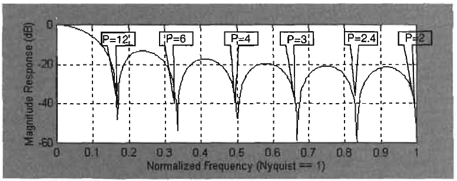
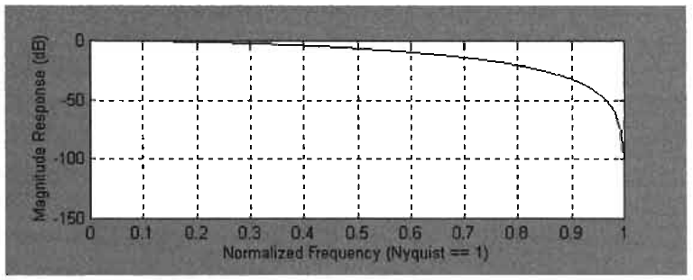
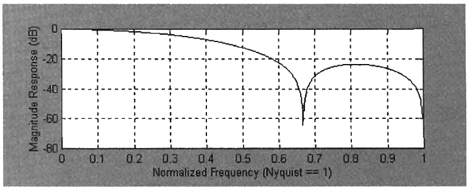
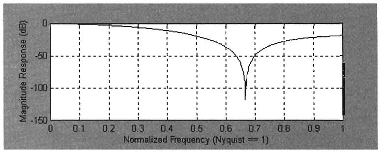
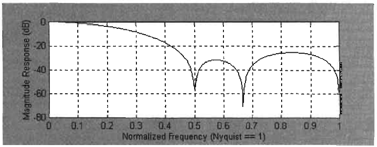

# Chapter 14: Finite Impulse Response Filters

> There is nothing permanent except change.
> -HERACLITUS

A Simple Moving Average (SMA) is one example of a Finite Impulse Response (FIR) filter. Spoken, these filters are alternatively pronounced "eff-eye-are" or "fur" filters. FIR filters have no corollary in the physical world-they exist only as digital computations. Their unique characteristic is that their impulse response is exactly the same as their coefficients. An impulse as input digital data is simply unity for one sample and zero for all other samples. As this impulse ages out, that is, as it is successively delayed, it excites each element of the filter successively, sweeping out the amplitude of the filter coefficients. Thus, the impulse response is the same as the filter coefficients. The general time response of a FIR filter is

$$y_n = h_0 x + h_1 x[1] + h_2 x[2] + h_3 x[3] \ldots h_{(N-1)} x[N-1]$$

Or, more concisely

$$y_n = \sum_{i=0}^{N-1} h_i x[N-i]$$

Taking the Z Transform gives us

$$Y(z) = \sum_{i=0}^{N-1} h_i X(z) z^{-i}$$

so that the transfer response is

$$H(z) = \frac{Y(z)}{X(z)} = \sum_{i=0}^{N-1} h_i z^{-i}$$

Note that if the transfer response is expressed as a rational fraction, the response of the FIR filter is all zeros. That is, there is no denominator other than unity. From the fundamental theorem of algebra, the Nth order polynomial describing the transfer response can be factored into N terms, each of which is a zero of the polynomial. Moving average filters are characterized as having all-zero responses.

The lag of a FIR filter is equal to the location along the filter where the sum of the coefficients is equal to half the sum of coefficients in the entire filter. In mathematical form, this condition is expressed as

$$\sum_{i=1}^{Lag} h_i = \frac{1}{2} \sum_{i=1}^{N-1} h_i$$

Note that the first coefficient, the one with zero lag, is not used.  Perhaps an easier way to picture the lag is to imagine the filter coefficients describing the height of a geometrical shape. If you were to draw this shape on a piece of paper and cut it out with a pair of scissors, the lag would be equal to the center of gravity. That is, it would be equal to the balance point of the shape. FIR filters are usually symmetric about their center so that lag is exactly the center of the filter.

Weighted Moving Averages (WMA) are FIR filters that are not symmetric about their center point. This gives them the advantage of having less lag. The output of a 4-bar WMA is

$$y = (4x + 3x[1] + 2x[2] + x[3])/10$$

so that the coefficients are 4, 3, 2, and 1. Discarding the first coefficient, we see that the second coefficient is equal to the sum of all the coefficients (excluding the first). Therefore, a 4-bar WMA has a 1-bar lag. As a second example, the output of a 7-bar WMA is

$$y = (7x + 6x[1] + 5x[2] + 4x[3] + 3x[4] + 2x[5] + x[6])/28$$

In this case, the coefficients are 7, 6, 5, 4, 3, 2, and 1. After discarding the first zero-lag coefficient, the sum of the next two coefficients is equal to half the total sum. Therefore, a 7-bar WMA has a lag of 2 bars.

A big advantage of symmetrical FIR filters is that lag is constant regardless of the frequency of the signal being applied to the input of the filter. This means that there is no time distortion due to the filtering. The phase lag will be linear. Suppose the time lag is 4 bars. This means there is 180 degrees of phase lag to an 8-bar cycle period, 90 degrees of phase lag to a 16-bar cycle period, and only 45 degrees of phase lag to a 32-bar cycle period.

The phase lag that results from a WMA is nearly linear throughout the passband of the filter. One nice thing about the WMA is that higher-frequency components at and above the critical band-pass frequency are delayed less than the frequency components within the passband. This means that distortion tends to work in favor of the trader by delaying the higherfrequency wiggles less than the lag of the smoothed output.

The truth is that many of the benefits of FIR filters are unavailable to traders because the length of the filter must be  relatively long to synthesize interesting passbands. As a result, the induced lag is prohibitive. However, we can perform some innovative tricks and put FIR filters to good use. For example, in Chapter 3 we showed how an SMA length can be adjusted to notch out undesired frequency components. Figure 3.5 is repeated here as Figure 14.1 to demonstrate this effect. The SMA has a notch in its frequency response for those cycle components having an integer number of cycles across the width of the filter.

An SMA is a FIR filter that has uniform amplitude coefficients. The transfer response can be viewed as a rectangle over the finite duration of the filter. The Fourier Transform of this  rectangle is a Sin(X)/X distribution, which is exactly what is displayed in Figure 14.1. The numerator of this function goes to zero each time X goes through a multiple of 180 degrees. If L is the length of the FIR filter and P is the period of the signal variable being applied to it, the frequency response of the SMA FIR filter in radian measure is

$$H(\omega) = \frac{Sin\left(\frac{\pi L}{P}\right)}{\frac{\pi L}{P}}$$

**Figure 14.1** *Frequency response of a 12-bar SMA.*

Note that the Sin(X)/X distribution has lobes in the response between the notches. Smoothing the time-domain response can lower these lobes. This means we must taper the coefficients of the FIR filter. When we taper the coefficients of the filter, the end elements have a smaller contribution to the filtering action than they do in the uniform amplitude case. The result is that there is less filtering action for a given length FIR-tapered filter when compared to the uniform amplitude coefficient case of the SMA. We therefore have a trade-off between the degree of outof-band filtering and the efficiency of filtering the passband. A number of amplitude tapers have been invented, each with a desired characteristic for out-of-band signal rejection. It is impractical for traders to employ these tapers, however, because of the additional lag induced by passband inefficiency. Linear coefficient tapers are adequate for most trading applications.

**Figure 14.2** *Amplitude response of a three-element linearly tapered FIR filter.*

It might be instructive to examine the passband of several linearly tapered FIR filters. Starting with one of the shortest possible, a three-element filter has a response of

$$y = (x + 2x[1] + x[2])/4$$

The lag through this filter is just to the center of the filter, which  is 1 bar. Its amplitude response is shown in Figure 14.2. The normalized frequency corresponds to a 2-bar period. So this short filter is only useful for canceling the 2-bar cycle.

The next longest FIR-tapered filter has four elements. Its response is

$$Y = (x + 2x[1] + 2x[2] + x[3])/6$$

The lag through this filter is 1.5 bars to the center of the filter. Its amplitude response is shown in Figure 14.3. The additional term has introduced a second null for a 3-bar cycle at a normalized frequency of 0.67. (The way to navigate between the normalized frequency and the cycle period is to divide the normalized frequency by 2 and then invert.) The cutoff frequency, the point at which the amplitude response is -3 dB, is at a normalized frequency of about 0.33. This corresponds to a 6-bar cycle.

**Figure 14.3** *Amplitude response of a four-element linearly tapered FIR filter.*
 
Continuing our sequence of successively longer tapered FIR filters, the response of a 5-bar filter is

$$Y = (x + 2x[1] + 3x[2] + 2x[4] + x[5])/9$$

The lag of this filter-the distance to its center-is 2 bars. The amplitude of this 5-bar tapered FIR filter is shown in Figure 14.4. We can see that something interesting has happened. The cancellation of the 2-bar cycle has been lost. Although it is difficult to see on the large amplitude scale, the cutoff frequency has been reduced when compared to that of the 4-bar filter, but not by much. This filter does not seem to be of much use.

**Figure 14.4** *Amplitude response of a five-element linearly tapered FIR filter.*

By contrast, a six-element linearly tapered FIR filter has some very interesting characteristics. Its time-domain response is

$$Y = (x + 2x[1] + 3x[2] + 3x[3] + 2x[4] + x[5])/12$$

The lag through this filter is 2.5 bars to the center of the filter. Its amplitude response is shown in Figure 14.5. Not only has the cancellation of the 2-bar cycle period returned, but also the cutoff frequency has been reduced to about 0.2, a 10-bar cycle. Furthermore, the 3-bar and 4-bar cycles have been notched out by  this filter. Attenuation between the notches is not uniform, but is nonetheless substantial. This is an excellent filter for generalpurpose use by traders.

**Figure 14.5** *Amplitude response of a six-element linearly tapered FIR filter.*

We can now continue with our filter sequence. In so doing, we would find that we would prefer to have an even number of elements in our tapered FIR filter so that the normalized unity frequency, a 2-bar cycle, is always notched out. Longer and longer cycles constitute the passband as the length of the filter is increased, with the cutoff period being about 1.5 times the length of the filter. Never forget that the lag of an N-length filter is $(N-1)/2$. Lag is the most crucial parameter of filter performance for a trader.

## Key Points to Remember

- A Simple Moving Average (SMA) is a Finite Impulse Response (FIR) filter with uniform amplitude filter coefficients.
- Symmetrical FIR filters have no time distortion and, therefore, have a linear phase delay.
- The lag of a FIR filter is the center of gravity of the filter coefficients.
- A Weighted Moving Average (WMA) has linear phase delay across its passband.
- A WMA always has less lag outside the passband than it has for cycle components within the passband.
- A 4-bar WMA has a lag of 1 bar.
- A 7-bar WMA has a lag of 2 bars.
- A six-element symmetrically, linearly tapered FIR filter is one of trading's most interesting and useful filters.
- The passband period of a symmetrically, linearly tapered FIR filter is approximately 1.5 times the length of the filter.
