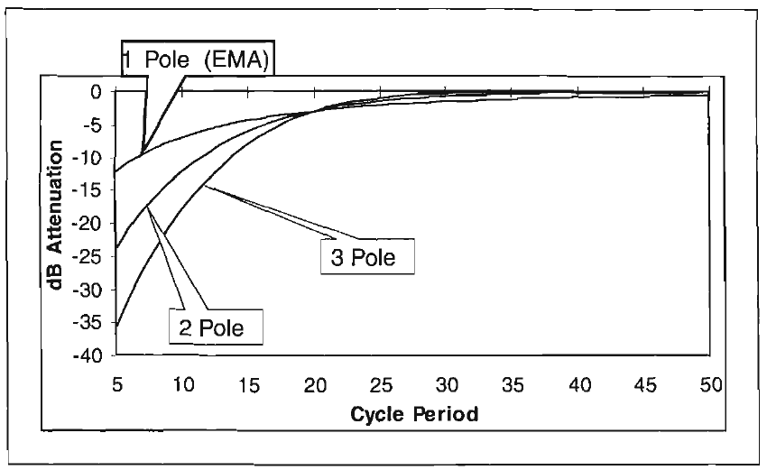
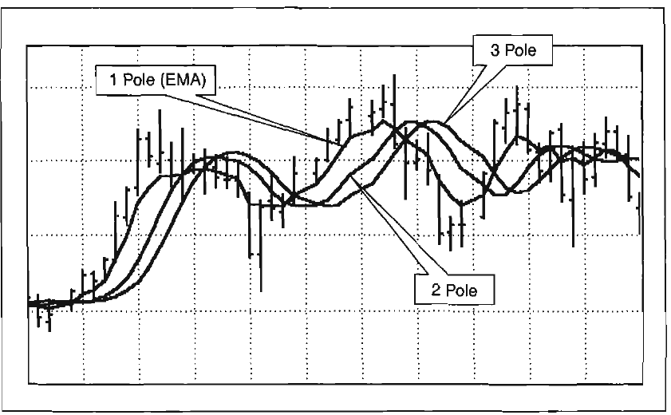
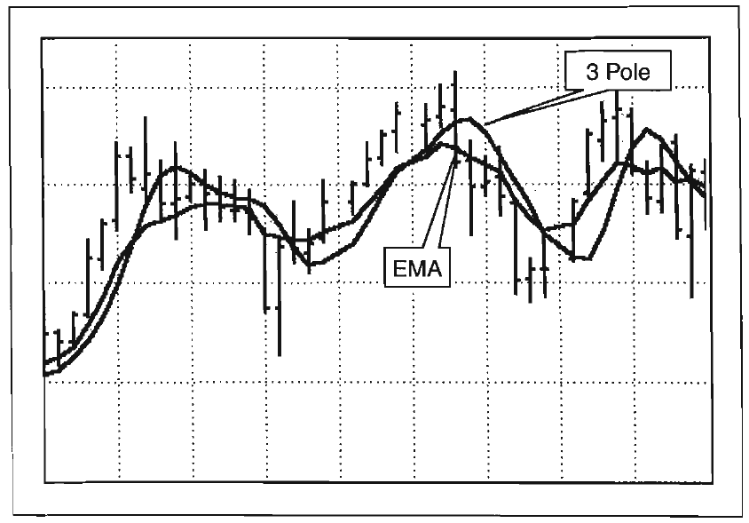
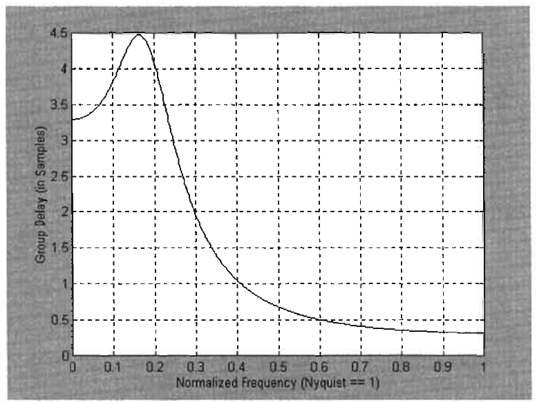
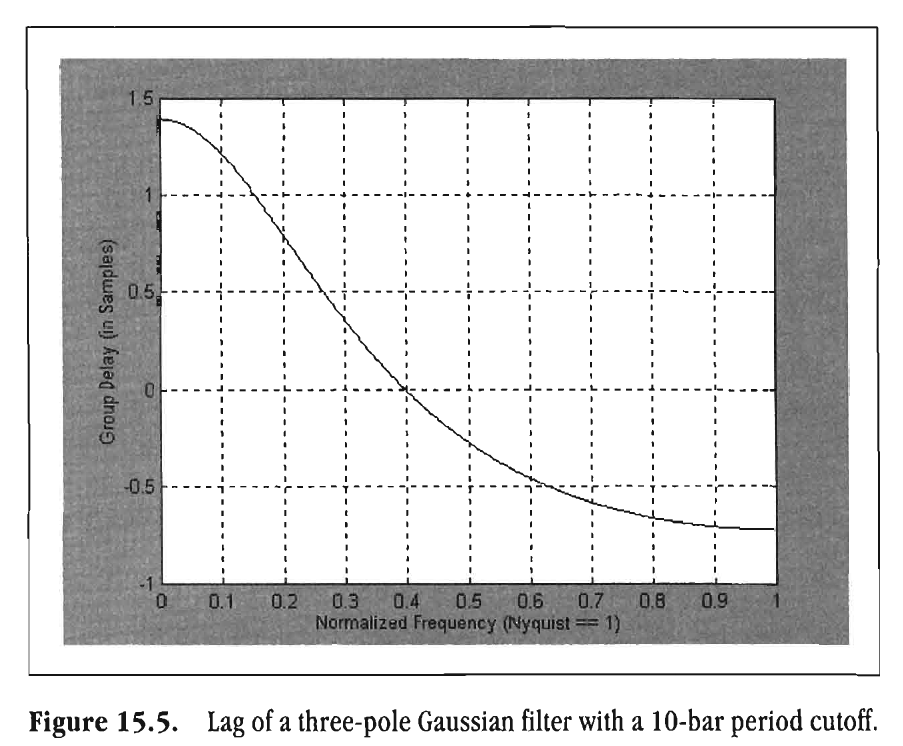
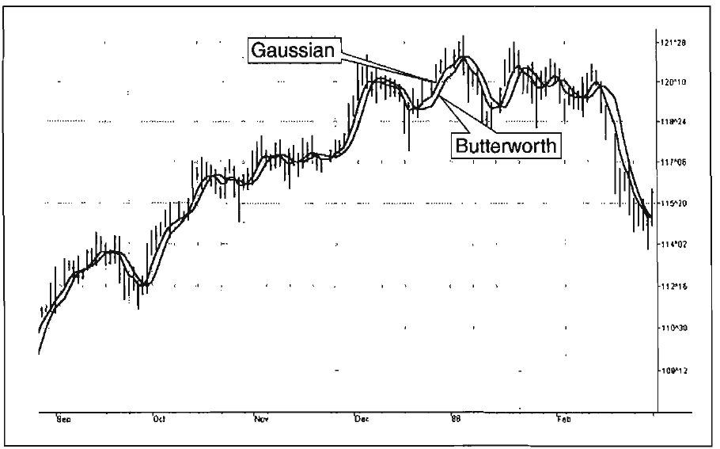

# Chapter 15: Infinite Impulse Response Filters

> Everyone is a child of his past.
> -EDNA G. ROSTOW

An Exponential Moving Average (EMA) is one example of an Infinite Impulse Response (IIR) filter. Spoken, these filters are almost always pronounced "eye-eye-are" filters. As the name implies, IIR filters ring out forever (in theory) after being stimulated by an impulse excitation, just like a bell. These filters are the digital equivalent of filters that can, and have, been designed and constructed from physical world components. As we show in Chapter 13, an EMA is one example of an IIR filter. The transfer response of the EMA is shown to be a

$$H(z)=\frac{\alpha}{1-(1-\alpha)z^{-1}}$$

As opposed to the all-zero response of the FIR filter, the transfer response of the IIR filter is expressed as a rational fraction. When we examine the Z Transform for the filtered output, we can understand why this produces the infinite impulse response. For the EMA, this is

$$Y(z)=H(z)X(z)=\frac{\alpha X(z)}{1-(1-\alpha)z^{-1}}$$

When we multiply both sides of this equation by the denominator on the right side, we obtain

$$Y(z)-(1-\alpha)Y(z)z^{-1}=\alpha X(z)$$
$$Y(z) = \alpha X(z) + (1- \alpha)Y(z)z^{-1}$$

This equation says that the current output depends not only on the current input, but also on the output one sample ago. That is, the calculation is recursive. This repeats for each subsequent sample, so that the current output always depends on all previous outputs.

The IIR filters are generally patterned after specific analog filter shapes such as Butterworth, Chebyshev, or Elliptic designs. Scaling and accuracy considerations are much more important for IIR filters than for FIR filters because the iterative calculations compound rounding errors, and good judgment must be used to determine if a particular filter is practical given the number of bits available. We must give special attention to limit cycles, which are low-level oscillations due to rounding error in computation. As rounding errors are included in each recursion, the results can be cumulative. This kind of error causes particular trouble when using EasyLanguage because Tradestation rounds floating point calculations to 4 bits. If an IIR filter blows up on you, the problem may not be a bug in your code, but may result from limit cycles. If this occurs, you must modify the design. One thing you can do is compute the filter response in a Dynamic Linked Library (DLL) that has been compiled at a higher level of precision, and call up that DLL from your EasyLanguage code.

A pole is a zero of the denominator polynomial of a filter transfer response. The EMA has a single pole in its transfer response. More complex filters use a larger number of samples of previous outputs, and therefore have a higher-order polynomial in the denominator of the transfer response. From the fundamental theorem of algebra, we know that this polynomial can be factored into zeros of the polynomial. Since the polynomial is in the denominator of the transfer response, these factors are called the poles of the response. These are the values of z-1 at which the transfer response blows up mathematically because the denominator is zero, giving an infinite result. This cannot happen in the filters because z-1 is constrained to be in integer numbers and the poles never occur at integer numbers in stable filters. Higher-order filters are called multipole filters. In trading, we are limited to just a few poles to calculate IIR responses because each pole necessarily brings additional lag. Without the lag consideration, we could theoretically continue to add an infinite number of poles to our filter design to create a stone-wall filter response at the critical period.

## Butterworth Filters

There is a host of multipole filter designs available. One of the more common multipole filter responses is called a Butterworth filter. This filter is maximally smooth at zero frequency. That is, it has the highest number of derivatives that have a null value at zero frequency. The filtering advantage of using multipole Butterworth filters is shown in the comparison in Figure 15.1. All three filters have a cutoff period at a 20-bar cycle. We clearly get more filtering with each increase in the number of poles.

The low-frequency lag of Butterworth filters can be computed by the following equation:

$$Lag = N \cdot P/\pi^2$$

where N = number of poles in the filter, P = critical period of the filter.



**Figure 15.1** *Comparison of Butterworth filters that have a 20-bar cutoff period.*



**Figure 15.2** *Responses for one-, two-, and three-pole filters having a 14-bar cutoff. Increasing the number of poles increases the lag for a common cutoff period. Chart created with TradeStation2000i by Omega Research, Inc.*

The equations for a two-pole Butterworth filter in EasyLanguage notation are

```easylanguage
a = ExpValue(-1.414*3.14159/P);
b = 2*a*Cos(1.414*180/P);
y = b*y[1]-a*a*y[2]+((1-b+a*a)/4)*(x+2*x[1]+x[2]);
```

where P = cutoff period of the two-pole filter. The equations for a three-pole Butterworth filter in EasyLanguage notation are

```easylanguage
a = ExpValue(-3.14159/P);
b = 2*a*Cos(1.738*180/P);
c = a*a;
y = (b+c)*y[1] - (c+b*c)*y[2] + c*c*y[3] + ((1-b+c)*(1-c)/8)*(x + 3*x[1] + 3*x[2] + x[3]);
```

where P = cutoff period of the three-pole filter. The merits of the higher-order filters are shown in Figures 15.2 and 15.3. Clearly, the higher-order filters offer greater fidelity when the lag is held constant.



**Figure 15.3** *One- and three-pole filter responses when equalized for a 2-bar lag. The higher order filter has greater fidelity when the lag is held constant. Chart created with TradeStation2000i by Omega Research, Inc.*

## Butterworth Filter Tables

It is often easier to use a lookup table to get filter coefficients than uniquely calculate the coefficients each time they are used. In Tables 15.1 and 15.2, the notation is defined as follows: A[0] is used with the current price data, A[n] is used with the price data [n] bars ago, A[2] is used with price data 2 bars ago, and B[n] is used with the previously calculated filter output [n] bars ago. These tables are sure to make it easier to use higher-order filters.

## Gaussian and Other Low-Lag Filters

The first objective of using smoothers is to eliminate or reduce the undesired high-frequency components in the price data.

**Table 15.1** *Two-Pole Butterworth Filter Coefficients*

| Period | A[0] | A[1] | A[2] | B[1] | B[2] |
|---|---|---|---|---|---|
| 2 | 0.285784 | 0.571568 | 0.285784 | -0.131366 | -0.011770 |
| 4 | 0.203973 | 0.407946 | 0.203973 | 0.292597 | -0.108489 |
| 6 | 0.130825 | 0.261650 | 0.130825 | 0.704171 | -0.227470 |
| 8 | 0.088501 | 0.177002 | 0.088501 | 0.975372 | -0.329377 |
| 10 | 0.063284 | 0.126567 | 0.063284 | 1.158161 | -0.411296 |
| 12 | 0.047322 | 0.094643 | 0.047322 | 1.287652 | -0.476938 |
| 14 | 0.036654 | 0.073308 | 0.036654 | 1.383531 | -0.530147 |
| 16 | 0.029198 | 0.058397 | 0.029198 | 1.457120 | -0.573914 |
| 18 | 0.023793 | 0.047586 | 0.023793 | 1.515266 | -0.610438 |
| 20 | 0.019754 | 0.039507 | 0.019754 | 1.562309 | -0.641324 |
| 22 | 0.016658 | 0.033317 | 0.016658 | 1.601119 | -0.667753 |
| 24 | 0.014235 | 0.028470 | 0.014235 | 1.633667 | -0.690607 |
| 26 | 0.012303 | 0.024607 | 0.012303 | 1.661342 | -0.710555 |
| 28 | 0.010739 | 0.021477 | 0.010739 | 1.685157 | -0.728112 |
| 30 | 0.009454 | 0.018908 | 0.009454 | 1.705862 | -0.743678 |
| 32 | 0.008386 | 0.016773 | 0.008386 | 1.724025 | -0.757571 |
| 34 | 0.007490 | 0.014980 | 0.007490 | 1.740086 | -0.770045 |
| 36 | 0.006729 | 0.013459 | 0.006729 | 1.754388 | -0.781305 |
| 38 | 0.006079 | 0.012158 | 0.006079 | 1.767204 | -0.791520 |
| 40 | 0.005518 | 0.011037 | 0.005518 | 1.778753 | -0.800827 |

**Table 15.2** *Three-Pole Butterworth Filter Coefficients*

| Period | A[0] | A[1] | A[2] | A[3] | B[1] | B[2] | B[3] |
|---|---|---|---|---|---|---|---|
| 2 | 0.170149 | 0.510448 | 0.510448 | 0.170149 | -0.336246 | -0.026816 | 0.001867 |
| 4 | 0.100733 | 0.302200 | 0.302200 | 0.100733 | 0.398405 | -0.247486 | 0.043214 |
| 6 | 0.050373 | 0.151118 | 0.151118 | 0.050373 | 1.080990 | -0.607116 | 0.123145 |
| 8 | 0.027610 | 0.082830 | 0.082830 | 0.027610 | 1.505892 | -0.934652 | 0.207880 |
| 10 | 0.016541 | 0.049622 | 0.049622 | 0.016541 | 1.783327 | -1.200263 | 0.284610 |
| 12 | 0.010629 | 0.031887 | 0.031887 | 0.010629 | 1.976163 | -1.412114 | 0.350920 |
| 14 | 0.007213 | 0.021640 | 0.021640 | 0.007213 | 2.117205 | -1.582459 | 0.407548 |
| 16 | 0.005111 | 0.015334 | 0.015334 | 0.005111 | 2.224560 | -1.721388 | 0.455938 |
| 18 | 0.003750 | 0.011250 | 0.011250 | 0.003750 | 2.308883 | -1.836396 | 0.497514 |
| 20 | 0.002831 | 0.008492 | 0.008492 | 0.002831 | 2.376806 | -1.932941 | 0.533488 |
| 22 | 0.002188 | 0.006565 | 0.006565 | 0.002188 | 2.432658 | -2.015013 | 0.564848 |
| 24 | 0.001726 | 0.005179 | 0.005179 | 0.001726 | 2.479376 | -2.085571 | 0.592385 |
| 26 | 0.001385 | 0.004156 | 0.004156 | 0.001385 | 2.519020 | -2.146834 | 0.616731 |
| 28 | 0.001128 | 0.003385 | 0.003385 | 0.001128 | 2.553078 | -2.200500 | 0.638395 |
| 30 | 0.000931 | 0.002794 | 0.002794 | 0.000931 | 2.582648 | -2.247883 | 0.657784 |
| 32 | 0.000778 | 0.002333 | 0.002333 | 0.000778 | 2.608560 | -2.290012 | 0.675232 |
| 34 | 0.000656 | 0.001967 | 0.001967 | 0.000656 | 2.631451 | -2.327708 | 0.691011 |
| 36 | 0.000558 | 0.001674 | 0.001674 | 0.000558 | 2.651819 | -2.361631 | 0.705347 |
| 38 | 0.000479 | 0.001437 | 0.001437 | 0.000479 | 2.670059 | -2.392315 | 0.718425 |
| 40 | 0.000414 | 0.001242 | 0.001242 | 0.000414 | 2.686486 | -2.420202 | 0.730403 |



**Figure 15.4** *Lag of three-pole Butterworth filter with 10-bar period cutoff.*

Therefore, these smoothers are called low-pass filters, and they  all work by some form of averaging. Butterworth low-pass filters can do this job, but nothing comes for free. A higher degree of filtering is necessarily accompanied by a larger amount of lag. We have come to see that this is a fact of life.

The downfall of most trading indicators, lag causes the failure to react to price changes in a timely manner. A better approach to filtering, therefore, is to minimize the lag and accept the resultant smoothing. The importance of lag (group delay is an engineer's way of saying lag, which distinguishes lag from the phase delay through the filter) is demonstrated in Figure 15.4. This illustrates the lag of a three-pole Butterworth filter that attenuates cycles shorter than 10 bars.

The low-frequency lag of a Butterworth filter can be estimated by the following equation, where N is the number of poles in the filter and P is the longest cycle period to pass  through the filter:

$$Lag = N \cdot P/\pi^2$$

The lag story gets worse as the frequency components of the input waveform get closer to the band edge of the filter. The higher-frequency components within the passband of the filter are actually delayed more than the lower-frequency components. This is exactly the opposite of what a trader desires. We have to react more quickly to rapid changes in the market, and we therefore prefer a smoothing filter that has less lag with the higher-frequency components.

A *Gaussian filter* is one whose transfer response is described by the familiar Gaussian bell-shaped curve. In the case of lowpass filters, only the upper half of the curve describes the filter. The use of Gaussian filters is a move toward achieving the dual goals of reducing lag and reducing the lag of high-frequency components relative to the lag of lower-frequency components. We can construct multipole Gaussian filters that provide a desired degree of smoothing. The group delay of a three-pole Gaussian filter having a 0.1 cycle per day passband is shown in Figure 15.5 for comparison to the delay produced by a Butterworth filter.

For an equivalent number of poles, the lag of a Gaussian filter is about half the lag of a Butterworth filter. More important, the higher-frequency components have even less lag than the lowfrequency components. With Gaussian filters, the lag (as a function of frequency  goes in the right direction for traders-decreased lag. However, a Gaussian filter has about half the smoothing  effectiveness as an equivalently sized Butterworth filter. A fourpole Gaussian filter has about the same smoothing performance as a two-pole Butterworth filter. Thus, performing the same amount of filtering, these two filters have about the same lowfrequency lag, but the Gaussian filter preserves the original price function with greater fidelity because the higher-frequency components within the passband are not delayed as much as those within the Butterworth filter. Comparative filter responses of a two-pole Butterworth filter and a two-pole Gaussian filter, each having a 10-bar cycle passband, are shown in Figure 15.6.

There is no magic to the Gaussian filter. It can be defined simply as the multiple application of an Exponential Moving Average (EMA). The transfer response of an EMA is

$$H(z)=\frac{\alpha}{1-(1-\alpha)z^{-1}}$$

Applying the EMA N times gives us an N-pole Gaussian filter transfer response expressed by the following equation:

$$H(z)=(\frac{\alpha}{1-(1-\alpha)z^{-1}})^N$$

At zero frequency z-1 = 1 because the Z Transform of a function is just the function itself at zero frequency. Therefore, this lowpass filter gain is unity. Also, the denominator assumes the value of aN at zero frequency. The cutoff frequency of the filter is defined as that point where the transfer response is down by 3 dB, or 0.707 in amplitude. If the transfer response is down by 3 dB, then the denominator, the only term that is a function of frequency, must be up by 3 dB, or 1.414 in amplitude. When this occurs, we obtain the following relationship:

$$(1- (1- \alpha)z^{-1})^N = 1.414\alpha^N$$

where $z^{-1} = e^{-j\omega}$ and $\omega = 2\pi/P$. Crunching through the complex arithmetic, we arrive at the solution for alpha as

$$\alpha = -\beta + \sqrt{\beta^2 + 2\beta}$$

where $\beta = (1- \cos(\omega))/(1.414^{2/N} - 1)$.



**Figure 15.5** *Lag of a three-pole Gaussian filter with a 10-bar period cutoff.*



**Figure 15.6** *Comparison of two-pole filters illustrates that the Gaussian filter has  much less lag than the Butterworth filter. The Gaussian filter has less smoothing.  Chart created with TradeStation2000i by Omega Research, Inc.*

We can use this generalized solution for alpha to compute the coefficients for any order Gaussian filter. And, because z-1 is synonymous with a 1-bar lag, we can easily use EasyLanguage code to form equations from the N-pole transfer response for the output.

| Poles | Equation |
| --- | --- |
| One pole | $y = \alpha x+(1- \alpha)y[1]$ |
| Two poles | $y = \alpha^{2}x+2(1 - \alpha)y[1] - (1- \alpha)^2y[2]$ |
| Three poles | $y = \alpha^{3}x + 3(1 - \alpha)y[1] - 3(1 - \alpha)^2y[2] + (1- \alpha)^3y[3]$ |
| Four poles | $y = \alpha^{4}x + 4(1 - \alpha)y[1] - 6(1 - \alpha)^2y[2] + 4(1 - \alpha)^3y[3] - (1- \alpha)^4y[4]$ |

## Gaussian Filter Tables

As we have seen in terms of the Butterworth filter, it is often easier to consult a lookup table to get filter coefficients than it is to calculate the coefficients each time they are used. In Tables 15.3-15.6, column A lists the price data coefficient and column B lists the previously calculated filter output [n] bars ago.

**Table 15.3** *One-Pole Gaussian Filter (EMA)*

| Period | A[0] | B[1] |
| --- | --- | --- |
| 2 | 0.828427 | 0.171573 |
| 4 | 0.732051 | 0.267949 |
| 6 | 0.618034 | 0.381966 |
| 8 | 0.526602 | 0.473398 |
| 10 | 0.455887 | 0.544113 |
| 12 | 0.400720 | 0.599280 |
| 14 | 0.356896 | 0.643104 |
| 16 | 0.321416 | 0.678584 |
| 18 | 0.292186 | 0.707814 |
| 20 | 0.267730 | 0.732270 |
| 22 | 0.246990 | 0.753010 |
| 24 | 0.229192 | 0.770808 |
| 26 | 0.213760 | 0.786240 |
| 28 | 0.200256 | 0.799744 |
| 30 | 0.188343 | 0.811657 |
| 32 | 0.177759 | 0.822241 |
| 34 | 0.168294 | 0.831706 |
| 36 | 0.159780 | 0.840220 |
| 38 | 0.152082 | 0.847918 |
| 40 | 0.145089 | 0.854911 |

**Table 15.4** *Two-Pole Gaussian Filter Coefficients*

| Period | A[0] | B[1] | B[2] |
| --- | --- | --- | --- |
| 2 | 0.834615 | 0.172854 | -0.007470 |
| 4 | 0.722959 | 0.299460 | -0.022419 |
| 6 | 0.578300 | 0.479080 | -0.057379 |
| 8 | 0.457577 | 0.647112 | -0.104688 |
| 10 | 0.365017 | 0.791668 | -0.156684 |
| 12 | 0.295336 | 0.913103 | -0.208439 |
| 14 | 0.242632 | 1.014847 | -0.257479 |
| 16 | 0.202250 | 1.100556 | -0.302806 |
| 18 | 0.170835 | 1.173357 | -0.344192 |
| 20 | 0.146017 | 1.235757 | -0.381774 |
| 22 | 0.126125 | 1.289719 | -0.415844 |
| 24 | 0.109966 | 1.336777 | -0.446743 |
| 26 | 0.096680 | 1.378133 | -0.474813 |
| 28 | 0.085633 | 1.414738 | -0.500371 |
| 30 | 0.076357 | 1.447346 | -0.523703 |
| 32 | 0.068496 | 1.476567 | -0.545063 |
| 34 | 0.061779 | 1.502894 | -0.564672 |
| 36 | 0.055996 | 1.526729 | -0.582726 |
| 38 | 0.050984 | 1.548408 | -0.599392 |
| 40 | 0.046612 | 1.568205 | -0.614817 |

**Table 15.5** *Three-Pole Gaussian Filter Coefficients*

| Period | A[0] | B[1] | B[2] | B[3] |
| --- | --- | --- | --- | --- |
| 2 | 0.836701 | 0.173094 | -0.009987 | 0.000192 |
| 4 | 0.718670 | 0.312814 | -0.032617 | 0.001134 |
| 6 | 0.558792 | 0.529009 | -0.093283 | 0.005483 |
| 8 | 0.422292 | 0.749259 | -0.187130 | 0.015579 |
| 10 | 0.318295 | 0.951680 | -0.301899 | 0.031923 |
| 12 | 0.242068 | 1.130321 | -0.425875 | 0.053486 |
| 14 | 0.186612 | 1.285644 | -0.550960 | 0.078704 |
| 16 | 0.146016 | 1.420251 | -0.672371 | 0.106104 |
| 18 | 0.115940 | 1.537154 | -0.787614 | 0.134520 |
| 20 | 0.093340 | 1.639147 | -0.895601 | 0.163114 |
| 22 | 0.076111 | 1.728632 | -0.996056 | 0.191313 |
| 24 | 0.062791 | 1.807607 | -1.089148 | 0.218750 |
| 26 | 0.052354 | 1.877714 | -1.175270 | 0.245202 |
| 28 | 0.044075 | 1.940297 | -1.254918 | 0.270546 |
| 30 | 0.037432 | 1.996460 | -1.328618 | 0.294726 |
| 32 | 0.032045 | 2.047111 | -1.396887 | 0.317713 |
| 34 | 0.027635 | 2.093000 | -1.460217 | 0.339582 |
| 36 | 0.023991 | 2.134754 | -1.519058 | 0.360313 |
| 38 | 0.020956 | 2.172895 | -1.573824 | 0.379973 |
| 40 | 0.018409 | 2.207865 | -1.624889 | 0.398615 |

**Table 15.6** *Four-Pole Gaussian Filter Coefficients*

| Period | A[0] | B[1] | B[2] | B[3] | B[4] |
| --- | --- | --- | --- | --- | --- |
| 2 | 0.837747 | 0.173178 | -0.011247 | 0.000325 | 0.000004 |
| 4 | 0.716200 | 0.320247 | -0.038459 | 0.002053 | 0.000041 |
| 6 | 0.547128 | 0.559812 | -0.117521 | 0.010965 | 0.000384 |
| 8 | 0.400596 | 0.817734 | -0.250758 | 0.034176 | 0.001747 |
| 10 | 0.289451 | 1.066023 | -0.426152 | 0.075715 | 0.005045 |
| 12 | 0.209126 | 1.295390 | -0.612007 | 0.134054 | 0.010949 |
| 14 | 0.153410 | 1.496649 | -0.839984 | 0.209527 | 0.019599 |
| 16 | 0.113717 | 1.676861 | -1.054449 | 0.294694 | 0.030885 |
| 18 | 0.085613 | 1.836187 | -1.264344 | 0.386929 | 0.044405 |
| 20 | 0.065329 | 1.977213 | -1.466015 | 0.483104 | 0.059700 |
| 22 | 0.050648 | 2.102418 | -1.657560 | 0.580814 | 0.076320 |
| 24 | 0.039744 | 2.214012 | -1.838193 | 0.678297 | 0.093860 |
| 26 | 0.031527 | 2.313903 | -2.007804 | 0.774311 | 0.111980 |
| 28 | 0.025363 | 2.403709 | -2.166681 | 0.868012 | 0.130403 |
| 30 | 0.020589 | 2.484797 | -2.315331 | 0.958854 | 0.148910 |
| 32 | 0.016875 | 2.558316 | -2.454368 | 1.046508 | 0.167331 |
| 34 | 0.013953 | 2.625237 | -2.584450 | 1.130799 | 0.185538 |
| 36 | 0.011632 | 2.686378 | -2.706235 | 1.211662 | 0.203436 |
| 38 | 0.009737 | 2.742435 | -2.820356 | 1.289107 | 0.220956 |
| 40 | 0.008246 | 2.794000 | -2.927413 | 1.363199 | 0.238049 |

## Key Points to Remember

- An Exponential Moving Average (EMA) is an Infinite Impulse Response (IIR) filter, having only one pole in its response.
- Classical filter types, such as Butterworth, Chebyshev, and Gaussian are IIR filters.
- Lag of an IIR filter is nonlinear as a function of input frequency.
- Low-frequency lag of a Butterworth filter is N*P/π2.
- Gaussian filters have the least lag of all the multipole filters. The low-frequency lag is approximately half the lowfrequency lag of an equivalently sized Butterworth filter.
- Calculations involving IIR filters can blow up due to the cumulative effect of rounding errors in the computation.
