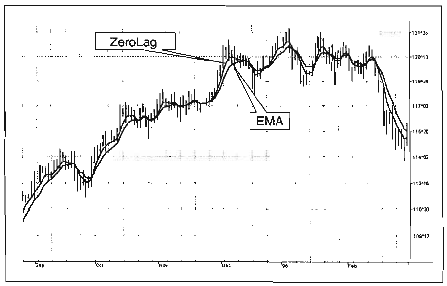

# Chapter 16: Removing Lag

> Money is a terrible master
> but an excellent servant.
> -P.T. BARNUM

In 1960, R.E. Kalman introduced the concept of optimum estimation. Since then, his technique has proven to be a powerful and practical tool. The approach it utilizes is particularly wellsuited for optimizing the performance of modern terrestrial and space navigation systems. Many traders not directly involved in system analysis have heard about Kalman filtering and have expressed interest in learning more about applying it to the market. Although attempts have been made to provide simple, intuitive explanations, none has been completely successful. Almost without exception, descriptions have become mired in the jargon and state-space notation of the cult.

In spite of the obscure-looking mathematics (the most impenetrable of which can be found in Dr. Kalman's original paper), Kalman filtering is a surprisingly direct and simple concept. In the spirit of pragmatism, we will not deal with the full-blown matrix equations that a thorough explanation of Kalman filtering requires, and we will be less than rigorous in its application to trading. Rigorous application requires knowledge of the probability distributions of the statistics. Nonetheless, we end with practical and useful results. We depart from the classical approach by working backward from Exponential Moving Averages (EMAs). With this process, we introduce a method to achieve a nearly zero-lag moving average. From there, we develop an automatic trading system based on the zero-lag principle.

## Suboptimal Filters

Tracking filters use a linear model to estimate the position of a target. The classic example is a gunner shooting at an enemy target. He estimates the angle of his gun and shoots. The forward foot soldiers radio back how much deviation there was from the target. The gunner computes the incremental change required for his new gun angle from the deviation. An Alpha filter shows that this model constitutes using the previous estimate plus a constant times the difference between the last real position and the last estimate. The equation for this filter is

$$\hat X =\hat X[1]+\alpha(Z-\hat X[1])$$

where $\hat X$ = estimated next position, Z = last real position

This is exactly the same as the EMA with which you are familiar. Let us rearrange the terms so that the EMA is written as

$$EMA = \alpha \cdot Price + (1- \alpha) \cdot EMA_{l}$$

As you know, this EMA equation produces a lag in the estimated price. We can improve our estimate of position by adding an estimate of the velocity to the last known position. The position equation then becomes

$$\hat X =\hat X[1]+\alpha((Z + K\cdot \hat V)-\hat X[1])$$

where $\hat V$ = velocity estimate, $K$ = gain factor

The velocity estimate is an EMA of the rate of change of position, so that

$$\hat V =\hat V[1]+\beta(V-\hat V[1])$$

This is the Beta part of an Alpha-Beta filter. An Alpha-Beta filter considers not only the change of position, but also the change of velocity. In trading terms, an Alpha-Beta filter not only considers the price, but also the change of price (momentum).

We can create a near-zero-lag filter for the special case where $\beta = 1$. In this case, the EMA can be written as

$$ZEMA = \alpha\cdot(Price + K* (Price- Price[3])) + (1- \alpha)*ZEMA[1]$$

where ZEMA is the zero-lag EMA. I took the liberty of using the
three-day momentum as the velocity estimate. Figure 16.1 shows an EMA using $\alpha = 0.25$ compared to a ZEMA using the same alpha and K = 0.5. This is not a bad zero-lag filter, even if it is suboptimal. It is suboptimal because it is not a true Kalman filter.



**Figure 16.1** *ZeroLag moving average compared to standard EMA with $\alpha = 0.25$. Chart created with TradeStation2000i by Omega Research, Inc.*

## ZeroLag Trading System

The concepts of the Instantaneous Trendline and the ZeroLag EMA are very powerful. To demonstrate just how profound these concepts are, I designed an intraday trading system and applied it to one of the more exciting and challenging contracts that exist today-the S&P futures. An intraday trade is defined as any active trade that is traded and then closed at the end of the day.

Figure 16.2. illustrates the back-tested results of the S&P futures market from 1 January 1997 to 7 June 2000. A $1,500 moneymanagement stop was used. The results included an average income over $40,000 per year per contract at an average profit per trade of $517, and slightly more than half of all trades were profitable! This system trades an average of 1.5 times a week. The new part of the code (after the Hilbert calculations, with which you are familiar) starts where I set yesterday's high and low, computed by sequentially capturing the highest high and the lowest low today. The ZEMA is computed using a gain factor of 0.5. Now the trading rules come into play.

| | | | |
| - | - | - | - |
| Total Net Profit | $146,450.00 | | |
| Gross Profit | $336,937.50 | Gross Loss | ($190,487.50) |
| Total # of trades | 283 | Percent profitable | 50.18% |
| Number winning trades | 142 | Number losing trades | 141 |
| Largest winning trade | $15,000.00 | Largest losing trade | ($1,512.50) |
| Average winning trade | $2,372.80 | Average losing trade | ($1,350.98) |
| Ratio avg win/avg loss | 1.76 | Avg trade (win & loss) | $517.49 |
| Max consec. Winners | 7 | Max consec. losers | 9 |
| Avg # bars in winners | 7 | Avg # bars in losers | 4 |
| Max intraday drawdown | ($17,650.00) | | |
| Profit Factor | 1.77 | Max # contracts held | 1 |

**Figure 16.2** *ZeroLag performance summary on S&P intraday-1 January 1997 to 7 June 2000.*

Rule number one demands an outside day for any trade to be taken. That is, either the highest high today must be higher than yesterday's high or the lowest low today must be lower than yesterday's low. Next, a new position is entered only on the second bar of the day. A new position is established by the condition that the MarketPosition equals zero (Flat Position). Then, on the second bar of the day, if the ZeroLag line is above the Instantaneous Trendline and the filter conditions are met, a long position is established. The filter conditions are as follows: The open of the second bar must be greater than the open of the first; the high of the second bar must be higher than the high of the first; and the close of the first bar must be in the upper two-thirds of its range. A similar rule exists for the short side trade. That is, the open of the second bar must be less than the open of the first; the low of the second bar must be lower than the low of the first; and the close of the first bar must be in the lower two-thirds of its range. Also, a crossover rule exists for all bars. If you find that the following set of conditions is met, then buy: The ZeroLag crosses over the Instantaneous Trendline, the high of the current bar is less than the high of the previous one, and the close of the current bar is in the upper half of the range of the bar. If this set of conditions is met, then sell: The ZeroLag crosses under the Instantaneous Trendline, the low of the current bar is greater than the low of the previous one, and the close of the current bar is in the lower half of the range of the bar.

The complete code to achieve this performance is given in Figure 16.3. There is not a lot of new code. The majority of the code is used to compute the Instantaneous Trendline. We use an additional input-the alpha used in the ZeroLag EMA. In this case, I assigned a value of 0.33 to alpha, corresponding to a 2-bar lag if the EMA lag was not removed.

```easylanguage
Inputs:
    Price((H+L)/2),
    alpha(.33);

Vars:
    Smooth(O),
    Detrender(0),
    SmoothPeriod(0),
    SmoothPrice(0),
    DCPeriod(0),
    RealPart(0),
    ImagPart(0),
    count(0),
    ITrend(0),
    Trendline(0),
    ZeroLag(0),
    Ht(0),
    Lt(0),
    Yh(O),
    Yl(0);

{Initialize ZeroLag}
If CurrentBar = 5 then begin
    ZeroLag = (H+L)/2;
End;

If CurrentBar > 5 then begin
    Smooth = (4*Price + 3*Price[1] + 2*Price[2] + Price[3]) / 10;
    Detrender = (.0962*Smooth + .5769*Smooth[2] - .5769*Smooth[4] - .0962*Smooth[6])*(.075*Period[1] + .54);

    {Compute Inphase and Quadrature components}
    Q1 = (.0 962*Detrender + .5769*Detrender[2] - .5769*Detrender[4] - .0962*Detrender[6])*(.075*Period[1] + .54);
    I1 = Detrender[3];

    {Advance the phase of I1 and Q1 by 90 degrees}
    jI = (.0962*I1 + .5769*I1[2] - .5769*I1[4] - .0962*I1[6])*(.075*Period[1] + .S4);
    jQ = (.0962*Q1 + .5769*Q1[2] - .5769*Q1[4] - .0962*Q1[6])*(.075*Period[1] + .54);

    {Phasor addition for 3 bar averaging)}
    I2 = I1 - jQ;
    Q2 = Q1 + jI;

    {Smooth the I and Q components before applying the discriminator}
    I2 = .2*I2 + .8*I2[1];
    Q2 = .2*Q2 + .8*Q2[1];

    {Homodyne Discriminator}
    Re = I2*I2[1]+ Q2*Q2[1];
    Im = I2*Q2[1]- Q2*I2[1];
    Re = .2*Re + .8*Re[1];
    Im = .2*Im + .8*Im[1];

    If Im <> 0 and Re <> 0 then Period = 36O / ArcTangent(Im/Re);
    If Period > 1.5*Period[1] then Period = 1.5*Period[1];
    If Period < .67*Period[1] then Period = .67*Period[1];
    If Period < 6 then Period = 6;
    If Period > 50 then Period = 50;

    Period = .2*Period + .8*Period[1];
    SmoothPeriod = .33*Period + .67*SmoothPeriod[1];

    {Compute Trendline as simple average over the measured dominant cycle period}
    DCPeriod = IntPortion(SmoothPeriod + -5);
    ITrend = 0;
    For count = 0 to DCPeriod - 1 begin
        ITrend = ITrend + Price[count];
    End;
    If DCPeriod > 0 then ITrend= ITrend / DCPeriod;

    Trendline = (4*ITrend + 3*ITrend[1] + 2*ITrend[2] + ITrend[3]) / 10;
    If CurrentBar < 12 then Trendline = Price;

    {Set yesterday's high and low}
    If Date <> Date[1] then begin
        Ht = High;
        Lt = Low;
        Yh = Ht[1];
        Yl = Lt[1];
    End;

    {Establish today's high and low}
    If High > Ht then Ht = High;
    If Low < Lt then Lt= Low;

    {Compute zero lag filter}
    ZeroLag = alpha*(Price + .5*(Price - Price[3])) + (1 - alpha)*ZeroLag[1];

    {Demand an outside day to trade}
    If Date >= 0 and (Ht >= Yh or Lt <= Yl) then begin
        {New positions are entered at the end of the second bar of the day}
        If Date = Date[1] and Date > Date[2] and MarketPosition = 0 then begin
            If ZeroLag > Trendline and Open > Open[1] and High > High[1] and Close[1] > Low[1] + (High[1] - Low[1])/3 then buy;
            If ZeroLag < Trendline and Open < Open[1] and Low < Low[1] and Close[1] < High[1] - (High[1] - Low[1])/3 then sell;
        End;
        If ZerOLag Crosses Over Trendline and High < High[1] and Close > Low + (High - Low)/2 then buy;
        If ZeroLag Crosses Under Trendline and Low > Low[1] and Close > High - (High - Low)/2 then sell;
    End;
End:
```

**Figure 16.3** *ZeroLag Intraday Trading System EasyLanguage code.*

## Key Points to Remember

- Exponential Moving Average (EMA) lag can be removed by adding a short-term momentum factor times a gain term to the current price in the EMA equation.
- A ZeroLag EMA is similar to a Kalman filter with a constant gain.
- The theoretical Instantaneous Trendline and ZeroLag Indicators are powerful tools even for demanding intraday trading.
