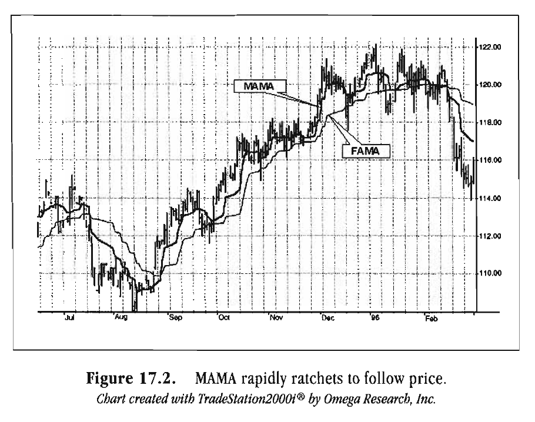

# ADAPTIVE MOVING AVERAGES

Think like a man of action,
act like a man of thought.
-HENRI-LOUIS BERGSON
We have already encountered one method to make Finite Impulse Response (FIR) filters adaptive-setting the cutoff frequency to be some multiplier times the measured cycle period.
In certain special cases, the length of the Simple Moving Average (SMA) is set not only to smooth, but also to specifically
notch out, some undesired frequency components. The Instantaneous Trendline is one such example. We can produce a much
faster response to changes if we introduce nonlinearity into an
Infinite Impulse Response (IIR) filter calculation. Nonlinearities
usually depend on price volatility. We briefly describe several of
these approaches before applying the Hilbert Transform for a
unique approach.
Kaufman's Adaptive Moving Average
Kaufman's Adaptive Moving Average (KAMA) is based on the
concept that a noisy market requires a slower trend than one

with less noise. The basic principle is that the trendline must
lag further behind the price in a relatively noisy market to avoid
being penetrated by the price. The moving average can speed up
when the prices move consistently in one direction. According
to Perry Kaufman, who invented the system, KAMA is intended
to use the fastest trend possible, based on the smallest calculation period for the existing market conditions. It does this by
changing the alpha of the EMA with each new sample. The
equation for KAMA is
+

$$KAMA = S \cdot Price (1- S) \cdot KAMA_{l}$$

where S = smoothing factor. This is exactly the same equation
that we use for the Exponential Moving Average (EMA) except
the variable S replaces the alpha constant of the EMA.
The equation for the smoothing factor involves two boundaries and an efficiency ratio.

$$S = (E \cdot (fastest- slowest) + slowest)^2$$

Fastest refers to the alpha of the shortest period boundary. Slowest refers to the alpha of the longest period boundary. The suggested period boundaries are 2 and 30 bars. In this case, the two
alphas are calculated to be

$$Fastest = 2/(2 + 1)= 0.6667$$


$$Slowest = 2/(30 + 1)= 0.0645$$

Simplifying the equation for the smoothing factor, we get
+

$$S = (0.6022 \cdot E 0.0645)^2$$

The efficiency ratio (E) is the absolute value of the difference
of price across the calculation span divided by the sum of the
absolute value of the individual price differences across the calculation span. The equation for E is
|Price - Price[N]|
E=
The default value for N is 10. However, testing to find the best
length is suggested.
Variable Index Dynamic Average
Variable Index Dynamic Average (VIDYA) uses a pivotal smoothing constant that is fixed. The suggested value of this constant
is 0.2, corresponding to the alpha of a nine-day EMA. The equation for VIDYA is

$$VIDYA = 0.2 \cdot k \cdot Close + (1- 0.2 \cdot k) \cdot VIDYA_{l}$$

Again, this is exactly the same equation as an EMA except the
relative volatility term k has been included to introduce the
nonlinearity. The volatility term is the ratio of the standard
deviation of Closes over the last n days to the standard deviation
of Closes over the last m days, where m is greater than n. Suggested values are n = 9 and m = 30.
MESA Adaptive Moving Average-a.k.a. MAMA
Forgive the whimsy of the name attached to this unique indicator, but with that name I'm sure you will always remember it.
Like KAMA and VIDYA, the starting point for MAMA is a con-

ventional Exponential Moving Average (EMA). The equation for
an EMA is written as

$$EMA = a \cdot Price + (1 - a) \cdot EMA_{l}$$

where a is less than 1. In English, this equation says that the
EMA is comprised of taking a fraction of the current price and
adding one minus that fraction times the previous value of the
EMA. The larger the value of a, the more responsive the EMA
becomes to the current price. Conversely, if a becomes smaller,
the EMA is more dependent on previous values of the average
rather than the current price. Therefore, a way to make an EMA
adaptive is to vary the value of a according to some independent
parameter.
The concept of MAMA is to relate the phase rate of change
to the EMA alpha, thus making the EMA adaptive. The cycle
phase goes from 0 through 360 degrees in each cycle. The
phase is continuous, but is usually drawn with the snap back to 0
degrees as the beginning of each cycle. Thus the phase rate of
change is 360 degrees per cycle. The shorter the cycle, the faster
the phase rate of change. For example, a 36-bar cycle has a phase
rate of change of 10 degrees per bar, while a 10-bar cycle has a
rate of change of 36 degrees per bar. The cycle periods tend to be
longer when the market is in a Trend Mode.
The cycle phase is computed from the arctangent of the ratio
of the Quadrature component to the Inphase component. I
obtain the phase rate of change values by taking the difference of
successive phase measurements. The arctangent function only
measures phase over a half cycle, from -90 degrees to +90 degrees. Since the phase measurement snaps back every half cycle,
a huge negative rate change of phase every half cycle results
from the computation of the rate change of phase. Measured
negative rate changes of phase can also occur when the market
is in a Trend Mode. Any negative rate change of phase is theoretically impossible because phase must advance as time increases. We therefore limit all rate change of phase to be no less
than unity.
The alpha in MAMA is allowed to range between a maximum and minimum value, these values being established as

inputs. The suggested maximum value is FastLimit = 0.5, and
the suggested minimum is SlowLimit = 0.05. The variable alpha
is computed as the FastLimit divided by the phase rate of
change. Any time there is a negative phase rate of change, the
value of alpha is set to the FastLimit. If the phase rate of change
is large, the variable alpha is bounded at the SlowLimit.
The arctangent function produces a phase response between
-90 degrees and +90 degrees, with a phase wrap back to -90
degrees. There is a huge negative rate change of phase across this
phase wrap boundary. By limiting this negative rate change of
phase to +1, the alpha used in the EMA is set to the FastLimit.
The phase wrap boundary occurs at 0 degrees and 180 degrees of
a theoretical sine wave due to the 90-degree lag of the Hilbert
Transform.
The variable alpha is guaranteed to be set to the FastLimit
every half cycle due to the measured phase snap back. This relatively large value of alpha causes MAMA to rapidly approach the
price. After the phase snaps back, the alpha returns to a typically
small value. The small value of alpha causes MAMA to hold
nearly the value it achieved when alpha was at the FastLimit.
This switching between the relatively large and relatively small
values of alpha produce the ratcheting action that you observe in
the waveform. The ratcheting occurs less often when the market is in the Trend Mode because the cycle period is longer in
these cases.
An interesting set of indicators result if the MAMA is
applied to the first MAMA line to produce a Following Adaptive
Moving Average (FAMA). By using an alpha in FAMA that is half
the value of the alpha in MAMA, the FAMA has steps in time
synchronization with MAMA, but the vertical movement is
not as great. As a result, MAMA and FAMA do not cross unless
there has been a major change in market direction. This suggests
an adaptive moving average crossover system that is virtually
free of whipsaw trades.
The MAMA code is shown in Figure 17.1. This code is nearly
the same as the one that computes the Hilbert Transform
Homodyne Discriminator cycle measurement (see Chapter 7,
Figure 7.2), with the additional code to compute phase rate of
change, the nonlinear alpha, and the MAMA and FAMA lines.


```easylanguage
Inputs : Price ( (H+L)/ 2) ,
FastLimit ( .5),
SlowLimit (.0 5) ;
Vars : Smooth (0) ,
Detrender (0) ,
I1 (01,
Q1 (01,
jI (0) ,
jQ(O),
12 (01,
Q2 (01,
Re (01,
Im(O),
Period (0) ,
Smoothperiod (0) ,
Phase (0) ,
DeltaPhase (0) ,
alpha (0) ,
MAMA ( 0 ) ;
FW(0);
If CurrentBar > 5 then begin
Smooth = (4*Price + 3*Price[ll + Z*Price [2]+
Price[3]) / 10;
Detrender = (.0962*Smooth + .5769*Smooth[2] -
.5769*Smooth [41- .0962*Smooth [6*1 )
( .075*Period [l+] .54);
{Compute Inphase and Quadrature components}
Q1 = (.0 962*Detrender + .5769*Detrender[ 21 -
.5769*Detrender [4-] .0962*Detrender1 61 ) *
(. 075*Period [l+] ,541 ;
I1 = Detrender [3;]
{Advance the phase of I1 and Q1 by 90 degrees}
jI = (.0 962*11 + .5769*11[21 - .5769*11[4] -
.0962*11[6] ) * (. 075*Period [l+] .54);
jQ = (. 0962*Q1 + .5769*Q1 [2]- .5769*Q1[4] -
.0962*Q1[6] ) * ( .075*Period [l+] .54);

{Phasor addition for 3 bar averaging)}
I2 = I1 - jQ;
Q2 = Q1 + jI;
{Smooth the I and Q components before applying
the discriminator}
I2 = .2*12 + .8*12 [l;]
Q2 = .2*Q2 + .8*Q2[1] ;
{Homodyne Discriminator}
Re = I2*12 [l]+ Q2*Q2 [l;]
Im = I2*Q2 [l]- Q2*12 [l] ;
Re = .2*Re + .8*Re [l;]
Im = .2*Im + .8*Im[l] ;
If Im <> 0 and Re c> 0 then Period=
360/ArcTangent(Im/Re1 ;
If Period > 1.5*Period [l] then Period=
1.5*Period [;l ]
If Period .67*Period[l] then Period =
.67*Period [;l ]
If Period c 6 then Period = 6;
If Period > 50 then Period= 50;
Period = .2*Period + .8*Period[ll;
SmoothPeriod = .33*Period + .67*SmoothPeriod[ll;
If I1 C> 0 then Phase = (ArcTangent (Q/1 11)) ;
Deltaphase = Phase[ll - Phase;
If Deltaphase < 1 then Deltaphase= 1;
alpha = Speed / Deltaphase;
If alpha c SlowLimit then alph=a SlowLimit;
MAMA = alpha*Price + (1 - alpha) *MAMA[l;]
FAMA = .5*alpha*MAMA + (1 - .5*alpha) *FAMA[l;]
Plot1 (MAMA, "MAMA") ;
Plot2 (FAMA",FA MA'') ;
End ;
```



*Figure 17.2. MAMA rapidly ratchets to follow price,*

Chart created with TradeStation2000i by Omega Research, Inc.
The unique character of MAMA is shown in Figure 17.2. The
thicker MAMA line ratchets closely behind the price. The thin
FAMA line steps in time sequence with MAMA, but the movement is not as dramatic because its alpha is at half value. From


*Figure 17.2. it is clear that the two adaptive moving average lines*

only cross at major market reversals. Their action enables the creation of a trading system that is virtually free of whipsaw trades.
Key Points to Remember
Most adaptive moving averages use momentum as the basis
of the nonlinearity of alpha in an Exponential Moving Average (EMA).
Mesa Adaptive Moving Average (MAMA) uses the Hilbert
Transform phase rate of change to produce a ratcheting
action of the adaptive moving average.
MAMA is ideal as the basis of a trading system to minimize
whipsaws.
