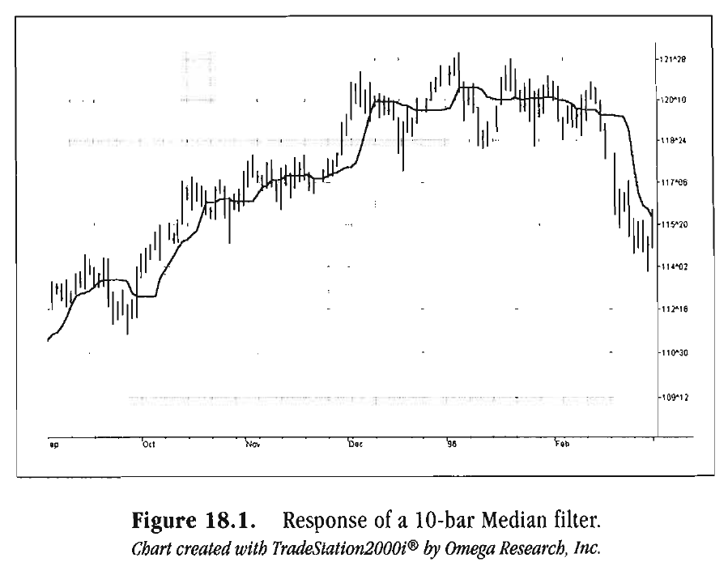
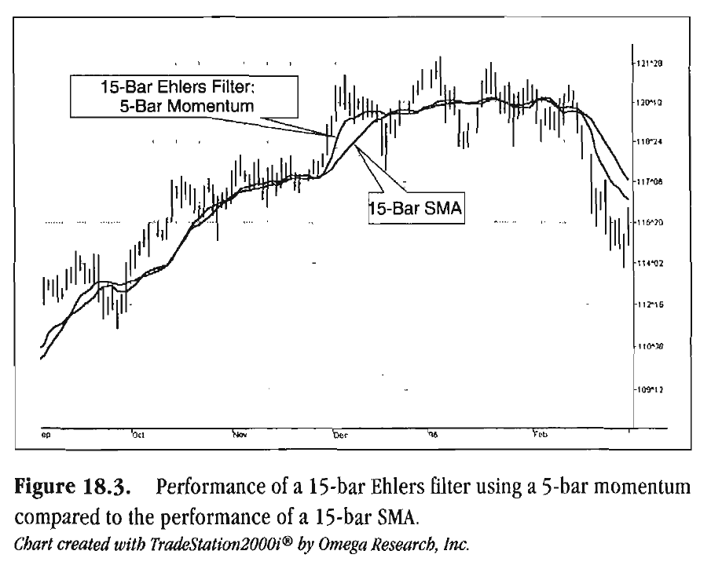
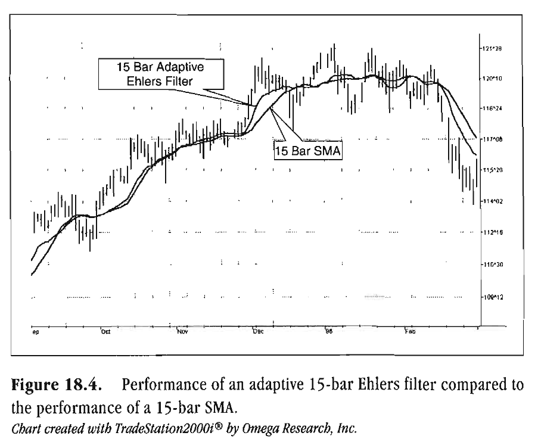
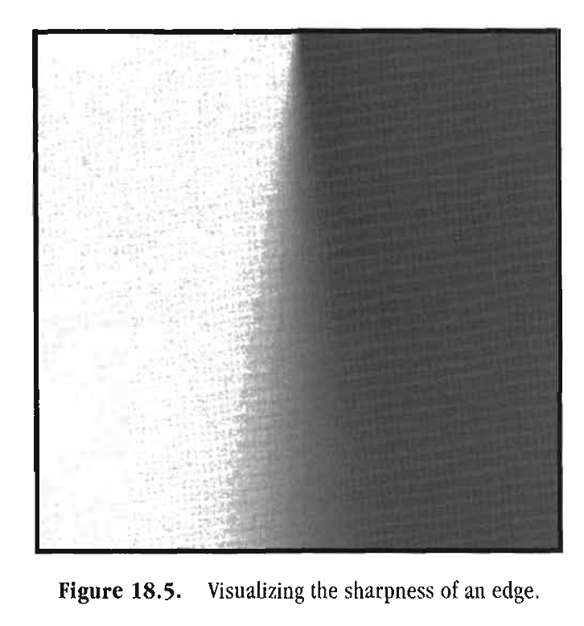

# EHLERS FILTERS

To affinity and beyond!
"BUZZ LIGHTYEAR (PARAPHRASED)

The most common filters used by traders are moving averages either Simple Moving Averages (SMA) or Exponential Moving Averages (EMA). These are linear filters. Linear filters are optimal for smoothing stationary, slowly varying signals that are corrupted with high-frequency noise. Unfortunately, price data are not stationary much of the time. A coin flip experiment is an example of a statistical stationary process. However, if weighted coins are introduced into the experiment randomly, the statistics of the experiment now depend on which coin is used, and therefore are nonstationary. The signals we deal with can often be described statistically. For example, human speech has noiselike statistics. The process is nonstationary because it changes from moment to moment. Although speech has noiselike characteristics, that is not to say that it does not carry information. Price data resembles speech in statistical characteristics. The data are both noiselike and nonstationary. One of the main problems we encounter in trading when using technical analysis is that we must attempt to restore signals that are often nonstationary and are also corrupted by noise. When dealing with nonstationary signals that have sharp transitions of their mean or when dealing with impulsive noise, linear filtering techniques give poor results. In this chapter, I describe how to make some amazing nonlinear filters that better handle these signals.

186 Rocket Science for Traders

The filters I have invented are nonlinear FIR filters. It turns out that they provide both extraordinary smoothing in sideways markets and aggressively follow major price movements with minimal lag. The development of my filters starts with a general class of FIR filters called Order Statistic (OS) filters. These filters are well-known for speech and image processing, to sharpen edges, increase contrast, and for robust estimation. In contrast to linear filters, where temporal ordering of the samples is preserved, OS filters base their operation on the ranking of samples within the filter window. The data are ranked by their summary statistics, such as their mean or variance, rather than by their temporal position.

Among OS filters, the Median filter is the best known. In a Median filter, the output is the median value of all the data values within the observation window. As opposed to an averaging filter, the Median filter simply discards all data except the median value. In this way, impulsive noise spikes and extreme price data are eliminated rather than included in the average. The median value can fall at the first sample in the data window, at the last sample, or anywhere in between. Thus, temporal characteristics are lost. The Median filter tends to smooth out short-term variations that lead to whipsaw trades with linear filters. However, the lag of a Median filter in response to a sharp and sustained price movement is substantial-it necessarily is about half the filter window width. The response of a Median filter that has a 10-bar window width is shown in Figure 18.1. Note that the filter did not respond to small price movements in October/November or in January/February, which possibly could have eliminated several potential whipsaw trades that would have been produced by linear filters. Finding the median is a simple sorting problem, and, conveniently, Tradestation contains a median function. Therefore, I will not provide code for a Median filter. Median filters can be smoothed with an EMA to make them more presentable and easier to read.

'Pitas, Ioannis, and Anastasios N. Venetsanopoulos. "Order Statistics in Digital Image Processing," Proceedings of the IEEE 80/12 (1992): 1893-1921.



*Figure 18.1. Response of a 10-bar Median filter.*

Chart created with TradeStation 2000i@ by Omega Research, Inc.

Like OS filters, Ehlers filters are robust. Additionally, they exploit both the rank-order and temporal characteristics of the data. That is, the Ehlers filter maintains the temporal affinity between its coefficients and the statistic in use. The generalized Ehlers filter can be oriented to any statistic of your choice, making it extremely easy to calculate. The most obvious statistic to use is price momentum because these data enable the nonlinear Ehlers filter to rapidly follow price changes (as they enable the KAMA IIR filter to do the same). The range of statistic used is virtually limitless. For example, the Ehlers filter could be nonlinear with respect to acceleration (the rate change of momentum), Signal-to-Noise Ratio, volume, money flow (delta price times volume), and so on. Even other indicators, such as Stochastic or Relative Strength Indicators (RSIs) can be used as a statistic. This will become more apparent after we explain the calculating procedure.

The Ehlers filter has a formulation similar to that of the FIR filter. If y is the filter output and xi is the ith input across a filter window width n, then the equation is

y = ClXl+ c2x2 + c3x3 + c4x4 + . . . + c,x,

The c's are the coefficients that contain the statistic in which you are interested. For example, if you are interested in the 5-bar momentum, each coefficient would be, in EasyLanguage notation,

Price[count] - Price[count + 5]

In this way, the coefficients are ordered according to their size within the window. For example, c3 could possibly have the largest momentum and cl could be the next largest momentum, and their temporal locations within the filter is retained. Unity gain of the filter must be retained. This naturally occurs by normalizing each of the filter coefficients by their sum so the signal output of the filter is expressed as an affine polynomial. So, the complete formal description of the Ehlers filter is

The statistic used in the Ehlers filters should be detrended for maximum effectiveness. If we do not detrend the statistic, each of the coefficients will have a large common term relative to any differences there may be between them. If the coefficients have a large common term, the Ehlers filter behaves almost identical to an SMA.

The EasyLanguage code for the Ehlers filter is given in Figure 18.2 for the particular example of a 5-bar momentum.

The example filter has 15 coefficients, although the array of coefficients is dimensioned to 25 to allow experimentation using a longer filter. (If a filter longer than 25 samples is desired, the dimension of the Array must be increased accordingly.) In the first calculation, we find each coefficient in the filter as the 5-bar momentum. The next computation sums the numerator


```easylanguage
Inputs: Pric( e( H+L)/ 2) ,
Length (15);
Vars: count( 01,
SumCoef (0) ,
Num(O),
Filt (0) ;
Array: CoefL 251 (0) ;
{Coefficients can be computed using any statistic of
choice --------- a 5 bar momentum is used as an
example}
For count = 0 to Length - 1 begin
Coef [count]= Absvalue (Price [cou-n t]
Price [Count+ 51 ;
end ;
{Sum across the numerator and across all coefficients}
Nurn = 0;
SumCoef =O;
For count = 0 to Length -1 begin
Num = Num + Coef [count] *Price [;c ount]
Sumcoef = Sumcoef + Coef [count;]
end ;
Filt = Num / SumCoef;
Plot1 (Filt, "Ehle;r s")
```

as the product of each coefficient and the price at the corresponding sample, and sums the coefficients alone. Finally, the filter is completed by taking the ratio of the numerator to the coefficient sum. The performance of this filter is shown in Figure 18.3. The filter clearly responds quickly to rapid price movements while rejecting minor price movements to a greater degree. This kind

190 Rocket Science for Traders


*Figure 18.3. Performance of a 15-bar Ehlers filter using a 5-bar momentum*

compared to the performance of a 15-bar SMA.
Chart created with TradeStation 2000i@ by Omega Research, Inc.

of filter can be used to quickly respond to changes in trend direction without producing the whipsaws that are so prevalent when linear filters are employed. The Ehlers filter can be rendered very aggressive by squaring each coefficient.

The greater flexibility of Ehlers filters opens up whole new avenues of technical analysis research. For example, the statistic can be some tangible parameter of market activity such as money flow or volume. Also, more arcane parameters such as Signal-to-Noise Ratio can be used. In this case, the coefficients where the Signal-to-Noise Ratio is the greatest would have the largest weight, discounting the price data values where the Signal-to-Noise Ratio is less. Also, Ehlers filters can be adaptive. For example, the length of the 5-bar momentum Ehlers filter in our example could be adaptive to the length of the measured cycle period. Such a filter would be both adaptive and nonlinear.



*Figure 18.4. Performance of an adaptive 15-bar Ehlers filter compared to*

the performance of a 15-bar SMA.
Chart created with TradeStation 2000i@ by Omega Research, Inc.

The flexibility and adaptability of the Ehlers filter is demonstrated in Figure 18.4, where the statistic used is the difference between the current price and the previously calculated value of the filter.

Since whipsaw signals tend to be suppressed with Ehlers filters, exciting new oscillators can be created by taking the difference of Ehlers filters that have different scales. Imagine indicators analogous to RSI or Stochastics without whipsaws! Oscillators could also be generated from the differences of Ehlers filters by using a different statistic in each filter.

Regardless of the flexibility of the Ehlers filter, it is useful to step back and reflect on the motivation for deriving this filter type. By so doing, we may discover an optimum solution for the calculation of the coefficients. We know market data are most often nonstationary. We also know that we want to follow the sharp and sustained movements of price as closely as possible. This led us to use the Median filter as an edge detector. But not



*Figure 18.5. Visualizing the sharpness of an edge.*

all edges are the same. We can visualize the sharpness of edges in Figure 18.5 by imagining looking down on this figure as we would on a piece of paper, illuminated from above our left shoulder, and hanging over the edge of a desk. The edge at the top of


*Figure 18.5. is very sharp, as if the paper were creased. Continu-*

ing down Figure 18.5, the light diffusion is more dispersed, giving the illusion that the edge becomes more rounded. In fact, the shading of Figure 18.5 was generated by a Gaussian function whose standard deviation increased from top to bottom.

If we consider the gray shading levels in Figure 18.5 as distances, we have a way of computing filter coefficients in terms of sharpness of the edge. White is the maximum distance in one direction from the median gray, and black is the maximum distance in the other direction. In this sense, distance is a measure of departure from the edge, taking into account the edge sharpness. Transitioning to price charts, the difference in prices can be imagined as a distance. Recalling the Pythagorean Theorem (in


```easylanguage
which the length of the hypotenuse of a triangle is equal to the
sum of the squares of the lengths of the other two sides), we can
apply it to our needs and say that a generalized length at any data
sample is the square root of the sum of the squares of the price
difference between that price and each of the prices back for the
length of the filter window. The distances squared at each data
point are the coefficients of the Ehlers filter. The calculation of
the distancelike coefficients is perhaps best understood with reference to the EasyLanguage code for the filter in Figure 18.6. If
Inputs : Price ( (H+L) ,/ 2)
Length (1;5
Vars : count (0 ,
LookBack (01 ,
SumCoef (0) ,
Num(O),
Filt (0) ;
Array: Coelf2 51 (01,
Distance2 [2(501) ;
For count = 0 to Length- 1 begin
Distance2 [count=] 0;
For LookBack= 1 to Length- 1 begin
Distance2 [count=] Distance2 [count+]
(price [coun - t ]P rice [coun+t LookBackl 1 *
(Price [coun - t ]P rice [coun+t LookBackl 1 ;
end;
Coef [count=] Distance2 [count;]
end ;
Num = 0;
SumCoef =O;
For count = 0 to Length- 1 begin
Num = Num + Coef [count] *Price [;c ount]
Sumcoef = Sumcoef + Coef [count;]
end ;
If SumCoef <> 0 then Filt = Num / SumCoef;
Plot1 (Filt, 'Ehler;s ")

p
I... . . .
{ ...!
..,.
. .. .. ..
~ I'. llrn
```

the prices across the filter observation window are the same, then the coefficients of the filter are all the same, and we have the equivalent of an SMA. However, if the prices shift rapidly, the distances from the increased price points increase, and higher weights are given to these filter coefficients. The performance of the distance coefficient Ehlers filter is shown in

The filter coefficients can be made to be even more nonlinear than calculated in Figure 18.6. For example, the distance can be cubed or raised to the fourth power (by squaring the squared distance). A reciprocal Gaussian response is an even more nonlinear function of distance that we can use to calculate the filter coefficients. These more nonlinear responses follow the edges in price movement more aggressively. However, the very fact that they are so nonlinear removes much of the gray area in the response. The most nonlinear calculations produce results that are not discernable from median filters. The coefficients become black and white. The focus of our current research is to identify

the onset of the price shift more accurately. The currently calculated distance functions are related to the change of price. In calculus terms, this is the first derivative. The shift of the rate change of price is the ideal identifier for the impending price move. In calculus terms, we can use the maximum of the second derivative to pinpoint the onset of the price change. The challenge is how to translate the second derivative into filter coefficients without introducing so much noise that the filter response is unusable.

The opportunities to use Ehlers filters in technical analysis are limitless. I am sure whole books will be devoted to cataloging the various statistics and applications where they work best. In the meantime, you will have the opportunity to exploit them for your own fun and profit.

Key Points to Remember

Market data tend to be nonstationary much of the time. Therefore, adaptive technique or nonlinear data processing is required for maximum effectiveness.

Ehlers filters are easy to compute. Compute the coefficient at each position in the filter for the chosen statistic. Compute the filter as the sum of the product of the prices times the coefficients divided by the sum of coefficients.

Ehlers filters aggressively follow sustained price shifts and revert to a FIR filter response when the prices are in a trading range.

A host of indicators and trading systems can be derived from Ehlers filters.
