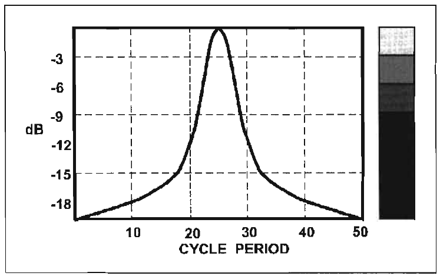
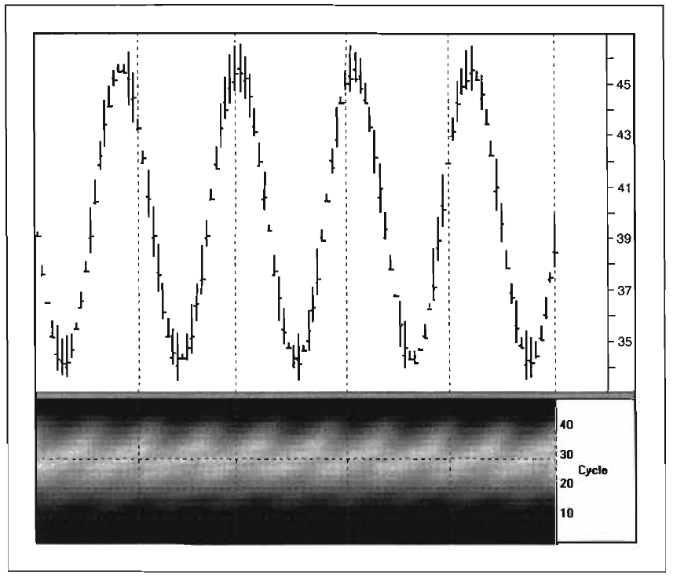
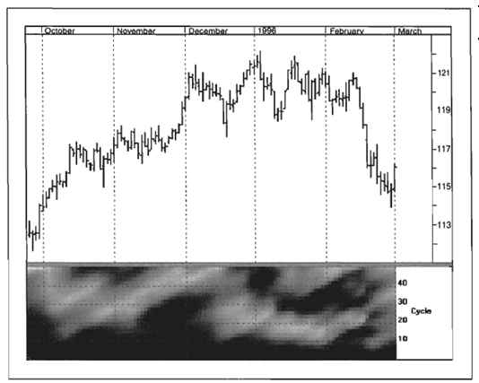
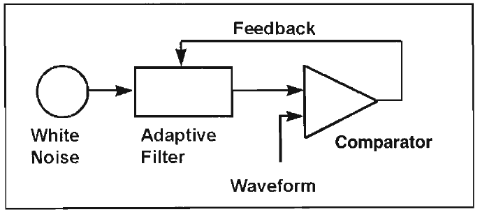
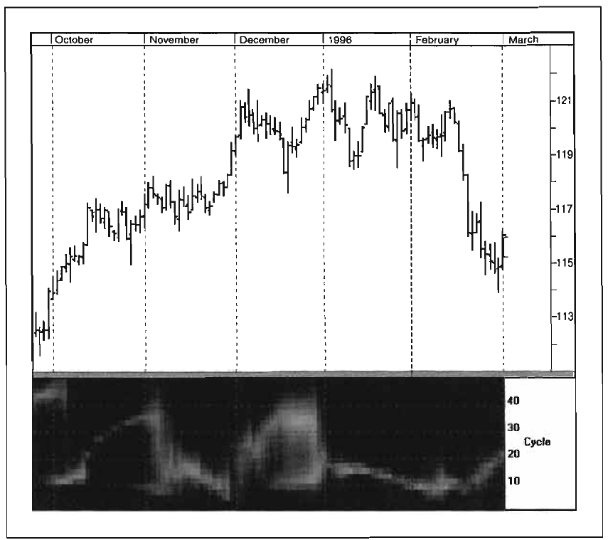

# Chapter 19: Measuring Market Spectra

> Science is the refusal to believe
> on the basis of hope.
> --C.P. SNOW

All major trading software platforms have the Fast Fourier Transform (FFT) tool available. Yet, using FFTs for market analysis is analogous to using a chainsaw at a wood-carving convention. While chainsaws are certainly effective, they are not the correct tool for the job. Back in 1986, I wrote one of the first FFTs for traders using BASIC code for an Apple II computer. Although FFTs are powerful tools for many applications, there are better and more precise tools we can use for market analysis.

A problem with FFTs is that they are subject to several constraints. One constraint is that there can only be an integer number of cycles in the data window. For example, if we have 64 data samples in our measurement window (a 64-point FFT), the longest cycle length we can measure is 64 bars. The next longest length has 2 cycles in the window, or 64/2 = 32-bar cycle. The next longest lengths are 64/3 = 21.3 bars, 64/4 = 16 bars, and so on. Therefore, the integer constraint results in a lack of resolution. In other words, a large gap exists between the measured cycle lengths that can be produced, in the length of cycle periods in which we wish to work. We cannot tell if the real cycle is 14 bars or 19 bars in length. Therefore, the spectrum measurement necessarily has a low resolution.

The only way to increase the FFT resolution is to increase the length of the data window. If we increase the data length to 256 samples, we reach a 1-bar resolution for cycle lengths in the vicinity of a 16-bar cycle. However, obtaining this resolution highlights another constraint. The cycle measurement is valid only if the data are stationary over the entire data window. This means that a 16-bar cycle must have the same amplitude and phase over the total 16 full cycles. In other words, using daily data, a 16-day cycle must be consistently present for over a full year for the measurement to be valid. Can this happen? I don't think so! By the time a 16-bar cycle occurs for more than several cycles, it will be observed by every trader in the world and they will destroy that cycle by jumping all over it. Its potential long-term existence is the very cause of its demise! The only way to obtain a valid high-resolution cycle measurement is to select a technique for which only a short amount of data is required. MESA fills this requirement.

Still not convinced? Let us demonstrate this point with some measurements. Figure 19.1 shows how we have converted the amplitude of a conventional bell-shaped spectrum display into gray density according to the amplitude of the spectral components. Think of the gray shading ranging from white hot to ice cold. Shading the amplitude enables us to plot the spectrum contour below the price bars in time synchronization. A white line represents a sharp, well-defined cycle. A wide light gray splotch tells us that the top of the bell-shaped curve is very broad and that the measurement has poor resolution. Figure 19.2 is a 64-point FFT measurement of a theoretical 24-bar sine wave. Since this is a theoretical cycle with no noise, the measurement should be precise. But it is not! The spectral contour shows that the measurement has very poor resolution. The measured length could as easily be 15 bars as 30 bars. Figure 19.3 is a 64-point FFT taken on real market data. Here, we can barely determine that the cycle is moving, but cannot definitively identify it. Revisiting these data later using the MESA measurement technique, we will see just how much more precise the MESA system is.

**Figure 19.1** *Spectrum amplitude to shading conversion.*

**Figure 19.2** *A 64-point FFT of a theoretical 24-bar cycle.*

**Figure 19.3** *A 64-point FFT of March 1996 Treasury Bonds.*

The notional schematic for the way MESA measures the spectrum is shown in Figure 19.4. The data sample is fed into one input of a comparator. This data sample can be any length-it can even be less than a single dominant cycle period. The other input into the comparator comes from the output of a digital filter. The signal that is input into the digital filter is white noise (containing all frequencies and amplitudes). This digital filter is tuned by the output of the comparator until the two inputs are as nearly alike as possible. In short, what we have done is pattern matching in the time domain. We have removed the signal components with the filter, leaving the residual with maximum entropy (maximum disarray).

Once the filter has been set, we can do several things. First, we can connect a sweep generator to the filter input and sense the relative amplitude of the output as the frequency band is swept. This produces the bell-shaped spectral estimate similar to the one shown in Figure 19.1. This spectral estimate is, in fact, the cycle content of the original data sample within the measurement capabilities of the digital filter. Second, because we have a digital filter on a clock, we can let the clock run into the future and predict futures prices on the assumption that the measured cycles will continue for a short time.

**Figure 19.4** *How MESA measures the spectrum.*

*Figure 19.5. MESA measurement of a theoretical 24-bar cycle.*

**Figure 19.6** *MESA spectrum measurement of March 1996 Treasury Bonds.*

The MESA spectrum measurement is notable in several respects. Most important, only a small amount of data is required to make a high-quality measurement. The MESA algorithm is, therefore, highly likely to be able to make a measurement using nearly stationary data, as the data need remain stationary for only a short while. As previously indicated, cycle measurements are valid only if the data are stationary. Also, because the MESA algorithm requires only a short amount of data, we are able to exploit the short-term coherency of the market. This is entirely consistent with the Telegrapher's Equation solution to the Drunkard's Walk problem. This means that when the market is in a Cycle Mode, the measured cycle has predictive capability. Additionally, the MESA approach makes high-resolution spectral estimates. The high-quality measurement of the theoretical 24-bar cycle is shown in Figure 19.5, where only one cycle's worth of data is used in the measurements. Here, the spectral contour is a single line, meaning that the bell-shaped curve is just a spike centered at the 24-bar cycle period. Figure 19.6 shows the ebb and flow of the measured cycle for the March 1996 Treasury Bonds. While clearly illustrated with the MESA approach, this cycle characteristic was only inferred in the FFT measurement.

## Key Points to Remember

- The Fast Fourier Transform (FFT) is not the proper tool to analyze market data.
- An FFT can measure only an integer number of cycles within its observation window.
- An FFT requires a large amount of data to achieve high-resolution measurements. If we are looking at market data over a long time span, the FFT is useless because the data cannot fulfill the requirement to remain relatively stationary in order to achieve a valid measurement.
- MESA operates by pattern matching in the time domain. Data outside the short observation window are rejected.
- There is typically only one dominant cycle in the market at a time.

## Notes

'Kaufman, Perry J. Trading Systems and Methods. 3rd ed. New York: John Wiley & Sons, 1998.
