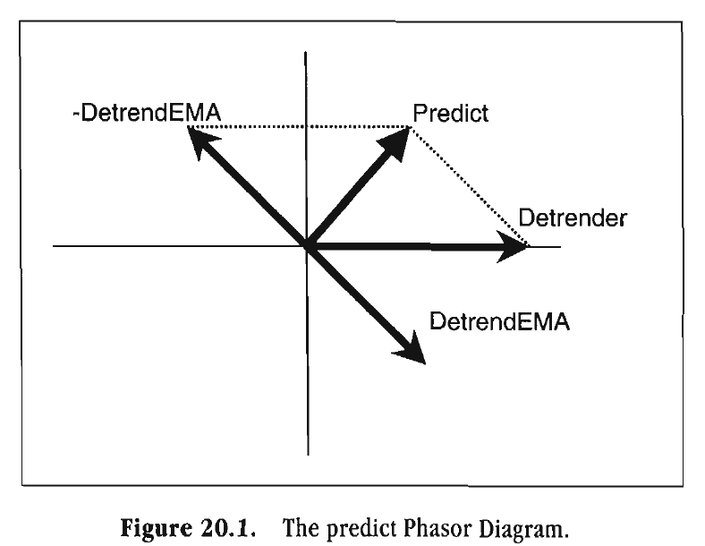
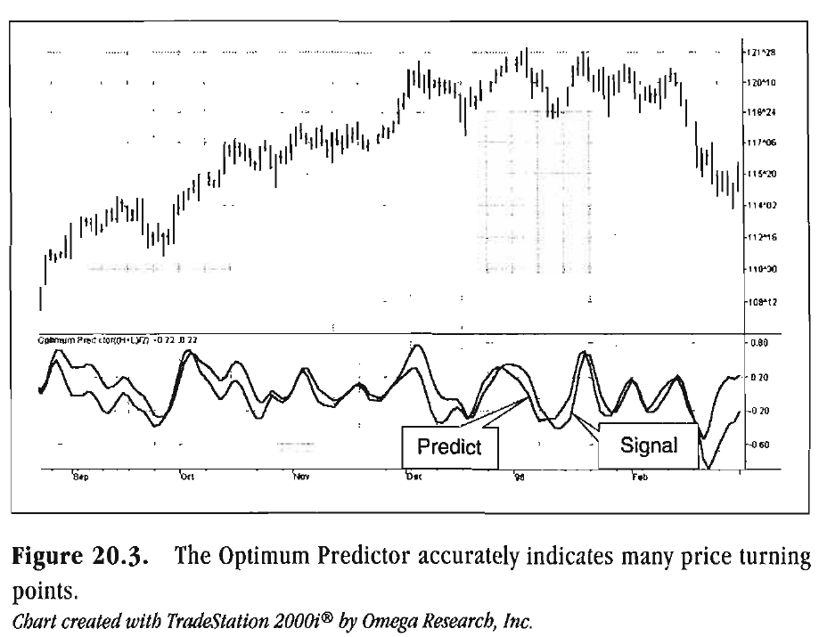
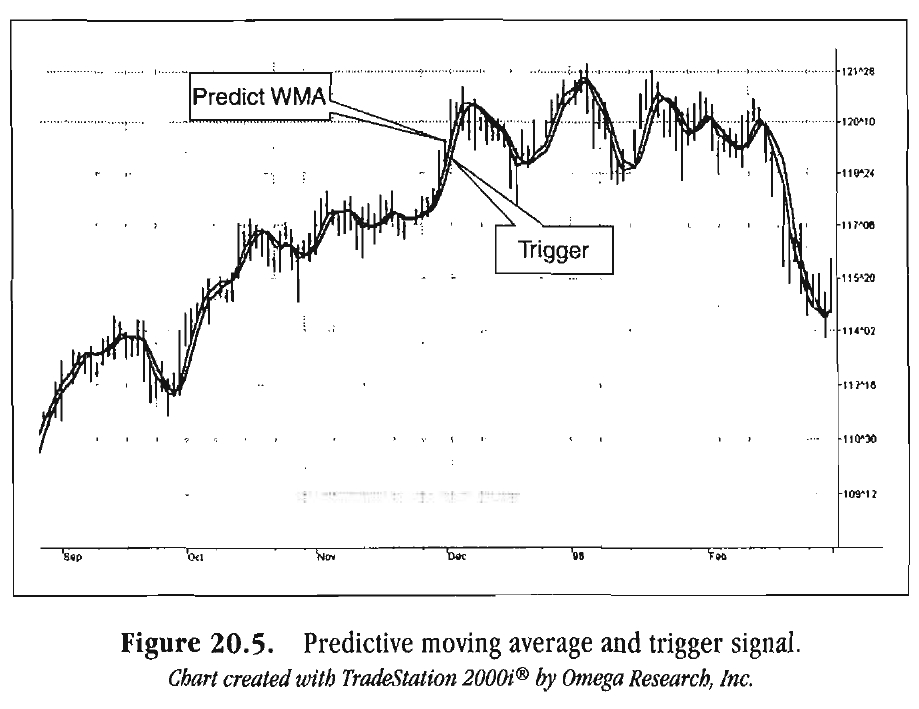

# OPTIMUM PREDICTIVE FILTERS

The impossible is often the untried.
"JIM GOODWIN

Technical analysis is necessarily reactive to the action of the market. The indicators we develop are largely generated to sense the direction in which the price is expected to go. The predictive nature of these indicators is based on correlation to past experience, so the expectation logic runs as follows: If something happened before, it will very likely happen again. However, no indicator is truly predictive in the scientific sense.

In this chapter, I describe a predictive filter, explain how to generate this filter, and (most important) define the conditions under which the filter can be most effectively used. Like all technical indicators, the Optimum Predictive filter cannot be used universally. However, carefully observing those conditions where it is appropriate can make the Optimum Predictive filter a valuable addition to your arsenal of technical analysis weapons. I extrapolate from the concept of Optimum Predictive filters and discuss another way to eliminate lag from moving averages.

Optimum Predictive Filters

An Optimum Predictive filter is simply the difference between the original function and its Exponential Moving Average

(EMA).' That's it! It really is that simple! While the implementation is rather uncomplicated, the derivation is considerably more complex. In general, the response of an optimum system is described by the solution of the Wiener-Hopf equation, a discussion of which is well beyond the scope of this book.

Having defined an Optimum Predictive filter, we must quickly specify the conditions that are required for that filter to be valid. There are two such conditions. One condition is that the amplitude swings of the original function must be limited. The second condition is that the probability of the function passing through zero value must satisfy a Poisson probability distribution. It turns out that these conditions are easy to satisfy. Without getting into the math, a Poisson probability distribution tells us that the number of crossings we expect are not far removed from the average number of crossings. This is simply another way of saying that the market must be in a Cycle Mode. An approximation to the Poisson probability distribution can be achieved using market data if the prices have been detrended. It is absolutely crucial that we detrend because buy/sell signals are obtained by the crossing of the signal and the predictive filter lines. If the price has not been properly detrended to meet the Poisson probability constraint, the lines will not cross correctly.

Since we desire a predictive filter, lag must be held to an absolute minimum. However, the price data must have at least some smoothing to separate the valid signals from the false. We use a 4-bar Weighted Moving Average (WMA) because it has a lag of only 1 bar. We detrend by taking the smoothed price less the smoothed price 2 bars ago. This particular momentum has the phase characteristics of a Hilbert Transformer and a lag of only 1 bar. As a practical matter, we need to smooth again after detrending to minimize the noise that was introduced by the detrending action. We therefore have 3 bars of lag just to obtain the proper detrended signal. This will cause some phase distortion of the output. The phase lag due to the 2-bar lag is 3*360/

'Lee, Y.W. Statistical Theory of Communication. New York: John Wiley & Sons, 1966.

Period. However, the Hilbert Transformer provides a 90-degree phase lead. Therefore, if the data have a cycle period of 12 bars, the detrended price will be exactly in phase with the original price. The detrended price will lead in phase for longer cycle periods and will lag in phase for shorter cycle periods. When the market is in a Trend Mode, the cycle periods tend to be longer. As a result, under Trend Mode conditions, signals that are too early will be produced. However, the Poisson probability criterion is not likely to be met under these conditions. In any event, the signals are invalid when the market is in a Trend Mode. These limitations must be accepted.

The filtered output of the EMA should lag the detrended price by about 45 degrees in phase. When we see a 45-degree phase lag, we know that the dominant cycle component is approximately at the cutoff frequency of the EMA filter. The phasor diagram in Figure 20.1 shows us why this is so and demonstrates why the prediction works at all. The Detrender is a phasor at a reference angle of zero and rotates counterclockwise. The DetrendEMA lags the Detrender by about 45 degrees.

-DetrendEMA Predict
l


*Figure 20.1. The predict Phasor Diagram.*


When we subtract the latter from the former in vector arithmetic, we reverse the direction of the DetrendEMA and then perform vector addition. When we do this, the Predict vector results.

Since the DetrendEMA is at the cutoff frequency of the EMA, its amplitude is about 70 percent of the Detrender amplitude. At a 45-degree angle, the real and imaginary components are equal at a relative amplitude of 0.5 (0.7*Cos(45)). The vector subtraction in complex arithmetic is Predict = 1 - 0.5 + j0.5 = 0.5 + j0.5. Since the two components of the Predict phasor are both 0.5, the absolute amplitude of the Predict phasor is 0.7 from the Pythagorean Theorem. Therefore, the Predict phasor must be multiplied by 1.4 to have the same normalized amplitude as the Detrender phasor.

Frequency components within the EMA passband will not be attenuated as much as those components outside the passband. Additionally, the EMA passband's frequency components will have less than 45 degrees of phase lag. If the phase lag is small, then the vector difference between the Detrender and the DetrendEMA will be a vector with a very small amplitude. The small-amplitude Predict vector contributes little as a predictor. However, if the DetrendEMA lags the Detrender by much more than 45 degrees, it falls outside the passband of the EMA filter, thus severely reducing its amplitude. In this case, the Predict vector will lead the Detrender by less than 45 degrees and will also have a very small amplitude. Therefore, having the frequency component outside the EMA passband also does not contribute to an effective predictor.

A solution does exist to provide the proper phase relationship. First, we must compute the market cycle, using the Hilbert Transform. Then, we use the computed cycle period to compute the desired alpha for the EMA. From Chapter 13, we remember that the calculation is

*Figure 20.2. gives us the code to perform all the calculations*

for the Optimum Predictor. As we have seen before, the major-


```easylanguage
Inputs : Price ( (H+L)/ 2) ;
Vars : Smooth (0) ,
Detrender (0) ,
I1 (01,
Q1 (01,
jI (01,
jQ(O),
I2 (01,
Q2 (01,
Re (01,
Im(O),
Period (0) ,
SmoothPeriod ( 0) ,
Detrender2 (0) ,
Smooth2 (0) ,
alpha (0) ,
DetrendEMA ( 0 ,
Predict (0) ;
If CurrentBar z 5 then begin
Smooth = (4*Price + 3*Price[l] + 2*Price[2] +
Price[3]) / 10;
Detrender = (.0962*Smooth + .5769*Smooth[2] -
.5769*Smooth[ 41 - .0962*Smooth L61 ) * ( .075*
Period[l] + .55);
{Compute Inphase and Quadrature components}
Q1 = (.0962*Detrender + .5769*Detrender [2]-
.5769*Detrender1 41 - .0962*Detrender [6) l *
( .075*Period [l+] .55);
I1 = Detrender[3] ;
{Advance the phase of I1 and Q1 by 90 degrees}
jI = (.0 962*11 + .5769*11[21 - .5769*11[4] -
.0962*11[61)* ( .075*Period 111 + .55);
jQ = (.0962*Q1 + .5769*Q1[2] - .5769*Q1[4] -
.0962*Q1[6]) * ( .075*Period [l+] .55);
{Phasor addition fo3r bar averaging)}
I2 = I1 - jQ;
Q2 = Q1 + jI;

{Smooth theI and Q components before applying
the discriminator}
I2 = .2*12 + .8*12 [l;]
Q2 = .2*Q2 + .8*Q2 [l] ;
{Homodyne Discriminator}
Re = I2*12 [l]+ Q2*Q2 [l;]
Im = I2*Q2 [l]- Q2*12 [l;]
Re = .2*Re + .8*Re [l;]
Im = .2*Im + .8*Im[l];
If Im c> 0 and Re c> 0 then Period=
360/ArcTangent(Im/Re) ;
If Period > 1.5*Period[l] then Period=
1.5*Period [;l ]
If Period c .67*Period[ll then Period=
.67*Period [;l ]
If Period c 6 then Period= 6;
If Period 50 then Period = 50;
Period = .2*Period + .8*Period[ll;
SmoothPeriod = .33*Period + .67*SmoothPeriod[ll;
{Optimum Predictor}
Detrender2 = .5*Smooth - .5*Smooth[2];
Smooth2 = (4*Detrender2 + 3*Detrender2 [l]+
2*Detrender2 121 + Detrender2 L311 / 10;
alpha = 1 - ExpValue(-6.28/Period);
DetrendEMA = alpha*Smooth2 +
(1 - alpha) *DetrendEMA[l;]
Predict = 1.4*(Smooth2 - DetrendEMA);
Plot1 (Smooth2, "Signa;l ")
Plot2 (Predict, "Predic;t ")
End ;
```

ity of the code involves the computation of the period using the Homodyne Discriminator algorithm. Once the period has been computed, the Optimum Predictor is found in just a few lines of code. First, the minimum-length Hilbert Transformer is used to compute the Detrender2 value from the prices that have

been smoothed by the 4-bar Weighted Moving Average (WMA). Detrender2 is smoothed in the 4-bar WMA to produce Smooth2. The alpha of the EMA is computed from the computed period, and the EMA of Smooth2 is taken using that alpha and is called the DetrendEMA. The difference between Smooth2 and the DetrendEMA is multiplied by 1.4 to produce the Predict phasor. Finally, the Smooth2 and Predict phasors are plotted as indicators.

The Optimum Predictor is plotted in Figure 20.3 as the subgraph below the price chart. Buy and sell signals occur when the Predict and Smooth2 lines cross. Most of these signals are indeed prescient. The Optimum Predictor could probably work best in trading systems when used in conjunction with other rules to eliminate the false signals. Alternatively, the turning point of the LeadSine of the Sine wave Indicator could be used as a confirming signal.


*Figure 20.3. The Optimum Predictor accurately indicates many price turning*

points.
Chart created with TradeStation 2000i@ by Omega Research, Inc.

212 Rocket Science for Traders

Predictive Moving Averages

The concept of taking a difference of lagging line from the original function to produce a leading function suggests extending the concept to moving averages. There is no direct theory for this, but it seems to work pretty well. If I take a 7-bar WMA of prices, that average lags the prices by 2 bars. If I take a 7-bar WMA of the first average, this second average is delayed another 2 bars. If I take the difference between the two averages and add that difference to the first average, the result should be a smoothed line of the original price function with no lag. Sure, I could try to use more lag for the second moving average, which should produce a better predictive curve. However, remember the lesson of Chapter 3! An analysis curve cannot precede an event. You cannot predict an event before it occurs.

If we then take a 4-bar WMA of the smoothed line to create a 1-bar lag, this lagging line becomes a signal when the lines cross. This is as close to an ideal indicator as we can get. There

```EasyLamguage
Inputs : Price ( (H+L)/ 2) ;
Vars: WMAl(0) ,
WMA2 (01,
Predict (0 ,
Trigger (0);
WMAl = (7*Price + 6*Price [l] + 5*Price [2] + 4*Price[3]
+ 3*Price[4] + 2*Price [S] + Price [6]) / 28;
WMA2 = (7*WMA1 + 6*WMA1 [l] + 5*WMA1[21 + 4*WMA1[3] +
3*WMA1[41 + 2*WMA1[51 + WMA1[6]) / 28;
Predict = 2*WMA1 - WMA2;

Trigger = (4*Predict + 3*Predict[l] + 2*Predict[2] + Predict[3]) / 10;

Plot1 (Trigger, "Trigger") ;
Plot2 (Predict, "Predict") ;
```

*Figure 20.4. EasyLanguage code to compute predictive averages.*


Optimum Predictive Filters 213


*Figure 20.5. Predictive moving average and trigger signal.*

Chart created with TradeStation 2000i@ by Omega Research, Inc.

is no phase distortion. The code to compute this indicator is given in Figure 20.4. The code could hardly be simpler. A sample of the indicator is shown in Figure 20.5.

Key Points to Remember

A theoretically optimum predictor exists.

The Optimum Predictor is calculated as the difference between a detrended signal and its Exponential Moving Average (EMA).

The EMA constant of the Optimum Predictor is computed using the measured dominant cycle as the cutoff period of the filter.

Moving average lag can be eliminated by taking the moving average of the first moving average, taking the difference between them, and adding that difference back onto the first moving average.
