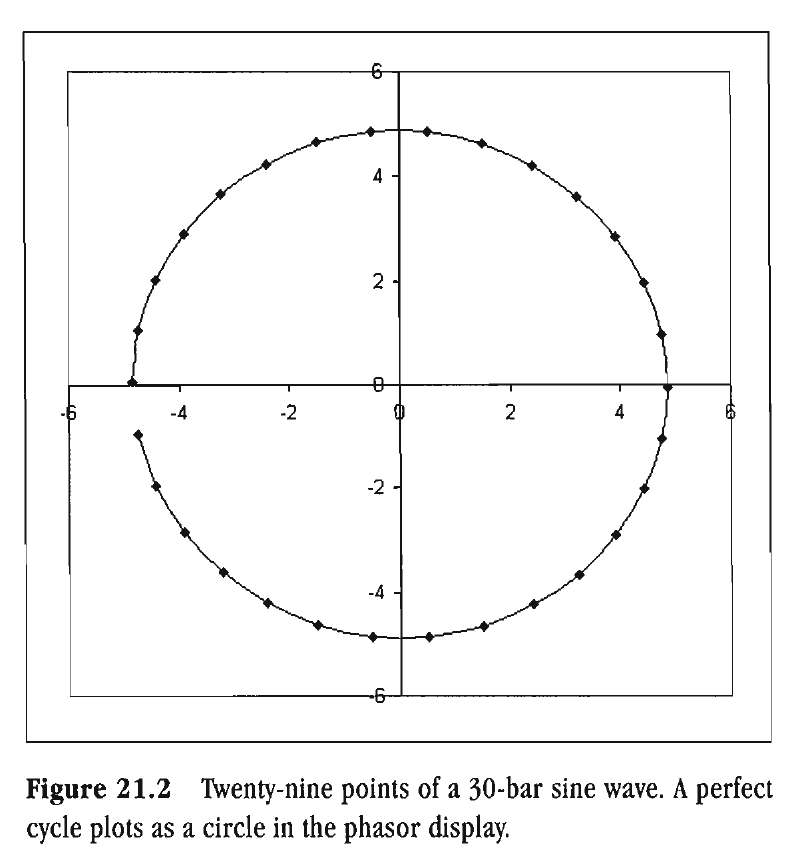
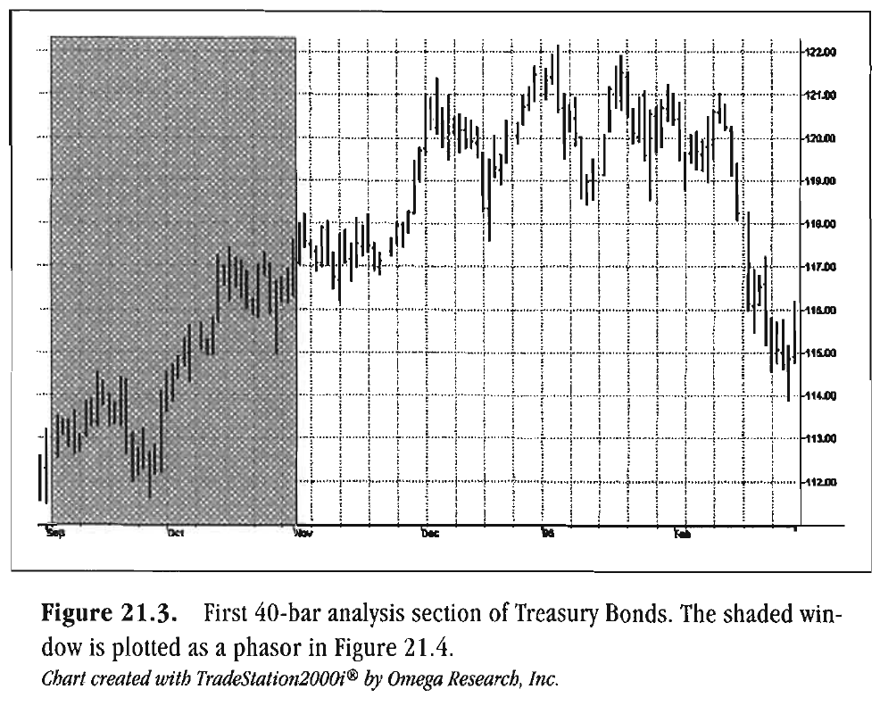
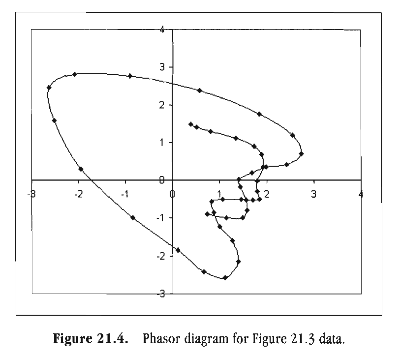
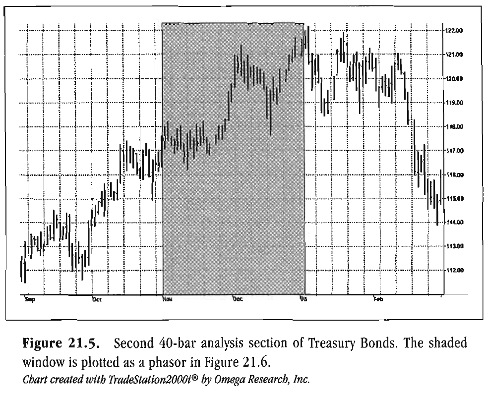
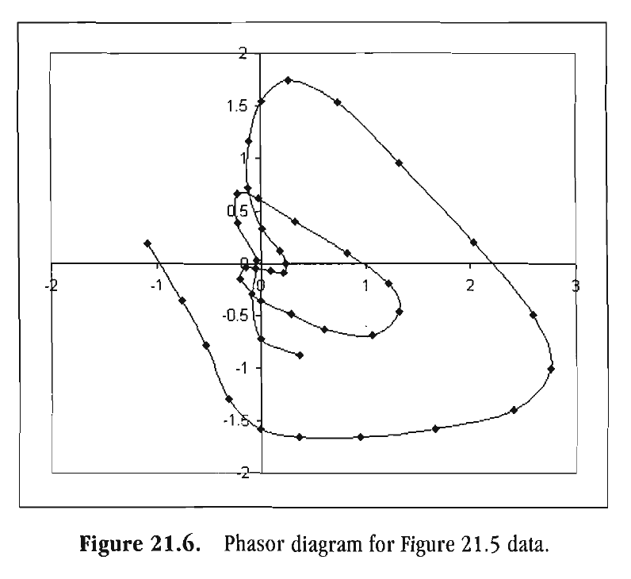
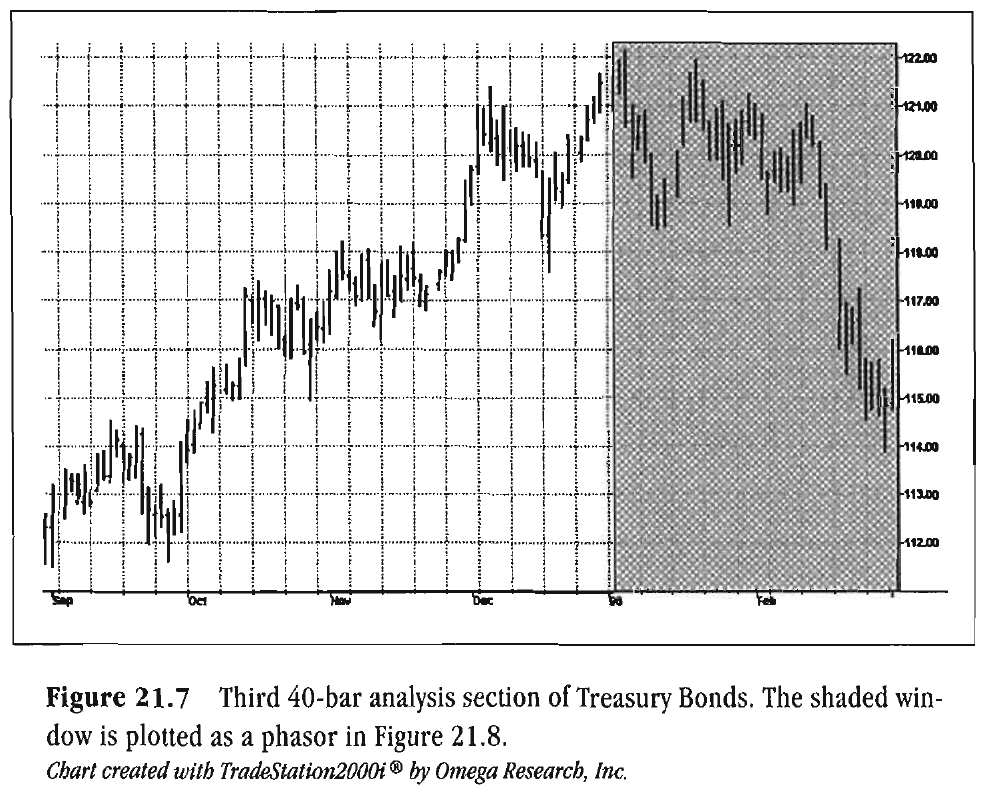
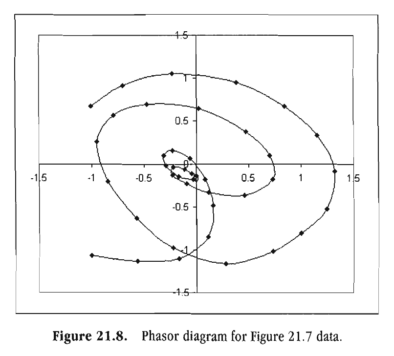
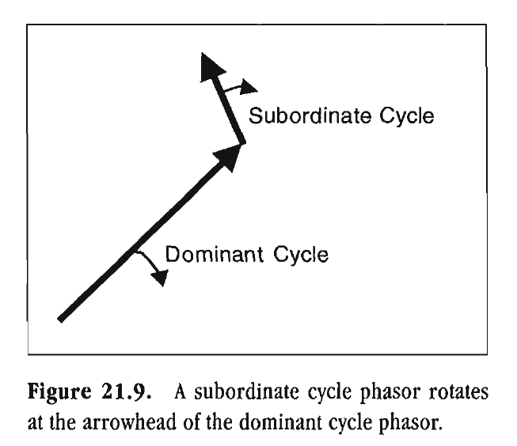

# WHAT YOU SEE IS WHAT YOU GET

Success is a journey, not a destination.
-BEN SWEETLAND

That famous half-glass of water-optimists see it as half-full and pessimists see it as half-empty. An engineer sees the glass as having been designed with too much capacity. That which we see is really a matter of perception. Market technicians have designed a wide variety of techniques to visualize what has happened in the past in order to infer what the future holds. Candlestick charts and Point and Figure charts are two examples of charting price data. When it comes to indicators, there is a plethora of wiggles, squiggles, zigzags, channels, and so on, that requires volumes to describe.

I would now like to add to this cacophony of displays one so new and novel, one so sensitive, that it dramatically pinpoints variations and anomalies that cannot be removed with mathematical filters-at least within the lag constraints imposed by trading considerations. All we do is plot the Inphase and Quadrature components of the Hilbert Transform. We can certainly plot these components in a subgraph below the price chart so they resemble an oscillator. However, if we were to plot these two components against each other in an orthogonal set of coordinates (an x-y plot), we would be exactly tracing out the phasor diagram. Plotting the phasor is the objective of this process.

The first step in generating the phasor display is to compute the Inphase and Quadrature components exactly the way  we  did in Chapter 7. The only difference is  that we must plot the I1 and Q1 components in a subgraph.  Additionally,  we must include a line of code to  output  the I1 and Q1 values into an ASCII file. Figure 21.1 leads  you through this EasyLanguage  code.

```easylanguage
2 16 Rocket Science for Traders
The first step in generating the phasor display is to compute
the Inphase and Quadrature components exactly the way we did
in Chapter 7. The only difference is that we must plot the I1 and
Q1 components in a subgraph. Additionally, we must include a
line of code to output the I1 and Q1 values into an ASCII file.
Inputs : Price ( (H+L) /2) ;
Vars: Smooth(0),
Detrender (0) ,
I1 (0) ,
Q1 (01,
jI (01,
jQ(O),
I2 (0) ,
Q2 (01,
Re (01,
Im(O),
Period (0) ,
SmoothPeriod (0) ;
If CurrentBar > 5 then begin
Smooth = (4*Price + 3*Price[ll + 2*Price L21 +
Price[3]) / 10;
Detrender = (.0962*Smooth + .5769*Smootht21 -
.5769*Smooth [4l- .0962*Smooth[61) * ( .075*
Period[ll + ,541 ;
{Compute Inphase and Quadrature components}
Q1 = (.0 962*Detrender + .5769*Detrender [2]-
.5769*Detrender [4-] .0962*Detrender[ 61 ) * ( .075*
Periodtl] + .54) ;
I1 = Detrender [3;]
{Advance the phase of I1 and Q1 by 90 degrees}
rature data.

jI = ( .0962*11 + .5769*11[2] - .5769*11[4] -
.0962*11[6] ) * ( .075*Period[ll + .55) ;
jQ = (.0 962*Q1 + .5769*Q1[21 - .5769*Q1[41 -
.0962*Q1[6] ) * ( .075*Period[l] + .55) ;
{Phasor addition fo3r bar averaging})
I2 = I1 - jQ;
Q2 = Q1 + jI;
{Smooth theI and Q components before applying
the discriminator}
+
I2 = .2*12 .8*12 [;l ]
Q2 = .2*Q2 + .8*Q21 11 ;
{Homodyne Discriminator}
Re = I2*12 [l]+ Q2*Q2 111 ;
Im = I2*Q2 [l]- Q2*12 111 ;
Re = .2*Re + .8*Re [l;]
Im = .2*Im + .8*Im[l] ;
If Im c> 0 and Re CS 0 then Period=
360/ArcTangent (Im/;R e)
If Period > l.S*Period[l] then Period=
1.5*Period [;l ]
If Period c .67*Period[ll then Period=
.67*Period [;l ]
If Period c 6 then Period= 6;
If Period S 50 then Period= 50;
Period = .2*Period + .8*Period[ll;
SmoothPeriod = .33*Period + .67*SmoothPeriod[ll;
Plotl(I1, "I") ;
Plot2 (Ql',Q ") ;
If Date Date [l] then Print (File ("c:\hilbert\
IQ.csv"), date, "," , 11, ",", Q11 ;
End ;
Figure 2 1.1. (Continued).
```

The final line of code creates a file in the HILBERT directory on your C: drive. You should have created this directory using Windows Explorer before you run the program. The file is IQ.CSV, a comma-delimited ASCII file. You will import this file into Excel to generate the phasor display. Reading the file into Excel is straightforward. Just click FILE . . . OPEN and position C:\HILBERT in the Look In dialog box. Change the Files of Type dialog box to Text Files. The file IQ should then appear in the main dialog box. Highlight this file and click OPEN, and the three columns of the file will be displayed.

The phasor is created by highlighting roughly 30 rows of the two right-hand columns and clicking on the Chart Wizard in the Excel toolbar. In the first step of the Wizard, select the XY(Scatter) Plot and then choose the option to show the data points connected by smooth lines. Then click NEXT. Accept the defaults of the Wizard step 2 by clicking NEXT. In the Wizard step 3, select the Gridlines tab and then unselect the option to show major gridlines. Skip the Wizard step 4 by clicking FINISH. Click on the Series 1 legend and press the delete key to remove it. Finally, click on the chart and drag it so the gray graphical area is approximately square.


*Figure 21.2. Twenty-nine points of a 30-bar sine wave. A perfect cycle plot as a  circle in the phasor display*

When you finish these operations, you will see a display similar to that shown in Figure 21.2, which depicts 29 points of a theoretical 30-bar sine wave. Due to the sign convention of computing the Quadrature component, the phasor track rotates clockwise. The cycle period can be estimated by counting the points in any quadrant and multiplying by 4. A perfect cycle will plot out as a circle in this kind of display.

We will now follow the phasor display over 120 trading days of the June 1996 Treasury Bonds contract. I like to use this old data set because it transitions from a Trend Mode to a Cycle Mode, and back to a Trend Mode. Since there are no intermediate modes, this data set facilitates explanation.

*Figure 21.4. is a phasor plot for the data in the shaded box*

of

*Figure 21.3. Prices start in a Trend Mode at the left edge of the*

box. The starting point is located in the first quadrant of Figure 21.4. Since the market is in a Trend Mode, the phase hardly advances for about the first 17 bars. Then, due to the price dip

and recovery, an apparent 12-bar cycle started. I arrived at this cycle period by counting the points in the left-half plane and doubling them. After another few points, this cycle fails and the Trend Mode is reestablished for data to the end of the shaded box. The data set ends in the Trend Mode in the fourth quadrant of the phasor plot.

The Trend Mode continues as depicted in the shaded box in

*Figure 21.5. and as a phasor in Figure 21.6, starting in the fourth*

quadrant. There is no definitive cycle movement in the first 22 bars except for about a half cycle of a 14-bar cycle. I estimated the period of this half cycle by counting the number of points in the right half of the plot for this point in time. After this brief cyclic burst, the phasor wanders almost aimlessly for another 15



*Figure 21.3. First 40-bar analysis section of Treasury Bonds. The shaded win-*

dow is plotted as a phasor in Figure 21.4.
Chart created with TradeStation 2000i@ by Omega Research, Inc.


*Figure 21.4. Phasor diagram for Figure 21.3 data.*



*Figure 21.5. Second 40-bar analysis section of Treasury Bonds. The shaded*

window is plotted as a phasor in Figure 21.6.
Chart created with TradeStation 2000i@ by Omega Research, Inc.


*Figure 21.6. Phasor diagram for Figure 21.5 data.*


bars. The path of the phasor even turns counterclockwise during this period. A counterclockwise rotation theoretically means that time is running backwards. This is impossible. Therefore, the only rational explanation for the path of the phasor is that the market is in a Trend Mode, where the advancing of phase has no meaning.

A new cycle is established at the top of Figure 21.6, and continues for 14 bars to the end of the data set. The cycle period is about 20 bars, estimated by counting the points in the right half of the plane during this point in time. The cycle shape is certainly distorted due to large amplitude fluctuations, but it is rotating about the origin at a relatively constant rate.

Near textbook cycles continue in Figure 21.8 for about 1.5 cycles from the beginning of the data period shown in Figure 21.7. Just by counting the points over one full rotation, we can estimate the cycle period to be about 16 bars. However, about 21 bars from the beginning of the data set, another anomaly appears. Two very fast whiffles, or curlycues, appear in the data. The shorter of these appears to be about a 5-bar cycle superimposed on a 12-bar cycle; both of these appear to be superimposed on the preexisting 16-bar cycle.

Returning to the phasor diagram schematic, this time in Figure 21.9, we can see an explanation for these whiffles. A shorter subordinate cycle can be viewed as a phasor that rotates at the tip of the Dominant Cycle phasor, rotating at a rate faster than that of the Dominant Cycle. The Dominant Cycle phasor is rotating at its own rate. Thus, an evanescent five-day cycle produces a signature like the smaller whiffle in

*Figure 21.8. In fact, the shorter whiffle is superimposed on the*

longer 12-bar whiffle. The really interesting point is that the two whiffles indicate that the phase of the dominant cycle has stopped advancing, signaling the beginning of a Trend Mode. With this identification, we see that the Trend Mode started about 17 bars before the end of the data. Having identified the Trend onset well before the major price movement, we are well-equipped to maximize the profit of the Trend movement.

A subordinate cycle does not necessarily have to be a complete cycle. Fractional subordinate cycles can account for erratic



*Figure 21.7. Third 40-bar analysis section of Treasury Bonds. The shaded win-*

dow is plotted as a phasor in Figure 21.8.
Chart created with TradeStation 2000i@ by Omega Research, Inc.


*Figure 21.8. Phasor diagram for Figure 21.7 data*

-
Subordinate Cycle
Dominant Cycle


*Figure 21.9. A subordinate cycle phasor rotates*

at the arrowhead of the dominant cycle phasor.

paths in the phasor plot, such as the one that exists near the origin of Figure 21.6.

Subordinate cycles whose periods are longer than the period of the dominant cycle are more difficult to visualize. They throw the trajectory of the dominant cycle off center. Whether the subordinate cycle is shorter or longer than the Dominant Cycle, the phasor plot immediately identifies the impact of subordinate cycles without performing any additional filtering. Additional filtering would certainly introduce lag that would make further analysis even more difficult.

The key advantage of being acquainted with the phasor plot is that you now have a tool to precisely estimate the cyclic turning points. You want to sell when the Inphase component is at its maximum and buy when the Inphase component is at its minimum. These buy and sell rules are subject, however, to the lag of the computation of the Inphase component. Reviewing the EasyLanguage code, we see that there is a 1-bar lag due to the 4-bar WMA, a 3-bar lag due to the detrending (the center of the filter), and a 3-bar lag for the final computation of I1. The buying and selling opportunity must account for this 7-bar lag in the computation of the Inphase component. If you have a 14-bar

dominant cycle, the 7-bar lag constitutes a 180-degree shift of the phasor location (i.e., a half cycle). Keep in mind that the detrending operation in the computation introduced a 90-degree phase lead. Thus, you need compensate only for a net 90-degree lag (a quarter cycle) for this 14-bar cycle. Said another way, you must anticipate the maximum Inphase component by 3.5 bars (14/4 bars) for a selling opportunity and anticipate the minimum Inphase component by 3.5 bars for a buying opportunity. This precision technique is vastly superior to the half-cycle offsets you may have seen described in most trading literature.

Since the compensation calculation is so important, we will try to clarify by using another example. Suppose the dominant cycle is 21 days. The 7-bar lag would be one-third of a cycle, or 120 degrees. Removing the 90-degree lead that occurred due to detrending, the resultant lag of the Inphase component is only 120 - 90 = 30 degrees. Thirty degrees is one-twelfth of a cycle, or 1.75 days in this example of a 21-bar cycle. So, in this case, you would have to anticipate the Inphase maxima and minima by only about two days.

Key Points to Remember

A phasor diagram can be displayed by plotting the Inphase and Quadrature components of the Hilbert Transform in an Excel x-y scatter plot.

The existence of more than one cycle can be identified by whiffles in the phasor diagram.

The phasor diagram can help you anticipate the precise cyclic turning points in the market.
