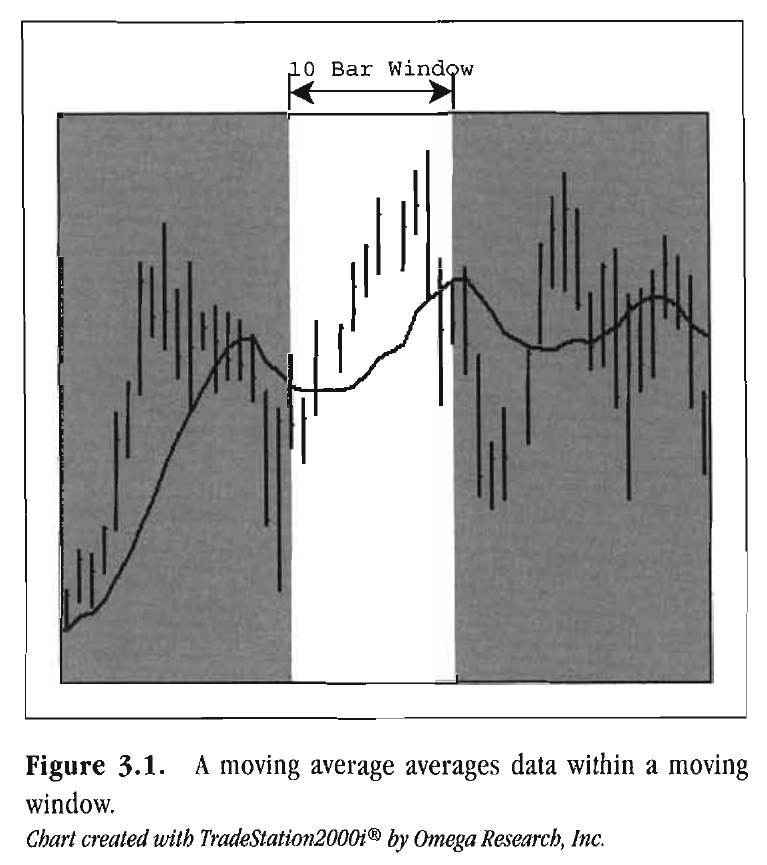
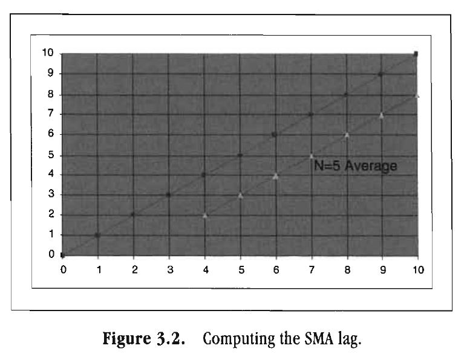
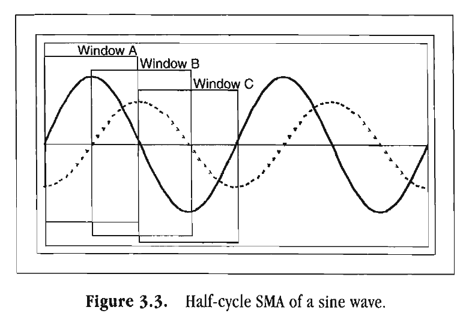
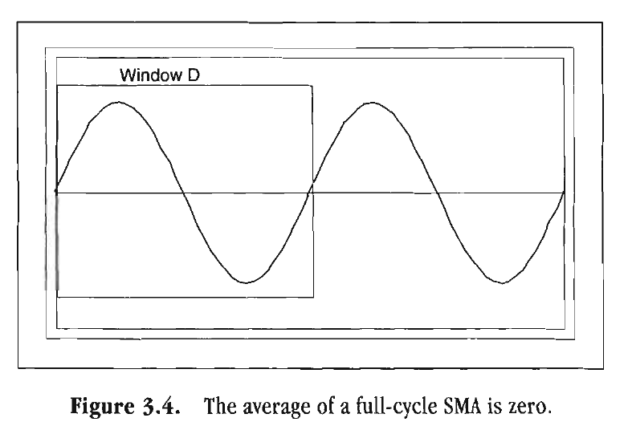
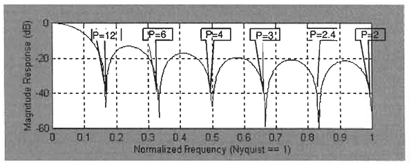
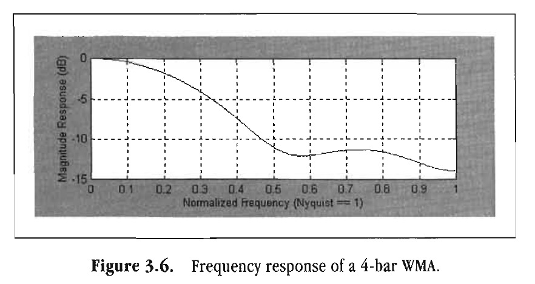
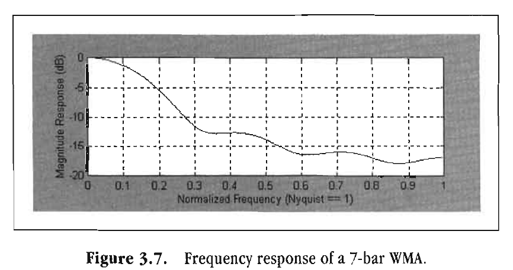
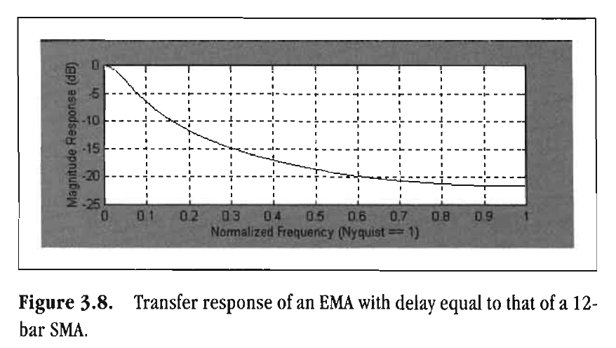
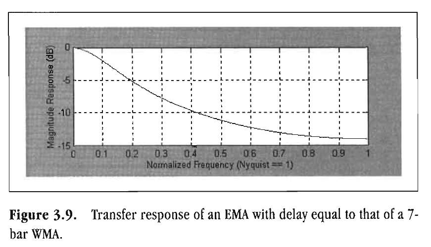

# MOVING AVERAGES

Trend is not destiny.
—LEWIS MUMFORD

Centuries ago Karl Friedrich Gauss proved that the average is
the best estimator of the random variable. He derived the familiar bell-shaped probability density curve known as the Gaussian, or Normal, distribution. When the probability distribution
of a random variable is unknown, the Gaussian distribution is
generally assumed. In this bell-shaped curve, the peak value, or
the mean, is the nominal forecast. The width of the variation
from the mean is described in terms of the variance. It is certainly true that the average is the best estimator for the market
in the case where the Diffusion Equation (as described in Chapter 2) applies. The best estimate of the location of any smoke
particle is the average across the width of the plume. This is
probably why moving averages are heavily used by technical
traders—they want the best estimate of the random variable.

All moving averages have two characteristics in common:
They smooth the data and cause lag because they depend on
historical information for computation. By far the most serious
implication for traders is the induced lag. Lag delays any buying
or selling decision and is almost always a bad characteristic.
Therefore, averaging is typically a trade-off between the
amount of desired smoothing and the amount of lag that can be
tolerated.

There are three popular types of moving averages. These are

1. Simple Moving Average (SMA)
2. Weighted Moving Average (WMA)
3. Exponential Moving Average (EMA)

Each of these types of averages has its own respective merit,
and there are times when any one of the three is the appropriate
choice. The discussions in this chapter describe each of the three
moving averages so you can make the comparisons for your own
applications.

## Simple Moving Average

An n-day simple average is formed by adding the prices of a security over n days and dividing by n. Thus, the weighted price for
each day is the real price divided by n. The simple average
becomes a moving average by adding the next day's weighted
price to the sum and dropping off the weighted first day's price.
Thus, the simple average moves from day to day. This is the
most efficient way to compute a Simple Moving Average (SMA).

Another way to view an SMA is as an average of the data
within a window. In this concept, the window slides across the
chart, forming the moving average from bar to bar, as shown in

*Figure 3.1. Figure 3.1 shows a 10-bar window and the moving*

average formed by this window. The average is plotted at the
right-hand side of the window, causing the moving average lag.
This is necessary because the window cannot accept data into
the future. So, when a moving average is used in actual trading,
the lag cannot be overcome. Centering the moving average on the
window is not helpful for trading because future data would be
required to get the current value of the average. Obviously, future
data are not available for the last bar on the chart.

The static lag of an SMA can be computed as a function of
the window width. Consider the following case where the data
have a price of zero at the left edge of the window. The price
increases by one unit for each subsequent bar, as shown in Figure 3.2. The average price is always the price at the center of the
window, expressed mathematically at (n - 1)/2. The average is

*Figure 3.1. A moving average averages data within a moving*

window.
Chart created with TradeStation 2000i by Omega Research, Inc.
plotted at the right-hand side of the window. Since the price
slope is unity (rises vertically one unit for each unit increase
along the horizontal), the averaged price at the right-hand side of
the window is effectively lagging the price at the center of the
window by (n - 1)/2 bars. This lag is simply unavoidable. An
example of a 5-bar window average is shown in Figure 3.2. It is
clear in this example that the lag is two units, equal to (5 - 1)/2.
As a trader, you must make a trade-off by choosing between the
amount of smoothing you want from your moving average and
the amount of lag you can tolerate.

A thorough understanding of the impact of moving average
lag is absolutely crucial for successful trading. On the one hand,
a wide averaging window provides a very smooth moving average.

*Figure 3.2. Computing the SMA lag.*

However, such a moving average is so sluggish in response
that it may only be useful in working with the longest trends. A
narrow averaging window, on the other hand, does not provide
much smoothing, so the average may be highly responsive but
can produce whipsaw signals due to inadequate smoothing.
Approaching a moving average from the perspective of the frequency domain rather than from the time domain can thus be
useful and instructive.

Assume the data comprise a theoretical sine wave as shown
in Figure 3.3. We can arrange our averaging window to be any
width we choose. The width of Window A in Figure 3.3
is exactly one half cycle. If the window were narrower, then the
average would not include all the data points in the positive
alternation of the sine wave, and the average would therefore be
less sensitive. If the window were wider than a half cycle, the
average would contain some negative data points as well as all
the data points in the positive alternation. Thus, the average
would also be less sensitive. Figure 3.3 shows the half-period
moving average of a sine wave. The peak value of this moving
average occurs at the right-hand side of Window A because Window A contains only the positive data points in the sine wave.

As we move the window to the right, the moving average
decreases in amplitude. Reaching Window B, the moving average is zero at the right-hand edge because Window B contains
exactly as many negative data points as positive data points,
causing the average to sum to zero. Continuing to move the window to the right, we arrive at Window C. The moving average at
Window C is maximum negative because Window C contains
only negative data points. The moving average is created by sliding the window across the entire data set.

Note that the half-period SMA of a sine wave is another
sinusoid (waves that look like sine waves), delayed by a quarter
cycle. Drawing from our previous knowledge of the lag of an
SMA, we can assert that the lag is half the window width,
expressed in fractions of a cycle period or in degrees of phase. A
quarter-cycle SMA will lag the price by an eighth of a cycle. This
is the equivalent of saying that if the averaging window is 90
degrees wide, the resulting SMA lag will be 45 degrees.

When the market is in a Cycle Mode, it is more important to
think in terms of the phase shift an SMA will induce rather than
in terms of the number of bars lag that it will cause. For example, a 2-bar lag is almost inconsequential for a 40-bar cycle.

*Figure 3.3. Half-cycle SMA of a sine wave.*

However, this same 2-bar lag is a full quarter-of-a-cycle phase
shift for an 8-bar cycle. In trading, it is important to always
consider the phases in relative terms, particularly when dealing with shorter cycles. For this reason, it is often preferable
to continuously adapt an SMA window to be a fraction of the
measured market cycle rather than using a fixed window width.
This adaptation enables the SMA to provide the same reaction to price movement regardless of the time period of the dominant cycle.

If we increase the window width to include a full cycle, as
shown in Figure 3.4, we have a very interesting case for the
SMA. Examination of Figure 3.4 shows that in a pure cycle,
when the window width is exactly one cycle, there are as many
data points above the mean as there are below it. Therefore, the
SMA is exactly zero for this special case. We use this phenomenon later to create the Instantaneous Trendline after we have
measured the dominant cycle. By adjusting the average to have a
window whose width is exactly the measured dominant cycle,
we cancel out the dominant cycle completely. Since our simplified market model consists of a Trend Mode component and a
Cycle Mode component, we are left with only the Trend Mode
component after the dominant cycle component has been removed.

*Figure 3.4. The average of a full-cycle SMA is zero.*

The Instantaneous Trendline differs from an SMA only
in the respect that the window width can vary from bar to bar.
Since the window width is always a full cycle period for this
indicator, the lag of the Instantaneous Trendline is a half period
of the dominant cycle.

The SMA is also identically zero for a pure sine wave when
the window width is exactly an integer number of cycles wide.
This can be seen in Figure 3.5, in which the window width is 12
bars. Figure 3.5 is attained by changing the frequency applied to
the fixed 12-bar-wide window. The results are plotted after being
normalized to the Nyquist frequency, which is exactly half the
sampling frequency. For example, if the data being used consist
of daily bars, then the Nyquist frequency is 0.5 bars per day.
Since the cycle period and the cycle frequency are inversely proportional, the period of the Nyquist frequency is 2 bars. The
periods of those components that have an integer number of
cycles within the 12-bar window have been noted in Figure 3.5.

The SMA window can be viewed as a transfer function that
multiplies the data falling within the window by 1 and multiplies all data outside the window by 0. This transfer response is
a pulse in the time domain. Functions in the time domain are
related to functions in the frequency domain by the Fourier
Transform, as discussed in Chapter 1. A derivation of Fourier
Transforms is beyond the scope of this book, but is covered in

*Figure 3.5. The transfer response of a 12-bar SMA.*

many fine texts. Without the derivation, I assert that the Fourier
Transform of the pulse in the time domain is

$$SMA(Period)= Sin(n \cdot \frac{W}{P})/(n \cdot \frac{W}{P})$$

where W = width of the SMA window
P = period of the cycle being averaged

The SMA is expressed in terms of wave amplitude. This mathematical equation for the frequency domain response of an SMA
exactly describes the function shown in Figure 3.5, except that
the figure is plotted in decibels rather than wave amplitude.
Each time the ratio of the window width to the cycle period is an
integer, the argument of the sine function is a multiple of Pi.
Since the sine is exactly zero for arguments in multiples of Pi,
the transfer response has nulls for these cycle periods.

*Figure 3.5. shows that low-frequency components (longer*

cycles) are allowed to pass through the SMA with only a small
amount of attenuation, or size reduction. However, highfrequency components (shorter cycles) are greatly attenuated,
even between the null points. For this reason, an SMA falls into
the category of low-pass filters. Low-pass filtering is exactly
what is desired from a data smoother. The smoothing comes
about as a result of reducing the size of, or attenuating, the
amplitude of the higher-frequency components within the data.

The frequency description of an SMA does not have a null at
zero frequency. At zero frequency, its period is infinite because
cycle period is the reciprocal of frequency. Therefore, although
the numerator goes to zero at zero frequency, the denominator
also goes to zero. In the limit, the ratio of the numerator to the
denominator is unity (a value of 1). We have previously assigned
some significance to the cycle period that is twice the window
width (or more precisely, where the window width was half the
cycle period). In this case, the numerator in the SMA frequency
description rises to become unity and the denominator is 42.
The cycle period that is twice the width of the SMA window is
a workable and easy-to-remember demarcation between those
cycle periods that have small attenuation and those that have

greater attenuation. For example, an SMA window width of 8
bars would allow those cycle components of 16 bars and longer
to pass nearly unattenuated and would attenuate cycle components whose periods are shorter than 16 bars.

We now have the tools to think about SMAs in both the time
and frequency domains. We know that the 8-bar SMA has a lag
of 3.5 bars for trends. This same SMA gives a 16-bar cycle a
90-degree phase delay and a 32-bar cycle a 45-degree phase delay. An
8-bar cycle component is removed completely. This ability to
think of the impact of averages in both the time and frequency
domains will greatly improve your probability of success as a
trader.

## Weighted Moving Average

A Weighted Moving Average (WMA) is closely related to an
SMA. The major difference is the coefficients of the multiplier
for the WMA are not constant across the window width. Rather,
the coefficients are linearly weighted across the window. Therefore, it follows that the oldest data point is multiplied by 1, the
next oldest data point is multiplied by 2, the third oldest data
point is multiplied by 3, and so on until the most recent data
point is multiplied by n for an n-bar window width. The sum of
the data and coefficient products is divided by the sum of the
coefficients to normalize the averaging process. A 4-bar WMA
code can be written as

WMA = (4*Price + 3*Price[1] + 3*Price[2] + Price[3])/10;

The transfer response of the 4-bar WMA is shown in Figure
3.6. Since the data are weighted across the window width, there
can be no precise averaging to zero as there was with an SMA.
Nevertheless, the WMA is also a low-pass filter. The point where
the filter attenuation is 3 dB acts as our point of demarcation
between the passband and the stopband. In Figure 3.6, this occurs
at a normalized frequency of 0.25, corresponding to an 8-bar cycle.
Cycles longer than roughly 8 bars are passed essentially unatten-

*Figure 3.6. Frequency response of a 4-bar WMA.*

uated, and cycles shorter than 8 bars are reduced in amplitude to
provide the smoothing.

As with SMAs, smoothing of WMAs is improved by increasing the width of the window. For example, the transfer response
of a 7-bar WMA is shown in Figure 3.7. In this case, the -3 dB
point occurs at a normalized frequency of about 0.14, which is a
period of approximately 14 bars. Since the passband is linearly
related to the window width, the passband of a WMA is also
twice its window width, as a reasonable approximation.

A WMA offers a major advantage because it exhibits reduced
lag in its transfer response. The reduced lag results from the

*Figure 3.7. Frequency response of a 7-bar WMA.*

most recent data being the most heavily weighted. The amount
of lag induced by an SMA or a WMA is the center of gravity of
the transfer response. In the case of the SMA, the center of gravity is at the center of the filter, resulting in a lag of (n - 1)/2 for
an n-bar window width. The shape of the WMA coefficients
forms a triangle across the width of the filter, resulting in the
center of gravity being a triangle, one-third of the distance across
the window. Thus, the lag of an n-bar WMA is (n - 1)/3. Therefore, in our examples, a 4-bar WMA has a lag of only 1 bar and a
7-bar WMA has a lag of only 2 bars.

The weighting functions for a WMA do not necessarily have
to be linear across the width of the window. The linear weighting is nonetheless very simple to compute, and the impact of linear weighting is easy to remember by recalling the center of
gravity of a triangle. Furthermore, the impact of other weighting
distributions is too subtle for trading purposes. Therefore, there
is no compelling reason to use any weighting factor other than
linear.

## Exponential Moving Average

The moving averages discussed thus far are nonrecursive. That
is, previous calculations are unnecessary to compute the current value of the moving average. An Exponential Moving Average (EMA) is different in a major way because it is recursive.
The calculations use a fraction of the current price added to
another fraction of the EMA calculation 1 bar ago. The first
fraction is usually called alpha (a) and can have a value between
0 and 1. The two fractions must sum to unity, so the second
fraction must have the value of 1 - a. The equation to compute
an EMA is

EMA = a*Price + (1 - a)*EMA[1];

The EMA becomes a moving average by moving from bar to bar,
from left to right, across the price data.

The term exponential describes the way an EMA transfer response decays in amplitude relative to a single input. Imagine a
case in which the data set has an amplitude of 1/a at one bar and
an amplitude of 0 everywhere else. When the EMA is applied to
this data, the first output from the filter is unity because there
was no previous value for the EMA. On subsequent calculations,
the price value is 0, and so the sequence of calculations is

$$EMA(0) = 1$$

$$EMA(1) = (1 - a)$$

$$EMA(2) = (1 - a) \cdot (1 - a) = (1 - a)^2$$

$$EMA(3) = (1 - a)^2 \cdot (1 - a) = (1 - a)^3$$

$$EMA(n) = (1 - a)^n$$

Since the quantity (1 - a) must be less than 1, the amplitude
decays as the exponent of each succeeding calculation from an
impulse input. Hence the name Exponential. In principle, a part
of any data input remains in subsequent calculations although
the contribution becomes vanishingly small. This attribute
makes an EMA part of a general class of filters called Infinite
Impulse Response (IIR) filters. IIR filters are distinct from the
Finite Impulse Response (FIR) filters, the class to which the
SMA and WMA belong. With FIR filters, the filter provides an
output only so long as the impulse falls within the window.
Thus, in this case, the response to an impulse is finite.

It is instructive to examine the EMA response to a step function. A step function has a series of constant values and then
jumps to another series of constant values. Assume the price has
been 0 for a long time and then suddenly jumps up to a value of
1 and maintains that value thereafter. On the first bar, the EMA
will have a value of a. On the second bar, the value will be a +
a*(1 - a). On the third bar, the value will be a + a*(1 - a) + a*
(1 - a)^2, and so on. The EMA will gradually approach the value of
1. A common error in programming is to insert a value for a,
such as 0.2, and insert another number for (1 - a), such as 0.9.
The two terms must sum to unity or the recursive algorithm
will lead to erratic results or might even cause your computer to
crash. You should always check your computer code to ensure

the two terms sum to unity. I am so cautious on this point that
I assign the value a as a global variable and write out the EMA
equation in terms of a. By letting the computer do the work, I
know the two terms must sum correctly.

We can easily derive the lag of an EMA for the case of price
that rises linearly at the rate of one unit per bar. Recalling the
form of the EMA calculation,

EMA = a*Price + (1 - a)*EMA[1];

We can assert that the price on day d is d. If we assume the
lag of the EMA is L, then the current value of the EMA is (d - L).
Furthermore, the previous EMA would have a value of (d - L -
1), since price is rising one unit per bar. Putting these values into
the equation for the EMA, we obtain

$$(d - L) = a \cdot d + (1 - a) \cdot (d - L - 1)$$

$$= a \cdot d + (d - L) - 1 - a \cdot d + a \cdot (L + 1)$$

$$0 = a \cdot (L + 1) - 1$$

$$a = 1/(L + 1)$$

This equation shows that we can select an acceptable lag, and
from that lag, compute the alpha term of the EMA. For example,
if we can accept a 3-bar lag resulting from the EMA, we would
use a = 0.25.

We can also relate an EMA to an SMA on the basis of their
equivalent static lags. Recalling that the lag of an SMA is (n -
1)/2 for an n-bar SMA, we can substitute this value of lag into
the alpha calculation of the EMA as

$$a = 1/((n - 1)/2 + 1)$$

$$= 2/((n - 1) + 2)$$

$$= 2/(n + 1)$$

This is the relationship between an n-bar SMA and the alpha of
an EMA that is quoted in most technical analysis books.

A 12-bar SMA was used to compute the transfer response
shown in Figure 3.5. The equivalent alpha for an EMA is a =

*Figure 3.8. Transfer response of an EMA with delay equal to that of a 12-bar SMA.*

0.1538. The EMA transfer response for this value of alpha is
shown in Figure 3.8. Comparing Figures 3.8 and 3.5, it is obvious that the EMA normalized frequency passband is much
smaller than the passband of the SMA. Therefore, an EMA provides much more smoothing than an SMA for an equivalent
amount of lag. Alternatively, you can conclude that an EMA
has much less lag than an SMA for an equivalent amount of
smoothing.

It is also interesting to compare a WMA to an EMA on the
basis of equivalent lag. The WMA that produced the transfer
response depicted in Figure 3.7 had a lag of 2 bars. For a 2-bar lag,
an EMA has a = 0.3333. The transfer response of the EMA is
shown in Figure 3.9. In this case, the EMA response is nearly
equivalent to the response of the WMA shown in Figure 3.7,
with the WMA providing slightly better filtering. Furthermore,
the WMA attenuates those components within the passband a
little less than the EMA for these same components.

We do not yet have the tools to compute the cycle period of
the passband demarcation in the frequency domain in terms of
the alpha of the EMA, but we can assert without proof that this
relationship is

P = -2π/ln(1 - a)

*Figure 3.9. Transfer response of an EMA with delay equal to that of a 7-bar WMA.*

where ln is the natural logarithm. This relationship is proved in
Chapter 13. Computation of the natural logarithm may be
unnatural to most traders, so we simplify the equation with a
little mathematical sleight of hand. We can approximate the natural logarithm with a truncated infinite series because (1 - a)
will always be less than unity as

ln(1 - a) = -a - a²/2 - a³/3 - a⁴/4 ... -aⁿ/n

If a is sufficiently small, we can ignore all but the first two
terms of the series. Substituting the truncated series for the natural logarithm in the passband period calculation, we obtain

$$P = 2\pi/(a + \frac{a^2}{2})$$

$$= 4\pi/(a \cdot (2 + a))$$

## Key Points to Remember

Regardless of their formulation, the purpose of moving averages
is to smooth the input data. Their use is a trade-off between the
amount of smoothing you desire and the amount of lag you can
tolerate.

**SMA**
- Lag is (n - 1)/2.
- Passband period is 2*n.
- Phase lag is a linear function of window width.

**WMA**
- Lag is (n - 1)/3.
- Passband period is 2*n.
- Gives the best filtering for a given amount of lag.
- Phase lag is a linear function of window width.

**EMA**
- a = 1/(Lag + 1).
- a = 2/(n + 1) when compared to an SMA.
- The a and (1 - a) terms must always sum to unity.
- Passband period is -2π/ln(1 - a) ≈ 4π/(a*(2 + a)).
- Phase lag is nonlinear due to recursion.
