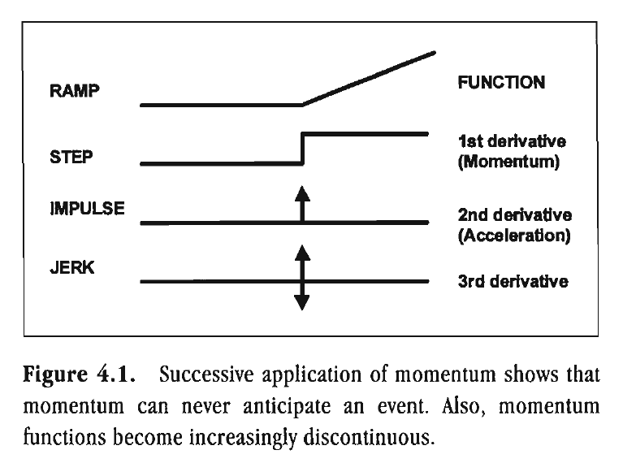
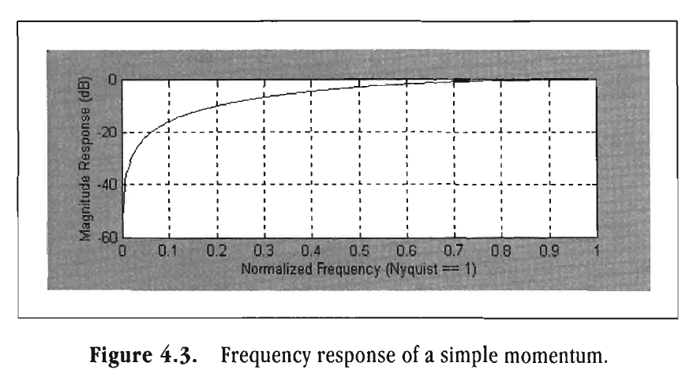
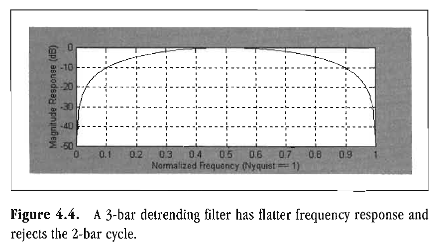
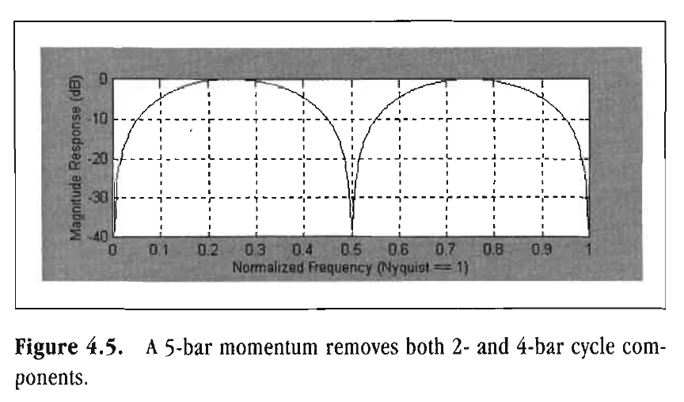
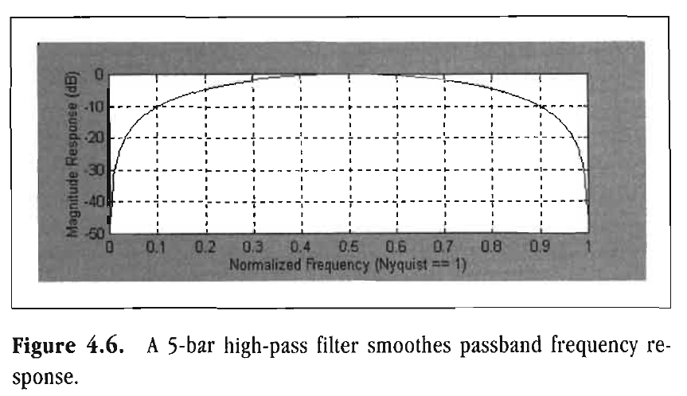

# MOMENTUM FUNCTIONS

Backward, turn backward,
oh time in your flight. . .
"ELIZABETH AKERS ALLEN
I can't begin to tell you the number of traders that has asked me
to make their signals happen just one bar sooner. The typical
question is "Can't you just take a momentum?" In the most
simple case, momentum is just the 1-bar difference in price.
Momentum is deceiving because it can give the illusion of anticipating turning points. In fact, there are cases in which some
form of a momentum can increase the reaction time of an indicator. Even experienced technicians get lured into investigations
in which advancing the indicator signal is impossible. For this
reason, it is instructive to return to basics and thoroughly investigate the properties of momentum functions.
In the most general sense, momentum functions simply take
the difference of successive values to sense the rate of change.
Just as the sums forming the averages are analogous to integrals
in the calculus, momentum is analogous to derivatives in the
calculus. The impact of momentum can be appreciated by taking successive momentums as we do in Figure 4.1.
In Figure 4.1, we analyze the successive momentums of a
simple ramp function. The ramp is described as having a zero
slope before an instant in time T and then breaking to a finite
slope at that instant. This is a relatively smooth function. The
first momentum of the ramp is a step. There is no change in the
slope of the ramp before or after time T, so the step function is

Rocket Science for Traders
RAMP FUNCTION
t
derivative 2nd
(Acceleration)
JERK
3rd derivative

*Figure 4.1. Successive application of momentum shows that*

momentum can never anticipate an event. Also, momentum
functions become increasingly discontinuous.
formed by instantly jumping from an initial slope of zero to the
finite value of the slope of the ramp. Taking the momentum of
the step function, there is no change except the instantaneous
jump from one value to another at time T. This forms an impulse.
An impulse is a mathematical artifice that has infinite height
and zero width in such a way that the area of this "rectangle" is
unity. Put simply, an impulse is a spike at time T. Next, taking
the momentum of the impulse, we obtain a jerk. The jerk is
formed by a two-step process. A positive impulse part of the jerk
is first formed by traversing the leading edge of the impulse
function. This is followed by the formation of the negative
impulse part, which is due to traversing the trailing edge of the
impulse function.
Examination of Figure 4.1 identifies two undeniable truths
about momentum functions. These are
1. Momentum can never lead the event.
2. Momentum is always more disjoint (i.e., noisier) than the
original function.
These truths are obvious when removed from the distractions of
a price chart. There must be a reason why traders expect momentum to increase the performance of their indicators. That reason
is demonstrated in Figure 4.2, where the momentum of a pure
sine wave is taken. Since momentum is the rate of change of a
function, the momentum of the sine wave is maximum at the
Figure 4.2 where the sine wave crosses zero. The
momentum decreases as the sine wave increases. It reaches zero
at the point where the sine wave crests. The slope of the sine
wave at this point is zero, causing the momentum to be zero.
To the right, the slope of the sine wave increases in
the negative direction, causing the momentum to reach its negative maximum just as the sine wave again crosses zero. The
momentum traced out by the dashed line in Figure 4.2. This
has the characteristic that it reaches a crest 90 degrees before the sine wave crests and reaches a valley 90 degrees
before the sine wave does.
If the price were a sine wave, it would be easy to conclude
that momentum is a leading indicator. But this is true only
when the market is in a Cycle Mode. It is, therefore, imperative
to first identify the mode of the market before assigning a leading indicator capability to the momentum. In Chapter 11, methods to identify market modes are discussed.
We have already stated that momentum is analogous to a
derivative in the calculus. We can use this fact to analyze the
momentum. It leads a pure sine wave by 90 degrees.

behavior of momentum in the frequency domain. From any calculus text, the derivative of a sine wave having the angular frequency a is

$$d(Sin(at))/dt = a \cdot Cos(at)$$

This equation shows that the derivative of a sine wave does
lead the sine wave by 90 degrees because the result is exactly a
cosine wave, like the dashed momentum shown in Figure 4.2.
The equation also shows that amplitude is directly proportional
to frequency. The amplitude is omega (a), which is 2*pi*frequency. We expect the same phenomenon in trading. If we take
the simple difference (momentum) of a 2-bar cycle that varies
between +1 and -1, the difference will be the crest-to-valley
value, or 2. Conversely, if we have a 50-bar cycle swinging between +1 and -1, then the maximum momentum will be
approximately = 0.08. There is no momentum for extremely
long cycles because there is essentially no rate of change that is
useful for trading. The frequency response of a simple 1-bar
momentum is shown in Figure 4.3.

*Figure 4.3. shows that a zero frequency signal is almost com-*

pletely rejected by the filter. Shorter frequencies are rejected
less. For example, a 10-bar cycle signal has a normalized frequency of 2/Period = 2/10 = 0.2, and is only attenuated by about 10
dB. A 4-bar cycle signal (2/4 = 0.5 normalized frequency) is only

*Figure 4.3. Frequency response of a simple momentum.*

attenuated by about 3 dB. Since very-low-frequency components
are rejected and higher-frequency components are passed, Figure
4.3 suggests that momentum can be used as a detrending filter.
However, the passband is too narrow to be of practical benefit.
As you recall from Chapter 3, the half-power point, or -3 dB
point, is the accepted practical cutoff frequency. According to
this definition, only cycles with periods of 4 bars or less would
be passed. We can flatten the frequency response by making the filter wider. However, in making the filter wider we also increase
the lag. As with an SMA, the lag through an n-bar momentum is
Lag = (n - 1)/2. Therefore, there is a 1-bar lag for a 3-bar momentum (Lag = (3 - 1)/2 = 2/2 = 1). The 3-bar momentum is computed
from the equation:
MO = 0.5*Price - 0.5*Price[2];
The frequency response of this filter is shown in Figure 4.4.
There are two clear benefits from this filter, as opposed to the
simple momentum filter of Figure 4.3. First, the frequency response of the filter is much flatter. For example, the attenuation
at the normalized frequency of 0.1 (a 20-bar cycle) is only -10 dB
instead of the approximate -17 dB in Figure 4.3. Second, the 2-bar cycle (normalized frequency = 1) is nearly completely suppressed. The 2-bar cycle is always suppressed if the order of the
symmetrical filter is odd.

Normalized Frequency (Nyquist == 1)

*Figure 4.4. A 3-bar detrending filter has flatter frequency response and*

rejects the 2-bar cycle.

*Figure 4.5. A 5-bar momentum removes both 2- and 4-bar cycle com-*

ponents.
If a little bit is good, a whole lot more is better-maybe. We
can attempt to flatten the frequency response by using a 5-bar
momentum. The equation becomes
MO = 0.5*Price - 0.5*Price[4];
The frequency response for this 5-bar momentum is shown
in Figure 4.5. Unfortunately, we have introduced another frequency notch at a 4-bar cycle. Once we stop and think about it,
we see that this makes sense because subtracting data from a 4-bar cycle 4 bars ago will exactly cancel any output from the
high-pass filter.
The frequency notching exhibited in Figure 4.5 can be eliminated by making the filter have symmetrical coefficients. For
example, if we write the equation as

MO = 0.0909*Price + 0.4545*Price[1]
+ 0 - 0.4545*Price[3] - 0.0909*Price[4];

we then get the high-pass frequency response shown in Figure
4.6. We have quickly reached the point of diminishing returns
for this approach. For example, the attenuation for the 20-bar
cycle slipped from -5 dB in Figure 4.5 to about -8 dB in Figure
4.6. In addition, the lag from the high-pass filter is 3 bars. The

*Figure 4.6. A 5-bar high-pass filter smoothes passband frequency re-*

sponse.
advantage of the 90-degree phase lead due to differencing is
quickly lost due to the lag. The total phase lag as a function of
cycle period due to the 3-bar lag can be written as

$$Phase\ lag = 360 \cdot \frac{3}{Period} - 90\ degrees$$

By setting the phase lag to zero, we find that the shortest cycle
period having no phase lag is a 12-bar period. Longer cycles will
have a phase lead. Since we need to work with cycle periods
even shorter than 12 bars, there is no point in attempting to
make the differencing have a wider passband because additional
lag will be induced. Thus, we have reached our point of diminishing returns. Further amplitude corrections must be accomplished by measuring the dominant cycle and then applying a
correction term for that cycle.
It is interesting to take the momentum of an SMA. To clarify
this point, we refer to prices from the current time as A, B, C, D,
and E. A 4-bar SMA of the prices is

$$SMA = (A + B + C + D) / 4$$

and the 4-bar SMA of the prices 1 bar ago is

$$SMA_1 = (B + C + D + E) / 4$$

When we take the difference of the two moving averages, we get

$$SMA - SMA[1] = (A - E) / 4$$

The interesting conclusion here is that the momentum of a
4-bar SMA is exactly the same as a 4-bar momentum within
a constant factor of the averaging. This specific conclusion can
be extended to any length SMA.
By the same token, an SMA of four momentums arrives at
the same conclusion. Consider this relationship:
It all boils down to the same thing. An n-bar average of momentums is exactly the same as an n-bar momentum.
Key Points to Remember
Momentum can never lead the event.
Momentum is always noisier than the original function.
Momentum can produce a 90-degree phase lead in the Cycle
Mode.
Improving momentum quickly reaches a point of diminishing returns.
Amplitude compensation of momentum can be accomplished
by measuring the dominant cycle and applying a correction
for that cycle period.
The momentum of an n-bar SMA is the same as an n-bar
momentum.
