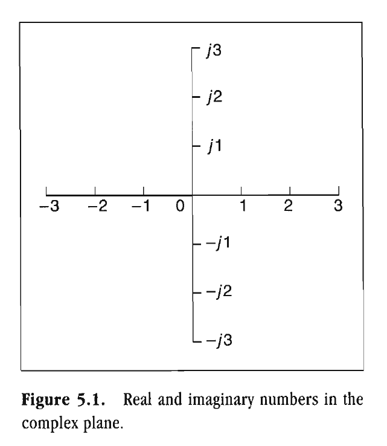
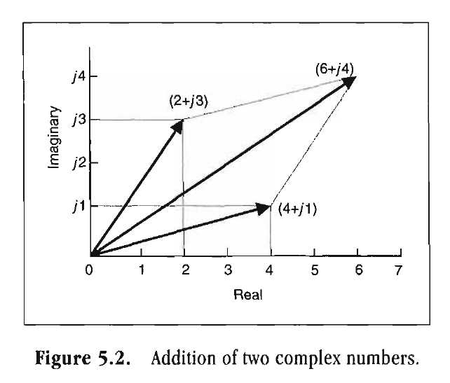
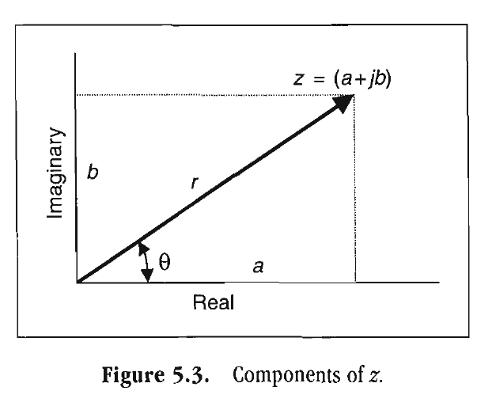
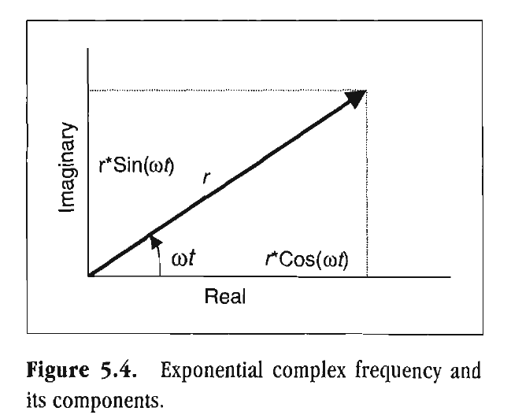
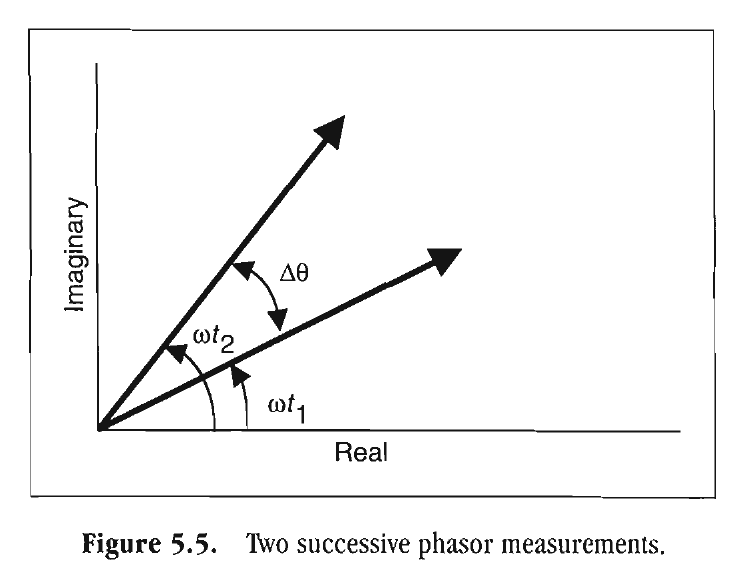
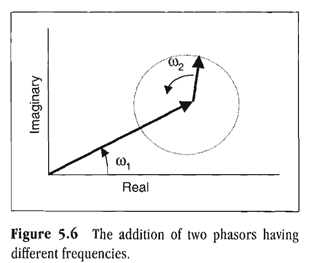

# COMPLEX VARIABLES

Numbers are like people; torture them enough
and they will tell you anything.
-ANONYMOUS
The mathematical concept of complex variables is introduced in
this chapter to lay the groundwork for the derivation of indicators that are either impossible without complex variables or that
would require enormous computational overhead without them.
Mastering complex variables will give you great insight into the
way market action can be described, and can even suggest new
indicators.
Since you are reading this book, you are undoubtedly comfortable with our number system. However, there are some
primitive societies that have no words for numbers larger than
10, other than an equivalent to "many," because they run out of
fingers on which to count. Even more surprising is the fact that
the concept of zero is a relatively modern invention. If you stop
and think about it, "nothing" in the physical world is an
abstract concept, so why would one need a word to describe it?
There was no zero in Roman numerals. In fact, the concept of
zero was not introduced to the Western world until the Renaissance when Leonardo de Pisa (1170-1240) (also called Fibonacci)
wrote Liber abaci. Somewhat later, the idea of negative numbers
was introduced. If zero is an abstract concept, how could one
possibly have less than nothing? Clearly, this objection to the
number system existed before the days of margin calls. Today, it
is accepted that the numbering system can be viewed as a continuum of real numbers ranging from minus infinity to plus infinity along a straight line.
There is no reason why numbers must be confined to a line.
We can conceive of numbers as existing in a plane. Following
this concept, any position on that plane can be described by an
ordered pair of real numbers. The first number of the pair
denotes the number of units along the horizontal dimension,
and the second number of the pair denotes the number of units
along the vertical dimension. But describing a position in a plane
is rather clumsy. Also, a need for complex numbers arises in
algebra from the impossibility of finding the square roots of negative quantities. The clumsy situation has to be avoided, and we
do this by the invention of the imaginary unit
We can then define a complex number as a combination of
(a + ib) formed from the two real numbers a and b, and the imaginary unit i. The imaginary unit i not only has the value of the
square root of -1, but also serves as a rotation operator. Thus,
the point on the plane denoted by (a + ib) is a units along the
horizontal and b units along the vertical. In this structure, the
imaginary operator reorients a real number from the horizontal
axis to the vertical, acting as the rotation operator. The two
components a and ib are called the real and the imaginary,
respectively, of the complex number. Numbers along the vertical dimension are often called imaginary numbers. This is an
unfortunate name choice, for this number is no more imaginary
than other numbers. Imaginary numbers is just an assigned
name, like rational numbers or prime numbers. What is important is that the use of complex numbers ensures that a polynomial of any order with real coefficients can be factored into
complex roots. For example, the polynomial x' + bx + c cannot
be factored into real roots if c > b2.
Electrical engineering uses the symbol i to denote electrical
current. Therefore, it is common practice to use the symbol j to
denote the complex operator to avoid confusion with electrical
current. We follow that practice in this book. It is also common
to refer to the horizontal dimension as x and the vertical dimension as y, so the complex number z is understood to be z = x + jy.

Complex Variables

-j1
-j2

*Figure 5.1. Real and imaginary numbers in the*

complex plane.

The real and complex numbers forming the complex plane are
depicted in Figure 5.1.
Arithmetic can be easily performed in the complex plane. If
you add a real number to another real number, the result is a real
number that is the sum of the two real numbers. If you add
an imaginary number to another imaginary number, the result
is an imaginary number that is the sum of the two imaginary
numbers. However, if you add an imaginary number to a real
number, the result is a complex number. The real numbers and
imaginary numbers are said to be orthogonal. In this case, orthogonal not only means that the numbers exist at right angles, but
it also means that they are independent of each other. The most
complicated mathematical operation occurs when a complex
number is added to another complex number. In doing this,
the real components are added together and, independently, the
imaginary components are added together. An example of complex addition is shown in Figure 5.2, which shows that the addition of complex numbers is exactly the same operation as vector
addition in two dimensions.

0 1 2 3 4 5 6 7
Real

*Figure 5.2. Addition of two complex numbers.*

The product of a real and an imaginary number is imaginary.
Thus 2*j3= j6. The product of two real numbers is real, as is the
product of two imaginary numbers: j2*j3 = -6, and j3 *(-j4) =
+12. The reason the product of two imaginary numbers is real is
that the imaginary unit is also multiplied, and j2 = -1. The multiplication of two generalized complex numbers is
(a + jb)*(c + jd)= ac - bd + jad + jbc = (ac- bd) + j(ad + bc)
A complex number can also be expressed in polar coordinates. With reference to Figure 5.3, the polar coordinate dimensions are r at an angle of 8. The relationships between the real
and imaginary coordinates and the polar coordinates are

$$a = r \cdot Cos (e)$$

$$b = r \cdot  Sin (e)$$

r = G T P

$$8 = ArcTan(\frac{b}{a})$$

It is also useful to express complex numbers in exponential
form. The exponential function is, by definition, equal to the
limit approached by an infinite series:

Complex Variables

$$z = (a+jb)$$

Real

*Figure 5.3. Components of 2.*

9x3 x"

$$&=l+x+-+-+ ...-$$

2! n!
3!
This series reminds us of the series that defines the trigonometric functions:
COS (e) = 1- - e2 + - e4 - . . . + (-1)^p - 82"
2!
4!
(2n)!
e5 -
sin (e) = e - - e3 + - - . . . - 11
3! 5! (2n- 1)!
The sine and cosine series, although rather like the exponential series in most other ways, have a reversal of sign of alternate
terms. A similar reversal of sign takes place in the exponential
series, but only if the exponent is imaginary. Consider e^je, which
can be found by letting x = je in the exponential series. In this
case we obtain
--+e2- -. e4 . e5 . .)

$$eje= ( 1 .)+(e--+e-3- .$$

2! 4! 3! 5!
By comparison to the series expansions for the sine and
cosine functions, we can express the exponential form as

eje = Cos (e) + j Sin (e)

Alternately, we can express the Cosine and Sine functions as

$$eie + e-ie = 2 Cos (e)$$

$$and eie - e-ie = j2 Sin (e)$$

This is an important theorem of complex variable theory
known as Euler's Theorem. Euler's Theorem says that sines and
cosines can be expressed in terms of an exponential function
having an imaginary operator.
We are all familiar with the frequency of a cycle. For example, the power coming from our wall plugs is an alternating current. The frequency of this alternating current is 60 cycles per
second. Cycles are repetitive. Each time a cycle is completed, it
sweeps through 360 degrees, or 2n radians, of a sine wave. It is
convenient to define the angular frequency as 2n times the regular frequency by the equation w = 27$ where o is the Greek letter omega. Using these definitions, ~t is the number of radians a
cycle covers in a given amount of time. Since wt is an angle, we
can represent the cycle in exponential form as ejwt, using complex notation. We thus see in Figure 5.4 that a pure cycle of an
analytic waveform in the time domain can be represented as a
projection onto either the real or imaginary axis.

Real

*Figure 5.4. Exponential complex frequency and*

its components.

The concept of the exponential form is an extremely important one for the digital signal processing of trading waveforms.
The waveform we observe on the charts is called an analytic
waveform. If we can break the analytic waveform into its two
orthogonal components, we can immediately find the amplitude
of the cycle. By examination of Figure 5.4 and using the Pythagorean Theorem, we can see that the square of the real component
plus the square of the imaginary component is equal to r2, the
square of the cycle amplitude. Thus, we have a bar-by-bar measurement of the amplitude of the cycle in the time domain. Such
a highly responsive measurement of signal amplitude is an important component of all effective trading indicators and systems.
The exponential form also gives us a particularly simple way
to measure the period of the market cycle. The cycle period measurement approach can be understood with reference to Figure
5.5. The initial measurement is made at time t1 so that the phase
angle is at1. The second measurement is made at time t2, resulting in the measured angle at2. The difference between the two
phase angles is Ae. To measure the cycle period, we simply keep
adding all the A& until the sum equals 360 degrees. The number
of times we have to add the Aes is, by definition, the period of the
cycle. We discuss exactly how to do this in Chapter 7.

*Figure 5.5. Two successive phasor measurements.*

Figures 5.4 and 5.5 are phasor diagrams. Phasor diagrams represent the cycle as a rotating vector (or, the phasor) in complex
coordinates, where the tail of the phasor is pinned to the origin.
The length of the phasor represents the wave amplitude of the
cycle. The phase angle represents a particular location within
the cycle.
The phasor diagrams we have been discussing only consider
the presence of one significant dominant cycle in the data. Happily, that is usually the case. The phasor diagram is therefore
useful for comparing the lead and amplitude of momentum
functions to the original data, and also for comparing the lag and
amplitude of smoothing functions to the original data.
But what if there is a secondary cycle present in the data?
Such a cycle is very difficult to identify because it lasts for only a
brief amount of time and the short amount of data we are forced
to use cannot provide enough resolution for filters. Since the
complex variables can be added, the phasor picture might look
something like the depiction in Figure 5.6. The dominant cycle,
having a frequency of o1, is rotating as previously described. The
secondary cycle is assumed to have a smaller amplitude and a
higher frequency o2. When these two complex variables are
added, the secondary cycle spins like a bicycle pedal at the end of
the crank, which is analogous to the tip of the phasor of the first
Real

*Figure 5.6. The addition of two phasors having*

different frequencies.

cycle. Assuming the secondary cycle is present only for a short
while, the resultant phasor will look like the dominant cycle
with a little whiffle superimposed on it. These whiffles are
immediately identifiable when the phasor is plotted. In later
chapters, we identify these whiffles in the real data.
Key Points to Remember
Complex variables are a two-dimensional number set.
The horizontal dimensions are called real numbers.
The vertical dimensions are called imaginary numbers.
j = fi and is the 90-degree rotation operator.
A rotating phasor describes a pure cycle from the exponential complex frequency.
e Relative phases can be described using phasor diagrams.
e Euler's equations describe Cosines and Sines of real frequencies as being comprised of complex frequencies.
e Two simultaneous cycles can be depicted as a bicycle diagram.
