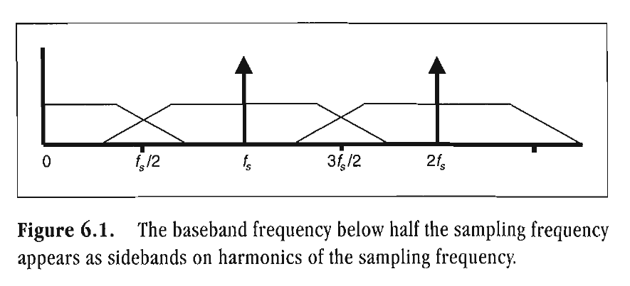
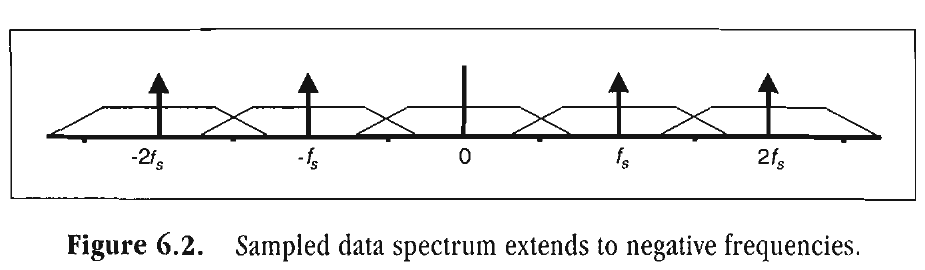
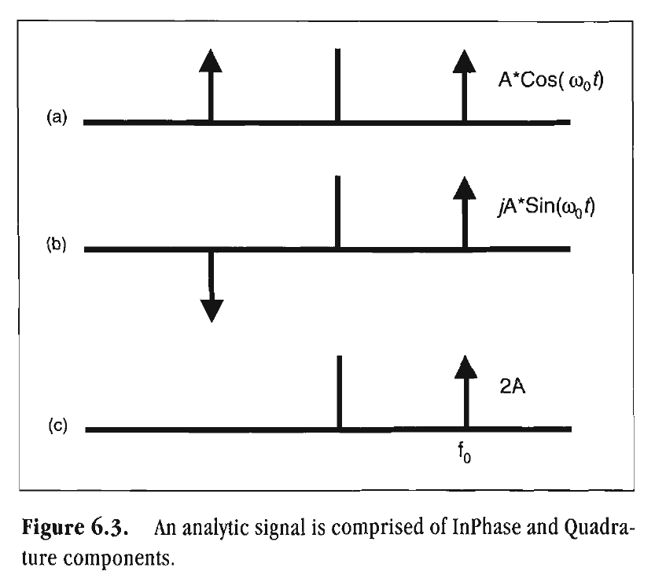
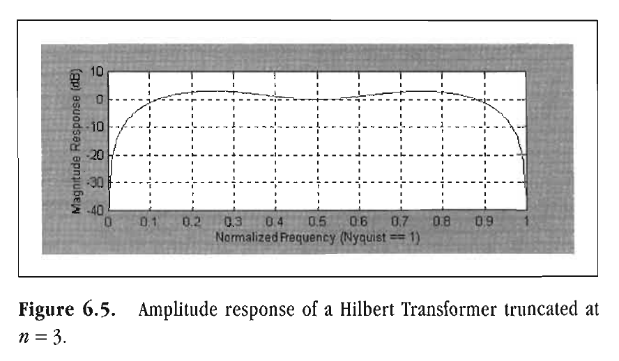
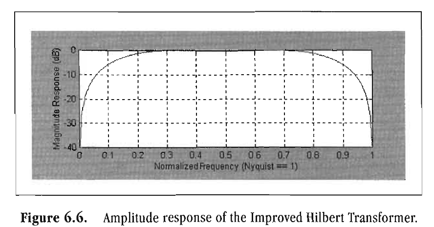

# HILBERT TRANSFORMS

Ideas are like rabbits. You get a couple
and learn how to handle them,
and pretty soon you have a dozen.
-JOHN STEINBECK

This chapter contains some of the most important concepts
upon which all the following practical applications are based.
First, we derive the Hilbert Transform. The Hilbert Transform is
a procedure to create complex signals from the simple chart data
familiar to all traders. Once we have the complex signals, we can
compute indicators and signals that are more accurate and
responsive than those computed using conventional techniques.
In fact, some of the indicators we will discuss cannot be calculated at all without the Hilbert Transform.
If we accept that there can be imaginary numbers, then the
concept of negative frequencies should pose no problem. If we
review trigonometric identities, we recall that Cos(-ωt) = Cos(ωt)
and that Sin(-ωt) = -Sin(ωt). These identities show that we can
easily accommodate negative frequencies. Further, the power
contained in waveforms is proportional to the average square of
the waveform. The squaring of the sign always produces a positive power, so there can be no exception to the concept of conservation of power if we use negative frequencies.
When data are sampled at a sampling frequency fs, that sampling frequency acts like a radio carrier signal. That is, the real
data being sampled are heterodyned into upper and lower sidebands of the sampling frequency. Mathematically, heterodyning

is multiplying two frequencies (and then filtering to select the
desired output). So, if we have a baseband data frequency of fb,
the heterodyning can be described as the product of two signals.
By a trigonometric identity, this product results in the sum and
difference frequencies as
The lower sideband can be considered as a negative frequency relative to the sampling frequency, and the upper sideband can be considered as a positive frequency relative to the
sampling frequency. Furthermore, every harmonic of the sampling frequency exists. Each harmonic also has an upper and
lower sideband containing the baseband signals.
Since the lower sideband of the sampling frequency exists, it
could extend down into the baseband range of frequencies. For
this reason, the baseband range of frequencies is limited to fs/2.
This is called the Nyquist sampling criteria. In trading, this
means the absolute shortest period we can use is a 2-bar cycle, or
a frequency of 0.5 cycles per bar. The sampling frequency can be
weekly, daily, hourly, and so on, but the shortest period we can
consider in any time frame is a 2-bar cycle.
The sampled data spectrum can be pictured as shown in Figure 6.1. The baseband signal is depicted as a continuum of frequencies that is bandlimited, either naturally or by a filter, to be
less than half the sampling frequency. Several of the harmonics of the sampling frequency are also shown, along with their
respective sidebands. Since we are talking about complex functions, the sampled spectrum can extend below zero frequency as
well. As a result, the complete sampled frequency spectrum
extends from minus infinity to plus infinity, as shown in Figure
6.2. An interesting observation is that either the upper or lower
sideband of any harmonic of the sampling frequency can be
processed with exactly the same result because the same information resides in all sidebands. The frequency selection for processing is a matter of convenience and is, therefore, usually the
baseband because demodulation of the zero frequency harmonic
is not required.

*Figure 6.1. The baseband frequency below half the sampling frequency*

appears as sidebands on harmonics of the sampling frequency.
The waveforms with which all traders are familiar are called
analytic signals. Analytic signals are defined as a special case of
a complex function without imaginary values, that have only
positive or only negative frequencies, but not both. We need to
construct more general complex functions to enable more efficient signal processing. This can be done by synthesizing the
analytic signal from a combination of two complex signals that
are odd and even functions around zero.
First, we must recall the trigonometric identities Cos(ωt) =

Cos(-ωt) and Sin(ωt) = -Sin(-ωt) and Euler's equations:

and
We can synthesize the analytic signal by summing the two complex signals as shown in Figure 6.3. The real component of Figure
6.3(a) is summed with the imaginary component in Figure 6.3(b)
to form the complex signal shown in Figure 6.3(c). From Euler's
4 4 4 4
-2fs -6 0 fs 2 fs

*Figure 6.2. Sampled data spectrum extends to negative frequencies.*

*Figure 6.3. An analytic signal is comprised of Inphase and Quadra-*

ture components.
equations, the two complex signals can be called the Inphase
(i.e., the Cosine) component and the Quadrature (i.e., the Sine)
component. Quadrature means being rotated by 90 degrees.
The Hilbert Transformer has been derived in a number of
texts, to which you may want to refer for more information.
One purpose of a Hilbert Transform is to create a complex signal
from an analytic signal. A Hilbert Transformer shifts all positive
frequencies by -90 degrees and all negative frequencies by 90
degrees. Since the frequency response of sampled systems is
periodic, we can describe the Hilbert Transformer in terms of
angular frequency as shown in Figure 6.4 for unity amplitude
components. Since this graph is periodic, we can use the Fourier
series to determine the coefficients of the exponential series
that represents the plot. The Fourier series can be written as
'Rabiner, Lawrence R., and Bernard Gold. Theory and Application of
Digital Signal Processing. Englewood Cliffs: Prentice Hall, 1975.

i
-2π -π 0 π π
-1 .
Figure 6.4. Periodic frequency response of a Digital Hilbert Transformer.

$$H(z)= C,P$$

$$n=--$$

If we let z = ejωT with T = 1, the Fourier Transform becomes
and
This equation describes the coefficients of the digital filter. Solving the integral equation for the filter coefficients (because the
square wave has the same Sin(x)/x form as the pulse described in
Chapter 3), we obtain
for n≠0 and Cn=0 for n=0.
The value of n is relative to the center of the filter, so the
center coefficient is always zero. The value of the sine squared
term is always positive and has a unity value for odd values of n.
The coefficients are, therefore, simply 1/n for odd values of n;
they are positive for the most recent data half of the filter; and
they are negative in the older data half of the filter. The ideal
Hilbert Transformer extends coefficients from minus infinity to

plus infinity. The 2/π factor can be ignored here because each
coefficient is divided by the sum of the coefficients to produce a
normalized amplitude response. That is, the desired frequency
components at the output of the filter should have the sample
amplitude they had at the filter input. We can approximate the
Hilbert Transformer by truncating the extent. For example, we
could truncate the filter at n = 7. In this case, where the
detrended Price is represented by P, the Quadrature component
(Q) of the Hilbert Transform can be written as
Q = (P/7 + P[2]/5 + P[4]/3 + P[6] - P[8] - P[10]/3 - P[12]/5
- P[14]/7)/(1 + 1/3 + 1/5 + 1/7);
The Inphase component (I) of the filter is referenced to the center of the filter, and can be written simply as
Note that the lag of this Hilbert Transform is 9 bars.
Since the Hilbert Transformer must be truncated, ideally it
should be sufficiently long to capture a full cycle of the longest
period under consideration. It is not unreasonable to want to
process a cycle that is 40-bars long. This is about two months of
daily data. In this case, we would like to truncate at n = 19. However, such a Hilbert Transformer would have a lag of 21 bars.
This lag is unacceptable because we would also want to process
cycles with a period of 10 bars or less. The 21-bar lag would be
more than two cycles of the data that have shorter periods.
An alternative way to truncate the Hilbert Transformer is to
use as short a filter as possible. If we truncate the Hilbert Transformer at n = 3, the Quadrature component can be written as

$$Q = \frac{P}{3} + P_{2} - P141 - P[61)/(\frac{4}{3})$$

= 0.25*P + 0.75*P[2] - 0.75*P[4] - 0.25*P[6];
This short Hilbert Transformer has a lag of only 3 bars. However, the severe truncation produces the amplitude transfer
response shown in Figure 6.5. A truncated Hilbert Transformer
has a frequency response similar to that of a momentum function.

I I I

Normalized Frequency (Nyquist = 1)

*Figure 6.5. Amplitude response of a Hilbert Transformer truncated at*

n=3.
The amplitude response of a minimum-length Hilbert Transformer can be improved by adjusting the filter coefficients by
trial and error. The resulting Hilbert Transformer filter equation
is

$$Q = O.O962 \cdot P + 0.5769 \cdot P_{2}- 0.5769 \cdot 2'[4] - O.O962 \cdot P[6)$$

The amplitude response of the Improved Hilbert Transformer is
shown in Figure 6.6.
Normalized Frequency (Nyquist = 1)

*Figure 6.6. Amplitude response of the Improved Hilbert Transformer.*

The response of the Improved Hilbert Transformer is not dissimilar from the 5-bar high-pass filter described in Chapter 4
(Figure 4.6). The Improved Hilbert Transformer has a more symmetrical response, but has a 3-bar lag versus the 2-bar lag of the
high-pass filter. Also, there is less rejection of the intermediatelength cycles in the Improved Hilbert Transformer. For example,
the attenuation for a normalized frequency of 0.1 (a 20-bar cycle)
is about -6 dB, whereas the rejection of the 5-bar high-pass filter
was about -8 dB at this frequency. The Improved Hilbert Transformer also makes a pretty good high-pass filter.
We formed the Improved Hilbert Transformer to satisfy the
criterion of minimizing lag. The penalty we paid for minimizing
lag was the resulting amplitude taper across the frequency band
at which we desire to operate. Since the Improved Hilbert Transformer is so similar to a high-pass filter, and the high-pass filter
has an amplitude rolloff directly proportional to frequency, we
can compensate for the amplitude rolloff if we know the frequency. We do not have the frequency directly because we need
the Inphase and Quadrature components to compute it. However, we do know what the measured cycle period was 1 bar ago.
Since frequency is a slowly varying function from bar to bar, the
cycle period 1 bar ago can easily be used for amplitude compensation.
If the Hilbert Transformer were a pure differentiator, we
know the amplitude correction term would be inversely proportional to ω (see Chapter 4). Since the cycle period is the reciprocal of the frequency, the correction term would be (Period/2π).
When we examine Figure 6.6, we see that we need an 11 dB correction for a cycle period of 40 bars (normalized frequency of
0.05) and a 6.2 dB correction for a cycle period of 20 bars (normalized frequency of 0.1). Converting these decibel values to
amplitude and writing a straight line correction equation, we
have the result

$$Amplitude correction = (0.075 \cdot Period_{l} + 0.54)$$

This amplitude correction enables us to effectively use a minimum-length Hilbert Transformer to keep the lag to as small a
value as possible.

The Hilbert Transform, as explained earlier, is
used to create Inphase and Quadrature components from the analytic
signal. The Inphase and Quadrature components enable efficient computation to find the dominant cycle period, the dominant cycle amplitude, and the phase of the dominant cycle.
From these parameters we can calculate unique and precise indicators, such as the Signal-to-Noise Ratio, the Sinewave Indicator (a predictive indicator), and an Instantaneous
Trendline. The (nearly) complete code to calculate the InPhase
and Quadrature components is given in Figure 6.7. (The complete code requires the computation of the dominant cycle
period, which is covered in the next chapter.)
In EasyLanguage code, all input values must be defined. In
the case of Figure 6.7, the only input value is Price, and is computed as the average of the High and Low for each bar in the data
Inputs : Price ( (H+L)/ 2) ;
Vars: Smooth(0) , Detrender(0), I1(0) , Q1(0) , Period(0);
If CurrentBar > 5 then begin

$$Smooth = (4 \cdot Price + 3 \cdot Price_{l} + 2 \cdot Price_{2} +$$

Price[3]) / 10;

$$Detrender = (.0962 \cdot Smooth + .5769 \cdot Smooth_{2} -$$

.5769*Smooth[4] - .0962*Smooth[6]) *
(.075*Period[1] + .54);
{Compute InPhase and Quadrature components}

$$Q1 = ( .0962 \cdot Detrender + .5769 \cdot Detrender[ 2] -$$

.5769*Detrender[4] - .0962*Detrender[6]) *
(.075*Period[1] + .54);
I1 = Detrender[3] ;
Plot1 (I1, "InPhase") ;
Plot2 (-Q1, "Quadrature");
End;
Figure 6.7. Hilbert Transform EasyLanguage code.

series. Next, all the other variables must be defined, and their
initial values must be set to zero. The first line of computational
code computes the variable Smoother as a 4-bar Weighted Moving Average (WMA) of Price. A 4-bar WMA is used to remove
some of the higher-frequency components prior to detrending
the Price. The lag penalty for this smoothing is only 1 bar. The
Price is detrended in the next line of code. Since we have an
amplitude-corrected Hilbert Transformer, and since we want to
detrend over its length, we simply use the Hilbert Transformer
itself as the detrender. We do not particularly care about the
phase of the detrended analytic signal at this point. However, we
do note that detrending has introduced another 3 bars of lag into
the computation. The amplitude correction can be applied after
we compute the period of the dominant cycle. The Inphase and
Quadrature components are contained in the next two lines of
code. The Quadrature component is computed by applying the
Hilbert Transformer a second time. The Inphase component is
computed simply by using the Detrender value referenced to 3
bars ago, the center of the Hilbert Transformer. Therefore, the
calculation of the Inphase and Quadrature components introduces still another 3 bars of delay in the calculation. We now
have a total of 7 bars of delay after computing the Inphase and
Quadrature components.
The Inphase and Quadrature components are only concerned
with Cycle Mode signals because the Detrender removed the
trending components. The 7-bar lag can be converted to a phase
lag by the following process: We divide the 7-bar lag by the dominant cycle period to get a percentage of a cycle and then multiply by 360 degrees. Furthermore, the Hilbert Transformer offers
the advantage of providing 90 degrees of phase lead. The equation for phase lag is then

$$Phase lag= 360 \cdot  \frac{7}{Period} - 90$$

Therefore, a 28-bar dominant cycle will have zero lag. A 14-bar
dominant cycle will have 90 degrees lag, or a quarter cycle. The
phase lag grows rapidly for still shorter cycle periods. For example, a 7-bar cycle will have 180-degrees lag, corresponding to a

half cycle. The phase lag of the Inphase and Quadrature components can be a serious consideration when interpreting the
results of some indicators. For example, knowing the Inphase
component is delayed by 7 bars from the time-domain waveform, we can anticipate the crest of the time-domain waveform
by projecting when the Inphase component will reach its maximum 7 bars into the future.
Key Points to Remember
- Both positive and negative frequencies are possible in signal
processing.
- Only positive frequencies or only negative frequencies, but
not both, comprise the analytic signal.
- Complex signals contain Inphase and Quadrature components.
- An analytic signal can be synthesized by complex signals.
- Following the preceding two points, an analytic signal can be
decomposed into Inphase and Quadrature components.
- A Hilbert Transformer is the technique used to decompose
analytic signals.
- Hilbert Transformers must be severely truncated to produce
acceptable lag for use in trading.
- Amplitude compensation of the Inphase and Quadrature
components can be accomplished by knowing the period of
the dominant cycle.
- The analytic signal must be smoothed and detrended prior to
computing the Inphase and Quadrature components.
- The amplitude-compensated Hilbert Transformer can be
used to detrend the analytic waveform.
- The phase lag of the Inphase and Quadrature components is
(360*7/Period - 90) degrees.
