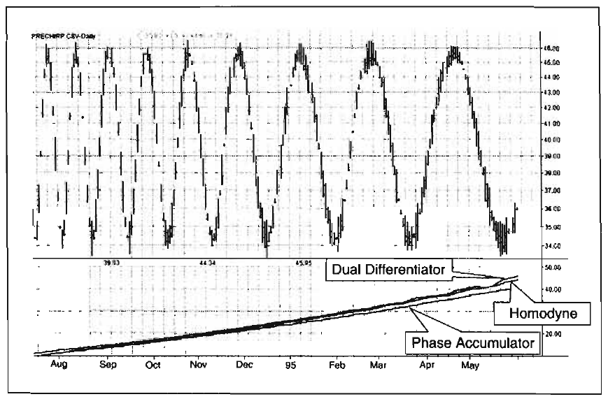
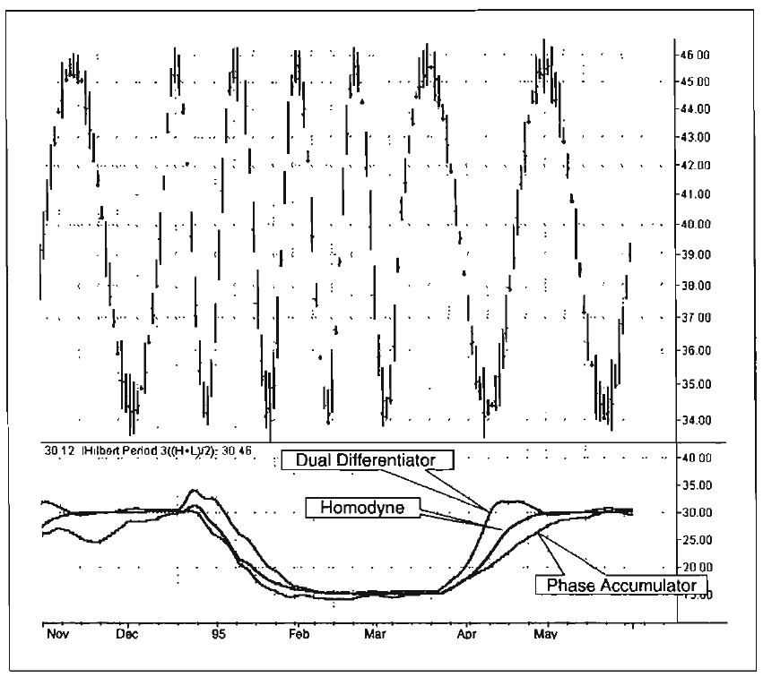
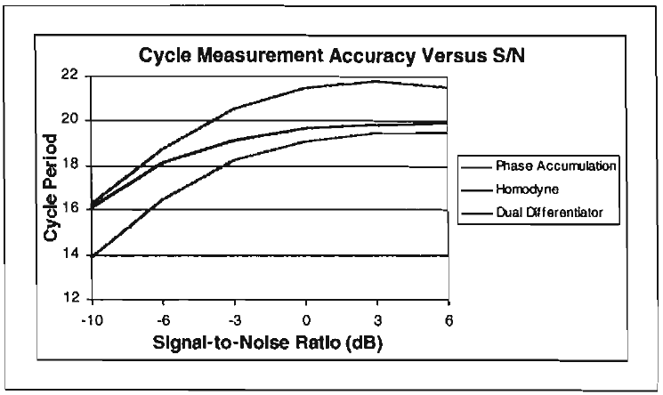
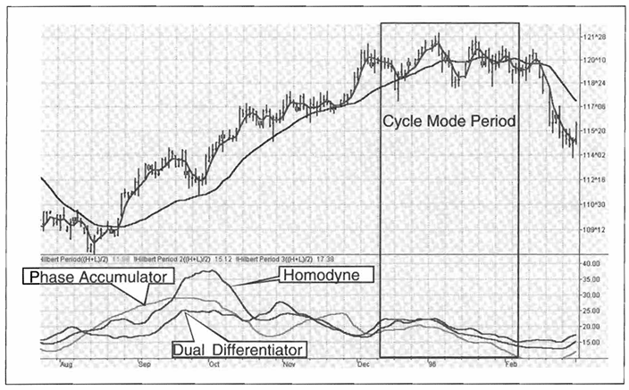

# Chapter 7: Measuring Cycle Periods

> ... but what are we going to do with
> all those skinned cats?
> --Anonymous

One fundamental definition of a cycle is that the process under consideration has a constant rate of phase change. We can measure the phase of a complex signal directly. Knowing the phase at each sample, we need only take the bar-to-bar difference to obtain the rate of phase change. In this chapter, you are presented with several mathematical techniques for measuring the period of the dominant cycle. While mathematically dissimilar, all these techniques share the common feature of using differential phase between samples.

## Phase Accumulation

The Phase Accumulation technique of cycle period measurement is perhaps the easiest to comprehend. In this technique, we measure the phase at each sample by taking the arctangent of the ratio of the Quadrature component to the Inphase component. A delta phase is generated by taking the difference of the phase between successive samples. At each sample we can then look backward, adding up the delta phases. When the sum of the delta phases reaches 360 degrees, we must have passed through one full cycle, on average. The process is repeated for each new sample.

The Phase Accumulation method of cycle measurement always uses one full cycle's worth of historical data. This is both an advantage and disadvantage. The advantage is the lag in obtaining the answer scales directly with the cycle period. That is, the measurement of a short cycle period has less lag than the measurement of a longer cycle period. However, the number of samples used in making the measurement means the averaging period is variable with cycle period. Longer averaging reduces the noise level compared to the signal. Therefore, shorter cycle periods necessarily have a higher output Signal-to-Noise Ratio.

Implementing the Phase Accumulation method of cycle measurement with the EasyLanguage code is described with reference to Figure 7.1. The initial part of the code creates the Inphase and Quadrature components, I1 and Q1, as discussed in the last chapter. It is crucial that I1 and Q1 be smoothed before the arctangent of their ratio is taken. We do the smoothing in an EMA whose alpha equals 0.15. The instantaneous phase (the phase at any bar) is computed as the arctangent of the ratio of Q1 to I1. This gives the instantaneous phase within a quadrant. The quadrant ambiguity is removed in the subsequent three lines of code. We then compute the differential phase (Deltaphase) between successive samples. There can be considerable error in the raw differential phase computation. To keep these large errors from unduly influencing the outcome, we limit the values of the differential phase to be between cycle periods of 6 bars (Deltaphase = 60) and 50 bars (DeltaPhase = 360/50 = 7). The Deltaphases are then accumulated until the PhaseSum exceeds 360 degrees. At that point, the cycle period is assigned as the number of samples required for the PhaseSum to reach the 360-degree value. The accumulation is done for each bar in the data set but is limited to a value of 40 bars. The limitation is based on our assumption that cycle periods of 40 bars and longer result in a Trend Mode, and detailed knowledge of their periods is not necessary. If the cycle period has not been identified within the maximum 40-bar accumulation period, then it is assigned the value of the cycle period measurement for the previous sample. It is then smoothed by an EMA whose alpha equals 0.25 to create a pleasing presentation. The lag due to this EMA is 3 bars.

```easylanguage
Inputs: Price((H+L)/2);

Vars: Smooth(0),
      Detrender(0),
      I1(0),
      Q1(0),
      Phase(0),
      DeltaPhase(0),
      InstPeriod(0),
      count(0),
      PhaseSum(0),
      Period(0);

If CurrentBar > 5 then begin
    Smooth = (4*Price + 3*Price[1] + 2*Price[2] + Price[3]) / 10;
    Detrender = (.0962*Smooth + .5769*Smooth[2] - .5769*Smooth[4] - .0962*Smooth[6]) * (.075*Period[1] + .54);

    {Compute InPhase and Quadrature components}
    Q1 = (.0962*Detrender + .5769*Detrender[2] - .5769*Detrender[4] - .0962*Detrender[6]) * (.075*Period[1] + .54);
    I1 = Detrender[3];

    {Smooth the I and Q components before applying the discriminator}
    I1 = .15*I1 + .85*I1[1];
    Q1 = .15*Q1 + .85*Q1[1];

    {Use ArcTangent to compute the current phase}
    If AbsValue(I1) > 0 then Phase = ArcTangent(AbsValue(Q1/I1));

    {Resolve the ArcTangent ambiguity for quadrants 2, 3, and 4}
    If I1 < 0 and Q1 > 0 then Phase = 180 - Phase;
    If I1 < 0 and Q1 < 0 then Phase = 180 + Phase;
    If I1 > 0 and Q1 < 0 then Phase = 360 - Phase;

    {Compute a differential phase, resolve phase wraparound from quadrant 1 to quadrant 4, and limit delta phase errors}
    DeltaPhase = Phase[1] - Phase;
    If Phase[1] < 90 and Phase > 270 then DeltaPhase = 360 + Phase[1] - Phase;

    {Limit DeltaPhase to be within the bounds of 6 bar and 50 bar cycles}
    If DeltaPhase < 7 then DeltaPhase = 7;
    If DeltaPhase > 60 then DeltaPhase = 60;

    {Sum DeltaPhases to reach 360 degrees. The sum is the instantaneous period.}
    InstPeriod = 0;
    PhaseSum = 0;
    For count = 0 to 40 begin
        PhaseSum = PhaseSum + DeltaPhase[count];
        If PhaseSum > 360 and InstPeriod = 0 then
        begin
            InstPeriod = count;
        End;
    End;

    {Resolve Instantaneous Period errors and smooth}
    If InstPeriod = 0 then InstPeriod = InstPeriod[1];
    Period = .25*InstPeriod + .75*Period[1];

    Plot1(Period, "DC");
End;
```

Total lag through the Phase Accumulation cycle period measurement consists of 6 bars for the first EMA, 3 bars for the display smoothing EMA, 7-bars lag to compute the original Inphase and Quadrature components, and one full cycle of this accumulation process. Therefore, the total lag is 16 bars plus one full-cycle period. Since the dominant cycle period is a relatively slow varying function of time, this lag may be acceptable in many applications.

## Homodyne Discriminator

Homodyne means we are multiplying the signal by itself. More precise, we want to multiply the signal of the current bar with the complex conjugate of the signal 1 bar ago. The complex conjugate is, by definition, a complex number whose sign of the imaginary component has been reversed. Expressing the signal in polar coordinates, the arithmetic is

$$(\rho e^{j\omega t_n})(\rho e^{-j\omega t_{n-1}}) = \rho^2 e^{j\omega(t_n - t_{n-1})} = \rho^2 e^{j\omega}$$

The interesting result is that we get both the square of the signal amplitude and the angular frequency $(2\pi / Period)$ from the product because the difference in time between samples $(t_n - t_{n-1})$ is just 1 bar. In principle, this means that we can get the instantaneous cycle period in just two successive samples. The added benefit is that we also get the square of the signal amplitude. The calculations are carried out using the real and imaginary components rather than converting them to polar coordinates. Either way, the results are the same.

```easylanguage
Inputs:
    Price((H+L)/2);

Vars:
    Smooth(0),
    Detrender(0),
    I1(0),
    Q1(0),
    jI(0),
    jQ(0),
    I2(0),
    Q2(0),
    Re(0),
    Im(0),
    Period(0),
    SmoothPeriod(0);

If CurrentBar > 5 then begin
    Smooth = (4*Price + 3*Price[1] + 2*Price[2] + Price[3]) / 10;
    Detrender = (.0962*Smooth + .5769*Smooth[2] - .5769*Smooth[4] - .0962*Smooth[6]) * (.075*Period[1] + .54);

    {Compute InPhase and Quadrature components}
    Q1 = (.0962*Detrender + .5769*Detrender[2] - .5769*Detrender[4] - .0962*Detrender[6]) * (.075*Period[1] + .54);
    I1 = Detrender[3];

    {Advance the phase of I1 and Q1 by 90 degrees}
    jI = (.0962*I1 + .5769*I1[2] - .5769*I1[4] - .0962*I1[6]) * (.075*Period[1] + .54);
    jQ = (.0962*Q1 + .5769*Q1[2] - .5769*Q1[4] - .0962*Q1[6]) * (.075*Period[1] + .54);

    {Phasor addition for 3 bar averaging}
    I2 = I1 - jQ;
    Q2 = Q1 + jI;

    {Smooth the I and Q components before applying the discriminator}
    I2 = .2*I2 + .8*I2[1];
    Q2 = .2*Q2 + .8*Q2[1];

    {Homodyne Discriminator}
    Re = I2*I2[1] + Q2*Q2[1];
    Im = I2*Q2[1] - Q2*I2[1];
    Re = .2*Re + .8*Re[1];
    Im = .2*Im + .8*Im[1];
    If Im <> 0 and Re <> 0 then Period = 360/ArcTangent(Im/Re);
    If Period > 1.5*Period[1] then Period = 1.5*Period[1];
    If Period < .67*Period[1] then Period = .67*Period[1];
    If Period < 6 then Period = 6;
    If Period > 50 then Period = 50;
    Period = .2*Period + .8*Period[1];
    SmoothPeriod = .33*Period + .67*SmoothPeriod[1];

    Plot1(SmoothPeriod, "DC");
End;
```

**Figure 7.2** *EasyLanguage code*

The EasyLanguage code for the Homodyne Discriminator is described with reference to Figure 7.2. The Inphase and Quadrature components are computed using the Hilbert Transformer as explained in Chapter 6. These components are smoothed in a unique complex averager and then smoothed by an EMA to avoid any undesired cross products in the multiplication step that follows. Consider the result as a composite of signal and noise represented by $(S + N)$. If we were to multiply this by itself, we would get $S2 + N2 + SN + NS$. Of the four products, three are undesired due to noise. Therefore, we must take every measure to remove undesired components prior to any multiplication. The complex averaging consists of applying the Hilbert Transformer to both the Inphase and Quadrature components. This advances the phase of each component by 90 degrees. When the Inphase component is advanced by 90 degrees, it becomes equal to the Quadrature component. Similarly, when the Quadrature component is advanced in phase by 90 degrees, it becomes the same as the negative Inphase component. So, if we perform a Hilbert Transform on an Inphase component, it will be aligned in phase with the Quadrature component. However, the Hilbert Transform has a 3-bar lag. The transformed Inphase component summed with the Quadrature component is therefore the mathematical equivalent of the simple average of a signal with the signal 3 bars ago. The same process applies to performing a Hilbert Transform on the imaginary component and adding it to the Inphase component. The net result is that the net complex averaging lag is 1.5 bars. After smoothing, the signal is multiplied by the complex conjugate of the signal 1 bar ago. The resulting output real component is the product of the two real components added to the product of the two imaginary components. Similarly, the resulting output imaginary component is the difference of the two input cross products. Both the real and imaginary output products are smoothed again before the cycle period is computed. This is done by taking the arctangent of the ratio of the output imaginary component to the real component. The rate of change of the cycle period is limited to be +-50 percent of the previous cycle period, and the resultant period is further limited to be greater than 6 bars and less than 50 bars. Finally, the period is smoothed for a pleasing display.

Total lag through the Homodyne Discriminator cycle period measurement consists of the following: seven-bars lag to compute the original Inphase and Quadrature components and 4-bars lag in each of the three EMAs, and 1.5 bars for the complex averaging. Therefore, the total lag is a constant 20.5 bars. The net smoothing is the same regardless of the measured period. Therefore, the Signal-to-Noise Ratio as well as the lag is constant for all cycle periods.

## Dual Differentiator

We have seen how the phase angle is computed from a complex signal as the arctangent of the ratio of the imaginary component to the real component. Furthermore, we have seen that angular frequency is defined as the rate of change of phase. We can use these facts to derive still a third way of using complex signals to measure the cycle period. From the definition of the derivative of an arctangent, the mathematics of this process are

$$\theta = \arctan\left(\frac{Q}{I}\right)$$

$$\omega = \frac{d\theta}{dt} = \frac{1}{1 + \left(\frac{Q}{I}\right)^2} \cdot \frac{I\Delta Q - Q\Delta I}{I^2} = \frac{I\Delta Q - Q\Delta I}{I^2 + Q^2}$$

Simplifying, and solving for the cycle period instead of frequency, we obtain

$$Period = \frac{2\pi(I^2 + Q^2)}{I\Delta Q - Q\Delta I}$$

```easylanguage
Inputs:
    Price((H+L)/2);

Vars:
    Smooth(0),
    Detrender(0),
    I1(0),
    Q1(0),
    jI(0),
    jQ(0),
    I2(0),
    Q2(0),
    Period(0),
    SmoothPeriod(0);

If CurrentBar > 5 then begin
    Smooth = (4*Price + 3*Price[1] + 2*Price[2] + Price[3]) / 10;
    Detrender = (.0962*Smooth + .5769*Smooth[2] - .5769*Smooth[4] - .0962*Smooth[6]) * (.075*Period[1] + .54);

    {Compute InPhase and Quadrature components}
    Q1 = (.0962*Detrender + .5769*Detrender[2] - .5769*Detrender[4] - .0962*Detrender[6]) * (.075*Period[1] + .54);
    I1 = Detrender[3];

    {Advance the phase of I1 and Q1 by 90 degrees}
    jI = (.0962*I1 + .5769*I1[2] - .5769*I1[4] - .0962*I1[6]) * (.075*Period[1] + .54);
    jQ = (.0962*Q1 + .5769*Q1[2] - .5769*Q1[4] - .0962*Q1[6]) * (.075*Period[1] + .54);

    {Phasor addition for 3 bar averaging}
    I2 = I1 - jQ;
    Q2 = Q1 + jI;

    {Smooth the I and Q components before applying the discriminator}
    I2 = .15*I2 + .75*I2[1];
    Q2 = .15*Q2 + .75*Q2[1];

    {Dual Differential Discriminator}
    Value1 = Q2*(I2 - I2[1]) - I2*(Q2 - Q2[1]);
    If Value1 > .01 then Period = 6.2832*(I2*I2 + Q2*Q2) / Value1;
    If Period > 1.5*Period[1] then Period = 1.5*Period[1];
    If Period < .67*Period[1] then Period = .67*Period[1];
    If Period < 6 then Period = 6;
    If Period > 50 then Period = 50;
    Period = .15*Period + .85*Period[1];
    SmoothPeriod = .33*Period + .67*SmoothPeriod[1];

    Plot1(SmoothPeriod, "DC");
End;
```

**Figure 7.3** *EasyLanguage code*

The EasyLanguage code for the Dual Differentiator Discriminator is described with reference to Figure 7.3. The Inphase and Quadrature components are computed with the Hilbert Transformer using procedures identical to those in the Dual Differentiator. These components undergo a complex averaging and are smoothed in an EMA to avoid any undesired cross products in the multiplication step that follows. The period is solved directly from the smoothed Inphase and Quadrature components. The interim calculation for the denominator is performed as Value1 to ensure that the denominator will not have a zero value. The sign of Value1 is reversed relative to the theoretical equation because the differences are looking backward in time. The rate of change of the cycle period is limited to be +-50 percent of the previous cycle period, and the resultant period is further limited to be greater than 6 bars and less than 50 bars. Finally, the period is smoothed for a pleasing display.

Total lag through the Dual Differentiator Discriminator cycle period measurement consists of 7-bars lag to compute the original Inphase and Quadrature components and 4-bars lag in each of the two EMAs, plus 1.5 bars for the complex averaging. Therefore, the total lag is a constant 16.5 bars. The net smoothing is the same regardless of the measured period. Therefore, the Signal-to-Noise Ratio, as well as the lag, is constant for all cycle periods.

## Cycle Measurement Comparison

We now have three techniques to measure cycle periods using complex arithmetic. We only know that they vary in lag and that the lag is relatively long in each case. The only way to determine the best technique is to exercise them in a variety of tests. The first test is designed to see how accurately the cycle measurement is made using a perfect sine wave. In Figure 7.4, we have created an analytic waveform as a pure cycle whose period increases linearly from 10 to 40 bars across the screen. The cycle length measurements of the three techniques are plotted in the first subgraph. This subgraph is scaled from 10 to 40 bars, so vertical displacement shows the measured cycle period. At first glance, it appears that the Phase Accumulator method is less accurate than the others. However, recalling that its lag is longer than the others for longer cycle periods, this apparent inaccuracy is due solely to the lag associated with the changing waveform period.



**Figure 7.4** *Cycle period measurements in response to a chirped analytic waveform. Chart created with TradeStation by Omega Research, Inc.*

The next stress test for the cycle period measurers deciphers how rapidly the cycle measurements respond to an instantaneous shift of frequency in the analytic waveform. To do this, we created a waveform that alternately switches between a period of 15 bars and a period of 30 bars. The response of the three cycle period measurers is shown in Figure 7.5. Now we can see some differences. As expected, the Phase Accumulator is the slowest to respond to this step in the cycle period because of the additional smoothing. Also as expected, the Dual Differentiator reacts the fastest in this test. However, the Dual Differentiator exhibits some overshoot error. As a result, it appears that the Homodyne approach has the superior transient response.



**Figure 7.5** *Cycle measurer transient responses to rapid changes ofcycle period. Chart created with TradeStation 2000i by Omega Research, Inc.*

Another significant test finds how the cycle period measurers perform as the Signal-to-Noise Ratio degenerates. Market data almost always have a poor Signal-to-Noise Ratio, and the ability to make accurate measurements is crucial. In fact, it was this stress test that led to additional smoothing prior to the multiplication operations in the Homodyne and Dual Differentiator cycle period measurers. Without this smoothing, the performance in low Signal-to-Noise environments was just awful, producing measured cycle periods near half the correct period. The performance of the cycle period measurers are compared in Figure 7.6 as a function of Signal-to-Noise Ratio when measuring a theoretical twenty-bar sinewave signal. It is clear from Figure 7.6 that the Homodyne approach is not only more accurate at high Signal-to-Noise Ratios but its performance degrades more gracefully as the noise is increased relative to the signal strength.



**Figure 7.6** *Phase measurer performance as a function of Signal-to-Noise Ratio.*



**Figure 7.7** *The cycle peformance measurements on real data. Chart created with TradeStation 2000i by Omega Research, Inc.*

The real acid test of the cycle period measurers' performance determines how well they do when acting on real data. We do this in Figure 7.7. All three tend to give similar measurements when the market is in a Cycle Mode. However, there is a wide difference in the measurements when the market is in a Trend Mode. My observations have led me to conclude that the Homodyne is overall more accurate in measurement of cycles when the market is in a Trend Mode.

For all these reasons I conclude that the Homodyne Discriminator is the superior approach. This frequency measurer is used throughout the remainder of this book.

## Key Points to Remember

- A basic definition of a cycle is a constant rate of change of phase.
- The Hilbert Transform generates Inphase and Quadrature components from which the phase at each bar can be measured.
- The phase rate of change is established as the differential phase from bar to bar.
- Complex averaging can be accomplished by applying the Hilbert Transformer to both the Inphase and Quadrature components, advancing their phase by 90 degrees. The phase-advanced components are then algebraically added to their orthogonal counterparts to effect the averaging.
- There are at least three different ways to measure cycle period using the Inphase and Quadrature components.
- The Homodyne Discriminator is the superior cycle period measurer.
