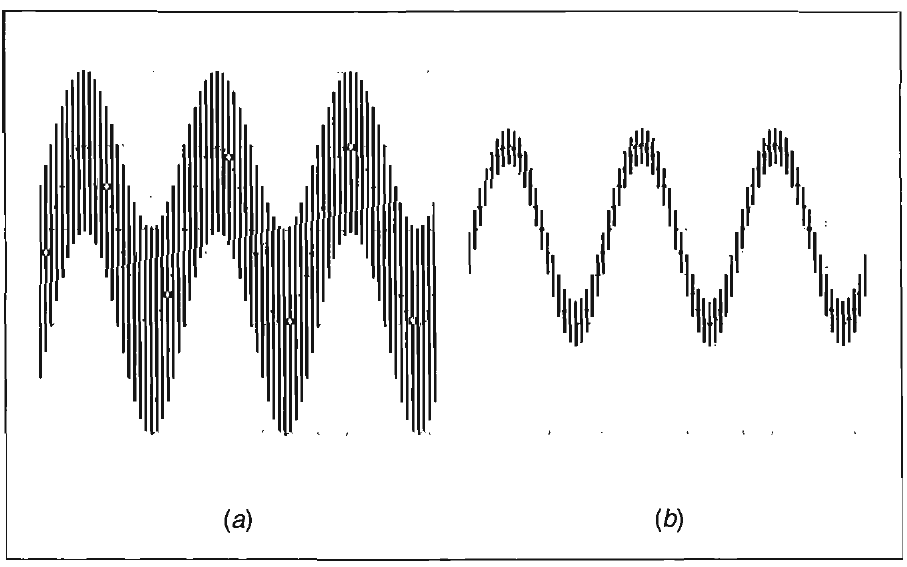
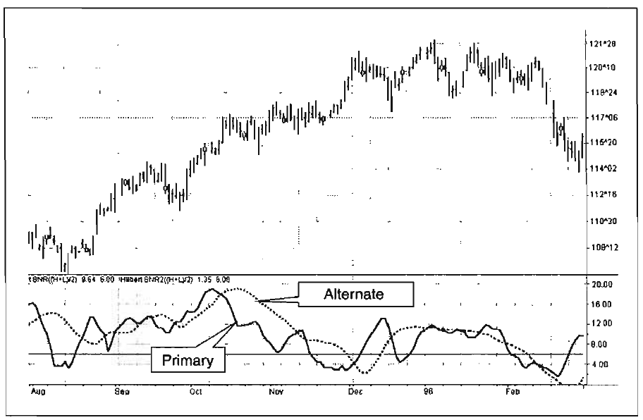
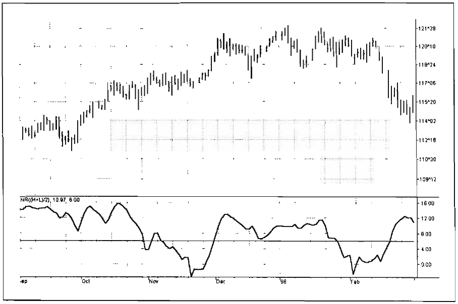
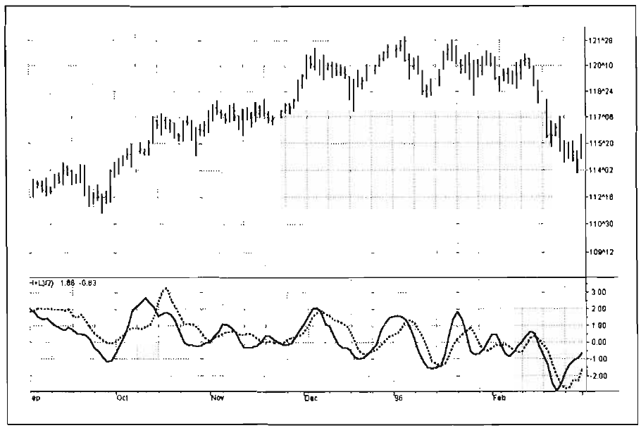

# Chapter 8: Signal-To-Noise Ratio

> Logic is a system whereby one may
> go wrong with confidence.
> -CHARLES KETTERING

The signal amplitude is simply the length of the phasor. Recalling the Pythagorean Theorem, the length of the phasor is the square root of the sum of the squares of the Inphase and Quadrature components. We therefore have the signal amplitude on a bar-by-bar basis after we take the Hilbert Transform.

The signal amplitude is not of much use by itself. However, if we can estimate the signal amplitude relative to the market noise, we then have a tool that estimates the quality of our technical analysis. With the kind of market data now available, let us develop a unique definition of noise. A sampled signal is shown in Figure 8.1(a) as a sine wave with the sampling uncertainty represented as the high and low of each bar. The high and low is the uncertainty of each of our perfect sinewave sample points. We can make good trades as long as our signal amplitude is much larger than the average daily range of the bars. Another case for the same signal amplitude is shown in Figure 8.1(b). When half the average daily range becomes equal to the signal amplitude, making money on a trade becomes a crapshoot. Under this condition, it is possible to make an entry at the low of the bar (which contains the signal high) and make an exit at the high of the bar (which contains the signal low) for zero profit. We will therefore term the case where half the average daily trading range is equal to the signal amplitude as our zero decibel Signal-to-Noise Ratio (0 dB SNR) condition. We want the signal amplitude to be at least twice the noise amplitude (6 dB SNR) so that there exists a reasonable chance to make a profit from our analysis.



**Figure 8.1** *(a) Fourteen dB SNR. (b) Zero dB SNR.*

We can define the noise as a smoothed average of the daily trading range. We can tolerate a 9-bar lag to compute such an average because the range tends not to change much, and so the noise will be an Exponential Moving Average (EMA) with an alpha of 0.1. The trading range is simply the high minus the low of each bar. The EasyLanguage code to compute the SNR is given in Figure 8.2. This code is almost identical to the one we use for the Homodyne Discriminator with a few additions. First, the noise is computed as the variable "Range" near the top of the code. Second, the signal power is computed by adding the square of the Inphase component to the square of the Quadrature component.

```easylanguage
Inputs:
    Price((H+L)/2);

Vars:
    Range(0),
    Smooth(0),
    Detrender(0),
    I1(0),
    Q1(0),
    jI(0),
    jQ(0),
    I2(0),
    Q2(0),
    Re(0),
    Im(0),
    Period(0),
    SmoothPeriod(0),
    SNR(0);

If CurrentBar > 5 then begin
    {Compute 'Noise" as the average range}
    Range = .1*( H - L) + .9*Range[1];

    Smooth = (4"Price + 3*Price[1] + 2*Price[2] + Price[3] ) / 10;
    Detrender = (.0962*Smooth + .5769*Smooth[2] - .5769*Smooth[4] - .0962*Smooth[6]) * (.075*Period[1] + .54);

    {Compute InPhase and Quadrature components}
    Q1 = (.0962*Detrender + .5769*Detrender[2] - .5769*Detrender[4] - .0962*Detrender[6]) * (.075*Period[1] + .54);
    I1 = Detrender[3];

    {Advance the phase of I1 and Q1 by 90 degrees}
    jI = (.0962*I1 + .5769*I1[2] - .5769*I1[4] - .0962*I1[6]) * (.075*Period[1] + .54);
    jQ = (.0962*Q1 + .5769*Q1[2] - .5769*Q1[4] - .0962*Q1[6]) * (.075*Period[1] + .54);

    {Smooth the I and Q components before applying the discriminator}
    I2 = .2*I2 + .8*I2[1];
    Q2 = .2*Q2 + .8*Q2[1];

    {Homodyne Discriminator}
    Re = I2*I2[1] + Q2*Q2[1];
    Im = I2*Q2[1] - Q2*I2[1];
    Re = .2*Re + .8*Re[1];
    Im = .2*Im + .8*Im[1];

    If Im <> 0 and Re <> 0 then Period = 360/ArcTangent(Im/Re);
    If Period > 1.5*Period[1] then Period = 1.5*Period[1];
    If Period < .67*Period[1] then Period = .67*Period[1];
    If Period < 6 then Period = 6;
    If Period > 50 then Period= 50;

    Period = .2*Period + .8*Period[1];

    {Compute smoothed SNR in Decibels, guarding against a divide by zero error}
    If Range > 0 then SNR = .25*(10*Log((Il*Il + Ql*Ql)/(Range*Range))/Log(10) + 6) + .75*SNR[1];

    {Plot Results}
    Plot1 (SNR, "SNR");
    Plot2 (6, "Ref");
End;
```

**Figure 8.2** *Computing the SNR.*

The SNR in decibels is calculated in a single line of code near the end. The signal power is divided by the noise power to get a power ratio. The value in decibels is computed as 10 times the logarithm of the power ratio. Since EasyLanguage takes only natural logarithms, the logarithm must be converted to log base 10 by being divided by the natural logarithm of 10. A compensating term of 6 dB must be added due to our definition of signal to noise. As defined earlier, the signal amplitude is the length of the phasor. At 0 dB, the peak-to-peak noise signal is twice the amplitude of the signal. Therefore, when we compute the 0 dB case, the ratio is calculated to be $10*\log(1/2)^2 = -6 dB$. We must then add 6 dB back into the computation to remove this bias, establishing our definition of 0 dB SNR.

Assuming the noise is relatively constant, the lag of the Signal-to-Noise Indicator is just the 7 bars that result from the Hilbert Transformer plus the 3 bars due to smoothing of the display.

There is another way to compute the SNR. Recall that in the derivation of the Homodyne Discriminator, the amplitude squared fell out of the equation automatically when we solved for the frequency. In EasyLanguage code, the amplitude squared is the sum of the variables Re and Im. Therefore, our alternate solution for the SNR is obtained by replacing $(I1*I1 + Q1*Q1)$ with $(Re + Im)$. That is the only change in the code shown in Figure 8.3. The alternate calculation uses the signal information that is smoothed by two EMAs, causing a 4-bar lag each, plus the lag induced by the complex averaging of 1.5 bars. Therefore, we expect the alternate SNR computation to produce a result that is smoother and has an additional 7.5-bar lag as compared to the first (or, primary) calculation. The two SNR computations are compared in Figure 8.4. Our expectation of a smoother and more delayed alternate computation is manifest.

The 10-bar lag induced by the computation of the Primary SNR makes this calculation unusable for practical trading. The additional lag of the Alternate SNR makes its use unthinkable. By carefully examining the required conditions, we can arrive at an SNR Indicator that has an acceptable lag.

```easylanguage
Inputs:
    Price((H+L)/2);

Vars:
    Range(0),
    Smooth(0),
    Detrender(0),
    I1(0),
    Q1(0),
    jI(0),
    jQ(0),
    I2(0),
    Q2(0),
    Re(0),
    Im(0),
    Period(0),
    SmoothPeriod(0),
    SNR(0);

If CurrentBar > 5 then begin
    {Compute "Noise" as the average range}
    Range = .1*(H-L) + .9*Range[1];

    Smooth = (4*Price + 3*Price[1] + 2*Price[2] + Price[3]) / 10;
    Detrender = (.0962*Smooth + .5769*Smooth[2] - .5769*Smooth[4] - .0962*Smooth[6]) * (.075*Period[1] + .54);

    {Compute Inphase and Quadrature components}
    Q1 = (.0962*Detrender + .5769*Detrender[2] - .5769*Detrender[4] - .0962*Detrender[6]) * (.075*Period[1] + .54);
    I1 = Detrender[3];

    {Advance the phasoef I1 and Q1 by 90 degrees}
    jI = (.0 962*I1 + .5769*I1[2] - .5769*I1[4] - .0962*I1[6]) * (.075*Period[1] + .54);
    jQ = (.0 96Z*Q1 + .5769*Q1[2] - .5769*Q1[4] - .0962*Q1[6]) * (.075*Period[1] + .54);

    {Phasor addition for 3 bar averaging}
    I2 = I1 - jQ;
    Q2 = Q1 + jI;

    {Smooth the I and Q components before applying the discriminator}
    I2 = .2*I2 + .8*I2[1];
    Q2 = .2*Q2 + .8*Q2[1];

    {Homodyne Discriminator}
    Re = I2*I2[1] + Q2*Q2[1];
    Im = I2*Q2[1] - Q2*I2[1];
    Re = .2*Re + .8*Re[1];
    Im = .2*Im + .8*Im[1];

    If Im <> 0 and Re <> 0 then Period = 360/ArcTangent(Im/Re);
    If Period > 1.S*Period[1] then Period = 1.5*Period[1];
    If Period < .67*Period[1] then Period = .67*Period[1];
    If Period <> 6 then Period = 6;
    If Period > 50 then Period = 50;

    Period = .2*Period + .8*Period[1];

    {Compute smoothed SNR in Decibels, guarding against a divide by zero error}
    If Range > 0 then SNR = .25*(10*Log((Re + Im)/(Range*Range))/Log(10) + 6) + .75*SNR[1];

    {Plot Results}
    Plot1 (SNR, "SNR");
    Plot2 (6, "Ref");
End ;
```

**Figure 8.3** *EasyLanguage code*



**Figure 8.4** *The alternate SNR computation is smoother and has more lag than the primary computation. Chart created with TradeStation 2000i by Omega Research, Inc.*

The first condition of the Hilbert Transform is that its transfer response must have a zero transfer response at zero frequency. That means the signal must be detrended. The first thing we do after the initial smoothing is to use the Detrender as the Quadrature component of the Hilbert Transform. If we shorten the Detrender to a 2-bar momentum, the resulting lag is only 1 bar. Because of the shorter momentum, we need a more aggressive amplitude correction as a function of the measured period. We can measure slowly varying periods as we have done previously before proceeding with the calculation of the SNR. We also know that if we take a Simple Moving Average (SMA) over half the measured period, the lag of this average is a quarter cycle. A quarter cycle is 90 degrees of phase lag-exactly the lag needed to create the Inphase component from the Quadrature component. This filtering also reduces the dominant cycle amplitude by 2/π, so an additional π/2 amplitude correction term must be included in the computation of the Inphase component.

```easylanguage
/*****************************************************
Description : Enhanced Signal to Noise Ratio Indicator
******************************************************/
Inputs:
    Price((H+L)/2);

Vars:
    Smooth(0),
    Detrender(0),
    I1(0),
    Q1(0),
    jI(0),
    jQ(0),
    I2(0),
    Q2(0),
    Re(0),
    Im(0),
    Period(0),
    SmoothPeriod(0),
    count(0),
    I3(0),
    Q3(0),
    Signal(0),
    Noise(0),
    SNR(0);

If CurrentBar > 5 then begin

    Smooth = (4*Price + 3*Price[1] + 2*Price[2] + Price[3])/10;
    Detrender = (.0962*Smooth + .5769*Smooth[2] - .5769*Smooth[4] - .0962*Smooth[6])*(.075*Period[1] + .54);

    {Compute Inphase and Quadrature components}
    Q1 = (.0962*Detrender + .5769*Detrender[2] - .5769*Detrender[4] - .0962*Detrender[6])*(.075*Period[1] + .54);
    I1 = Detrender[3];

    {Advance the phasoef I1 and Qb1 y 90 degrees}
    jI = (.0962*I1 + .5769*I1[2] - .5769*I1[4] - .0962*I1[6])*(.075*Period[1] + .54);
    jQ = (.0962*Q1 + .5769*Q1[2] - .5769*Q1[4] - .0962*Q1[6])*(.075*Period[1] + .54);

    {Phasor addition for 3 bar averaging)}
    I2 = I1 - jQ;
    Q2 = Q1 + jI;

    {Smooth the I and Q components before applying the discriminator}
    I2 = .2*I2 + .8*I2[1];
    Q2 = .2*Q2 + .8*Q2[1];

    {Homodyne Discriminator}
    Re = I2*I2[1] + Q2*Q2[1];
    Im = I2*Q2[1] - Q2*I2[1];
    Re = .2*Re + .8*Re[1];
    Im = .2*Im + .8*Im[1];

    If Im <> 0 and Re <> 0 then Period = 360/ArcTangent(Im/Re);
    If Period > 1.5*Period[1] then Period = l.S*Period[1];
    If Period < .67*Period[1] then Period = .67*Period[1];
    If Period < 6 then Period = 6;
    If Period > 50 then Period = 50;

    Period = .2*Period + .8*Period[1];
    SmoothPeriod = .33*Period + .67*SmoothPeriod[1];

    Q3 = .5*( Smooth - Smooth[2])*(.1759*SmoothPeriod + .4607);
    I3 = 0;
    For count = 0 to Int(SmoothPeriod/2) - 1 begin
        I3 = I3 + Q3[count];
    End;
    I3 = 1.57*I3 / Int(SmoothPeriod/2);

    Signal = I3*I3 + Q3*Q3;
    Noise = .1*(H - L)*(H - L)*.25 + .9*Noise[1];
    If (Noise <> 0 and Signal <> 0) then SNR = .33*(10*Log(Signal/Noise)/Log(10)) + .67*SNR[1];

    Plot1 (SNR, "SNR") ;
    Plot2 (6, "Ref");
End;
```

**Figure 8.5** *Enhanced SNR computation in EasyLanguage.*

All these conditions have been included in the computation of the Enhanced SNR Indicator, as described in the code of Figure 8.5. In this code, the period of the measured dominant cycle is calculated in exactly the same manner as we calculated it for the Primary SNR Indicator. Near the end of the code, after the dominant cycle is determined, we compute the SNR. The Quadrature component Q3 is calculated by multiplying the 2-bar momentum of the Weighted Moving Average (WMA) smoothing by the dominant cycle amplitude correction factor. The correction terms were derived by observing the output amplitude of the 2-bar momentum when the chirp waveform of Figure 7.4 was applied. The output amplitudes for the 10-bar cycle period and the 40-bar cycle period were used to compute the straight line compensation terms 0.1759 and 0.4607. The Inphase component I3 is computed as the half-dominant cycle moving average multiplied by the $\pi/2$ amplitude correction term. Again, the noise power is computed as the square of the averaged range of the bars, and the signal power is computed as the sum of the square of the Inphase component and the square of the Quadrature component. The total lag of the Enhanced SNR Indicator is only 4 bars, compared to the 10-bar lag of the Primary SNR Indicator. This lag comprises 1 bar for the initial smoothing, 1 bar for the computation of the Quadrature component, and 2 bars for the final smoothing of the indicator.

The performance of the Enhanced SNR Indicator is shown in Figure 8.6 with the same data that we used in the computation of the Primary and Alternate SNR Indicators in Figure 8.4. The Enhanced SNR Indicator now has lag properties that make it useful for trading.



**Figure 8.6** *The Enhanced SNR Indicator has minimum lag. Chart created with TradeStation 2000i by Omega Research, Inc.*

```easylanguage
/*******************************
Description : Hilbert Oscillator
********************************/

Inputs:
    Price((H+L)/2);

Vars:
    Smooth(0),
    Detrender(0),
    I1(0),
    Q1(0),
    jI(0),
    jQ(0),
    I2(0),
    Q2(0),
    Re(0),
    Im(0),
    Period(0),
    SmoothPeriod(0),
    count(0),
    I3(0),
    Q3(0);

If CurrentBar > 5 then begin
    Smooth = (4*Price + 3*Price[1] + 2*Price[2] + Price[3]) / 10;
    Detrender = (.0962*Smooth + .5769*Smooth[2] - .5769*Smooth[4] - .0962*Smooth[6])*(.075*Period[1] + .54);

    {Compute Inphase and Quadrature components}
    Q1 = (.0962*Detrender + .5769*Detrender[2] - .5769*Detrender[4] - .0962*Detrender[6])*(.075*Period[1] + .54);
    I1 = Detrender[3];

    {Advance the phase of I1 and Q1 by 90 degrees}
    jI = (.0962*I1 + .5769*I1[2] - .5769*I1[4] - .0962*I1[6])*(.075*Period[1] + .54);
    jQ = (.0962*Q1 + .5769*Q1[2] - .5769*Q1[4] - .0962*Q1[6])*(.075*Period[1] + .54);

    {Phasor addition for 3 bar averaging}
    I2 = I1 - jQ;
    Q2 = Q1 + jI;

    {Smooth the I and Q components before applying the discriminator}
    I2 = .2*I2 + .8*I2[1];
    Q2 = .2*Q2 + .8*Q2[1];

    {Homodyne Discriminator}
    Re = I2*I2[1] + Q2*Q2[1];
    Im = I2*Q2[1] - Q2*I2[1];
    Re = .2*Re + .8*Re[1];
    Im = .2*Im + .8*Im[1];

    If Im <> 0 and Rec <> 0 then Period = 360/ArcTangent(Im/Re);
    If Period > 1.5*Period[1] then Period = 1.5*Period[1];
    If Period < .67*Period[1] then Period = .67*Period[1];
    If Period < 6 then Period = 6;
    If Period > 50 then Period = 50;

    Period = .2*Period + .8*Period[1];
    SmoothPeriod = .33*Period + .67*SmoothPeriod[1];

    Q3 = .5*(Smooth - Smooth[2])*(.1759*SmoothPeriod + .4607);
    I3 = 0;
    For count = 0 to Int(SmoothPeriod/2) - 1 begin
        I3 = I3 + Q3[count];
    End;

    I3 = 1.57*I3 / Int(SmoothPeriod/2);
    Value1 = 0;
    For count = 0 to Int(SmoothPeriod/4) - 1 begin
        Value1 = Value1 + Q3[count];
    End;

    Value1 = 1.25*Value1 / Int(SmoothPeriod/4);

    Plot1(I3, "I");
    Plot2(Value1, "IQ");
End;
```

**Figure 8.7** *THilbert Oscillator computation in EasyLanguage.*

While not related to SNR, the reduced lag procedure that leads to the Enhanced SNR Indicator suggests a way to develop a fast and responsive oscillator. If we compute a quarter-cycle moving average of Q3, it will lag Q3 by 45 degrees. The halfcycle moving average of Q3 lags Q3 by 90 degrees. Since Q3 leads the cycle component of the signal by 90 degrees, it follows that the two moving averages will cross 22.5 degrees in advance of the crests and valleys of a theoretically perfect cycle. Although this will not be a leading indicator because of the 2-bar lag required to compute Q3, it does prove itself to be superior to most currently available oscillators. The code to compute the Hilbert Oscillator is given in Figure 8.7, and its performance is shown in Figure 8.8. The bandwidth for the computation of Value1 is twice the bandwidth of I3. Therefore, the amplitude compensation will be less, approximately the square root of 1.57, which is about 1.25.



**Figure 8.8** *The Hilbert Oscillator identifies every major turning point. Chart created with TradeStation 2000i by Omega Research, Inc.*

## Key Points to Remember

- The average high to low range of the bars can be considered noise because the range is the uncertainty of making good Cycle Mode trades.
- The phasor amplitude is the signal amplitude.
- Cycle Mode trading should be avoided when the SNR is below 6 dB.
- The Primary SNR Indicator has a lag of 10 bars.
- The Alternate SNR Indicator has an additional 7.5 bars of lag, thus making a total lag of 17.5 bars.
- The Enhanced SNR Indicator reduces lag to only 4 bars.
- A useful oscillator results from minimizing Hilbert Transform lag.
