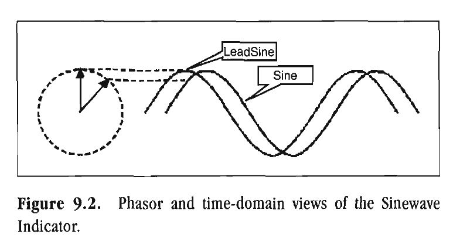
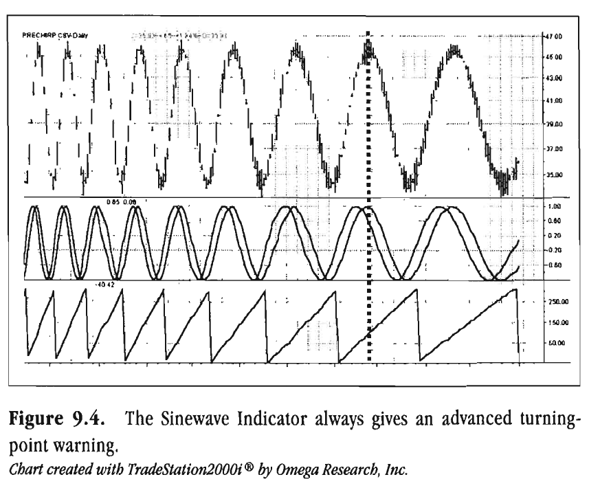
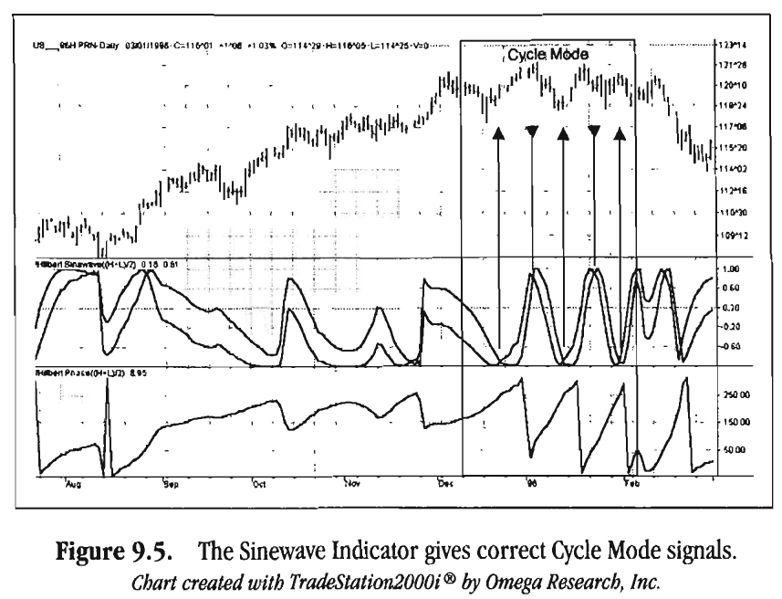

# THE SINEWAVE INDICATOR

A painter can hang his pictures,
but a writer can only hang himself.
-EDWARD DAHLBERG

As noted in Chapter 6, the Hilbert Transform synthesizes the
Inphase and Quadrature components from the analytic waveform. We can then immediately compute the phase of the signal
by taking the arctangent of the ratio of these components. In
principle, that should tell us where we are positioned within the
cycle. Unfortunately, this is not true. The first problem is that
the Hilbert Transform induces a lag of 7 bars. That lag is a substantial portion of most tradable cycles. The second problem is
that even that phase measurement is typically very noisy,
requiring many more bars of data to be used. The lag thus renders the phase measurement made directly from the Hilbert
Transform unusable.
However, the Hilbert Transform can be used to measure the
dominant cycle period. Since the dominant cycle period is a
slowly varying function of time, the lag of this measurement is
often acceptable. We assume this to be the case for our analyses.
Knowing the dominant cycle period, we can heterodyne the perfect dominant cycle with the original price data. Heterodyning
produces the sum and difference frequencies. Since both the
price data and the dominant cycle have the same frequency, we
can isolate the direct current (DC, or zero frequency) component
by filtering. This process gives the phase of the dominant cycle

without lag. Thus, we can compute indicators having zero lag
from this information.
The EasyLanguage code to measure dominant cycle phase is
described with reference to Figure 9.1. The majority of the code
computes the Hilbert Transform and finds the dominant cycle
period using the preferred Homodyne Discriminator. The phase
computation part of the code begins with a comment line as a
flag. The first step is to smooth the price data. Any components
having a cycle period less than 6 bars are not desired and should
be removed before the computations commence. We remove
them by employing a 4-bar Weighted Moving Average (WMA).
The WMA introduces 1 bar of lag that we will want to remove
by compensation later in the calculations. Next, the smoothed
data are multiplied by the real (cosine) component of the dominant cycle and independently by the imaginary (sine) component of the dominant cycle. The products are summed then over
one full dominant cycle. We compute the phase angle as the arctangent of the ratio of the imaginary part to the real part. The
phase increases from left to right across the chart. A 90-degree
reference shift is immediately introduced. Next, we must
remove the 1-bar lag that was introduced by the smoothing of
the price. This is done by adding the phase corresponding to a
1-bar lag of the smoothed dominant cycle period.
Finally, the phase ambiguity is removed for those cases where
the imaginary part is less than zero, providing a 360-degree phase
presentation. Normally, we think of the phase as going from 0 to
360 degrees and then repeating for the next cycle. However, we
perform the cycle wraparound at 315 degrees because there is a
tendency for the phase to be near 0 degrees when the market is in
a downtrend. If the wraparound were at 360 degrees, the swing
from the bottom of the subgraph to the top provides less than a
pleasing display.
The way the phase display behaves in a Trend Mode can
potentially provide some useful information to a trader. First,
phase tends to stop advancing when the market is in a Trend
Mode. That is, there is no rate of change and, therefore, no cycle.
The phase tends to rest near 180 degrees when the market is in
an uptrend and tends to rest near 0 degrees when the market is


```easylanguage
Inputs: Price ( (H+L)/ 2) ;
Vars : Smooth (0) ,
Detrender (0) ,
I1 (01,
Q1 (0) ,
jI (01,
jQ(0)
I2 (01,
Q2 (01,
Re (0) ,
Im(0)
Period (0) ,
SmoothPeriod (0 ) ,
SmoothPrice (0 ,
DCPeriod (0) ,
RealPart (0) ,
ImagPart (0) ,
count (0)
DCPhase (0) ;
If CurrentBar > 5 then begin
Smooth = (4*Price + 3*Price [l]+ 2*Price[21 +
~rice[3]) / 10;
Detrender = (.0962*Smooth + .5769*Smooth[21 -
.5769*Smooth [4-] .0962*Smooth [6*l () . 075*
Periodrl] + .54);
{Compute Inphase and Quadrature components}
Q1 = (. 0962*Detrender + .5769*Detrender [2]-
.5769*Detrender [4-] .0962*Detrender [6*l () . 075*
Period[l] + .54);
I1 = Detrender [3;]
{Advance the phasoef I1 and Q1 by 90 degrees}
jI = ( .0962*11 + .5769*11[2] - .5769*11[4] -
.0962*11[6]) * ( .075*Period[ll + .54);
jQ = (.0962*Q1 + .5769*Q1 L21 - .5769*Q1[41 -
.0962*Q1[6] ) * ( .075*Period [l+] .54);

{Phasor addition for 3 bar averaging)}
I2 = I1 - jQ;
Q2 = Q1 + jI;
{Smooth the I and Q components before applying
the discriminator}
I2 = .2*12 + .8*12 [l;]
Q2 = .2*Q2 + .8*Q2 [l;]
{Homodyne Discriminator}
Re = I2*12 [l+] Q2*Q2 [l;]
Im = I2*Q2 [l]- Q2*12 [l;]
Re = .2*Re + .8*Re [l;]
Im = .2*Im + .8*Im[l] ;
If Im c> 0 and Re c> 0 then Period=
36 0/ ArcTangent ( Im/Re) ;
If Period
1.5*Period[l] then Period=
1.5*Period [;l ]
If Period c .67*Period[l] then Period=
.67*Period [;l ]
If Period c 6 then Period = 6;
If Period > 50 then Perio=d 50;
Period = .2*Period + .8*Period[l];
SmoothPeriod = .33*Period + .67*SmoothPeriod[l];
{Compute Dominant Cycle Phase}
SmoothPrice = (4*Price + 3*Price[l] + 2*Price[2] +
Price[31) / 10;
DCPeriod = IntPortion(SmoothPeriod + .5);
RealPart = 0;
ImagPart = 0;
For count = 0 To DCPeriod - 1 begin
RealPart = RealPart + Cosine(360 * count /
DCPeriod) * (SmoothPrice [coun)t ;]
ImagPart = ImagPart + Sine(360 * count /
*
DCPeriod) (SmoothPrice [coun)t ;]
End;
If AbsValue(Rea1Part) > 0.001 then DCPhase =
Arctangent(1magPart / Realpart);
If AbsValue(RealPart1 c= 0.001 then DCPhase= 90 *
Sign ( ImagPart) ;
DCPhase = DCPhase + 90;

{Compensate for one bar lag of the Weighted
Moving Average}
DCPhase = DCPhase + 360 / SmoothPeriod;
If ImagPart e 0 then DCPhase = DCPhase + 180;
If DCPhase > 315 then DCPhase = DCPhase - 360;
Plot1 (DCPhase, "Phase") ;
End ;
```

in a downtrend. The reason for this is that although the price
data have been detrended, there is still some residual trend
across the 6 bars of the Detrender. The summation of the product of the pure trend to the complex components of the dominant cycle can be thought of as similar to the integrals
2π
Im = ∫ x Sin(x)dx = -2π
2π
Re = ∫ x Cos(x)dx = 0
The ratio of the RealPart to the Imaginary will always be a
small number when the market is in a Trend Mode. However,
the sign of that number will be negative when the market is in
an uptrend and positive when the market is in a downtrend. As
a result, the phase will be near 180 degrees in uptrending markets and near 0 degrees in downtrending markets.
We obtain the Sinewave Indicator by plotting the sine of the
measured phase angle. This gives us an oscillator that always
swings between the limits of -1 and +1. We enhance the usability of this oscillator by plotting the sine of the phase angle
advanced by 45 degrees. The effect of plotting these two lines is
shown for both the phasor and time-domain presentations in



*Figure 9.2. Phasor and time-domain views of the Sinewave*

Indicator.
The 45-degree slant to the vertical position. This phase advance
means the LeadSine waveform will crest before the sine crests.
The LeadSine and Sine lines cross 22.5 degrees, or 1/16th of a
cycle, before the turning point of the cycle is reached. If the market has a cycle of 16 bars or less, this is a signal to enter or exit a
trade immediately. If the market has a longer cycle, there is
some built-in anticipation time before you pull the trigger.
Compared to conventional oscillators such as the Stochastic
or Relative Strength Indicator (RSI), the Sinewave Indicator has
two major advantages. These are
1. The Sinewave Indicator anticipates the Cycle Mode turning
point rather than waiting for confirmation.
2. The phase does not advance when the market is in a Trend
Mode. Therefore, the Sinewave Indicator tends to not give
false whipsaw signals when the market is in a Trend Mode.
An additional advantage is that the anticipation signal is obtained strictly by mathematically advancing the phase. Momentum is not employed. Therefore, the Sinewave Indicator signals
are no more noisy than the original signal.
The code to compute and display the Sinewave Indicator is
given in Figure 9.3. This EasyLanguage code is identical to the code
given for the phase in Figure 9.1 except for the plot statements.
The Phase and Sinewave Indicators are plotted against both
theoretical analytic waveforms and real-world data to demon-


```easylanguage
Inputs: Price ( (H+L)/ 2) ;
Vars: Smooth(0),
Detrender (0)
I1 (0)
Q1 (01,
jI (01,
jQ(01,
I2 (0) ,
Q2 (01,
Re (01,
Im(O),
Period (0) ,
SmoothPeriod (0) ,
SmoothPrice (0) ,
DCPeriod (0) ,
RealPart (0) ,
ImagPart (0) ,
count (0) ,
DCPhase (0) ;
If CurrentBar > 5 then begin
Smooth = (4*Price + 3*Price [l]+ 2*Price[2] +
Price[3]) / 10;
Detrender = (.0962*Smooth + .5769*Smooth[2] -
.5769*Smooth [4-] .0962*Smooth [6*1 () . 075*
Period[l] + .54);
{Compute Inphase and Quadrature components}
Q1 = (.0 962*Detrender + .5769*Detrender [2-]
.5769*Detrender [4-] .0962*Detrender [6*l )
( .075*Period [l1 + .54);
I1 = Detrender [31 ;
{Advance the phase of I1 and Q1 by 90 degrees}
jI = (.0 962*11 + .5769*11 [2]- .5769*11[4] -
.0962*11[6] ) * ( .075*Period [l+] .54);
jQ = (.0 962*Q1 + .5769*Q1 [2]- .5769*Q1[4] -
.0962*Q1[6]) * (.0 75*Period[ll + .54);
{Phasor addition fo3r bar averaging)}
I2 = I1 - jQ;
Q2 = Q1 + jI;

{Smooth the I and Q components before applying
the discriminator}
I2 = .2*12 + .8*12 [;l ]
Q2 = .2*Q2 + .8*Q2 [l] ;
{Homodyne Discriminator}
Re = I2*12 [l] + Q2*Q2 [l;]
Im = I2*Q2 [l]- Q2*12 [l;]
Re = .2*Re + .8*Re [l] ;
Im = .2*Im + .8*Im[l] ;
If Im c> 0 and Re c> 0 then Period =
360/ArcTangent (Im/Re);
If Period > 1.5*Period[ll then Period=
1.5*Period [l] ;
If Period c .67*Period[ll then Period=
.67*Period [;l ]
If Period c 6 then Period= 6;
If Period > 50 then Period= 50;
Period = .2*Period + .8*Period[ll;
SmoothPeriod = .33*Period + .67*SmoothPeriod[ll;
{Compute Dominant Cycle Phase}
SmoothPrice = (4*Price + 3*Price[ll + 2*Price[21 +
Pricer31 1 / 10;
DCPeriod = IntPortion(SmoothPeriod + .5);
RealPart = 0;
ImagPart = 0;
For count = 0 To DCPeriod- 1 begin
RealPart = RealPart + Cosine(360 * count /
DCPeriod) * (SmoothPrice [coun)t ;]
ImagPart = ImagPart + Sine(360 * count /
DCPeriod) * (SmoothPrice [coun)t ;]
End ;
If AbsValue(Rea1Part) > 0.001 then DCPhase=
Arctangent(1magPart / Realpart);
If AbsValue(Rea1Part) c= 0.001 then DCPhase= 90 *
Sign ( ImagPart) ;
DCPhase = DCPhase + 90;

{Compensate for one bar lag of the Weighted
Moving Average}
DCPhase = DCPhase + 360 / SmoothPeriod;
If ImagPart c 0 then DCPhase = DCPhase + 180;
If DCPhase > 315 then DCPhase = DCPhase - 360;
Plot1 (Sine (DCPhas,e )" Sine") ;
plot2 (Sine (DCPhas+e 45) , "Leadsine" ;
End ;
```

strate their performance. Figure 9.4 shows a theoretical sinewave
analytic waveform whose period increases linearly from 10 to 40
bars. The Sinewave and Phase Indicators are displayed in the two
subgraphs. Note how the phase rate of change decreases as the
cycle period becomes longer. The dotted line is a typical point of
reference, illustrating that the analytic waveform and the Sine
line of the Sinewave Indicator crest simultaneously, and the
measured phase is 90 degrees at this point. The Leadsine always
crosses the Sine line before the turning point in the cycle, giving
advance indication of the cyclic turning point. The amount of
advance warning relative to the length of the cycle is less for the
shorter cycles.
A real-world trading scenario is depicted in Figure 9.5. The
market is in a Trend Mode for nearly the entire left half of the
chart, as identified by the lack of phase rate of change and lack of
crossovers by the Sinewave Indicator. The Cycle Mode of the
chart is identified by the rectangle. The Cycle Mode starts when
the phase rate of change is approximately the same as the phase
rate of change of the dominant cycle. The Cycle Mode ends when
the phase rate of change becomes negative-a clear impossibility.
During the Cycle Mode period, the Sinewave Indicator gives
three buy signals and two sell signals. All are excellent except the
last one, which almost always happens when the cycle fails.

Rocket Science for Traders


*Figure 9.4. The Sinewave Indicator always gives an advanced turning-*

point warning.
Chart created with TradeStation 2000i by Omega Research, Inc.


*Figure 9.5. The Sinewave Indicator gives correct Cycle Mode signals.*

Chart created with TradeStation 2000i by Omega Research, Inc.

Key Points to Remember
The phase computed from the Hilbert Transform cannot be
used directly because of the lag that results from computing.
The cycle period measurement is a slowly varying function
of time and may be used as the dominant cycle.
The phase of the dominant cycle is computed by heterodyning the complex dominant cycle with the smoothed analytic
waveform and taking the arctangent of the complex components.
The phase hovers near 0 degrees in downtrends and near 180
degrees in uptrends.
The Sinewave Indicator consists of the Sine of the Dominant
Cycle phase and the Sine of the Dominant Cycle phase
advanced by 45 degrees (Leadsine).
The Sinewave Indicator gives entry and exit signals 1/16th of
a cycle period in advance of the cycle turning point.
The Sinewave Indicator seldom gives false whipsaw signals
when the market is in a Trend Mode.
