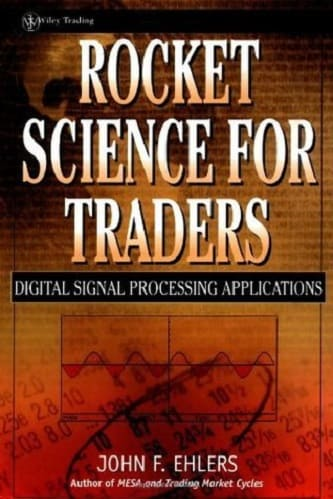

# Rocket Science for Traders: Digital Signal Processing Applications



**Author:** John F. Ehlers

**Year:** 2001

## BibTeX

```bibtex
@Book{ehlers2001rocket,
  author    = {Ehlers, John F.},
  title     = {Rocket Science for Traders: Digital Signal Processing Applications},
  publisher = {Wiley},
  year      = {2001},
  series    = {Wiley Trading},
  isbn      = {9780471405672},
}
```

## Chapters

1. [Introduction to the Science of Digital Signal Analysis](ch1.md)
2. [Market Modes](ch2.md)
3. [Moving Averages](ch3.md)
4. [Momentum Functions](ch4.md)
5. [Complex Variables](ch5.md)
6. [Hilbert Transforms](ch6.md)
7. [Measuring Cycle Periods](ch7.md)
8. [Signal-to-Noise Ratio](ch8.md)
9. [The Sinewave Indicator](ch9.md)
10. [Instantaneous Trendline](ch10.md)
11. [Identifying Market Modes](ch11.md)
12. [Designing a Profitable Trading System](ch12.md)
13. [Transform Arithmetic](ch13.md)
14. [Finite Impulse Response Filters](ch14.md)
15. [Infinite Impulse Response Filters](ch15.md)
16. [Removing Lag](ch16.md)
17. [MAMA — The Mother of Adaptive Moving Averages](ch17.md)
18. [Ehlers Filters](ch18.md)
19. [Measuring Market Spectra](ch19.md)
20. [Optimum Predictive Filters](ch20.md)
21. [What You See Is What You Get](ch21.md)
22. [Making Standard Indicators Adaptive](ch22.md)
