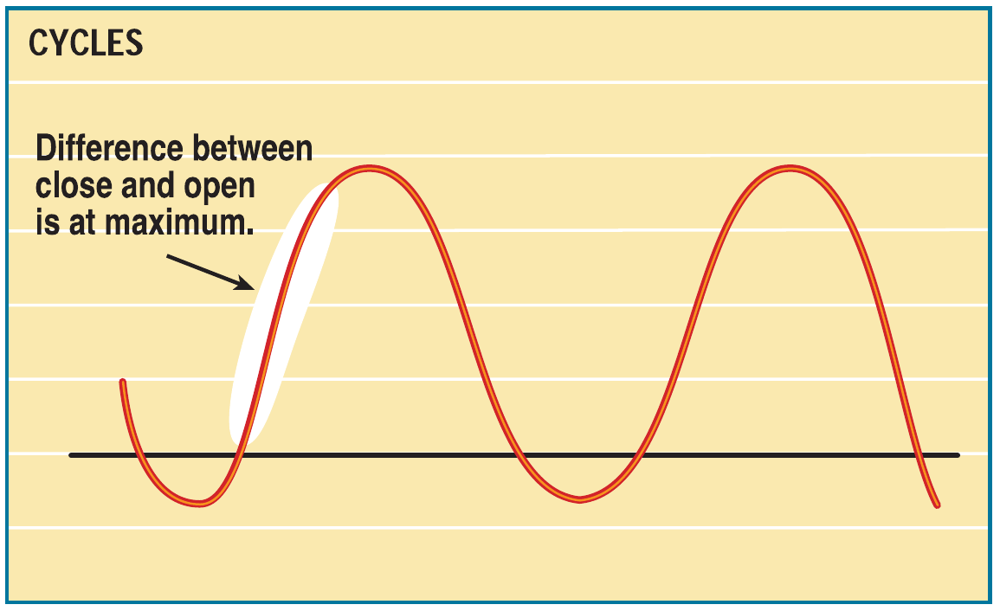
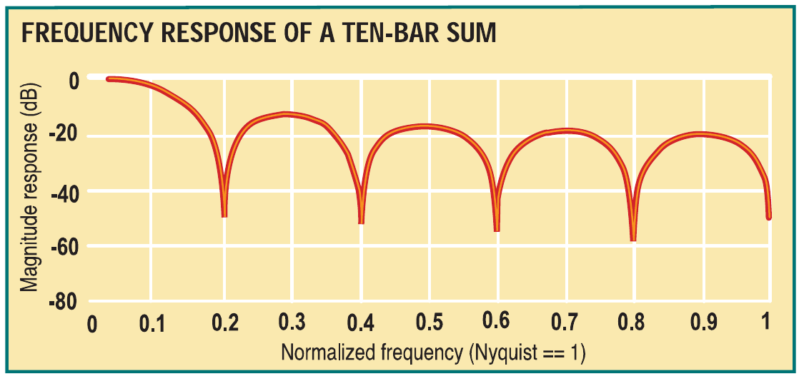
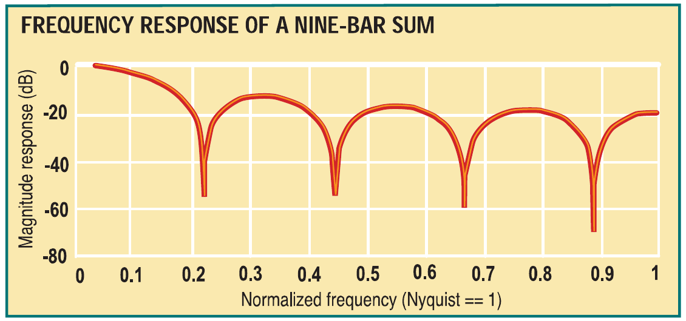
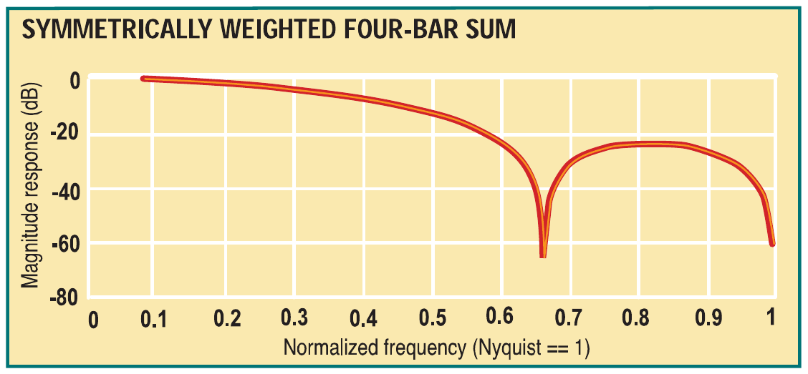
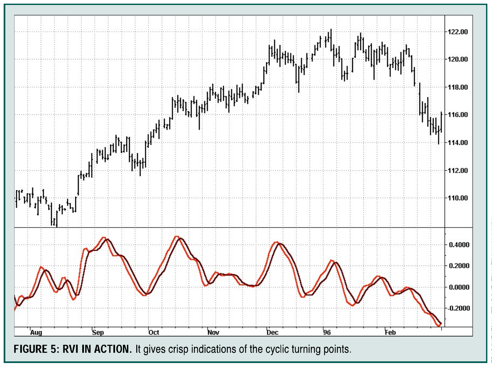

# Relative Vigor Index (RVI)

- **Author:** John F. Ehlers
- **Publication:** Technical Analysis of STOCKS & COMMODITIES, Volume 20:1, January 2002, pp. 16-20
- **Article URL:** [Article PDF](https://technical.traders.com/archive/article.asp?file=\V20\C01\003RVI.pdf)
- **Traders' Tips URL:** [Traders' Tips, January 2002](https://www.traders.com/Documentation/FEEDbk_docs/2002/01/TradersTips/TradersTips.html)

---

## *Something Old, Something New*

**Here's an old concept brought to light using modern filters to make it a practical, useful indicator.**

Since the inception of STOCKS & COMMODITIES (happy 20th anniversary year!), there have been several developments in technical analysis that have merged old concepts with new technologies. Like the magazine itself, the indicator discussed here will also be merging the old and new. The *relative vigor index* (RVI) uses concepts dating back to the beginning of this magazine and also uses modern filter and digital signal processing theory to realize those concepts as a practical and useful indicator.

The idea behind the RVI is basic — prices tend to close higher than they open in up markets and close lower than they open in down markets. The vigor, or energy, of the move is thus established by where the prices end up at the close. To normalize the index to the daily trading range, divide the change of price by the maximum range of prices for the day. Thus, the basic equation for the RVI is:

$$\text{RVI} = \frac{\text{Close} - \text{Open}}{\text{High} - \text{Low}}$$

As you can see, the formula resembles that of an oscillator.

## HISTORICAL PERSPECTIVE

In 1972, Jim Waters and Larry Williams published a description of their accumulation/distribution oscillator. They defined *buying power* (BP) and *selling power* (SP) as:

$$\text{BP} = \text{High} - \text{Open}$$
$$\text{SP} = \text{Close} - \text{Low}$$

in which prices were the open, high, low, and closing prices for the day. The two values, BP and SP, show the additional buying strength relative to the open and the selling strength relative to the close to obtain an implied measure of the day's trading. They combined the two and referred to it as the *daily raw figure* (DRF), which is calculated as:

$$\text{DRF} = \frac{\text{BP} + \text{SP}}{2 \times (\text{High} - \text{Low})}$$

When the low of the trading day is at the open and the close is at the high, the maximum value of 1 is reached.


**FIGURE 1: The difference between the close and open is at a maximum at the ascending area of the cycle.**

Conversely, the minimum value of zero is reached when the market opens trading at the high and closes at the low. When you're evaluating day-to-day movement, it causes the DRF to vary radically, making it difficult to apply. This makes it necessary to smooth the results. Before doing so, however, you need to expand the equation as follows:

$$\text{DRF} = \frac{1}{2} \left[\frac{(\text{High} - \text{Open} + \text{Close} - \text{Low})}{(\text{High} - \text{Low})}\right]$$

$$= \frac{1}{2} \left[\frac{(\text{High} - \text{Low} + \text{Close} - \text{Open})}{(\text{High} - \text{Low})}\right]$$

$$= \frac{1}{2} \left[1 + \frac{(\text{Close} - \text{Open})}{(\text{High} - \text{Low})}\right]$$

Clearly, the equation for DRF is identical to the daily RVI expression, with the only difference being the additive and multiplicative constants. However, the RVI is easier to smooth using modern filter theory. That is where modernization comes in.

## SMOOTHING

Since the RVI is an oscillator, you need only be concerned with the cycle modes of the market in its use (Figure 1). The sharpest rate of change for a cycle is at its midpoint. Therefore, in the ascending part of the cycle you would expect the difference between the close and open to be at a maximum. When looking at an oscillator you would prefer to have the indicator be in the same phase as the cyclical movement of price action; that is, you don't want the indicator to lead or lag. But as you have probably experienced, there is always a lag. That lag can be measured to create an oscillator that is in phase with the cyclical price movements.

Taking price differences is analogous to taking a derivative in calculus. Thus, if the prices are varying in a sinusoidal manner, the phase of the cycle is advanced by a quarter cycle. Calculus also makes it evident that if you integrate a sine wave over a half-cycle period, the resultant is another sine wave delayed by a quarter cycle. Summing over a half cycle is basically the same as a mathematical integration, with the result being the waveshape of the sum is delayed by a quarter wavelength relative to the input. This is exactly the delay required to produce an oscillator output to be in phase with the cyclical component of the prices. There are software programs such as the Hilbert discriminator or MESA that can measure the cycle period.

If you don't have software that measures the cycle, you can sum the RVI components over a fixed default period. I would suggest using a nominal value of 10, because it is approximately half the period of most cycles of interest. Once that is done, you can smooth the RVI over half the length of the measured dominant cycle.

The smoothing realized by summing over 10 bars can be seen in Figure 2. The amplitude of the smoothed output is measured in decibels, showing that the higher frequencies are weaker. The period of the cyclic components can be computed as 2/(normalized frequency). For example, the highest possible normalized frequency is 1, which corresponds to a two-bar cycle. This is because the Nyquist criteria (half the sampling frequency) requires at least two samples per cycle. In the case of a 10-bar sum, the day-to-day two-bar cycle is completely eliminated. This is very desirable for smoothing. But if you choose to sum over nine bars rather than the original 10, you get the frequency response shown in Figure 3.


**FIGURE 2: The two-bar cycle is eliminated. Frequencies 0.2, 0.4, 0.6, 0.8, and 1.0 are unwanted frequencies.**


**FIGURE 3: The two-bar cycle is not eliminated.**

One notch frequency is $2/3 = 0.67$ frequency. A 2.25-bar cycle is also notched out $(2/2.25 = 0.889)$, as is a 4.5-bar cycle $(2/4.5 = 0.444)$ and so forth. In this case, the two-bar cycle is weaker only by about 20 dB. If you use a nine-bar cycle, you will completely notch out three bars. This suggests the two-bar cycle is completely eliminated in the summing process only when the summing length is an even number. You should then use a symmetrically weighted *finite impulse response* filter (FIR) of fixed length in addition to the summing length to guarantee elimination of both the two-bar and three-bar cycle components.

If you are using a dominant cycle measurement to determine the summing length, you have little control over whether that length is even or odd. You should then use a symmetrically weighted *finite impulse response* filter (FIR) of fixed length guaranteed to eliminate both the two-bar and three-bar cycle components. Such a filter has the coefficients:

$$C = [1 \quad 2 \quad 2 \quad 1] / 6$$

The denominator is a sum of the coefficients of the numerator. By dividing by the sum of the coefficients of an FIR filter, the zero frequency gain is guaranteed to be unity — a standard normalization procedure.

The concise MatLab notation or EasyLanguage notation (where [1] denotes the value one bar ago) is:

```
Output = (input + 2*input[1] + 2*input[2] + input[3])/6
```

The frequency response of the symmetrically weighted FIR filter, shown in Figure 4, demonstrates both the two-bar and three-bar cycle components are completely rejected.


**FIGURE 4: Both the two- and three-bar cyclic components are eliminated.**

An example of the RVI can be seen in Figure 5. The responsiveness and clarity of the signals are self-explanatory.


**FIGURE 5: RVI IN ACTION. It gives crisp indications of the cyclic turning points.**

## CONCLUSION

Calculating the RVI is straightforward. The numerator, consisting of the close – open, is filtered in the four-bar weighted single moving average (SMA). The denominator, consisting of the high – low, is independently filtered in a four-bar weighted SMA. The numerator and denominator are then independently summed over an approximate half dominant cycle period. A summation length of 10 bars can be used as a default if the cycle measurements are not available. The RVI is then computed as the ratio of the numerator to the denominator.

The rules for the use of the RVI are flexible. It is an oscillator basically in phase with the cyclic component of the market prices. I prefer crossing line indicators because they are unambiguous in their signals. Since the lag of an N-bar SMA is (N-1)/2, if we take a four-bar symmetrically weighted average of the RVI, we create a trailing trigger signal that trails by only 1.5 bars. Essentially, the RVI finds the dominant cycle with a signal that eliminates the high frequencies and takes out the lag or lead.

*John F. Ehlers, Box 1901, Goleta, CA 93116, is an electrical engineer working in electronic research and development and has been a private trader since 1978. He is a pioneer in introducing maximum entropy spectrum analysis to technical traders through his MESA software.*

---

†See Traders' Glossary for definition

---

## EASYLANGUAGE CODE

### Relative Vigor Index (RVI)

Copyright (c) 2001 MESA Software

```easylanguage
Inputs:    Length(10);

Vars:      Num(0),
           Denom(0),
           count(0),
           RVI(0),
           RVISig(0);

Value1 = ((Close - Open) + 2*(Close[1] - Open[1]) +
          2*(Close[2] - Open[2]) + (Close[3] - Open[3]))/6;
          
Value2 = ((High - Low) + 2*(High[1] - Low[1]) +
          2*(High[2] - Low[2]) + (High[3] - Low[3]))/6;

Num = 0;
Denom = 0;

For count = 0 to Length -1 begin
    Num = Num + Value1[count];
    Denom = Denom + Value2[count];
End;

If Denom <> 0 then RVI = Num / Denom;

RVISig = (RVI + 2*RVI[1] + 2*RVI[2] + RVI[3])/6;

Plot1(RVI, "RVI");
Plot2(RVISig, "Sig");
```

—*J.F.E.*

---

## BibTeX

```bibtex
@article{ehlers_2002_rvi,
  author = {John F. Ehlers},
  title = {Relative Vigor Index (RVI): Something Old, Something New},
  journal = {Technical Analysis of STOCKS \& COMMODITIES},
  volume = {20},
  number = {1},
  pages = {16--20},
  month = {January},
  year = {2002},
  url = {https://technical.traders.com/archive/article.asp?file=\V20\C01\003RVI.pdf},
  note = {INDICATORS -- Something Old, Something New}
}

@misc{traders_tips_2002_01,
  author = {{Technical Analysis of STOCKS \& COMMODITIES}},
  title = {Traders' Tips: Relative Vigor Index, January 2002},
  howpublished = {online},
  month = {January},
  year = {2002},
  url = {https://www.traders.com/Documentation/FEEDbk_docs/2002/01/TradersTips/TradersTips.html}
}
```
